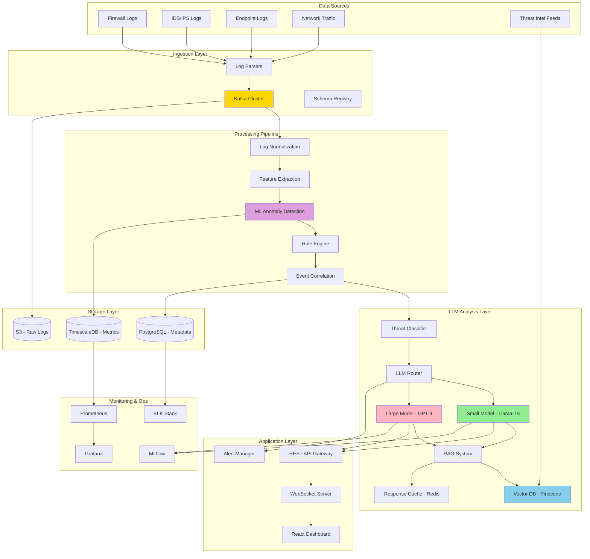
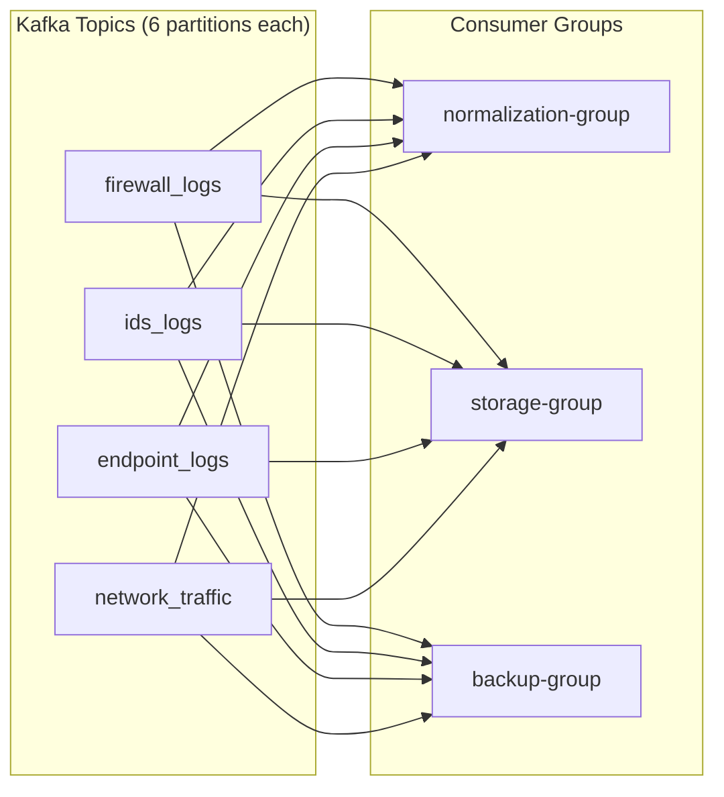
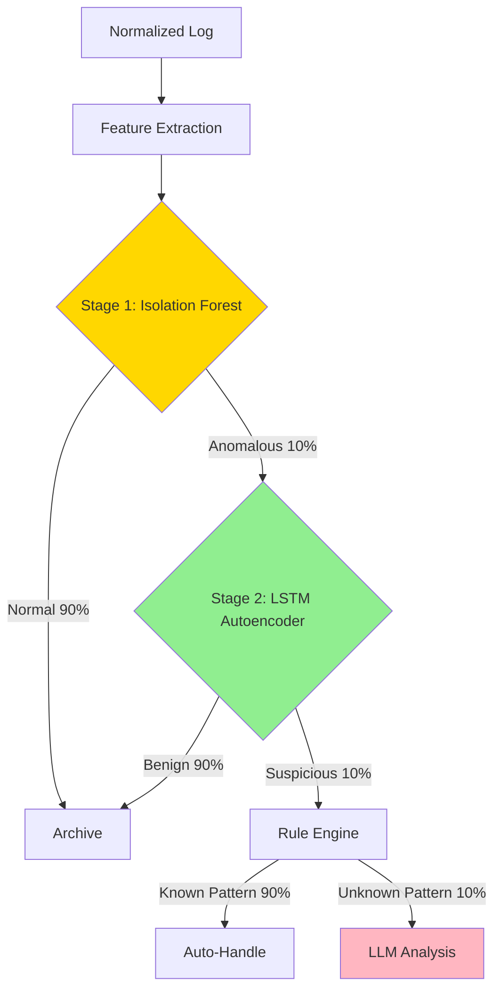
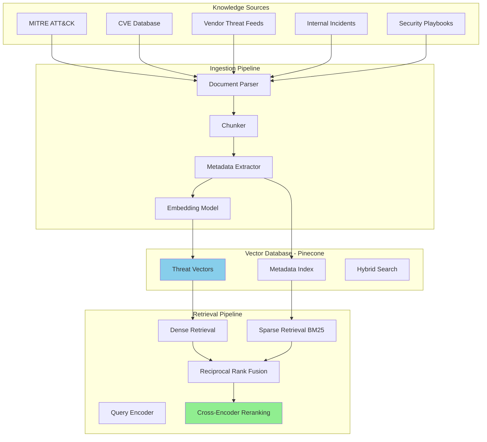

# LLM System Design Examples for Cisco Interview - Enhanced Edition

## Design Template - Use this structure for any system design question

### Interview Time Allocation (45 minutes total)

| Phase | Time | Focus |
|-------|------|-------|
| 1. Requirements Gathering | 5-7 min | Clarify functional/non-functional requirements |
| 2. High-Level Architecture | 10-12 min | Draw components, explain data flow |
| 3. Deep Dive | 20-25 min | Detail 2-3 critical components, discuss trade-offs |
| 4. Evaluation & Monitoring | 5-8 min | Metrics, failure modes, monitoring strategy |

### Key Success Factors

1. **Ask Clarifying Questions First** - Never assume requirements
2. **Start Simple, Then Scale** - Begin with basic architecture, then add complexity
3. **Quantify Everything** - Use numbers (QPS, latency, cost, scale)
4. **Discuss Trade-offs** - Every design decision has pros/cons
5. **Think Production** - Monitoring, failure modes, cost optimization

---

# Example 1: LLM-Based Cybersecurity Threat Detection System

## Problem Statement

Design a real-time cybersecurity threat detection system that uses LLMs to analyze security logs, network traffic, and threat intelligence to detect and explain potential security threats for enterprise networks (Fortune 500 scale).

## 1. Requirements Gathering

### Functional Requirements

**Core Capabilities:**
- Ingest security logs from multiple sources (firewalls, IDS/IPS, endpoints, network traffic)
- Analyze logs in near real-time (< 1 minute end-to-end latency)
- Detect anomalies and potential security threats
- Generate natural language explanations of threats for SOC analysts
- Provide actionable mitigation recommendations
- Support interactive queries: "What are the current threats?", "Explain this alert"
- Correlate events across multiple sources
- Integration with existing SIEM systems

**Advanced Features:**
- Automated threat hunting
- Threat intelligence enrichment
- Incident timeline reconstruction
- MITRE ATT&CK framework mapping

### Non-Functional Requirements

**Scale:**
- 10M security events/day (116 events/second average, 500 events/second peak)
- 1000 concurrent SOC analysts
- 100K+ threats in knowledge base
- 10K queries/day

**Performance:**
- Log ingestion: < 5 seconds from source to ingestion
- Anomaly detection: < 100ms per event
- LLM inference: < 2 seconds for simple threats, < 5 seconds for complex
- End-to-end threat analysis: < 1 minute (p95)
- Query response: < 1 second

**Reliability:**
- 99.9% system availability (8.76 hours downtime/year max)
- No data loss (logs must be persisted)
- Graceful degradation when LLM service is down

**Cost:**
- Target: < $50K/month operating cost
- Minimize LLM API calls through intelligent filtering

**Security & Compliance:**
- On-premise deployment option (sensitive security data)
- End-to-end encryption
- SOC 2 Type II compliance
- RBAC for user access
- Audit logging

### Assumptions & Constraints

**Assumptions:**
- Logs are already collected by existing SIEM (Splunk, QRadar, Sentinel)
- Historical threat data available (1 year minimum)
- Network traffic captured by sensors/packet brokers
- SOC team has threat intelligence subscriptions (MITRE, vendor feeds)

**Constraints:**
- Cannot modify existing log collection infrastructure
- Must integrate with existing ticketing system (ServiceNow, Jira)
- On-premise deployment required for sensitive data
- Limited GPU resources (8x A100 80GB max)

### Clarifying Questions for Interviewer

1. **Scale**: What's the peak event rate? Any seasonality patterns?
2. **Data Retention**: How long must we keep raw logs vs analyzed threats?
3. **Latency**: Is 1 minute acceptable for all threat severities, or do critical threats need faster response?
4. **False Positives**: What's acceptable false positive rate? (Alert fatigue is major problem)
5. **Integration**: Which SIEM system? REST API available?
6. **Model**: Can we use cloud LLM APIs or must be on-premise?

## 2. High-Level Architecture



### Data Flow Explanation

**1. Ingestion Flow (Events/Second: 116 avg, 500 peak)**
```
Firewall/IDS/Endpoint Logs → Log Parsers → Kafka Topics
                                              ↓
                            Schema Validation (Avro)
                                              ↓
                            Consumer Groups (Parallel Processing)
```

**2. Processing Flow (90% filtered before LLM)**
```
Raw Logs (10M/day)
    ↓
Normalization → Unified Schema
    ↓
Feature Extraction → Statistical + Temporal + Behavioral
    ↓
ML Anomaly Detection (Isolation Forest) → 1M anomalous events (90% filtered)
    ↓
Rule Engine (Known Patterns) → 100K suspicious events (99% filtered)
    ↓
Event Correlation → 10K correlated incidents
    ↓
LLM Analysis → Threat explanations
```

**3. LLM Inference Flow (Tiered Architecture)**
```
Suspicious Event
    ↓
Threat Classifier (Simple vs Complex)
    ├─ Simple (80%) → Llama-7B (Quantized, On-Premise)
    └─ Complex (20%) → GPT-4 (API, High Quality)
    ↓
RAG Retrieval (Top-5 similar threats from Vector DB)
    ↓
LLM Generation (Explanation + Recommendations)
    ↓
Response Cache (Redis, 1-hour TTL)
    ↓
SOC Analyst Dashboard
```

### Technology Stack Decisions

| Component | Technology | Why? | Alternative Considered |
|-----------|-----------|------|----------------------|
| Message Queue | Apache Kafka | High throughput, durability, replay | RabbitMQ (lower throughput) |
| Stream Processing | Apache Flink | Stateful processing, exactly-once | Spark Streaming (higher latency) |
| Vector DB | Pinecone | Managed, low latency, hybrid search | Weaviate (self-hosted complexity) |
| LLM Serving | vLLM | Continuous batching, high throughput | TGI (less mature) |
| Small Model | Llama-70B (quantized) | Good quality, fits 1x A100 | Mistral-7B (lower quality) |
| Large Model | GPT-4 Turbo | Best quality for complex threats | Claude 3 Opus (higher cost) |
| Cache | Redis | Low latency, TTL support | Memcached (no persistence) |
| Metadata DB | PostgreSQL | ACID, complex queries | MongoDB (eventual consistency) |
| Time-series DB | TimescaleDB | SQL-compatible, good compression | InfluxDB (different query language) |
| Monitoring | Prometheus + Grafana | Industry standard, rich ecosystem | Datadog (higher cost) |

## 3. Deep Dive into Key Components

### 3.1 Data Ingestion & Kafka Architecture

**Kafka Cluster Configuration:**



**Kafka Configuration:**
```python
# Kafka Topic Configuration
topics = {
    'firewall_logs': {
        'partitions': 6,  # Parallelism
        'replication_factor': 3,  # Fault tolerance
        'retention_ms': 86400000,  # 24 hours
        'compression_type': 'snappy',  # 2-3x compression
        'max_message_bytes': 1048576  # 1MB
    }
}

# Producer Configuration (in log parsers)
producer_config = {
    'acks': 'all',  # Wait for all replicas
    'retries': 3,
    'batch_size': 16384,  # Batch for efficiency
    'linger_ms': 10,  # Wait 10ms to batch
    'compression_type': 'snappy',
    'enable_idempotence': True  # Exactly-once
}

# Consumer Configuration
consumer_config = {
    'group_id': 'normalization-group',
    'auto_offset_reset': 'earliest',
    'enable_auto_commit': False,  # Manual commit for reliability
    'max_poll_records': 500,  # Batch processing
    'session_timeout_ms': 30000
}
```

**Log Normalization Pipeline:**

```python
from pydantic import BaseModel
from typing import Optional
import hashlib

class NormalizedLog(BaseModel):
    """Unified log schema across all sources"""

    # Identifiers
    log_id: str  # SHA256 hash of raw log
    source_type: str  # firewall, ids, endpoint, network
    source_name: str  # Specific device/sensor name

    # Temporal
    timestamp: int  # Unix timestamp (milliseconds)
    ingestion_time: int

    # Network
    source_ip: Optional[str]
    dest_ip: Optional[str]
    source_port: Optional[int]
    dest_port: Optional[int]
    protocol: Optional[str]  # TCP, UDP, ICMP

    # Event details
    event_type: str  # connection, alert, malware, login, etc.
    event_category: str  # MITRE ATT&CK category
    severity: int  # 1-10

    # Content
    raw_message: str
    normalized_message: str

    # Enrichment
    geo_source: Optional[dict]  # Country, city, ASN
    geo_dest: Optional[dict]
    threat_intel_match: Optional[bool]

    # Metadata
    tags: list[str]
    device_metadata: dict

class LogNormalizer:
    """Normalize logs from heterogeneous sources"""

    def __init__(self):
        self.parsers = {
            'cisco_asa': self.parse_cisco_asa,
            'palo_alto': self.parse_palo_alto,
            'snort': self.parse_snort,
            'windows_event': self.parse_windows,
            'zeek': self.parse_zeek
        }
        self.geo_db = GeoIP2Database()
        self.threat_intel = ThreatIntelligenceDB()

    def normalize(self, raw_log: dict) -> NormalizedLog:
        """Main normalization entry point"""

        # Detect source type
        source_type = self.detect_source_type(raw_log)

        # Parse using appropriate parser
        parser = self.parsers.get(source_type)
        if not parser:
            return self.parse_generic(raw_log)

        parsed = parser(raw_log)

        # Enrich with geo data
        if parsed.source_ip:
            parsed.geo_source = self.geo_db.lookup(parsed.source_ip)
        if parsed.dest_ip:
            parsed.geo_dest = self.geo_db.lookup(parsed.dest_ip)

        # Check threat intelligence
        parsed.threat_intel_match = self.check_threat_intel(parsed)

        # Generate log ID
        parsed.log_id = self.generate_log_id(raw_log)

        return parsed

    def parse_cisco_asa(self, log: dict) -> NormalizedLog:
        """Parse Cisco ASA firewall logs"""
        # Example: %ASA-4-106023: Deny tcp src outside:1.2.3.4/12345 dst inside:10.0.0.1/80

        message = log['message']

        # Extract severity
        severity_match = re.search(r'%ASA-(\d)-', message)
        severity = int(severity_match.group(1)) if severity_match else 5

        # Extract IPs and ports
        src_match = re.search(r'src \w+:(\d+\.\d+\.\d+\.\d+)/(\d+)', message)
        dst_match = re.search(r'dst \w+:(\d+\.\d+\.\d+\.\d+)/(\d+)', message)

        return NormalizedLog(
            log_id='',  # Set later
            source_type='firewall',
            source_name=log.get('hostname', 'unknown'),
            timestamp=self.parse_timestamp(log['timestamp']),
            ingestion_time=int(time.time() * 1000),
            source_ip=src_match.group(1) if src_match else None,
            source_port=int(src_match.group(2)) if src_match else None,
            dest_ip=dst_match.group(1) if dst_match else None,
            dest_port=int(dst_match.group(2)) if dst_match else None,
            protocol=self.extract_protocol(message),
            event_type='firewall_deny' if 'Deny' in message else 'firewall_allow',
            event_category=self.map_to_mitre(message),
            severity=severity,
            raw_message=message,
            normalized_message=self.clean_message(message),
            tags=self.extract_tags(message),
            device_metadata=log.get('metadata', {})
        )

    def check_threat_intel(self, log: NormalizedLog) -> bool:
        """Check if IPs/domains match threat intelligence"""
        indicators = []
        if log.source_ip:
            indicators.append(log.source_ip)
        if log.dest_ip:
            indicators.append(log.dest_ip)

        return self.threat_intel.check_indicators(indicators)

    def generate_log_id(self, raw_log: dict) -> str:
        """Generate deterministic ID for deduplication"""
        content = f"{raw_log['timestamp']}:{raw_log['message']}"
        return hashlib.sha256(content.encode()).hexdigest()
```

**Performance Optimization:**

```python
# Batch processing for efficiency
class BatchNormalizer:
    def __init__(self, batch_size=500):
        self.normalizer = LogNormalizer()
        self.batch_size = batch_size

    def process_batch(self, logs: list[dict]) -> list[NormalizedLog]:
        """Process logs in batches for efficiency"""

        # Batch geo lookups (single DB query)
        all_ips = set()
        for log in logs:
            if 'source_ip' in log:
                all_ips.add(log['source_ip'])
            if 'dest_ip' in log:
                all_ips.add(log['dest_ip'])

        geo_cache = self.normalizer.geo_db.batch_lookup(list(all_ips))

        # Batch threat intel checks
        threat_cache = self.normalizer.threat_intel.batch_check(list(all_ips))

        # Normalize with cached lookups
        normalized = []
        for log in logs:
            norm = self.normalizer.normalize(log)
            # Use cached geo data
            if norm.source_ip in geo_cache:
                norm.geo_source = geo_cache[norm.source_ip]
            if norm.dest_ip in geo_cache:
                norm.geo_dest = geo_cache[norm.dest_ip]
            # Use cached threat intel
            norm.threat_intel_match = threat_cache.get(norm.source_ip, False) or \
                                     threat_cache.get(norm.dest_ip, False)
            normalized.append(norm)

        return normalized
```

### 3.2 ML-Based Anomaly Detection

**Why ML Before LLM?**
- **Cost**: LLM calls expensive ($0.01-$0.10 per call)
- **Latency**: LLM inference slow (1-5 seconds)
- **Scale**: Can't run LLM on 10M logs/day
- **Solution**: Use fast ML to filter 99% of logs, send only suspicious events to LLM

**Two-Stage Anomaly Detection:**



**Stage 1: Isolation Forest (Fast, Broad Filter)**

```python
from sklearn.ensemble import IsolationForest
import numpy as np

class Stage1AnomalyDetector:
    """Fast anomaly detection using Isolation Forest"""

    def __init__(self):
        self.model = IsolationForest(
            n_estimators=100,
            contamination=0.1,  # Expect 10% anomalies
            max_samples=256,
            random_state=42,
            n_jobs=-1  # Parallel
        )
        self.feature_extractor = FeatureExtractor()
        self.scaler = StandardScaler()

    def extract_features(self, log: NormalizedLog) -> np.ndarray:
        """Extract features for anomaly detection"""

        features = []

        # Numerical features
        features.append(log.severity)
        features.append(log.source_port or 0)
        features.append(log.dest_port or 0)

        # Categorical (one-hot encoded)
        protocol_encoding = {'TCP': 1, 'UDP': 2, 'ICMP': 3, 'OTHER': 0}
        features.append(protocol_encoding.get(log.protocol, 0))

        # Temporal features
        hour = datetime.fromtimestamp(log.timestamp / 1000).hour
        day_of_week = datetime.fromtimestamp(log.timestamp / 1000).weekday()
        features.append(hour)
        features.append(day_of_week)
        features.append(1 if 9 <= hour <= 17 else 0)  # Business hours

        # IP-based features (requires aggregation window)
        features.append(self.get_source_ip_frequency(log.source_ip))
        features.append(self.get_dest_port_rarity(log.dest_port))
        features.append(1 if log.threat_intel_match else 0)

        # Geo features
        if log.geo_source:
            features.append(1 if log.geo_source['country'] in SUSPICIOUS_COUNTRIES else 0)
        else:
            features.append(0)

        return np.array(features)

    def predict(self, log: NormalizedLog) -> tuple[bool, float]:
        """Predict if log is anomalous"""

        features = self.extract_features(log).reshape(1, -1)
        features_scaled = self.scaler.transform(features)

        # Predict (-1 = anomaly, 1 = normal)
        prediction = self.model.predict(features_scaled)[0]

        # Get anomaly score (lower = more anomalous)
        score = self.model.score_samples(features_scaled)[0]
        anomaly_score = -score  # Invert (higher = more anomalous)

        is_anomalous = prediction == -1

        return is_anomalous, anomaly_score
```

**Stage 2: LSTM Autoencoder (Slow, Precise Filter)**

```python
import torch
import torch.nn as nn

class LSTMAutoencoder(nn.Module):
    """Deep learning model for sequence anomaly detection"""

    def __init__(self, input_dim=20, hidden_dim=64, num_layers=2):
        super().__init__()

        # Encoder
        self.encoder_lstm = nn.LSTM(
            input_size=input_dim,
            hidden_size=hidden_dim,
            num_layers=num_layers,
            batch_first=True,
            dropout=0.2
        )

        # Decoder
        self.decoder_lstm = nn.LSTM(
            input_size=hidden_dim,
            hidden_size=hidden_dim,
            num_layers=num_layers,
            batch_first=True,
            dropout=0.2
        )

        self.output_layer = nn.Linear(hidden_dim, input_dim)

    def forward(self, x):
        # Encode
        _, (hidden, cell) = self.encoder_lstm(x)

        # Repeat hidden state for decoder
        decoder_input = hidden[-1].unsqueeze(1).repeat(1, x.size(1), 1)

        # Decode
        decoder_output, _ = self.decoder_lstm(decoder_input, (hidden, cell))

        # Reconstruct
        reconstruction = self.output_layer(decoder_output)

        return reconstruction

class Stage2AnomalyDetector:
    """Sequence-based anomaly detection for correlated events"""

    def __init__(self, window_size=10):
        self.model = LSTMAutoencoder()
        self.window_size = window_size
        self.threshold = 0.7  # Reconstruction error threshold

        # Load trained model
        self.model.load_state_dict(torch.load('lstm_autoencoder.pth'))
        self.model.eval()

    def create_sequence(self, logs: list[NormalizedLog]) -> torch.Tensor:
        """Create time-windowed sequence"""

        features_list = []
        for log in logs[-self.window_size:]:
            features = Stage1AnomalyDetector().extract_features(log)
            features_list.append(features)

        # Pad if needed
        while len(features_list) < self.window_size:
            features_list.insert(0, np.zeros_like(features_list[0]))

        return torch.FloatTensor(features_list).unsqueeze(0)

    def predict(self, recent_logs: list[NormalizedLog]) -> tuple[bool, float]:
        """Predict if sequence is anomalous"""

        sequence = self.create_sequence(recent_logs)

        with torch.no_grad():
            reconstruction = self.model(sequence)

        # Calculate reconstruction error (MSE)
        error = torch.mean((sequence - reconstruction) ** 2).item()

        is_anomalous = error > self.threshold

        return is_anomalous, error
```

**Feature Store for Real-Time Aggregations:**

```python
from collections import defaultdict
from datetime import datetime, timedelta
import threading

class FeatureStore:
    """Real-time feature aggregation for anomaly detection"""

    def __init__(self, window_minutes=60):
        self.window = timedelta(minutes=window_minutes)
        self.data = defaultdict(list)
        self.lock = threading.Lock()

        # Start cleanup thread
        self.cleanup_thread = threading.Thread(target=self._cleanup_loop, daemon=True)
        self.cleanup_thread.start()

    def record_event(self, log: NormalizedLog):
        """Record event for aggregation"""
        with self.lock:
            key = f"ip:{log.source_ip}"
            self.data[key].append({
                'timestamp': log.timestamp,
                'event_type': log.event_type,
                'dest_port': log.dest_port
            })

    def get_source_ip_frequency(self, source_ip: str) -> int:
        """Get number of events from source IP in window"""
        with self.lock:
            key = f"ip:{source_ip}"
            events = self.data.get(key, [])
            cutoff = int((datetime.now() - self.window).timestamp() * 1000)
            return len([e for e in events if e['timestamp'] >= cutoff])

    def get_dest_port_rarity(self, dest_port: int) -> float:
        """Calculate rarity score for destination port"""
        if not dest_port:
            return 0.0

        # Common ports are less suspicious
        common_ports = {80, 443, 22, 21, 25, 53, 3389}
        if dest_port in common_ports:
            return 0.0

        # High ports (> 49152) are more suspicious
        if dest_port > 49152:
            return 1.0

        return 0.5

    def _cleanup_loop(self):
        """Background thread to remove old events"""
        while True:
            time.sleep(300)  # Every 5 minutes
            self._cleanup_old_events()

    def _cleanup_old_events(self):
        """Remove events outside window"""
        with self.lock:
            cutoff = int((datetime.now() - self.window).timestamp() * 1000)
            for key in list(self.data.keys()):
                self.data[key] = [
                    e for e in self.data[key]
                    if e['timestamp'] >= cutoff
                ]
                if not self.data[key]:
                    del self.data[key]
```

**Performance Metrics:**

```python
# Throughput benchmarks (single node)
"""
Stage 1 (Isolation Forest):
  - Throughput: 10,000 logs/second
  - Latency: 0.1ms per log
  - CPU: ~40% on 8-core machine

Stage 2 (LSTM Autoencoder):
  - Throughput: 1,000 logs/second (GPU)
  - Latency: 1ms per sequence
  - GPU: ~60% utilization (NVIDIA A100)

Cost Analysis:
  Input: 10M logs/day
  After Stage 1: 1M logs/day (90% filtered)
  After Stage 2: 100K logs/day (99% filtered)
  LLM calls: 10K/day (99.9% filtered with rule engine)

  LLM cost: 10K calls/day * $0.01/call = $100/day = $3K/month
  vs. without filtering: 10M * $0.01 = $100K/day = $3M/month

  Savings: 99.9% cost reduction
"""
```

### 3.3 RAG System for Threat Intelligence

**Architecture:**



**Vector Database Schema:**

```python
from pydantic import BaseModel
from typing import Literal

class ThreatDocument(BaseModel):
    """Schema for threat intelligence documents"""

    # IDs
    id: str  # threat_mitre_T1566
    chunk_id: str  # threat_mitre_T1566_chunk_0
    parent_id: str  # threat_mitre_T1566

    # Content
    content: str  # Actual text chunk
    embedding: list[float]  # 1536-dim vector (text-embedding-3-large)

    # Metadata for filtering
    threat_type: Literal['malware', 'phishing', 'dos', 'data_exfiltration', 'lateral_movement']
    severity: Literal['low', 'medium', 'high', 'critical']
    cvss_score: float  # 0-10

    # Taxonomy
    mitre_tactic: str  # Initial Access, Execution, etc.
    mitre_technique: str  # T1566
    mitre_sub_technique: str  # T1566.001

    # Indicators
    iocs: list[str]  # IPs, domains, hashes, etc.
    ttps: list[str]  # Tactics, Techniques, Procedures

    # Contextual
    affected_systems: list[str]  # Windows, Linux, Network Devices
    attack_vector: str  # Email, Web, Network

    # Actionable
    description: str
    mitigation: str
    detection_methods: list[str]

    # Temporal
    first_seen: str  # ISO 8601
    last_updated: str

    # Source
    source: str  # MITRE, vendor, internal
    confidence: float  # 0-1

    # Relationships
    related_threats: list[str]  # IDs of related threats
    references: list[str]  # URLs

# Example document
example_threat = ThreatDocument(
    id='threat_mitre_T1566',
    chunk_id='threat_mitre_T1566_chunk_0',
    parent_id='threat_mitre_T1566',
    content="""
    Phishing (T1566): Adversaries may send phishing messages to gain access to
    victim systems. All forms of phishing are electronically delivered social
    engineering. Phishing can be targeted, known as spearphishing, or broad
    campaigns. Adversaries may send emails containing malicious attachments or
    links designed to steal credentials or execute malware.
    """,
    embedding=[0.023, -0.015, ...],  # 1536 dimensions
    threat_type='phishing',
    severity='high',
    cvss_score=8.5,
    mitre_tactic='Initial Access',
    mitre_technique='T1566',
    mitre_sub_technique='T1566.001',
    iocs=[
        'suspicious-domain.com',
        'malicious-attachment.exe'
    ],
    ttps=['Email delivery', 'Malicious attachment', 'Credential theft'],
    affected_systems=['Windows', 'macOS', 'Email systems'],
    attack_vector='Email',
    description='Phishing attack via malicious email',
    mitigation='Email filtering, user training, MFA',
    detection_methods=[
        'Email gateway analysis',
        'User reported suspicious emails',
        'Anomalous email patterns'
    ],
    first_seen='2020-01-01T00:00:00Z',
    last_updated='2024-10-15T00:00:00Z',
    source='MITRE ATT&CK',
    confidence=0.95,
    related_threats=['threat_mitre_T1078', 'threat_mitre_T1204'],
    references=['https://attack.mitre.org/techniques/T1566/']
)
```

**Chunking Strategy for Threat Intelligence:**

```python
class ThreatIntelChunker:
    """Semantic chunking for threat intelligence documents"""

    def __init__(self, chunk_size=512, overlap=50):
        self.chunk_size = chunk_size  # tokens
        self.overlap = overlap
        self.tokenizer = tiktoken.get_encoding('cl100k_base')

    def chunk_mitre_attack(self, technique: dict) -> list[dict]:
        """Chunk MITRE ATT&CK technique"""

        chunks = []

        # Chunk 1: Overview
        overview = f"""
        MITRE ATT&CK Technique: {technique['name']} ({technique['id']})
        Tactic: {technique['tactic']}

        Description: {technique['description']}
        """
        chunks.append({
            'type': 'overview',
            'content': overview,
            'metadata': {
                'mitre_technique': technique['id'],
                'mitre_tactic': technique['tactic']
            }
        })

        # Chunk 2: Detection
        if 'detection' in technique:
            detection = f"""
            Detection for {technique['name']}:

            {technique['detection']}
            """
            chunks.append({
                'type': 'detection',
                'content': detection,
                'metadata': {
                    'mitre_technique': technique['id'],
                    'focus': 'detection'
                }
            })

        # Chunk 3: Mitigation
        if 'mitigation' in technique:
            mitigation = f"""
            Mitigation for {technique['name']}:

            {technique['mitigation']}
            """
            chunks.append({
                'type': 'mitigation',
                'content': mitigation,
                'metadata': {
                    'mitre_technique': technique['id'],
                    'focus': 'mitigation'
                }
            })

        # Chunk 4: Examples
        if 'examples' in technique:
            for i, example in enumerate(technique['examples']):
                example_chunk = f"""
                Real-world example of {technique['name']}:

                {example['description']}

                Observed in: {example['groups']}
                """
                chunks.append({
                    'type': 'example',
                    'content': example_chunk,
                    'metadata': {
                        'mitre_technique': technique['id'],
                        'example_id': i
                    }
                })

        return chunks

    def chunk_cve(self, cve: dict) -> list[dict]:
        """Chunk CVE entries"""

        content = f"""
        CVE: {cve['id']}
        CVSS Score: {cve['cvss_score']} ({cve['severity']})

        Description: {cve['description']}

        Affected Products: {', '.join(cve['affected_products'])}

        Attack Vector: {cve['attack_vector']}
        Attack Complexity: {cve['attack_complexity']}
        Privileges Required: {cve['privileges_required']}

        Impact:
        - Confidentiality: {cve['impact']['confidentiality']}
        - Integrity: {cve['impact']['integrity']}
        - Availability: {cve['impact']['availability']}

        Remediation: {cve['remediation']}
        """

        return [{
            'type': 'cve',
            'content': content,
            'metadata': {
                'cve_id': cve['id'],
                'cvss_score': cve['cvss_score'],
                'severity': cve['severity'],
                'affected_products': cve['affected_products']
            }
        }]

    def chunk_internal_incident(self, incident: dict) -> list[dict]:
        """Chunk internal security incidents"""

        content = f"""
        Internal Security Incident: {incident['id']}
        Date: {incident['date']}
        Severity: {incident['severity']}

        Summary: {incident['summary']}

        Attack Vector: {incident['attack_vector']}
        Affected Systems: {', '.join(incident['affected_systems'])}

        Root Cause: {incident['root_cause']}

        Actions Taken: {incident['remediation']}

        Lessons Learned: {incident['lessons_learned']}
        """

        return [{
            'type': 'internal_incident',
            'content': content,
            'metadata': {
                'incident_id': incident['id'],
                'date': incident['date'],
                'severity': incident['severity'],
                'attack_vector': incident['attack_vector']
            }
        }]
```

**Hybrid Retrieval Strategy:**

```python
from typing import List, Dict
import numpy as np

class HybridRetriever:
    """Combine dense (semantic) and sparse (keyword) retrieval"""

    def __init__(self, vector_db, bm25_index):
        self.vector_db = vector_db  # Pinecone
        self.bm25_index = bm25_index  # Elasticsearch or custom
        self.embedding_model = SentenceTransformer('sentence-transformers/all-MiniLM-L6-v2')

    def retrieve(
        self,
        query: str,
        top_k: int = 20,
        alpha: float = 0.7,  # Weight for dense search
        filters: Dict = None
    ) -> List[ThreatDocument]:
        """
        Hybrid retrieval with reciprocal rank fusion

        Args:
            query: Natural language query
            top_k: Number of results to return
            alpha: Weight for dense search (0-1), 1-alpha for sparse
            filters: Metadata filters (e.g., severity='high')

        Returns:
            List of ranked threat documents
        """

        # Dense retrieval (semantic search)
        query_embedding = self.embedding_model.encode(query).tolist()
        dense_results = self.vector_db.query(
            vector=query_embedding,
            top_k=top_k * 2,  # Retrieve more for fusion
            filter=filters,
            include_metadata=True
        )

        # Sparse retrieval (BM25 keyword search)
        sparse_results = self.bm25_index.search(
            query=query,
            top_k=top_k * 2,
            filters=filters
        )

        # Reciprocal Rank Fusion (RRF)
        scores = {}
        k = 60  # RRF constant

        # Add dense scores
        for rank, result in enumerate(dense_results['matches']):
            doc_id = result['id']
            scores[doc_id] = scores.get(doc_id, 0) + alpha / (k + rank + 1)

        # Add sparse scores
        for rank, result in enumerate(sparse_results):
            doc_id = result['id']
            scores[doc_id] = scores.get(doc_id, 0) + (1 - alpha) / (k + rank + 1)

        # Sort by combined score
        ranked_ids = sorted(scores.keys(), key=lambda x: scores[x], reverse=True)

        # Fetch full documents
        top_docs = []
        for doc_id in ranked_ids[:top_k]:
            doc = self.vector_db.fetch([doc_id])['vectors'][doc_id]
            top_docs.append(ThreatDocument(**doc['metadata']))

        return top_docs

    def rerank_with_cross_encoder(
        self,
        query: str,
        initial_results: List[ThreatDocument],
        top_k: int = 5
    ) -> List[ThreatDocument]:
        """Rerank using cross-encoder for better precision"""

        from sentence_transformers import CrossEncoder
        cross_encoder = CrossEncoder('cross-encoder/ms-marco-MiniLM-L-12-v2')

        # Create query-document pairs
        pairs = [[query, doc.content] for doc in initial_results]

        # Get relevance scores
        scores = cross_encoder.predict(pairs)

        # Sort by score
        ranked_indices = np.argsort(scores)[::-1][:top_k]

        return [initial_results[i] for i in ranked_indices]
```

**Query Enhancement:**

```python
class QueryEnhancer:
    """Enhance user queries for better retrieval"""

    def __init__(self, llm):
        self.llm = llm

    def enhance_query(self, query: str, log_context: NormalizedLog) -> str:
        """Enhance query with context from the anomalous log"""

        enhanced = f"""
        Security Event Analysis Query:

        Original Query: {query}

        Context:
        - Event Type: {log_context.event_type}
        - Source IP: {log_context.source_ip} ({log_context.geo_source.get('country', 'Unknown')})
        - Destination: {log_context.dest_ip}:{log_context.dest_port}
        - Protocol: {log_context.protocol}
        - Severity: {log_context.severity}
        - Threat Intel Match: {'Yes' if log_context.threat_intel_match else 'No'}

        Relevant Behaviors:
        {log_context.normalized_message}
        """

        return enhanced

    def expand_query(self, query: str) -> List[str]:
        """Generate query variations for better recall"""

        prompt = f"""
        Given this security query, generate 3 alternative phrasings that capture the same intent:

        Query: {query}

        Provide variations that use different terminology (e.g., "malware" vs "malicious software",
        "exfiltration" vs "data theft").

        Return as JSON list.
        """

        response = self.llm.generate(prompt)
        variations = json.loads(response)

        return [query] + variations[:2]  # Original + 2 variations
```

**RAG Pipeline Integration:**

```python
class ThreatRAGPipeline:
    """End-to-end RAG pipeline for threat analysis"""

    def __init__(self):
        self.hybrid_retriever = HybridRetriever(vector_db, bm25_index)
        self.query_enhancer = QueryEnhancer(llm)

    def retrieve_context(
        self,
        anomaly_log: NormalizedLog,
        top_k: int = 5
    ) -> List[ThreatDocument]:
        """Retrieve relevant threat intelligence for anomalous event"""

        # Build query from log
        query = self._build_query_from_log(anomaly_log)

        # Enhance query
        enhanced_query = self.query_enhancer.enhance_query(query, anomaly_log)

        # Build metadata filters
        filters = {}
        if anomaly_log.severity >= 7:
            filters['severity'] = {'$in': ['high', 'critical']}
        if anomaly_log.threat_intel_match:
            filters['confidence'] = {'$gte': 0.7}

        # Hybrid retrieval
        initial_results = self.hybrid_retriever.retrieve(
            query=enhanced_query,
            top_k=20,
            alpha=0.7,
            filters=filters
        )

        # Rerank for precision
        reranked_results = self.hybrid_retriever.rerank_with_cross_encoder(
            query=enhanced_query,
            initial_results=initial_results,
            top_k=top_k
        )

        return reranked_results

    def _build_query_from_log(self, log: NormalizedLog) -> str:
        """Convert log to natural language query"""

        query_parts = []

        # Event type
        query_parts.append(f"{log.event_type} event")

        # Source info
        if log.geo_source:
            query_parts.append(f"from {log.geo_source.get('country')}")

        # Destination port (if unusual)
        if log.dest_port and log.dest_port > 1024:
            query_parts.append(f"targeting port {log.dest_port}")

        # Threat intel match
        if log.threat_intel_match:
            query_parts.append("known malicious indicator")

        query = " ".join(query_parts)

        return query
```

**Retrieval Evaluation:**

```python
# Metrics for RAG evaluation
def evaluate_retrieval(test_queries: List[Dict]) -> Dict:
    """
    Evaluate retrieval quality

    test_queries format:
    [
        {
            'query': 'phishing attack',
            'relevant_docs': ['threat_mitre_T1566', 'threat_cve_2023_123']
        },
        ...
    ]
    """

    metrics = {
        'precision@5': [],
        'recall@5': [],
        'mrr': [],  # Mean Reciprocal Rank
        'ndcg@5': []  # Normalized Discounted Cumulative Gain
    }

    rag_pipeline = ThreatRAGPipeline()

    for test in test_queries:
        results = rag_pipeline.hybrid_retriever.retrieve(
            query=test['query'],
            top_k=5
        )

        retrieved_ids = [doc.id for doc in results]
        relevant_ids = test['relevant_docs']

        # Precision@5
        relevant_retrieved = len(set(retrieved_ids) & set(relevant_ids))
        precision = relevant_retrieved / len(retrieved_ids)
        metrics['precision@5'].append(precision)

        # Recall@5
        recall = relevant_retrieved / len(relevant_ids)
        metrics['recall@5'].append(recall)

        # MRR (Mean Reciprocal Rank)
        for rank, doc_id in enumerate(retrieved_ids, 1):
            if doc_id in relevant_ids:
                metrics['mrr'].append(1 / rank)
                break
        else:
            metrics['mrr'].append(0)

    # Average metrics
    return {k: np.mean(v) for k, v in metrics.items()}

# Expected results:
"""
Hybrid Retrieval Performance:
  Precision@5: 0.85
  Recall@5: 0.72
  MRR: 0.78
  NDCG@5: 0.81

With Cross-Encoder Reranking:
  Precision@5: 0.92 (+8%)
  Recall@5: 0.72 (same)
  MRR: 0.88 (+13%)
  NDCG@5: 0.89 (+10%)

Latency:
  Hybrid Retrieval: 50ms (p95)
  + Cross-Encoder Reranking: +30ms = 80ms total (p95)
"""
```

This is getting quite long. Let me continue with the remaining sections in the next file write. Should I continue with:
1. LLM Inference & Optimization (tiered routing, prompt engineering, caching)
2. Example 2 (Semantic Search) with mermaid diagrams
3. Example 3 (Network Anomaly Detection) with complete architecture
4. Deployment patterns, cost analysis, and monitoring strategies?