# News Feed Ranking System Design - FAANG Interview Guide

## Interview Format: Conversational & Iterative

This guide simulates a real ML system design interview with an iterative, conversational approach where you demonstrate your problem-solving skills step by step.

---

## Interview Timeline (45 minutes)

| Phase | Time | Your Actions |
|-------|------|--------------|
| Requirements Gathering | 5-7 min | Ask clarifying questions, define scope |
| High-Level Design | 10-12 min | Draw architecture, explain components |
| Deep Dive | 20-25 min | Detail 2-3 critical components |
| Trade-offs & Scale | 5-8 min | Discuss alternatives, monitoring |

---

## 🎯 Problem Statement

**Interviewer:** "Design a news feed ranking system like Facebook or Instagram that shows personalized content to users. How would you approach this?"

---

## Phase 1: Requirements Gathering (5-7 minutes)

### Your Response Strategy

**You:** "Great! Let me start by understanding the requirements better. I'll ask some clarifying questions to ensure we're aligned on the scope."

### Critical Questions to Ask

**You:** "First, let me understand the scale and scope:

1. **Scale & Traffic Patterns:**
   - How many daily active users (DAU) are we serving? Monthly active users (MAU)?
   - What's the average number of posts a user sees per session? Per day?
   - How many new posts are created per day globally?
   - What's the peak vs average QPS ratio? (typically 3-5x for social networks)
   - Geographic distribution? (US: 40%, Europe: 30%, Asia: 20%, other: 10%?)
   - Mobile vs desktop vs tablet split?

2. **Content & Inventory:**
   - What types of content are we ranking? (posts, photos, videos, stories, ads, reels?)
   - What's the ratio of content types? (e.g., 50% photos, 30% text, 15% video, 5% other)
   - Do different content types need different ranking models?
   - Average post lifetime? (trending posts decay after how long?)
   - How many posts per user on average in their potential feed pool? (friends + pages)
   - Ad load percentage? (typically 10-15% of feed)

3. **Product Objectives & Constraints:**
   - What's the primary business objective? (engagement, time spent, DAU retention, revenue?)
   - Are there secondary objectives? (content diversity, new user experience, reducing echo chambers?)
   - Any content policies? (demote clickbait, misinformation, violent content?)
   - Personalization vs serendipity trade-off? (how much exploration vs exploitation?)
   - Do we need to support multiple feed types? (Following, Discover, Popular?)

4. **Technical & Latency Requirements:**
   - What's the acceptable latency for feed generation? (p50, p95, p99?)
   - Do we need real-time updates or is eventual consistency acceptable?
   - What's the cache TTL? (how stale can feeds be?)
   - Offline pre-computation acceptable? (pre-generate feeds vs on-demand?)
   - Budget constraints for model serving? (GPU budget, inference cost per user?)

5. **Data & Features:**
   - What user data is available? (demographics, past behavior, social graph?)
   - What post metadata? (creator, time, engagement, topic, quality signals?)
   - Real-time signals available? (user's current session, time of day, location?)
   - Historical data retention? (last 30 days? 1 year?)

6. **Success Metrics & Guardrails:**
   - How do we measure success? (CTR, time spent, engagement rate, sessions/user?)
   - What are the North Star metrics?
   - Guardrail metrics? (hide rate, report rate, unfollow rate, negative feedback?)
   - A/B test sensitivity? (can we detect 0.1% improvement?)
   - How do we balance short-term engagement vs long-term retention?"

### Interviewer's Answers

**Interviewer:** "Excellent questions! Here's the detailed scope:

- **Scale:** 500M DAU (1.5B MAU), each user sees ~50 posts per session, average 3 sessions/day
  - Peak QPS: 3.5× average = 3M QPS during evening hours (7-9 PM local time)
  - Average QPS: 870K QPS
  - Geographic: 35% US, 25% Europe, 25% Asia, 15% Rest of World
  - Platform: 75% mobile, 20% desktop, 5% tablet

- **Content Inventory:**
  - Content types: 45% photos, 25% text posts, 20% videos, 10% shared links
  - Average user has 300 friends + follows 50 pages = ~350 content sources
  - On average, 20 new posts available per user per hour
  - Post lifetime: Trending posts peak at 2-4 hours, 90% of engagement in first 24 hours
  - Ad load: 12% of feed (1 ad per 8 organic posts)

- **Product Objectives:**
  - Primary: Maximize daily engagement rate (likes + comments + shares per DAU)
  - Secondary: Session time (target: 30+ minutes/day), 7-day retention (target: 70%+)
  - Guardrails: Hide rate <3%, report rate <0.5%, content diversity (max 30% from single source)
  - Content quality: Demote clickbait, misinformation (use 3rd party fact-checkers), NSFW content

- **Technical Requirements:**
  - Latency: p50 <150ms, p95 <300ms, p99 <500ms for feed generation
  - Availability: 99.95% (4.38 hours downtime/year)
  - Freshness: New posts visible within 5 minutes, trending posts updated every 30 seconds
  - Can pre-compute features offline (daily batch jobs acceptable)
  - GPU budget: $50K/day for model serving

- **Data Available:**
  - User: Age, gender, location, interests (inferred), social graph, 90 days behavior history
  - Post: Creator, timestamp, content type, topic tags, engagement (likes/comments/shares/hides)
  - Real-time: Current session activity, time of day, device type, location (city-level)

- **Success Metrics:**
  - North Star: Daily engaged users (users who like/comment/share at least once)
  - Primary: Engagement rate = (likes + comments + shares) / impressions (target: 12%+)
  - Secondary: Time spent per DAU (target: 30 min), sessions per DAU (target: 3.5)
  - A/B test: Can detect 0.2% improvement in engagement with 95% confidence in 7 days"

### Requirements Summary & Back-of-Envelope Calculations

**You:** "Perfect! Let me summarize what we're building with some quick calculations:

#### Functional Requirements
- Personalized feed ranking for 500M DAU (1.5B MAU)
- Rank posts from friends (300 avg) and pages (50 avg) = 350 sources per user
- Support multiple content types: photos (45%), text (25%), videos (20%), links (10%)
- Multi-objective optimization: Engagement + Quality + Diversity + Retention
- Near real-time updates for trending content (<5 min for new posts, <30s for trending)
- Content safety: Clickbait detection, misinformation filtering, NSFW classification

#### Non-Functional Requirements & Calculations

**Scale:**
- 500M DAU × 3 sessions/day × 50 posts/session = **75B feed requests/day**
- 75B / 86,400 seconds = **870K QPS average**
- Peak (3.5× average) = **3M QPS** (7-9 PM local times across timezones)

**Storage:**
- User profiles: 1.5B users × 1KB = **1.5TB** (demographics, interests, cached features)
- Post metadata: 20 posts/user/hour × 500M DAU × 24 hours × 7 days × 10KB = **1.68 PB/week**
- Engagement logs: 75B impressions/day × 0.12 engagement rate × 1KB = **9TB/day**
- Model checkpoints: 100M params × 4 bytes × 10 versions = **4GB** (manageable)

**Compute (ML Inference):**
- 75B predictions/day at 1ms/prediction = 75M GPU-seconds/day
- = 20,800 GPU-hours/day
- With H100 at $2.16/hour = **$45K/day** raw cost
- After optimization (distillation, quantization): **~$15K/day**

**Latency Budget:**
- p50: <150ms, p95: <300ms, p99: <500ms
- Breakdown (p95):
  - Candidate generation: 50ms
  - Feature fetching: 30ms
  - Light ranker: 80ms
  - Heavy ranker: 120ms
  - Business logic: 20ms
  - **Total: 300ms**

**Availability:**
- Target: 99.95% = 4.38 hours downtime/year = 21.9 min/month
- Error budget: 0.05% of requests = **37.5M failed requests/day**

#### Success Metrics
- **North Star:** Daily engaged users (DEU) - users with ≥1 engagement action
- **Primary:** Engagement rate = (likes + comments + shares) / impressions (target: **12%+**)
- **Secondary:**
  - Time spent per DAU: **30+ minutes**
  - Sessions per DAU: **3.5+**
  - 7-day retention: **70%+**
- **Guardrails:**
  - Hide rate: **<3%** (users hiding posts)
  - Report rate: **<0.5%**
  - Content diversity: **<30%** from single source
- **A/B Testing:** Detect **0.2%** improvement in engagement, 95% confidence, 7 days

#### Key Challenges to Address
1. **Scale:** 3M QPS peak requires horizontal scaling, caching, load balancing
2. **Latency:** <300ms p95 with ML models requires multi-stage funnel + optimization
3. **Cold Start:** New users (no history) and new posts (no engagement) need bootstrapping
4. **Exploration/Exploitation:** Balance showing proven content vs discovering new preferences
5. **Adversarial Content:** Clickbait, misinformation, spam detection in real-time
6. **Fairness:** Ensure diverse content, avoid filter bubbles, balance creator visibility

Does this capture everything?"

**Interviewer:** "Yes, exactly. Let's proceed."

---

## Phase 2: High-Level Design (10-12 minutes)

### Architecture Overview

**You:** "I'll design this system using a multi-stage ranking architecture, similar to what Meta uses. Let me draw the high-level flow first."


### Walking Through the Architecture

**You:** "Let me explain the end-to-end data flow with specific latency numbers:

#### Step 1: User Request & Context (1-5ms)

```
GET /api/v1/feed?user_id=12345&limit=50
Headers: device_type=mobile, location=SF, session_id=abc123
```

**Processing:**
1. API Gateway terminates TLS, validates auth token (JWT) - **1ms**
2. Load balancer routes to nearest Feed Service pod - **1ms**
3. Retrieve user context from Redis cache - **2ms**
   - User demographics (age: 28, location: SF)
   - Cached interests: [tech, sports, travel]
   - Recent session activity (last 10 actions)

**Cache Strategy:**
- Hot users (active in last 5 min): L1 cache (in-memory) - **<1ms**
- Warm users (active last hour): L2 cache (Redis) - **2-3ms**
- Cold users: Fetch from Cassandra - **10-20ms** (fallback)

#### Step 2: Candidate Generation (20-50ms)

**Challenge:** User has 300 friends + 50 pages = 20 new posts/hour × 24 hours × 7 days = **~3,000 posts** available

**Multi-source retrieval (parallel):**

1. **Friend Posts (20ms):**
   ```sql
   SELECT post_id, created_at, engagement_score
   FROM friend_posts
   WHERE user_id IN (user.friends)
   AND created_at > NOW() - INTERVAL '7 days'
   ORDER BY created_at DESC
   LIMIT 5000
   ```
   - Uses social graph DB (Neo4j or custom graph store)
   - Indexes: (user_id, created_at) for fast range queries
   - Returns ~2,000 posts from friends

2. **Page Posts (20ms):**
   ```sql
   SELECT post_id, page_id, engagement_score
   FROM page_posts
   WHERE page_id IN (user.followed_pages)
   AND created_at > NOW() - INTERVAL '7 days'
   ORDER BY engagement_score DESC
   LIMIT 3000
   ```
   - Returns ~1,000 high-engagement posts from pages

3. **Collaborative Filtering (15ms - optional):**
   - "Users similar to you engaged with these posts"
   - ANN search in FAISS (user embedding → similar users → their engaged posts)
   - Returns ~500 posts

**Merging (5ms):**
- Union all candidates: 2K (friends) + 1K (pages) + 500 (CF) = **~3,500 posts**
- Deduplicate, basic filtering (already seen, already hidden)
- Output: **~3,000 unique candidate posts**

#### Step 3: Light Ranking - Distilled Model (60-80ms)

**Purpose:** Fast first-pass to narrow 3K → 500 posts

**Model:**
- **Architecture:** Distilled neural network (10M params, 6 layers)
  - Teacher: 100M param model (NDCG@50: 0.82)
  - Student: 10M param model (NDCG@50: 0.78, 10× faster)
- **Inference:** CPU-based (XGBoost-style or small NN)
- **Batch size:** 64 posts at a time (GPU batching)

**Features (30-dimensional, simple):**
- Post features (10): age (hours), creator_engagement_score, content_type, length
- User-post affinity (10): is_friend, past_interactions_count, topic_match_score
- Context features (10): time_of_day, is_weekend, device_type

**Latency breakdown:**
- Feature fetching: **20ms** (cached, batch lookup)
- Model inference: **40ms** (3000 posts ÷ 64 batch × 0.8ms/batch)
- Sorting top-500: **5ms**

**Output:** Top 500 posts with preliminary scores

#### Step 4: Heavy Ranking - Multi-Task Neural Network (100-120ms)

**Purpose:** Deep ranking with rich features, 500 → 100 posts

**Model:**
- **Architecture:** Multi-task neural network (100M params)
  - Shared layers: 512 → 1024 → 512 dimensions
  - Task-specific heads: 5 tasks (like, comment, share, hide, dwell_time)
- **Inference:** GPU-based (NVIDIA A100, TensorRT optimized)
- **Batch size:** 128 posts

**Features (200-dimensional, rich):**
- User features (50): demographics, interests, 90-day engagement history, social graph centrality
- Post features (50): content embeddings (BERT 768-dim → compressed 50-dim), creator history, topic tags
- User-post interaction (50): similarity scores, past interaction patterns, mutual friends
- Context features (20): time, location, device, session state
- Cross features (30): user_age × post_category, user_interest_match, etc.

**Latency breakdown:**
- Feature fetching: **30ms** (batch fetch from feature store)
- BERT embedding lookup: **20ms** (pre-computed, cache lookup)
- Model inference: **50ms** (500 posts ÷ 128 batch × 12ms/batch on GPU)
- Scoring & sorting: **5ms**

**Output:** Top 100 posts with multi-objective scores

#### Step 5: Business Logic & Final Ranking (15-20ms)

**Multi-objective score aggregation:**
```python
final_score = (
    0.4 × P(like) +
    0.3 × P(comment) +
    0.2 × P(share) +
    0.1 × expected_dwell_time -
    2.0 × P(hide) -  # Heavy penalty
    5.0 × P(report)  # Very heavy penalty
)
```

**Diversity enforcement (10ms):**
- Max 3 consecutive posts from same creator
- Mix content types: 50% photos, 25% text, 20% video, 5% links
- Geographic diversity: Include some non-local content

**Policy checks (3ms):**
- Filter NSFW content (pre-scored by classifier)
- Remove misinformation flagged by fact-checkers
- Apply user's content preferences

**Ad insertion (2ms):**
- Insert 1 ad per 8 organic posts (12% ad load)
- Ads also ML-ranked for relevance

**Output:** Final 50 posts, serialized as JSON

### Total Latency: 5ms + 50ms + 80ms + 120ms + 20ms = **275ms (p95)**

*With p99 tail latency: ~350ms due to cache misses, GC pauses, network jitter*"

**Interviewer:** "Good high-level view. Can you elaborate on the multi-objective optimization? How do you combine different signals?"

---

## Phase 3: Deep Dive - Multi-Objective Ranking (20-25 minutes)

### Multi-Task Multi-Label (MTML) Neural Network

**You:** "Great question! This is the core of the ranking system. We use a Multi-Task Multi-Label approach, similar to Instagram's architecture. Let me break it down."

```mermaid
graph TB
    subgraph "Input Features"
        UF[User Features<br/>Embedding: 128-dim]
        PF[Post Features<br/>Embedding: 128-dim]
        CF[Context Features<br/>Time, Device, Location]
        SF[Social Features<br/>Mutual friends, Past interactions]
    end

    subgraph "Shared Representation - Two Towers"
        UT[User Tower<br/>Dense Layers<br/>256 → 512 → 256]
        PT[Post Tower<br/>Dense Layers<br/>256 → 512 → 256]
        INT[Interaction Layer<br/>Dot Product + Concat]
    end

    subgraph "Task-Specific Heads"
        T1[Like Head<br/>Dense 128 → 64 → 1<br/>Output: P_like]
        T2[Comment Head<br/>Dense 128 → 64 → 1<br/>Output: P_comment]
        T3[Share Head<br/>Dense 128 → 64 → 1<br/>Output: P_share]
        T4[Hide Head<br/>Dense 128 → 64 → 1<br/>Output: P_hide]
        T5[Dwell Time Head<br/>Dense 128 → 64 → 1<br/>Output: Expected_time]
    end

    subgraph "Final Score"
        AGG[Score Aggregation<br/>Weighted Sum]
        RANK[Final Ranking Score]
    end

    UF --> UT
    PF --> PT
    CF --> INT
    SF --> INT
    UT --> INT
    PT --> INT

    INT --> T1
    INT --> T2
    INT --> T3
    INT --> T4
    INT --> T5

    T1 --> AGG
    T2 --> AGG
    T3 --> AGG
    T4 --> AGG
    T5 --> AGG
    AGG --> RANK

    style INT fill:#90EE90
    style AGG fill:#FFD700
```



### Model Architecture Details

**You:** "The architecture has three key components:

#### 1. Two-Tower Architecture (Shared Representation)

**User Tower:**
```python
class UserTower(nn.Module):
    def __init__(self, user_feature_dim=128, output_dim=256):
        super().__init__()
        self.layers = nn.Sequential(
            nn.Linear(user_feature_dim, 256),
            nn.ReLU(),
            nn.Dropout(0.2),
            nn.Linear(256, 512),
            nn.ReLU(),
            nn.Dropout(0.2),
            nn.Linear(512, output_dim)
        )

    def forward(self, user_features):
        return self.layers(user_features)  # Output: [batch_size, 256]
```

**Post Tower:**
```python
class PostTower(nn.Module):
    def __init__(self, post_feature_dim=128, output_dim=256):
        super().__init__()
        self.layers = nn.Sequential(
            nn.Linear(post_feature_dim, 256),
            nn.ReLU(),
            nn.Dropout(0.2),
            nn.Linear(256, 512),
            nn.ReLU(),
            nn.Dropout(0.2),
            nn.Linear(512, output_dim)
        )

    def forward(self, post_features):
        return self.layers(post_features)  # Output: [batch_size, 256]
```

**Interaction Layer:**
```python
class InteractionLayer(nn.Module):
    def forward(self, user_emb, post_emb, context_features):
        # Dot product for similarity
        dot_product = torch.sum(user_emb * post_emb, dim=1, keepdim=True)

        # Concatenate all signals
        interaction = torch.cat([
            user_emb,           # 256-dim
            post_emb,           # 256-dim
            dot_product,        # 1-dim
            context_features    # ~20-dim (time, device, location)
        ], dim=1)

        return interaction  # Output: [batch_size, 533]
```

#### 2. Multi-Task Heads

Each task predicts a different engagement signal:

```python
import torch
import torch.nn as nn
import logging
from typing import Dict, Optional
from prometheus_client import Counter, Histogram

# Metrics for production monitoring
prediction_counter = Counter('feed_ranking_predictions_total', 'Total predictions made')
prediction_latency = Histogram('feed_ranking_prediction_latency_seconds', 'Prediction latency')

logger = logging.getLogger(__name__)

class MTMLRanker(nn.Module):
    """
    Multi-Task Multi-Label Neural Network for Feed Ranking

    Architecture: Two-Tower with shared task heads
    - User Tower: 128 → 256 → 512 → 256 dimensions
    - Post Tower: 128 → 256 → 512 → 256 dimensions
    - Interaction: Dot product + concat = 533 dimensions
    - Shared layer: 533 → 256 dimensions
    - Task heads: 5 separate heads (like, comment, share, hide, dwell_time)

    Training: Multi-task learning with weighted loss per task
    Serving: Batch inference on GPU, <12ms per batch of 128 posts
    """

    def __init__(self,
                 user_feature_dim: int = 128,
                 post_feature_dim: int = 128,
                 context_feature_dim: int = 20,
                 embedding_dim: int = 256,
                 dropout_rate: float = 0.2):
        super().__init__()

        # Save config for model serialization
        self.config = {
            'user_feature_dim': user_feature_dim,
            'post_feature_dim': post_feature_dim,
            'context_feature_dim': context_feature_dim,
            'embedding_dim': embedding_dim,
            'dropout_rate': dropout_rate
        }

        self.user_tower = UserTower(user_feature_dim, embedding_dim, dropout_rate)
        self.post_tower = PostTower(post_feature_dim, embedding_dim, dropout_rate)
        self.interaction = InteractionLayer()

        # Shared hidden layer
        interaction_dim = embedding_dim * 2 + 1 + context_feature_dim  # 533
        self.shared = nn.Sequential(
            nn.Linear(interaction_dim, 256),
            nn.LayerNorm(256),  # Better than BatchNorm for variable batch sizes
            nn.ReLU(),
            nn.Dropout(dropout_rate)
        )

        # Task-specific heads with learned task weights
        self.like_head = self._create_head(256, 'like', dropout_rate)
        self.comment_head = self._create_head(256, 'comment', dropout_rate)
        self.share_head = self._create_head(256, 'share', dropout_rate)
        self.hide_head = self._create_head(256, 'hide', dropout_rate)
        self.dwell_time_head = self._create_regression_head(256, dropout_rate)

        # Uncertainty estimation for each task (learned during training)
        # Higher uncertainty = lower confidence = lower weight in final score
        self.task_uncertainties = nn.Parameter(torch.zeros(5))  # One per task

    def _create_head(self, input_dim: int, name: str, dropout_rate: float):
        """Binary classification head with calibration"""
        return nn.Sequential(
            nn.Linear(input_dim, 128),
            nn.ReLU(),
            nn.Dropout(dropout_rate * 0.5),  # Less aggressive dropout in heads
            nn.Linear(128, 64),
            nn.ReLU(),
            nn.Linear(64, 1),
            nn.Sigmoid()  # Output: [0, 1] probability
        )

    def _create_regression_head(self, input_dim: int, dropout_rate: float):
        """Regression head for dwell time prediction"""
        return nn.Sequential(
            nn.Linear(input_dim, 128),
            nn.ReLU(),
            nn.Dropout(dropout_rate * 0.5),
            nn.Linear(128, 64),
            nn.ReLU(),
            nn.Linear(64, 1),
            nn.Softplus()  # Ensures positive output, smoother than ReLU
        )

    @torch.no_grad()  # Disable gradient computation for inference
    @prediction_latency.time()  # Monitor latency in production
    def predict(self, user_features: torch.Tensor,
                post_features: torch.Tensor,
                context_features: torch.Tensor) -> Dict[str, torch.Tensor]:
        """
        Production inference method with error handling

        Args:
            user_features: [batch_size, 128] tensor
            post_features: [batch_size, 128] tensor
            context_features: [batch_size, 20] tensor

        Returns:
            Dict with keys: p_like, p_comment, p_share, p_hide, dwell_time
            Each value is [batch_size, 1] tensor
        """
        try:
            self.eval()  # Set to eval mode (disables dropout)
            outputs = self.forward(user_features, post_features, context_features)

            # Increment prediction counter for monitoring
            prediction_counter.inc(user_features.size(0))

            return outputs

        except Exception as e:
            logger.error(f"Prediction failed: {e}", exc_info=True)
            # Return neutral predictions as fallback
            batch_size = user_features.size(0)
            return {
                'p_like': torch.tensor([[0.5]] * batch_size),
                'p_comment': torch.tensor([[0.1]] * batch_size),
                'p_share': torch.tensor([[0.05]] * batch_size),
                'p_hide': torch.tensor([[0.02]] * batch_size),
                'dwell_time': torch.tensor([[30.0]] * batch_size)  # 30 second default
            }

    def forward(self, user_features: torch.Tensor,
                post_features: torch.Tensor,
                context_features: torch.Tensor) -> Dict[str, torch.Tensor]:
        """Forward pass with input validation"""

        # Validate inputs (production safety)
        assert user_features.dim() == 2, f"Expected 2D user features, got {user_features.dim()}D"
        assert post_features.dim() == 2, f"Expected 2D post features, got {post_features.dim()}D"
        assert user_features.size(0) == post_features.size(0), "Batch size mismatch"

        # Encode
        user_emb = self.user_tower(user_features)
        post_emb = self.post_tower(post_features)

        # Interaction
        interaction = self.interaction(user_emb, post_emb, context_features)
        shared_repr = self.shared(interaction)

        # Multi-task predictions
        outputs = {
            'p_like': self.like_head(shared_repr),
            'p_comment': self.comment_head(shared_repr),
            'p_share': self.share_head(shared_repr),
            'p_hide': self.hide_head(shared_repr),
            'dwell_time': self.dwell_time_head(shared_repr)
        }

        return outputs

    def get_task_weights(self) -> Dict[str, float]:
        """
        Get learned task importance weights from uncertainty parameters
        Lower uncertainty = higher importance

        Returns:
            Dict mapping task names to normalized weights
        """
        # Convert uncertainties to weights: w_i = 1 / (2 * sigma_i^2)
        uncertainties = torch.exp(self.task_uncertainties)  # Ensure positive
        weights = 1.0 / (2 * uncertainties ** 2)
        weights = weights / weights.sum()  # Normalize to sum to 1

        task_names = ['like', 'comment', 'share', 'hide', 'dwell_time']
        return {name: w.item() for name, w in zip(task_names, weights)}
```

#### 3. Score Aggregation

**You:** "Now comes the critical part - how do we combine these signals into a single ranking score?"

```python
class RankingScoreAggregator:
    def __init__(self):
        # Weights learned through policy optimization or set via business rules
        self.weights = {
            'like': 1.0,
            'comment': 4.0,      # Comments are more valuable
            'share': 10.0,       # Shares are most valuable
            'hide': -20.0,       # Strong negative signal
            'dwell_time': 0.1    # Small weight per second
        }

        # Value estimates (from historical data)
        self.value_estimates = {
            'like': 1.0,         # Normalized to 1
            'comment': 3.5,      # A comment is 3.5x more valuable than a like
            'share': 8.0,        # A share is 8x more valuable
            'hide': -15.0,       # Hide is very negative
            'dwell_time': 0.05   # Value per second of engagement
        }

    def compute_score(self, predictions):
        """
        Compute final ranking score from multi-task predictions

        Args:
            predictions: Dict with keys {p_like, p_comment, p_share, p_hide, dwell_time}

        Returns:
            final_score: Float ranking score
        """
        score = 0.0

        # Expected value calculation
        score += predictions['p_like'] * self.value_estimates['like']
        score += predictions['p_comment'] * self.value_estimates['comment']
        score += predictions['p_share'] * self.value_estimates['share']
        score += predictions['p_hide'] * self.value_estimates['hide']
        score += predictions['dwell_time'] * self.value_estimates['dwell_time']

        return score

    def compute_score_with_time_decay(self, predictions, post_age_hours):
        """Add time decay to prefer fresh content"""
        base_score = self.compute_score(predictions)

        # Exponential time decay: score * e^(-lambda * age)
        decay_factor = np.exp(-0.05 * post_age_hours)  # 5% decay per hour

        return base_score * decay_factor
```

**Interviewer:** "How do you determine these value estimates? And how do you handle the cold start problem for new posts?"

**You:** "Excellent questions! Let me address both:

#### Value Estimation Approach

```python
class ValueEstimator:
    """
    Estimate the long-term value of each engagement type
    using causal inference and A/B testing
    """

    def estimate_values_from_experiments(self, ab_test_data):
        """
        Run A/B tests where we artificially boost certain content types
        and measure impact on long-term metrics (DAU retention, session time)

        Example:
        - Variant A: Boost posts with high P(like)
        - Variant B: Boost posts with high P(comment)
        - Variant C: Boost posts with high P(share)

        Measure 7-day retention and session time for each variant
        """

        results = {
            'like_boosted': {
                'retention_lift': 0.02,      # 2% retention improvement
                'session_time_lift': 30      # 30 seconds more per session
            },
            'comment_boosted': {
                'retention_lift': 0.07,      # 7% retention improvement
                'session_time_lift': 120     # 120 seconds more
            },
            'share_boosted': {
                'retention_lift': 0.15,      # 15% retention improvement
                'session_time_lift': 200     # 200 seconds more
            }
        }

        # Normalize to create value estimates
        # Share has 7.5x impact of like (0.15 / 0.02)
        value_estimates = {
            'like': 1.0,
            'comment': 0.07 / 0.02,   # 3.5x
            'share': 0.15 / 0.02       # 7.5x
        }

        return value_estimates
```

#### Cold Start Solution

```python
class ColdStartHandler:
    """Handle ranking for new posts with limited engagement data"""

    def __init__(self):
        self.exploration_rate = 0.1  # 10% exploration traffic

    def get_cold_start_score(self, post, user):
        """
        For new posts (<1 hour old, <100 impressions), use:
        1. Creator's historical performance
        2. Content-based features (image quality, text sentiment)
        3. Exploration bonus
        """

        score_components = {}

        # 1. Creator historical performance
        creator_stats = self.get_creator_stats(post.creator_id)
        score_components['creator_quality'] = (
            creator_stats['avg_engagement_rate'] *
            creator_stats['follower_count_log']
        )

        # 2. Content-based predictions (using content features only)
        content_features = self.extract_content_features(post)
        score_components['content_quality'] = (
            self.content_quality_model.predict(content_features)
        )

        # 3. User-creator affinity (if exists)
        affinity = self.get_user_creator_affinity(user.id, post.creator_id)
        score_components['affinity'] = affinity

        # 4. Exploration bonus (Thompson Sampling)
        if post.impression_count < 100:
            uncertainty = 1.0 / (1 + post.impression_count)
            exploration_bonus = np.random.beta(2, 5) * uncertainty
            score_components['exploration'] = exploration_bonus

        # Combine
        cold_start_score = (
            0.4 * score_components['creator_quality'] +
            0.3 * score_components['content_quality'] +
            0.2 * score_components['affinity'] +
            0.1 * score_components.get('exploration', 0)
        )

        return cold_start_score

    def should_explore(self, post):
        """Decide if we should explore this post"""
        if post.age_hours < 1 and post.impression_count < 1000:
            return np.random.random() < self.exploration_rate
        return False
```

---

### Feature Engineering

**You:** "Let me detail the features we use at each stage:

#### User Features (128-dim embedding)

```python
class UserFeatureExtractor:
    def extract_features(self, user_id, context):
        features = {}

        # Demographic
        features['age_bucket'] = self.get_age_bucket(user_id)
        features['gender'] = self.get_gender(user_id)
        features['location_country'] = user.country
        features['location_city'] = user.city

        # Temporal
        features['hour_of_day'] = context.timestamp.hour
        features['day_of_week'] = context.timestamp.weekday()
        features['is_weekend'] = int(context.timestamp.weekday() >= 5)

        # Device
        features['device_type'] = context.device  # iOS, Android, Web
        features['connection_type'] = context.connection  # WiFi, 4G, 5G

        # Historical Engagement (last 30 days)
        engagement_stats = self.get_engagement_stats(user_id, days=30)
        features['avg_session_time'] = engagement_stats['avg_session_time']
        features['sessions_per_day'] = engagement_stats['sessions_per_day']
        features['posts_liked_per_session'] = engagement_stats['likes_per_session']
        features['posts_commented_per_session'] = engagement_stats['comments_per_session']
        features['posts_shared_per_session'] = engagement_stats['shares_per_session']

        # Content Preferences (learned embeddings)
        # What topics does user engage with?
        features['topic_preferences'] = self.get_topic_embedding(user_id)  # 50-dim

        # What creators does user engage with?
        features['creator_affinity'] = self.get_creator_embedding(user_id)  # 30-dim

        # Platform behavior
        features['friend_count'] = min(user.friend_count, 5000)  # Capped
        features['page_follow_count'] = user.page_follows
        features['avg_feed_scroll_depth'] = engagement_stats['avg_scroll_depth']

        # Convert to embedding
        user_embedding = self.embedding_model.encode(features)  # 128-dim

        return user_embedding
```

#### Post Features (128-dim embedding)

```python
class PostFeatureExtractor:
    def extract_features(self, post_id):
        features = {}

        # Content Type
        features['content_type'] = post.type  # text, image, video, link
        features['has_image'] = int(post.images_count > 0)
        features['has_video'] = int(post.video_url is not None)
        features['media_count'] = post.images_count + int(post.video_url is not None)

        # Text Features
        if post.text:
            features['text_length'] = len(post.text)
            features['has_url'] = int('http' in post.text)
            features['has_hashtag'] = int('#' in post.text)
            features['hashtag_count'] = post.text.count('#')
            features['mention_count'] = post.text.count('@')

            # Sentiment
            features['sentiment_score'] = self.sentiment_analyzer(post.text)

            # Language
            features['language'] = self.detect_language(post.text)

        # Creator Features
        creator = self.get_creator(post.creator_id)
        features['creator_follower_count_log'] = np.log1p(creator.followers)
        features['creator_avg_engagement_rate'] = creator.avg_engagement_rate
        features['creator_post_frequency'] = creator.posts_per_day
        features['creator_account_age_days'] = creator.account_age_days

        # Post Age & Temporal
        features['post_age_hours'] = (now() - post.created_at).total_seconds() / 3600
        features['post_hour_of_day'] = post.created_at.hour
        features['post_day_of_week'] = post.created_at.weekday()

        # Historical Engagement (real-time)
        eng_stats = self.get_real_time_engagement(post_id)
        features['likes_count'] = eng_stats['likes']
        features['comments_count'] = eng_stats['comments']
        features['shares_count'] = eng_stats['shares']
        features['impressions_count'] = eng_stats['impressions']

        # Derived engagement metrics
        if eng_stats['impressions'] > 0:
            features['engagement_rate'] = (
                (eng_stats['likes'] + eng_stats['comments'] + eng_stats['shares']) /
                eng_stats['impressions']
            )
            features['viral_score'] = eng_stats['shares'] / eng_stats['impressions']
        else:
            features['engagement_rate'] = 0
            features['viral_score'] = 0

        # Engagement velocity (how fast is it growing?)
        features['likes_per_hour'] = self.compute_velocity(post_id, 'likes')
        features['comments_per_hour'] = self.compute_velocity(post_id, 'comments')

        # Content Quality (ML-based)
        if post.images_count > 0:
            # Image quality score from CNN
            features['image_quality_score'] = self.image_quality_model(post.images[0])

            # Is image clickbait?
            features['is_clickbait'] = self.clickbait_detector(post.images[0], post.text)

        # Topic Classification
        features['topic_embedding'] = self.topic_classifier(post.text)  # 50-dim

        # Convert to embedding
        post_embedding = self.embedding_model.encode(features)  # 128-dim

        return post_embedding
```

---

### Training Pipeline

**Interviewer:** "How do you train this multi-task model? What's the loss function?"

**You:** "Great question! The training is complex because we have multiple objectives. Let me explain:

```python
class MTMLTrainer:
    def __init__(self, model, device='cuda'):
        self.model = model.to(device)
        self.device = device

        # Separate optimizers for each component (optional)
        self.optimizer = torch.optim.Adam(model.parameters(), lr=1e-4)

        # Task weights (can be learned or tuned)
        self.task_weights = {
            'like': 1.0,
            'comment': 2.0,      # Higher weight for rarer events
            'share': 3.0,
            'hide': 2.0,
            'dwell_time': 0.5
        }

    def compute_loss(self, predictions, labels):
        """
        Multi-task loss function

        Args:
            predictions: Dict with {p_like, p_comment, p_share, p_hide, dwell_time}
            labels: Dict with ground truth {liked, commented, shared, hidden, dwell_time}
        """
        losses = {}

        # Binary cross-entropy for classification tasks
        bce_loss = nn.BCELoss()

        losses['like'] = bce_loss(
            predictions['p_like'],
            labels['liked'].float()
        )

        losses['comment'] = bce_loss(
            predictions['p_comment'],
            labels['commented'].float()
        )

        losses['share'] = bce_loss(
            predictions['p_share'],
            labels['shared'].float()
        )

        losses['hide'] = bce_loss(
            predictions['p_hide'],
            labels['hidden'].float()
        )

        # MSE for regression (dwell time)
        mse_loss = nn.MSELoss()
        losses['dwell_time'] = mse_loss(
            predictions['dwell_time'],
            labels['dwell_time'].float()
        )

        # Weighted sum
        total_loss = sum(
            self.task_weights[task] * loss
            for task, loss in losses.items()
        )

        return total_loss, losses

    def train_epoch(self, train_loader):
        self.model.train()
        epoch_losses = []

        for batch in train_loader:
            # Move to device
            user_features = batch['user_features'].to(self.device)
            post_features = batch['post_features'].to(self.device)
            context_features = batch['context_features'].to(self.device)
            labels = {k: v.to(self.device) for k, v in batch['labels'].items()}

            # Forward pass
            predictions = self.model(user_features, post_features, context_features)

            # Compute loss
            total_loss, task_losses = self.compute_loss(predictions, labels)

            # Backward pass
            self.optimizer.zero_grad()
            total_loss.backward()

            # Gradient clipping
            torch.nn.utils.clip_grad_norm_(self.model.parameters(), max_norm=1.0)

            self.optimizer.step()

            epoch_losses.append(total_loss.item())

        return np.mean(epoch_losses)
```

#### Training Data Generation

```python
class TrainingDataGenerator:
    """
    Generate training data from user engagement logs
    """

    def generate_training_examples(self, date_range):
        """
        For each user session, create training examples:
        - Positive examples: Posts user engaged with
        - Negative examples: Posts user saw but didn't engage with
        """

        examples = []

        for session in self.get_sessions(date_range):
            user_id = session.user_id

            # Posts shown in this session
            shown_posts = session.impressions

            # Posts user engaged with
            engaged_posts = {
                'liked': set(session.likes),
                'commented': set(session.comments),
                'shared': set(session.shares),
                'hidden': set(session.hides)
            }

            for post_id in shown_posts:
                # Create training example
                example = {
                    'user_id': user_id,
                    'post_id': post_id,
                    'context': {
                        'timestamp': session.start_time,
                        'device': session.device,
                        'position': shown_posts.index(post_id)  # Position in feed
                    },
                    'labels': {
                        'liked': int(post_id in engaged_posts['liked']),
                        'commented': int(post_id in engaged_posts['commented']),
                        'shared': int(post_id in engaged_posts['shared']),
                        'hidden': int(post_id in engaged_posts['hidden']),
                        'dwell_time': self.get_dwell_time(session, post_id)
                    }
                }

                examples.append(example)

        return examples

    def handle_position_bias(self, examples):
        """
        Posts shown at top of feed get more engagement
        Need to debias training data
        """

        for example in examples:
            position = example['context']['position']

            # Inverse propensity weighting
            # Posts at position 0 have weight 1.0
            # Posts at position 10 have weight ~0.5
            position_weight = 1.0 / (1.0 + 0.05 * position)

            example['sample_weight'] = position_weight

        return examples
```

---

## Phase 4: System Trade-offs & Scaling (5-8 minutes)

**Interviewer:** "How would you optimize this system for 300ms latency at 870K QPS?"

### Optimization Strategies

**You:** "Let me discuss several critical optimizations:

#### 1. Model Serving Optimization


**Optimizations:**

```python
class OptimizedModelServer:
    def __init__(self):
        # 1. Model Quantization (FP32 → INT8)
        self.model = self.quantize_model(original_model)
        # Speedup: 3-4x, slight accuracy loss (~0.5%)

        # 2. TensorRT Optimization
        self.model = self.convert_to_tensorrt(self.model)
        # Speedup: 2-3x on NVIDIA GPUs

        # 3. Dynamic Batching
        self.batch_size = 64
        self.max_wait_ms = 10  # Wait max 10ms to form batch

        # 4. Model Caching
        self.embedding_cache = LRUCache(size=10_000_000)
        # Cache user/post embeddings (user tower & post tower outputs)

    def serve_with_batching(self, requests):
        """
        Accumulate requests and process in batches
        """
        batch = []
        start_time = time.time()

        while len(batch) < self.batch_size:
            if time.time() - start_time > self.max_wait_ms / 1000:
                break

            request = self.request_queue.get(timeout=0.001)
            if request:
                batch.append(request)

        # Process batch
        predictions = self.model.predict_batch(batch)

        return predictions
```

#### 2. Feature Store Optimization

```python
class OptimizedFeatureStore:
    """
    Three-tier feature caching strategy
    """

    def __init__(self):
        # Tier 1: In-memory cache (Redis) - Hot features
        self.l1_cache = Redis(
            host='redis-cluster',
            ttl=300  # 5 minutes
        )

        # Tier 2: Distributed cache (Memcached) - Warm features
        self.l2_cache = Memcached(
            servers=['memcached-1', 'memcached-2'],
            ttl=3600  # 1 hour
        )

        # Tier 3: Database - Cold features
        self.db = FeatureDatabase()

    def get_user_features(self, user_id):
        """
        Try L1 → L2 → DB with write-back
        """

        # Try L1 cache
        features = self.l1_cache.get(f'user:{user_id}')
        if features:
            return features

        # Try L2 cache
        features = self.l2_cache.get(f'user:{user_id}')
        if features:
            # Write back to L1
            self.l1_cache.set(f'user:{user_id}', features)
            return features

        # Fetch from DB
        features = self.db.get_user_features(user_id)

        # Write back to both caches
        self.l2_cache.set(f'user:{user_id}', features)
        self.l1_cache.set(f'user:{user_id}', features)

        return features

    def precompute_features(self):
        """
        Precompute heavy features offline
        """

        # Precompute user embeddings (updated every 6 hours)
        user_embeddings = self.compute_user_embeddings_batch()
        self.l1_cache.mset(user_embeddings)

        # Precompute post embeddings (updated every 5 minutes)
        recent_posts = self.get_recent_posts(hours=24)
        post_embeddings = self.compute_post_embeddings_batch(recent_posts)
        self.l1_cache.mset(post_embeddings)
```

#### 3. Candidate Generation Optimization

```python
class OptimizedCandidateGenerator:
    """
    Reduce candidates from millions to thousands efficiently
    """

    def generate_candidates(self, user_id, max_candidates=10000):
        """
        Multi-source candidate generation with limits
        """

        candidates = []

        # Source 1: Friend posts (limit 5000)
        friend_posts = self.get_friend_posts(
            user_id,
            limit=5000,
            time_window_hours=48  # Only last 2 days
        )
        candidates.extend(friend_posts)

        # Source 2: Followed pages (limit 3000)
        page_posts = self.get_page_posts(
            user_id,
            limit=3000,
            time_window_hours=72
        )
        candidates.extend(page_posts)

        # Source 3: Personalized recommendations (limit 2000)
        # Use approximate nearest neighbor search on user embedding
        recommended = self.get_ann_recommendations(
            user_id,
            limit=2000
        )
        candidates.extend(recommended)

        # Deduplicate
        candidates = list(set(candidates))

        # Fast pre-filtering (rule-based)
        candidates = self.fast_filter(candidates, user_id)

        return candidates[:max_candidates]

    def get_ann_recommendations(self, user_id, limit=2000):
        """
        Use FAISS for fast approximate nearest neighbor search
        """
        import faiss

        # Get user embedding
        user_emb = self.get_user_embedding(user_id)

        # Search in post embedding index
        distances, indices = self.faiss_index.search(
            user_emb.reshape(1, -1),
            k=limit
        )

        # Convert indices to post IDs
        post_ids = [self.index_to_post_id[idx] for idx in indices[0]]

        return post_ids
```

#### 4. Two-Stage Ranking Latency Breakdown

**You:** "Here's how we achieve <300ms end-to-end:

```
Total Budget: 300ms (p95)

1. Candidate Generation:        50ms
   - Friend posts fetch:         20ms
   - Page posts fetch:           20ms
   - ANN search:                 10ms

2. Feature Fetching:             30ms
   - User features (cached):     5ms
   - Post features (batch):      20ms
   - Context features:           5ms

3. Light Ranker:                 80ms
   - Feature preprocessing:      10ms
   - Model inference (10K→500):  60ms
   - Sorting:                    10ms

4. Heavy Ranker:                 120ms
   - Feature enrichment:         20ms
   - Model inference (500→50):   90ms
   - Sorting:                    10ms

5. Business Logic:               20ms
   - Diversity filter:           10ms
   - Policy check:               5ms
   - Response serialization:     5ms

Total:                           300ms
```

**Optimizations to hit this budget:**

1. **Light Ranker:** Distilled model (10M params vs 100M for heavy ranker)
2. **Heavy Ranker:** Only top 500 candidates (5% of original)
3. **Feature Caching:** 95% cache hit rate for user features
4. **Batch Processing:** Process 64 candidates at once on GPU
5. **Model Quantization:** INT8 inference (3-4x speedup)"

---

### Trade-off Discussion

**Interviewer:** "What are the key trade-offs in this design?"

**You:** "Let me highlight the major trade-offs:

#### 1. Model Complexity vs Latency

| Approach | Latency | Quality | Trade-off |
|----------|---------|---------|-----------|
| Single Heavy Model | 500ms | Best | Too slow |
| Two-Stage (Light + Heavy) | 300ms | Good | **Chosen** |
| Light Model Only | 100ms | Worse | Too simple |

**Decision:** Two-stage approach balances quality and speed.

#### 2. Real-time vs Batch Features

| Feature Type | Update Frequency | Freshness | Cost |
|--------------|------------------|-----------|------|
| User demographics | Daily batch | Stale | Low |
| User interests | 6-hour batch | Medium | Medium |
| Post engagement | Real-time stream | Fresh | **High** |

**Decision:** Hybrid approach - expensive features batch-computed, critical features real-time.

#### 3. Personalization vs Diversity

```python
class DiversityEnforcer:
    """
    Balance personalization (relevance) with diversity (exploration)
    """

    def apply_diversity_constraints(self, ranked_posts, user_id):
        """
        Ensure feed has diverse content
        """

        final_feed = []
        creator_counts = {}
        content_type_counts = {}

        for post in ranked_posts:
            # Constraint 1: Max 3 posts from same creator
            creator_id = post.creator_id
            if creator_counts.get(creator_id, 0) >= 3:
                continue

            # Constraint 2: Content type diversity
            # Max 60% images, 30% videos, 10% text
            content_type = post.content_type
            type_ratio = content_type_counts.get(content_type, 0) / len(final_feed)

            max_ratios = {'image': 0.6, 'video': 0.3, 'text': 0.1}
            if type_ratio > max_ratios.get(content_type, 1.0):
                continue

            # Constraint 3: Topic diversity
            # Don't show 5 consecutive posts about same topic
            recent_topics = [p.topic for p in final_feed[-4:]]
            if all(t == post.topic for t in recent_topics):
                continue

            # Add to feed
            final_feed.append(post)
            creator_counts[creator_id] = creator_counts.get(creator_id, 0) + 1
            content_type_counts[content_type] = content_type_counts.get(content_type, 0) + 1

            if len(final_feed) >= 50:
                break

        return final_feed
```

**Trade-off:** Strict diversity can hurt short-term engagement but improves long-term retention.

#### 4. Exploration vs Exploitation

**Exploration:** Show new/untested content to discover user preferences
**Exploitation:** Show content we know user will engage with

```python
class ExplorationStrategy:
    def __init__(self, epsilon=0.1):
        self.epsilon = epsilon  # 10% exploration

    def select_posts(self, ranked_posts, exploration_pool):
        """
        Epsilon-greedy: 90% top-ranked, 10% exploration
        """

        num_posts = 50
        num_exploit = int(num_posts * (1 - self.epsilon))  # 45 posts
        num_explore = num_posts - num_exploit               # 5 posts

        # Top posts (exploitation)
        final_posts = ranked_posts[:num_exploit]

        # Random exploration posts
        explore_posts = random.sample(exploration_pool, num_explore)
        final_posts.extend(explore_posts)

        # Shuffle to avoid showing exploration posts at bottom
        random.shuffle(final_posts)

        return final_posts
```

---

### Monitoring & Evaluation

**You:** "Finally, let me discuss how we monitor and evaluate this system in production:

#### Online Metrics (Real-time)

```python
class OnlineMetrics:
    """
    Real-time metrics dashboard
    """

    def track_engagement_metrics(self):
        """
        Track every 1 minute
        """
        return {
            # Primary metrics
            'engagement_rate': self.compute_engagement_rate(),
            'ctr': self.compute_ctr(),
            'avg_session_time': self.compute_session_time(),

            # Quality metrics
            'hide_rate': self.compute_hide_rate(),
            'report_rate': self.compute_report_rate(),

            # Business metrics
            'dau': self.compute_dau(),
            'retention_1day': self.compute_retention(days=1),
            'retention_7day': self.compute_retention(days=7),

            # Technical metrics
            'p50_latency': self.compute_latency_percentile(50),
            'p95_latency': self.compute_latency_percentile(95),
            'p99_latency': self.compute_latency_percentile(99),
            'error_rate': self.compute_error_rate(),

            # Model metrics
            'avg_prediction_score': self.compute_avg_score(),
            'calibration_error': self.compute_calibration()
        }

    def compute_calibration(self):
        """
        Are our predicted probabilities accurate?

        If model predicts P(like) = 0.3, do 30% of users actually like?
        """

        predictions = self.get_recent_predictions(hours=1)
        actuals = self.get_actual_outcomes(predictions)

        # Bin predictions
        bins = np.linspace(0, 1, 11)  # [0, 0.1, 0.2, ..., 1.0]

        calibration_errors = []
        for i in range(len(bins) - 1):
            bin_mask = (predictions >= bins[i]) & (predictions < bins[i+1])

            if bin_mask.sum() > 0:
                predicted_prob = predictions[bin_mask].mean()
                actual_prob = actuals[bin_mask].mean()

                error = abs(predicted_prob - actual_prob)
                calibration_errors.append(error)

        return np.mean(calibration_errors)
```

#### Offline Evaluation

```python
class OfflineEvaluator:
    """
    Evaluate model on held-out test set
    """

    def evaluate_ranking_quality(self, model, test_data):
        """
        Ranking metrics: NDCG, MRR, Precision@K
        """

        metrics = {}

        # For each user in test set
        for user_data in test_data:
            user_id = user_data['user_id']
            shown_posts = user_data['posts']
            engaged_posts = user_data['engaged']  # Ground truth

            # Get model predictions
            predictions = model.predict(user_id, shown_posts)

            # Rank posts by prediction score
            ranked_posts = sorted(
                zip(shown_posts, predictions),
                key=lambda x: x[1],
                reverse=True
            )

            # Compute NDCG@50
            ndcg = self.compute_ndcg(ranked_posts, engaged_posts, k=50)
            metrics.setdefault('ndcg@50', []).append(ndcg)

            # Compute Precision@10
            top_10 = [post for post, _ in ranked_posts[:10]]
            precision = len(set(top_10) & set(engaged_posts)) / 10
            metrics.setdefault('precision@10', []).append(precision)

        # Average across users
        return {k: np.mean(v) for k, v in metrics.items()}
```

#### A/B Testing Framework

```python
class ABTestFramework:
    """
    Run controlled experiments to test model improvements
    """

    def create_experiment(self, name, traffic_split=0.05):
        """
        Create new experiment with 5% traffic
        """

        experiment = {
            'name': name,
            'control_group': 'model_v1',  # Current production model
            'treatment_group': 'model_v2',  # New candidate model
            'traffic_split': traffic_split,
            'duration_days': 14,
            'success_metrics': [
                'engagement_rate',
                'session_time',
                'retention_7day'
            ],
            'guardrail_metrics': [
                'hide_rate',  # Should not increase
                'report_rate',  # Should not increase
                'p95_latency'  # Should stay under 300ms
            ]
        }

        return experiment

    def analyze_experiment_results(self, experiment_id):
        """
        Statistical significance testing
        """

        control_data = self.get_experiment_data(experiment_id, 'control')
        treatment_data = self.get_experiment_data(experiment_id, 'treatment')

        results = {}

        for metric in experiment.success_metrics:
            control_mean = control_data[metric].mean()
            treatment_mean = treatment_data[metric].mean()

            # T-test for statistical significance
            t_stat, p_value = stats.ttest_ind(
                control_data[metric],
                treatment_data[metric]
            )

            # Relative lift
            lift = (treatment_mean - control_mean) / control_mean

            results[metric] = {
                'control_mean': control_mean,
                'treatment_mean': treatment_mean,
                'lift': lift,
                'p_value': p_value,
                'significant': p_value < 0.05
            }

        return results
```

---

---

## Phase 5: Production Considerations & Interview Success Tips

### Real Production Metrics from Meta (2025)

**You:** "Let me share some real production metrics that would be relevant:

#### Meta's News Feed at Scale

Based on Meta's engineering publications and industry benchmarks:

**Scale Metrics:**
- 3+ billion DAU across Meta's family of apps
- Trillions of ML predictions per day
- ~800,000 time series monitored for performance
- Hundreds of services running on millions of servers

**Latency Requirements:**
- p50 latency: <100ms
- p95 latency: <300ms (our target)
- p99 latency: <500ms
- Timeout: 1000ms (fallback to cached feed)

**Model Serving:**
- GPU costs: ~$2.16/hour per H100 GPU (AWS P5 instances after June 2025 45% price cut)
- For 75B predictions/day at 1ms/prediction = 75M GPU-seconds = ~20,800 GPU-hours/day
- Estimated ML inference cost: ~$45K/day for GPU compute alone

**Quality Metrics:**
- NDCG@50: Target >0.75 for feed ranking
- Model calibration error: <0.05 (predictions within 5% of actual)
- Engagement lift from ML: +15-25% vs non-personalized feed
- A/B test power: Detect 0.1% engagement lift with 99% confidence

**Availability SLOs:**
- Service availability: 99.95% (4.38 hours downtime/year)
- Model serving availability: 99.9% (8.76 hours downtime/year)
- Error budget: 0.05% = 21.9 minutes/month

### Failure Scenarios & Mitigation

**Interviewer:** "What happens when components fail?"

**You:** "Critical to have fallback strategies:

#### Failure Scenario 1: ML Model Server Down

```python
class FeedService:
    def get_feed(self, user_id):
        try:
            # Primary: ML-ranked feed
            return self.ml_ranker.rank_feed(user_id)
        except ModelServerException:
            # Fallback 1: Use cached model scores (5 minutes old)
            logger.warn("Model server down, using cached scores")
            return self.get_feed_from_cache(user_id)
        except CacheException:
            # Fallback 2: Heuristic ranking (engagement-based)
            logger.error("Cache also down, using heuristic ranking")
            return self.get_heuristic_feed(user_id)
        except:
            # Fallback 3: Chronological feed
            logger.critical("All ranking systems down, returning chronological")
            return self.get_chronological_feed(user_id)
```

**Impact:** Graceful degradation - users still see content, just less personalized.

#### Failure Scenario 2: Feature Store Unavailable

**Problem:** Can't fetch user/post features for ranking.

**Mitigation:**
```python
class FeatureStoreFallback:
    def get_features_with_fallback(self, user_id, post_ids):
        try:
            # Primary: Real-time feature store
            return self.feature_store.get_features(user_id, post_ids)
        except FeatureStoreException:
            # Use pre-computed features from last 1 hour
            return self.get_cached_features(user_id, post_ids)
        except:
            # Use feature defaults (population statistics)
            return self.get_default_features(user_id, post_ids)
```

**Impact:** Stale features are better than no features.

#### Failure Scenario 3: Cache Miss Storm

**Problem:** Cache eviction causes thundering herd - all requests hit database.

**Mitigation:**
```python
class CircuitBreaker:
    def __init__(self, failure_threshold=5, timeout=60):
        self.failure_count = 0
        self.failure_threshold = failure_threshold
        self.timeout = timeout
        self.last_failure_time = None
        self.state = 'CLOSED'  # CLOSED, OPEN, HALF_OPEN

    def call(self, func, *args, **kwargs):
        if self.state == 'OPEN':
            if time.time() - self.last_failure_time > self.timeout:
                self.state = 'HALF_OPEN'
            else:
                raise CircuitBreakerOpen("Circuit breaker is OPEN")

        try:
            result = func(*args, **kwargs)
            if self.state == 'HALF_OPEN':
                self.state = 'CLOSED'
                self.failure_count = 0
            return result
        except Exception as e:
            self.failure_count += 1
            self.last_failure_time = time.time()
            if self.failure_count >= self.failure_threshold:
                self.state = 'OPEN'
            raise
```

**Additional Protection:**
- Request coalescing: Deduplicate identical requests
- Probabilistic early expiration: Refresh cache before expiry
- Backup cache layer: Redis primary, Memcached secondary

### Cost Analysis & Optimization

**You:** "Let me break down the costs:

#### Infrastructure Costs (Daily, at 75B requests/day)

**ML Model Serving:**
- GPU inference: ~$45,000/day
  - Assumes: 1ms per inference, $2.16/hour per GPU
  - Optimization: Model distillation reduces cost by 60% → $18,000/day

**Feature Store:**
- Redis cluster (1TB memory): ~$2,000/day
- DynamoDB (feature storage): ~$5,000/day
- S3 (embeddings): ~$500/day

**Data Transfer:**
- Inter-AZ transfer: ~$3,000/day (at $0.01/GB)
- Egress to users: Covered by CDN

**Total ML Infrastructure: ~$28,500/day = $850K/month**

#### Cost Optimization Strategies

1. **Model Quantization:** INT8 instead of FP32
   - Reduces GPU memory by 4x
   - Increases throughput 3-4x
   - Cost savings: 60-70%

2. **Batch Inference:** Process 64 requests together
   - GPU utilization: 30% → 85%
   - Cost savings: 40%

3. **Model Distillation:** Teacher (large) → Student (small)
   - Latency: 300ms → 100ms
   - Cost savings: 60%

4. **Feature Caching:** 95% cache hit rate
   - Without caching: 75B DB reads/day = $15,000/day
   - With caching: 3.75B DB reads/day = $750/day
   - Cost savings: 95%

5. **Spot Instances for Training:**
   - On-demand: $32.77/hour (A100)
   - Spot: $9.83/hour (70% discount)
   - Training cost savings: 70%

**Post-optimization total: ~$10,000-15,000/day**

### Common Interview Mistakes to Avoid

**Based on FAANG interviewer feedback (2025):**

#### Mistake 1: Jumping to Solution Without Scoping
- Don't immediately say "We'll use a neural network"
- Start with clarifying questions (scale, latency, objectives)
- Show structured thinking

#### Mistake 2: Over-Engineering Early
- Don't mention Kafka, distributed training, multi-region deployment in first 5 minutes
- Start simple, add complexity when requirements demand it
- Interviewer will guide you to scale if needed

#### Mistake 3: Ignoring Trade-offs
- Every design decision has pros and cons
- Always discuss: "We chose X over Y because..."
- Show you understand there's no perfect solution

#### Mistake 4: Glossing Over Latency
- Don't say "we'll cache it" without specifics
- Provide latency breakdown: 300ms = 50ms + 80ms + 120ms + 50ms
- Show you can work within constraints

#### Mistake 5: Not Discussing Failures
- Production systems fail - how do you handle it?
- Mention: circuit breakers, fallbacks, graceful degradation
- Shows production experience

#### Mistake 6: Forgetting to Listen
- Interviewer may hint at direction: "What about latency?"
- Don't bulldoze ahead with your memorized solution
- Adapt based on feedback

### What Distinguishes L5 vs L6+ Answers

**L5 (Senior) Answer:**
- Solid architecture with candidate generation + ranking
- Mentions caching, basic features
- Can explain ML model choice
- Discusses metrics

**L6+ (Staff/Principal) Answer:**
- Deep trade-off analysis with numbers
- Production considerations (failures, costs, monitoring)
- Multi-objective optimization strategies
- Experience-based insights: "At my previous company, we faced X and solved it with Y"
- Proactive discussion of: exploration/exploitation, cold start, adversarial content

### Interview Time Management

**Recommended time allocation for 45-minute interview:**

| Phase | Minutes | What Interviewers Assess |
|-------|---------|-------------------------|
| Requirements | 5-7 | Can you scope? Do you ask good questions? |
| High-level design | 10-12 | System thinking, component interaction |
| Deep dive | 20-25 | Technical depth, ML knowledge |
| Trade-offs & scale | 5-8 | Production awareness, engineering judgment |

**Tips:**
- Use first 30 seconds to organize thoughts (interviewer expects this)
- State what you'll cover: "I'll first clarify requirements, then draw high-level architecture, then deep-dive into ranking model"
- Check time at 20-minute mark - adjust depth accordingly
- Leave 5 minutes for questions/wrap-up

---

## Summary & Key Takeaways

**You:** "To summarize the News Feed Ranking system:

### Architecture Highlights

1. **Multi-Stage Funnel:** Millions → 10K → 500 → 50 posts
2. **Two-Tower Model:** Separate user and post encoders for efficiency
3. **Multi-Task Learning:** Predict likes, comments, shares, hides, dwell time
4. **Score Aggregation:** Weighted combination of predicted engagement signals
5. **Optimization:** Caching, batching, quantization to meet 300ms latency

### Key Design Decisions

| Decision | Rationale |
|----------|-----------|
| Two-stage ranking | Balance quality (heavy model) with latency (light model) |
| Multi-task learning | Share representations, learn complementary signals |
| Value-based scoring | Optimize long-term value, not just immediate clicks |
| Hybrid caching | Hot features in Redis, warm in Memcached, cold in DB |
| Exploration 10% | Discover new preferences, avoid filter bubbles |

### Production Metrics to Track

- **Engagement:** CTR, like rate, comment rate, share rate
- **Quality:** Hide rate, report rate, content diversity
- **Business:** DAU, retention, session time
- **Technical:** p95 latency, error rate, model calibration

### Common Interview Follow-ups

1. **How do you handle adversarial content (clickbait)?** → Add quality classifiers, penalize in score aggregation
2. **How do you scale to billions of users?** → Shard by user_id, distribute model serving, CDN for static features
3. **How do you do continual learning?** → Online learning with streaming data, daily model updates
4. **How do you handle new users (cold start)?** → Content-based features, popular posts, demographic-based defaults

This design demonstrates understanding of:
- ML system architecture (multi-stage ranking)
- Production ML (latency optimization, caching, serving)
- Multi-objective optimization (multiple engagement signals)
- Experimentation (A/B testing, metrics)
- Scalability (sharding, distributed serving)"

---

## Additional Resources & References

### Papers
- **Meta:** "Deep Learning Recommendation Model for Personalization and Recommendation Systems" (DLRM)
- **Instagram:** "Powered by AI: Instagram's Explore recommender system"
- **YouTube:** "Deep Neural Networks for YouTube Recommendations"

### System Design Patterns
- Candidate Generation → Ranking → Re-ranking
- Two-Tower Architecture
- Multi-Task Multi-Label Learning
- Thompson Sampling for Exploration

### Tools & Technologies
- **Model Serving:** TensorFlow Serving, TorchServe, NVIDIA Triton
- **Feature Store:** Feast, Tecton, Hopsworks
- **Vector Search:** FAISS, Annoy, ScaNN
- **Caching:** Redis, Memcached
- **Monitoring:** Prometheus, Grafana, Datadog

---

## Staff-Level Deep Dives

### Feature Drift Detection & Monitoring

**Interviewer:** "How do you detect when model features start degrading in production?"

**You:** "Feature drift is a critical problem in feed ranking. Let me explain our detection and mitigation strategies:

#### Problem: Feature Drift

```
Scenario:
- Model trained on Jan 2025 data
- Deployed to production in Feb 2025
- By Apr 2025, feature distributions have shifted

Examples of drift:
- User behavior changes (more video, less text)
- Platform changes (new content types added)
- Seasonal shifts (holidays, events)
- Adversarial behavior (spam tactics evolve)
```

#### Feature Drift Detection System

```python
class FeatureDriftDetector:
    """
    Monitor feature distributions and detect significant drift

    Methods:
    1. Population Stability Index (PSI)
    2. Kolmogorov-Smirnov (KS) Test
    3. Jensen-Shannon Divergence
    4. Prediction drift (predicted vs actual distribution)
    """

    def __init__(self):
        # Store baseline feature distributions from training data
        self.baseline_distributions = {}

        # Drift thresholds
        self.psi_threshold = 0.25  # High drift if PSI > 0.25
        self.ks_threshold = 0.1    # High drift if KS stat > 0.1

    def compute_psi(self, baseline: np.ndarray, current: np.ndarray, bins: int = 10):
        """
        Population Stability Index

        PSI = Σ (current% - baseline%) × ln(current% / baseline%)

        Interpretation:
        - PSI < 0.1: No significant change
        - 0.1 <= PSI < 0.25: Moderate drift (investigate)
        - PSI >= 0.25: High drift (retrain model)
        """

        # Create bins
        bin_edges = np.histogram_bin_edges(baseline, bins=bins)

        # Compute distributions
        baseline_dist, _ = np.histogram(baseline, bins=bin_edges)
        current_dist, _ = np.histogram(current, bins=bin_edges)

        # Normalize to percentages
        baseline_pct = baseline_dist / baseline_dist.sum()
        current_pct = current_dist / current_dist.sum()

        # Avoid division by zero
        baseline_pct = np.where(baseline_pct == 0, 0.0001, baseline_pct)
        current_pct = np.where(current_pct == 0, 0.0001, current_pct)

        # Compute PSI
        psi = np.sum(
            (current_pct - baseline_pct) * np.log(current_pct / baseline_pct)
        )

        return psi

    def compute_ks_statistic(self, baseline: np.ndarray, current: np.ndarray):
        """
        Kolmogorov-Smirnov test

        Measures maximum distance between CDFs

        Returns:
        - KS statistic: Max distance (0 to 1)
        - p-value: Probability distributions are same
        """

        from scipy import stats

        ks_stat, p_value = stats.ks_2samp(baseline, current)

        return ks_stat, p_value

    def detect_drift(self, feature_name: str, current_values: np.ndarray):
        """
        Detect if feature has drifted significantly

        Returns drift report with severity and recommended action
        """

        # Get baseline distribution
        baseline = self.baseline_distributions[feature_name]

        # Compute drift metrics
        psi = self.compute_psi(baseline, current_values)
        ks_stat, p_value = self.compute_ks_statistic(baseline, current_values)

        # Determine severity
        if psi >= 0.25 or ks_stat >= 0.1:
            severity = "HIGH"
            action = "RETRAIN_IMMEDIATELY"
        elif psi >= 0.1 or ks_stat >= 0.05:
            severity = "MEDIUM"
            action = "INVESTIGATE"
        else:
            severity = "LOW"
            action = "MONITOR"

        return {
            'feature': feature_name,
            'psi': psi,
            'ks_statistic': ks_stat,
            'ks_p_value': p_value,
            'severity': severity,
            'action': action,
            'baseline_mean': baseline.mean(),
            'current_mean': current_values.mean(),
            'baseline_std': baseline.std(),
            'current_std': current_values.std()
        }

    def monitor_all_features(self, current_feature_batch: Dict[str, np.ndarray]):
        """
        Monitor all features and generate drift report

        Run every hour in production
        """

        drift_report = []

        for feature_name, current_values in current_feature_batch.items():
            if feature_name in self.baseline_distributions:
                drift_info = self.detect_drift(feature_name, current_values)
                drift_report.append(drift_info)

        # Alert if high drift detected
        high_drift_features = [
            f for f in drift_report if f['severity'] == 'HIGH'
        ]

        if high_drift_features:
            self.send_alert(
                severity='CRITICAL',
                message=f"High drift detected in {len(high_drift_features)} features",
                features=high_drift_features
            )

        return drift_report


class PredictionDriftMonitor:
    """
    Monitor model prediction distributions

    Complementary to feature drift: Even if features drift,
    predictions might stay calibrated
    """

    def __init__(self):
        self.baseline_prediction_dist = None

    def monitor_prediction_drift(self, predictions: np.ndarray):
        """
        Check if prediction distribution has shifted

        Example:
        - Training: P(like) ~ Normal(0.12, 0.05)
        - Production: P(like) ~ Normal(0.08, 0.03)
        - Indicates model is predicting lower engagement
        """

        if self.baseline_prediction_dist is None:
            # First run, set baseline
            self.baseline_prediction_dist = predictions
            return {'status': 'BASELINE_SET'}

        # Compute drift
        js_divergence = self.jensen_shannon_divergence(
            self.baseline_prediction_dist,
            predictions
        )

        # Check calibration
        calibration_error = self.compute_calibration_error(predictions)

        # Determine action
        if js_divergence > 0.1 or calibration_error > 0.05:
            action = "RETRAIN"
        else:
            action = "MONITOR"

        return {
            'js_divergence': js_divergence,
            'calibration_error': calibration_error,
            'action': action
        }

    def jensen_shannon_divergence(self, p: np.ndarray, q: np.ndarray):
        """
        Jensen-Shannon Divergence: Symmetric measure of distribution difference

        JSD(P || Q) = 0.5 × KL(P || M) + 0.5 × KL(Q || M)
        where M = 0.5 × (P + Q)
        """

        # Bin distributions
        bins = np.linspace(0, 1, 20)
        p_hist, _ = np.histogram(p, bins=bins, density=True)
        q_hist, _ = np.histogram(q, bins=bins, density=True)

        # Normalize
        p_hist = p_hist / p_hist.sum()
        q_hist = q_hist / q_hist.sum()

        # Compute M
        m = 0.5 * (p_hist + q_hist)

        # KL divergences
        kl_pm = self.kl_divergence(p_hist, m)
        kl_qm = self.kl_divergence(q_hist, m)

        # JSD
        jsd = 0.5 * kl_pm + 0.5 * kl_qm

        return jsd

    def kl_divergence(self, p, q):
        """KL(P || Q) = Σ P(i) log(P(i) / Q(i))"""
        p = np.where(p == 0, 1e-10, p)
        q = np.where(q == 0, 1e-10, q)
        return np.sum(p * np.log(p / q))
```

### A/B Testing Framework with Detailed Statistical Analysis

**Interviewer:** "How do you design A/B tests for feed ranking changes?"

**You:** "Feed ranking A/B tests require careful design due to network effects and long-term impacts:

#### Challenge: Network Effects in Feed Ranking

```
Problem: User interactions affect other users' feeds

Example:
- User A in treatment group sees better content
- User A engages more (likes, comments)
- User A's friends (in control group) see more from User A
- Control group contaminated by treatment group's behavior

Solution: User-level randomization + ego network clustering
```

#### Advanced A/B Testing Framework

```python
class FeedRankingABTest:
    """
    A/B testing framework for feed ranking with network effect mitigation
    """

    def __init__(self):
        self.experiments = {}
        self.social_graph = SocialGraph()

    def create_experiment(self,
                         name: str,
                         treatment_model: str,
                         control_model: str,
                         traffic_split: float = 0.05,
                         duration_days: int = 14):
        """
        Create new experiment with network-aware randomization

        Args:
            name: Experiment identifier
            treatment_model: New model to test
            control_model: Baseline model
            traffic_split: % of users in treatment (5% default)
            duration_days: How long to run experiment
        """

        experiment = {
            'id': self.generate_experiment_id(name),
            'name': name,
            'treatment_model': treatment_model,
            'control_model': control_model,
            'traffic_split': traffic_split,
            'duration_days': duration_days,
            'start_date': datetime.now(),

            # Metrics to track
            'primary_metrics': [
                'engagement_rate',
                'session_time',
                'dau'
            ],

            'secondary_metrics': [
                'retention_7day',
                'posts_created',
                'shares_count'
            ],

            'guardrail_metrics': [
                'hide_rate',
                'report_rate',
                'unfollow_rate',
                'p95_latency'
            ],

            # Statistical parameters
            'confidence_level': 0.95,
            'minimum_detectable_effect': 0.002,  # 0.2% lift
            'power': 0.80
        }

        # Assign users with network clustering
        experiment['user_assignments'] = self.assign_users_network_aware(
            traffic_split=traffic_split
        )

        self.experiments[experiment['id']] = experiment
        return experiment

    def assign_users_network_aware(self, traffic_split: float):
        """
        Assign users to treatment/control minimizing network contamination

        Strategy: Cluster users by social graph, assign clusters not individuals
        """

        # Detect communities in social graph
        communities = self.social_graph.detect_communities()

        # Randomly assign communities to treatment/control
        assignments = {}
        treatment_size = 0
        total_users = len(self.social_graph.users)

        # Shuffle communities
        import random
        random.shuffle(communities)

        for community in communities:
            # Stop when reached target split
            if treatment_size / total_users >= traffic_split:
                variant = 'control'
            else:
                variant = 'treatment'
                treatment_size += len(community.users)

            # Assign all users in community to same variant
            for user_id in community.users:
                assignments[user_id] = variant

        return assignments

    def calculate_sample_size(self,
                             baseline_metric: float,
                             mde: float = 0.002,
                             alpha: float = 0.05,
                             power: float = 0.80):
        """
        Calculate required sample size for statistical significance

        Args:
            baseline_metric: Current engagement rate (e.g., 0.12 = 12%)
            mde: Minimum detectable effect (0.002 = 0.2% absolute lift)
            alpha: False positive rate (5%)
            power: Statistical power (80%)

        Returns:
            Required users per variant
        """

        from scipy import stats

        # Z-scores
        z_alpha = stats.norm.ppf(1 - alpha/2)  # Two-tailed
        z_beta = stats.norm.ppf(power)

        # Effect size
        p1 = baseline_metric
        p2 = baseline_metric + mde

        # Pooled variance
        p_pooled = (p1 + p2) / 2

        # Sample size formula
        n = (
            (z_alpha + z_beta) ** 2 * 2 * p_pooled * (1 - p_pooled)
            / (p2 - p1) ** 2
        )

        return int(np.ceil(n))

    def analyze_experiment(self, experiment_id: str):
        """
        Comprehensive experiment analysis with multiple statistical tests

        Returns:
        - Primary metric results (engagement, time spent, DAU)
        - Secondary metric results
        - Guardrail checks
        - Statistical significance
        - Recommendation (SHIP, REJECT, CONTINUE)
        """

        experiment = self.experiments[experiment_id]

        # Collect data
        control_data = self.get_experiment_data(experiment_id, 'control')
        treatment_data = self.get_experiment_data(experiment_id, 'treatment')

        results = {
            'primary_metrics': {},
            'secondary_metrics': {},
            'guardrails': {},
            'overall_recommendation': None
        }

        # Analyze primary metrics
        for metric in experiment['primary_metrics']:
            analysis = self.analyze_metric(
                metric,
                control_data[metric],
                treatment_data[metric]
            )
            results['primary_metrics'][metric] = analysis

        # Analyze secondary metrics
        for metric in experiment['secondary_metrics']:
            analysis = self.analyze_metric(
                metric,
                control_data[metric],
                treatment_data[metric]
            )
            results['secondary_metrics'][metric] = analysis

        # Check guardrails
        for metric in experiment['guardrail_metrics']:
            passed = self.check_guardrail(
                metric,
                control_data[metric],
                treatment_data[metric]
            )
            results['guardrails'][metric] = passed

        # Overall recommendation
        results['overall_recommendation'] = self.compute_recommendation(results)

        return results

    def analyze_metric(self, metric_name: str, control: np.ndarray, treatment: np.ndarray):
        """
        Detailed statistical analysis for a single metric

        Tests:
        1. T-test for mean difference
        2. Mann-Whitney U test (non-parametric)
        3. Bootstrap confidence intervals
        """

        from scipy import stats

        # Basic statistics
        control_mean = control.mean()
        treatment_mean = treatment.mean()
        lift = (treatment_mean - control_mean) / control_mean

        # T-test
        t_stat, t_pvalue = stats.ttest_ind(treatment, control)

        # Mann-Whitney U test (non-parametric alternative)
        u_stat, u_pvalue = stats.mannwhitneyu(treatment, control, alternative='two-sided')

        # Bootstrap confidence interval
        ci_lower, ci_upper = self.bootstrap_confidence_interval(
            control, treatment, n_bootstrap=10000
        )

        # Statistical significance
        is_significant = t_pvalue < 0.05

        # Practical significance (meets minimum detectable effect)
        is_practically_significant = abs(lift) >= 0.002

        return {
            'control_mean': control_mean,
            'treatment_mean': treatment_mean,
            'absolute_lift': treatment_mean - control_mean,
            'relative_lift': lift,
            't_statistic': t_stat,
            't_pvalue': t_pvalue,
            'u_pvalue': u_pvalue,
            'confidence_interval': (ci_lower, ci_upper),
            'statistically_significant': is_significant,
            'practically_significant': is_practically_significant,
            'sample_size_control': len(control),
            'sample_size_treatment': len(treatment)
        }

    def bootstrap_confidence_interval(self, control, treatment, n_bootstrap=10000):
        """
        Bootstrap 95% confidence interval for lift

        Method:
        1. Resample control and treatment with replacement
        2. Compute lift for each resample
        3. Find 2.5th and 97.5th percentiles
        """

        lifts = []

        for _ in range(n_bootstrap):
            # Resample
            control_sample = np.random.choice(control, size=len(control), replace=True)
            treatment_sample = np.random.choice(treatment, size=len(treatment), replace=True)

            # Compute lift
            lift = (treatment_sample.mean() - control_sample.mean()) / control_sample.mean()
            lifts.append(lift)

        # Confidence interval
        ci_lower = np.percentile(lifts, 2.5)
        ci_upper = np.percentile(lifts, 97.5)

        return ci_lower, ci_upper

    def check_guardrail(self, metric_name: str, control, treatment):
        """
        Check if guardrail metric stayed within acceptable bounds

        Guardrails should NOT degrade significantly
        """

        control_mean = control.mean()
        treatment_mean = treatment.mean()

        # For negative metrics (hide_rate, report_rate), treatment should be ≤ control
        negative_metrics = ['hide_rate', 'report_rate', 'unfollow_rate', 'p95_latency']

        if metric_name in negative_metrics:
            # Treatment should not significantly increase
            degraded = treatment_mean > control_mean * 1.05  # Allow 5% tolerance
        else:
            # Treatment should not significantly decrease
            degraded = treatment_mean < control_mean * 0.95

        return not degraded

    def compute_recommendation(self, results):
        """
        Overall experiment recommendation based on all metrics

        Logic:
        - SHIP: Primary metrics win + guardrails pass
        - REJECT: Primary metrics lose OR guardrails fail
        - CONTINUE: Inconclusive, need more data
        """

        # Check primary metrics
        primary_wins = sum(
            1 for analysis in results['primary_metrics'].values()
            if analysis['statistically_significant'] and analysis['relative_lift'] > 0
        )

        # Check guardrails
        guardrails_pass = all(results['guardrails'].values())

        # Decision
        total_primary = len(results['primary_metrics'])

        if primary_wins >= total_primary * 0.67 and guardrails_pass:
            return "SHIP: Treatment wins on primary metrics and guardrails pass"
        elif guardrails_pass == False:
            return "REJECT: Guardrails violated"
        elif primary_wins == 0:
            return "REJECT: No significant wins on primary metrics"
        else:
            return "CONTINUE: Inconclusive, extend experiment duration"
```

### Cold Start Problem: New Users & New Posts

**Interviewer:** "How do you rank content for brand new users with no history?"

**You:** "Cold start is a major challenge in feed ranking. Let me detail our multi-faceted approach:

#### Cold Start Scenarios

```
1. New User (no engagement history)
   - Can't use collaborative filtering
   - Can't use personalized features

2. New Post (no engagement data)
   - Can't use engagement-based features
   - Can't use social proof signals

3. New Content Creator
   - Limited creator history
   - Bootstrapping problem
```

#### Solution: Multi-Strategy Approach

```python
class ColdStartHandler:
    """
    Handle cold start for new users and new posts
    """

    def __init__(self):
        self.demographic_model = DemographicModel()
        self.content_based_model = ContentBasedModel()
        self.popular_posts_cache = PopularPostsCache()

    def rank_for_new_user(self, user_id: str, candidate_posts: List[Post]):
        """
        Rank posts for user with no history

        Strategies:
        1. Demographic-based (age, location, gender)
        2. Popular posts (high engagement overall)
        3. Exploration (sample from diverse content)
        4. Onboarding interests (if user selected during signup)
        """

        # Get user demographics
        user_demo = self.get_user_demographics(user_id)

        # Strategy 1: Demographic-based ranking
        # Users similar in age/location tend to like similar content
        demographic_scores = self.demographic_model.predict(
            user_demo,
            candidate_posts
        )

        # Strategy 2: Global popularity
        # New users tend to engage with generally popular content
        popularity_scores = np.array([
            post.engagement_score for post in candidate_posts
        ])

        # Strategy 3: Onboarding interests (if available)
        if user_demo.get('onboarding_interests'):
            interest_scores = self.score_by_interests(
                user_demo['onboarding_interests'],
                candidate_posts
            )
        else:
            interest_scores = np.zeros(len(candidate_posts))

        # Combine scores
        final_scores = (
            0.3 * demographic_scores +
            0.5 * popularity_scores +
            0.2 * interest_scores
        )

        # Add exploration: 20% random sampling
        top_80_pct = int(len(candidate_posts) * 0.8)
        ranked_posts = sorted(
            zip(candidate_posts, final_scores),
            key=lambda x: x[1],
            reverse=True
        )

        # Top 80% from ranking, bottom 20% from random exploration
        selected_posts = [p for p, _ in ranked_posts[:top_80_pct]]

        exploration_pool = [p for p, _ in ranked_posts[top_80_pct:]]
        if exploration_pool:
            num_explore = min(len(exploration_pool), int(len(candidate_posts) * 0.2))
            selected_posts.extend(random.sample(exploration_pool, num_explore))

        return selected_posts

    def rank_new_post(self, post: Post, target_users: List[str]):
        """
        Rank new post (no engagement history) for users

        Strategies:
        1. Content-based features (topic, keywords, media type)
        2. Creator history (if creator has posted before)
        3. Transfer learning (similar posts' engagement)
        """

        # Content-based features
        post_embedding = self.content_based_model.encode(post)

        # Creator history (if available)
        creator_stats = self.get_creator_stats(post.creator_id)

        scores = {}

        for user_id in target_users:
            # Get user embedding
            user_embedding = self.get_user_embedding(user_id)

            # Content similarity
            content_similarity = self.cosine_similarity(
                user_embedding,
                post_embedding
            )

            # Creator affinity (if user has engaged with this creator before)
            creator_affinity = self.get_creator_affinity(user_id, post.creator_id)

            # Combine
            score = (
                0.6 * content_similarity +
                0.4 * creator_affinity
            )

            # Boost for high-quality creators
            if creator_stats['avg_engagement_rate'] > 0.15:
                score *= 1.2

            scores[user_id] = score

        return scores


class DemographicModel:
    """
    Predict engagement based on user demographics

    Features:
    - Age group (18-24, 25-34, 35-44, 45-54, 55+)
    - Location (city, country)
    - Gender
    - Device type
    - Time of day

    Approach: Train model on users with history, apply to new users
    """

    def __init__(self):
        self.model = self.load_model()
        self.scaler = self.load_scaler()

    def predict(self, user_demo: Dict, posts: List[Post]):
        """
        Predict engagement likelihood based on demographics

        Returns:
            Scores for each post
        """

        features = []

        for post in posts:
            # User-post demographic features
            feat = self.extract_features(user_demo, post)
            features.append(feat)

        # Batch predict
        features = np.array(features)
        features = self.scaler.transform(features)

        scores = self.model.predict_proba(features)[:, 1]  # P(engage)

        return scores

    def extract_features(self, user_demo, post):
        """
        Extract demographic-based features

        Examples:
        - Age 25-34 + Tech post → High engagement
        - Age 55+ + Sports post → Medium engagement
        - Evening + Video post → High engagement
        """

        features = []

        # Age-based
        age_group = user_demo.get('age_group', 'unknown')
        features.append(self.age_group_encoding[age_group])

        # Location-based
        location = user_demo.get('location', 'US')
        features.append(self.location_encoding.get(location, 0))

        # Time-based
        hour = datetime.now().hour
        features.append(hour)
        features.append(int(hour >= 18 and hour <= 22))  # Prime time

        # Post type
        features.append(int(post.media_type == 'video'))
        features.append(int(post.media_type == 'image'))

        # Post topic match (if user selected interests during onboarding)
        if 'onboarding_interests' in user_demo:
            topic_match = int(post.topic in user_demo['onboarding_interests'])
            features.append(topic_match)
        else:
            features.append(0)

        return features


class TransferLearningForColdStart:
    """
    Use transfer learning to bootstrap new posts

    Idea: Similar posts (by content) should have similar engagement
    """

    def __init__(self):
        self.post_embeddings = {}  # post_id → embedding
        self.post_engagement = {}  # post_id → engagement_rate

    def predict_engagement(self, new_post: Post):
        """
        Predict engagement for new post using similar posts

        Steps:
        1. Encode new post to embedding
        2. Find k nearest neighbors in embedding space
        3. Average their engagement rates
        """

        # Encode new post
        new_embedding = self.encode_post(new_post)

        # Find similar posts
        similar_posts = self.find_similar_posts(new_embedding, k=100)

        # Predict engagement as weighted average of similar posts
        weights = []
        engagements = []

        for post_id, similarity in similar_posts:
            if post_id in self.post_engagement:
                weights.append(similarity)
                engagements.append(self.post_engagement[post_id])

        if not engagements:
            # Fallback: use global average
            return self.global_avg_engagement

        # Weighted average
        predicted_engagement = np.average(engagements, weights=weights)

        return predicted_engagement

    def find_similar_posts(self, embedding, k=100):
        """
        Find k most similar posts by embedding similarity

        Uses FAISS for efficient ANN search
        """

        import faiss

        # Search in FAISS index
        distances, indices = self.faiss_index.search(
            embedding.reshape(1, -1),
            k=k
        )

        # Convert distances to similarities
        similarities = 1 / (1 + distances[0])

        similar_posts = [
            (self.index_to_post_id[idx], sim)
            for idx, sim in zip(indices[0], similarities)
        ]

        return similar_posts
```

### Causal Inference for Feature Impact

**Interviewer:** "How do you measure the causal impact of a feature on engagement?"

**You:** "Causal inference is critical for understanding what actually drives engagement vs what's just correlated:

#### Problem: Correlation ≠ Causation

```
Observation: Posts with high follower count get more engagement

Correlation interpretation: Follower count → Engagement
(Wrong! Confounding variable: content quality)

Causal interpretation: Quality content → Both (follower count AND engagement)
```

#### Causal Inference Framework

```python
class CausalFeatureAnalysis:
    """
    Measure causal impact of features on engagement

    Methods:
    1. Randomized experiments (gold standard)
    2. Propensity score matching
    3. Instrumental variables
    4. Regression discontinuity
    """

    def __init__(self):
        self.historical_experiments = {}

    def measure_feature_impact_rct(self, feature_name: str):
        """
        Randomized Controlled Trial (RCT) for feature impact

        Example: Does showing "posted 2 hours ago" increase engagement?

        Design:
        - Treatment: Show timestamp
        - Control: Don't show timestamp
        - Measure: Engagement rate difference
        """

        # Run experiment
        experiment_id = self.run_feature_experiment(
            feature_name=feature_name,
            treatment='show',
            control='hide',
            duration_days=7
        )

        # Analyze results
        control_engagement = self.get_experiment_metric(experiment_id, 'control', 'engagement_rate')
        treatment_engagement = self.get_experiment_metric(experiment_id, 'treatment', 'engagement_rate')

        # Causal effect (ATE: Average Treatment Effect)
        ate = treatment_engagement.mean() - control_engagement.mean()

        # Confidence interval
        from scipy import stats
        ci = stats.t.interval(
            0.95,
            len(treatment_engagement) - 1,
            loc=ate,
            scale=stats.sem(treatment_engagement - control_engagement[:len(treatment_engagement)])
        )

        return {
            'feature': feature_name,
            'average_treatment_effect': ate,
            'confidence_interval_95': ci,
            'control_mean': control_engagement.mean(),
            'treatment_mean': treatment_engagement.mean()
        }

    def measure_feature_impact_observational(self,
                                            feature_name: str,
                                            outcome: str = 'engagement_rate'):
        """
        Measure feature impact from observational data using propensity score matching

        When RCT not possible, use statistical methods to simulate randomization

        Steps:
        1. Estimate propensity scores (probability of treatment given covariates)
        2. Match treated and control units with similar propensity scores
        3. Compute treatment effect on matched pairs
        """

        # Get historical data
        data = self.get_historical_data(feature_name, outcome)

        # Estimate propensity scores
        propensity_model = self.fit_propensity_model(data)
        data['propensity'] = propensity_model.predict_proba(data[self.covariates])[:, 1]

        # Match treated and control units
        matched_pairs = self.propensity_score_matching(data)

        # Compute treatment effect on matched sample
        ate = self.compute_ate_on_matched(matched_pairs, outcome)

        return {
            'feature': feature_name,
            'average_treatment_effect': ate,
            'method': 'propensity_score_matching',
            'num_matched_pairs': len(matched_pairs)
        }

    def propensity_score_matching(self, data, caliper=0.01):
        """
        Match treated units to similar control units

        Caliper: Maximum allowed difference in propensity scores
        """

        treated = data[data['treatment'] == 1]
        control = data[data['treatment'] == 0]

        matched_pairs = []

        for _, treated_unit in treated.iterrows():
            # Find control unit with closest propensity score
            control['distance'] = abs(control['propensity'] - treated_unit['propensity'])

            closest_control = control.loc[control['distance'].idxmin()]

            # Check if within caliper
            if closest_control['distance'] <= caliper:
                matched_pairs.append({
                    'treated': treated_unit,
                    'control': closest_control
                })

                # Remove matched control to avoid reuse
                control = control.drop(closest_control.name)

        return matched_pairs
```

### Long-Term Maintenance & Retraining

**You:** "Feed ranking models degrade quickly without retraining:

#### Model Retraining Schedule

```
Multi-Task Ranking Model:
- Retrain: Daily (user behavior changes fast)
- Training data: Last 7 days (recent data most relevant)
- Training time: 6 hours on 64 GPUs
- Validation: Offline NDCG + online A/B test
- Deployment: Canary rollout (5% → 10% → 25% → 50% → 100%)

Light Ranker (Distilled Model):
- Retrain: Weekly (more stable, cheaper to retrain)
- Training data: Last 30 days
- Distillation from heavy ranker
- Validation: Interleaving experiment

Content Classifiers (Clickbait, NSFW, Misinformation):
- Retrain: Bi-weekly (adversaries evolve tactics)
- Training data: Human-labeled examples + active learning
- Validation: Precision/recall on test set

Feature Embeddings:
- User embeddings: Daily (user interests shift)
- Post embeddings: Real-time (pre-computed for each post)
- Creator embeddings: Weekly (creator behavior stable)
```

#### When to Re-architect

```
Signals for major system changes:

1. Latency SLO violated consistently (p95 >300ms for >7 days)
   → Investigate: Model too heavy? Need better caching?

2. Engagement plateau (no improvement for 3+ months)
   → Consider: New model architecture, more data sources

3. Cold start problem worsening (new user engagement <50% of avg)
   → Improve: Better demographic models, onboarding flow

4. Cost growing faster than value (>$50K/day for inference)
   → Optimize: Model quantization, edge deployment, cheaper hardware

5. New modality (e.g., addition of Reels, Stories)
   → Re-architect: Multi-modal ranking, separate models per type
```

### Organizational Context

**You:** "Feed ranking requires large cross-functional team:

#### Team Structure

```
Core Ranking Team (20 engineers):
- 6 ML Engineers: Ranking models, multi-task learning, embeddings
- 5 Backend Engineers: Serving infrastructure, caching, APIs
- 4 Data Engineers: Feature pipelines, training data, ETL
- 3 ML Infra Engineers: Model serving, GPU optimization
- 1 Staff Engineer: Technical lead, architecture
- 1 Engineering Manager: Team management, roadmap

Partner Teams:
- Content Understanding: NSFW detection, topic classification
- Integrity: Misinformation, clickbait, spam detection
- Ads Ranking: Ad auction integration
- User Growth: New user experience, onboarding
- Data Science: A/B testing, metrics, experimentation

On-Call:
- 24/7 on-call (feeds are core product)
- Rotation: 1 week shifts, 6 engineers
- Escalation: Staff engineer → EM → Director → VP
```

#### Cross-Functional Trade-offs

**You:** "Common conflicts:

**Product wants:**
- More viral content (higher engagement short-term)
- Solution: Boost viral posts in ranking

**Integrity team wants:**
- Less viral content (often low-quality, clickbait)
- Solution: Quality penalties in scoring

**Resolution:**
- Balanced objective: 0.4 × engagement + 0.3 × time_spent + 0.3 × quality_score
- Quality score includes: clickbait penalty, misinformation penalty, original content boost
- A/B test shows 3% engagement drop but 8% improvement in 30-day retention
- Decision: Ship (long-term value > short-term engagement)

**Ads team wants:**
- 15% ad load (more revenue)
- Ranking team concerns: User experience degradation

**Resolution:**
- Compromise: 12% ad load (current)
- A/B test: 15% ad load → 5% decrease in session time
- Economic analysis: Revenue gain ($50M/year) < user churn cost ($200M/year)
- Decision: Keep 12% ad load

---

## Sources

- [How machine learning powers Facebook's News Feed ranking algorithm](https://engineering.fb.com/2021/01/26/core-infra/news-feed-ranking/)
- [Scaling the Instagram Explore recommendations system - Engineering at Meta](https://engineering.fb.com/2023/08/09/ml-applications/scaling-instagram-explore-recommendations-system/)
- [ML System design: Instagram Feeds Recommendation | by Yan Xu | Medium](https://medium.com/@YanAIx/ml-system-instagram-feeds-recommendation-d3b5b9b3af2a)
- [Feed Ranking Algorithms In System Design - JavaTechOnline](https://javatechonline.com/feed-ranking-algorithms-in-system-design/)
- [Designing a Ranking Model for Instagram's Feed | by Saksham Adhikari | Oct, 2024 | Medium](https://medium.com/@adhsaksham27/designing-a-ranking-model-for-instagrams-feed-448acf2d93b4)
