# News Feed Ranking System Design - FAANG Interview Guide

## Interview Format: Conversational & Iterative

This guide simulates a real ML system design interview with an iterative, conversational approach where you demonstrate your problem-solving skills step by step.

---

## Interview Timeline (45 minutes)

| Phase | Time | Your Actions |
|-------|------|--------------|
| Requirements Gathering | 5-7 min | Ask clarifying questions, define scope |
| High-Level Design | 10-12 min | Draw architecture, explain components |
| Deep Dive | 20-25 min | Detail 2-3 critical components |
| Trade-offs & Scale | 5-8 min | Discuss alternatives, monitoring |

---

## 🎯 Problem Statement

**Interviewer:** "Design a news feed ranking system like Facebook or Instagram that shows personalized content to users. How would you approach this?"

---

## Phase 1: Requirements Gathering (5-7 minutes)

### Your Response Strategy

**You:** "Great! Let me start by understanding the requirements better. I'll ask some clarifying questions to ensure we're aligned on the scope."

### Critical Questions to Ask

**You:** "First, let me understand the scale and scope:

1. **Scale Questions:**
   - How many daily active users (DAU) are we serving?
   - What's the average number of posts a user sees per session?
   - How many new posts are created per day globally?

2. **Product Questions:**
   - What types of content are we ranking? (posts, photos, videos, stories, ads?)
   - Should we support multiple content types with different ranking criteria?
   - What's the primary objective? (engagement, time spent, user satisfaction?)

3. **Technical Constraints:**
   - What's the acceptable latency for feed generation?
   - Do we need real-time updates or is eventual consistency acceptable?
   - Are there budget constraints for model serving?

4. **Success Metrics:**
   - How do we measure success? (click-through rate, time spent, sessions per user?)
   - Are there multiple objectives we need to optimize? (engagement vs clickbait prevention?)"

### Interviewer's Answers

**Interviewer:** "Good questions! Here's the scope:

- **Scale:** 500M DAU, each user sees ~50 posts per session, 3 sessions/day
- **Content:** Posts (text, images, videos), from friends and pages users follow
- **Objectives:** Multi-objective optimization - maximize engagement (likes, comments, shares) while ensuring content quality and user satisfaction
- **Latency:** Feed generation must complete in <300ms (p95)
- **Real-time:** Near real-time updates (within 5 minutes of new posts)
- **Success Metrics:** Engagement rate, session time, DAU retention"

### Requirements Summary

**You:** "Perfect! Let me summarize what we're building:

#### Functional Requirements
- Personalized feed ranking for 500M users
- Rank posts from friends and followed pages
- Support text, image, and video content
- Multi-objective optimization (engagement + quality)
- Near real-time feed updates

#### Non-Functional Requirements
- **Scale:** 500M DAU × 3 sessions × 50 posts = 75B feed requests/day
- **Latency:** <300ms (p95) for feed generation
- **Throughput:** ~870K requests/second (peak)
- **Freshness:** New posts visible within 5 minutes
- **Availability:** 99.9% uptime

#### Success Metrics
- Primary: Engagement rate (likes, comments, shares per impression)
- Secondary: Session time, DAU retention, content diversity

Does this sound correct?"

**Interviewer:** "Yes, exactly. Let's proceed."

---

## Phase 2: High-Level Design (10-12 minutes)

### Architecture Overview

**You:** "I'll design this system using a multi-stage ranking architecture, similar to what Meta uses. Let me draw the high-level flow first."


### Walking Through the Architecture

**You:** "Let me explain the data flow step by step:

#### Step 1: User Request & Context (1-5ms)
- User opens the app, sends GET /feed request
- Feed Service retrieves user context (location, device, time, recent interactions)
- Load user features from cache (interests, demographics, historical engagement patterns)

#### Step 2: Candidate Generation (10-30ms)
We can't rank all posts in the universe - we need to narrow down from millions to thousands.

**Retrieval strategies:**
- **Friend Posts:** Fetch recent posts (last 7 days) from user's friends using social graph
- **Page Posts:** Fetch from pages user follows, prioritize by page engagement score
- **Expected candidates:** 10K-50K posts per user

#### Step 3: Light Ranking (50-100ms)
- First-pass ranking using a lightweight, distilled model
- Narrows 10K-50K candidates down to ~500 posts
- Uses simple features: post age, creator engagement score, basic user-post affinity

#### Step 4: Heavy Ranking (100-200ms)
- Second-pass ranking using complex multi-task neural network
- Predicts multiple objectives: P(like), P(comment), P(share), P(hide), P(report)
- Narrows 500 posts to top 50 for final display
- Uses rich features: deep user history, content embeddings, social signals

#### Step 5: Business Logic & Filtering (10-20ms)
- Diversity: Ensure mix of friends, pages, content types
- Policy: Filter out violating content
- Ads insertion: Mix organic and sponsored posts
- Final ordering and response generation"

**Interviewer:** "Good high-level view. Can you elaborate on the multi-objective optimization? How do you combine different signals?"

---

## Phase 3: Deep Dive - Multi-Objective Ranking (20-25 minutes)

### Multi-Task Multi-Label (MTML) Neural Network

**You:** "Great question! This is the core of the ranking system. We use a Multi-Task Multi-Label approach, similar to Instagram's architecture. Let me break it down."

```mermaid
graph TB
    subgraph "Input Features"
        UF[User Features<br/>Embedding: 128-dim]
        PF[Post Features<br/>Embedding: 128-dim]
        CF[Context Features<br/>Time, Device, Location]
        SF[Social Features<br/>Mutual friends, Past interactions]
    end

    subgraph "Shared Representation - Two Towers"
        UT[User Tower<br/>Dense Layers<br/>256 → 512 → 256]
        PT[Post Tower<br/>Dense Layers<br/>256 → 512 → 256]
        INT[Interaction Layer<br/>Dot Product + Concat]
    end

    subgraph "Task-Specific Heads"
        T1[Like Head<br/>Dense 128 → 64 → 1<br/>Output: P_like]
        T2[Comment Head<br/>Dense 128 → 64 → 1<br/>Output: P_comment]
        T3[Share Head<br/>Dense 128 → 64 → 1<br/>Output: P_share]
        T4[Hide Head<br/>Dense 128 → 64 → 1<br/>Output: P_hide]
        T5[Dwell Time Head<br/>Dense 128 → 64 → 1<br/>Output: Expected_time]
    end

    subgraph "Final Score"
        AGG[Score Aggregation<br/>Weighted Sum]
        RANK[Final Ranking Score]
    end

    UF --> UT
    PF --> PT
    CF --> INT
    SF --> INT
    UT --> INT
    PT --> INT

    INT --> T1
    INT --> T2
    INT --> T3
    INT --> T4
    INT --> T5

    T1 --> AGG
    T2 --> AGG
    T3 --> AGG
    T4 --> AGG
    T5 --> AGG
    AGG --> RANK

    style INT fill:#90EE90
    style AGG fill:#FFD700
```



### Model Architecture Details

**You:** "The architecture has three key components:

#### 1. Two-Tower Architecture (Shared Representation)

**User Tower:**
```python
class UserTower(nn.Module):
    def __init__(self, user_feature_dim=128, output_dim=256):
        super().__init__()
        self.layers = nn.Sequential(
            nn.Linear(user_feature_dim, 256),
            nn.ReLU(),
            nn.Dropout(0.2),
            nn.Linear(256, 512),
            nn.ReLU(),
            nn.Dropout(0.2),
            nn.Linear(512, output_dim)
        )

    def forward(self, user_features):
        return self.layers(user_features)  # Output: [batch_size, 256]
```

**Post Tower:**
```python
class PostTower(nn.Module):
    def __init__(self, post_feature_dim=128, output_dim=256):
        super().__init__()
        self.layers = nn.Sequential(
            nn.Linear(post_feature_dim, 256),
            nn.ReLU(),
            nn.Dropout(0.2),
            nn.Linear(256, 512),
            nn.ReLU(),
            nn.Dropout(0.2),
            nn.Linear(512, output_dim)
        )

    def forward(self, post_features):
        return self.layers(post_features)  # Output: [batch_size, 256]
```

**Interaction Layer:**
```python
class InteractionLayer(nn.Module):
    def forward(self, user_emb, post_emb, context_features):
        # Dot product for similarity
        dot_product = torch.sum(user_emb * post_emb, dim=1, keepdim=True)

        # Concatenate all signals
        interaction = torch.cat([
            user_emb,           # 256-dim
            post_emb,           # 256-dim
            dot_product,        # 1-dim
            context_features    # ~20-dim (time, device, location)
        ], dim=1)

        return interaction  # Output: [batch_size, 533]
```

#### 2. Multi-Task Heads

Each task predicts a different engagement signal:

```python
class MTMLRanker(nn.Module):
    def __init__(self):
        super().__init__()
        self.user_tower = UserTower()
        self.post_tower = PostTower()
        self.interaction = InteractionLayer()

        # Shared hidden layer
        self.shared = nn.Sequential(
            nn.Linear(533, 256),
            nn.ReLU(),
            nn.Dropout(0.2)
        )

        # Task-specific heads
        self.like_head = self._create_head(256, 'like')
        self.comment_head = self._create_head(256, 'comment')
        self.share_head = self._create_head(256, 'share')
        self.hide_head = self._create_head(256, 'hide')
        self.dwell_time_head = self._create_regression_head(256)

    def _create_head(self, input_dim, name):
        return nn.Sequential(
            nn.Linear(input_dim, 128),
            nn.ReLU(),
            nn.Dropout(0.1),
            nn.Linear(128, 64),
            nn.ReLU(),
            nn.Linear(64, 1),
            nn.Sigmoid()  # Binary classification
        )

    def _create_regression_head(self, input_dim):
        return nn.Sequential(
            nn.Linear(input_dim, 128),
            nn.ReLU(),
            nn.Linear(128, 64),
            nn.ReLU(),
            nn.Linear(64, 1),
            nn.ReLU()  # Ensure positive dwell time
        )

    def forward(self, user_features, post_features, context_features):
        # Encode
        user_emb = self.user_tower(user_features)
        post_emb = self.post_tower(post_features)

        # Interaction
        interaction = self.interaction(user_emb, post_emb, context_features)
        shared_repr = self.shared(interaction)

        # Multi-task predictions
        outputs = {
            'p_like': self.like_head(shared_repr),
            'p_comment': self.comment_head(shared_repr),
            'p_share': self.share_head(shared_repr),
            'p_hide': self.hide_head(shared_repr),
            'dwell_time': self.dwell_time_head(shared_repr)
        }

        return outputs
```

#### 3. Score Aggregation

**You:** "Now comes the critical part - how do we combine these signals into a single ranking score?"

```python
class RankingScoreAggregator:
    def __init__(self):
        # Weights learned through policy optimization or set via business rules
        self.weights = {
            'like': 1.0,
            'comment': 4.0,      # Comments are more valuable
            'share': 10.0,       # Shares are most valuable
            'hide': -20.0,       # Strong negative signal
            'dwell_time': 0.1    # Small weight per second
        }

        # Value estimates (from historical data)
        self.value_estimates = {
            'like': 1.0,         # Normalized to 1
            'comment': 3.5,      # A comment is 3.5x more valuable than a like
            'share': 8.0,        # A share is 8x more valuable
            'hide': -15.0,       # Hide is very negative
            'dwell_time': 0.05   # Value per second of engagement
        }

    def compute_score(self, predictions):
        """
        Compute final ranking score from multi-task predictions

        Args:
            predictions: Dict with keys {p_like, p_comment, p_share, p_hide, dwell_time}

        Returns:
            final_score: Float ranking score
        """
        score = 0.0

        # Expected value calculation
        score += predictions['p_like'] * self.value_estimates['like']
        score += predictions['p_comment'] * self.value_estimates['comment']
        score += predictions['p_share'] * self.value_estimates['share']
        score += predictions['p_hide'] * self.value_estimates['hide']
        score += predictions['dwell_time'] * self.value_estimates['dwell_time']

        return score

    def compute_score_with_time_decay(self, predictions, post_age_hours):
        """Add time decay to prefer fresh content"""
        base_score = self.compute_score(predictions)

        # Exponential time decay: score * e^(-lambda * age)
        decay_factor = np.exp(-0.05 * post_age_hours)  # 5% decay per hour

        return base_score * decay_factor
```

**Interviewer:** "How do you determine these value estimates? And how do you handle the cold start problem for new posts?"

**You:** "Excellent questions! Let me address both:

#### Value Estimation Approach

```python
class ValueEstimator:
    """
    Estimate the long-term value of each engagement type
    using causal inference and A/B testing
    """

    def estimate_values_from_experiments(self, ab_test_data):
        """
        Run A/B tests where we artificially boost certain content types
        and measure impact on long-term metrics (DAU retention, session time)

        Example:
        - Variant A: Boost posts with high P(like)
        - Variant B: Boost posts with high P(comment)
        - Variant C: Boost posts with high P(share)

        Measure 7-day retention and session time for each variant
        """

        results = {
            'like_boosted': {
                'retention_lift': 0.02,      # 2% retention improvement
                'session_time_lift': 30      # 30 seconds more per session
            },
            'comment_boosted': {
                'retention_lift': 0.07,      # 7% retention improvement
                'session_time_lift': 120     # 120 seconds more
            },
            'share_boosted': {
                'retention_lift': 0.15,      # 15% retention improvement
                'session_time_lift': 200     # 200 seconds more
            }
        }

        # Normalize to create value estimates
        # Share has 7.5x impact of like (0.15 / 0.02)
        value_estimates = {
            'like': 1.0,
            'comment': 0.07 / 0.02,   # 3.5x
            'share': 0.15 / 0.02       # 7.5x
        }

        return value_estimates
```

#### Cold Start Solution

```python
class ColdStartHandler:
    """Handle ranking for new posts with limited engagement data"""

    def __init__(self):
        self.exploration_rate = 0.1  # 10% exploration traffic

    def get_cold_start_score(self, post, user):
        """
        For new posts (<1 hour old, <100 impressions), use:
        1. Creator's historical performance
        2. Content-based features (image quality, text sentiment)
        3. Exploration bonus
        """

        score_components = {}

        # 1. Creator historical performance
        creator_stats = self.get_creator_stats(post.creator_id)
        score_components['creator_quality'] = (
            creator_stats['avg_engagement_rate'] *
            creator_stats['follower_count_log']
        )

        # 2. Content-based predictions (using content features only)
        content_features = self.extract_content_features(post)
        score_components['content_quality'] = (
            self.content_quality_model.predict(content_features)
        )

        # 3. User-creator affinity (if exists)
        affinity = self.get_user_creator_affinity(user.id, post.creator_id)
        score_components['affinity'] = affinity

        # 4. Exploration bonus (Thompson Sampling)
        if post.impression_count < 100:
            uncertainty = 1.0 / (1 + post.impression_count)
            exploration_bonus = np.random.beta(2, 5) * uncertainty
            score_components['exploration'] = exploration_bonus

        # Combine
        cold_start_score = (
            0.4 * score_components['creator_quality'] +
            0.3 * score_components['content_quality'] +
            0.2 * score_components['affinity'] +
            0.1 * score_components.get('exploration', 0)
        )

        return cold_start_score

    def should_explore(self, post):
        """Decide if we should explore this post"""
        if post.age_hours < 1 and post.impression_count < 1000:
            return np.random.random() < self.exploration_rate
        return False
```

---

### Feature Engineering

**You:** "Let me detail the features we use at each stage:

#### User Features (128-dim embedding)

```python
class UserFeatureExtractor:
    def extract_features(self, user_id, context):
        features = {}

        # Demographic
        features['age_bucket'] = self.get_age_bucket(user_id)
        features['gender'] = self.get_gender(user_id)
        features['location_country'] = user.country
        features['location_city'] = user.city

        # Temporal
        features['hour_of_day'] = context.timestamp.hour
        features['day_of_week'] = context.timestamp.weekday()
        features['is_weekend'] = int(context.timestamp.weekday() >= 5)

        # Device
        features['device_type'] = context.device  # iOS, Android, Web
        features['connection_type'] = context.connection  # WiFi, 4G, 5G

        # Historical Engagement (last 30 days)
        engagement_stats = self.get_engagement_stats(user_id, days=30)
        features['avg_session_time'] = engagement_stats['avg_session_time']
        features['sessions_per_day'] = engagement_stats['sessions_per_day']
        features['posts_liked_per_session'] = engagement_stats['likes_per_session']
        features['posts_commented_per_session'] = engagement_stats['comments_per_session']
        features['posts_shared_per_session'] = engagement_stats['shares_per_session']

        # Content Preferences (learned embeddings)
        # What topics does user engage with?
        features['topic_preferences'] = self.get_topic_embedding(user_id)  # 50-dim

        # What creators does user engage with?
        features['creator_affinity'] = self.get_creator_embedding(user_id)  # 30-dim

        # Platform behavior
        features['friend_count'] = min(user.friend_count, 5000)  # Capped
        features['page_follow_count'] = user.page_follows
        features['avg_feed_scroll_depth'] = engagement_stats['avg_scroll_depth']

        # Convert to embedding
        user_embedding = self.embedding_model.encode(features)  # 128-dim

        return user_embedding
```

#### Post Features (128-dim embedding)

```python
class PostFeatureExtractor:
    def extract_features(self, post_id):
        features = {}

        # Content Type
        features['content_type'] = post.type  # text, image, video, link
        features['has_image'] = int(post.images_count > 0)
        features['has_video'] = int(post.video_url is not None)
        features['media_count'] = post.images_count + int(post.video_url is not None)

        # Text Features
        if post.text:
            features['text_length'] = len(post.text)
            features['has_url'] = int('http' in post.text)
            features['has_hashtag'] = int('#' in post.text)
            features['hashtag_count'] = post.text.count('#')
            features['mention_count'] = post.text.count('@')

            # Sentiment
            features['sentiment_score'] = self.sentiment_analyzer(post.text)

            # Language
            features['language'] = self.detect_language(post.text)

        # Creator Features
        creator = self.get_creator(post.creator_id)
        features['creator_follower_count_log'] = np.log1p(creator.followers)
        features['creator_avg_engagement_rate'] = creator.avg_engagement_rate
        features['creator_post_frequency'] = creator.posts_per_day
        features['creator_account_age_days'] = creator.account_age_days

        # Post Age & Temporal
        features['post_age_hours'] = (now() - post.created_at).total_seconds() / 3600
        features['post_hour_of_day'] = post.created_at.hour
        features['post_day_of_week'] = post.created_at.weekday()

        # Historical Engagement (real-time)
        eng_stats = self.get_real_time_engagement(post_id)
        features['likes_count'] = eng_stats['likes']
        features['comments_count'] = eng_stats['comments']
        features['shares_count'] = eng_stats['shares']
        features['impressions_count'] = eng_stats['impressions']

        # Derived engagement metrics
        if eng_stats['impressions'] > 0:
            features['engagement_rate'] = (
                (eng_stats['likes'] + eng_stats['comments'] + eng_stats['shares']) /
                eng_stats['impressions']
            )
            features['viral_score'] = eng_stats['shares'] / eng_stats['impressions']
        else:
            features['engagement_rate'] = 0
            features['viral_score'] = 0

        # Engagement velocity (how fast is it growing?)
        features['likes_per_hour'] = self.compute_velocity(post_id, 'likes')
        features['comments_per_hour'] = self.compute_velocity(post_id, 'comments')

        # Content Quality (ML-based)
        if post.images_count > 0:
            # Image quality score from CNN
            features['image_quality_score'] = self.image_quality_model(post.images[0])

            # Is image clickbait?
            features['is_clickbait'] = self.clickbait_detector(post.images[0], post.text)

        # Topic Classification
        features['topic_embedding'] = self.topic_classifier(post.text)  # 50-dim

        # Convert to embedding
        post_embedding = self.embedding_model.encode(features)  # 128-dim

        return post_embedding
```

---

### Training Pipeline

**Interviewer:** "How do you train this multi-task model? What's the loss function?"

**You:** "Great question! The training is complex because we have multiple objectives. Let me explain:

```python
class MTMLTrainer:
    def __init__(self, model, device='cuda'):
        self.model = model.to(device)
        self.device = device

        # Separate optimizers for each component (optional)
        self.optimizer = torch.optim.Adam(model.parameters(), lr=1e-4)

        # Task weights (can be learned or tuned)
        self.task_weights = {
            'like': 1.0,
            'comment': 2.0,      # Higher weight for rarer events
            'share': 3.0,
            'hide': 2.0,
            'dwell_time': 0.5
        }

    def compute_loss(self, predictions, labels):
        """
        Multi-task loss function

        Args:
            predictions: Dict with {p_like, p_comment, p_share, p_hide, dwell_time}
            labels: Dict with ground truth {liked, commented, shared, hidden, dwell_time}
        """
        losses = {}

        # Binary cross-entropy for classification tasks
        bce_loss = nn.BCELoss()

        losses['like'] = bce_loss(
            predictions['p_like'],
            labels['liked'].float()
        )

        losses['comment'] = bce_loss(
            predictions['p_comment'],
            labels['commented'].float()
        )

        losses['share'] = bce_loss(
            predictions['p_share'],
            labels['shared'].float()
        )

        losses['hide'] = bce_loss(
            predictions['p_hide'],
            labels['hidden'].float()
        )

        # MSE for regression (dwell time)
        mse_loss = nn.MSELoss()
        losses['dwell_time'] = mse_loss(
            predictions['dwell_time'],
            labels['dwell_time'].float()
        )

        # Weighted sum
        total_loss = sum(
            self.task_weights[task] * loss
            for task, loss in losses.items()
        )

        return total_loss, losses

    def train_epoch(self, train_loader):
        self.model.train()
        epoch_losses = []

        for batch in train_loader:
            # Move to device
            user_features = batch['user_features'].to(self.device)
            post_features = batch['post_features'].to(self.device)
            context_features = batch['context_features'].to(self.device)
            labels = {k: v.to(self.device) for k, v in batch['labels'].items()}

            # Forward pass
            predictions = self.model(user_features, post_features, context_features)

            # Compute loss
            total_loss, task_losses = self.compute_loss(predictions, labels)

            # Backward pass
            self.optimizer.zero_grad()
            total_loss.backward()

            # Gradient clipping
            torch.nn.utils.clip_grad_norm_(self.model.parameters(), max_norm=1.0)

            self.optimizer.step()

            epoch_losses.append(total_loss.item())

        return np.mean(epoch_losses)
```

#### Training Data Generation

```python
class TrainingDataGenerator:
    """
    Generate training data from user engagement logs
    """

    def generate_training_examples(self, date_range):
        """
        For each user session, create training examples:
        - Positive examples: Posts user engaged with
        - Negative examples: Posts user saw but didn't engage with
        """

        examples = []

        for session in self.get_sessions(date_range):
            user_id = session.user_id

            # Posts shown in this session
            shown_posts = session.impressions

            # Posts user engaged with
            engaged_posts = {
                'liked': set(session.likes),
                'commented': set(session.comments),
                'shared': set(session.shares),
                'hidden': set(session.hides)
            }

            for post_id in shown_posts:
                # Create training example
                example = {
                    'user_id': user_id,
                    'post_id': post_id,
                    'context': {
                        'timestamp': session.start_time,
                        'device': session.device,
                        'position': shown_posts.index(post_id)  # Position in feed
                    },
                    'labels': {
                        'liked': int(post_id in engaged_posts['liked']),
                        'commented': int(post_id in engaged_posts['commented']),
                        'shared': int(post_id in engaged_posts['shared']),
                        'hidden': int(post_id in engaged_posts['hidden']),
                        'dwell_time': self.get_dwell_time(session, post_id)
                    }
                }

                examples.append(example)

        return examples

    def handle_position_bias(self, examples):
        """
        Posts shown at top of feed get more engagement
        Need to debias training data
        """

        for example in examples:
            position = example['context']['position']

            # Inverse propensity weighting
            # Posts at position 0 have weight 1.0
            # Posts at position 10 have weight ~0.5
            position_weight = 1.0 / (1.0 + 0.05 * position)

            example['sample_weight'] = position_weight

        return examples
```

---

## Phase 4: System Trade-offs & Scaling (5-8 minutes)

**Interviewer:** "How would you optimize this system for 300ms latency at 870K QPS?"

### Optimization Strategies

**You:** "Let me discuss several critical optimizations:

#### 1. Model Serving Optimization


**Optimizations:**

```python
class OptimizedModelServer:
    def __init__(self):
        # 1. Model Quantization (FP32 → INT8)
        self.model = self.quantize_model(original_model)
        # Speedup: 3-4x, slight accuracy loss (~0.5%)

        # 2. TensorRT Optimization
        self.model = self.convert_to_tensorrt(self.model)
        # Speedup: 2-3x on NVIDIA GPUs

        # 3. Dynamic Batching
        self.batch_size = 64
        self.max_wait_ms = 10  # Wait max 10ms to form batch

        # 4. Model Caching
        self.embedding_cache = LRUCache(size=10_000_000)
        # Cache user/post embeddings (user tower & post tower outputs)

    def serve_with_batching(self, requests):
        """
        Accumulate requests and process in batches
        """
        batch = []
        start_time = time.time()

        while len(batch) < self.batch_size:
            if time.time() - start_time > self.max_wait_ms / 1000:
                break

            request = self.request_queue.get(timeout=0.001)
            if request:
                batch.append(request)

        # Process batch
        predictions = self.model.predict_batch(batch)

        return predictions
```

#### 2. Feature Store Optimization

```python
class OptimizedFeatureStore:
    """
    Three-tier feature caching strategy
    """

    def __init__(self):
        # Tier 1: In-memory cache (Redis) - Hot features
        self.l1_cache = Redis(
            host='redis-cluster',
            ttl=300  # 5 minutes
        )

        # Tier 2: Distributed cache (Memcached) - Warm features
        self.l2_cache = Memcached(
            servers=['memcached-1', 'memcached-2'],
            ttl=3600  # 1 hour
        )

        # Tier 3: Database - Cold features
        self.db = FeatureDatabase()

    def get_user_features(self, user_id):
        """
        Try L1 → L2 → DB with write-back
        """

        # Try L1 cache
        features = self.l1_cache.get(f'user:{user_id}')
        if features:
            return features

        # Try L2 cache
        features = self.l2_cache.get(f'user:{user_id}')
        if features:
            # Write back to L1
            self.l1_cache.set(f'user:{user_id}', features)
            return features

        # Fetch from DB
        features = self.db.get_user_features(user_id)

        # Write back to both caches
        self.l2_cache.set(f'user:{user_id}', features)
        self.l1_cache.set(f'user:{user_id}', features)

        return features

    def precompute_features(self):
        """
        Precompute heavy features offline
        """

        # Precompute user embeddings (updated every 6 hours)
        user_embeddings = self.compute_user_embeddings_batch()
        self.l1_cache.mset(user_embeddings)

        # Precompute post embeddings (updated every 5 minutes)
        recent_posts = self.get_recent_posts(hours=24)
        post_embeddings = self.compute_post_embeddings_batch(recent_posts)
        self.l1_cache.mset(post_embeddings)
```

#### 3. Candidate Generation Optimization

```python
class OptimizedCandidateGenerator:
    """
    Reduce candidates from millions to thousands efficiently
    """

    def generate_candidates(self, user_id, max_candidates=10000):
        """
        Multi-source candidate generation with limits
        """

        candidates = []

        # Source 1: Friend posts (limit 5000)
        friend_posts = self.get_friend_posts(
            user_id,
            limit=5000,
            time_window_hours=48  # Only last 2 days
        )
        candidates.extend(friend_posts)

        # Source 2: Followed pages (limit 3000)
        page_posts = self.get_page_posts(
            user_id,
            limit=3000,
            time_window_hours=72
        )
        candidates.extend(page_posts)

        # Source 3: Personalized recommendations (limit 2000)
        # Use approximate nearest neighbor search on user embedding
        recommended = self.get_ann_recommendations(
            user_id,
            limit=2000
        )
        candidates.extend(recommended)

        # Deduplicate
        candidates = list(set(candidates))

        # Fast pre-filtering (rule-based)
        candidates = self.fast_filter(candidates, user_id)

        return candidates[:max_candidates]

    def get_ann_recommendations(self, user_id, limit=2000):
        """
        Use FAISS for fast approximate nearest neighbor search
        """
        import faiss

        # Get user embedding
        user_emb = self.get_user_embedding(user_id)

        # Search in post embedding index
        distances, indices = self.faiss_index.search(
            user_emb.reshape(1, -1),
            k=limit
        )

        # Convert indices to post IDs
        post_ids = [self.index_to_post_id[idx] for idx in indices[0]]

        return post_ids
```

#### 4. Two-Stage Ranking Latency Breakdown

**You:** "Here's how we achieve <300ms end-to-end:

```
Total Budget: 300ms (p95)

1. Candidate Generation:        50ms
   - Friend posts fetch:         20ms
   - Page posts fetch:           20ms
   - ANN search:                 10ms

2. Feature Fetching:             30ms
   - User features (cached):     5ms
   - Post features (batch):      20ms
   - Context features:           5ms

3. Light Ranker:                 80ms
   - Feature preprocessing:      10ms
   - Model inference (10K→500):  60ms
   - Sorting:                    10ms

4. Heavy Ranker:                 120ms
   - Feature enrichment:         20ms
   - Model inference (500→50):   90ms
   - Sorting:                    10ms

5. Business Logic:               20ms
   - Diversity filter:           10ms
   - Policy check:               5ms
   - Response serialization:     5ms

Total:                           300ms
```

**Optimizations to hit this budget:**

1. **Light Ranker:** Distilled model (10M params vs 100M for heavy ranker)
2. **Heavy Ranker:** Only top 500 candidates (5% of original)
3. **Feature Caching:** 95% cache hit rate for user features
4. **Batch Processing:** Process 64 candidates at once on GPU
5. **Model Quantization:** INT8 inference (3-4x speedup)"

---

### Trade-off Discussion

**Interviewer:** "What are the key trade-offs in this design?"

**You:** "Let me highlight the major trade-offs:

#### 1. Model Complexity vs Latency

| Approach | Latency | Quality | Trade-off |
|----------|---------|---------|-----------|
| Single Heavy Model | 500ms | Best | Too slow |
| Two-Stage (Light + Heavy) | 300ms | Good | **Chosen** |
| Light Model Only | 100ms | Worse | Too simple |

**Decision:** Two-stage approach balances quality and speed.

#### 2. Real-time vs Batch Features

| Feature Type | Update Frequency | Freshness | Cost |
|--------------|------------------|-----------|------|
| User demographics | Daily batch | Stale | Low |
| User interests | 6-hour batch | Medium | Medium |
| Post engagement | Real-time stream | Fresh | **High** |

**Decision:** Hybrid approach - expensive features batch-computed, critical features real-time.

#### 3. Personalization vs Diversity

```python
class DiversityEnforcer:
    """
    Balance personalization (relevance) with diversity (exploration)
    """

    def apply_diversity_constraints(self, ranked_posts, user_id):
        """
        Ensure feed has diverse content
        """

        final_feed = []
        creator_counts = {}
        content_type_counts = {}

        for post in ranked_posts:
            # Constraint 1: Max 3 posts from same creator
            creator_id = post.creator_id
            if creator_counts.get(creator_id, 0) >= 3:
                continue

            # Constraint 2: Content type diversity
            # Max 60% images, 30% videos, 10% text
            content_type = post.content_type
            type_ratio = content_type_counts.get(content_type, 0) / len(final_feed)

            max_ratios = {'image': 0.6, 'video': 0.3, 'text': 0.1}
            if type_ratio > max_ratios.get(content_type, 1.0):
                continue

            # Constraint 3: Topic diversity
            # Don't show 5 consecutive posts about same topic
            recent_topics = [p.topic for p in final_feed[-4:]]
            if all(t == post.topic for t in recent_topics):
                continue

            # Add to feed
            final_feed.append(post)
            creator_counts[creator_id] = creator_counts.get(creator_id, 0) + 1
            content_type_counts[content_type] = content_type_counts.get(content_type, 0) + 1

            if len(final_feed) >= 50:
                break

        return final_feed
```

**Trade-off:** Strict diversity can hurt short-term engagement but improves long-term retention.

#### 4. Exploration vs Exploitation

**Exploration:** Show new/untested content to discover user preferences
**Exploitation:** Show content we know user will engage with

```python
class ExplorationStrategy:
    def __init__(self, epsilon=0.1):
        self.epsilon = epsilon  # 10% exploration

    def select_posts(self, ranked_posts, exploration_pool):
        """
        Epsilon-greedy: 90% top-ranked, 10% exploration
        """

        num_posts = 50
        num_exploit = int(num_posts * (1 - self.epsilon))  # 45 posts
        num_explore = num_posts - num_exploit               # 5 posts

        # Top posts (exploitation)
        final_posts = ranked_posts[:num_exploit]

        # Random exploration posts
        explore_posts = random.sample(exploration_pool, num_explore)
        final_posts.extend(explore_posts)

        # Shuffle to avoid showing exploration posts at bottom
        random.shuffle(final_posts)

        return final_posts
```

---

### Monitoring & Evaluation

**You:** "Finally, let me discuss how we monitor and evaluate this system in production:

#### Online Metrics (Real-time)

```python
class OnlineMetrics:
    """
    Real-time metrics dashboard
    """

    def track_engagement_metrics(self):
        """
        Track every 1 minute
        """
        return {
            # Primary metrics
            'engagement_rate': self.compute_engagement_rate(),
            'ctr': self.compute_ctr(),
            'avg_session_time': self.compute_session_time(),

            # Quality metrics
            'hide_rate': self.compute_hide_rate(),
            'report_rate': self.compute_report_rate(),

            # Business metrics
            'dau': self.compute_dau(),
            'retention_1day': self.compute_retention(days=1),
            'retention_7day': self.compute_retention(days=7),

            # Technical metrics
            'p50_latency': self.compute_latency_percentile(50),
            'p95_latency': self.compute_latency_percentile(95),
            'p99_latency': self.compute_latency_percentile(99),
            'error_rate': self.compute_error_rate(),

            # Model metrics
            'avg_prediction_score': self.compute_avg_score(),
            'calibration_error': self.compute_calibration()
        }

    def compute_calibration(self):
        """
        Are our predicted probabilities accurate?

        If model predicts P(like) = 0.3, do 30% of users actually like?
        """

        predictions = self.get_recent_predictions(hours=1)
        actuals = self.get_actual_outcomes(predictions)

        # Bin predictions
        bins = np.linspace(0, 1, 11)  # [0, 0.1, 0.2, ..., 1.0]

        calibration_errors = []
        for i in range(len(bins) - 1):
            bin_mask = (predictions >= bins[i]) & (predictions < bins[i+1])

            if bin_mask.sum() > 0:
                predicted_prob = predictions[bin_mask].mean()
                actual_prob = actuals[bin_mask].mean()

                error = abs(predicted_prob - actual_prob)
                calibration_errors.append(error)

        return np.mean(calibration_errors)
```

#### Offline Evaluation

```python
class OfflineEvaluator:
    """
    Evaluate model on held-out test set
    """

    def evaluate_ranking_quality(self, model, test_data):
        """
        Ranking metrics: NDCG, MRR, Precision@K
        """

        metrics = {}

        # For each user in test set
        for user_data in test_data:
            user_id = user_data['user_id']
            shown_posts = user_data['posts']
            engaged_posts = user_data['engaged']  # Ground truth

            # Get model predictions
            predictions = model.predict(user_id, shown_posts)

            # Rank posts by prediction score
            ranked_posts = sorted(
                zip(shown_posts, predictions),
                key=lambda x: x[1],
                reverse=True
            )

            # Compute NDCG@50
            ndcg = self.compute_ndcg(ranked_posts, engaged_posts, k=50)
            metrics.setdefault('ndcg@50', []).append(ndcg)

            # Compute Precision@10
            top_10 = [post for post, _ in ranked_posts[:10]]
            precision = len(set(top_10) & set(engaged_posts)) / 10
            metrics.setdefault('precision@10', []).append(precision)

        # Average across users
        return {k: np.mean(v) for k, v in metrics.items()}
```

#### A/B Testing Framework

```python
class ABTestFramework:
    """
    Run controlled experiments to test model improvements
    """

    def create_experiment(self, name, traffic_split=0.05):
        """
        Create new experiment with 5% traffic
        """

        experiment = {
            'name': name,
            'control_group': 'model_v1',  # Current production model
            'treatment_group': 'model_v2',  # New candidate model
            'traffic_split': traffic_split,
            'duration_days': 14,
            'success_metrics': [
                'engagement_rate',
                'session_time',
                'retention_7day'
            ],
            'guardrail_metrics': [
                'hide_rate',  # Should not increase
                'report_rate',  # Should not increase
                'p95_latency'  # Should stay under 300ms
            ]
        }

        return experiment

    def analyze_experiment_results(self, experiment_id):
        """
        Statistical significance testing
        """

        control_data = self.get_experiment_data(experiment_id, 'control')
        treatment_data = self.get_experiment_data(experiment_id, 'treatment')

        results = {}

        for metric in experiment.success_metrics:
            control_mean = control_data[metric].mean()
            treatment_mean = treatment_data[metric].mean()

            # T-test for statistical significance
            t_stat, p_value = stats.ttest_ind(
                control_data[metric],
                treatment_data[metric]
            )

            # Relative lift
            lift = (treatment_mean - control_mean) / control_mean

            results[metric] = {
                'control_mean': control_mean,
                'treatment_mean': treatment_mean,
                'lift': lift,
                'p_value': p_value,
                'significant': p_value < 0.05
            }

        return results
```

---

## Summary & Key Takeaways

**You:** "To summarize the News Feed Ranking system:

### Architecture Highlights

1. **Multi-Stage Funnel:** Millions → 10K → 500 → 50 posts
2. **Two-Tower Model:** Separate user and post encoders for efficiency
3. **Multi-Task Learning:** Predict likes, comments, shares, hides, dwell time
4. **Score Aggregation:** Weighted combination of predicted engagement signals
5. **Optimization:** Caching, batching, quantization to meet 300ms latency

### Key Design Decisions

| Decision | Rationale |
|----------|-----------|
| Two-stage ranking | Balance quality (heavy model) with latency (light model) |
| Multi-task learning | Share representations, learn complementary signals |
| Value-based scoring | Optimize long-term value, not just immediate clicks |
| Hybrid caching | Hot features in Redis, warm in Memcached, cold in DB |
| Exploration 10% | Discover new preferences, avoid filter bubbles |

### Production Metrics to Track

- **Engagement:** CTR, like rate, comment rate, share rate
- **Quality:** Hide rate, report rate, content diversity
- **Business:** DAU, retention, session time
- **Technical:** p95 latency, error rate, model calibration

### Common Interview Follow-ups

1. **How do you handle adversarial content (clickbait)?** → Add quality classifiers, penalize in score aggregation
2. **How do you scale to billions of users?** → Shard by user_id, distribute model serving, CDN for static features
3. **How do you do continual learning?** → Online learning with streaming data, daily model updates
4. **How do you handle new users (cold start)?** → Content-based features, popular posts, demographic-based defaults

This design demonstrates understanding of:
- ML system architecture (multi-stage ranking)
- Production ML (latency optimization, caching, serving)
- Multi-objective optimization (multiple engagement signals)
- Experimentation (A/B testing, metrics)
- Scalability (sharding, distributed serving)"

---

## Additional Resources & References

### Papers
- **Meta:** "Deep Learning Recommendation Model for Personalization and Recommendation Systems" (DLRM)
- **Instagram:** "Powered by AI: Instagram's Explore recommender system"
- **YouTube:** "Deep Neural Networks for YouTube Recommendations"

### System Design Patterns
- Candidate Generation → Ranking → Re-ranking
- Two-Tower Architecture
- Multi-Task Multi-Label Learning
- Thompson Sampling for Exploration

### Tools & Technologies
- **Model Serving:** TensorFlow Serving, TorchServe, NVIDIA Triton
- **Feature Store:** Feast, Tecton, Hopsworks
- **Vector Search:** FAISS, Annoy, ScaNN
- **Caching:** Redis, Memcached
- **Monitoring:** Prometheus, Grafana, Datadog

---

## Sources

- [How machine learning powers Facebook's News Feed ranking algorithm](https://engineering.fb.com/2021/01/26/core-infra/news-feed-ranking/)
- [Scaling the Instagram Explore recommendations system - Engineering at Meta](https://engineering.fb.com/2023/08/09/ml-applications/scaling-instagram-explore-recommendations-system/)
- [ML System design: Instagram Feeds Recommendation | by Yan Xu | Medium](https://medium.com/@YanAIx/ml-system-instagram-feeds-recommendation-d3b5b9b3af2a)
- [Feed Ranking Algorithms In System Design - JavaTechOnline](https://javatechonline.com/feed-ranking-algorithms-in-system-design/)
- [Designing a Ranking Model for Instagram's Feed | by Saksham Adhikari | Oct, 2024 | Medium](https://medium.com/@adhsaksham27/designing-a-ranking-model-for-instagrams-feed-448acf2d93b4)
