# Fraud Detection System Design - FAANG Interview Guide

## Interview Format: Conversational & Iterative

This guide simulates a real ML system design interview focused on real-time fraud detection with emphasis on handling class imbalance and cost-sensitive learning.

---

## Interview Timeline (45 minutes)

| Phase | Time | Your Actions |
|-------|------|--------------|
| Requirements Gathering | 5-7 min | Ask clarifying questions, define scope |
| High-Level Design | 10-12 min | Draw architecture, explain components |
| Deep Dive | 20-25 min | Detail handling class imbalance, real-time serving |
| Trade-offs & Scale | 5-8 min | Discuss alternatives, cost-benefit analysis |

---

## 🎯 Problem Statement

**Interviewer:** "Design a real-time fraud detection system for a payment processing company like Stripe or PayPal. The system should detect fraudulent transactions before they're approved."

---

## Phase 1: Requirements Gathering (5-7 minutes)

### Your Response Strategy

**You:** "Great! Fraud detection is critical for payment systems. Let me ask some clarifying questions to understand the requirements better."

### Critical Questions to Ask

**You:** "Let me understand the scope and constraints:

1. **Scale Questions:**
   - How many transactions do we process per second?
   - What percentage of transactions are fraudulent? (Class imbalance ratio)
   - What's the average transaction value and variance?

2. **Latency Requirements:**
   - What's the maximum acceptable latency for fraud detection?
   - Do we block the transaction synchronously or flag async?
   - Can we do multi-stage verification (instant + delayed review)?

3. **Business Constraints:**
   - What's the cost of false positives (legitimate transaction blocked)?
   - What's the cost of false negatives (fraud slips through)?
   - Are there regulatory requirements (PCI-DSS, KYC)?

4. **Data Availability:**
   - What data do we have about users? (transaction history, device info, location)
   - Do we have real-time access to external signals? (IP reputation, device fingerprints)
   - Historical fraud data available for training?

5. **Actions:**
   - What actions can we take? (approve, decline, request 2FA, manual review)
   - Can we use adaptive friction (ask for verification only when suspicious)?"

### Interviewer's Answers

**Interviewer:** "Good questions! Here's the scope:

- **Scale:** 100K transactions/second peak, 10M transactions/day
- **Fraud Rate:** 0.2% of transactions (highly imbalanced - 1:500 ratio)
- **Latency:** Must respond within 100ms (synchronous blocking)
- **Costs:**
  - False Positive: Loss of customer trust + transaction value ($100 avg)
  - False Negative: Fraud loss ($500 avg) + chargeback fees ($50)
- **Data:** User history, device info, IP, merchant info, transaction amount/type
- **Actions:** Approve, Decline, Request 2FA (step-up authentication)
- **Availability:** 99.99% (4 nines)"

### Requirements Summary

**You:** "Perfect! Let me summarize:

#### Functional Requirements
- Real-time fraud prediction within 100ms
- Support approve/decline/2FA actions
- Handle 100K TPS peak load
- Multi-signal fraud detection (user, device, transaction, merchant)

#### Non-Functional Requirements
- **Scale:** 10M transactions/day, 100K TPS peak
- **Latency:** <100ms p99 (synchronous)
- **Availability:** 99.99% uptime
- **Accuracy:** Minimize both false positives and false negatives
  - Target: Recall >90% (catch 90% of fraud)
  - Target: Precision >80% (80% of blocks are actual fraud)

#### Key Challenges
- **Class Imbalance:** 0.2% fraud rate (1:500 imbalance)
- **Cost Asymmetry:** FN cost ($550) > FP cost ($100)
- **Real-time:** 100ms latency constraint
- **Adversarial:** Fraudsters adapt to detection

Does this look correct?"

**Interviewer:** "Yes, let's proceed with the design."

---

## Phase 2: High-Level Design (10-12 minutes)

### Architecture Overview

**You:** "I'll design a real-time fraud detection system with multiple defense layers. Let me draw the high-level architecture."

```mermaid
graph TB
    subgraph "Transaction Flow"
        T[Transaction Request<br/>POST /payment]
    end

    subgraph "Real-time Serving Path - 100ms Budget"
        API[API Gateway]
        RULE[Rule Engine<br/>10ms]
        FE[Feature Engineering<br/>20ms]
        ML[ML Model Ensemble<br/>50ms]
        DEC[Decision Engine<br/>20ms]
    end

    subgraph "Feature Store"
        UF[(User Features<br/>Redis)]
        DF[(Device Features<br/>Redis)]
        MF[(Merchant Features<br/>Redis)]
        RF[(Real-time Aggregations<br/>Druid)]
    end

    subgraph "Model Serving"
        M1[XGBoost Model<br/>Primary]
        M2[GNN Model<br/>Relationship]
        M3[Neural Net<br/>Sequence]
        ENS[Ensemble Combiner]
    end

    subgraph "Actions"
        APPROVE[✅ Approve]
        DECLINE[❌ Decline]
        STEPUP[🔐 Request 2FA]
    end

    subgraph "Data Pipeline - Offline"
        STREAM[Kafka Streams<br/>Transaction Events]
        AGG[Aggregation Jobs<br/>Spark]
        TRAIN[Training Pipeline<br/>Daily]
        LABEL[Labeling Service<br/>Feedback Loop]
    end

    subgraph "Storage"
        DB[(Transaction DB<br/>PostgreSQL)]
        DW[(Data Warehouse<br/>BigQuery)]
        GRAPH[(Graph DB<br/>Neo4j)]
    end

    subgraph "Monitoring"
        MON[Prometheus]
        DASH[Grafana]
        ALERT[PagerDuty]
    end

    T --> API
    API --> RULE
    RULE -->|Pass| FE
    RULE -->|Block| DECLINE

    FE --> UF
    FE --> DF
    FE --> MF
    FE --> RF

    FE --> M1
    FE --> M2
    FE --> M3

    M1 --> ENS
    M2 --> ENS
    M3 --> ENS

    ENS --> DEC

    DEC -->|Score < 0.3| APPROVE
    DEC -->|0.3 < Score < 0.7| STEPUP
    DEC -->|Score > 0.7| DECLINE

    T --> STREAM
    STREAM --> AGG
    STREAM --> DB

    DB --> DW
    DW --> TRAIN
    TRAIN --> M1
    TRAIN --> M2
    TRAIN --> M3

    APPROVE --> LABEL
    DECLINE --> LABEL
    STEPUP --> LABEL
    LABEL --> TRAIN

    ENS --> MON
    MON --> DASH
    MON --> ALERT

    style RULE fill:#FFD700
    style ML fill:#90EE90
    style DEC fill:#FFB6C1
    style RF fill:#87CEEB
```



### Walking Through the Architecture

**You:** "Let me explain the real-time serving path with our 100ms budget:

#### Latency Budget Breakdown

```
Total: 100ms (p99)

1. API Gateway & Routing:       5ms
2. Rule Engine (Fast Filter):   10ms
3. Feature Engineering:          20ms
   - Fetch user features:        5ms
   - Fetch device features:      5ms
   - Fetch merchant features:    5ms
   - Compute real-time aggs:     5ms
4. ML Model Ensemble:            50ms
   - XGBoost inference:          20ms
   - GNN inference:              15ms
   - Neural Net inference:       15ms
5. Decision Logic:               15ms
Total:                           100ms
```

#### Data Flow

**Step 1: Rule Engine (10ms) - Fast Filter**
- Block known bad actors (blacklisted IPs, cards, emails)
- Block impossible scenarios (e.g., two transactions 1000 miles apart in 1 minute)
- Catches ~30% of obvious fraud with zero ML cost
- If rules trigger → Immediate decline

**Step 2: Feature Engineering (20ms)**
- Fetch pre-computed features from Redis (user, device, merchant)
- Compute real-time aggregations:
  - User: Transactions in last 1 hour, 24 hours, 7 days
  - Device: Unique users on this device in last hour
  - Merchant: Fraud rate in last 24 hours
  - Velocity: Transaction frequency, amount patterns

**Step 3: ML Model Ensemble (50ms)**
- **XGBoost (Primary):** Best for tabular features, handles imbalance well
- **Graph Neural Network:** Detects fraud rings, shared device/IP patterns
- **LSTM Neural Net:** Sequential patterns, user behavior modeling

**Step 4: Decision Engine (15ms)**
- Ensemble score combination (weighted average)
- Risk-based thresholds:
  - Low risk (score < 0.3): Approve
  - Medium risk (0.3-0.7): Request 2FA
  - High risk (> 0.7): Decline
- Cost-sensitive adjustment based on transaction amount"

**Interviewer:** "Interesting! Can you dive deeper into how you handle the class imbalance problem?"

---

## Phase 3: Deep Dive - Handling Class Imbalance (20-25 minutes)

### Challenge: 0.2% Fraud Rate (1:500 Imbalance)

**You:** "Class imbalance is the biggest challenge in fraud detection. With 0.2% fraud rate, a naive model that predicts 'not fraud' for everything would have 99.8% accuracy but be completely useless! Let me explain our multi-pronged approach."


### Solution 1: Sampling Strategies

**You:** "Let's start with data sampling approaches:

#### SMOTE (Synthetic Minority Oversampling Technique)

```python
from imblearn.over_sampling import SMOTE
from imblearn.under_sampling import TomekLinks
from imblearn.combine import SMOTETomek

class ImbalanceHandler:
    def __init__(self, target_ratio=0.1):
        """
        Args:
            target_ratio: Desired fraud ratio after sampling (default 10% vs original 0.2%)
        """
        self.target_ratio = target_ratio

    def apply_smote(self, X, y):
        """
        SMOTE: Create synthetic fraud examples by interpolating between
        existing fraud examples in feature space

        Process:
        1. For each fraud example, find K nearest fraud neighbors
        2. Randomly select one neighbor
        3. Create synthetic example on line between them
        """

        smote = SMOTE(
            sampling_strategy=self.target_ratio,
            k_neighbors=5,
            random_state=42
        )

        X_resampled, y_resampled = smote.fit_resample(X, y)

        print(f"Original fraud ratio: {y.mean():.4f}")
        print(f"Resampled fraud ratio: {y_resampled.mean():.4f}")

        return X_resampled, y_resampled

    def apply_tomek_links(self, X, y):
        """
        Tomek Links: Remove majority class examples that are too close
        to minority class (boundary cleaning)

        Helps create clearer decision boundary
        """

        tomek = TomekLinks()
        X_cleaned, y_cleaned = tomek.fit_resample(X, y)

        return X_cleaned, y_cleaned

    def apply_smotetomek(self, X, y):
        """
        Hybrid: SMOTE + Tomek Links
        1. Oversample fraud with SMOTE
        2. Clean boundaries with Tomek Links
        """

        smotetomek = SMOTETomek(
            sampling_strategy=self.target_ratio,
            random_state=42
        )

        X_resampled, y_resampled = smotetomek.fit_resample(X, y)

        return X_resampled, y_resampled

# Example usage
handler = ImbalanceHandler(target_ratio=0.1)

# Original: 500 legitimate, 1 fraud
# After SMOTE: 500 legitimate, 50 fraud (10% fraud rate)
X_train_balanced, y_train_balanced = handler.apply_smotetomek(X_train, y_train)
```

**Interviewer:** "SMOTE helps with training, but doesn't sampling change the data distribution?"

**You:** "Excellent point! That's why we also need cost-sensitive learning.

### Solution 2: Cost-Sensitive Learning

```python
class CostSensitiveTrainer:
    """
    Train models that account for asymmetric costs of FP vs FN
    """

    def __init__(self):
        # Business costs
        self.fp_cost = 100   # Block legitimate transaction: lose $100 customer lifetime value
        self.fn_cost = 550   # Miss fraud: lose $500 + $50 chargeback fee

        # Cost ratio
        self.cost_ratio = self.fn_cost / self.fp_cost  # 5.5:1

    def train_xgboost_with_weights(self, X_train, y_train):
        """
        XGBoost with scale_pos_weight parameter
        Automatically adjusts for imbalance
        """

        import xgboost as xgb

        # Calculate imbalance ratio
        fraud_count = y_train.sum()
        legit_count = len(y_train) - fraud_count
        imbalance_ratio = legit_count / fraud_count  # ~500

        # Multiply by cost ratio for cost-sensitive learning
        scale_pos_weight = imbalance_ratio * self.cost_ratio  # ~2750

        model = xgb.XGBClassifier(
            scale_pos_weight=scale_pos_weight,
            max_depth=6,
            learning_rate=0.1,
            n_estimators=100,
            eval_metric='aucpr',  # Precision-Recall AUC (better for imbalance)
            tree_method='hist',    # Fast training
            random_state=42
        )

        model.fit(X_train, y_train)

        return model

    def train_with_focal_loss(self, X_train, y_train):
        """
        Focal Loss: Focus learning on hard, misclassified examples
        Used in RetinaNet paper (object detection)

        FL(p_t) = -α(1-p_t)^γ * log(p_t)

        Where:
        - α: Balance factor (weight for positive class)
        - γ: Focusing parameter (higher γ = more focus on hard examples)
        - p_t: Model's estimated probability for true class
        """

        import torch
        import torch.nn as nn

        class FocalLoss(nn.Module):
            def __init__(self, alpha=0.25, gamma=2.0):
                super().__init__()
                self.alpha = alpha
                self.gamma = gamma

            def forward(self, inputs, targets):
                """
                Args:
                    inputs: Model predictions (logits)
                    targets: True labels (0 or 1)
                """
                # Convert to probabilities
                p = torch.sigmoid(inputs)

                # Compute focal loss
                # For positive examples (fraud)
                pos_loss = -self.alpha * ((1 - p) ** self.gamma) * torch.log(p)

                # For negative examples (legitimate)
                neg_loss = -(1 - self.alpha) * (p ** self.gamma) * torch.log(1 - p)

                # Combine
                loss = torch.where(targets == 1, pos_loss, neg_loss)

                return loss.mean()

        # Neural network with focal loss
        model = FraudDetectionNN()
        criterion = FocalLoss(alpha=0.25, gamma=2.0)
        optimizer = torch.optim.Adam(model.parameters(), lr=1e-3)

        # Training loop
        for epoch in range(100):
            outputs = model(X_train)
            loss = criterion(outputs, y_train)

            optimizer.zero_grad()
            loss.backward()
            optimizer.step()

        return model

    def train_with_custom_threshold(self, model, X_val, y_val):
        """
        Instead of default 0.5 threshold, optimize for business metrics
        """

        # Get predictions on validation set
        y_scores = model.predict_proba(X_val)[:, 1]

        # Try different thresholds
        best_threshold = 0.5
        best_cost = float('inf')

        for threshold in np.arange(0.1, 0.9, 0.05):
            y_pred = (y_scores >= threshold).astype(int)

            # Compute confusion matrix
            fp = ((y_pred == 1) & (y_val == 0)).sum()
            fn = ((y_pred == 0) & (y_val == 1)).sum()

            # Compute total cost
            total_cost = fp * self.fp_cost + fn * self.fn_cost

            if total_cost < best_cost:
                best_cost = total_cost
                best_threshold = threshold

        print(f"Optimal threshold: {best_threshold:.3f}")
        print(f"Expected cost: ${best_cost:,.0f}")

        return best_threshold
```

### Solution 3: Ensemble Methods

**You:** "Now let me show you our ensemble approach that combines multiple models:

```python
class FraudDetectionEnsemble:
    """
    Ensemble of models specifically designed for imbalanced data
    """

    def __init__(self):
        self.models = {}

    def build_ensemble(self, X_train, y_train):
        """
        Train multiple models with different strategies
        """

        # Model 1: XGBoost with class weights
        print("Training XGBoost with scale_pos_weight...")
        self.models['xgboost'] = self._train_xgboost(X_train, y_train)

        # Model 2: Random Forest with balanced classes
        print("Training Balanced Random Forest...")
        self.models['rf'] = self._train_balanced_rf(X_train, y_train)

        # Model 3: LightGBM with focal loss
        print("Training LightGBM...")
        self.models['lgbm'] = self._train_lightgbm(X_train, y_train)

        # Model 4: Neural Network with SMOTE data
        print("Training Neural Net with SMOTE...")
        X_smote, y_smote = self._apply_smote(X_train, y_train)
        self.models['nn'] = self._train_neural_net(X_smote, y_smote)

    def _train_xgboost(self, X, y):
        """XGBoost with imbalance handling"""
        import xgboost as xgb

        fraud_count = y.sum()
        legit_count = len(y) - fraud_count
        scale_pos_weight = legit_count / fraud_count * 5.5  # Cost ratio

        model = xgb.XGBClassifier(
            scale_pos_weight=scale_pos_weight,
            max_depth=6,
            learning_rate=0.05,
            n_estimators=200,
            eval_metric='aucpr',
            tree_method='hist'
        )

        model.fit(X, y)
        return model

    def _train_balanced_rf(self, X, y):
        """Random Forest with balanced class weights"""
        from sklearn.ensemble import RandomForestClassifier

        model = RandomForestClassifier(
            n_estimators=100,
            max_depth=10,
            class_weight='balanced',  # Automatically adjust for imbalance
            random_state=42,
            n_jobs=-1
        )

        model.fit(X, y)
        return model

    def _train_lightgbm(self, X, y):
        """LightGBM optimized for speed and imbalance"""
        import lightgbm as lgb

        fraud_count = y.sum()
        legit_count = len(y) - fraud_count

        model = lgb.LGBMClassifier(
            scale_pos_weight=legit_count / fraud_count * 5.5,
            max_depth=6,
            learning_rate=0.05,
            n_estimators=200,
            metric='auc',
            num_leaves=31
        )

        model.fit(X, y)
        return model

    def predict_ensemble(self, X):
        """
        Combine predictions from all models

        Strategy: Weighted average based on validation performance
        """

        predictions = {}

        # Get predictions from each model
        predictions['xgboost'] = self.models['xgboost'].predict_proba(X)[:, 1]
        predictions['rf'] = self.models['rf'].predict_proba(X)[:, 1]
        predictions['lgbm'] = self.models['lgbm'].predict_proba(X)[:, 1]
        predictions['nn'] = self.models['nn'].predict_proba(X)[:, 1]

        # Weighted average (weights from validation performance)
        weights = {
            'xgboost': 0.4,  # Best single model
            'rf': 0.25,
            'lgbm': 0.25,
            'nn': 0.1
        }

        ensemble_score = sum(
            predictions[model] * weights[model]
            for model in predictions
        )

        return ensemble_score
```

### Solution 4: Graph Neural Networks for Fraud Rings

**You:** "Fraudsters often work in rings - shared devices, IPs, bank accounts. GNNs can detect these patterns:

```python
import torch
import torch.nn as nn
from torch_geometric.nn import GCNConv

class FraudGNN(nn.Module):
    """
    Graph Neural Network to detect fraud rings

    Graph Structure:
    - Nodes: Users, Devices, IPs, Merchants, Credit Cards
    - Edges: Relationships (user->device, user->card, etc.)
    """

    def __init__(self, num_node_features, hidden_dim=64):
        super().__init__()

        # GCN layers
        self.conv1 = GCNConv(num_node_features, hidden_dim)
        self.conv2 = GCNConv(hidden_dim, hidden_dim)
        self.conv3 = GCNConv(hidden_dim, hidden_dim)

        # Classification head
        self.classifier = nn.Sequential(
            nn.Linear(hidden_dim, 32),
            nn.ReLU(),
            nn.Dropout(0.2),
            nn.Linear(32, 1),
            nn.Sigmoid()
        )

    def forward(self, x, edge_index):
        """
        Args:
            x: Node features [num_nodes, num_features]
            edge_index: Graph connections [2, num_edges]
        """

        # Graph convolutions (aggregate neighbor information)
        x = self.conv1(x, edge_index)
        x = torch.relu(x)
        x = torch.dropout(x, p=0.2, train=self.training)

        x = self.conv2(x, edge_index)
        x = torch.relu(x)
        x = torch.dropout(x, p=0.2, train=self.training)

        x = self.conv3(x, edge_index)
        x = torch.relu(x)

        # Classify
        fraud_score = self.classifier(x)

        return fraud_score

class GraphBuilder:
    """
    Build transaction graph from historical data
    """

    def build_graph(self, transactions):
        """
        Create heterogeneous graph

        Node Types:
        - User (ID: u_12345)
        - Device (ID: d_67890)
        - IP Address (ID: ip_192.168.1.1)
        - Credit Card (ID: cc_****1234)
        - Merchant (ID: m_amazon)

        Edge Types:
        - User -> Device (uses)
        - User -> Card (owns)
        - User -> IP (connects_from)
        - User -> Merchant (transacts_with)
        - Device -> IP (connects_from)
        """

        nodes = {}
        edges = []
        node_features = {}

        for txn in transactions:
            # Create nodes if not exist
            user_id = f"u_{txn['user_id']}"
            device_id = f"d_{txn['device_id']}"
            ip_id = f"ip_{txn['ip_address']}"
            card_id = f"cc_{txn['card_last_4']}"
            merchant_id = f"m_{txn['merchant_id']}"

            for node_id, node_type in [
                (user_id, 'user'),
                (device_id, 'device'),
                (ip_id, 'ip'),
                (card_id, 'card'),
                (merchant_id, 'merchant')
            ]:
                if node_id not in nodes:
                    nodes[node_id] = {
                        'type': node_type,
                        'features': self.get_node_features(node_id, node_type)
                    }

            # Create edges
            edges.append((user_id, device_id))
            edges.append((user_id, card_id))
            edges.append((user_id, ip_id))
            edges.append((user_id, merchant_id))
            edges.append((device_id, ip_id))

        return nodes, edges

    def detect_fraud_ring(self, graph, seed_fraud_transaction):
        """
        Starting from a known fraud transaction,
        find connected nodes (potential fraud ring)

        Example:
        - Fraudulent transaction uses device_123
        - device_123 also used by user_456 and user_789
        - Flag user_456 and user_789 as suspicious
        """

        # Run GNN to get fraud scores for all nodes
        fraud_scores = self.model(graph.x, graph.edge_index)

        # Find connected components with high fraud scores
        suspicious_nodes = fraud_scores > 0.7

        # Extract fraud ring
        fraud_ring = self.extract_connected_component(
            graph,
            seed_node=seed_fraud_transaction.user_id,
            suspicious_nodes=suspicious_nodes
        )

        return fraud_ring
```

---

### Real-time Feature Engineering

**You:** "Now let me show you the real-time feature engineering that powers these models:

```python
class RealTimeFeatureEngine:
    """
    Compute features in <20ms for real-time serving
    """

    def __init__(self):
        # Redis for pre-computed features
        self.redis = Redis(host='redis-cluster')

        # Druid for real-time aggregations
        self.druid = DruidClient(host='druid-broker')

    def extract_features(self, transaction):
        """
        Extract 100+ features for fraud detection

        Feature Categories:
        1. Transaction features (instant)
        2. User features (cached)
        3. Device features (cached)
        4. Merchant features (cached)
        5. Real-time aggregations (computed on-the-fly)
        """

        features = {}

        # 1. Transaction Features (0ms - already in request)
        features.update(self._transaction_features(transaction))

        # 2. User Features (5ms - Redis lookup)
        features.update(self._user_features(transaction.user_id))

        # 3. Device Features (5ms - Redis lookup)
        features.update(self._device_features(transaction.device_id))

        # 4. Merchant Features (5ms - Redis lookup)
        features.update(self._merchant_features(transaction.merchant_id))

        # 5. Real-time Aggregations (5ms - Druid query)
        features.update(self._realtime_aggregations(transaction))

        return features

    def _transaction_features(self, txn):
        """Immediate features from transaction"""
        return {
            # Amount features
            'amount': txn.amount,
            'amount_log': np.log1p(txn.amount),
            'is_round_amount': int(txn.amount % 100 == 0),  # $100, $200 suspicious

            # Temporal
            'hour': txn.timestamp.hour,
            'day_of_week': txn.timestamp.weekday(),
            'is_weekend': int(txn.timestamp.weekday() >= 5),
            'is_night': int(txn.timestamp.hour >= 22 or txn.timestamp.hour <= 6),

            # Transaction type
            'type': txn.type,  # purchase, transfer, withdrawal
            'is_international': int(txn.merchant_country != txn.user_country),

            # Device & IP
            'is_new_device': self.is_new_device(txn.user_id, txn.device_id),
            'is_vpn': self.is_vpn(txn.ip_address),
            'ip_country': self.get_ip_country(txn.ip_address)
        }

    def _user_features(self, user_id):
        """Pre-computed user features from Redis"""

        # Fetch from cache
        user_data = self.redis.hgetall(f'user:{user_id}')

        return {
            # Account age
            'account_age_days': user_data.get('account_age_days', 0),

            # Historical behavior
            'total_transactions': user_data.get('total_txn', 0),
            'avg_transaction_amount': user_data.get('avg_amount', 0),
            'std_transaction_amount': user_data.get('std_amount', 0),
            'max_transaction_amount': user_data.get('max_amount', 0),

            # Fraud history
            'past_fraud_count': user_data.get('fraud_count', 0),
            'past_dispute_count': user_data.get('dispute_count', 0),

            # Verification status
            'is_email_verified': user_data.get('email_verified', 0),
            'is_phone_verified': user_data.get('phone_verified', 0),
            'is_identity_verified': user_data.get('identity_verified', 0),

            # Device patterns
            'num_devices_used': user_data.get('device_count', 0),
            'num_ips_used': user_data.get('ip_count', 0)
        }

    def _realtime_aggregations(self, txn):
        """
        Compute velocity features from recent transactions
        Using Druid for fast time-series queries
        """

        # Query Druid for user's recent transactions
        recent_txns = self.druid.query(f"""
            SELECT
                COUNT(*) as txn_count_1h,
                SUM(amount) as amount_sum_1h,
                COUNT(DISTINCT merchant_id) as unique_merchants_1h
            FROM transactions
            WHERE user_id = '{txn.user_id}'
            AND timestamp > NOW() - INTERVAL '1' HOUR
        """)

        # Velocity features
        velocity_features = {
            # 1-hour velocity
            'txn_count_1h': recent_txns['txn_count_1h'],
            'amount_sum_1h': recent_txns['amount_sum_1h'],
            'unique_merchants_1h': recent_txns['unique_merchants_1h'],

            # Anomaly detection
            'amount_vs_avg': txn.amount / (txn.user_avg_amount + 1),
            'is_amount_spike': int(txn.amount > 3 * txn.user_avg_amount),

            # Location anomaly
            'distance_from_last_txn_miles': self.compute_distance(
                txn.ip_location,
                txn.user_last_location
            ),

            # Time anomaly
            'seconds_since_last_txn': (
                txn.timestamp - txn.user_last_txn_time
            ).total_seconds()
        }

        return velocity_features
```

---

## Phase 4: Trade-offs & Optimization (5-8 minutes)

**Interviewer:** "How do you optimize this system to meet the 100ms latency requirement while handling 100K TPS?"

### Optimization Strategies

**You:** "Let me discuss the key optimizations:


#### Strategy 1: Tiered Decision Making

```python
class TieredFraudDetection:
    """
    Three-tier approach to minimize ML inference cost
    """

    def check_transaction(self, txn):
        """
        Tier 1: Rule Engine (10ms) - Catches 30% of fraud
        Tier 2: Light ML Model (30ms) - Catches 50% more
        Tier 3: Heavy ML Ensemble (50ms) - Catches remaining 20%
        """

        # Tier 1: Rule-based (no ML cost)
        rule_result = self.rule_engine.check(txn)
        if rule_result.decision != 'UNCLEAR':
            return rule_result  # 30% of traffic stops here

        # Tier 2: Light model (fast XGBoost)
        features = self.feature_engine.extract_basic_features(txn)
        light_score = self.light_model.predict(features)

        if light_score < 0.2:  # Very safe
            return Decision('APPROVE', score=light_score)
        elif light_score > 0.8:  # Very risky
            return Decision('DECLINE', score=light_score)

        # Tier 3: Heavy ensemble (only for borderline cases)
        full_features = self.feature_engine.extract_all_features(txn)
        ensemble_score = self.ensemble.predict(full_features)

        # Final decision
        if ensemble_score < 0.3:
            return Decision('APPROVE', score=ensemble_score)
        elif 0.3 <= ensemble_score < 0.7:
            return Decision('STEP_UP_AUTH', score=ensemble_score)
        else:
            return Decision('DECLINE', score=ensemble_score)
```

#### Strategy 2: Async Feature Computation

```python
class AsyncFeatureComputation:
    """
    Compute expensive features asynchronously
    Use simplified features for instant decision
    """

    def handle_transaction(self, txn):
        """
        Sync path: Use cached features only (fast)
        Async path: Compute graph features, update model (slower)
        """

        # Synchronous (blocking) - 100ms
        instant_features = self.get_instant_features(txn)
        decision = self.model.predict(instant_features)

        # Asynchronous (non-blocking) - seconds
        # Publish to Kafka for background processing
        self.kafka.publish('fraud-analysis-queue', {
            'txn_id': txn.id,
            'txn_data': txn.to_dict(),
            'decision': decision
        })

        # Return immediate decision
        return decision

    async def background_analysis(self, txn):
        """
        Background job to compute expensive features
        Updates model if fraud detected
        """

        # Compute graph features (GNN analysis)
        graph_features = await self.graph_analyzer.analyze(txn)

        # If fraud suspected, trigger manual review
        if graph_features['fraud_ring_score'] > 0.8:
            self.alert_fraud_team(txn, graph_features)

        # Update user profile with new transaction
        await self.update_user_profile(txn)
```

### Evaluation Metrics

**You:** "For imbalanced fraud detection, we use specialized metrics:

```python
class FraudMetrics:
    """
    Metrics for imbalanced classification
    """

    def evaluate(self, y_true, y_pred, y_scores):
        """
        Comprehensive evaluation
        """

        metrics = {}

        # 1. Confusion Matrix
        tn, fp, fn, tp = confusion_matrix(y_true, y_pred).ravel()

        # 2. Precision & Recall (more important than accuracy)
        metrics['precision'] = tp / (tp + fp) if (tp + fp) > 0 else 0
        metrics['recall'] = tp / (tp + fn) if (tp + fn) > 0 else 0
        metrics['f1_score'] = 2 * (metrics['precision'] * metrics['recall']) / \
                             (metrics['precision'] + metrics['recall'])

        # 3. Precision-Recall AUC (better than ROC-AUC for imbalance)
        metrics['pr_auc'] = average_precision_score(y_true, y_scores)

        # 4. Business Metrics
        fp_cost = 100  # Cost of blocking legitimate transaction
        fn_cost = 550  # Cost of missing fraud

        total_cost = fp * fp_cost + fn * fn_cost
        metrics['total_cost'] = total_cost
        metrics['cost_per_transaction'] = total_cost / len(y_true)

        # 5. Fraud Detection Rate (at different precision levels)
        for precision_target in [0.90, 0.95, 0.99]:
            # Find threshold that achieves this precision
            threshold = self.find_threshold_for_precision(
                y_true, y_scores, precision_target
            )
            recall_at_precision = self.compute_recall_at_threshold(
                y_true, y_scores, threshold
            )

            metrics[f'recall_at_precision_{precision_target}'] = recall_at_precision

        return metrics

    def find_optimal_threshold(self, y_true, y_scores):
        """
        Find threshold that minimizes business cost
        """

        best_threshold = 0.5
        best_cost = float('inf')

        for threshold in np.arange(0.1, 0.9, 0.01):
            y_pred = (y_scores >= threshold).astype(int)

            tn, fp, fn, tp = confusion_matrix(y_true, y_pred).ravel()

            cost = fp * 100 + fn * 550

            if cost < best_cost:
                best_cost = cost
                best_threshold = threshold

        return best_threshold, best_cost
```

---

## Summary & Key Takeaways

**You:** "To summarize the Fraud Detection system design:

### Architecture Highlights

1. **Tiered Detection:** Rules (30%) → Light ML (50%) → Heavy Ensemble (20%)
2. **Class Imbalance Handling:** SMOTE + Cost-Sensitive + Ensemble
3. **Real-time Serving:** Feature caching + Model optimization + Dynamic batching
4. **Graph Analysis:** GNN for fraud ring detection
5. **Adaptive Actions:** Approve / 2FA / Decline based on risk score

### Key Design Decisions

| Decision | Rationale |
|----------|-----------|
| XGBoost primary model | Best performance on imbalanced tabular data |
| Cost-sensitive learning | FN cost (5.5x) higher than FP cost |
| Tiered decision making | 30% caught by rules (zero ML cost) |
| Feature caching (Redis) | 95% hit rate, <5ms lookup |
| Graph Neural Network | Detect fraud rings, shared devices/IPs |

### Handling Class Imbalance (0.2% fraud)

1. **Sampling:** SMOTE + Tomek Links → 10% fraud in training
2. **Cost Weights:** XGBoost scale_pos_weight = 2750 (500 imbalance × 5.5 cost)
3. **Focal Loss:** Focus on hard-to-classify examples
4. **Ensemble:** Combine multiple models with different strategies
5. **Metrics:** Precision-Recall AUC instead of Accuracy

### Production Metrics

- **Fraud Detection Rate:** 90%+ recall at 95% precision
- **Latency:** <100ms p99 (Rule: 10ms, ML: 50ms, Decision: 20ms)
- **False Positive Rate:** <5% (avoid blocking legitimate users)
- **Cost per Transaction:** <$1 (100 FP_cost + 550 FN_cost optimized)

This design demonstrates:
- Handling extreme class imbalance
- Real-time ML serving at scale
- Cost-sensitive decision making
- Adversarial ML (fraud evolves, models must adapt)"

---

## Sources

- [Real-Time Fraud Detection — ML System Design Interviews Part - 01](https://manishmazumder5.substack.com/p/real-time-fraud-detection-ml-system)
- [Real-Time Fraud Detection — ML System Design | by Ajay L R Sharma | Jul, 2025 | Medium](https://medium.com/@ajaylrsharma/real-time-fraud-detection-ml-system-design-4379d925f7ef)
- [Optimizing credit card fraud detection with random forests and SMOTE | Scientific Reports](https://www.nature.com/articles/s41598-025-00873-y)
- [Supercharging Fraud Detection in Financial Services with Graph Neural Networks (Updated) | NVIDIA Technical Blog](https://developer.nvidia.com/blog/supercharging-fraud-detection-in-financial-services-with-graph-neural-networks/)
- [Synthesizing class labels for highly imbalanced credit card fraud detection data | Journal of Big Data](https://journalofbigdata.springeropen.com/articles/10.1186/s40537-024-00897-7)
