# Fraud Detection System Design - FAANG Interview Guide

## Interview Format: Conversational & Iterative

This guide simulates a real ML system design interview focused on real-time fraud detection with emphasis on handling class imbalance and cost-sensitive learning.

---

## Interview Timeline (45 minutes)

| Phase | Time | Your Actions |
|-------|------|--------------|
| Requirements Gathering | 5-7 min | Ask clarifying questions, define scope |
| High-Level Design | 10-12 min | Draw architecture, explain components |
| Deep Dive | 20-25 min | Detail handling class imbalance, real-time serving |
| Trade-offs & Scale | 5-8 min | Discuss alternatives, cost-benefit analysis |

---

## 🎯 Problem Statement

**Interviewer:** "Design a real-time fraud detection system for a payment processing company like Stripe or PayPal. The system should detect fraudulent transactions before they're approved."

---

## Phase 1: Requirements Gathering (5-7 minutes)

### Your Response Strategy

**You:** "Great! Fraud detection is critical for payment systems. Let me ask some clarifying questions to understand the requirements better."

### Critical Questions to Ask

**You:** "Let me understand the scope and constraints:

1. **Scale & Traffic Patterns:**
   - How many transactions per second (TPS)? Peak vs average?
   - What percentage of transactions are fraudulent? (class imbalance critical here)
   - Geographic distribution? (fraud rates vary by region)
   - Transaction value distribution? (median, p95, p99 amounts)
   - What's the split: card-present vs card-not-present vs ACH/wire?

2. **Latency & Real-Time Requirements:**
   - Maximum acceptable latency for fraud scoring? (p50, p95, p99)
   - Synchronous (block transaction) or asynchronous (post-authorization review)?
   - Can we do multi-stage verification? (instant check → 2FA → manual review)
   - Batch processing acceptable for any use cases?

3. **Business & Cost Constraints:**
   - Cost of false positive (declined legitimate transaction)?
     * Immediate revenue loss
     * Customer lifetime value impact
     * Customer service costs
   - Cost of false negative (missed fraud)?
     * Transaction amount loss
     * Chargeback fees ($15-30 typical)
     * Processor penalties
   - What's the acceptable FP rate? (e.g., <5% of transactions flagged)
   - Regulatory requirements? (PCI-DSS, KYC, AML, GDPR for EU)

4. **Data & Features:**
   - User data: transaction history depth? (30 days, 90 days, lifetime?)
   - Device fingerprinting available? (device ID, browser, OS)
   - Behavioral biometrics? (typing patterns, mouse movements)
   - External data sources? (IP reputation, email reputation, phone verification)
   - Real-time velocity features? (transactions in last hour, unique merchants)
   - Merchant risk profiles available?

5. **Actions & Friction:**
   - What actions can system take? (approve, decline, 2FA, 3DS, manual review)
   - Adaptive friction acceptable? (request verification only when suspicious)
   - Can we decline partially? (approve smaller amount, decline large)
   - Manual review SLA? (respond within 1 hour, 24 hours?)

6. **Adversarial Considerations:**
   - How quickly do fraudsters adapt? (daily, weekly, monthly model updates needed?)
   - Fraud ring detection needed? (coordinated attacks, account takeover)
   - Model explainability required? (regulatory compliance, customer disputes)
   - Feedback loop: when do we learn about fraud? (instant, days later via chargebacks?)"

### Interviewer's Answers

**Interviewer:** "Excellent questions! Here's the detailed scope:

- **Scale & Volume:**
  - Average: 30K TPS, Peak: 100K TPS (during holidays, Black Friday)
  - Daily volume: 10M transactions/day
  - Geographic: 60% US, 20% Europe, 15% Asia, 5% other
  - Transaction types: 70% card-not-present (online), 20% card-present (POS), 10% ACH

- **Fraud Characteristics:**
  - Overall fraud rate: 0.2% (1 in 500 transactions)
  - Fraud rate by type: CNP 0.4%, CP 0.05%, ACH 0.1%
  - Highly imbalanced: 20,000 fraudulent transactions out of 10M daily
  - Average fraud amount: $500, legitimate avg: $85

- **Transaction Value Distribution:**
  - Median: $45
  - p95: $300
  - p99: $850
  - Max single transaction: $10,000

- **Latency Requirements:**
  - Synchronous fraud check: p50 <50ms, p95 <100ms, p99 <150ms
  - Timeout: 200ms (fallback to rule-based if ML times out)
  - No batch processing - all real-time

- **Cost Structure:**
  - False Positive cost: $100-150 per incident
    * Lost transaction revenue (2-3% processing fee)
    * Customer service call ($20)
    * Customer lifetime value impact ($80-130)
  - False Negative cost: $550 per incident
    * Transaction amount lost ($500 avg)
    * Chargeback fee ($25)
    * Processor penalty ($25)
  - **Cost ratio: FN is 5.5x more expensive than FP**

- **Acceptable Error Rates:**
  - False Positive Rate target: <5% (max 500K declined legitimate/day)
  - Recall (catch fraud) target: >90% (miss <10% of fraud)
  - Precision target: >85% (85% of declined transactions are actual fraud)

- **Data Available:**
  - User: 90-day transaction history, email/phone verification status
  - Device: Fingerprint, IP, browser, OS, geolocation (city-level)
  - Transaction: Amount, merchant category code (MCC), time, shipping address
  - External: IP reputation score, email domain age, device velocity (shared across users)
  - Real-time: Transactions in last 1 hour, unique merchants visited

- **Actions:**
  - Approve (risk score <0.3)
  - Request 2FA/3DS (risk score 0.3-0.7) - adds 20-30s latency
  - Manual review queue (risk score 0.7-0.9) - reviewed within 1 hour
  - Decline (risk score >0.9)

- **Regulatory & Explainability:**
  - PCI-DSS compliance required
  - GDPR for EU customers (data retention limits, right to explanation)
  - Must provide decline reasons to merchants
  - Model decisions must be explainable (SHAP values acceptable)

- **Adversarial Dynamics:**
  - Fraudsters adapt within 1-2 weeks of new patterns
  - Fraud rings coordinate 100s of accounts
  - Account takeover attacks increasing 20% yearly
  - Need daily model retraining
  - Chargeback feedback arrives 30-90 days after transaction (delayed labels)

- **Availability:** 99.99% (52.6 minutes downtime/year)"

### Requirements Summary & Back-of-Envelope Calculations

**You:** "Perfect! Let me summarize with quick calculations:

#### Functional Requirements
- Real-time fraud scoring within 100ms p95 (synchronous blocking)
- Support risk-based actions: approve / 2FA / manual review / decline
- Handle 100K TPS peak load with 99.99% availability
- Multi-signal detection: user behavior, device fingerprint, transaction patterns, merchant risk
- Explainable decisions (SHAP values for regulatory compliance)
- Daily model retraining to adapt to evolving fraud patterns

#### Non-Functional Requirements & Calculations

**Scale:**
- 10M transactions/day = 116 TPS average
- Peak: 100K TPS (864× average during Black Friday)
- Fraud volume: 10M × 0.2% = **20,000 fraudulent transactions/day**
- Legitimate: 9.98M transactions/day

**Class Imbalance:**
- Fraud:Legitimate ratio = 1:500 (extreme imbalance)
- Training data: Need oversampling/undersampling
- If naive model predicts all "legitimate": 99.8% accuracy but useless!

**Cost Analysis (per day):**
- True Positives (fraud caught): 20,000 × 0.90 (90% recall) = 18,000 fraud prevented
  - Value: 18,000 × $550 = **$9.9M fraud prevented**
- False Negatives (fraud missed): 20,000 × 0.10 = 2,000 fraud slips through
  - Cost: 2,000 × $550 = **$1.1M lost**
- False Positives (legitimate declined): 9.98M × 0.05 (5% FPR) = 499,000
  - Cost: 499,000 × $125 = **$62.4M** (HUGE cost if unchecked!)
- **Target FP rate must be <1%** to keep costs reasonable

**Optimized Thresholds:**
- At precision 85%, FP rate = 15% of flagged transactions
- If we flag 2% of all transactions (200K/day):
  - True fraud: ~18,000 (90% of 20K)
  - False alarms: ~32,000 (15% of 200K)
  - FP cost: 32,000 × $125 = $4M/day (expensive but acceptable)

**Latency Budget (100ms p95):**
- Feature fetching: **20ms** (user history, device info from cache)
- Real-time aggregations: **15ms** (velocity features from Druid)
- Rule engine (30% of traffic): **5ms** (deterministic checks)
- ML model inference (70% of traffic): **50ms** (XGBoost or NN)
- Risk scoring & decision: **10ms** (threshold logic)
- **Total: ~100ms**

**Storage:**
- User transaction history: 500M users × 90 days × 10 txns/day × 1KB = **450TB**
- Real-time features: Redis cache (100GB for hot data)
- Model artifacts: XGBoost ensemble (500MB) + embeddings (2GB) = 2.5GB

**Compute (ML Inference):**
- 10M predictions/day × 70% ML (7M, rest caught by rules) = 7M inferences/day
- At 50ms per inference = 350,000 CPU-seconds/day = 97 CPU-hours/day
- With GPU for GNN (fraud ring detection): 4 × A100 = $345/day
- **Total compute: ~$1,500/day** (CPU + GPU)

**Availability:**
- Target: 99.99% = 52.6 minutes downtime/year
- Error budget: 0.01% × 10M = **1,000 failed transactions/day**
- Must have fallback to rule-based system

#### Success Metrics
- **Primary:** Recall ≥90% (catch ≥90% of fraud) + Precision ≥85%
- **Business:** Fraud loss <0.1% of transaction volume (<$10M lost/year)
- **Guardrails:** FP rate <1% (max 100K legitimate declined/day)
- **Model Quality:** PR-AUC ≥0.85 (better than ROC-AUC for imbalanced data)

#### Key Challenges
1. **Extreme Class Imbalance:** 1:500 ratio requires SMOTE/cost-sensitive learning
2. **Cost Asymmetry:** FN 5.5× more expensive than FP → optimize threshold carefully
3. **Latency:** 100ms with complex features → tiered architecture (rules → light ML → heavy ML)
4. **Adversarial:** Fraudsters adapt weekly → daily retraining, drift detection
5. **Delayed Labels:** Chargebacks arrive 30-90 days later → online learning challenges
6. **Explainability:** Must explain declines → use SHAP, LIME, or rule extraction

Does this capture everything?"

**Interviewer:** "Yes, let's proceed with the design."

---

## Phase 2: High-Level Design (10-12 minutes)

### Architecture Overview

**You:** "I'll design a real-time fraud detection system with multiple defense layers. Let me draw the high-level architecture."

```mermaid
graph TB
    subgraph "Transaction Flow"
        T[Transaction Request<br/>POST /payment]
    end

    subgraph "Real-time Serving Path - 100ms Budget"
        API[API Gateway]
        RULE[Rule Engine<br/>10ms]
        FE[Feature Engineering<br/>20ms]
        ML[ML Model Ensemble<br/>50ms]
        DEC[Decision Engine<br/>20ms]
    end

    subgraph "Feature Store"
        UF[(User Features<br/>Redis)]
        DF[(Device Features<br/>Redis)]
        MF[(Merchant Features<br/>Redis)]
        RF[(Real-time Aggregations<br/>Druid)]
    end

    subgraph "Model Serving"
        M1[XGBoost Model<br/>Primary]
        M2[GNN Model<br/>Relationship]
        M3[Neural Net<br/>Sequence]
        ENS[Ensemble Combiner]
    end

    subgraph "Actions"
        APPROVE[✅ Approve]
        DECLINE[❌ Decline]
        STEPUP[🔐 Request 2FA]
    end

    subgraph "Data Pipeline - Offline"
        STREAM[Kafka Streams<br/>Transaction Events]
        AGG[Aggregation Jobs<br/>Spark]
        TRAIN[Training Pipeline<br/>Daily]
        LABEL[Labeling Service<br/>Feedback Loop]
    end

    subgraph "Storage"
        DB[(Transaction DB<br/>PostgreSQL)]
        DW[(Data Warehouse<br/>BigQuery)]
        GRAPH[(Graph DB<br/>Neo4j)]
    end

    subgraph "Monitoring"
        MON[Prometheus]
        DASH[Grafana]
        ALERT[PagerDuty]
    end

    T --> API
    API --> RULE
    RULE -->|Pass| FE
    RULE -->|Block| DECLINE

    FE --> UF
    FE --> DF
    FE --> MF
    FE --> RF

    FE --> M1
    FE --> M2
    FE --> M3

    M1 --> ENS
    M2 --> ENS
    M3 --> ENS

    ENS --> DEC

    DEC -->|Score < 0.3| APPROVE
    DEC -->|0.3 < Score < 0.7| STEPUP
    DEC -->|Score > 0.7| DECLINE

    T --> STREAM
    STREAM --> AGG
    STREAM --> DB

    DB --> DW
    DW --> TRAIN
    TRAIN --> M1
    TRAIN --> M2
    TRAIN --> M3

    APPROVE --> LABEL
    DECLINE --> LABEL
    STEPUP --> LABEL
    LABEL --> TRAIN

    ENS --> MON
    MON --> DASH
    MON --> ALERT

    style RULE fill:#FFD700
    style ML fill:#90EE90
    style DEC fill:#FFB6C1
    style RF fill:#87CEEB
```



### Walking Through the Architecture

**You:** "Let me explain the end-to-end real-time flow with detailed latency breakdown:

#### Step 1: Transaction Arrives (0ms)

```json
POST /api/v1/fraud-check
{
  "transaction_id": "txn_abc123",
  "user_id": "user_456",
  "amount": 299.99,
  "merchant_id": "merch_789",
  "card_last4": "4242",
  "device_id": "dev_xyz",
  "ip_address": "203.0.113.42",
  "timestamp": "2025-01-15T14:23:15Z"
}
```

**Processing (5ms):**
1. API Gateway validates request, authenticates - **2ms**
2. Load balancer routes to Fraud Service pod (nearest AZ) - **1ms**
3. Parse JSON, extract fields - **2ms**

#### Step 2: Rule Engine - Fast Filter (10ms)

**Deterministic checks (no ML needed):**

```python
class RuleEngine:
    """
    Catches 30% of fraud with zero ML cost
    All rules execute in <10ms
    """

    def evaluate(self, txn: Transaction) -> RuleResult:
        # Rule 1: Blacklist check (3ms - Redis lookup)
        if self.is_blacklisted(txn.card_number, txn.ip, txn.email):
            return RuleResult(decision='DECLINE', reason='blacklisted',
                            confidence=1.0, latency_ms=3)

        # Rule 2: Velocity limits (2ms - Redis counter check)
        if self.exceeds_velocity(txn.user_id):
            # >5 transactions in 5 minutes = suspicious
            return RuleResult(decision='DECLINE', reason='velocity_exceeded',
                            confidence=0.95, latency_ms=5)

        # Rule 3: Impossible geography (2ms - calculation)
        if self.impossible_geography(txn.user_id, txn.ip_location):
            # Transaction 500 miles from last txn 10 mins ago
            return RuleResult(decision='DECLINE', reason='impossible_travel',
                            confidence=0.98, latency_ms=7)

        # Rule 4: Amount threshold (1ms)
        if txn.amount > 5000 and txn.user_account_age_days < 7:
            # New account, large transaction
            return RuleResult(decision='MANUAL_REVIEW', reason='new_high_value',
                            confidence=0.7, latency_ms=8)

        # Rule 5: Known good patterns (2ms)
        if self.is_trusted_pattern(txn):
            # Same merchant, similar amount, same device as last 10 txns
            return RuleResult(decision='APPROVE', reason='trusted_pattern',
                            confidence=0.9, latency_ms=10)

        # No rules triggered → proceed to ML
        return RuleResult(decision='CONTINUE_TO_ML', latency_ms=10)
```

**Impact:**
- 30% of transactions decided by rules (3M/day out of 10M)
- 7M transactions proceed to ML scoring
- Saves significant ML compute cost

#### Step 3: Feature Engineering (20ms)

**Parallel feature fetching:**

```python
async def fetch_features(txn: Transaction) -> FeatureVector:
    """
    Fetch features in parallel from multiple sources
    Total: 20ms (limited by slowest dependency)
    """

    # Launch all fetches in parallel
    user_features_task = fetch_user_features(txn.user_id)      # 8ms
    device_features_task = fetch_device_features(txn.device_id) # 6ms
    merchant_features_task = fetch_merchant_features(txn.merchant_id) # 5ms
    velocity_features_task = compute_velocity_features(txn)     # 12ms (slowest)

    # Wait for all to complete (12ms - limited by velocity)
    user_feat, device_feat, merchant_feat, velocity_feat = await asyncio.gather(
        user_features_task,
        device_features_task,
        merchant_features_task,
        velocity_features_task
    )

    # Combine into feature vector (2ms)
    return combine_features(user_feat, device_feat, merchant_feat, velocity_feat)
```

**Feature breakdown (150 total features):**

1. **User Features (40 features, 8ms from Redis):**
   - Account age (days since creation)
   - Email/phone verification status
   - Historical transaction count (30d, 90d, lifetime)
   - Average transaction amount
   - Fraud history (past fraud count, disputes)
   - Credit score (if available)

2. **Device Features (30 features, 6ms from Redis):**
   - Device fingerprint hash
   - Device age (first seen timestamp)
   - OS, browser, screen resolution
   - Unique users on this device (fraud risk: device sharing)
   - Geolocation (city, country)

3. **Merchant Features (20 features, 5ms from Redis):**
   - Merchant risk score (historical fraud rate)
   - Merchant category code (MCC)
   - Average ticket size
   - Chargeback rate

4. **Velocity Features (40 features, 12ms from Druid):**
   ```sql
   -- Real-time aggregations from Druid
   SELECT
       COUNT(*) as txn_count_1h,
       SUM(amount) as amount_sum_1h,
       COUNT(DISTINCT merchant_id) as unique_merchants_1h,
       MAX(amount) as max_amount_1h
   FROM transactions
   WHERE user_id = ? AND timestamp > NOW() - INTERVAL '1 HOUR'
   ```
   - Transaction counts: 1h, 6h, 24h, 7d windows
   - Amount statistics: sum, avg, max, std_dev
   - Unique merchants: diversity of spending
   - Geographic diversity: unique countries/cities

5. **Transaction-Specific (20 features, computed inline <1ms):**
   - Amount
   - Time of day (hour, day of week)
   - Amount deviation from user average
   - Days since last transaction
   - Shipping vs billing address match

#### Step 4: ML Model Ensemble (50ms)

**Three models run in parallel, then ensemble:**

```python
class FraudModelEnsemble:
    def __init__(self):
        self.xgboost = load_model('xgboost_v47.pkl')     # 200MB
        self.gnn = load_model('gnn_fraud_rings_v12.pt')  # 50MB
        self.lstm = load_model('lstm_sequence_v8.pt')    # 30MB

    async def predict(self, features: FeatureVector) -> float:
        # Run models in parallel
        xgb_task = self.xgboost_predict(features)  # 20ms (CPU)
        gnn_task = self.gnn_predict(features)      # 15ms (GPU)
        lstm_task = self.lstm_predict(features)    # 15ms (GPU)

        # Wait for all predictions (20ms - limited by XGBoost)
        xgb_score, gnn_score, lstm_score = await asyncio.gather(
            xgb_task, gnn_task, lstm_task
        )

        # Ensemble: weighted average (2ms)
        final_score = (
            0.6 * xgb_score +   # Primary model (most accurate)
            0.25 * gnn_score +  # Fraud ring detection
            0.15 * lstm_score   # Behavioral sequences
        )

        return final_score  # Risk score [0, 1]
```

**Model details:**
- **XGBoost (20ms, CPU):** 500 trees, max_depth=6, 150 features
- **GNN (15ms, GPU):** 3-layer GraphSAGE, detects fraud rings via shared devices/IPs
- **LSTM (15ms, GPU):** 2-layer LSTM, 64 hidden units, last 10 transactions sequence

#### Step 5: Decision Engine (15ms)

```python
class DecisionEngine:
    def make_decision(self, risk_score: float, txn: Transaction) -> Decision:
        """
        Risk-based decision with cost-sensitivity
        Adjusts thresholds based on transaction amount
        """

        # Base thresholds
        approve_threshold = 0.3
        stepup_threshold = 0.7

        # Adjust for transaction amount (higher amount = more conservative)
        if txn.amount > 1000:
            approve_threshold = 0.2  # Stricter for large amounts
            stepup_threshold = 0.5

        # Make decision (3ms)
        if risk_score < approve_threshold:
            return Decision(action='APPROVE',
                          risk_score=risk_score,
                          reason='low_risk',
                          latency_ms=3)

        elif risk_score < stepup_threshold:
            return Decision(action='REQUEST_2FA',
                          risk_score=risk_score,
                          reason='medium_risk',
                          latency_ms=5)

        else:
            # Check if manual review queue has capacity (2ms)
            if risk_score < 0.9 and self.manual_review_queue.has_capacity():
                return Decision(action='MANUAL_REVIEW',
                              risk_score=risk_score,
                              reason='high_risk_reviewable',
                              latency_ms=10)
            else:
                return Decision(action='DECLINE',
                              risk_score=risk_score,
                              reason='very_high_risk',
                              latency_ms=12)
```

### Total Latency: 5ms + 10ms + 20ms + 50ms + 15ms = **100ms (p95)**

**With p99 tail latency: ~150ms** due to:
- Cache misses (user features not in Redis)
- Network jitter (cross-AZ calls)
- GC pauses in JVM/Python
- Database slow queries

**Timeout handling:**
- Hard timeout: 200ms
- If timeout → fallback to rule-based decision
- Log timeout for investigation"

**Interviewer:** "Interesting! Can you dive deeper into how you handle the class imbalance problem?"

---

## Phase 3: Deep Dive - Handling Class Imbalance (20-25 minutes)

### Challenge: 0.2% Fraud Rate (1:500 Imbalance)

**You:** "Class imbalance is the biggest challenge in fraud detection. With 0.2% fraud rate, a naive model that predicts 'not fraud' for everything would have 99.8% accuracy but be completely useless! Let me explain our multi-pronged approach."


### Solution 1: Sampling Strategies

**You:** "Let's start with data sampling approaches:

#### SMOTE (Synthetic Minority Oversampling Technique)

```python
from imblearn.over_sampling import SMOTE
from imblearn.under_sampling import TomekLinks
from imblearn.combine import SMOTETomek

class ImbalanceHandler:
    def __init__(self, target_ratio=0.1):
        """
        Args:
            target_ratio: Desired fraud ratio after sampling (default 10% vs original 0.2%)
        """
        self.target_ratio = target_ratio

    def apply_smote(self, X, y):
        """
        SMOTE: Create synthetic fraud examples by interpolating between
        existing fraud examples in feature space

        Process:
        1. For each fraud example, find K nearest fraud neighbors
        2. Randomly select one neighbor
        3. Create synthetic example on line between them
        """

        smote = SMOTE(
            sampling_strategy=self.target_ratio,
            k_neighbors=5,
            random_state=42
        )

        X_resampled, y_resampled = smote.fit_resample(X, y)

        print(f"Original fraud ratio: {y.mean():.4f}")
        print(f"Resampled fraud ratio: {y_resampled.mean():.4f}")

        return X_resampled, y_resampled

    def apply_tomek_links(self, X, y):
        """
        Tomek Links: Remove majority class examples that are too close
        to minority class (boundary cleaning)

        Helps create clearer decision boundary
        """

        tomek = TomekLinks()
        X_cleaned, y_cleaned = tomek.fit_resample(X, y)

        return X_cleaned, y_cleaned

    def apply_smotetomek(self, X, y):
        """
        Hybrid: SMOTE + Tomek Links
        1. Oversample fraud with SMOTE
        2. Clean boundaries with Tomek Links
        """

        smotetomek = SMOTETomek(
            sampling_strategy=self.target_ratio,
            random_state=42
        )

        X_resampled, y_resampled = smotetomek.fit_resample(X, y)

        return X_resampled, y_resampled

# Example usage
handler = ImbalanceHandler(target_ratio=0.1)

# Original: 500 legitimate, 1 fraud
# After SMOTE: 500 legitimate, 50 fraud (10% fraud rate)
X_train_balanced, y_train_balanced = handler.apply_smotetomek(X_train, y_train)
```

**Interviewer:** "SMOTE helps with training, but doesn't sampling change the data distribution?"

**You:** "Excellent point! That's why we also need cost-sensitive learning.

### Solution 2: Cost-Sensitive Learning

```python
class CostSensitiveTrainer:
    """
    Train models that account for asymmetric costs of FP vs FN
    """

    def __init__(self):
        # Business costs
        self.fp_cost = 100   # Block legitimate transaction: lose $100 customer lifetime value
        self.fn_cost = 550   # Miss fraud: lose $500 + $50 chargeback fee

        # Cost ratio
        self.cost_ratio = self.fn_cost / self.fp_cost  # 5.5:1

    def train_xgboost_with_weights(self, X_train, y_train):
        """
        XGBoost with scale_pos_weight parameter
        Automatically adjusts for imbalance
        """

        import xgboost as xgb

        # Calculate imbalance ratio
        fraud_count = y_train.sum()
        legit_count = len(y_train) - fraud_count
        imbalance_ratio = legit_count / fraud_count  # ~500

        # Multiply by cost ratio for cost-sensitive learning
        scale_pos_weight = imbalance_ratio * self.cost_ratio  # ~2750

        model = xgb.XGBClassifier(
            scale_pos_weight=scale_pos_weight,
            max_depth=6,
            learning_rate=0.1,
            n_estimators=100,
            eval_metric='aucpr',  # Precision-Recall AUC (better for imbalance)
            tree_method='hist',    # Fast training
            random_state=42
        )

        model.fit(X_train, y_train)

        return model

    def train_with_focal_loss(self, X_train, y_train):
        """
        Focal Loss: Focus learning on hard, misclassified examples
        Used in RetinaNet paper (object detection)

        FL(p_t) = -α(1-p_t)^γ * log(p_t)

        Where:
        - α: Balance factor (weight for positive class)
        - γ: Focusing parameter (higher γ = more focus on hard examples)
        - p_t: Model's estimated probability for true class
        """

        import torch
        import torch.nn as nn

        class FocalLoss(nn.Module):
            def __init__(self, alpha=0.25, gamma=2.0):
                super().__init__()
                self.alpha = alpha
                self.gamma = gamma

            def forward(self, inputs, targets):
                """
                Args:
                    inputs: Model predictions (logits)
                    targets: True labels (0 or 1)
                """
                # Convert to probabilities
                p = torch.sigmoid(inputs)

                # Compute focal loss
                # For positive examples (fraud)
                pos_loss = -self.alpha * ((1 - p) ** self.gamma) * torch.log(p)

                # For negative examples (legitimate)
                neg_loss = -(1 - self.alpha) * (p ** self.gamma) * torch.log(1 - p)

                # Combine
                loss = torch.where(targets == 1, pos_loss, neg_loss)

                return loss.mean()

        # Neural network with focal loss
        model = FraudDetectionNN()
        criterion = FocalLoss(alpha=0.25, gamma=2.0)
        optimizer = torch.optim.Adam(model.parameters(), lr=1e-3)

        # Training loop
        for epoch in range(100):
            outputs = model(X_train)
            loss = criterion(outputs, y_train)

            optimizer.zero_grad()
            loss.backward()
            optimizer.step()

        return model

    def train_with_custom_threshold(self, model, X_val, y_val):
        """
        Instead of default 0.5 threshold, optimize for business metrics
        """

        # Get predictions on validation set
        y_scores = model.predict_proba(X_val)[:, 1]

        # Try different thresholds
        best_threshold = 0.5
        best_cost = float('inf')

        for threshold in np.arange(0.1, 0.9, 0.05):
            y_pred = (y_scores >= threshold).astype(int)

            # Compute confusion matrix
            fp = ((y_pred == 1) & (y_val == 0)).sum()
            fn = ((y_pred == 0) & (y_val == 1)).sum()

            # Compute total cost
            total_cost = fp * self.fp_cost + fn * self.fn_cost

            if total_cost < best_cost:
                best_cost = total_cost
                best_threshold = threshold

        print(f"Optimal threshold: {best_threshold:.3f}")
        print(f"Expected cost: ${best_cost:,.0f}")

        return best_threshold
```

### Solution 3: Ensemble Methods

**You:** "Now let me show you our ensemble approach that combines multiple models:

```python
class FraudDetectionEnsemble:
    """
    Ensemble of models specifically designed for imbalanced data
    """

    def __init__(self):
        self.models = {}

    def build_ensemble(self, X_train, y_train):
        """
        Train multiple models with different strategies
        """

        # Model 1: XGBoost with class weights
        print("Training XGBoost with scale_pos_weight...")
        self.models['xgboost'] = self._train_xgboost(X_train, y_train)

        # Model 2: Random Forest with balanced classes
        print("Training Balanced Random Forest...")
        self.models['rf'] = self._train_balanced_rf(X_train, y_train)

        # Model 3: LightGBM with focal loss
        print("Training LightGBM...")
        self.models['lgbm'] = self._train_lightgbm(X_train, y_train)

        # Model 4: Neural Network with SMOTE data
        print("Training Neural Net with SMOTE...")
        X_smote, y_smote = self._apply_smote(X_train, y_train)
        self.models['nn'] = self._train_neural_net(X_smote, y_smote)

    def _train_xgboost(self, X, y):
        """XGBoost with imbalance handling"""
        import xgboost as xgb

        fraud_count = y.sum()
        legit_count = len(y) - fraud_count
        scale_pos_weight = legit_count / fraud_count * 5.5  # Cost ratio

        model = xgb.XGBClassifier(
            scale_pos_weight=scale_pos_weight,
            max_depth=6,
            learning_rate=0.05,
            n_estimators=200,
            eval_metric='aucpr',
            tree_method='hist'
        )

        model.fit(X, y)
        return model

    def _train_balanced_rf(self, X, y):
        """Random Forest with balanced class weights"""
        from sklearn.ensemble import RandomForestClassifier

        model = RandomForestClassifier(
            n_estimators=100,
            max_depth=10,
            class_weight='balanced',  # Automatically adjust for imbalance
            random_state=42,
            n_jobs=-1
        )

        model.fit(X, y)
        return model

    def _train_lightgbm(self, X, y):
        """LightGBM optimized for speed and imbalance"""
        import lightgbm as lgb

        fraud_count = y.sum()
        legit_count = len(y) - fraud_count

        model = lgb.LGBMClassifier(
            scale_pos_weight=legit_count / fraud_count * 5.5,
            max_depth=6,
            learning_rate=0.05,
            n_estimators=200,
            metric='auc',
            num_leaves=31
        )

        model.fit(X, y)
        return model

    def predict_ensemble(self, X):
        """
        Combine predictions from all models

        Strategy: Weighted average based on validation performance
        """

        predictions = {}

        # Get predictions from each model
        predictions['xgboost'] = self.models['xgboost'].predict_proba(X)[:, 1]
        predictions['rf'] = self.models['rf'].predict_proba(X)[:, 1]
        predictions['lgbm'] = self.models['lgbm'].predict_proba(X)[:, 1]
        predictions['nn'] = self.models['nn'].predict_proba(X)[:, 1]

        # Weighted average (weights from validation performance)
        weights = {
            'xgboost': 0.4,  # Best single model
            'rf': 0.25,
            'lgbm': 0.25,
            'nn': 0.1
        }

        ensemble_score = sum(
            predictions[model] * weights[model]
            for model in predictions
        )

        return ensemble_score
```

### Solution 4: Graph Neural Networks for Fraud Rings

**You:** "Fraudsters often work in rings - shared devices, IPs, bank accounts. GNNs can detect these patterns:

```python
import torch
import torch.nn as nn
from torch_geometric.nn import GCNConv

class FraudGNN(nn.Module):
    """
    Graph Neural Network to detect fraud rings

    Graph Structure:
    - Nodes: Users, Devices, IPs, Merchants, Credit Cards
    - Edges: Relationships (user->device, user->card, etc.)
    """

    def __init__(self, num_node_features, hidden_dim=64):
        super().__init__()

        # GCN layers
        self.conv1 = GCNConv(num_node_features, hidden_dim)
        self.conv2 = GCNConv(hidden_dim, hidden_dim)
        self.conv3 = GCNConv(hidden_dim, hidden_dim)

        # Classification head
        self.classifier = nn.Sequential(
            nn.Linear(hidden_dim, 32),
            nn.ReLU(),
            nn.Dropout(0.2),
            nn.Linear(32, 1),
            nn.Sigmoid()
        )

    def forward(self, x, edge_index):
        """
        Args:
            x: Node features [num_nodes, num_features]
            edge_index: Graph connections [2, num_edges]
        """

        # Graph convolutions (aggregate neighbor information)
        x = self.conv1(x, edge_index)
        x = torch.relu(x)
        x = torch.dropout(x, p=0.2, train=self.training)

        x = self.conv2(x, edge_index)
        x = torch.relu(x)
        x = torch.dropout(x, p=0.2, train=self.training)

        x = self.conv3(x, edge_index)
        x = torch.relu(x)

        # Classify
        fraud_score = self.classifier(x)

        return fraud_score

class GraphBuilder:
    """
    Build transaction graph from historical data
    """

    def build_graph(self, transactions):
        """
        Create heterogeneous graph

        Node Types:
        - User (ID: u_12345)
        - Device (ID: d_67890)
        - IP Address (ID: ip_192.168.1.1)
        - Credit Card (ID: cc_****1234)
        - Merchant (ID: m_amazon)

        Edge Types:
        - User -> Device (uses)
        - User -> Card (owns)
        - User -> IP (connects_from)
        - User -> Merchant (transacts_with)
        - Device -> IP (connects_from)
        """

        nodes = {}
        edges = []
        node_features = {}

        for txn in transactions:
            # Create nodes if not exist
            user_id = f"u_{txn['user_id']}"
            device_id = f"d_{txn['device_id']}"
            ip_id = f"ip_{txn['ip_address']}"
            card_id = f"cc_{txn['card_last_4']}"
            merchant_id = f"m_{txn['merchant_id']}"

            for node_id, node_type in [
                (user_id, 'user'),
                (device_id, 'device'),
                (ip_id, 'ip'),
                (card_id, 'card'),
                (merchant_id, 'merchant')
            ]:
                if node_id not in nodes:
                    nodes[node_id] = {
                        'type': node_type,
                        'features': self.get_node_features(node_id, node_type)
                    }

            # Create edges
            edges.append((user_id, device_id))
            edges.append((user_id, card_id))
            edges.append((user_id, ip_id))
            edges.append((user_id, merchant_id))
            edges.append((device_id, ip_id))

        return nodes, edges

    def detect_fraud_ring(self, graph, seed_fraud_transaction):
        """
        Starting from a known fraud transaction,
        find connected nodes (potential fraud ring)

        Example:
        - Fraudulent transaction uses device_123
        - device_123 also used by user_456 and user_789
        - Flag user_456 and user_789 as suspicious
        """

        # Run GNN to get fraud scores for all nodes
        fraud_scores = self.model(graph.x, graph.edge_index)

        # Find connected components with high fraud scores
        suspicious_nodes = fraud_scores > 0.7

        # Extract fraud ring
        fraud_ring = self.extract_connected_component(
            graph,
            seed_node=seed_fraud_transaction.user_id,
            suspicious_nodes=suspicious_nodes
        )

        return fraud_ring
```

---

### Real-time Feature Engineering

**You:** "Now let me show you the real-time feature engineering that powers these models:

```python
class RealTimeFeatureEngine:
    """
    Compute features in <20ms for real-time serving
    """

    def __init__(self):
        # Redis for pre-computed features
        self.redis = Redis(host='redis-cluster')

        # Druid for real-time aggregations
        self.druid = DruidClient(host='druid-broker')

    def extract_features(self, transaction):
        """
        Extract 100+ features for fraud detection

        Feature Categories:
        1. Transaction features (instant)
        2. User features (cached)
        3. Device features (cached)
        4. Merchant features (cached)
        5. Real-time aggregations (computed on-the-fly)
        """

        features = {}

        # 1. Transaction Features (0ms - already in request)
        features.update(self._transaction_features(transaction))

        # 2. User Features (5ms - Redis lookup)
        features.update(self._user_features(transaction.user_id))

        # 3. Device Features (5ms - Redis lookup)
        features.update(self._device_features(transaction.device_id))

        # 4. Merchant Features (5ms - Redis lookup)
        features.update(self._merchant_features(transaction.merchant_id))

        # 5. Real-time Aggregations (5ms - Druid query)
        features.update(self._realtime_aggregations(transaction))

        return features

    def _transaction_features(self, txn):
        """Immediate features from transaction"""
        return {
            # Amount features
            'amount': txn.amount,
            'amount_log': np.log1p(txn.amount),
            'is_round_amount': int(txn.amount % 100 == 0),  # $100, $200 suspicious

            # Temporal
            'hour': txn.timestamp.hour,
            'day_of_week': txn.timestamp.weekday(),
            'is_weekend': int(txn.timestamp.weekday() >= 5),
            'is_night': int(txn.timestamp.hour >= 22 or txn.timestamp.hour <= 6),

            # Transaction type
            'type': txn.type,  # purchase, transfer, withdrawal
            'is_international': int(txn.merchant_country != txn.user_country),

            # Device & IP
            'is_new_device': self.is_new_device(txn.user_id, txn.device_id),
            'is_vpn': self.is_vpn(txn.ip_address),
            'ip_country': self.get_ip_country(txn.ip_address)
        }

    def _user_features(self, user_id):
        """Pre-computed user features from Redis"""

        # Fetch from cache
        user_data = self.redis.hgetall(f'user:{user_id}')

        return {
            # Account age
            'account_age_days': user_data.get('account_age_days', 0),

            # Historical behavior
            'total_transactions': user_data.get('total_txn', 0),
            'avg_transaction_amount': user_data.get('avg_amount', 0),
            'std_transaction_amount': user_data.get('std_amount', 0),
            'max_transaction_amount': user_data.get('max_amount', 0),

            # Fraud history
            'past_fraud_count': user_data.get('fraud_count', 0),
            'past_dispute_count': user_data.get('dispute_count', 0),

            # Verification status
            'is_email_verified': user_data.get('email_verified', 0),
            'is_phone_verified': user_data.get('phone_verified', 0),
            'is_identity_verified': user_data.get('identity_verified', 0),

            # Device patterns
            'num_devices_used': user_data.get('device_count', 0),
            'num_ips_used': user_data.get('ip_count', 0)
        }

    def _realtime_aggregations(self, txn):
        """
        Compute velocity features from recent transactions
        Using Druid for fast time-series queries
        """

        # Query Druid for user's recent transactions
        recent_txns = self.druid.query(f"""
            SELECT
                COUNT(*) as txn_count_1h,
                SUM(amount) as amount_sum_1h,
                COUNT(DISTINCT merchant_id) as unique_merchants_1h
            FROM transactions
            WHERE user_id = '{txn.user_id}'
            AND timestamp > NOW() - INTERVAL '1' HOUR
        """)

        # Velocity features
        velocity_features = {
            # 1-hour velocity
            'txn_count_1h': recent_txns['txn_count_1h'],
            'amount_sum_1h': recent_txns['amount_sum_1h'],
            'unique_merchants_1h': recent_txns['unique_merchants_1h'],

            # Anomaly detection
            'amount_vs_avg': txn.amount / (txn.user_avg_amount + 1),
            'is_amount_spike': int(txn.amount > 3 * txn.user_avg_amount),

            # Location anomaly
            'distance_from_last_txn_miles': self.compute_distance(
                txn.ip_location,
                txn.user_last_location
            ),

            # Time anomaly
            'seconds_since_last_txn': (
                txn.timestamp - txn.user_last_txn_time
            ).total_seconds()
        }

        return velocity_features
```

---

## Phase 4: Trade-offs & Optimization (5-8 minutes)

**Interviewer:** "How do you optimize this system to meet the 100ms latency requirement while handling 100K TPS?"

### Optimization Strategies

**You:** "Let me discuss the key optimizations:


#### Strategy 1: Tiered Decision Making

```python
class TieredFraudDetection:
    """
    Three-tier approach to minimize ML inference cost
    """

    def check_transaction(self, txn):
        """
        Tier 1: Rule Engine (10ms) - Catches 30% of fraud
        Tier 2: Light ML Model (30ms) - Catches 50% more
        Tier 3: Heavy ML Ensemble (50ms) - Catches remaining 20%
        """

        # Tier 1: Rule-based (no ML cost)
        rule_result = self.rule_engine.check(txn)
        if rule_result.decision != 'UNCLEAR':
            return rule_result  # 30% of traffic stops here

        # Tier 2: Light model (fast XGBoost)
        features = self.feature_engine.extract_basic_features(txn)
        light_score = self.light_model.predict(features)

        if light_score < 0.2:  # Very safe
            return Decision('APPROVE', score=light_score)
        elif light_score > 0.8:  # Very risky
            return Decision('DECLINE', score=light_score)

        # Tier 3: Heavy ensemble (only for borderline cases)
        full_features = self.feature_engine.extract_all_features(txn)
        ensemble_score = self.ensemble.predict(full_features)

        # Final decision
        if ensemble_score < 0.3:
            return Decision('APPROVE', score=ensemble_score)
        elif 0.3 <= ensemble_score < 0.7:
            return Decision('STEP_UP_AUTH', score=ensemble_score)
        else:
            return Decision('DECLINE', score=ensemble_score)
```

#### Strategy 2: Async Feature Computation

```python
class AsyncFeatureComputation:
    """
    Compute expensive features asynchronously
    Use simplified features for instant decision
    """

    def handle_transaction(self, txn):
        """
        Sync path: Use cached features only (fast)
        Async path: Compute graph features, update model (slower)
        """

        # Synchronous (blocking) - 100ms
        instant_features = self.get_instant_features(txn)
        decision = self.model.predict(instant_features)

        # Asynchronous (non-blocking) - seconds
        # Publish to Kafka for background processing
        self.kafka.publish('fraud-analysis-queue', {
            'txn_id': txn.id,
            'txn_data': txn.to_dict(),
            'decision': decision
        })

        # Return immediate decision
        return decision

    async def background_analysis(self, txn):
        """
        Background job to compute expensive features
        Updates model if fraud detected
        """

        # Compute graph features (GNN analysis)
        graph_features = await self.graph_analyzer.analyze(txn)

        # If fraud suspected, trigger manual review
        if graph_features['fraud_ring_score'] > 0.8:
            self.alert_fraud_team(txn, graph_features)

        # Update user profile with new transaction
        await self.update_user_profile(txn)
```

### Evaluation Metrics

**You:** "For imbalanced fraud detection, we use specialized metrics:

```python
class FraudMetrics:
    """
    Metrics for imbalanced classification
    """

    def evaluate(self, y_true, y_pred, y_scores):
        """
        Comprehensive evaluation
        """

        metrics = {}

        # 1. Confusion Matrix
        tn, fp, fn, tp = confusion_matrix(y_true, y_pred).ravel()

        # 2. Precision & Recall (more important than accuracy)
        metrics['precision'] = tp / (tp + fp) if (tp + fp) > 0 else 0
        metrics['recall'] = tp / (tp + fn) if (tp + fn) > 0 else 0
        metrics['f1_score'] = 2 * (metrics['precision'] * metrics['recall']) / \
                             (metrics['precision'] + metrics['recall'])

        # 3. Precision-Recall AUC (better than ROC-AUC for imbalance)
        metrics['pr_auc'] = average_precision_score(y_true, y_scores)

        # 4. Business Metrics
        fp_cost = 100  # Cost of blocking legitimate transaction
        fn_cost = 550  # Cost of missing fraud

        total_cost = fp * fp_cost + fn * fn_cost
        metrics['total_cost'] = total_cost
        metrics['cost_per_transaction'] = total_cost / len(y_true)

        # 5. Fraud Detection Rate (at different precision levels)
        for precision_target in [0.90, 0.95, 0.99]:
            # Find threshold that achieves this precision
            threshold = self.find_threshold_for_precision(
                y_true, y_scores, precision_target
            )
            recall_at_precision = self.compute_recall_at_threshold(
                y_true, y_scores, threshold
            )

            metrics[f'recall_at_precision_{precision_target}'] = recall_at_precision

        return metrics

    def find_optimal_threshold(self, y_true, y_scores):
        """
        Find threshold that minimizes business cost
        """

        best_threshold = 0.5
        best_cost = float('inf')

        for threshold in np.arange(0.1, 0.9, 0.01):
            y_pred = (y_scores >= threshold).astype(int)

            tn, fp, fn, tp = confusion_matrix(y_true, y_pred).ravel()

            cost = fp * 100 + fn * 550

            if cost < best_cost:
                best_cost = cost
                best_threshold = threshold

        return best_threshold, best_cost
```

---

## Phase 5: Production Metrics & Interview Best Practices

### Real Production Metrics from Payment Companies (2025)

**You:** "Let me share real-world metrics from fraud detection systems:

#### Industry Benchmarks (Stripe, PayPal, Square)

**Scale Metrics:**
- Transaction volume: 10M-100M transactions/day
- Fraud rate: 0.1%-0.5% (1-5 fraudulent per 1000 transactions)
- Review queue: 5-10% of transactions flagged for manual review
- Processing time: <100ms p99 for 100K TPS

**Detection Performance:**
- Precision: 90-95% (10% false positives acceptable)
- Recall: 85-95% (catch 85-95% of fraud)
- F1 Score: 0.90+ (balanced precision-recall)
- PR-AUC: 0.85+ (better metric than ROC-AUC for imbalanced data)

**Business Impact:**
- False Positive Cost: $50-$150 per declined legitimate transaction (lost customer)
- False Negative Cost: $300-$1000 per missed fraud (chargebacks + fees)
- Total fraud losses: <0.1% of transaction volume (industry target)
- Cost savings from ML: 40-60% reduction vs rule-based systems

**SLI/SLO Targets:**
- Availability: 99.99% (52.6 minutes downtime/year)
- Latency p99: <100ms for fraud scoring
- Model freshness: Retrained daily with new fraud patterns
- Feature freshness: Real-time velocity features updated every second

### Cost Analysis

**Infrastructure Costs (at 10M transactions/day):**

**ML Model Serving:**
- GPU inference: ~$500-1,000/day
  - Uses CPU for most requests (XGBoost efficient)
  - GPU for GNN fraud ring detection: ~4 H100 instances = $345/day
  - Total: ~$1,000/day

**Feature Store & Caching:**
- Redis cluster (100GB): ~$200/day for velocity features
- PostgreSQL (user/merchant data): ~$300/day
- Real-time aggregations (Druid): ~$400/day

**Data Pipeline:**
- Kafka streams: ~$150/day
- Spark for feature engineering: ~$200/day

**Total Infrastructure: ~$2,250/day = $68K/month**

**ROI Calculation:**
- Monthly fraud prevented: $10M × 0.3% × 90% = $27,000
- ML infrastructure cost: $68,000/month
- Negative ROI from tech alone, BUT:
  - Reduces manual review workload: Saves $200K/month (reviewers)
  - Improves customer experience: Reduces false positives by 50%
  - Net positive ROI: $150K/month benefit

### Failure Scenarios & Mitigations

**Interviewer:** "What if the ML model server fails?"

**You:** "Multi-layer fallback strategy:

#### Failure Scenario 1: ML Model Unavailable

```python
class FraudDetectionService:
    def check_transaction(self, txn):
        # Layer 1: Try ML model
        try:
            risk_score = self.ml_model.predict(txn)
            return self.make_decision(risk_score, source='ml')
        except ModelServerException:
            logger.error("ML model unavailable, falling back to rules")

        # Layer 2: Rule-based fallback
        try:
            risk_score = self.rule_engine.evaluate(txn)
            return self.make_decision(risk_score, source='rules')
        except Exception:
            logger.critical("Rule engine also failed, using safe default")

        # Layer 3: Safe default (approve low amounts, decline high)
        if txn.amount < 100:
            return {'decision': 'approve', 'reason': 'fallback_low_amount'}
        else:
            return {'decision': 'review', 'reason': 'fallback_manual_review'}
```

**Impact:** 30% of fraud already caught by rules, so degradation is partial.

#### Failure Scenario 2: Feature Store Lag

**Problem:** Real-time velocity features delayed (e.g., Kafka lag)

**Detection:**
```python
def check_feature_freshness(features):
    feature_timestamp = features['computed_at']
    age_seconds = (time.time() - feature_timestamp)

    if age_seconds > 60:  # Features older than 1 minute
        logger.warn(f"Stale features: {age_seconds}s old")
        return 'STALE'
    return 'FRESH'
```

**Mitigation:**
- Use cached features (5 minutes old) if real-time unavailable
- Lower confidence in predictions with stale features
- Increase manual review threshold

#### Failure Scenario 3: Adversarial Attacks

**Attack 1: Feature Manipulation**
- Fraudsters learn model features and craft evasive transactions
- Example: Split $1000 transaction into 10× $100 to avoid velocity triggers

**Defense:**
```python
class AdversarialDefense:
    def detect_evasion(self, user_id):
        """Detect coordinated small transactions (splitting)"""

        recent_txns = self.get_transactions(user_id, last_minutes=30)

        # Check for suspicious patterns
        if len(recent_txns) > 5 and all(t.amount < 200 for t in recent_txns):
            total_amount = sum(t.amount for t in recent_txns)

            if total_amount > 500:
                # Suspicious: Many small transactions adding up
                return {
                    'evasion_detected': True,
                    'pattern': 'transaction_splitting',
                    'combined_amount': total_amount
                }

        return {'evasion_detected': False}
```

**Attack 2: Model Poisoning**
- Fraudsters create many "legitimate-looking" fraudulent transactions
- Goal: Poison training data to make future fraud undetectable

**Defense:**
- Human verification of labeled fraud (don't auto-label)
- Anomaly detection on training data distribution
- Ensemble models trained on different data slices

### Interview Success Tips for Fraud Detection

#### Mistake 1: Ignoring Class Imbalance
**Bad:** "We'll train a neural network to classify fraud"
**Good:** "Given 0.2% fraud rate (500:1 imbalance), I'll use SMOTE + cost-sensitive learning + ensemble methods"

#### Mistake 2: Optimizing for Accuracy
**Bad:** "We achieve 99.8% accuracy"
**Good:** "Accuracy is misleading with imbalance. I'll optimize for Precision-Recall AUC and minimize business cost (FP=$100, FN=$550)"

#### Mistake 3: Not Discussing Adversarial Nature
**Bad:** "Once we train the model, we're done"
**Good:** "Fraudsters adapt constantly. I'll implement: 1) Daily retraining, 2) Drift detection, 3) Adversarial pattern recognition, 4) Human-in-the-loop feedback"

#### Mistake 4: Missing the Business Context
**Bad:** "We'll block all suspicious transactions"
**Good:** "Blocking legitimate transactions costs $100 in customer lifetime value. I'll optimize for a precision target of 95% (5% FP rate) to balance security and customer experience"

#### Mistake 5: Ignoring Latency for Real-Time Systems
**Bad:** "We'll use a large ensemble with 50 models"
**Good:** "With 100ms budget at 100K TPS, I'll use: 1) Tiered decisions (rules first), 2) Model quantization, 3) Feature caching (95% hit rate), 4) Async feature computation"

### What Strong Candidates Discuss

**Beyond the basics, mention:**

1. **Explainability for Compliance**
   - SHAP values for model decisions
   - Regulatory requirements (PSD2, GDPR)
   - Audit trails for declined transactions

2. **Feedback Loops**
   - Chargebacks arrive 30-90 days later
   - How to incorporate delayed labels
   - Online learning vs batch retraining

3. **Geographic Fraud Patterns**
   - Fraud rates vary by country (0.1% US vs 2% some regions)
   - Different model thresholds per region
   - Cross-border transaction risks

4. **Merchant Risk Profiles**
   - High-risk merchants (crypto, gambling)
   - MCC codes (Merchant Category Codes)
   - First-time merchants with no history

### Follow-Up Questions You Should Be Ready For

**Q1:** "How do you handle concept drift in fraud detection?"
**A:** Monitor model performance daily. If precision drops >5% or recall drops >10%, trigger retraining. Use Jensen-Shannon divergence to detect feature distribution shifts.

**Q2:** "What if fraudsters reverse engineer your model?"
**A:** Model obscurity isn't security. Assume adversarial knowledge. Use: 1) Ensemble of diverse models, 2) Random feature subsampling, 3) Moving decision thresholds, 4) Honeypot features.

**Q3:** "How do you prevent bias (e.g., declining legitimate transactions from certain demographics)?"
**A:** Fairness metrics (demographic parity, equal opportunity). Test precision/recall per demographic group. Never use protected attributes directly; audit proxy features (zip code → race).

**Q4:** "How do you scale to 1M TPS?"
**A:** 1) Shard by user_id, 2) Stateless model servers, 3) Feature caching, 4) Async processing for non-critical features, 5) Horizontal scaling behind load balancer.

---

## Summary & Key Takeaways

**You:** "To summarize the Fraud Detection system design:

### Architecture Highlights

1. **Tiered Detection:** Rules (30%) → Light ML (50%) → Heavy Ensemble (20%)
2. **Class Imbalance Handling:** SMOTE + Cost-Sensitive + Ensemble
3. **Real-time Serving:** Feature caching + Model optimization + Dynamic batching
4. **Graph Analysis:** GNN for fraud ring detection
5. **Adaptive Actions:** Approve / 2FA / Decline based on risk score

### Key Design Decisions

| Decision | Rationale |
|----------|-----------|
| XGBoost primary model | Best performance on imbalanced tabular data |
| Cost-sensitive learning | FN cost (5.5x) higher than FP cost |
| Tiered decision making | 30% caught by rules (zero ML cost) |
| Feature caching (Redis) | 95% hit rate, <5ms lookup |
| Graph Neural Network | Detect fraud rings, shared devices/IPs |

### Handling Class Imbalance (0.2% fraud)

1. **Sampling:** SMOTE + Tomek Links → 10% fraud in training
2. **Cost Weights:** XGBoost scale_pos_weight = 2750 (500 imbalance × 5.5 cost)
3. **Focal Loss:** Focus on hard-to-classify examples
4. **Ensemble:** Combine multiple models with different strategies
5. **Metrics:** Precision-Recall AUC instead of Accuracy

### Production Metrics

- **Fraud Detection Rate:** 90%+ recall at 95% precision
- **Latency:** <100ms p99 (Rule: 10ms, ML: 50ms, Decision: 20ms)
- **False Positive Rate:** <5% (avoid blocking legitimate users)
- **Cost per Transaction:** <$1 (100 FP_cost + 550 FN_cost optimized)

This design demonstrates:
- Handling extreme class imbalance
- Real-time ML serving at scale
- Cost-sensitive decision making
- Adversarial ML (fraud evolves, models must adapt)"

---

## Sources

- [Real-Time Fraud Detection — ML System Design Interviews Part - 01](https://manishmazumder5.substack.com/p/real-time-fraud-detection-ml-system)
- [Real-Time Fraud Detection — ML System Design | by Ajay L R Sharma | Jul, 2025 | Medium](https://medium.com/@ajaylrsharma/real-time-fraud-detection-ml-system-design-4379d925f7ef)
- [Optimizing credit card fraud detection with random forests and SMOTE | Scientific Reports](https://www.nature.com/articles/s41598-025-00873-y)
- [Supercharging Fraud Detection in Financial Services with Graph Neural Networks (Updated) | NVIDIA Technical Blog](https://developer.nvidia.com/blog/supercharging-fraud-detection-in-financial-services-with-graph-neural-networks/)
- [Synthesizing class labels for highly imbalanced credit card fraud detection data | Journal of Big Data](https://journalofbigdata.springeropen.com/articles/10.1186/s40537-024-00897-7)
