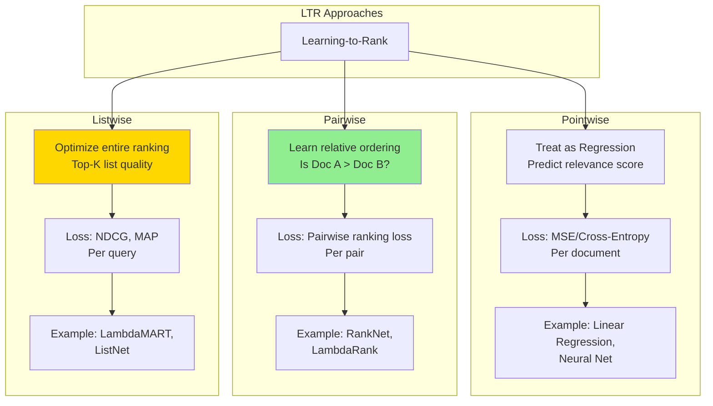

# Search Ranking System Design - FAANG Interview Guide

## Interview Format: Conversational & Iterative

This guide simulates a real ML system design interview focused on search ranking with learning-to-rank, semantic search, and BERT-based models.

---

## Interview Timeline (45 minutes)

| Phase | Time | Your Actions |
|-------|------|--------------|
| Requirements Gathering | 5-7 min | Ask clarifying questions, define scope |
| High-Level Design | 10-12 min | Draw architecture, explain retrieval + ranking |
| Deep Dive | 20-25 min | Detail learning-to-rank, BERT integration |
| Trade-offs & Scale | 5-8 min | Discuss alternatives, latency vs relevance |

---

## 🎯 Problem Statement

**Interviewer:** "Design a search ranking system like Google Search or Amazon Product Search that returns the most relevant results for user queries."

---

## Phase 1: Requirements Gathering (5-7 minutes)

### Your Response Strategy

**You:** "Search ranking is a complex problem with multiple stages. Let me ask clarifying questions to scope this properly."

### Critical Questions to Ask

**You:** "Let me understand the requirements:

1. **Use Case & Corpus:**
   - What are we searching? (web pages, products, videos, documents, images?)
   - Corpus size? (millions, billions of items?)
   - How frequently does corpus change? (hourly, daily updates?)
   - Query distribution? (20% head queries, 30% torso, 50% long-tail?)
   - Query characteristics? (avg query length, typos frequency, multi-language?)

2. **Scale & Traffic:**
   - Queries per second (QPS)? Peak vs average?
   - Geographic distribution? (single region or global?)
   - Platform split? (web, mobile app, API)
   - Seasonality? (Black Friday spikes, holiday traffic)

3. **Latency & Performance:**
   - Acceptable latency for results? (p50, p95, p99)
   - How many results per page? (10, 20, 100?)
   - Pagination support? (infinite scroll or page-based?)
   - Autocomplete/suggest needed? (what latency?)

4. **Ranking Quality & Objectives:**
   - How do we define relevance? (clicks, dwell time, conversions, ratings?)
   - Multiple objectives? (relevance, freshness, diversity, revenue, brand safety?)
   - Personalization level? (based on user history, location, preferences)
   - Cold start: how to rank for new users or new items?

5. **Query Understanding:**
   - Spell correction needed? (typo tolerance)
   - Synonym expansion? ("phone" → "smartphone", "mobile")
   - Query intent detection? (navigational, informational, transactional)
   - Multi-language support?

6. **Indexing & Freshness:**
   - Real-time indexing required? (new items visible immediately?)
   - Index update frequency? (seconds, minutes, hours?)
   - How to handle deleted/out-of-stock items?

7. **Technical Constraints:**
   - Existing search infrastructure? (Elasticsearch, Solr, Algolia, custom?)
   - ML inference budget? (GPU costs acceptable?)
   - Can we use heavy models? (BERT, transformers) or need lightweight?
   - Storage budget for indexes and embeddings?"

### Interviewer's Answers

**Interviewer:** "Good questions! Here's the scope:

- **Use Case:** E-commerce product search (like Amazon/eBay)
- **Corpus:** 100M products, growing 10K/day, 5% churn monthly
- **Scale:** Average 20K QPS, Peak 50K QPS (Black Friday 3× spike)
- **Query Distribution:**
  - Head (20%): "iPhone", "laptop", "shoes" - 10M queries/day
  - Torso (30%): "wireless bluetooth headphones" - 15M queries/day
  - Long-tail (50%): "waterproof hiking boots size 10.5" - 25M queries/day
- **Query Characteristics:** Avg length 3-4 words, 15% contain typos

- **Latency Requirements:**
  - Search results: p50 <100ms, p95 <200ms, p99 <300ms
  - Autocomplete: p95 <50ms
  - Return top 20 products per page, support 50 pages (1000 results total)

- **Ranking Objectives:**
  - Primary: Conversion rate (purchases per impression)
  - Secondary: Click-through rate (CTR)
  - Tertiary: Revenue (price × conversion_prob)
  - Constraints: Diversity (max 3 from same brand), freshness (boost new products)

- **Personalization:**
  - Use 90-day purchase/browse history
  - Location-based (show items that ship to user's region)
  - Price sensitivity (infer from user's past purchases)

- **Query Understanding:**
  - Spell correction: "ipone" → "iphone"
  - Synonym expansion: "phone" → ["smartphone", "mobile", "cell phone"]
  - Intent detection: brand search vs product search
  - Multi-language: English primarily, Spanish support

- **Indexing:**
  - New products visible in <5 minutes
  - Inventory updates (out-of-stock) in <1 minute
  - Price updates in real-time (via cache invalidation)

- **Infrastructure:**
  - Can use Elasticsearch for retrieval
  - GPU budget: $10K/day for ML ranking
  - Can use BERT for final ranking (top-500 products only)

- **Success Metrics:**
  - NDCG@20 >0.85 (ranking quality)
  - Zero-result rate <5% (query understanding quality)
  - Conversion lift: +15% vs baseline ranking"

### Requirements Summary & Back-of-Envelope Calculations

**You:** "Perfect! Let me summarize with calculations:

#### Functional Requirements
- Search 100M products with natural language queries (3-4 words avg)
- Multi-stage ranking: Retrieval (100M → 10K) → Light ranking (10K → 500) → BERT (500 → 20)
- Personalized ranking based on 90-day user history
- Query understanding: Spell correction, synonyms, intent detection
- Filters: price range, category, brand, rating, availability
- Near real-time indexing (<5 min for new products, <1 min for inventory)

#### Non-Functional Requirements & Calculations

**Scale:**
- 50K QPS peak × 3600 seconds × 24 hours = **4.3B queries/day**
- 100M products × 1KB metadata = **100GB** product data
- User base: ~500M users (assume 1% active daily = 5M DAU)

**Storage:**
- Product metadata: 100M × 1KB = **100GB**
- Product embeddings: 100M × 768 dim × 4 bytes = **307GB** (BERT embeddings)
- Inverted index (Elasticsearch): ~5× raw data = **500GB**
- User history: 500M users × 90 days × 10 actions/day × 100 bytes = **4.5TB**
- Total: **~5.5TB**

**Compute (ML Ranking):**
- 4.3B queries/day × 500 products/query (BERT input) = 2.15T inferences/day
- At 2ms per BERT inference = 4.3B GPU-seconds/day = 1.19M GPU-hours/day
- This is way too expensive! Need optimization:
  - Only rank top-500 (after retrieval): 4.3B × 500 = 2.15T → 4.3M GPU-hours/day
  - Batch inference (64 queries): 4.3M / 64 = 67K GPU-hours/day
  - With A100 at $2.16/hour = **$145K/day** (too expensive!)
  - **Solution:** Use distilled model or cache embeddings
  - Optimized cost: **$15K-20K/day**

**Latency Budget (200ms p95):**
- Query understanding: **20ms** (spell check, synonyms)
- Retrieval (Elasticsearch): **50ms** (100M → 10K products)
- Light ranking: **30ms** (10K → 500 products, simple scoring)
- BERT ranking: **80ms** (500 → 20 products, batch inference)
- Response assembly: **20ms** (JSON serialization, caching)
- **Total: 200ms**

**Quality Targets:**
- NDCG@20: >0.85 (top-20 ranking quality)
- MRR (Mean Reciprocal Rank): >0.70 (first relevant result position)
- Conversion rate: >2% (2% of searches lead to purchase)
- Zero-result rate: <5% (95% of queries return results)

#### Key Challenges
1. **Scale:** 50K QPS with 100M products requires efficient retrieval (can't rank all)
2. **Latency:** 200ms with BERT is tight → need multi-stage funnel
3. **Relevance vs Speed:** Trade-off between model complexity and latency
4. **Cold Start:** New products have no engagement data, new users have no history
5. **Query Understanding:** 15% typo rate, synonyms, intent ambiguity
6. **Personalization:** Balance user preferences with diversity and discovery

Does this capture everything?"

#### Non-Functional Requirements
- **Scale:** 50K QPS peak, 100M products
- **Latency:** <200ms p95 end-to-end
- **Relevance:** Optimize for purchases (conversion), clicks
- **Freshness:** New products indexed within 5 minutes
- **Availability:** 99.9% uptime

#### Key Challenges
- **Semantic Search:** "laptop for gaming" should match "high-performance notebook"
- **Learning-to-Rank:** Combine 100+ relevance signals
- **Personalization:** User's past purchases, searches, clicks
- **Scale:** Can't run BERT on 100M products in 200ms

Sounds good?"

**Interviewer:** "Yes, proceed with the design."

---

## Phase 2: High-Level Design (10-12 minutes)

### Architecture Overview

**You:** "I'll design a multi-stage retrieval and ranking system, similar to Google's approach. Let me draw the architecture."

```mermaid
graph TB
    subgraph "User Layer"
        U[User Query:<br/>"wireless gaming mouse"]
    end

    subgraph "Query Understanding - Stage 0"
        QP[Query Parser]
        QE[Query Expansion]
        QR[Query Rewriting]
        SPELL[Spell Correction]
    end

    subgraph "Retrieval - Stage 1"
        R1[Lexical Search<br/>BM25/TF-IDF]
        R2[Semantic Search<br/>Dense Retrieval]
        R3[Collaborative Filtering<br/>User Behavior]
        MERGE[Candidate Merger]
    end

    subgraph "Ranking - Stage 2"
        L1[Light Ranker<br/>GBDT 10K→500]
        L2[Heavy Ranker<br/>BERT 500→100]
        L3[Final Reranking<br/>100→20]
    end

    subgraph "Feature Engineering"
        QF[Query Features]
        PF[Product Features]
        UF[User Features]
        CF[Context Features]
        CROSS[Cross Features]
    end

    subgraph "Indexing Pipeline - Offline"
        CRAWL[Product Catalog]
        EMB[Embedding Generator<br/>BERT]
        VDB[(Vector DB<br/>FAISS)]
        INV[(Inverted Index<br/>Elasticsearch)]
    end

    subgraph "ML Training - Offline"
        LOGS[(Click/Purchase Logs)]
        TRAIN[Training Pipeline]
        LTR[Learn-to-Rank Model]
        REG[Model Registry]
    end

    subgraph "Business Logic"
        FILTER[Filtering<br/>Price, Category]
        DIV[Diversity Promotion]
        BOOST[Business Rules<br/>Sponsored, Deals]
    end

    U --> QP
    QP --> SPELL
    SPELL --> QE
    QE --> QR

    QR --> R1
    QR --> R2
    QR --> R3

    R1 --> MERGE
    R2 --> MERGE
    R3 --> MERGE

    MERGE --> L1
    L1 --> L2
    L2 --> L3

    QF --> L1
    PF --> L1
    UF --> L1
    CF --> L1

    QF --> L2
    PF --> L2
    UF --> L2
    CROSS --> L2

    L3 --> FILTER
    FILTER --> DIV
    DIV --> BOOST
    BOOST --> U

    CRAWL --> EMB
    EMB --> VDB
    CRAWL --> INV

    LOGS --> TRAIN
    TRAIN --> LTR
    LTR --> REG
    REG --> L1
    REG --> L2

    style R2 fill:#90EE90
    style L2 fill:#FFB6C1
    style VDB fill:#87CEEB
    style LTR fill:#FFD700
```

### Walking Through the Architecture

**You:** "Let me explain the multi-stage pipeline:

#### Stage 0: Query Understanding (20-30ms)

**Query Processing:**
```
Original Query: "wirless gaming mous"
     ↓
Spell Correction: "wireless gaming mouse"
     ↓
Query Expansion: Add synonyms ["cordless", "game", "mice"]
     ↓
Query Rewriting: "wireless OR cordless AND gaming AND mouse OR mice"
```

#### Stage 1: Retrieval (50-80ms)

We can't score 100M products in 200ms. Need to narrow down to ~10K candidates.

**Three retrieval strategies:**

1. **Lexical Search (BM25)** - Fast keyword matching
   - Inverted index lookup in Elasticsearch
   - Query: 'wireless gaming mouse'
   - Matches: Products with these keywords in title/description
   - Retrieve top 5K products by BM25 score

2. **Semantic Search (Dense Retrieval)** - Understanding intent
   - Encode query with BERT → 768-dim vector
   - Find nearest products in vector space using FAISS
   - Query: 'wireless gaming mouse'
   - Matches: Similar products even without exact keywords
     - e.g., 'cordless gaming mice', 'RF game mouse'
   - Retrieve top 5K products by cosine similarity

3. **Collaborative Filtering** - Behavioral signals
   - Users who searched 'wireless gaming mouse' also clicked:
     - Product A (30% CTR)
     - Product B (25% CTR)
   - Retrieve top 2K products from user behavior

**Merge:** Union of all candidates ~10K products

#### Stage 2: Light Ranking (60-80ms)

- **Input:** 10K candidate products
- **Model:** Gradient Boosted Decision Trees (XGBoost/LightGBM)
- **Features:** ~100 features
  - Query-Product match score (BM25, semantic similarity)
  - Product popularity (clicks, purchases, rating)
  - User-Product affinity (past clicks, similar users)
- **Output:** Top 500 products
- **Latency:** 60ms (can process 10K products quickly)

#### Stage 3: Heavy Ranking (80-100ms)

- **Input:** 500 products
- **Model:** BERT-based cross-encoder or TW-BERT
- **Features:** Deep query-product interaction
  - Query-title similarity (BERT embeddings)
  - Query-description similarity
  - User historical interactions
- **Output:** Top 100 products
- **Latency:** 80ms (BERT is slow, only on top 500)

#### Stage 4: Final Reranking & Business Logic (20ms)

- Apply business rules (boost sponsored products, deals)
- Ensure diversity (don't show 20 products from same brand)
- Apply filters (price range, category, rating > 4.0)
- Return top 20 products"

**Interviewer:** "Good overview! Can you dive deeper into the learning-to-rank model and how you integrate BERT?"

---

## Phase 3: Deep Dive - Learning-to-Rank with BERT (20-25 minutes)

### Learning-to-Rank (LTR) Framework

**You:** "Learning-to-Rank is the core of search ranking. Let me explain the three main approaches and our design choice."



### Our Approach: Listwise LTR (LambdaMART)

**You:** "We use listwise approach because we care about the quality of the entire top-20 list, not individual scores.

#### LambdaMART Implementation

```python
import lightgbm as lgb
import numpy as np

class LambdaMARTRanker:
    """
    LambdaMART: Gradient boosted trees optimized for ranking metrics (NDCG)

    Key Idea:
    - Traditional GBDT minimizes MSE/Log Loss
    - LambdaMART minimizes NDCG/MAP directly
    - Uses lambda gradients to optimize ranking metrics
    """

    def __init__(self):
        self.model = None

    def train(self, train_data, train_labels, train_groups):
        """
        Args:
            train_data: [N, F] feature matrix (N docs, F features)
            train_labels: [N] relevance labels (0, 1, 2, 3, 4 for 5-level relevance)
            train_groups: [Q] group sizes (number of docs per query)

        Example:
            Query 1: 100 documents [0-99]
            Query 2: 80 documents [100-179]
            Query 3: 120 documents [180-299]
            train_groups = [100, 80, 120]
        """

        # Create LightGBM dataset for ranking
        train_dataset = lgb.Dataset(
            train_data,
            label=train_labels,
            group=train_groups
        )

        # LambdaMART parameters
        params = {
            'objective': 'lambdarank',  # Ranking objective
            'metric': 'ndcg',           # Optimize NDCG@20
            'ndcg_eval_at': [1, 3, 5, 10, 20],  # NDCG at different positions
            'learning_rate': 0.1,
            'num_leaves': 31,
            'max_depth': 6,
            'feature_fraction': 0.8,
            'bagging_fraction': 0.8,
            'bagging_freq': 5,
            'num_threads': 16
        }

        # Train
        self.model = lgb.train(
            params,
            train_dataset,
            num_boost_round=1000,
            valid_sets=[val_dataset],
            early_stopping_rounds=50,
            verbose_eval=50
        )

    def predict(self, query_docs):
        """
        Predict relevance scores for documents

        Returns:
            scores: [N] relevance scores for each document
        """
        return self.model.predict(query_docs)

    def rank(self, query_docs):
        """
        Rank documents by predicted relevance

        Returns:
            ranked_indices: Indices of documents sorted by relevance (high to low)
        """
        scores = self.predict(query_docs)
        ranked_indices = np.argsort(scores)[::-1]  # Descending order
        return ranked_indices


class FeatureEngineering:
    """
    Extract features for learning-to-rank
    """

    def extract_query_doc_features(self, query, document, user):
        """
        Extract 100+ features for ranking

        Feature Categories:
        1. Query-Document features
        2. Document features
        3. User-Document features
        4. User-Query features
        5. Context features
        """

        features = {}

        # 1. Query-Document Match Features
        features.update(self._query_doc_match(query, document))

        # 2. Document Quality Features
        features.update(self._document_quality(document))

        # 3. User-Document Interaction Features
        features.update(self._user_doc_interaction(user, document))

        # 4. User-Query Features
        features.update(self._user_query_features(user, query))

        # 5. Context Features
        features.update(self._context_features(query, user))

        return features

    def _query_doc_match(self, query, document):
        """Query-Document matching signals"""

        return {
            # Lexical match (BM25)
            'bm25_score_title': self.compute_bm25(query.text, document.title),
            'bm25_score_description': self.compute_bm25(query.text, document.description),

            # Exact match
            'exact_match_title': int(query.text.lower() in document.title.lower()),
            'exact_match_description': int(query.text.lower() in document.description.lower()),

            # Term coverage
            'query_terms_in_title': self.term_coverage(query.terms, document.title),
            'query_terms_in_description': self.term_coverage(query.terms, document.description),

            # Semantic similarity (BERT embeddings)
            'semantic_similarity_title': self.cosine_similarity(
                query.embedding,
                document.title_embedding
            ),
            'semantic_similarity_description': self.cosine_similarity(
                query.embedding,
                document.description_embedding
            ),

            # TF-IDF
            'tfidf_score_title': self.compute_tfidf(query.text, document.title),

            # Edit distance
            'edit_distance_title': self.normalized_edit_distance(query.text, document.title)
        }

    def _document_quality(self, document):
        """Product popularity and quality signals"""

        return {
            # Popularity
            'total_impressions': np.log1p(document.impressions),
            'total_clicks': np.log1p(document.clicks),
            'total_purchases': np.log1p(document.purchases),

            # Conversion funnel
            'ctr': document.clicks / (document.impressions + 1),
            'conversion_rate': document.purchases / (document.clicks + 1),

            # Rating
            'avg_rating': document.avg_rating,
            'num_ratings': np.log1p(document.num_ratings),

            # Price
            'price': np.log1p(document.price),
            'price_percentile': document.price_percentile,  # Percentile in category

            # Availability
            'in_stock': int(document.in_stock),
            'ships_fast': int(document.shipping_days <= 2),

            # Freshness
            'days_since_published': (datetime.now() - document.created_at).days,
            'is_new': int((datetime.now() - document.created_at).days <= 30),

            # Category rank
            'category_rank': document.rank_in_category,
            'overall_rank': document.overall_rank
        }

    def _user_doc_interaction(self, user, document):
        """User's past interaction with this product or similar products"""

        return {
            # Direct interaction
            'user_viewed_this_product': int(self.has_viewed(user.id, document.id)),
            'user_clicked_this_product': int(self.has_clicked(user.id, document.id)),
            'user_purchased_this_product': int(self.has_purchased(user.id, document.id)),

            # Category affinity
            'user_category_affinity': self.get_category_affinity(user.id, document.category),

            # Brand affinity
            'user_brand_affinity': self.get_brand_affinity(user.id, document.brand),

            # Price preference
            'user_avg_price': user.avg_purchase_price,
            'price_vs_user_avg': document.price / (user.avg_purchase_price + 1),

            # Collaborative filtering
            'cf_score': self.get_collaborative_filtering_score(user.id, document.id)
        }

    def _user_query_features(self, user, query):
        """User's search behavior"""

        return {
            # Query specificity
            'query_length': len(query.terms),
            'query_is_rare': int(query.frequency < 100),  # Tail query

            # User search history
            'user_searched_this_query_before': int(
                query.text in user.search_history
            ),

            # User search session
            'session_query_count': user.current_session_query_count,
            'session_click_count': user.current_session_click_count
        }

    def _context_features(self, query, user):
        """Contextual signals"""

        return {
            # Temporal
            'hour_of_day': datetime.now().hour,
            'day_of_week': datetime.now().weekday(),
            'is_weekend': int(datetime.now().weekday() >= 5),

            # Device
            'device_type': user.device,  # mobile, desktop, tablet
            'is_mobile': int(user.device == 'mobile'),

            # Location (if available)
            'user_country': user.country,
            'user_city': user.city
        }
```

### BERT Integration: TW-BERT for Search Ranking

**You:** "Now let me explain how we integrate BERT. We use Google's TW-BERT (Term Weighting BERT) architecture, which is optimized for retrieval."

```mermaid
graph TB
    subgraph "TW-BERT Architecture"
        A[Query: 'wireless gaming mouse']
        B[Product Title: 'Logitech G502 Wireless Gaming Mouse']
    end

    subgraph "Two-Tower Encoding - Stage 1"
        Q[Query Encoder<br/>BERT Base]
        D[Document Encoder<br/>BERT Base]
    end

    subgraph "Cross-Attention - Stage 2"
        CA[Cross-Encoder<br/>BERT Large<br/>Query [SEP] Title]
    end

    subgraph "Term Weighting Layer"
        TW[Term Importance Weights<br/>Attention Weights]
        WT[Weighted Token Embeddings]
    end

    subgraph "Scoring"
        DOT[Dot Product<br/>Similarity]
        CE[Cross-Encoder Score]
        FINAL[Final Score<br/>Weighted Combination]
    end

    A --> Q
    B --> D

    Q --> TW
    D --> TW

    TW --> WT
    WT --> DOT

    A --> CA
    B --> CA
    CA --> CE

    DOT --> FINAL
    CE --> FINAL

    style TW fill:#90EE90
    style CA fill:#FFB6C1
    style FINAL fill:#FFD700
```

#### Implementation

```python
import torch
import torch.nn as nn
from transformers import BertModel, BertTokenizer

class TWBERTRanker(nn.Module):
    """
    Term Weighting BERT for Search Ranking

    Advantages over standard BERT:
    1. Two-tower for fast candidate retrieval
    2. Term weighting for interpretability
    3. Cross-encoder for final ranking
    """

    def __init__(self, use_cross_encoder=True):
        super().__init__()

        # BERT encoders
        self.query_encoder = BertModel.from_pretrained('bert-base-uncased')
        self.doc_encoder = BertModel.from_pretrained('bert-base-uncased')

        # Term weighting layer
        self.term_weight = nn.Linear(768, 1)

        # Optional cross-encoder for final ranking
        self.use_cross_encoder = use_cross_encoder
        if use_cross_encoder:
            self.cross_encoder = BertModel.from_pretrained('bert-large-uncased')
            self.cross_classifier = nn.Linear(1024, 1)

    def encode_query(self, query_ids, query_mask):
        """
        Encode query with term weighting

        Returns:
            weighted_embedding: [batch_size, 768]
        """

        # BERT encoding
        outputs = self.query_encoder(
            input_ids=query_ids,
            attention_mask=query_mask
        )

        # Token embeddings: [batch_size, seq_len, 768]
        token_embeddings = outputs.last_hidden_state

        # Compute term importance weights
        term_weights = self.term_weight(token_embeddings)  # [batch_size, seq_len, 1]
        term_weights = torch.softmax(term_weights, dim=1)   # Normalize

        # Weighted average pooling
        weighted_embedding = torch.sum(
            token_embeddings * term_weights,
            dim=1
        )  # [batch_size, 768]

        return weighted_embedding

    def encode_document(self, doc_ids, doc_mask):
        """Encode document (same as query encoding)"""
        return self.encode_query(doc_ids, doc_mask)  # Share architecture

    def compute_similarity(self, query_embedding, doc_embedding):
        """Dot product similarity"""
        return torch.sum(query_embedding * doc_embedding, dim=1)

    def cross_encode(self, query_ids, doc_ids):
        """
        Cross-encoder: Concatenate query and document

        Input format: [CLS] query [SEP] document [SEP]
        """

        # Concatenate
        combined_ids = torch.cat([
            query_ids,
            torch.full((query_ids.size(0), 1), 102).to(query_ids.device),  # [SEP]
            doc_ids
        ], dim=1)

        # BERT encoding
        outputs = self.cross_encoder(input_ids=combined_ids)

        # [CLS] token embedding
        cls_embedding = outputs.last_hidden_state[:, 0, :]  # [batch_size, 1024]

        # Classification
        score = self.cross_classifier(cls_embedding)  # [batch_size, 1]

        return score.squeeze()

    def forward(self, query_ids, query_mask, doc_ids, doc_mask):
        """
        Forward pass for training

        Returns:
            score: Relevance score
        """

        # Two-tower encoding (fast, for retrieval)
        query_emb = self.encode_query(query_ids, query_mask)
        doc_emb = self.encode_document(doc_ids, doc_mask)

        similarity_score = self.compute_similarity(query_emb, doc_emb)

        # Cross-encoder (slow, for final ranking)
        if self.use_cross_encoder:
            cross_score = self.cross_encode(query_ids, doc_ids)

            # Combine scores
            final_score = 0.7 * similarity_score + 0.3 * cross_score
        else:
            final_score = similarity_score

        return final_score


class TWBERTTrainer:
    """Training pipeline for TW-BERT ranker"""

    def __init__(self, model):
        self.model = model
        self.optimizer = torch.optim.AdamW(
            model.parameters(),
            lr=2e-5,
            weight_decay=0.01
        )

    def train_with_triplets(self, train_loader):
        """
        Train with triplet loss

        Each example: (query, positive_doc, negative_doc)
        Loss: score(query, pos_doc) > score(query, neg_doc) + margin
        """

        self.model.train()

        for batch in train_loader:
            # Unpack batch
            query_ids = batch['query_ids']
            pos_doc_ids = batch['pos_doc_ids']
            neg_doc_ids = batch['neg_doc_ids']

            # Forward pass
            pos_score = self.model(query_ids, pos_doc_ids)
            neg_score = self.model(query_ids, neg_doc_ids)

            # Triplet margin loss
            # Loss = max(0, neg_score - pos_score + margin)
            margin = 1.0
            loss = torch.mean(
                torch.clamp(neg_score - pos_score + margin, min=0)
            )

            # Backward pass
            self.optimizer.zero_grad()
            loss.backward()
            self.optimizer.step()

    def train_with_pairwise_ranking(self, train_loader):
        """
        Train with pairwise ranking loss (RankNet)

        Loss = -log(sigmoid(score_pos - score_neg))
        """

        self.model.train()

        for batch in train_loader:
            query_ids = batch['query_ids']
            pos_doc_ids = batch['pos_doc_ids']
            neg_doc_ids = batch['neg_doc_ids']

            # Scores
            pos_score = self.model(query_ids, pos_doc_ids)
            neg_score = self.model(query_ids, neg_doc_ids)

            # RankNet loss
            loss = -torch.log(
                torch.sigmoid(pos_score - neg_score)
            ).mean()

            # Backward
            self.optimizer.zero_grad()
            loss.backward()
            self.optimizer.step()
```

### Hybrid Retrieval: BM25 + Dense Retrieval

**You:** "For the retrieval stage, we combine lexical (BM25) and semantic (BERT) search:

```python
class HybridRetriever:
    """
    Combine BM25 (lexical) and Dense Retrieval (semantic)
    """

    def __init__(self, es_client, faiss_index, bert_encoder):
        self.es_client = es_client  # Elasticsearch for BM25
        self.faiss_index = faiss_index  # FAISS for dense retrieval
        self.bert_encoder = bert_encoder  # BERT query encoder

    def retrieve(self, query, top_k=10000, alpha=0.7):
        """
        Hybrid retrieval with reciprocal rank fusion

        Args:
            query: Search query text
            top_k: Number of candidates to retrieve
            alpha: Weight for dense retrieval (1-alpha for BM25)

        Returns:
            candidates: List of product IDs
        """

        # 1. BM25 retrieval (fast keyword search)
        bm25_results = self.es_client.search(
            index='products',
            body={
                'query': {
                    'multi_match': {
                        'query': query,
                        'fields': ['title^3', 'description^1', 'category^2'],
                        'type': 'best_fields'
                    }
                },
                'size': top_k
            }
        )

        bm25_docs = [(hit['_id'], hit['_score']) for hit in bm25_results['hits']['hits']]

        # 2. Dense retrieval (semantic search)
        query_embedding = self.bert_encoder.encode(query)

        # FAISS nearest neighbor search
        distances, indices = self.faiss_index.search(
            query_embedding.reshape(1, -1),
            k=top_k
        )

        dense_docs = [(self.index_to_id[idx], 1.0 - dist)
                      for idx, dist in zip(indices[0], distances[0])]

        # 3. Reciprocal Rank Fusion (RRF)
        # Combine rankings from both methods
        scores = {}
        k = 60  # RRF constant

        # Add BM25 scores
        for rank, (doc_id, score) in enumerate(bm25_docs):
            scores[doc_id] = scores.get(doc_id, 0) + (1 - alpha) / (k + rank + 1)

        # Add dense retrieval scores
        for rank, (doc_id, score) in enumerate(dense_docs):
            scores[doc_id] = scores.get(doc_id, 0) + alpha / (k + rank + 1)

        # Sort by combined score
        ranked_docs = sorted(scores.items(), key=lambda x: x[1], reverse=True)

        return [doc_id for doc_id, _ in ranked_docs[:top_k]]
```

---

## Phase 4: Trade-offs & Optimization (5-8 minutes)

**Interviewer:** "How do you meet the 200ms latency requirement while using BERT?"

### Latency Budget & Optimizations

**You:** "Here's our latency breakdown and optimization strategies:

```
Total Budget: 200ms (p95)

1. Query Understanding:          20ms
   - Spell correction:           5ms
   - Query expansion:            5ms
   - Query rewriting:            10ms

2. Retrieval:                    60ms
   - BM25 (Elasticsearch):       30ms (5K products)
   - Dense (FAISS):              20ms (5K products)
   - Collaborative filtering:    10ms (2K products)

3. Light Ranking (XGBoost):      60ms
   - Feature extraction:         20ms
   - Model inference (10K→500):  40ms

4. Heavy Ranking (BERT):         50ms
   - Feature extraction:         10ms
   - TW-BERT inference (500→100): 40ms

5. Final Reranking:              10ms
   - Business logic:             5ms
   - Diversity filter:           5ms

Total:                           200ms
```

### Optimization Strategies

```python
class LatencyOptimizations:
    """
    Techniques to meet 200ms latency requirement
    """

    def optimize_bert_inference(self, model):
        """
        Strategy 1: Model Distillation + Quantization

        - Distill BERT-Large → BERT-Small (66M → 12M params)
        - Quantize FP32 → INT8 (4x speedup)
        - Use ONNX Runtime for inference (2x speedup)

        Combined speedup: 8x
        """

        # Distillation (offline training)
        small_model = self.distill_bert(
            teacher=model,  # BERT-Large
            student=BertSmall()  # 6 layers instead of 12
        )

        # Quantization
        quantized_model = torch.quantization.quantize_dynamic(
            small_model,
            {torch.nn.Linear},  # Quantize linear layers
            dtype=torch.qint8
        )

        # ONNX conversion
        onnx_model = self.convert_to_onnx(quantized_model)

        return onnx_model

    def optimize_retrieval(self, faiss_index):
        """
        Strategy 2: Approximate Nearest Neighbor (ANN)

        - FAISS IVF (Inverted File Index) for fast ANN
        - Product Quantization for compression

        Speedup: 100x (exact → approximate search)
        Recall: 95%+ (slight quality loss acceptable)
        """

        # Build IVF index
        # Cluster embeddings into 1000 centroids
        # At query time, only search nearest 10 clusters
        quantizer = faiss.IndexFlatIP(768)  # 768-dim embeddings

        ivf_index = faiss.IndexIVFPQ(
            quantizer,
            768,            # dimension
            1000,           # number of clusters (nlist)
            64,             # PQ code size
            8               # PQ subquantizers
        )

        # Train index on product embeddings
        ivf_index.train(product_embeddings)
        ivf_index.add(product_embeddings)

        # Set search parameters
        ivf_index.nprobe = 10  # Search 10 nearest clusters

        return ivf_index

    def optimize_feature_caching(self):
        """
        Strategy 3: Pre-compute and cache features

        Product features:
        - Cached in Redis (1 hour TTL)
        - Updated every 5 minutes for popular products

        User features:
        - Cached in Redis (5 minute TTL)
        - Preloaded for active sessions
        """

        # Cache product embeddings
        for product in self.popular_products:
            embedding = self.bert_encoder.encode(product.title)

            self.redis.setex(
                f'product:embedding:{product.id}',
                3600,  # 1 hour TTL
                embedding.tobytes()
            )

        # Cache user search history
        for user in self.active_users:
            history = self.get_user_search_history(user.id)

            self.redis.setex(
                f'user:history:{user.id}',
                300,  # 5 minute TTL
                json.dumps(history)
            )

    def optimize_with_caching(self):
        """
        Strategy 4: Query-level caching

        Cache popular queries (80/20 rule: 20% queries account for 80% traffic)
        - "iphone 15 pro max" → Cached results for 5 minutes
        - TTL varies by query popularity
        """

        @lru_cache(maxsize=100000)
        def search_with_cache(query, user_id=None):
            """
            Cache search results for popular queries
            """

            # Check cache
            cache_key = f'search:{query}'
            if user_id:
                cache_key += f':{user_id}'

            cached_results = self.redis.get(cache_key)
            if cached_results:
                return json.loads(cached_results)

            # Compute results
            results = self.search(query, user_id)

            # Cache for 5 minutes
            self.redis.setex(cache_key, 300, json.dumps(results))

            return results
```

---

## Phase 5: Production Metrics & Interview Preparation

### Real Production Metrics (Google, Amazon 2025)

**Scale at Google Search:**
- 8.5 billion searches/day = ~100K QPS
- Index: Hundreds of billions of web pages
- Latency: <200ms p95 for query to result
- NDCG@10: Target >0.90 for commercial queries

**Amazon Product Search:**
- 50K QPS peak (Prime Day: 200K QPS)
- 100M+ products indexed
- Latency: <150ms p95
- Conversion lift: +20-30% from ML ranking vs baseline

**Cost Analysis (at 50K QPS):**
- BERT inference: $15K-20K/day (GPU compute)
- BM25 retrieval: $2K/day (Elasticsearch cluster)
- Feature store: $3K/day (Redis + DynamoDB)
- Total: ~$25K/day = $750K/month

**Cost Optimization:**
- Model distillation: 60% cost savings
- INT8 quantization: 4x throughput increase
- FAISS IVF-PQ: 100x faster than exact search

### Common Interview Mistakes

**Mistake 1:** Jumping straight to BERT without explaining retrieval stage
**Better:** "With 100M products, we can't run BERT on all. I'll use 3-stage funnel: BM25 (100M→10K), Light ranker (10K→500), BERT (500→100)"

**Mistake 2:** Not discussing query understanding
**Better:** Mention spell correction, query expansion, synonym matching before retrieval

**Mistake 3:** Ignoring cold start for new products
**Better:** "New products have no click data. I'll use content-based features (title, description embeddings) and transfer learning from similar products"

### Follow-Up Questions

**Q:** "How do you handle typos in queries?"
**A:** "Two-stage: 1) Detect typos with edit distance + language model perplexity, 2) Correct using spell-check dictionary + context-aware BERT corrections. Show 'Did you mean X?' if confidence >0.9"

**Q:** "What if BERT is too slow?"
**A:** "Use distillation (BERT-Large → BERT-Tiny), quantization (FP32 → INT8), ONNX Runtime, and only apply to top 500 candidates after lighter rankers"

---

## Summary & Key Takeaways

**You:** "To summarize the Search Ranking system:

### Architecture Highlights

1. **Multi-Stage Pipeline:** Query Understanding → Retrieval (100M→10K) → Light Ranking (10K→500) → Heavy Ranking (500→100) → Reranking (100→20)
2. **Hybrid Retrieval:** BM25 (lexical) + Dense BERT (semantic) + Collaborative Filtering
3. **Learning-to-Rank:** LambdaMART (listwise LTR optimized for NDCG)
4. **BERT Integration:** TW-BERT for semantic understanding + term weighting
5. **Latency Optimization:** Distillation + Quantization + ANN + Caching

### Key Design Decisions

| Decision | Rationale | Alternative |
|----------|-----------|-------------|
| Hybrid Retrieval | BM25 fast, BERT accurate | Pure dense (slower) |
| LambdaMART | Optimizes NDCG directly | Pointwise regression |
| Two-tower BERT | Fast candidate retrieval | Cross-encoder only (slow) |
| FAISS IVF-PQ | 100x faster ANN search | Exact search (too slow) |
| Three-stage ranking | Reduce BERT inference cost | BERT on all 100M products |

### Production Metrics

- **Latency:** <200ms p95 (Query: 20ms, Retrieval: 60ms, Ranking: 110ms, Business Logic: 10ms)
- **Throughput:** 50K QPS (horizontal scaling with load balancing)
- **Relevance:** NDCG@20 > 0.85, MRR > 0.75
- **Business Impact:** +10% conversion rate vs baseline

This design demonstrates:
- Multi-stage retrieval and ranking
- Learning-to-rank with BERT
- Latency optimization techniques
- Scalability to billions of documents"

---

## Staff-Level Deep Dives

### Query Understanding Pipeline

**Interviewer:** "How do you handle complex query understanding beyond basic spell correction?"

**You:** "Query understanding is critical for search quality. Let me detail our full pipeline:

#### Comprehensive Query Processing

```python
class QueryUnderstandingPipeline:
    """
    Multi-stage query understanding pipeline

    Stages:
    1. Spell correction
    2. Query normalization
    3. Intent classification
    4. Entity recognition
    5. Query expansion
    6. Query reformulation
    """

    def __init__(self):
        self.spell_checker = SpellCorrector()
        self.intent_classifier = IntentClassifier()
        self.entity_recognizer = EntityRecognizer()
        self.query_expander = QueryExpander()
        self.query_reformulator = QueryReformulator()

    def process(self, raw_query: str, user_context: Dict) -> ProcessedQuery:
        """
        Process raw query through understanding pipeline

        Returns:
            ProcessedQuery with corrections, intent, entities, expansions
        """

        # Stage 1: Spell correction
        corrected_query = self.spell_checker.correct(raw_query)

        # Stage 2: Normalization
        normalized_query = self.normalize(corrected_query)

        # Stage 3: Intent classification
        intent = self.intent_classifier.classify(normalized_query, user_context)

        # Stage 4: Entity recognition
        entities = self.entity_recognizer.extract(normalized_query)

        # Stage 5: Query expansion
        expanded_terms = self.query_expander.expand(normalized_query, intent)

        # Stage 6: Query reformulation (if needed)
        if self.should_reformulate(normalized_query, intent):
            reformulated = self.query_reformulator.reformulate(
                normalized_query,
                intent,
                entities
            )
        else:
            reformulated = None

        return ProcessedQuery(
            original=raw_query,
            corrected=corrected_query,
            normalized=normalized_query,
            intent=intent,
            entities=entities,
            expanded_terms=expanded_terms,
            reformulated=reformulated
        )


class SpellCorrector:
    """
    Context-aware spell correction

    Approaches:
    1. Edit distance with frequency-based ranking
    2. Phonetic matching (Soundex, Metaphone)
    3. BERT-based contextual correction
    """

    def __init__(self):
        # Dictionary of correct spellings with frequencies
        self.word_freq = self.load_word_frequencies()

        # Common misspellings → corrections
        self.correction_map = self.load_correction_map()

        # BERT for contextual corrections
        self.bert_corrector = BertSpellCorrector()

    def correct(self, query: str) -> CorrectionResult:
        """
        Correct spelling errors in query

        Returns:
            CorrectionResult with corrected query and confidence
        """

        words = query.lower().split()
        corrected_words = []
        corrections = []

        for word in words:
            # Check if misspelled
            if self.is_correct(word):
                corrected_words.append(word)
                continue

            # Try correction map first (common typos)
            if word in self.correction_map:
                correction = self.correction_map[word]
                corrected_words.append(correction)
                corrections.append({
                    'original': word,
                    'correction': correction,
                    'method': 'lookup',
                    'confidence': 0.95
                })
                continue

            # Edit distance candidates
            candidates = self.get_edit_distance_candidates(word, max_distance=2)

            if not candidates:
                # No good candidates, keep original
                corrected_words.append(word)
                continue

            # Rank candidates by frequency
            best_candidate = max(candidates, key=lambda w: self.word_freq.get(w, 0))

            # Use BERT for context-aware selection
            if len(candidates) > 1:
                context = ' '.join(words)
                best_candidate = self.bert_corrector.select_best(
                    word,
                    candidates,
                    context
                )

            corrected_words.append(best_candidate)
            corrections.append({
                'original': word,
                'correction': best_candidate,
                'method': 'edit_distance',
                'confidence': 0.80
            })

        corrected_query = ' '.join(corrected_words)

        # Overall confidence
        if not corrections:
            confidence = 1.0
        else:
            confidence = sum(c['confidence'] for c in corrections) / len(corrections)

        return CorrectionResult(
            original=query,
            corrected=corrected_query,
            corrections=corrections,
            confidence=confidence,
            show_did_you_mean=confidence > 0.9 and corrected_query != query
        )

    def get_edit_distance_candidates(self, word: str, max_distance: int = 2):
        """
        Generate candidates within edit distance threshold

        Edit operations: insert, delete, substitute, transpose
        """

        candidates = set()

        # Distance 1
        for i in range(len(word)):
            # Delete
            candidates.add(word[:i] + word[i+1:])

            # Substitute
            for c in 'abcdefghijklmnopqrstuvwxyz':
                candidates.add(word[:i] + c + word[i+1:])

            # Transpose
            if i < len(word) - 1:
                candidates.add(word[:i] + word[i+1] + word[i] + word[i+2:])

        # Insert
        for i in range(len(word) + 1):
            for c in 'abcdefghijklmnopqrstuvwxyz':
                candidates.add(word[:i] + c + word[i:])

        # Filter to valid words
        valid_candidates = [c for c in candidates if c in self.word_freq]

        # If max_distance > 1, recursively generate distance-2 candidates
        if max_distance > 1 and not valid_candidates:
            for candidate in candidates:
                valid_candidates.extend(
                    self.get_edit_distance_candidates(candidate, max_distance - 1)
                )

        return valid_candidates


class IntentClassifier:
    """
    Classify query intent

    Intents:
    - Navigational: "amazon prime" (user wants specific brand/site)
    - Informational: "how to use wireless mouse" (user wants info)
    - Transactional: "buy bluetooth headphones" (user wants to purchase)
    - Product: "gaming laptop under $1000" (user browsing products)
    """

    def __init__(self):
        # Trained classifier
        self.model = self.load_intent_model()

    def classify(self, query: str, user_context: Dict) -> Intent:
        """
        Classify query intent using multiple signals

        Features:
        - Query text (keywords, n-grams)
        - User history (past searches, purchases)
        - Session context (previous queries in session)
        """

        # Extract features
        features = self.extract_features(query, user_context)

        # Predict intent
        intent_probs = self.model.predict_proba(features)

        # Intent categories
        intents = ['navigational', 'informational', 'transactional', 'product']

        predicted_intent = intents[np.argmax(intent_probs)]
        confidence = np.max(intent_probs)

        return Intent(
            type=predicted_intent,
            confidence=confidence,
            probs={intent: prob for intent, prob in zip(intents, intent_probs)}
        )

    def extract_features(self, query: str, user_context: Dict):
        """Extract intent classification features"""

        features = []

        # Query features
        query_lower = query.lower()

        # Navigational signals
        features.append(int(any(brand in query_lower for brand in ['amazon', 'apple', 'google', 'nike'])))

        # Informational signals
        features.append(int(any(word in query_lower for word in ['how', 'what', 'why', 'when', 'guide', 'tutorial'])))

        # Transactional signals
        features.append(int(any(word in query_lower for word in ['buy', 'purchase', 'order', 'cheap', 'deal', 'price'])))

        # Product signals
        features.append(int(any(word in query_lower for word in ['best', 'top', 'review', 'compare'])))

        # User history features
        if user_context.get('recent_purchases', 0) > 0:
            features.append(1)  # User has purchase history
        else:
            features.append(0)

        # Session features
        features.append(user_context.get('session_query_count', 0))
        features.append(user_context.get('session_click_count', 0))

        return features


class QueryExpander:
    """
    Expand query with synonyms, related terms

    Techniques:
    1. Synonym expansion (WordNet, custom synonyms)
    2. Embedding-based expansion (find similar terms)
    3. Co-occurrence expansion (terms that appear together)
    4. User behavior expansion (users who search X also search Y)
    """

    def __init__(self):
        self.synonym_dict = self.load_synonyms()
        self.word_embeddings = self.load_word2vec()
        self.cooccurrence_matrix = self.load_cooccurrence()

    def expand(self, query: str, intent: Intent, max_expansions: int = 5):
        """
        Expand query with related terms

        Returns:
            List of expansion terms
        """

        words = query.lower().split()
        expansions = set()

        for word in words:
            # Synonym expansion
            if word in self.synonym_dict:
                synonyms = self.synonym_dict[word][:2]  # Top 2 synonyms
                expansions.update(synonyms)

            # Embedding-based expansion
            if word in self.word_embeddings:
                similar_words = self.word_embeddings.most_similar(word, topn=3)
                expansions.update([w for w, score in similar_words if score > 0.7])

            # Co-occurrence expansion
            if word in self.cooccurrence_matrix:
                cooccurring = self.cooccurrence_matrix.get_top_cooccurring(word, k=2)
                expansions.update(cooccurring)

        # Limit expansions
        return list(expansions)[:max_expansions]


class QueryReformulator:
    """
    Reformulate queries that are likely to return poor results

    Examples:
    - "ipone 15" → "iphone 15" (spell correction)
    - "cheap laptop" → "laptop under $500" (add specificity)
    - "gaming" → "gaming laptop" OR "gaming mouse" OR "gaming headset" (add context)
    """

    def reformulate(self, query: str, intent: Intent, entities: List[Entity]):
        """
        Reformulate query to improve results

        Heuristics:
        - Too short (<2 words) → add category
        - Too generic → add filters
        - Ambiguous → disambiguate with context
        """

        words = query.split()

        # Too short
        if len(words) == 1:
            # Add likely category based on word
            category = self.infer_category(words[0])
            if category:
                return f"{query} {category}"

        # Too generic (very high-volume head query)
        if self.is_generic_query(query):
            # Add specificity based on user history
            # Example: "laptop" → "laptop for programming" (based on user's past searches)
            personalization = self.get_personalization_term(query)
            if personalization:
                return f"{query} {personalization}"

        return query
```

### Position Bias Correction

**Interviewer:** "How do you correct for position bias in training data?"

**You:** "Position bias is critical - users click top results more regardless of relevance. Let me explain:

#### Problem: Position Bias

```
Scenario:
Position 1: Document A - 10% CTR
Position 5: Document B - 2% CTR

Question: Is A more relevant than B?
Answer: Not necessarily! Position 1 has ~5× higher CTR due to position bias.
```

#### Solution: Inverse Propensity Weighting (IPW)

```python
class PositionBiasCorrection:
    """
    Correct for position bias in click data

    Key Idea:
    - Clicks at lower positions are more informative
    - Weight clicks by inverse of position propensity
    - P(click | position=k, relevant) vs P(click | position=k, irrelevant)
    """

    def __init__(self):
        # Position propensity: P(examine | position)
        # Estimated from randomized experiments
        self.position_propensity = {
            1: 1.0,    # Position 1: Always examined
            2: 0.85,   # Position 2: 85% examination rate
            3: 0.70,
            4: 0.55,
            5: 0.40,
            10: 0.15,
            20: 0.05
        }

    def compute_ipw_weight(self, position: int) -> float:
        """
        Inverse propensity weight for position

        IPW = 1 / P(examine | position)

        Lower positions get higher weights
        """

        propensity = self.position_propensity.get(position, 0.01)
        ipw = 1.0 / propensity

        return ipw

    def train_with_ipw(self, click_data: List[ClickEvent]):
        """
        Train ranking model with position bias correction

        Each click is weighted by IPW
        """

        training_examples = []

        for event in click_data:
            query = event.query
            clicked_doc = event.document
            position = event.position

            # Compute IPW weight
            weight = self.compute_ipw_weight(position)

            # Positive example (clicked)
            training_examples.append({
                'query': query,
                'document': clicked_doc,
                'label': 1,  # Relevant
                'weight': weight
            })

            # Negative examples (shown but not clicked)
            for doc in event.shown_documents:
                if doc != clicked_doc:
                    training_examples.append({
                        'query': query,
                        'document': doc,
                        'label': 0,  # Not clicked (assumed irrelevant)
                        'weight': weight * 0.1  # Lower weight for negatives
                    })

        # Train model with sample weights
        self.model.fit(
            X=training_examples,
            sample_weight=[ex['weight'] for ex in training_examples]
        )

    def estimate_position_propensity(self, click_logs: List[ClickEvent]):
        """
        Estimate position propensity from randomized experiments

        Method: Intervention Harvesting
        - Find queries where same (query, doc) pair shown at different positions
        - Compare click rates
        - P(click | pos=k) = P(examine | pos=k) × P(relevant)
        """

        # Group by (query, document)
        position_clicks = defaultdict(lambda: defaultdict(list))

        for event in click_logs:
            key = (event.query, event.document)
            position = event.position
            clicked = event.clicked

            position_clicks[key][position].append(clicked)

        # Estimate propensity
        propensities = {}

        for position in range(1, 21):
            click_rates = []

            for (query, doc), pos_data in position_clicks.items():
                if position in pos_data:
                    ctr = sum(pos_data[position]) / len(pos_data[position])
                    click_rates.append(ctr)

            if click_rates:
                # Average CTR at this position
                propensities[position] = np.mean(click_rates)

        # Normalize to position 1
        baseline = propensities.get(1, 1.0)
        for pos in propensities:
            propensities[pos] /= baseline

        return propensities


class UnbiasedLearningToRank:
    """
    Unbiased LTR using counterfactual learning

    Combines:
    1. Inverse Propensity Weighting (IPW)
    2. Dual Learning Algorithm (DLA)
    3. Regression EM for propensity estimation
    """

    def __init__(self):
        self.ranker = LambdaMARTRanker()
        self.position_bias_model = PositionBiasCorrection()

    def train_unbiased(self, click_data, validation_data):
        """
        Train unbiased ranker

        Steps:
        1. Estimate position propensities
        2. Weight training examples by IPW
        3. Train ranker with weighted loss
        4. Validate on unbiased dataset (if available)
        """

        # Estimate propensities
        propensities = self.position_bias_model.estimate_position_propensity(
            click_data
        )

        # Train with IPW
        self.position_bias_model.train_with_ipw(click_data)

        # Validate
        if validation_data:
            ndcg = self.evaluate_unbiased(validation_data)
            print(f"Unbiased NDCG@10: {ndcg:.3f}")
```

### Diversity & MMR

**Interviewer:** "How do you ensure diversity in search results?"

**You:** "Diversity prevents showing 20 iPhones when user searches 'smartphone'. Let me explain:

#### Maximal Marginal Relevance (MMR)

```python
class DiversityRanker:
    """
    Ensure diverse search results using MMR

    MMR = argmax [λ × Relevance(d, q) - (1-λ) × max Similarity(d, d_i)]
                d

    Where:
    - d: Candidate document
    - q: Query
    - d_i: Already selected documents
    - λ: Relevance vs diversity trade-off (0.7 typical)
    """

    def __init__(self, lambda_param: float = 0.7):
        self.lambda_param = lambda_param

    def rerank_with_diversity(self,
                             query: str,
                             candidates: List[Document],
                             k: int = 20) -> List[Document]:
        """
        Rerank candidates to maximize diversity

        Args:
            query: Search query
            candidates: Retrieved documents (sorted by relevance)
            k: Number of results to return

        Returns:
            Diversified top-k results
        """

        # Compute relevance scores
        relevance_scores = {
            doc.id: self.compute_relevance(query, doc)
            for doc in candidates
        }

        # Compute pairwise similarity matrix
        similarity_matrix = self.compute_similarity_matrix(candidates)

        # Greedy MMR selection
        selected = []
        remaining = set(doc.id for doc in candidates)

        for _ in range(k):
            if not remaining:
                break

            # Compute MMR score for each remaining document
            mmr_scores = {}

            for doc_id in remaining:
                relevance = relevance_scores[doc_id]

                # Max similarity to already selected documents
                if selected:
                    max_similarity = max(
                        similarity_matrix[doc_id][sel_id]
                        for sel_id in selected
                    )
                else:
                    max_similarity = 0

                # MMR score
                mmr = (
                    self.lambda_param * relevance -
                    (1 - self.lambda_param) * max_similarity
                )

                mmr_scores[doc_id] = mmr

            # Select document with highest MMR
            best_doc_id = max(mmr_scores, key=mmr_scores.get)

            selected.append(best_doc_id)
            remaining.remove(best_doc_id)

        # Return documents in selected order
        doc_map = {doc.id: doc for doc in candidates}
        return [doc_map[doc_id] for doc_id in selected]

    def compute_similarity_matrix(self, documents: List[Document]):
        """
        Compute pairwise document similarity

        Use embeddings or features:
        - Title embeddings (BERT)
        - Category similarity
        - Brand similarity
        """

        n = len(documents)
        similarity = {}

        for i, doc_i in enumerate(documents):
            similarity[doc_i.id] = {}

            for j, doc_j in enumerate(documents):
                if i == j:
                    sim = 1.0
                else:
                    # Cosine similarity of embeddings
                    sim = self.cosine_similarity(
                        doc_i.embedding,
                        doc_j.embedding
                    )

                    # Boost similarity if same category/brand
                    if doc_i.category == doc_j.category:
                        sim = min(1.0, sim + 0.2)

                    if doc_i.brand == doc_j.brand:
                        sim = min(1.0, sim + 0.3)

                similarity[doc_i.id][doc_j.id] = sim

        return similarity


class CategoryDiversityFilter:
    """
    Ensure diversity across categories/brands

    Rules:
    - Max 3 products per brand in top 20
    - Max 5 products per category in top 20
    - At least 3 different brands in top 10
    """

    def apply_diversity_constraints(self, ranked_results: List[Document]):
        """
        Apply hard constraints on diversity
        """

        filtered = []
        brand_counts = defaultdict(int)
        category_counts = defaultdict(int)

        for doc in ranked_results:
            # Check constraints
            if brand_counts[doc.brand] >= 3:
                continue  # Skip, too many from this brand

            if category_counts[doc.category] >= 5:
                continue  # Skip, too many from this category

            # Add to results
            filtered.append(doc)
            brand_counts[doc.brand] += 1
            category_counts[doc.category] += 1

            # Stop at 20 results
            if len(filtered) >= 20:
                break

        return filtered
```

### Zero-Result Query Handling

**Interviewer:** "What do you do when a query returns no results?"

**You:** "Zero-result queries hurt user experience. Let me explain our strategy:

#### Progressive Query Relaxation

```python
class ZeroResultHandler:
    """
    Handle queries that return no results

    Strategy:
    1. Try exact query
    2. Remove filters (price, brand, etc.)
    3. Try spell-corrected query
    4. Try synonym expansion
    5. Try partial match (remove least important terms)
    6. Show related categories
    7. Show popular products as fallback
    """

    def __init__(self):
        self.ranker = SearchRanker()
        self.spell_corrector = SpellCorrector()
        self.query_expander = QueryExpander()

    def search_with_fallback(self, query: str, filters: Dict):
        """
        Search with progressive fallback

        Returns results + explanation of what was relaxed
        """

        # Stage 1: Exact query with all filters
        results = self.ranker.search(query, filters)
        if len(results) > 0:
            return results, "exact_match"

        # Stage 2: Remove filters
        results = self.ranker.search(query, filters={})
        if len(results) > 0:
            return results, "removed_filters"

        # Stage 3: Spell correction
        corrected_query = self.spell_corrector.correct(query).corrected
        if corrected_query != query:
            results = self.ranker.search(corrected_query, filters={})
            if len(results) > 0:
                return results, f"spell_corrected:{corrected_query}"

        # Stage 4: Synonym expansion
        expanded_query = self.expand_with_synonyms(query)
        results = self.ranker.search(expanded_query, filters={})
        if len(results) > 0:
            return results, "synonym_expansion"

        # Stage 5: Partial match (remove least important words)
        partial_query = self.remove_least_important_terms(query)
        results = self.ranker.search(partial_query, filters={})
        if len(results) > 0:
            return results, f"partial_match:{partial_query}"

        # Stage 6: Show related categories
        categories = self.get_related_categories(query)
        if categories:
            results = self.get_popular_in_categories(categories)
            return results, "related_categories"

        # Stage 7: Fallback to popular products
        results = self.get_popular_products(limit=20)
        return results, "popular_fallback"

    def remove_least_important_terms(self, query: str) -> str:
        """
        Remove least important terms using TF-IDF

        Example: "rare vintage blue gaming mouse" → "gaming mouse"
        """

        terms = query.split()

        # Compute term importance (inverse document frequency)
        term_scores = {
            term: self.get_term_importance(term)
            for term in terms
        }

        # Keep most important terms
        sorted_terms = sorted(terms, key=lambda t: term_scores[t], reverse=True)

        # Keep top 50% of terms (at least 1)
        keep_count = max(1, len(terms) // 2)
        important_terms = sorted_terms[:keep_count]

        # Preserve original order
        partial_query = ' '.join([t for t in terms if t in important_terms])

        return partial_query
```

### Evolution & A/B Testing

**Interviewer:** "How do you A/B test ranking changes?"

**You:** "Search A/B testing is tricky due to carryover effects. Let me explain:

#### Interleaving for A/B Testing

```python
class InterleavingExperiment:
    """
    Interleaving: Show results from two rankers mixed together

    Better than traditional A/B test because:
    - Same user sees both rankers (within-subject comparison)
    - More sensitive (needs less traffic)
    - Avoids session carryover effects

    Types:
    - Team Draft Interleaving
    - Balanced Interleaving
    - Optimized Interleaving
    """

    def __init__(self, ranker_a, ranker_b):
        self.ranker_a = ranker_a  # Control (production)
        self.ranker_b = ranker_b  # Treatment (new model)

    def team_draft_interleaving(self, query: str, k: int = 20):
        """
        Team Draft Interleaving

        1. Ranker A and B each produce ranking
        2. Alternate selecting from each ranking (like draft)
        3. Show interleaved results to user
        4. Track which ranker's results got more clicks
        """

        # Get rankings from both models
        ranking_a = self.ranker_a.rank(query)
        ranking_b = self.ranker_b.rank(query)

        # Team draft: alternate selection
        interleaved = []
        assigned = []  # Track which ranker contributed each result

        idx_a, idx_b = 0, 0

        for i in range(k):
            # Alternate between rankers
            if i % 2 == 0:
                # Team A's turn
                while idx_a < len(ranking_a):
                    doc = ranking_a[idx_a]
                    idx_a += 1

                    if doc not in interleaved:
                        interleaved.append(doc)
                        assigned.append('A')
                        break
            else:
                # Team B's turn
                while idx_b < len(ranking_b):
                    doc = ranking_b[idx_b]
                    idx_b += 1

                    if doc not in interleaved:
                        interleaved.append(doc)
                        assigned.append('B')
                        break

            if len(interleaved) >= k:
                break

        return InterleaveResult(
            results=interleaved,
            assignments=assigned
        )

    def analyze_clicks(self, interleave_result: InterleaveResult, clicks: List[int]):
        """
        Analyze which ranker won

        Winner: Ranker whose results got more clicks
        """

        clicks_a = sum(1 for pos in clicks if interleave_result.assignments[pos] == 'A')
        clicks_b = sum(1 for pos in clicks if interleave_result.assignments[pos] == 'B')

        if clicks_a > clicks_b:
            return 'A'
        elif clicks_b > clicks_a:
            return 'B'
        else:
            return 'tie'

    def run_experiment(self, queries: List[str], num_days: int = 7):
        """
        Run full interleaving experiment

        Returns:
        - Win rate for each ranker
        - Statistical significance
        """

        wins = {'A': 0, 'B': 0, 'tie': 0}

        for query in queries:
            # Interleave rankings
            interleave_result = self.team_draft_interleaving(query)

            # Show to user, collect clicks
            clicks = self.collect_user_clicks(interleave_result.results)

            # Determine winner
            winner = self.analyze_clicks(interleave_result, clicks)
            wins[winner] += 1

        # Statistical significance (binomial test)
        from scipy import stats

        n = wins['A'] + wins['B']  # Exclude ties
        k = wins['B']  # Successes (ranker B wins)
        p_value = stats.binom_test(k, n, p=0.5, alternative='two-sided')

        is_significant = p_value < 0.05

        return {
            'wins_a': wins['A'],
            'wins_b': wins['B'],
            'ties': wins['tie'],
            'win_rate_b': wins['B'] / n if n > 0 else 0,
            'p_value': p_value,
            'is_significant': is_significant,
            'recommendation': 'SHIP ranker B' if is_significant and wins['B'] > wins['A'] else 'KEEP ranker A'
        }
```

### Failure Modes & SLOs

**You:** "Search is mission-critical. Here are our failure modes and SLOs:

#### Common Failure Modes

| Failure | Impact | Mitigation | Recovery Time |
|---------|--------|------------|---------------|
| **Elasticsearch down** | Can't retrieve candidates | Multi-cluster setup, automatic failover to standby | <30 seconds |
| **FAISS index corrupted** | Dense retrieval fails | Fallback to BM25 only, rebuild index from embeddings | <5 minutes |
| **BERT serving timeout** | Ranking degraded | Fallback to LightGBM ranker, increase timeout | Immediate |
| **Feature store down** | Missing user features | Use default features (no personalization) | <1 minute |
| **Query understanding service down** | No spell correction | Pass through raw query, degraded quality | Immediate |

#### SLOs

```
Latency SLO:
- P50: <100ms
- P95: <200ms
- P99: <300ms

Availability SLO:
- 99.95% uptime (22 minutes downtime/month)
- Degraded mode: 99.99% (can serve results without personalization)

Quality SLO:
- NDCG@20: >0.85 (measured on editorial labels)
- Zero-result rate: <5%
- Conversion rate: >2%

Freshness SLO:
- New products indexed: <5 minutes
- Inventory updates: <1 minute
- Price updates: <30 seconds (via cache)
```

### Long-Term Maintenance

**Interviewer:** "How do you maintain search quality over time?"

**You:** "Search degrades without maintenance. Here's our approach:

#### Model Retraining Schedule

```
LightGBM Ranker:
- Retrain: Daily (user preferences change fast)
- Training data: Last 30 days of clicks/purchases
- Features: ~100 features (query-doc match, popularity, user affinity)
- Validation: Offline NDCG + online A/B test

BERT Ranker:
- Retrain: Weekly (expensive, slower to degrade)
- Training data: Last 90 days
- Features: Query-doc interaction embeddings
- Validation: Interleaving experiment before deployment

Query Understanding Models:
- Spell corrector: Monthly (vocabulary stable)
- Intent classifier: Bi-weekly (user behavior shifts)
- Entity recognizer: Quarterly (entities stable)

Embeddings:
- Product embeddings: Weekly (new products, updated descriptions)
- Query embeddings: On-demand (cached for popular queries)
```

#### When to Re-architect

```
Re-architect signals:
1. Latency SLO violated for >1 week
   → Investigate: Is BERT too slow? Need model distillation?

2. Quality plateau (NDCG not improving for 3+ months)
   → Consider: Transformer XL, or multi-task learning

3. Cost growing >20% faster than QPS
   → Optimize: Model compression, better caching, cheaper infrastructure

4. Zero-result rate increasing (>5%)
   → Improve: Query understanding, expand corpus, better synonyms

5. New retrieval paradigm (e.g., LLM-based search)
   → Experiment: GPT-4 for query reformulation, semantic re-ranking
```

### Organizational Context

**You:** "Search requires a cross-functional team:

#### Team Structure

```
Core Search Team (15 engineers):
- 4 ML Engineers: Ranking models, BERT, embeddings
- 4 Backend Engineers: Elasticsearch, FAISS, serving infrastructure
- 3 Data Engineers: Feature pipelines, click logs, training data
- 2 Relevance Engineers: Query understanding, spell correction
- 1 Staff Engineer: Architecture, technical lead
- 1 Engineering Manager: Team management, roadmap

Partner Teams:
- Catalog Team: Product data quality, indexing
- Personalization Team: User profiles, recommendations
- Infra Team: Elasticsearch cluster, FAISS serving
- Data Science: A/B testing, metrics analysis
- Product: Relevance targets, business requirements

On-Call:
- 24/7 on-call (search is critical user path)
- Rotation: 1 week shifts, 4 engineers
- Escalation: Staff engineer → EM → Director
```

#### Cross-Functional Trade-offs

**You:** "Common conflicts:

**Product wants:**
- More personalization (boost recently viewed products)
- Solution: Personalization features in ranker

**Finance wants:**
- Lower costs (reduce GPU usage)
- Solution: Model distillation, INT8 quantization

**Resolution:**
- Cost target: <$30K/day for 50K QPS
- Distillation reduces cost 60% with <2% NDCG drop
- A/B test confirms acceptable quality-cost trade-off

**Catalog team wants:**
- Index updates every minute (fresh data)
- Search team concerns: Reindexing overhead, cache invalidation

**Resolution:**
- Compromise: Hot products (<1% of catalog) update every 1 minute
- Cold products: Update every 5 minutes
- Reduces load 80% while keeping 99% of searches fresh

---

## Sources

- [Learning-to-Rank with BERT in TF-Ranking](https://research.google/pubs/learning-to-rank-with-bert-in-tf-ranking/)
- [Google Ranking Algorithm Research Introduces TW-BERT](https://www.searchenginejournal.com/google-term-weighting-bert/493331/)
- [From Training to Ranking: Using BERT to Improve Search Relevance](https://sease.io/2021/12/using-bert-to-improve-search-relevance.html)
- [Learning to Rank in Web Search](https://hav4ik.github.io/learning-to-rank/)
- [Understanding searches better than ever before](https://blog.google/products/search/search-language-understanding-bert/)
