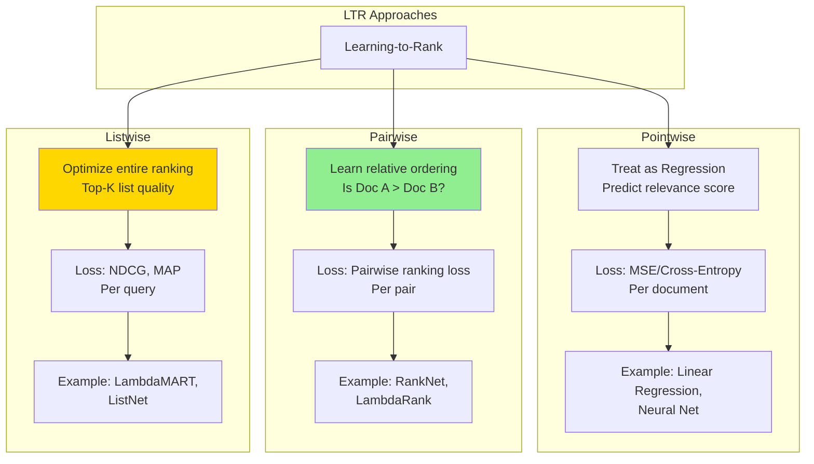

# Search Ranking System Design - FAANG Interview Guide

## Interview Format: Conversational & Iterative

This guide simulates a real ML system design interview focused on search ranking with learning-to-rank, semantic search, and BERT-based models.

---

## Interview Timeline (45 minutes)

| Phase | Time | Your Actions |
|-------|------|--------------|
| Requirements Gathering | 5-7 min | Ask clarifying questions, define scope |
| High-Level Design | 10-12 min | Draw architecture, explain retrieval + ranking |
| Deep Dive | 20-25 min | Detail learning-to-rank, BERT integration |
| Trade-offs & Scale | 5-8 min | Discuss alternatives, latency vs relevance |

---

## 🎯 Problem Statement

**Interviewer:** "Design a search ranking system like Google Search or Amazon Product Search that returns the most relevant results for user queries."

---

## Phase 1: Requirements Gathering (5-7 minutes)

### Your Response Strategy

**You:** "Search ranking is a complex problem with multiple stages. Let me ask clarifying questions to scope this properly."

### Critical Questions to Ask

**You:** "Let me understand the requirements:

1. **Use Case & Scale:**
   - What are we searching? (web pages, products, videos, documents?)
   - How many items in the corpus? (millions, billions?)
   - How many queries per second?
   - What's the query distribution? (head, torso, tail queries)

2. **Latency & Quality:**
   - What's the acceptable latency for search results?
   - How many results to return per page?
   - Do we support pagination?
   - Real-time indexing needed or batch updates?

3. **Ranking Objectives:**
   - What defines relevance? (clicks, dwell time, conversions?)
   - Are there multiple objectives? (relevance, freshness, diversity, monetization?)
   - Personalized or uniform ranking?

4. **Technical Constraints:**
   - Existing infrastructure? (Elasticsearch, Solr, custom?)
   - Budget for ML inference?
   - Can we use transformer models (BERT) or limited to classical ML?"

### Interviewer's Answers

**Interviewer:** "Good questions! Here's the scope:

- **Use Case:** E-commerce product search (like Amazon)
- **Scale:** 100M products in catalog, 50K queries/second peak
- **Latency:** Return results in <200ms (p95)
- **Results:** Top 20 products per query, support pagination
- **Objectives:** Optimize for purchases (primary) and clicks (secondary)
- **Personalization:** Yes, use user history
- **Indexing:** Near real-time (new products visible in <5 minutes)
- **Budget:** Can use BERT for final ranking, but need efficient retrieval"

### Requirements Summary

**You:** "Perfect! Let me summarize:

#### Functional Requirements
- Search 100M products with natural language queries
- Return top 20 relevant products per query
- Personalized ranking based on user history
- Support for filters (price, category, rating)
- Near real-time indexing (<5 min for new products)

#### Non-Functional Requirements
- **Scale:** 50K QPS peak, 100M products
- **Latency:** <200ms p95 end-to-end
- **Relevance:** Optimize for purchases (conversion), clicks
- **Freshness:** New products indexed within 5 minutes
- **Availability:** 99.9% uptime

#### Key Challenges
- **Semantic Search:** "laptop for gaming" should match "high-performance notebook"
- **Learning-to-Rank:** Combine 100+ relevance signals
- **Personalization:** User's past purchases, searches, clicks
- **Scale:** Can't run BERT on 100M products in 200ms

Sounds good?"

**Interviewer:** "Yes, proceed with the design."

---

## Phase 2: High-Level Design (10-12 minutes)

### Architecture Overview

**You:** "I'll design a multi-stage retrieval and ranking system, similar to Google's approach. Let me draw the architecture."

```mermaid
graph TB
    subgraph "User Layer"
        U[User Query:<br/>"wireless gaming mouse"]
    end

    subgraph "Query Understanding - Stage 0"
        QP[Query Parser]
        QE[Query Expansion]
        QR[Query Rewriting]
        SPELL[Spell Correction]
    end

    subgraph "Retrieval - Stage 1"
        R1[Lexical Search<br/>BM25/TF-IDF]
        R2[Semantic Search<br/>Dense Retrieval]
        R3[Collaborative Filtering<br/>User Behavior]
        MERGE[Candidate Merger]
    end

    subgraph "Ranking - Stage 2"
        L1[Light Ranker<br/>GBDT 10K→500]
        L2[Heavy Ranker<br/>BERT 500→100]
        L3[Final Reranking<br/>100→20]
    end

    subgraph "Feature Engineering"
        QF[Query Features]
        PF[Product Features]
        UF[User Features]
        CF[Context Features]
        CROSS[Cross Features]
    end

    subgraph "Indexing Pipeline - Offline"
        CRAWL[Product Catalog]
        EMB[Embedding Generator<br/>BERT]
        VDB[(Vector DB<br/>FAISS)]
        INV[(Inverted Index<br/>Elasticsearch)]
    end

    subgraph "ML Training - Offline"
        LOGS[(Click/Purchase Logs)]
        TRAIN[Training Pipeline]
        LTR[Learn-to-Rank Model]
        REG[Model Registry]
    end

    subgraph "Business Logic"
        FILTER[Filtering<br/>Price, Category]
        DIV[Diversity Promotion]
        BOOST[Business Rules<br/>Sponsored, Deals]
    end

    U --> QP
    QP --> SPELL
    SPELL --> QE
    QE --> QR

    QR --> R1
    QR --> R2
    QR --> R3

    R1 --> MERGE
    R2 --> MERGE
    R3 --> MERGE

    MERGE --> L1
    L1 --> L2
    L2 --> L3

    QF --> L1
    PF --> L1
    UF --> L1
    CF --> L1

    QF --> L2
    PF --> L2
    UF --> L2
    CROSS --> L2

    L3 --> FILTER
    FILTER --> DIV
    DIV --> BOOST
    BOOST --> U

    CRAWL --> EMB
    EMB --> VDB
    CRAWL --> INV

    LOGS --> TRAIN
    TRAIN --> LTR
    LTR --> REG
    REG --> L1
    REG --> L2

    style R2 fill:#90EE90
    style L2 fill:#FFB6C1
    style VDB fill:#87CEEB
    style LTR fill:#FFD700
```

### Walking Through the Architecture

**You:** "Let me explain the multi-stage pipeline:

#### Stage 0: Query Understanding (20-30ms)

**Query Processing:**
```
Original Query: "wirless gaming mous"
     ↓
Spell Correction: "wireless gaming mouse"
     ↓
Query Expansion: Add synonyms ["cordless", "game", "mice"]
     ↓
Query Rewriting: "wireless OR cordless AND gaming AND mouse OR mice"
```

#### Stage 1: Retrieval (50-80ms)

We can't score 100M products in 200ms. Need to narrow down to ~10K candidates.

**Three retrieval strategies:**

1. **Lexical Search (BM25)** - Fast keyword matching
   - Inverted index lookup in Elasticsearch
   - Query: 'wireless gaming mouse'
   - Matches: Products with these keywords in title/description
   - Retrieve top 5K products by BM25 score

2. **Semantic Search (Dense Retrieval)** - Understanding intent
   - Encode query with BERT → 768-dim vector
   - Find nearest products in vector space using FAISS
   - Query: 'wireless gaming mouse'
   - Matches: Similar products even without exact keywords
     - e.g., 'cordless gaming mice', 'RF game mouse'
   - Retrieve top 5K products by cosine similarity

3. **Collaborative Filtering** - Behavioral signals
   - Users who searched 'wireless gaming mouse' also clicked:
     - Product A (30% CTR)
     - Product B (25% CTR)
   - Retrieve top 2K products from user behavior

**Merge:** Union of all candidates ~10K products

#### Stage 2: Light Ranking (60-80ms)

- **Input:** 10K candidate products
- **Model:** Gradient Boosted Decision Trees (XGBoost/LightGBM)
- **Features:** ~100 features
  - Query-Product match score (BM25, semantic similarity)
  - Product popularity (clicks, purchases, rating)
  - User-Product affinity (past clicks, similar users)
- **Output:** Top 500 products
- **Latency:** 60ms (can process 10K products quickly)

#### Stage 3: Heavy Ranking (80-100ms)

- **Input:** 500 products
- **Model:** BERT-based cross-encoder or TW-BERT
- **Features:** Deep query-product interaction
  - Query-title similarity (BERT embeddings)
  - Query-description similarity
  - User historical interactions
- **Output:** Top 100 products
- **Latency:** 80ms (BERT is slow, only on top 500)

#### Stage 4: Final Reranking & Business Logic (20ms)

- Apply business rules (boost sponsored products, deals)
- Ensure diversity (don't show 20 products from same brand)
- Apply filters (price range, category, rating > 4.0)
- Return top 20 products"

**Interviewer:** "Good overview! Can you dive deeper into the learning-to-rank model and how you integrate BERT?"

---

## Phase 3: Deep Dive - Learning-to-Rank with BERT (20-25 minutes)

### Learning-to-Rank (LTR) Framework

**You:** "Learning-to-Rank is the core of search ranking. Let me explain the three main approaches and our design choice."



### Our Approach: Listwise LTR (LambdaMART)

**You:** "We use listwise approach because we care about the quality of the entire top-20 list, not individual scores.

#### LambdaMART Implementation

```python
import lightgbm as lgb
import numpy as np

class LambdaMARTRanker:
    """
    LambdaMART: Gradient boosted trees optimized for ranking metrics (NDCG)

    Key Idea:
    - Traditional GBDT minimizes MSE/Log Loss
    - LambdaMART minimizes NDCG/MAP directly
    - Uses lambda gradients to optimize ranking metrics
    """

    def __init__(self):
        self.model = None

    def train(self, train_data, train_labels, train_groups):
        """
        Args:
            train_data: [N, F] feature matrix (N docs, F features)
            train_labels: [N] relevance labels (0, 1, 2, 3, 4 for 5-level relevance)
            train_groups: [Q] group sizes (number of docs per query)

        Example:
            Query 1: 100 documents [0-99]
            Query 2: 80 documents [100-179]
            Query 3: 120 documents [180-299]
            train_groups = [100, 80, 120]
        """

        # Create LightGBM dataset for ranking
        train_dataset = lgb.Dataset(
            train_data,
            label=train_labels,
            group=train_groups
        )

        # LambdaMART parameters
        params = {
            'objective': 'lambdarank',  # Ranking objective
            'metric': 'ndcg',           # Optimize NDCG@20
            'ndcg_eval_at': [1, 3, 5, 10, 20],  # NDCG at different positions
            'learning_rate': 0.1,
            'num_leaves': 31,
            'max_depth': 6,
            'feature_fraction': 0.8,
            'bagging_fraction': 0.8,
            'bagging_freq': 5,
            'num_threads': 16
        }

        # Train
        self.model = lgb.train(
            params,
            train_dataset,
            num_boost_round=1000,
            valid_sets=[val_dataset],
            early_stopping_rounds=50,
            verbose_eval=50
        )

    def predict(self, query_docs):
        """
        Predict relevance scores for documents

        Returns:
            scores: [N] relevance scores for each document
        """
        return self.model.predict(query_docs)

    def rank(self, query_docs):
        """
        Rank documents by predicted relevance

        Returns:
            ranked_indices: Indices of documents sorted by relevance (high to low)
        """
        scores = self.predict(query_docs)
        ranked_indices = np.argsort(scores)[::-1]  # Descending order
        return ranked_indices


class FeatureEngineering:
    """
    Extract features for learning-to-rank
    """

    def extract_query_doc_features(self, query, document, user):
        """
        Extract 100+ features for ranking

        Feature Categories:
        1. Query-Document features
        2. Document features
        3. User-Document features
        4. User-Query features
        5. Context features
        """

        features = {}

        # 1. Query-Document Match Features
        features.update(self._query_doc_match(query, document))

        # 2. Document Quality Features
        features.update(self._document_quality(document))

        # 3. User-Document Interaction Features
        features.update(self._user_doc_interaction(user, document))

        # 4. User-Query Features
        features.update(self._user_query_features(user, query))

        # 5. Context Features
        features.update(self._context_features(query, user))

        return features

    def _query_doc_match(self, query, document):
        """Query-Document matching signals"""

        return {
            # Lexical match (BM25)
            'bm25_score_title': self.compute_bm25(query.text, document.title),
            'bm25_score_description': self.compute_bm25(query.text, document.description),

            # Exact match
            'exact_match_title': int(query.text.lower() in document.title.lower()),
            'exact_match_description': int(query.text.lower() in document.description.lower()),

            # Term coverage
            'query_terms_in_title': self.term_coverage(query.terms, document.title),
            'query_terms_in_description': self.term_coverage(query.terms, document.description),

            # Semantic similarity (BERT embeddings)
            'semantic_similarity_title': self.cosine_similarity(
                query.embedding,
                document.title_embedding
            ),
            'semantic_similarity_description': self.cosine_similarity(
                query.embedding,
                document.description_embedding
            ),

            # TF-IDF
            'tfidf_score_title': self.compute_tfidf(query.text, document.title),

            # Edit distance
            'edit_distance_title': self.normalized_edit_distance(query.text, document.title)
        }

    def _document_quality(self, document):
        """Product popularity and quality signals"""

        return {
            # Popularity
            'total_impressions': np.log1p(document.impressions),
            'total_clicks': np.log1p(document.clicks),
            'total_purchases': np.log1p(document.purchases),

            # Conversion funnel
            'ctr': document.clicks / (document.impressions + 1),
            'conversion_rate': document.purchases / (document.clicks + 1),

            # Rating
            'avg_rating': document.avg_rating,
            'num_ratings': np.log1p(document.num_ratings),

            # Price
            'price': np.log1p(document.price),
            'price_percentile': document.price_percentile,  # Percentile in category

            # Availability
            'in_stock': int(document.in_stock),
            'ships_fast': int(document.shipping_days <= 2),

            # Freshness
            'days_since_published': (datetime.now() - document.created_at).days,
            'is_new': int((datetime.now() - document.created_at).days <= 30),

            # Category rank
            'category_rank': document.rank_in_category,
            'overall_rank': document.overall_rank
        }

    def _user_doc_interaction(self, user, document):
        """User's past interaction with this product or similar products"""

        return {
            # Direct interaction
            'user_viewed_this_product': int(self.has_viewed(user.id, document.id)),
            'user_clicked_this_product': int(self.has_clicked(user.id, document.id)),
            'user_purchased_this_product': int(self.has_purchased(user.id, document.id)),

            # Category affinity
            'user_category_affinity': self.get_category_affinity(user.id, document.category),

            # Brand affinity
            'user_brand_affinity': self.get_brand_affinity(user.id, document.brand),

            # Price preference
            'user_avg_price': user.avg_purchase_price,
            'price_vs_user_avg': document.price / (user.avg_purchase_price + 1),

            # Collaborative filtering
            'cf_score': self.get_collaborative_filtering_score(user.id, document.id)
        }

    def _user_query_features(self, user, query):
        """User's search behavior"""

        return {
            # Query specificity
            'query_length': len(query.terms),
            'query_is_rare': int(query.frequency < 100),  # Tail query

            # User search history
            'user_searched_this_query_before': int(
                query.text in user.search_history
            ),

            # User search session
            'session_query_count': user.current_session_query_count,
            'session_click_count': user.current_session_click_count
        }

    def _context_features(self, query, user):
        """Contextual signals"""

        return {
            # Temporal
            'hour_of_day': datetime.now().hour,
            'day_of_week': datetime.now().weekday(),
            'is_weekend': int(datetime.now().weekday() >= 5),

            # Device
            'device_type': user.device,  # mobile, desktop, tablet
            'is_mobile': int(user.device == 'mobile'),

            # Location (if available)
            'user_country': user.country,
            'user_city': user.city
        }
```

### BERT Integration: TW-BERT for Search Ranking

**You:** "Now let me explain how we integrate BERT. We use Google's TW-BERT (Term Weighting BERT) architecture, which is optimized for retrieval."

```mermaid
graph TB
    subgraph "TW-BERT Architecture"
        A[Query: 'wireless gaming mouse']
        B[Product Title: 'Logitech G502 Wireless Gaming Mouse']
    end

    subgraph "Two-Tower Encoding - Stage 1"
        Q[Query Encoder<br/>BERT Base]
        D[Document Encoder<br/>BERT Base]
    end

    subgraph "Cross-Attention - Stage 2"
        CA[Cross-Encoder<br/>BERT Large<br/>Query [SEP] Title]
    end

    subgraph "Term Weighting Layer"
        TW[Term Importance Weights<br/>Attention Weights]
        WT[Weighted Token Embeddings]
    end

    subgraph "Scoring"
        DOT[Dot Product<br/>Similarity]
        CE[Cross-Encoder Score]
        FINAL[Final Score<br/>Weighted Combination]
    end

    A --> Q
    B --> D

    Q --> TW
    D --> TW

    TW --> WT
    WT --> DOT

    A --> CA
    B --> CA
    CA --> CE

    DOT --> FINAL
    CE --> FINAL

    style TW fill:#90EE90
    style CA fill:#FFB6C1
    style FINAL fill:#FFD700
```

#### Implementation

```python
import torch
import torch.nn as nn
from transformers import BertModel, BertTokenizer

class TWBERTRanker(nn.Module):
    """
    Term Weighting BERT for Search Ranking

    Advantages over standard BERT:
    1. Two-tower for fast candidate retrieval
    2. Term weighting for interpretability
    3. Cross-encoder for final ranking
    """

    def __init__(self, use_cross_encoder=True):
        super().__init__()

        # BERT encoders
        self.query_encoder = BertModel.from_pretrained('bert-base-uncased')
        self.doc_encoder = BertModel.from_pretrained('bert-base-uncased')

        # Term weighting layer
        self.term_weight = nn.Linear(768, 1)

        # Optional cross-encoder for final ranking
        self.use_cross_encoder = use_cross_encoder
        if use_cross_encoder:
            self.cross_encoder = BertModel.from_pretrained('bert-large-uncased')
            self.cross_classifier = nn.Linear(1024, 1)

    def encode_query(self, query_ids, query_mask):
        """
        Encode query with term weighting

        Returns:
            weighted_embedding: [batch_size, 768]
        """

        # BERT encoding
        outputs = self.query_encoder(
            input_ids=query_ids,
            attention_mask=query_mask
        )

        # Token embeddings: [batch_size, seq_len, 768]
        token_embeddings = outputs.last_hidden_state

        # Compute term importance weights
        term_weights = self.term_weight(token_embeddings)  # [batch_size, seq_len, 1]
        term_weights = torch.softmax(term_weights, dim=1)   # Normalize

        # Weighted average pooling
        weighted_embedding = torch.sum(
            token_embeddings * term_weights,
            dim=1
        )  # [batch_size, 768]

        return weighted_embedding

    def encode_document(self, doc_ids, doc_mask):
        """Encode document (same as query encoding)"""
        return self.encode_query(doc_ids, doc_mask)  # Share architecture

    def compute_similarity(self, query_embedding, doc_embedding):
        """Dot product similarity"""
        return torch.sum(query_embedding * doc_embedding, dim=1)

    def cross_encode(self, query_ids, doc_ids):
        """
        Cross-encoder: Concatenate query and document

        Input format: [CLS] query [SEP] document [SEP]
        """

        # Concatenate
        combined_ids = torch.cat([
            query_ids,
            torch.full((query_ids.size(0), 1), 102).to(query_ids.device),  # [SEP]
            doc_ids
        ], dim=1)

        # BERT encoding
        outputs = self.cross_encoder(input_ids=combined_ids)

        # [CLS] token embedding
        cls_embedding = outputs.last_hidden_state[:, 0, :]  # [batch_size, 1024]

        # Classification
        score = self.cross_classifier(cls_embedding)  # [batch_size, 1]

        return score.squeeze()

    def forward(self, query_ids, query_mask, doc_ids, doc_mask):
        """
        Forward pass for training

        Returns:
            score: Relevance score
        """

        # Two-tower encoding (fast, for retrieval)
        query_emb = self.encode_query(query_ids, query_mask)
        doc_emb = self.encode_document(doc_ids, doc_mask)

        similarity_score = self.compute_similarity(query_emb, doc_emb)

        # Cross-encoder (slow, for final ranking)
        if self.use_cross_encoder:
            cross_score = self.cross_encode(query_ids, doc_ids)

            # Combine scores
            final_score = 0.7 * similarity_score + 0.3 * cross_score
        else:
            final_score = similarity_score

        return final_score


class TWBERTTrainer:
    """Training pipeline for TW-BERT ranker"""

    def __init__(self, model):
        self.model = model
        self.optimizer = torch.optim.AdamW(
            model.parameters(),
            lr=2e-5,
            weight_decay=0.01
        )

    def train_with_triplets(self, train_loader):
        """
        Train with triplet loss

        Each example: (query, positive_doc, negative_doc)
        Loss: score(query, pos_doc) > score(query, neg_doc) + margin
        """

        self.model.train()

        for batch in train_loader:
            # Unpack batch
            query_ids = batch['query_ids']
            pos_doc_ids = batch['pos_doc_ids']
            neg_doc_ids = batch['neg_doc_ids']

            # Forward pass
            pos_score = self.model(query_ids, pos_doc_ids)
            neg_score = self.model(query_ids, neg_doc_ids)

            # Triplet margin loss
            # Loss = max(0, neg_score - pos_score + margin)
            margin = 1.0
            loss = torch.mean(
                torch.clamp(neg_score - pos_score + margin, min=0)
            )

            # Backward pass
            self.optimizer.zero_grad()
            loss.backward()
            self.optimizer.step()

    def train_with_pairwise_ranking(self, train_loader):
        """
        Train with pairwise ranking loss (RankNet)

        Loss = -log(sigmoid(score_pos - score_neg))
        """

        self.model.train()

        for batch in train_loader:
            query_ids = batch['query_ids']
            pos_doc_ids = batch['pos_doc_ids']
            neg_doc_ids = batch['neg_doc_ids']

            # Scores
            pos_score = self.model(query_ids, pos_doc_ids)
            neg_score = self.model(query_ids, neg_doc_ids)

            # RankNet loss
            loss = -torch.log(
                torch.sigmoid(pos_score - neg_score)
            ).mean()

            # Backward
            self.optimizer.zero_grad()
            loss.backward()
            self.optimizer.step()
```

### Hybrid Retrieval: BM25 + Dense Retrieval

**You:** "For the retrieval stage, we combine lexical (BM25) and semantic (BERT) search:

```python
class HybridRetriever:
    """
    Combine BM25 (lexical) and Dense Retrieval (semantic)
    """

    def __init__(self, es_client, faiss_index, bert_encoder):
        self.es_client = es_client  # Elasticsearch for BM25
        self.faiss_index = faiss_index  # FAISS for dense retrieval
        self.bert_encoder = bert_encoder  # BERT query encoder

    def retrieve(self, query, top_k=10000, alpha=0.7):
        """
        Hybrid retrieval with reciprocal rank fusion

        Args:
            query: Search query text
            top_k: Number of candidates to retrieve
            alpha: Weight for dense retrieval (1-alpha for BM25)

        Returns:
            candidates: List of product IDs
        """

        # 1. BM25 retrieval (fast keyword search)
        bm25_results = self.es_client.search(
            index='products',
            body={
                'query': {
                    'multi_match': {
                        'query': query,
                        'fields': ['title^3', 'description^1', 'category^2'],
                        'type': 'best_fields'
                    }
                },
                'size': top_k
            }
        )

        bm25_docs = [(hit['_id'], hit['_score']) for hit in bm25_results['hits']['hits']]

        # 2. Dense retrieval (semantic search)
        query_embedding = self.bert_encoder.encode(query)

        # FAISS nearest neighbor search
        distances, indices = self.faiss_index.search(
            query_embedding.reshape(1, -1),
            k=top_k
        )

        dense_docs = [(self.index_to_id[idx], 1.0 - dist)
                      for idx, dist in zip(indices[0], distances[0])]

        # 3. Reciprocal Rank Fusion (RRF)
        # Combine rankings from both methods
        scores = {}
        k = 60  # RRF constant

        # Add BM25 scores
        for rank, (doc_id, score) in enumerate(bm25_docs):
            scores[doc_id] = scores.get(doc_id, 0) + (1 - alpha) / (k + rank + 1)

        # Add dense retrieval scores
        for rank, (doc_id, score) in enumerate(dense_docs):
            scores[doc_id] = scores.get(doc_id, 0) + alpha / (k + rank + 1)

        # Sort by combined score
        ranked_docs = sorted(scores.items(), key=lambda x: x[1], reverse=True)

        return [doc_id for doc_id, _ in ranked_docs[:top_k]]
```

---

## Phase 4: Trade-offs & Optimization (5-8 minutes)

**Interviewer:** "How do you meet the 200ms latency requirement while using BERT?"

### Latency Budget & Optimizations

**You:** "Here's our latency breakdown and optimization strategies:

```
Total Budget: 200ms (p95)

1. Query Understanding:          20ms
   - Spell correction:           5ms
   - Query expansion:            5ms
   - Query rewriting:            10ms

2. Retrieval:                    60ms
   - BM25 (Elasticsearch):       30ms (5K products)
   - Dense (FAISS):              20ms (5K products)
   - Collaborative filtering:    10ms (2K products)

3. Light Ranking (XGBoost):      60ms
   - Feature extraction:         20ms
   - Model inference (10K→500):  40ms

4. Heavy Ranking (BERT):         50ms
   - Feature extraction:         10ms
   - TW-BERT inference (500→100): 40ms

5. Final Reranking:              10ms
   - Business logic:             5ms
   - Diversity filter:           5ms

Total:                           200ms
```

### Optimization Strategies

```python
class LatencyOptimizations:
    """
    Techniques to meet 200ms latency requirement
    """

    def optimize_bert_inference(self, model):
        """
        Strategy 1: Model Distillation + Quantization

        - Distill BERT-Large → BERT-Small (66M → 12M params)
        - Quantize FP32 → INT8 (4x speedup)
        - Use ONNX Runtime for inference (2x speedup)

        Combined speedup: 8x
        """

        # Distillation (offline training)
        small_model = self.distill_bert(
            teacher=model,  # BERT-Large
            student=BertSmall()  # 6 layers instead of 12
        )

        # Quantization
        quantized_model = torch.quantization.quantize_dynamic(
            small_model,
            {torch.nn.Linear},  # Quantize linear layers
            dtype=torch.qint8
        )

        # ONNX conversion
        onnx_model = self.convert_to_onnx(quantized_model)

        return onnx_model

    def optimize_retrieval(self, faiss_index):
        """
        Strategy 2: Approximate Nearest Neighbor (ANN)

        - FAISS IVF (Inverted File Index) for fast ANN
        - Product Quantization for compression

        Speedup: 100x (exact → approximate search)
        Recall: 95%+ (slight quality loss acceptable)
        """

        # Build IVF index
        # Cluster embeddings into 1000 centroids
        # At query time, only search nearest 10 clusters
        quantizer = faiss.IndexFlatIP(768)  # 768-dim embeddings

        ivf_index = faiss.IndexIVFPQ(
            quantizer,
            768,            # dimension
            1000,           # number of clusters (nlist)
            64,             # PQ code size
            8               # PQ subquantizers
        )

        # Train index on product embeddings
        ivf_index.train(product_embeddings)
        ivf_index.add(product_embeddings)

        # Set search parameters
        ivf_index.nprobe = 10  # Search 10 nearest clusters

        return ivf_index

    def optimize_feature_caching(self):
        """
        Strategy 3: Pre-compute and cache features

        Product features:
        - Cached in Redis (1 hour TTL)
        - Updated every 5 minutes for popular products

        User features:
        - Cached in Redis (5 minute TTL)
        - Preloaded for active sessions
        """

        # Cache product embeddings
        for product in self.popular_products:
            embedding = self.bert_encoder.encode(product.title)

            self.redis.setex(
                f'product:embedding:{product.id}',
                3600,  # 1 hour TTL
                embedding.tobytes()
            )

        # Cache user search history
        for user in self.active_users:
            history = self.get_user_search_history(user.id)

            self.redis.setex(
                f'user:history:{user.id}',
                300,  # 5 minute TTL
                json.dumps(history)
            )

    def optimize_with_caching(self):
        """
        Strategy 4: Query-level caching

        Cache popular queries (80/20 rule: 20% queries account for 80% traffic)
        - "iphone 15 pro max" → Cached results for 5 minutes
        - TTL varies by query popularity
        """

        @lru_cache(maxsize=100000)
        def search_with_cache(query, user_id=None):
            """
            Cache search results for popular queries
            """

            # Check cache
            cache_key = f'search:{query}'
            if user_id:
                cache_key += f':{user_id}'

            cached_results = self.redis.get(cache_key)
            if cached_results:
                return json.loads(cached_results)

            # Compute results
            results = self.search(query, user_id)

            # Cache for 5 minutes
            self.redis.setex(cache_key, 300, json.dumps(results))

            return results
```

---

## Summary & Key Takeaways

**You:** "To summarize the Search Ranking system:

### Architecture Highlights

1. **Multi-Stage Pipeline:** Query Understanding → Retrieval (100M→10K) → Light Ranking (10K→500) → Heavy Ranking (500→100) → Reranking (100→20)
2. **Hybrid Retrieval:** BM25 (lexical) + Dense BERT (semantic) + Collaborative Filtering
3. **Learning-to-Rank:** LambdaMART (listwise LTR optimized for NDCG)
4. **BERT Integration:** TW-BERT for semantic understanding + term weighting
5. **Latency Optimization:** Distillation + Quantization + ANN + Caching

### Key Design Decisions

| Decision | Rationale | Alternative |
|----------|-----------|-------------|
| Hybrid Retrieval | BM25 fast, BERT accurate | Pure dense (slower) |
| LambdaMART | Optimizes NDCG directly | Pointwise regression |
| Two-tower BERT | Fast candidate retrieval | Cross-encoder only (slow) |
| FAISS IVF-PQ | 100x faster ANN search | Exact search (too slow) |
| Three-stage ranking | Reduce BERT inference cost | BERT on all 100M products |

### Production Metrics

- **Latency:** <200ms p95 (Query: 20ms, Retrieval: 60ms, Ranking: 110ms, Business Logic: 10ms)
- **Throughput:** 50K QPS (horizontal scaling with load balancing)
- **Relevance:** NDCG@20 > 0.85, MRR > 0.75
- **Business Impact:** +10% conversion rate vs baseline

This design demonstrates:
- Multi-stage retrieval and ranking
- Learning-to-rank with BERT
- Latency optimization techniques
- Scalability to billions of documents"

---

## Sources

- [Learning-to-Rank with BERT in TF-Ranking](https://research.google/pubs/learning-to-rank-with-bert-in-tf-ranking/)
- [Google Ranking Algorithm Research Introduces TW-BERT](https://www.searchenginejournal.com/google-term-weighting-bert/493331/)
- [From Training to Ranking: Using BERT to Improve Search Relevance](https://sease.io/2021/12/using-bert-to-improve-search-relevance.html)
- [Learning to Rank in Web Search](https://hav4ik.github.io/learning-to-rank/)
- [Understanding searches better than ever before](https://blog.google/products/search/search-language-understanding-bert/)
