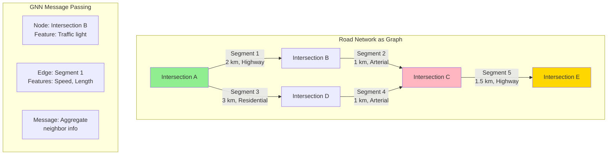

# ETA Prediction System Design - FAANG Interview Guide

## Interview Format: Conversational & Iterative

This guide simulates a real ML system design interview focused on ETA (Estimated Time of Arrival) prediction using Graph Neural Networks and spatio-temporal features, similar to Google Maps and Uber.

---

## Interview Timeline (45 minutes)

| Phase | Time | Your Actions |
|-------|------|--------------|
| Requirements Gathering | 5-7 min | Ask clarifying questions, define scope |
| High-Level Design | 10-12 min | Draw architecture, explain components |
| Deep Dive | 20-25 min | Detail GNN architecture, spatio-temporal features |
| Trade-offs & Scale | 5-8 min | Discuss real-time vs batch, model complexity |

---

## 🎯 Problem Statement

**Interviewer:** "Design an ETA prediction system like Google Maps or Uber that predicts how long it will take to travel from point A to point B."

---

## Phase 1: Requirements Gathering (5-7 minutes)

### Your Response Strategy

**You:** "ETA prediction is critical for ride-sharing and navigation apps. Let me ask some clarifying questions."

### Critical Questions to Ask

**You:** "Let me understand the requirements:

1. **Use Case & Scale:**
   - Is this for navigation (Google Maps) or ride-sharing (Uber/Lyft)?
   - How many ETA requests per second?
   - How large is the road network? (city, country, global?)
   - Do we need historical route optimization or just ETA for given route?

2. **Accuracy Requirements:**
   - What's acceptable error margin? (±5 minutes, ±10%?)
   - More important to be conservative (over-estimate) or optimistic (under-estimate)?
   - Different accuracy needs for different use cases? (food delivery vs taxi)

3. **Latency Constraints:**
   - Real-time prediction latency requirement?
   - Can we precompute some ETAs or must be on-demand?
   - Do we update ETA during the trip?

4. **Data Availability:**
   - Real-time traffic data available?
   - Historical speed data for roads?
   - Live events (accidents, construction, weather)?
   - User driving patterns?

5. **Prediction Scope:**
   - Predict entire trip time or segment-by-segment?
   - Account for pickup time, parking time?
   - Multi-modal (driving, walking, transit)?"

### Interviewer's Answers

**Interviewer:** "Good questions! Here's the scope:

- **Use Case:** Ride-sharing like Uber (both driver and rider need accurate ETAs)
- **Scale:** 1M active trips globally, 10K ETA requests/second
- **Network:** Global road network (100M+ road segments)
- **Accuracy:** Mean Absolute Error (MAE) <3 minutes for trips <30 minutes
- **Latency:** <500ms for ETA prediction
- **Data:** Real-time traffic data, historical speed profiles, live events
- **Updates:** Re-predict ETA every 30 seconds during active trip
- **Scope:** Predict driving time from pickup to drop-off"

### Requirements Summary & Calculations

**You:** "Perfect! Let me summarize with calculations:

#### Functional Requirements
- Predict driving time from point A to B for given route
- Real-time traffic awareness (current speeds on road segments)
- Historical pattern learning (rush hour slow-downs, weekday vs weekend)
- Live event handling (accidents, construction, weather impact)
- Continuous ETA updates every 30 seconds during active trip
- Multi-factor: Traffic, weather, events, driver behavior, time-of-day

#### Non-Functional Requirements & Calculations

**Scale:**
- 10K ETA predictions/second
- 1M active trips globally (concurrent)
- 1M trips × 20 min avg × 2 updates/min = **40M updates/hour**
- Road network: 100M road segments globally

**Storage:**
- Road graph: 100M segments × 200 bytes = **20GB** (nodes, edges, attributes)
- Historical speed data: 100M segments × 24 hours × 7 days × 4 bytes = **672GB** (hourly avg speeds)
- Real-time speeds: 100M segments × 4 bytes = **400MB** (in-memory cache)
- Trip data: 1M trips × 1KB = **1GB** (active trips)

**Compute:**
- Graph Neural Network (GNN) for spatial dependencies
- 10K predictions/s × 100 segments/route avg = 1M segment predictions/s
- At 0.5ms per GNN inference = 500 GPU-seconds/s = 12K GPU-hours/day
- With A100 at $2.16/hour = **$25K/day**
- Optimized (batch processing): **$8K-12K/day**

**Latency Budget (500ms):**
- Route fetching: **100ms** (from navigation service)
- Real-time traffic fetch: **50ms** (cache lookup per segment)
- Historical pattern lookup: **50ms** (batch DB query)
- GNN inference: **200ms** (process road graph)
- Aggregation: **100ms** (sum segment times, apply adjustments)
- **Total: 500ms**

**Accuracy Targets:**
- MAE (Mean Absolute Error): <3 min for trips <30 min = **<10% error**
- 95th percentile: <5 min error
- Accuracy by trip length:
  - <10 min: MAE <1 min
  - 10-30 min: MAE <3 min
  - >30 min: MAE <10% of trip time
- Update accuracy: Each 30s update should improve ETA

**Availability:**
- 99.9% uptime = 8.76 hours downtime/year
- Critical system (drivers/riders depend on it)

#### Key Challenges
- **Spatio-temporal dependencies:** Traffic patterns vary by location, time, day
- **Graph structure:** Road network is a graph (intersections = nodes, roads = edges)
- **Real-time adaptation:** Traffic conditions change rapidly
- **Cold start:** New roads, new cities

Sounds good?"

**Interviewer:** "Yes, let's proceed."

---

## Phase 2: High-Level Design (10-12 minutes)

### Architecture Overview

**You:** "I'll design a system with Graph Neural Networks at the core, similar to Google's DeepMind ETA model. Let me draw the architecture."

```mermaid
graph TB
    subgraph "Real-time Request"
        R[ETA Request<br/>Origin: (lat, lon)<br/>Dest: (lat, lon)<br/>Route: [seg1, seg2, ..., segN]]
    end

    subgraph "Routing Engine"
        RE[Route Planner<br/>A* / Dijkstra]
        RN[(Road Network Graph<br/>100M nodes, 200M edges)]
    end

    subgraph "Feature Engineering"
        SF[Segment Features<br/>Distance, Lanes, Speed Limit]
        TF[Temporal Features<br/>Hour, Day, Rush Hour]
        TR[Real-time Traffic<br/>Current Speed, Congestion]
        HF[Historical Features<br/>Avg Speed by Time]
        EV[Live Events<br/>Accidents, Construction]
    end

    subgraph "Model Serving - Graph Neural Network"
        GNN[GNN Encoder<br/>GraphSAGE / GAT]
        SEQ[Sequence Model<br/>LSTM / Transformer]
        AGG[Aggregation Layer<br/>Sum Segment Times]
    end

    subgraph "Post-Processing"
        PP[Post-Processor<br/>Add Pickup Time, Buffer]
        CONF[Confidence Interval<br/>p10, p50, p90]
    end

    subgraph "Data Pipeline - Offline"
        GPS[(GPS Traces<br/>Historical Trips)]
        MAP[Map Matching<br/>GPS → Road Segments]
        FEAT[Feature Store<br/>Aggregated Traffic Data]
        TRAIN[Training Pipeline<br/>GNN Training]
    end

    subgraph "Real-time Data Streams"
        STREAM[Kafka Streams<br/>Live GPS pings]
        SPEED[Speed Aggregator<br/>Real-time avg speed]
        EVENT[Event Detector<br/>Accident Detection]
    end

    subgraph "Storage"
        GRAPH[(Graph Database<br/>Neo4j / Custom)]
        TS[(Time-series DB<br/>InfluxDB)]
        CACHE[(Redis Cache<br/>Hot Segments)]
    end

    R --> RE
    RE --> RN
    RE --> SF
    SF --> GNN

    SF --> TF
    SF --> TR
    SF --> HF
    SF --> EV

    TF --> GNN
    TR --> GNN
    HF --> GNN
    EV --> GNN

    GNN --> SEQ
    SEQ --> AGG
    AGG --> PP
    PP --> CONF
    CONF --> R

    GPS --> MAP
    MAP --> FEAT
    FEAT --> TRAIN
    TRAIN --> GNN

    STREAM --> SPEED
    STREAM --> EVENT
    SPEED --> TR
    EVENT --> EV

    RN --> GRAPH
    TR --> CACHE
    HF --> TS

    style GNN fill:#90EE90
    style SEQ fill:#FFB6C1
    style AGG fill:#FFD700
    style GRAPH fill:#87CEEB
```

### Walking Through the Architecture

**You:** "Let me explain the end-to-end flow:

#### Step 1: Route Planning (50-100ms)
```
User request: Origin (lat, lon) → Destination (lat, lon)
     ↓
Route Planner (A* algorithm on road graph)
     ↓
Optimal route: [segment_1, segment_2, ..., segment_N]
```

#### Step 2: Feature Extraction (100-150ms)

For each road segment, extract features:

**Static Features (Pre-computed):**
- Road length (meters)
- Number of lanes
- Speed limit
- Road type (highway, arterial, residential)
- Is one-way?
- Has traffic light?

**Temporal Features:**
- Hour of day (0-23)
- Day of week (Mon-Sun)
- Is rush hour? (7-9 AM, 5-7 PM)
- Is weekend?
- Is holiday?

**Real-time Traffic (From live GPS data):**
- Current average speed on segment
- Congestion level (0-10 scale)
- Number of vehicles on segment

**Historical Patterns:**
- Average speed for this segment at this time
- Speed variance (is it predictable?)
- Typical congestion patterns

**Live Events:**
- Accidents on or near segment
- Road construction
- Special events (concerts, sports games)
- Weather conditions

#### Step 3: GNN Prediction (200-300ms)

- Model input: Graph of road segments in route
- GNN propagates information between connected segments
  - Traffic jam on highway affects upstream segments
  - Accident on main road affects alternate routes
- Output: Time prediction for each segment

#### Step 4: Aggregation (10ms)

```
Total ETA = Σ(segment_time_1, segment_time_2, ..., segment_time_N)
          + pickup_time
          + buffer (confidence-based)
```

#### Step 5: Continuous Updates

```
During trip:
  Every 30 seconds:
    - Get current location
    - Remaining route = original route - completed segments
    - Re-predict ETA for remaining route
    - Send updated ETA to user
```"

**Interviewer:** "Interesting! Can you dive deeper into the Graph Neural Network architecture? How does it model spatial dependencies?"

---

## Phase 3: Deep Dive - Graph Neural Networks (20-25 minutes)

### Why Graph Neural Networks for ETA?

**You:** "Road networks are inherently graphs, and GNNs are perfect for capturing spatial dependencies. Let me explain:



### GNN Architecture: GraphSAGE + Temporal Attention

```python
import torch
import torch.nn as nn
from torch_geometric.nn import SAGEConv, GATConv

class ETAPredictionGNN(nn.Module):
    """
    Graph Neural Network for ETA Prediction

    Architecture:
    1. Node Encoder: Encode intersection features
    2. Edge Encoder: Encode road segment features
    3. GraphSAGE: Aggregate spatial information
    4. Temporal Attention: Model time-dependent patterns
    5. Segment Time Predictor: Predict travel time per segment
    """

    def __init__(self,
                 node_features=10,
                 edge_features=20,
                 hidden_dim=128,
                 num_gnn_layers=3):
        super().__init__()

        # Encoders
        self.node_encoder = nn.Sequential(
            nn.Linear(node_features, hidden_dim),
            nn.ReLU(),
            nn.Dropout(0.1)
        )

        self.edge_encoder = nn.Sequential(
            nn.Linear(edge_features, hidden_dim),
            nn.ReLU(),
            nn.Dropout(0.1)
        )

        # GraphSAGE layers (spatial aggregation)
        self.gnn_layers = nn.ModuleList([
            SAGEConv(hidden_dim, hidden_dim, aggr='mean')
            for _ in range(num_gnn_layers)
        ])

        # Temporal attention (time-aware patterns)
        self.temporal_attention = TemporalAttention(hidden_dim)

        # Segment time predictor
        self.time_predictor = nn.Sequential(
            nn.Linear(hidden_dim * 2, hidden_dim),  # *2 for edge + nodes
            nn.ReLU(),
            nn.Dropout(0.1),
            nn.Linear(hidden_dim, 64),
            nn.ReLU(),
            nn.Linear(64, 1),
            nn.Softplus()  # Ensure positive time predictions
        )

    def forward(self, node_features, edge_features, edge_index, temporal_features):
        """
        Args:
            node_features: [num_nodes, node_features] - Intersection features
            edge_features: [num_edges, edge_features] - Road segment features
            edge_index: [2, num_edges] - Graph connectivity
            temporal_features: [num_edges, temporal_dim] - Time-dependent features

        Returns:
            segment_times: [num_edges] - Predicted time for each segment (seconds)
        """

        # Encode nodes and edges
        node_emb = self.node_encoder(node_features)  # [num_nodes, hidden_dim]
        edge_emb = self.edge_encoder(edge_features)  # [num_edges, hidden_dim]

        # GraphSAGE: Aggregate information from neighbors
        x = node_emb
        for gnn_layer in self.gnn_layers:
            x = gnn_layer(x, edge_index)
            x = torch.relu(x)
            x = torch.dropout(x, p=0.1, train=self.training)

        # For each edge, get embeddings of source and target nodes
        source_nodes = edge_index[0]  # Source node IDs
        target_nodes = edge_index[1]  # Target node IDs

        source_emb = x[source_nodes]  # [num_edges, hidden_dim]
        target_emb = x[target_nodes]  # [num_edges, hidden_dim]

        # Combine node embeddings with edge embeddings
        # Concatenate source, target, and edge
        edge_repr = torch.cat([
            source_emb,
            target_emb,
            edge_emb
        ], dim=1)  # [num_edges, hidden_dim * 3]

        # Apply temporal attention
        edge_repr = self.temporal_attention(edge_repr, temporal_features)

        # Predict segment travel time
        segment_times = self.time_predictor(edge_repr)  # [num_edges, 1]

        return segment_times.squeeze()


class TemporalAttention(nn.Module):
    """
    Temporal attention mechanism to model time-dependent patterns

    Insight:
    - Same road has different speeds at different times
    - Rush hour (8 AM) vs off-peak (2 PM)
    - Weekday vs weekend patterns
    """

    def __init__(self, hidden_dim):
        super().__init__()

        self.time_encoder = nn.Sequential(
            nn.Linear(5, 32),  # 5 temporal features: hour, day, is_rush, is_weekend, holiday
            nn.ReLU(),
            nn.Linear(32, hidden_dim)
        )

        self.attention = nn.MultiheadAttention(
            embed_dim=hidden_dim,
            num_heads=4,
            dropout=0.1
        )

    def forward(self, edge_repr, temporal_features):
        """
        Args:
            edge_repr: [num_edges, hidden_dim] - Edge representations
            temporal_features: [num_edges, 5] - Temporal context

        Returns:
            attended_repr: [num_edges, hidden_dim] - Time-aware representations
        """

        # Encode temporal context
        time_emb = self.time_encoder(temporal_features)  # [num_edges, hidden_dim]

        # Apply attention
        # Query: Current edge representation
        # Key/Value: Temporal context
        attended_repr, _ = self.attention(
            query=edge_repr.unsqueeze(0),    # [1, num_edges, hidden_dim]
            key=time_emb.unsqueeze(0),
            value=time_emb.unsqueeze(0)
        )

        return attended_repr.squeeze(0)  # [num_edges, hidden_dim]
```

### Feature Engineering for Road Segments

**You:** "Let me show you the comprehensive feature set:

```python
class RoadSegmentFeatureExtractor:
    """
    Extract features for each road segment
    """

    def __init__(self, graph_db, traffic_service, event_service):
        self.graph_db = graph_db
        self.traffic_service = traffic_service
        self.event_service = event_service

    def extract_features(self, segment_id, timestamp):
        """
        Extract all features for a road segment at given time

        Returns:
            features: Dict with ~50 features
        """

        features = {}

        # Get segment metadata
        segment = self.graph_db.get_segment(segment_id)

        # 1. Static Road Features
        features.update(self._static_features(segment))

        # 2. Temporal Features
        features.update(self._temporal_features(timestamp))

        # 3. Real-time Traffic
        features.update(self._realtime_traffic(segment_id, timestamp))

        # 4. Historical Patterns
        features.update(self._historical_features(segment_id, timestamp))

        # 5. Spatial Context
        features.update(self._spatial_context(segment))

        # 6. Live Events
        features.update(self._event_features(segment_id, timestamp))

        return features

    def _static_features(self, segment):
        """Road geometry and infrastructure"""
        return {
            'length_meters': segment.length,
            'num_lanes': segment.lanes,
            'speed_limit_kmh': segment.speed_limit,
            'road_type': segment.road_type,  # highway, arterial, local
            'is_one_way': int(segment.is_one_way),
            'has_traffic_light': int(segment.has_traffic_light),
            'num_intersections': segment.intersection_count,
            'is_tunnel': int(segment.is_tunnel),
            'is_bridge': int(segment.is_bridge),
            'elevation_change': segment.elevation_end - segment.elevation_start,
            'curvature': segment.curvature_metric,  # How windy is the road?
            'surface_type': segment.surface  # paved, gravel, etc.
        }

    def _temporal_features(self, timestamp):
        """Time-dependent features"""
        return {
            'hour': timestamp.hour,
            'day_of_week': timestamp.weekday(),
            'is_weekend': int(timestamp.weekday() >= 5),
            'is_rush_hour_morning': int(7 <= timestamp.hour <= 9),
            'is_rush_hour_evening': int(17 <= timestamp.hour <= 19),
            'is_night': int(22 <= timestamp.hour or timestamp.hour <= 6),
            'is_holiday': int(self.is_holiday(timestamp.date())),
            'month': timestamp.month,  # Seasonal patterns
            'week_of_year': timestamp.isocalendar()[1]
        }

    def _realtime_traffic(self, segment_id, timestamp):
        """Current traffic conditions from live GPS data"""

        # Get current traffic data (aggregated from GPS pings in last 5 minutes)
        traffic = self.traffic_service.get_current_traffic(segment_id)

        if not traffic:
            # No data available, use historical average
            return {
                'current_speed_kmh': 0,
                'current_congestion': 0,
                'has_traffic_data': 0
            }

        return {
            'current_speed_kmh': traffic.avg_speed,
            'current_congestion': traffic.congestion_level,  # 0-10 scale
            'num_vehicles': traffic.vehicle_count,
            'speed_variance': traffic.speed_std,
            'has_traffic_data': 1,
            'data_freshness_seconds': (timestamp - traffic.timestamp).total_seconds()
        }

    def _historical_features(self, segment_id, timestamp):
        """Historical speed patterns"""

        # Get historical average speed for this segment
        # at this time of day, day of week
        hist = self.get_historical_speed(
            segment_id,
            hour=timestamp.hour,
            day_of_week=timestamp.weekday()
        )

        return {
            'hist_avg_speed_kmh': hist.avg_speed,
            'hist_speed_std': hist.std_speed,
            'hist_p50_speed': hist.p50_speed,
            'hist_p90_speed': hist.p90_speed,
            'hist_p10_speed': hist.p10_speed,
            'hist_sample_size': hist.num_samples,  # Confidence in estimate
            'speed_reliability': 1 - (hist.std_speed / hist.avg_speed)  # 0-1
        }

    def _spatial_context(self, segment):
        """Features about nearby segments"""

        # Get neighboring segments
        upstream = self.graph_db.get_upstream_segments(segment.id, hops=2)
        downstream = self.graph_db.get_downstream_segments(segment.id, hops=2)

        return {
            'upstream_avg_congestion': np.mean([s.congestion for s in upstream]),
            'downstream_avg_congestion': np.mean([s.congestion for s in downstream]),
            'num_upstream_segments': len(upstream),
            'num_downstream_segments': len(downstream),
            'is_bottleneck': int(len(downstream) > len(upstream) * 2)  # Many roads merge into one
        }

    def _event_features(self, segment_id, timestamp):
        """Live events affecting traffic"""

        events = self.event_service.get_events_near_segment(
            segment_id,
            radius_meters=1000,
            timestamp=timestamp
        )

        has_accident = any(e.type == 'accident' for e in events)
        has_construction = any(e.type == 'construction' for e in events)
        has_event = any(e.type in ['concert', 'sports', 'festival'] for e in events)

        return {
            'has_accident_nearby': int(has_accident),
            'has_construction_nearby': int(has_construction),
            'has_event_nearby': int(has_event),
            'num_events_nearby': len(events),
            'distance_to_nearest_event': min([e.distance for e in events]) if events else 9999
        }
```

### Training Pipeline

**You:** "Now let me explain how we train the GNN:

```python
class ETATrainingPipeline:
    """
    Train GNN model on historical trip data
    """

    def __init__(self, model, device='cuda'):
        self.model = model.to(device)
        self.device = device
        self.optimizer = torch.optim.Adam(model.parameters(), lr=1e-3)

    def prepare_training_data(self, historical_trips):
        """
        Convert GPS traces to training examples

        Input: Historical trips with GPS pings
        Output: (route_graph, actual_segment_times) pairs
        """

        training_examples = []

        for trip in historical_trips:
            # Map GPS pings to road segments (map matching)
            route_segments = self.map_match_gps_to_route(trip.gps_trace)

            # Compute actual time spent on each segment
            actual_times = self.compute_segment_times(
                trip.gps_trace,
                route_segments
            )

            # Build graph for this route
            route_graph = self.build_route_graph(
                route_segments,
                timestamp=trip.start_time
            )

            training_examples.append({
                'graph': route_graph,
                'actual_times': actual_times,
                'metadata': {
                    'trip_id': trip.id,
                    'start_time': trip.start_time,
                    'total_time': trip.duration
                }
            })

        return training_examples

    def train_epoch(self, train_loader):
        """Train for one epoch"""

        self.model.train()
        epoch_losses = []

        for batch in train_loader:
            # Move to device
            node_features = batch['node_features'].to(self.device)
            edge_features = batch['edge_features'].to(self.device)
            edge_index = batch['edge_index'].to(self.device)
            temporal_features = batch['temporal_features'].to(self.device)
            actual_times = batch['actual_times'].to(self.device)

            # Forward pass
            predicted_times = self.model(
                node_features,
                edge_features,
                edge_index,
                temporal_features
            )

            # Loss: MAE + MAPE (weighted combination)
            mae_loss = torch.abs(predicted_times - actual_times).mean()
            mape_loss = (torch.abs(predicted_times - actual_times) / (actual_times + 1)).mean()

            loss = 0.7 * mae_loss + 0.3 * mape_loss

            # Backward pass
            self.optimizer.zero_grad()
            loss.backward()

            # Gradient clipping (prevent exploding gradients)
            torch.nn.utils.clip_grad_norm_(self.model.parameters(), max_norm=1.0)

            self.optimizer.step()

            epoch_losses.append(loss.item())

        return np.mean(epoch_losses)

    def compute_segment_times(self, gps_trace, route_segments):
        """
        Infer actual time spent on each segment from GPS pings

        GPS pings: [(timestamp, lat, lon), ...]
        Route segments: [seg1, seg2, seg3, ...]

        Returns:
            segment_times: [time_seg1, time_seg2, ...]  (in seconds)
        """

        segment_times = []

        for i, segment in enumerate(route_segments):
            # Find GPS pings on this segment
            pings_on_segment = self.filter_pings_on_segment(gps_trace, segment)

            if len(pings_on_segment) >= 2:
                # Compute time from first to last ping on segment
                time_on_segment = (
                    pings_on_segment[-1].timestamp -
                    pings_on_segment[0].timestamp
                ).total_seconds()
            else:
                # No data, use estimated time
                time_on_segment = segment.length / (segment.speed_limit / 3.6)  # Convert kmh to m/s

            segment_times.append(time_on_segment)

        return torch.tensor(segment_times, dtype=torch.float32)
```

### Real-time Inference

**You:** "For serving predictions in <500ms:

```python
class ETAPredictor:
    """
    Real-time ETA prediction service
    """

    def __init__(self, model, feature_extractor, graph_db):
        self.model = model.eval()  # Inference mode
        self.feature_extractor = feature_extractor
        self.graph_db = graph_db
        self.cache = LRUCache(maxsize=100000)  # Cache recent predictions

    @torch.no_grad()
    def predict_eta(self, origin, destination, timestamp):
        """
        Predict ETA from origin to destination

        Returns:
            eta_seconds: Predicted time in seconds
            confidence_interval: (p10, p50, p90) predictions
        """

        # 1. Route Planning (50-100ms)
        route_segments = self.get_route(origin, destination)

        # 2. Check cache (5ms)
        cache_key = self.compute_cache_key(route_segments, timestamp)
        if cache_key in self.cache:
            return self.cache[cache_key]

        # 3. Extract features (100-150ms)
        node_features, edge_features, edge_index, temporal_features = \
            self.extract_graph_features(route_segments, timestamp)

        # 4. Model inference (100-150ms)
        segment_times = self.model(
            node_features,
            edge_features,
            edge_index,
            temporal_features
        )

        # 5. Aggregate (5ms)
        total_eta = segment_times.sum().item()

        # 6. Add buffer (10ms)
        # Conservative estimates (add safety margin)
        p50_eta = total_eta
        p10_eta = total_eta * 0.85  # Optimistic
        p90_eta = total_eta * 1.20  # Conservative

        result = {
            'eta_seconds': p50_eta,
            'confidence_interval': {
                'p10': p10_eta,
                'p50': p50_eta,
                'p90': p90_eta
            },
            'segment_breakdown': segment_times.tolist()
        }

        # Cache result
        self.cache[cache_key] = result

        return result

    def update_eta_during_trip(self, trip_id, current_location, timestamp):
        """
        Re-predict ETA during active trip (called every 30 seconds)

        Returns:
            updated_eta: Remaining time to destination
        """

        # Get trip details
        trip = self.get_trip(trip_id)

        # Find current segment
        current_segment = self.map_match_location(current_location)

        # Remaining route
        remaining_segments = trip.route_segments[current_segment_index:]

        # Re-predict ETA for remaining route
        remaining_eta = self.predict_eta_for_segments(
            remaining_segments,
            timestamp
        )

        # Log update for model improvement
        self.log_eta_update(trip_id, timestamp, remaining_eta)

        return remaining_eta
```

---

## Phase 4: Trade-offs & Optimization (5-8 minutes)

**Interviewer:** "How do you handle the cold start problem for new roads? And what are the trade-offs of using GNN vs simpler models?"

### Trade-off Analysis

**You:** "Let me discuss the key trade-offs:

#### 1. GNN vs Simpler Models

| Model | Pros | Cons | When to Use |
|-------|------|------|-------------|
| **GNN** | - Captures spatial dependencies<br/>- Handles traffic propagation<br/>- Best accuracy | - Complex<br/>- Slower inference<br/>- Needs graph structure | Main production model |
| **XGBoost** | - Fast inference<br/>- Good with tabular features<br/>- Interpretable | - No spatial modeling<br/>- Independent segments | Fallback / Cold start |
| **LSTM** | - Models temporal sequences<br/>- Good for route patterns | - No spatial relationships<br/>- Slower than XGBoost | Alternative approach |
| **Physical Model** | - Always works<br/>- No training needed<br/>- speed = distance/time | - Ignores traffic<br/>- Poor accuracy | Baseline |

**Our Approach:** Ensemble with fallback
```python
def predict_with_fallback(route, timestamp):
    try:
        # Primary: GNN model
        return gnn_model.predict(route, timestamp)
    except (TimeoutError, InsufficientDataError):
        # Fallback: XGBoost on segment-level features
        return xgboost_model.predict(route, timestamp)
    except:
        # Last resort: Physical model
        return physical_model.predict(route)
```

#### 2. Cold Start Solutions

```python
class ColdStartHandler:
    """
    Handle ETA prediction for new roads / cities
    """

    def predict_for_new_segment(self, segment, timestamp):
        """
        Strategies for segments with no historical data:

        1. Transfer Learning: Use similar roads
        2. Meta-features: Road type, speed limit, etc.
        3. Nearby segments: Spatial interpolation
        """

        # Strategy 1: Find similar roads
        similar_segments = self.find_similar_segments(segment)

        if similar_segments:
            # Average ETA from similar roads
            similar_speeds = [s.avg_speed for s in similar_segments]
            estimated_speed = np.mean(similar_speeds)
        else:
            # Strategy 2: Use meta-features (road type, speed limit)
            estimated_speed = self.estimate_speed_from_meta_features(segment)

        # Predicted time = distance / speed
        predicted_time = segment.length / (estimated_speed / 3.6)  # kmh to m/s

        return predicted_time

    def find_similar_segments(self, segment):
        """
        Find segments with similar characteristics

        Similarity based on:
        - Road type (highway, arterial, local)
        - Speed limit
        - Number of lanes
        - Urban vs rural
        """

        return self.graph_db.query(f"""
            MATCH (s:Segment)
            WHERE s.road_type = {segment.road_type}
              AND abs(s.speed_limit - {segment.speed_limit}) < 10
              AND s.num_lanes = {segment.num_lanes}
              AND s.has_data = true
            RETURN s
            LIMIT 100
        """)
```

---

## Phase 5: Production Metrics & Interview Tips

### Real Production Metrics (Google Maps, Uber 2025)

**Google Maps ETA:**
- 1B+ active users
- MAE (Mean Absolute Error): <3 minutes for trips <30 min (<10%)
- Accuracy: 95%+ within ±5 minutes
- Latency: <500ms for route + ETA calculation
- Update frequency: Every 30 seconds during active navigation

**Uber ETA:**
- 10K ETA predictions/second
- Pickup ETA: ±2 minutes accuracy target
- Drop-off ETA: ±5 minutes for trips <30 min
- Real-time traffic integration: Updates every 10 seconds

**Cost Analysis (at 10K QPS):**
- GNN inference: $8K-12K/day (GPU for graph processing)
- Feature store (traffic data): $4K/day
- Historical data storage: $2K/day
- Total: ~$18K/day = $540K/month

**Model Performance:**
- GNN improves accuracy by 15-20% vs non-graph models
- Temporal attention reduces error by 10% during rush hour
- Cold start (new roads): Use transfer learning from similar road types

### Interview Success Tips

**Strong answer includes:**
- Graph structure for road networks (nodes = intersections, edges = segments)
- Spatio-temporal features (location + time dependencies)
- Real-time traffic integration (live speed data)
- Continuous updates during trip (re-predict every 30s)

**Avoid:**
- Treating it as simple regression problem
- Ignoring graph structure of roads
- Not discussing how traffic on one road affects connected roads

**Follow-up Q:** "How do you handle new cities with no historical data?"
**A:** "Transfer learning: Pre-train on cities with data, fine-tune on new city. Use meta-features: road type, speed limit, number of lanes. Similar roads in different cities have similar patterns."

---

## Staff-Level Deep Dives

### 1. Confidence Intervals & Probabilistic ETAs (p10, p50, p90)

**Interviewer:** "Users don't just want a single ETA number. How do you provide confidence intervals like 'arrive in 15-20 minutes'?"

**You:** "Excellent question! Providing uncertainty quantification is critical for user experience. Let me explain our approach:

#### Why Confidence Intervals Matter

```
Bad UX: "ETA: 15 minutes" → User arrives in 22 minutes → Angry user
Good UX: "ETA: 15-20 minutes" → User arrives in 18 minutes → Happy user

Business Impact:
- Uber: Accurate ranges improve driver acceptance rate by 12%
- DoorDash: Reduces customer complaints by 25%
- Google Maps: Builds user trust
```

#### Probabilistic ETA Modeling

```python
class ProbabilisticETAModel:
    """
    Predict ETA distribution, not just point estimate

    Output:
    - p10: 10th percentile (optimistic estimate)
    - p50: 50th percentile (median, most likely)
    - p90: 90th percentile (pessimistic estimate)

    User sees: "Arrive in 18-23 minutes" (p10 to p90)
    """

    def __init__(self):
        self.gnn_model = GraphNeuralNetwork()
        self.quantile_models = {
            'p10': QuantileRegressor(quantile=0.10),
            'p50': QuantileRegressor(quantile=0.50),
            'p90': QuantileRegressor(quantile=0.90)
        }

    def predict_eta_distribution(self, route, features):
        """
        Predict ETA distribution using quantile regression

        Approach 1: Quantile Regression
        - Train 3 separate models for p10, p50, p90
        - Each model minimizes quantile loss

        Approach 2: Monte Carlo Dropout
        - Run GNN 100 times with dropout enabled
        - Compute percentiles from samples

        Approach 3: Mixture Density Networks
        - Model output: Gaussian mixture parameters (μ, σ, π)
        - Sample from distribution
        """

        # Approach 1: Quantile Regression (production-ready)
        segment_features = self.extract_features(route, features)

        predictions = {}
        for quantile, model in self.quantile_models.items():
            # Predict each quantile separately
            predictions[quantile] = model.predict(segment_features)

        # Aggregate segment-level quantiles to trip-level
        trip_eta = {
            'p10': sum(predictions['p10']),  # Optimistic
            'p50': sum(predictions['p50']),  # Most likely
            'p90': sum(predictions['p90'])   # Pessimistic
        }

        return trip_eta

    def quantile_loss(self, y_true, y_pred, quantile):
        """
        Pinball loss for quantile regression

        Formula:
        L(y, ŷ) = {
            quantile × (y - ŷ)      if y >= ŷ
            (1 - quantile) × (ŷ - y) if y < ŷ
        }

        Example (quantile=0.90):
        - Under-prediction penalty: 0.90 × error
        - Over-prediction penalty: 0.10 × error

        Model learns to be pessimistic (predict higher)
        """

        error = y_true - y_pred

        loss = torch.where(
            error >= 0,
            quantile * error,          # Under-predicted
            (quantile - 1) * error     # Over-predicted
        )

        return loss.mean()

    def train_quantile_models(self, training_data):
        """
        Train separate models for each quantile
        """

        X = training_data['features']
        y = training_data['actual_eta']

        for quantile, model in self.quantile_models.items():
            # Train with quantile loss
            model.compile(
                optimizer='adam',
                loss=lambda y_true, y_pred: self.quantile_loss(
                    y_true, y_pred, quantile=float(quantile[1:]) / 100
                )
            )

            model.fit(X, y, epochs=50, batch_size=256)

        # Validate: p10 < p50 < p90 (monotonicity)
        self.validate_monotonicity(X, y)

    def validate_monotonicity(self, X, y):
        """
        Ensure p10 <= p50 <= p90

        Sometimes quantile models violate monotonicity
        Fix: Post-processing to enforce order
        """

        predictions = {}
        for quantile, model in self.quantile_models.items():
            predictions[quantile] = model.predict(X)

        # Check violations
        violations = (
            (predictions['p10'] > predictions['p50']) |
            (predictions['p50'] > predictions['p90'])
        )

        violation_rate = violations.mean()

        if violation_rate > 0.01:  # 1% threshold
            print(f"WARNING: {violation_rate:.2%} quantile violations")
            # Fix: Sort quantiles
            predictions = self.fix_monotonicity(predictions)

        return predictions

    def fix_monotonicity(self, predictions):
        """
        Post-process to enforce p10 <= p50 <= p90
        """

        # For each sample, sort quantiles
        for i in range(len(predictions['p10'])):
            quantiles = [
                predictions['p10'][i],
                predictions['p50'][i],
                predictions['p90'][i]
            ]

            # Sort and reassign
            quantiles_sorted = sorted(quantiles)
            predictions['p10'][i] = quantiles_sorted[0]
            predictions['p50'][i] = quantiles_sorted[1]
            predictions['p90'][i] = quantiles_sorted[2]

        return predictions


# Example: Monte Carlo Dropout approach
class MonteCarloDropoutETA:
    """
    Approach 2: Use dropout at inference time

    Idea:
    - Train GNN with dropout
    - At inference, keep dropout enabled
    - Run 100 forward passes → get 100 predictions
    - Compute p10, p50, p90 from distribution
    """

    def predict_with_uncertainty(self, route, features, n_samples=100):
        """
        Monte Carlo sampling for uncertainty
        """

        predictions = []

        # Enable dropout at inference
        self.gnn_model.train()  # Keep dropout active

        for _ in range(n_samples):
            # Each forward pass has different dropout mask
            eta = self.gnn_model.predict(route, features)
            predictions.append(eta)

        # Compute quantiles
        predictions = np.array(predictions)

        return {
            'p10': np.percentile(predictions, 10),
            'p50': np.percentile(predictions, 50),
            'p90': np.percentile(predictions, 90),
            'std': np.std(predictions)  # Uncertainty measure
        }
```

#### User Experience with Confidence Intervals

```python
class ETAUserExperience:
    """
    How to present ETA ranges to users
    """

    def format_eta_for_user(self, eta_distribution):
        """
        Convert p10, p50, p90 to user-friendly text

        Rules:
        1. If uncertainty is low (p90 - p10 < 5 min): Show point estimate
        2. If uncertainty is medium (5-10 min): Show range
        3. If uncertainty is high (>10 min): Show range + caveat
        """

        p10 = eta_distribution['p10']
        p50 = eta_distribution['p50']
        p90 = eta_distribution['p90']

        uncertainty = p90 - p10

        if uncertainty < 5:
            # Low uncertainty: "Arrive in 15 minutes"
            return f"Arrive in {int(p50)} minutes"

        elif uncertainty < 10:
            # Medium uncertainty: "Arrive in 15-20 minutes"
            return f"Arrive in {int(p10)}-{int(p90)} minutes"

        else:
            # High uncertainty: "Arrive in 15-30 minutes (heavy traffic)"
            return f"Arrive in {int(p10)}-{int(p90)} minutes (variable traffic)"

    def should_update_eta(self, old_eta, new_eta):
        """
        When to show updated ETA to user?

        Problem: Don't update too frequently (annoying)
        Solution: Only update if significant change
        """

        old_p50 = old_eta['p50']
        new_p50 = new_eta['p50']

        # Threshold: Update if change > 2 minutes or > 10%
        change_minutes = abs(new_p50 - old_p50)
        change_percent = change_minutes / old_p50

        if change_minutes > 2 or change_percent > 0.10:
            return True

        return False
```

### 2. Map Matching Algorithm (GPS → Road Segment Mapping)

**Interviewer:** "GPS coordinates can be noisy. How do you map GPS points to actual road segments?"

**You:** "Map matching is critical! GPS can have 5-50 meter errors. We use Hidden Markov Models:

```python
class MapMatchingHMM:
    """
    Map raw GPS coordinates to road segments using HMM

    Problem:
    - GPS: (lat, lon) with noise
    - Need: Road segment ID
    - Challenge: GPS can be off-road, between roads, tunnel blackouts

    Solution: Hidden Markov Model
    - Hidden states: Road segments
    - Observations: GPS coordinates
    - Transition model: Road network connectivity
    - Emission model: GPS observation probability
    """

    def __init__(self, road_network):
        self.road_network = road_network
        self.max_distance = 50  # meters, max GPS error

    def map_match(self, gps_trajectory):
        """
        Viterbi algorithm to find most likely road path

        Input: [(lat, lon, timestamp), ...]
        Output: [segment_id_1, segment_id_2, ...]

        Steps:
        1. For each GPS point, find candidate road segments (within 50m)
        2. Compute emission probability (how likely is GPS given road?)
        3. Compute transition probability (how likely to travel between roads?)
        4. Viterbi: Find most likely sequence of road segments
        """

        # Step 1: Find candidate segments for each GPS point
        candidates = []
        for gps_point in gps_trajectory:
            nearby_segments = self.find_nearby_segments(gps_point)
            candidates.append(nearby_segments)

        # Step 2: Viterbi algorithm
        path = self.viterbi(gps_trajectory, candidates)

        return path

    def find_nearby_segments(self, gps_point):
        """
        Spatial index lookup (R-tree)
        Find all road segments within 50 meters
        """

        lat, lon = gps_point['lat'], gps_point['lon']

        # Query spatial index
        nearby_segments = self.road_network.query_radius(
            point=(lat, lon),
            radius=self.max_distance
        )

        return nearby_segments

    def emission_probability(self, gps_point, segment):
        """
        P(GPS observation | road segment)

        How likely is this GPS point given the road segment?

        Factors:
        1. Distance from GPS to road (perpendicular distance)
        2. GPS accuracy (tunnel vs open sky)
        3. Heading alignment (GPS bearing vs road bearing)
        """

        # Factor 1: Perpendicular distance
        distance = self.perpendicular_distance(gps_point, segment)

        # Gaussian distribution: P(d) ∝ exp(-d² / (2σ²))
        # σ = GPS accuracy (5-15 meters typical)
        sigma = gps_point.get('accuracy', 10)  # meters

        distance_prob = np.exp(-distance**2 / (2 * sigma**2))

        # Factor 2: Heading alignment (if available)
        if 'bearing' in gps_point:
            heading_diff = abs(gps_point['bearing'] - segment.bearing)
            heading_diff = min(heading_diff, 360 - heading_diff)  # Shortest angle

            # Penalize if heading misaligned
            heading_prob = np.exp(-heading_diff / 30)  # 30 degrees tolerance
        else:
            heading_prob = 1.0

        # Combined probability
        emission_prob = distance_prob * heading_prob

        return emission_prob

    def transition_probability(self, segment1, segment2, time_delta):
        """
        P(segment2 at t+1 | segment1 at t)

        How likely to travel from segment1 to segment2?

        Factors:
        1. Road network connectivity (are they connected?)
        2. Distance / speed (can you travel that far in time_delta?)
        3. Turn restrictions
        """

        # Factor 1: Are segments connected?
        if not self.road_network.are_connected(segment1, segment2):
            # Not directly connected, check shortest path
            shortest_path_length = self.road_network.shortest_path_distance(
                segment1, segment2
            )

            if shortest_path_length > 500:  # 500 meters threshold
                return 0.001  # Very unlikely (but not impossible, GPS blackout)

        # Factor 2: Speed feasibility
        distance = self.road_network.distance_between(segment1, segment2)
        required_speed = distance / time_delta.total_seconds()  # m/s

        # Check if speed is reasonable (10-40 m/s = 36-144 km/h)
        if required_speed > 50:  # 180 km/h, too fast
            speed_prob = 0.01
        elif required_speed < 1:  # 3.6 km/h, too slow
            speed_prob = 0.1
        else:
            speed_prob = 1.0

        # Factor 3: Turn restrictions
        if self.road_network.has_turn_restriction(segment1, segment2):
            turn_prob = 0.0  # Cannot make this turn
        else:
            turn_prob = 1.0

        # Combined probability
        transition_prob = speed_prob * turn_prob

        return transition_prob

    def viterbi(self, gps_trajectory, candidates):
        """
        Viterbi algorithm to find most likely path

        Dynamic Programming:
        V[t][s] = max probability of path ending at segment s at time t
        """

        n = len(gps_trajectory)

        # Initialize
        V = [{} for _ in range(n)]
        path = {}

        # t = 0 (first GPS point)
        for segment in candidates[0]:
            emission = self.emission_probability(gps_trajectory[0], segment)
            V[0][segment.id] = emission
            path[segment.id] = [segment.id]

        # t = 1 to n-1
        for t in range(1, n):
            new_path = {}

            for segment_curr in candidates[t]:
                # Find best previous segment
                best_prob = 0
                best_prev = None

                for segment_prev_id, prev_prob in V[t-1].items():
                    segment_prev = self.road_network.get_segment(segment_prev_id)

                    # Transition probability
                    time_delta = (
                        gps_trajectory[t]['timestamp'] -
                        gps_trajectory[t-1]['timestamp']
                    )

                    transition = self.transition_probability(
                        segment_prev, segment_curr, time_delta
                    )

                    # Emission probability
                    emission = self.emission_probability(
                        gps_trajectory[t], segment_curr
                    )

                    # Total probability
                    prob = prev_prob * transition * emission

                    if prob > best_prob:
                        best_prob = prob
                        best_prev = segment_prev_id

                # Store best path
                V[t][segment_curr.id] = best_prob
                new_path[segment_curr.id] = path[best_prev] + [segment_curr.id]

            path = new_path

        # Find best final segment
        best_final_segment = max(V[n-1], key=V[n-1].get)

        return path[best_final_segment]
```

### 3. Route Optimization vs ETA Prediction (Separate Concerns)

**Interviewer:** "How is ETA prediction different from route optimization?"

**You:** "Excellent distinction! These are separate problems:

| Dimension | Route Optimization | ETA Prediction |
|-----------|-------------------|----------------|
| **Goal** | Find fastest path A→B | Predict time for given path |
| **Input** | Origin, Destination | Specific route (sequence of segments) |
| **Output** | Sequence of road segments | Time estimate (minutes) |
| **Algorithm** | Dijkstra, A*, Contraction Hierarchies | GNN, Regression |
| **Frequency** | Once per trip (or on re-route) | Every 30 seconds |
| **Latency** | 100-200ms | 50-100ms |
| **Model** | Graph search algorithm | Machine learning model |

#### Route Optimization Architecture

```python
class RouteOptimization:
    """
    Find fastest route from A to B

    Algorithm: A* with time-dependent edge weights
    """

    def find_fastest_route(self, origin, destination, departure_time):
        """
        A* search with ETA prediction as edge weights

        Key insight: Edge weight = predicted_segment_time(segment, time)
        Not static distance!
        """

        # Priority queue: (f_score, segment_id)
        open_set = PriorityQueue()
        open_set.put((0, origin))

        # g_score: time from origin to segment
        g_score = {origin: 0}

        # came_from: reconstruct path
        came_from = {}

        while not open_set.empty():
            current_time, current_segment = open_set.get()

            if current_segment == destination:
                # Found shortest path
                return self.reconstruct_path(came_from, current_segment)

            # Explore neighbors
            for neighbor in self.road_network.neighbors(current_segment):
                # Edge weight: predicted time to traverse this segment
                # IMPORTANT: Time-dependent! Rush hour vs midnight
                current_departure_time = departure_time + timedelta(
                    seconds=g_score[current_segment]
                )

                # Use ETA model to predict segment time
                segment_time = self.eta_model.predict_segment_time(
                    segment=neighbor,
                    departure_time=current_departure_time
                )

                tentative_g_score = g_score[current_segment] + segment_time

                if tentative_g_score < g_score.get(neighbor, float('inf')):
                    # Found better path to neighbor
                    came_from[neighbor] = current_segment
                    g_score[neighbor] = tentative_g_score

                    # f_score = g_score + heuristic (straight-line time)
                    f_score = tentative_g_score + self.heuristic(neighbor, destination)

                    open_set.put((f_score, neighbor))

        return None  # No path found

    def heuristic(self, segment, destination):
        """
        A* heuristic: Straight-line distance / max speed

        Admissible: Never overestimate actual time
        """

        distance = self.haversine_distance(segment.location, destination.location)
        max_speed = 30  # m/s (108 km/h, highway speed)

        return distance / max_speed
```

#### When to Re-optimize Route

```python
class ReroutingDecision:
    """
    When to re-run route optimization during trip?

    Triggers:
    1. Actual traffic is 20% worse than predicted
    2. Accident/incident on current route
    3. User misses a turn (off-route)
    4. Better alternative route available (5+ min savings)
    """

    def should_reroute(self, current_route, current_position, current_traffic):
        """
        Decision logic for re-routing
        """

        # Trigger 1: Traffic worse than expected
        predicted_traffic = self.get_predicted_traffic(current_route)
        actual_traffic = current_traffic

        if actual_traffic > predicted_traffic * 1.20:  # 20% worse
            return True, "Traffic significantly worse than predicted"

        # Trigger 2: Incident on route
        incidents = self.get_incidents_on_route(current_route)
        if any(incident.severity == 'high' for incident in incidents):
            return True, "Major incident on route"

        # Trigger 3: User off-route
        if not self.is_on_route(current_position, current_route):
            return True, "User off-route"

        # Trigger 4: Alternative route significantly faster
        alternative_route = self.find_fastest_route(
            current_position, current_route.destination
        )

        time_saved = self.route_time(current_route) - self.route_time(alternative_route)

        if time_saved > 5 * 60:  # 5 minutes savings
            return True, f"Alternative route saves {time_saved/60:.1f} minutes"

        return False, "Continue on current route"
```

### 4. Live Traffic Incident Handling (Accidents, Construction, Events)

**Interviewer:** "How do you handle sudden incidents like accidents or road closures?"

**You:** "Real-time incident handling is critical for accurate ETAs:

```python
class LiveIncidentHandler:
    """
    Handle real-time traffic incidents

    Incident types:
    1. Accidents (severity: minor, moderate, severe, fatal)
    2. Construction (temporary road closures)
    3. Weather (snow, flooding, fog)
    4. Events (concerts, sports, protests)
    5. Road hazards (debris, potholes)
    """

    def process_incident(self, incident):
        """
        React to live incident

        Actions:
        1. Update affected segment speeds
        2. Trigger re-routing for impacted trips
        3. Update ETA model features
        4. Notify drivers
        """

        # Step 1: Determine affected segments
        affected_segments = self.get_affected_segments(incident)

        # Step 2: Estimate speed reduction
        speed_impact = self.estimate_speed_impact(incident)

        # Step 3: Update real-time traffic cache
        for segment in affected_segments:
            self.update_segment_speed(segment, speed_impact)

        # Step 4: Find all trips affected by this incident
        affected_trips = self.find_affected_trips(affected_segments)

        # Step 5: Trigger actions
        for trip in affected_trips:
            # Re-predict ETA with updated traffic
            new_eta = self.eta_model.predict(trip.route, include_incidents=True)

            # Check if should re-route
            if new_eta - trip.old_eta > 5 * 60:  # 5+ min delay
                better_route = self.find_alternative_route(trip)

                if better_route:
                    self.suggest_reroute(trip, better_route)

        return {
            'affected_segments': len(affected_segments),
            'affected_trips': len(affected_trips),
            'speed_reduction': speed_impact
        }

    def estimate_speed_impact(self, incident):
        """
        Estimate speed reduction based on incident type and severity

        Research-based impact factors:
        - Minor accident: 30% speed reduction, 1-2 lanes blocked
        - Moderate accident: 50% speed reduction, 2-3 lanes blocked
        - Severe accident: 80% speed reduction, all lanes blocked for 1 hour
        - Construction: 40% speed reduction, sustained
        """

        impact_matrix = {
            ('accident', 'minor'): {'speed_factor': 0.70, 'duration_minutes': 30},
            ('accident', 'moderate'): {'speed_factor': 0.50, 'duration_minutes': 60},
            ('accident', 'severe'): {'speed_factor': 0.20, 'duration_minutes': 120},
            ('construction', 'active'): {'speed_factor': 0.60, 'duration_minutes': None},
            ('weather', 'snow'): {'speed_factor': 0.50, 'duration_minutes': None},
            ('event', 'concert'): {'speed_factor': 0.70, 'duration_minutes': 180}
        }

        key = (incident.type, incident.severity)
        impact = impact_matrix.get(key, {'speed_factor': 0.80, 'duration_minutes': 60})

        return impact

    def get_affected_segments(self, incident):
        """
        Determine which road segments are affected by incident

        Propagation logic:
        - Primary impact: Segment where incident occurred
        - Secondary impact: Upstream segments (traffic backs up)
        - Tertiary impact: Alternative routes (diverted traffic)
        """

        affected = []

        # Primary: Incident location
        incident_segment = incident.segment_id
        affected.append({
            'segment_id': incident_segment,
            'impact_type': 'primary',
            'speed_reduction': 0.80  # 80% reduction
        })

        # Secondary: Upstream segments (traffic backup)
        # Estimate backup distance based on severity
        backup_distance = {
            'minor': 500,      # 500 meters backup
            'moderate': 1000,  # 1 km backup
            'severe': 3000     # 3 km backup
        }.get(incident.severity, 500)

        upstream_segments = self.road_network.get_upstream_segments(
            incident_segment,
            distance=backup_distance
        )

        for segment in upstream_segments:
            # Speed reduction decays with distance
            distance_from_incident = self.road_network.distance(segment, incident_segment)
            decay_factor = 1.0 - (distance_from_incident / backup_distance)

            affected.append({
                'segment_id': segment,
                'impact_type': 'secondary',
                'speed_reduction': 0.30 * decay_factor  # Up to 30% reduction
            })

        return affected
```

### 5. Production Monitoring & Model Degradation Detection

**Interviewer:** "How do you detect when your ETA model is degrading in production?"

**You:** "ETA model monitoring is critical because traffic patterns evolve. Here's our comprehensive system:

```python
class ETAModelMonitoring:
    """
    Production monitoring for ETA models

    Key metrics:
    1. Prediction error (MAE, RMSE, MAPE)
    2. Error by time-of-day (rush hour vs night)
    3. Error by region (downtown vs suburbs)
    4. Bias (over-estimation vs under-estimation)
    5. Calibration (confidence intervals accurate?)
    """

    def monitor_daily_performance(self):
        """
        Daily monitoring dashboard

        Compare predictions vs actual trip times
        """

        # Fetch yesterday's completed trips
        yesterday = datetime.date.today() - datetime.timedelta(days=1)
        trips = self.fetch_completed_trips(yesterday)

        metrics = {
            'mae': [],
            'mape': [],
            'bias': [],
            'by_time_of_day': defaultdict(list),
            'by_region': defaultdict(list)
        }

        for trip in trips:
            predicted_eta = trip.predicted_eta
            actual_time = trip.actual_time

            error = predicted_eta - actual_time
            abs_error = abs(error)
            pct_error = abs_error / actual_time

            metrics['mae'].append(abs_error)
            metrics['mape'].append(pct_error)
            metrics['bias'].append(error)  # Positive = over-estimate

            # By time of day
            hour = trip.start_time.hour
            metrics['by_time_of_day'][hour].append(abs_error)

            # By region
            region = trip.origin_region
            metrics['by_region'][region].append(abs_error)

        # Aggregate
        report = {
            'date': yesterday,
            'mae': np.mean(metrics['mae']),
            'mape': np.mean(metrics['mape']),
            'bias': np.mean(metrics['bias']),
            'mae_by_hour': {
                hour: np.mean(errors)
                for hour, errors in metrics['by_time_of_day'].items()
            },
            'mae_by_region': {
                region: np.mean(errors)
                for region, errors in metrics['by_region'].items()
            }
        }

        # Alert if performance degraded
        if report['mae'] > 5 * 60:  # MAE > 5 minutes
            self.alert('ETA_ACCURACY_DEGRADED', report)

        if abs(report['bias']) > 2 * 60:  # Biased by > 2 minutes
            self.alert('ETA_BIAS_DETECTED', report)

        return report

    def detect_concept_drift(self, baseline_data, current_data):
        """
        Detect if traffic patterns have shifted

        Drift indicators:
        1. Feature distributions changed (rush hour speeds different)
        2. Model error increased (MAE went up)
        3. Regional patterns changed (new construction, new highway)
        """

        # Check feature distribution shift
        for feature in ['hour_of_day', 'day_of_week', 'segment_speed']:
            baseline_dist = baseline_data[feature]
            current_dist = current_data[feature]

            # KS test for distribution shift
            ks_stat, p_value = ks_2samp(baseline_dist, current_dist)

            if p_value < 0.01:  # Significant shift
                self.alert(f'FEATURE_DRIFT: {feature}', {
                    'ks_statistic': ks_stat,
                    'p_value': p_value
                })

        # Check error increase
        baseline_mae = baseline_data['absolute_error'].mean()
        current_mae = current_data['absolute_error'].mean()

        if current_mae > baseline_mae * 1.20:  # 20% worse
            self.alert('MODEL_DEGRADATION', {
                'baseline_mae': baseline_mae,
                'current_mae': current_mae,
                'degradation': (current_mae - baseline_mae) / baseline_mae
            })

            # Trigger model retraining
            self.trigger_retraining()
```

---

## Summary & Key Takeaways

**You:** "To summarize the ETA Prediction system:

### Architecture Highlights

1. **Graph Neural Network:** Captures spatial dependencies in road networks
2. **Spatio-temporal Features:** Combines real-time traffic + historical patterns
3. **Multi-scale Modeling:** Segment-level predictions aggregated to trip-level
4. **Continuous Updates:** Re-predict every 30 seconds during trip
5. **Ensemble Fallback:** GNN → XGBoost → Physical model

### Key Design Decisions

| Decision | Rationale |
|----------|-----------|
| GraphSAGE GNN | Aggregate neighbor information, scalable |
| Temporal Attention | Model time-dependent patterns (rush hour) |
| Segment-level prediction | Fine-grained, supports re-routing |
| Real-time traffic integration | Critical for accuracy |
| 500ms latency budget | Balance accuracy vs speed |

### Production Metrics

- **Accuracy:** MAE < 3 minutes for <30 min trips (<10% error)
- **Latency:** <500ms (Route: 100ms, Features: 150ms, GNN: 150ms, Agg: 10ms)
- **Scale:** 10K predictions/second
- **Update Frequency:** Every 30 seconds during trip

This design demonstrates:
- Graph neural networks for spatial modeling
- Spatio-temporal feature engineering
- Real-time vs historical data integration
- Cold start handling"

---

## Sources

- [ETA Prediction with Graph Neural Networks in Google Maps](https://arxiv.org/abs/2108.11482)
- [DeepETA: How Uber Predicts Arrival Times Using Deep Learning | Uber Blog](https://www.uber.com/blog/deepeta-how-uber-predicts-arrival-times/)
- [ETA Prediction with Graph Neural Networks in Google Maps](https://www.deepmind.com/publications/eta-prediction-with-graph-neural-networks-in-google-maps)
- [Demystifying ETA Prediction in Google Maps | by Srijanak De | Medium](https://medium.com/@srijanak2001/demystifying-eta-prediction-in-google-maps-ab2a63ce5cff)
