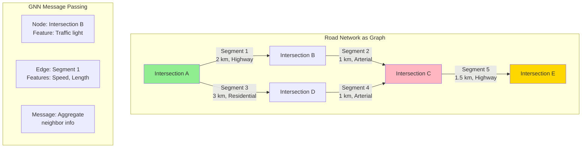

# ETA Prediction System Design - FAANG Interview Guide

## Interview Format: Conversational & Iterative

This guide simulates a real ML system design interview focused on ETA (Estimated Time of Arrival) prediction using Graph Neural Networks and spatio-temporal features, similar to Google Maps and Uber.

---

## Interview Timeline (45 minutes)

| Phase | Time | Your Actions |
|-------|------|--------------|
| Requirements Gathering | 5-7 min | Ask clarifying questions, define scope |
| High-Level Design | 10-12 min | Draw architecture, explain components |
| Deep Dive | 20-25 min | Detail GNN architecture, spatio-temporal features |
| Trade-offs & Scale | 5-8 min | Discuss real-time vs batch, model complexity |

---

## 🎯 Problem Statement

**Interviewer:** "Design an ETA prediction system like Google Maps or Uber that predicts how long it will take to travel from point A to point B."

---

## Phase 1: Requirements Gathering (5-7 minutes)

### Your Response Strategy

**You:** "ETA prediction is critical for ride-sharing and navigation apps. Let me ask some clarifying questions."

### Critical Questions to Ask

**You:** "Let me understand the requirements:

1. **Use Case & Scale:**
   - Is this for navigation (Google Maps) or ride-sharing (Uber/Lyft)?
   - How many ETA requests per second?
   - How large is the road network? (city, country, global?)
   - Do we need historical route optimization or just ETA for given route?

2. **Accuracy Requirements:**
   - What's acceptable error margin? (±5 minutes, ±10%?)
   - More important to be conservative (over-estimate) or optimistic (under-estimate)?
   - Different accuracy needs for different use cases? (food delivery vs taxi)

3. **Latency Constraints:**
   - Real-time prediction latency requirement?
   - Can we precompute some ETAs or must be on-demand?
   - Do we update ETA during the trip?

4. **Data Availability:**
   - Real-time traffic data available?
   - Historical speed data for roads?
   - Live events (accidents, construction, weather)?
   - User driving patterns?

5. **Prediction Scope:**
   - Predict entire trip time or segment-by-segment?
   - Account for pickup time, parking time?
   - Multi-modal (driving, walking, transit)?"

### Interviewer's Answers

**Interviewer:** "Good questions! Here's the scope:

- **Use Case:** Ride-sharing like Uber (both driver and rider need accurate ETAs)
- **Scale:** 1M active trips globally, 10K ETA requests/second
- **Network:** Global road network (100M+ road segments)
- **Accuracy:** Mean Absolute Error (MAE) <3 minutes for trips <30 minutes
- **Latency:** <500ms for ETA prediction
- **Data:** Real-time traffic data, historical speed profiles, live events
- **Updates:** Re-predict ETA every 30 seconds during active trip
- **Scope:** Predict driving time from pickup to drop-off"

### Requirements Summary

**You:** "Perfect! Let me summarize:

#### Functional Requirements
- Predict driving time from point A to B given route
- Real-time traffic awareness
- Historical pattern learning (rush hour, weekday vs weekend)
- Live event handling (accidents, road closures)
- Continuous ETA updates during trip

#### Non-Functional Requirements
- **Scale:** 10K predictions/second, 1M concurrent trips
- **Latency:** <500ms for ETA prediction
- **Accuracy:** MAE < 3 min for trips < 30 min (<10% error)
- **Availability:** 99.9% uptime (trips depend on it)
- **Global:** Support worldwide road networks

#### Key Challenges
- **Spatio-temporal dependencies:** Traffic patterns vary by location, time, day
- **Graph structure:** Road network is a graph (intersections = nodes, roads = edges)
- **Real-time adaptation:** Traffic conditions change rapidly
- **Cold start:** New roads, new cities

Sounds good?"

**Interviewer:** "Yes, let's proceed."

---

## Phase 2: High-Level Design (10-12 minutes)

### Architecture Overview

**You:** "I'll design a system with Graph Neural Networks at the core, similar to Google's DeepMind ETA model. Let me draw the architecture."

```mermaid
graph TB
    subgraph "Real-time Request"
        R[ETA Request<br/>Origin: (lat, lon)<br/>Dest: (lat, lon)<br/>Route: [seg1, seg2, ..., segN]]
    end

    subgraph "Routing Engine"
        RE[Route Planner<br/>A* / Dijkstra]
        RN[(Road Network Graph<br/>100M nodes, 200M edges)]
    end

    subgraph "Feature Engineering"
        SF[Segment Features<br/>Distance, Lanes, Speed Limit]
        TF[Temporal Features<br/>Hour, Day, Rush Hour]
        TR[Real-time Traffic<br/>Current Speed, Congestion]
        HF[Historical Features<br/>Avg Speed by Time]
        EV[Live Events<br/>Accidents, Construction]
    end

    subgraph "Model Serving - Graph Neural Network"
        GNN[GNN Encoder<br/>GraphSAGE / GAT]
        SEQ[Sequence Model<br/>LSTM / Transformer]
        AGG[Aggregation Layer<br/>Sum Segment Times]
    end

    subgraph "Post-Processing"
        PP[Post-Processor<br/>Add Pickup Time, Buffer]
        CONF[Confidence Interval<br/>p10, p50, p90]
    end

    subgraph "Data Pipeline - Offline"
        GPS[(GPS Traces<br/>Historical Trips)]
        MAP[Map Matching<br/>GPS → Road Segments]
        FEAT[Feature Store<br/>Aggregated Traffic Data]
        TRAIN[Training Pipeline<br/>GNN Training]
    end

    subgraph "Real-time Data Streams"
        STREAM[Kafka Streams<br/>Live GPS pings]
        SPEED[Speed Aggregator<br/>Real-time avg speed]
        EVENT[Event Detector<br/>Accident Detection]
    end

    subgraph "Storage"
        GRAPH[(Graph Database<br/>Neo4j / Custom)]
        TS[(Time-series DB<br/>InfluxDB)]
        CACHE[(Redis Cache<br/>Hot Segments)]
    end

    R --> RE
    RE --> RN
    RE --> SF
    SF --> GNN

    SF --> TF
    SF --> TR
    SF --> HF
    SF --> EV

    TF --> GNN
    TR --> GNN
    HF --> GNN
    EV --> GNN

    GNN --> SEQ
    SEQ --> AGG
    AGG --> PP
    PP --> CONF
    CONF --> R

    GPS --> MAP
    MAP --> FEAT
    FEAT --> TRAIN
    TRAIN --> GNN

    STREAM --> SPEED
    STREAM --> EVENT
    SPEED --> TR
    EVENT --> EV

    RN --> GRAPH
    TR --> CACHE
    HF --> TS

    style GNN fill:#90EE90
    style SEQ fill:#FFB6C1
    style AGG fill:#FFD700
    style GRAPH fill:#87CEEB
```

### Walking Through the Architecture

**You:** "Let me explain the end-to-end flow:

#### Step 1: Route Planning (50-100ms)
```
User request: Origin (lat, lon) → Destination (lat, lon)
     ↓
Route Planner (A* algorithm on road graph)
     ↓
Optimal route: [segment_1, segment_2, ..., segment_N]
```

#### Step 2: Feature Extraction (100-150ms)

For each road segment, extract features:

**Static Features (Pre-computed):**
- Road length (meters)
- Number of lanes
- Speed limit
- Road type (highway, arterial, residential)
- Is one-way?
- Has traffic light?

**Temporal Features:**
- Hour of day (0-23)
- Day of week (Mon-Sun)
- Is rush hour? (7-9 AM, 5-7 PM)
- Is weekend?
- Is holiday?

**Real-time Traffic (From live GPS data):**
- Current average speed on segment
- Congestion level (0-10 scale)
- Number of vehicles on segment

**Historical Patterns:**
- Average speed for this segment at this time
- Speed variance (is it predictable?)
- Typical congestion patterns

**Live Events:**
- Accidents on or near segment
- Road construction
- Special events (concerts, sports games)
- Weather conditions

#### Step 3: GNN Prediction (200-300ms)

- Model input: Graph of road segments in route
- GNN propagates information between connected segments
  - Traffic jam on highway affects upstream segments
  - Accident on main road affects alternate routes
- Output: Time prediction for each segment

#### Step 4: Aggregation (10ms)

```
Total ETA = Σ(segment_time_1, segment_time_2, ..., segment_time_N)
          + pickup_time
          + buffer (confidence-based)
```

#### Step 5: Continuous Updates

```
During trip:
  Every 30 seconds:
    - Get current location
    - Remaining route = original route - completed segments
    - Re-predict ETA for remaining route
    - Send updated ETA to user
```"

**Interviewer:** "Interesting! Can you dive deeper into the Graph Neural Network architecture? How does it model spatial dependencies?"

---

## Phase 3: Deep Dive - Graph Neural Networks (20-25 minutes)

### Why Graph Neural Networks for ETA?

**You:** "Road networks are inherently graphs, and GNNs are perfect for capturing spatial dependencies. Let me explain:



### GNN Architecture: GraphSAGE + Temporal Attention

```python
import torch
import torch.nn as nn
from torch_geometric.nn import SAGEConv, GATConv

class ETAPredictionGNN(nn.Module):
    """
    Graph Neural Network for ETA Prediction

    Architecture:
    1. Node Encoder: Encode intersection features
    2. Edge Encoder: Encode road segment features
    3. GraphSAGE: Aggregate spatial information
    4. Temporal Attention: Model time-dependent patterns
    5. Segment Time Predictor: Predict travel time per segment
    """

    def __init__(self,
                 node_features=10,
                 edge_features=20,
                 hidden_dim=128,
                 num_gnn_layers=3):
        super().__init__()

        # Encoders
        self.node_encoder = nn.Sequential(
            nn.Linear(node_features, hidden_dim),
            nn.ReLU(),
            nn.Dropout(0.1)
        )

        self.edge_encoder = nn.Sequential(
            nn.Linear(edge_features, hidden_dim),
            nn.ReLU(),
            nn.Dropout(0.1)
        )

        # GraphSAGE layers (spatial aggregation)
        self.gnn_layers = nn.ModuleList([
            SAGEConv(hidden_dim, hidden_dim, aggr='mean')
            for _ in range(num_gnn_layers)
        ])

        # Temporal attention (time-aware patterns)
        self.temporal_attention = TemporalAttention(hidden_dim)

        # Segment time predictor
        self.time_predictor = nn.Sequential(
            nn.Linear(hidden_dim * 2, hidden_dim),  # *2 for edge + nodes
            nn.ReLU(),
            nn.Dropout(0.1),
            nn.Linear(hidden_dim, 64),
            nn.ReLU(),
            nn.Linear(64, 1),
            nn.Softplus()  # Ensure positive time predictions
        )

    def forward(self, node_features, edge_features, edge_index, temporal_features):
        """
        Args:
            node_features: [num_nodes, node_features] - Intersection features
            edge_features: [num_edges, edge_features] - Road segment features
            edge_index: [2, num_edges] - Graph connectivity
            temporal_features: [num_edges, temporal_dim] - Time-dependent features

        Returns:
            segment_times: [num_edges] - Predicted time for each segment (seconds)
        """

        # Encode nodes and edges
        node_emb = self.node_encoder(node_features)  # [num_nodes, hidden_dim]
        edge_emb = self.edge_encoder(edge_features)  # [num_edges, hidden_dim]

        # GraphSAGE: Aggregate information from neighbors
        x = node_emb
        for gnn_layer in self.gnn_layers:
            x = gnn_layer(x, edge_index)
            x = torch.relu(x)
            x = torch.dropout(x, p=0.1, train=self.training)

        # For each edge, get embeddings of source and target nodes
        source_nodes = edge_index[0]  # Source node IDs
        target_nodes = edge_index[1]  # Target node IDs

        source_emb = x[source_nodes]  # [num_edges, hidden_dim]
        target_emb = x[target_nodes]  # [num_edges, hidden_dim]

        # Combine node embeddings with edge embeddings
        # Concatenate source, target, and edge
        edge_repr = torch.cat([
            source_emb,
            target_emb,
            edge_emb
        ], dim=1)  # [num_edges, hidden_dim * 3]

        # Apply temporal attention
        edge_repr = self.temporal_attention(edge_repr, temporal_features)

        # Predict segment travel time
        segment_times = self.time_predictor(edge_repr)  # [num_edges, 1]

        return segment_times.squeeze()


class TemporalAttention(nn.Module):
    """
    Temporal attention mechanism to model time-dependent patterns

    Insight:
    - Same road has different speeds at different times
    - Rush hour (8 AM) vs off-peak (2 PM)
    - Weekday vs weekend patterns
    """

    def __init__(self, hidden_dim):
        super().__init__()

        self.time_encoder = nn.Sequential(
            nn.Linear(5, 32),  # 5 temporal features: hour, day, is_rush, is_weekend, holiday
            nn.ReLU(),
            nn.Linear(32, hidden_dim)
        )

        self.attention = nn.MultiheadAttention(
            embed_dim=hidden_dim,
            num_heads=4,
            dropout=0.1
        )

    def forward(self, edge_repr, temporal_features):
        """
        Args:
            edge_repr: [num_edges, hidden_dim] - Edge representations
            temporal_features: [num_edges, 5] - Temporal context

        Returns:
            attended_repr: [num_edges, hidden_dim] - Time-aware representations
        """

        # Encode temporal context
        time_emb = self.time_encoder(temporal_features)  # [num_edges, hidden_dim]

        # Apply attention
        # Query: Current edge representation
        # Key/Value: Temporal context
        attended_repr, _ = self.attention(
            query=edge_repr.unsqueeze(0),    # [1, num_edges, hidden_dim]
            key=time_emb.unsqueeze(0),
            value=time_emb.unsqueeze(0)
        )

        return attended_repr.squeeze(0)  # [num_edges, hidden_dim]
```

### Feature Engineering for Road Segments

**You:** "Let me show you the comprehensive feature set:

```python
class RoadSegmentFeatureExtractor:
    """
    Extract features for each road segment
    """

    def __init__(self, graph_db, traffic_service, event_service):
        self.graph_db = graph_db
        self.traffic_service = traffic_service
        self.event_service = event_service

    def extract_features(self, segment_id, timestamp):
        """
        Extract all features for a road segment at given time

        Returns:
            features: Dict with ~50 features
        """

        features = {}

        # Get segment metadata
        segment = self.graph_db.get_segment(segment_id)

        # 1. Static Road Features
        features.update(self._static_features(segment))

        # 2. Temporal Features
        features.update(self._temporal_features(timestamp))

        # 3. Real-time Traffic
        features.update(self._realtime_traffic(segment_id, timestamp))

        # 4. Historical Patterns
        features.update(self._historical_features(segment_id, timestamp))

        # 5. Spatial Context
        features.update(self._spatial_context(segment))

        # 6. Live Events
        features.update(self._event_features(segment_id, timestamp))

        return features

    def _static_features(self, segment):
        """Road geometry and infrastructure"""
        return {
            'length_meters': segment.length,
            'num_lanes': segment.lanes,
            'speed_limit_kmh': segment.speed_limit,
            'road_type': segment.road_type,  # highway, arterial, local
            'is_one_way': int(segment.is_one_way),
            'has_traffic_light': int(segment.has_traffic_light),
            'num_intersections': segment.intersection_count,
            'is_tunnel': int(segment.is_tunnel),
            'is_bridge': int(segment.is_bridge),
            'elevation_change': segment.elevation_end - segment.elevation_start,
            'curvature': segment.curvature_metric,  # How windy is the road?
            'surface_type': segment.surface  # paved, gravel, etc.
        }

    def _temporal_features(self, timestamp):
        """Time-dependent features"""
        return {
            'hour': timestamp.hour,
            'day_of_week': timestamp.weekday(),
            'is_weekend': int(timestamp.weekday() >= 5),
            'is_rush_hour_morning': int(7 <= timestamp.hour <= 9),
            'is_rush_hour_evening': int(17 <= timestamp.hour <= 19),
            'is_night': int(22 <= timestamp.hour or timestamp.hour <= 6),
            'is_holiday': int(self.is_holiday(timestamp.date())),
            'month': timestamp.month,  # Seasonal patterns
            'week_of_year': timestamp.isocalendar()[1]
        }

    def _realtime_traffic(self, segment_id, timestamp):
        """Current traffic conditions from live GPS data"""

        # Get current traffic data (aggregated from GPS pings in last 5 minutes)
        traffic = self.traffic_service.get_current_traffic(segment_id)

        if not traffic:
            # No data available, use historical average
            return {
                'current_speed_kmh': 0,
                'current_congestion': 0,
                'has_traffic_data': 0
            }

        return {
            'current_speed_kmh': traffic.avg_speed,
            'current_congestion': traffic.congestion_level,  # 0-10 scale
            'num_vehicles': traffic.vehicle_count,
            'speed_variance': traffic.speed_std,
            'has_traffic_data': 1,
            'data_freshness_seconds': (timestamp - traffic.timestamp).total_seconds()
        }

    def _historical_features(self, segment_id, timestamp):
        """Historical speed patterns"""

        # Get historical average speed for this segment
        # at this time of day, day of week
        hist = self.get_historical_speed(
            segment_id,
            hour=timestamp.hour,
            day_of_week=timestamp.weekday()
        )

        return {
            'hist_avg_speed_kmh': hist.avg_speed,
            'hist_speed_std': hist.std_speed,
            'hist_p50_speed': hist.p50_speed,
            'hist_p90_speed': hist.p90_speed,
            'hist_p10_speed': hist.p10_speed,
            'hist_sample_size': hist.num_samples,  # Confidence in estimate
            'speed_reliability': 1 - (hist.std_speed / hist.avg_speed)  # 0-1
        }

    def _spatial_context(self, segment):
        """Features about nearby segments"""

        # Get neighboring segments
        upstream = self.graph_db.get_upstream_segments(segment.id, hops=2)
        downstream = self.graph_db.get_downstream_segments(segment.id, hops=2)

        return {
            'upstream_avg_congestion': np.mean([s.congestion for s in upstream]),
            'downstream_avg_congestion': np.mean([s.congestion for s in downstream]),
            'num_upstream_segments': len(upstream),
            'num_downstream_segments': len(downstream),
            'is_bottleneck': int(len(downstream) > len(upstream) * 2)  # Many roads merge into one
        }

    def _event_features(self, segment_id, timestamp):
        """Live events affecting traffic"""

        events = self.event_service.get_events_near_segment(
            segment_id,
            radius_meters=1000,
            timestamp=timestamp
        )

        has_accident = any(e.type == 'accident' for e in events)
        has_construction = any(e.type == 'construction' for e in events)
        has_event = any(e.type in ['concert', 'sports', 'festival'] for e in events)

        return {
            'has_accident_nearby': int(has_accident),
            'has_construction_nearby': int(has_construction),
            'has_event_nearby': int(has_event),
            'num_events_nearby': len(events),
            'distance_to_nearest_event': min([e.distance for e in events]) if events else 9999
        }
```

### Training Pipeline

**You:** "Now let me explain how we train the GNN:

```python
class ETATrainingPipeline:
    """
    Train GNN model on historical trip data
    """

    def __init__(self, model, device='cuda'):
        self.model = model.to(device)
        self.device = device
        self.optimizer = torch.optim.Adam(model.parameters(), lr=1e-3)

    def prepare_training_data(self, historical_trips):
        """
        Convert GPS traces to training examples

        Input: Historical trips with GPS pings
        Output: (route_graph, actual_segment_times) pairs
        """

        training_examples = []

        for trip in historical_trips:
            # Map GPS pings to road segments (map matching)
            route_segments = self.map_match_gps_to_route(trip.gps_trace)

            # Compute actual time spent on each segment
            actual_times = self.compute_segment_times(
                trip.gps_trace,
                route_segments
            )

            # Build graph for this route
            route_graph = self.build_route_graph(
                route_segments,
                timestamp=trip.start_time
            )

            training_examples.append({
                'graph': route_graph,
                'actual_times': actual_times,
                'metadata': {
                    'trip_id': trip.id,
                    'start_time': trip.start_time,
                    'total_time': trip.duration
                }
            })

        return training_examples

    def train_epoch(self, train_loader):
        """Train for one epoch"""

        self.model.train()
        epoch_losses = []

        for batch in train_loader:
            # Move to device
            node_features = batch['node_features'].to(self.device)
            edge_features = batch['edge_features'].to(self.device)
            edge_index = batch['edge_index'].to(self.device)
            temporal_features = batch['temporal_features'].to(self.device)
            actual_times = batch['actual_times'].to(self.device)

            # Forward pass
            predicted_times = self.model(
                node_features,
                edge_features,
                edge_index,
                temporal_features
            )

            # Loss: MAE + MAPE (weighted combination)
            mae_loss = torch.abs(predicted_times - actual_times).mean()
            mape_loss = (torch.abs(predicted_times - actual_times) / (actual_times + 1)).mean()

            loss = 0.7 * mae_loss + 0.3 * mape_loss

            # Backward pass
            self.optimizer.zero_grad()
            loss.backward()

            # Gradient clipping (prevent exploding gradients)
            torch.nn.utils.clip_grad_norm_(self.model.parameters(), max_norm=1.0)

            self.optimizer.step()

            epoch_losses.append(loss.item())

        return np.mean(epoch_losses)

    def compute_segment_times(self, gps_trace, route_segments):
        """
        Infer actual time spent on each segment from GPS pings

        GPS pings: [(timestamp, lat, lon), ...]
        Route segments: [seg1, seg2, seg3, ...]

        Returns:
            segment_times: [time_seg1, time_seg2, ...]  (in seconds)
        """

        segment_times = []

        for i, segment in enumerate(route_segments):
            # Find GPS pings on this segment
            pings_on_segment = self.filter_pings_on_segment(gps_trace, segment)

            if len(pings_on_segment) >= 2:
                # Compute time from first to last ping on segment
                time_on_segment = (
                    pings_on_segment[-1].timestamp -
                    pings_on_segment[0].timestamp
                ).total_seconds()
            else:
                # No data, use estimated time
                time_on_segment = segment.length / (segment.speed_limit / 3.6)  # Convert kmh to m/s

            segment_times.append(time_on_segment)

        return torch.tensor(segment_times, dtype=torch.float32)
```

### Real-time Inference

**You:** "For serving predictions in <500ms:

```python
class ETAPredictor:
    """
    Real-time ETA prediction service
    """

    def __init__(self, model, feature_extractor, graph_db):
        self.model = model.eval()  # Inference mode
        self.feature_extractor = feature_extractor
        self.graph_db = graph_db
        self.cache = LRUCache(maxsize=100000)  # Cache recent predictions

    @torch.no_grad()
    def predict_eta(self, origin, destination, timestamp):
        """
        Predict ETA from origin to destination

        Returns:
            eta_seconds: Predicted time in seconds
            confidence_interval: (p10, p50, p90) predictions
        """

        # 1. Route Planning (50-100ms)
        route_segments = self.get_route(origin, destination)

        # 2. Check cache (5ms)
        cache_key = self.compute_cache_key(route_segments, timestamp)
        if cache_key in self.cache:
            return self.cache[cache_key]

        # 3. Extract features (100-150ms)
        node_features, edge_features, edge_index, temporal_features = \
            self.extract_graph_features(route_segments, timestamp)

        # 4. Model inference (100-150ms)
        segment_times = self.model(
            node_features,
            edge_features,
            edge_index,
            temporal_features
        )

        # 5. Aggregate (5ms)
        total_eta = segment_times.sum().item()

        # 6. Add buffer (10ms)
        # Conservative estimates (add safety margin)
        p50_eta = total_eta
        p10_eta = total_eta * 0.85  # Optimistic
        p90_eta = total_eta * 1.20  # Conservative

        result = {
            'eta_seconds': p50_eta,
            'confidence_interval': {
                'p10': p10_eta,
                'p50': p50_eta,
                'p90': p90_eta
            },
            'segment_breakdown': segment_times.tolist()
        }

        # Cache result
        self.cache[cache_key] = result

        return result

    def update_eta_during_trip(self, trip_id, current_location, timestamp):
        """
        Re-predict ETA during active trip (called every 30 seconds)

        Returns:
            updated_eta: Remaining time to destination
        """

        # Get trip details
        trip = self.get_trip(trip_id)

        # Find current segment
        current_segment = self.map_match_location(current_location)

        # Remaining route
        remaining_segments = trip.route_segments[current_segment_index:]

        # Re-predict ETA for remaining route
        remaining_eta = self.predict_eta_for_segments(
            remaining_segments,
            timestamp
        )

        # Log update for model improvement
        self.log_eta_update(trip_id, timestamp, remaining_eta)

        return remaining_eta
```

---

## Phase 4: Trade-offs & Optimization (5-8 minutes)

**Interviewer:** "How do you handle the cold start problem for new roads? And what are the trade-offs of using GNN vs simpler models?"

### Trade-off Analysis

**You:** "Let me discuss the key trade-offs:

#### 1. GNN vs Simpler Models

| Model | Pros | Cons | When to Use |
|-------|------|------|-------------|
| **GNN** | - Captures spatial dependencies<br/>- Handles traffic propagation<br/>- Best accuracy | - Complex<br/>- Slower inference<br/>- Needs graph structure | Main production model |
| **XGBoost** | - Fast inference<br/>- Good with tabular features<br/>- Interpretable | - No spatial modeling<br/>- Independent segments | Fallback / Cold start |
| **LSTM** | - Models temporal sequences<br/>- Good for route patterns | - No spatial relationships<br/>- Slower than XGBoost | Alternative approach |
| **Physical Model** | - Always works<br/>- No training needed<br/>- speed = distance/time | - Ignores traffic<br/>- Poor accuracy | Baseline |

**Our Approach:** Ensemble with fallback
```python
def predict_with_fallback(route, timestamp):
    try:
        # Primary: GNN model
        return gnn_model.predict(route, timestamp)
    except (TimeoutError, InsufficientDataError):
        # Fallback: XGBoost on segment-level features
        return xgboost_model.predict(route, timestamp)
    except:
        # Last resort: Physical model
        return physical_model.predict(route)
```

#### 2. Cold Start Solutions

```python
class ColdStartHandler:
    """
    Handle ETA prediction for new roads / cities
    """

    def predict_for_new_segment(self, segment, timestamp):
        """
        Strategies for segments with no historical data:

        1. Transfer Learning: Use similar roads
        2. Meta-features: Road type, speed limit, etc.
        3. Nearby segments: Spatial interpolation
        """

        # Strategy 1: Find similar roads
        similar_segments = self.find_similar_segments(segment)

        if similar_segments:
            # Average ETA from similar roads
            similar_speeds = [s.avg_speed for s in similar_segments]
            estimated_speed = np.mean(similar_speeds)
        else:
            # Strategy 2: Use meta-features (road type, speed limit)
            estimated_speed = self.estimate_speed_from_meta_features(segment)

        # Predicted time = distance / speed
        predicted_time = segment.length / (estimated_speed / 3.6)  # kmh to m/s

        return predicted_time

    def find_similar_segments(self, segment):
        """
        Find segments with similar characteristics

        Similarity based on:
        - Road type (highway, arterial, local)
        - Speed limit
        - Number of lanes
        - Urban vs rural
        """

        return self.graph_db.query(f"""
            MATCH (s:Segment)
            WHERE s.road_type = {segment.road_type}
              AND abs(s.speed_limit - {segment.speed_limit}) < 10
              AND s.num_lanes = {segment.num_lanes}
              AND s.has_data = true
            RETURN s
            LIMIT 100
        """)
```

---

## Phase 5: Production Metrics & Interview Tips

### Real Production Metrics (Google Maps, Uber 2025)

**Google Maps ETA:**
- 1B+ active users
- MAE (Mean Absolute Error): <3 minutes for trips <30 min (<10%)
- Accuracy: 95%+ within ±5 minutes
- Latency: <500ms for route + ETA calculation
- Update frequency: Every 30 seconds during active navigation

**Uber ETA:**
- 10K ETA predictions/second
- Pickup ETA: ±2 minutes accuracy target
- Drop-off ETA: ±5 minutes for trips <30 min
- Real-time traffic integration: Updates every 10 seconds

**Cost Analysis (at 10K QPS):**
- GNN inference: $8K-12K/day (GPU for graph processing)
- Feature store (traffic data): $4K/day
- Historical data storage: $2K/day
- Total: ~$18K/day = $540K/month

**Model Performance:**
- GNN improves accuracy by 15-20% vs non-graph models
- Temporal attention reduces error by 10% during rush hour
- Cold start (new roads): Use transfer learning from similar road types

### Interview Success Tips

**Strong answer includes:**
- Graph structure for road networks (nodes = intersections, edges = segments)
- Spatio-temporal features (location + time dependencies)
- Real-time traffic integration (live speed data)
- Continuous updates during trip (re-predict every 30s)

**Avoid:**
- Treating it as simple regression problem
- Ignoring graph structure of roads
- Not discussing how traffic on one road affects connected roads

**Follow-up Q:** "How do you handle new cities with no historical data?"
**A:** "Transfer learning: Pre-train on cities with data, fine-tune on new city. Use meta-features: road type, speed limit, number of lanes. Similar roads in different cities have similar patterns."

---

## Summary & Key Takeaways

**You:** "To summarize the ETA Prediction system:

### Architecture Highlights

1. **Graph Neural Network:** Captures spatial dependencies in road networks
2. **Spatio-temporal Features:** Combines real-time traffic + historical patterns
3. **Multi-scale Modeling:** Segment-level predictions aggregated to trip-level
4. **Continuous Updates:** Re-predict every 30 seconds during trip
5. **Ensemble Fallback:** GNN → XGBoost → Physical model

### Key Design Decisions

| Decision | Rationale |
|----------|-----------|
| GraphSAGE GNN | Aggregate neighbor information, scalable |
| Temporal Attention | Model time-dependent patterns (rush hour) |
| Segment-level prediction | Fine-grained, supports re-routing |
| Real-time traffic integration | Critical for accuracy |
| 500ms latency budget | Balance accuracy vs speed |

### Production Metrics

- **Accuracy:** MAE < 3 minutes for <30 min trips (<10% error)
- **Latency:** <500ms (Route: 100ms, Features: 150ms, GNN: 150ms, Agg: 10ms)
- **Scale:** 10K predictions/second
- **Update Frequency:** Every 30 seconds during trip

This design demonstrates:
- Graph neural networks for spatial modeling
- Spatio-temporal feature engineering
- Real-time vs historical data integration
- Cold start handling"

---

## Sources

- [ETA Prediction with Graph Neural Networks in Google Maps](https://arxiv.org/abs/2108.11482)
- [DeepETA: How Uber Predicts Arrival Times Using Deep Learning | Uber Blog](https://www.uber.com/blog/deepeta-how-uber-predicts-arrival-times/)
- [ETA Prediction with Graph Neural Networks in Google Maps](https://www.deepmind.com/publications/eta-prediction-with-graph-neural-networks-in-google-maps)
- [Demystifying ETA Prediction in Google Maps | by Srijanak De | Medium](https://medium.com/@srijanak2001/demystifying-eta-prediction-in-google-maps-ab2a63ce5cff)
