# RTB (Real-Time Bidding) Ad System Design - FAANG Interview Guide

## Interview Format: Conversational & Iterative

This guide simulates a real ML system design interview focused on Real-Time Bidding ad systems with ultra-low latency (<100ms) requirements, auction dynamics, and bid optimization.

---

## Interview Timeline (45 minutes)

| Phase | Time | Your Actions |
|-------|------|--------------|
| Requirements Gathering | 5-7 min | Ask clarifying questions, define scope |
| High-Level Design | 10-12 min | Draw architecture, explain auction flow |
| Deep Dive | 20-25 min | Detail bid optimization, pacing, latency optimization |
| Trade-offs & Scale | 5-8 min | Discuss auction types, budget management |

---

## 🎯 Problem Statement

**Interviewer:** "Design a Real-Time Bidding (RTB) system for programmatic advertising. When a user visits a website, we need to run an auction among multiple advertisers and serve the winning ad - all within 100ms."

---

## Phase 1: Requirements Gathering (5-7 minutes)

### Your Response Strategy

**You:** "RTB is a complex system with strict latency requirements. Let me ask clarifying questions."

### Critical Questions to Ask

**You:** "Let me understand the requirements:

1. **Scale & Latency:**
   - How many bid requests per second?
   - What's the latency budget? (<100ms, <50ms?)
   - How many bidders participate in each auction?
   - Geographic distribution (global, regional)?

2. **Auction Mechanics:**
   - What auction type? (first-price, second-price, VCG?)
   - Real-time bidding or header bidding?
   - Do we support private marketplaces (PMP)?
   - Reserve prices?

3. **Bidder Requirements:**
   - Bid optimization strategy? (maximize clicks, conversions, brand awareness?)
   - Budget management? (daily budget, pacing?)
   - Targeting constraints? (demographics, interests, location?)
   - Frequency capping?

4. **Ad Quality:**
   - Ad creative quality checks?
   - Brand safety requirements?
   - Click fraud detection?
   - User privacy (GDPR, CCPA)?

5. **Business Metrics:**
   - Optimize for revenue (exchange), ROI (advertiser), or user experience (publisher)?"

### Interviewer's Answers

**Interviewer:** "Good questions! Here's the scope:

- **Scale:** 1M bid requests/second (peak), 100 bidders per auction
- **Latency:** <100ms end-to-end (from bid request to ad served)
- **Auction:** Second-price auction (VCG for multi-slot)
- **Bidding:** Real-time bidding via OpenRTB protocol
- **Optimization:** Maximize advertiser ROI while staying within daily budget
- **Targeting:** Demographic, behavioral, contextual targeting
- **Quality:** Basic fraud detection, brand safety checks
- **Privacy:** GDPR compliant, no PII in bid requests"

### Requirements Summary & Calculations

**You:** "Perfect! Let me summarize with key calculations:

#### Functional Requirements
- Real-time auction for ad impressions (OpenRTB protocol)
- Support 100 bidders per auction (parallel bid requests)
- Second-price auction: winner pays 2nd highest bid + $0.01
- Bid optimization: CTR/CVR prediction → bid amount calculation
- Budget pacing: Spend daily budget evenly over 24 hours
- Targeting: Match user profile to campaign criteria
- Fraud detection: Filter invalid traffic before auction

#### Non-Functional Requirements & Calculations

**Scale:**
- 1M bid requests/second (peak) = **86.4B requests/day**
- 100 bidders/auction = **100M bidder requests/second**
- Win rate: 15-30% per bidder → **15-30M ad serves/second**

**Latency Budget (100ms total):**
- User request arrives: **0ms**
- Bid request creation: **5ms** (user context, page context)
- Parallel bidder calls: **60ms** (HTTP to 100 bidders, wait for responses)
  - Bidder timeout: 50ms (drop slow bidders)
  - Network RTT: ~10-20ms
- Auction execution: **10ms** (sort bids, run second-price)
- Winner notification: **5ms** (send ad creative URL)
- Ad serving: **20ms** (fetch creative, render)
- **Total: 100ms**

**Storage:**
- Active campaigns: 1M campaigns × 10KB = **10GB**
- User profiles: 500M users × 2KB = **1TB**
- Bid logs: 86B requests/day × 500 bytes = **43TB/day**

**Compute (ML for CTR/CVR):**
- 100M bidder predictions/second × 1ms = 100K CPU-seconds/s
- = 8.6B CPU-hours/day
- Optimized with caching + lightweight models: **$10K-15K/day**

**Business Metrics:**
- Fill rate: >95% (at least 1 bid per request)
- Win rate per bidder: 15-30%
- Revenue: $2-10 CPM (cost per 1000 impressions)
- At 86B requests/day: $172M-860M/day revenue (exchange takes 10-20% cut)

#### Key Challenges
- Budget pacing (daily budget management)
- Targeting (user demographics, interests, context)
- Fraud detection and brand safety

#### Non-Functional Requirements
- **Scale:** 1M bid requests/second peak
- **Latency:** <100ms p99 end-to-end
- **Availability:** 99.99% uptime (ads = revenue)
- **Privacy:** GDPR compliant, no PII
- **Throughput:** Handle 100 parallel bidder requests per auction

#### Key Challenges
- **Ultra-low latency:** <100ms for entire auction flow
- **Budget pacing:** Don't spend entire budget in first hour
- **Bid optimization:** Balance exploration vs exploitation
- **Scale:** 1M QPS = 86B requests/day

Correct?"

**Interviewer:** "Yes, proceed."

---

## Phase 2: High-Level Design (10-12 minutes)

### Architecture Overview

**You:** "I'll design a distributed RTB system using the IAB's Agentic RTB Framework (2024) for low latency."


### RTB Auction Flow with Latency Budget

**You:** "Let me walk through the auction with our 100ms budget:

```
Total Budget: 100ms (p99)

1. User visits page:                    0ms
2. SSP sends bid request to exchange:   5ms
3. Exchange processing:
   - User profile lookup (Redis):       5ms
   - Fraud detection:                   5ms
   - Route to bidders (parallel):       10ms
4. Bidders process (parallel):          40ms
   - Targeting check:                   10ms
   - CTR prediction (ML):               15ms
   - Bid calculation:                   10ms
   - Budget check:                      5ms
5. Bidders respond to exchange:         10ms
6. Auction execution:                   10ms
   - Collect bids:                      5ms
   - Run second-price auction:          3ms
   - Select winner:                     2ms
7. Return winning ad to SSP:            5ms
8. SSP serves ad to user:               10ms

Total:                                  100ms
```

### Data Flow Explanation

**You:** "The key insight is that bidder processing (step 4) is parallelized:

**Synchronous (Blocking):**
- Exchange waits for bidder responses
- Timeout after 80ms (bidders that don't respond are excluded)
- Fastest bidders have advantage

**Asynchronous (Non-blocking):**
- Budget updates processed async (eventual consistency acceptable)
- Click/conversion tracking offline
- Model training daily batch

This hybrid approach meets latency requirements while maintaining consistency where needed."

**Interviewer:** "How do you optimize bids to maximize ROI while respecting budget constraints?"

---

## Phase 3: Deep Dive - Bid Optimization & Budget Pacing (20-25 minutes)

### Bid Optimization Problem

**You:** "Bid optimization is a multi-objective problem. Let me explain:


### Value-Based Bidding Implementation

```python
import numpy as np
from typing import Dict, Optional

class BidOptimizer:
    """
    Optimize bids to maximize conversions within budget
    """

    def __init__(self, daily_budget: float, target_roi: float = 2.0):
        """
        Args:
            daily_budget: Total budget for the day ($)
            target_roi: Minimum ROI (revenue / cost)
        """
        self.daily_budget = daily_budget
        self.target_roi = target_roi

        # ML models
        self.ctr_model = CTRModel()  # Predict P(click)
        self.cvr_model = CVRModel()  # Predict P(conversion | click)
        self.value_model = ValueModel()  # Predict conversion value

    def calculate_bid(self,
                     user_features: Dict,
                     ad_features: Dict,
                     context_features: Dict,
                     budget_state: Dict) -> float:
        """
        Calculate optimal bid for this impression

        Formula:
        bid = P(click) * P(conversion|click) * value * adjustment_factor

        Where adjustment_factor accounts for:
        - Budget remaining
        - Time remaining in day
        - Win rate
        """

        # 1. Predict probabilities
        p_click = self.ctr_model.predict(user_features, ad_features, context_features)
        p_conversion_given_click = self.cvr_model.predict(user_features, ad_features)

        # Combined probability
        p_conversion = p_click * p_conversion_given_click

        # 2. Predict conversion value
        expected_value = self.value_model.predict(user_features, ad_features)

        # 3. Base bid (expected value discounted by target ROI)
        base_bid = (p_conversion * expected_value) / self.target_roi

        # 4. Adjustment factor (budget pacing)
        pacing_multiplier = self.compute_pacing_multiplier(budget_state)

        # 5. Final bid
        final_bid = base_bid * pacing_multiplier

        # 6. Apply floor and ceiling
        min_bid = 0.10  # $0.10 minimum
        max_bid = 50.0  # $50 maximum

        final_bid = np.clip(final_bid, min_bid, max_bid)

        return final_bid

    def compute_pacing_multiplier(self, budget_state: Dict) -> float:
        """
        Adjust bids to pace budget evenly throughout the day

        Strategy:
        - If spending too fast → reduce bids (multiplier < 1)
        - If spending too slow → increase bids (multiplier > 1)
        """

        # Current state
        spent_so_far = budget_state['spent']
        time_elapsed_hours = budget_state['hours_elapsed']
        total_hours = 24

        # Expected spend at this point (linear pacing)
        expected_spend = self.daily_budget * (time_elapsed_hours / total_hours)

        # Actual vs expected
        spend_ratio = spent_so_far / expected_spend if expected_spend > 0 else 0

        # Compute multiplier
        if spend_ratio > 1.2:  # Spending 20% too fast
            multiplier = 0.7  # Reduce bids by 30%
        elif spend_ratio > 1.1:  # Spending 10% too fast
            multiplier = 0.85  # Reduce bids by 15%
        elif spend_ratio < 0.8:  # Spending 20% too slow
            multiplier = 1.3  # Increase bids by 30%
        elif spend_ratio < 0.9:  # Spending 10% too slow
            multiplier = 1.15  # Increase bids by 15%
        else:
            multiplier = 1.0  # On track

        # Safety: Don't go below 0.5x or above 2x
        multiplier = np.clip(multiplier, 0.5, 2.0)

        return multiplier


class CTRModel:
    """
    Predict click-through rate using gradient boosting
    """

    def __init__(self):
        import lightgbm as lgb
        self.model = lgb.Booster(model_file='ctr_model.txt')

    def predict(self, user_features, ad_features, context_features):
        """
        Predict P(click | user, ad, context)

        Features:
        - User: age, gender, interests, past_clicks
        - Ad: title, image, category, advertiser
        - Context: time, device, page_category
        """

        # Combine features
        features = self.extract_features(user_features, ad_features, context_features)

        # Predict
        p_click = self.model.predict([features])[0]

        return p_click

    def extract_features(self, user, ad, context):
        """Extract 100+ features for CTR prediction"""

        features = []

        # User features
        features.extend([
            user.get('age', 0),
            user.get('gender', 0),  # 0=unknown, 1=male, 2=female
            user.get('income_bucket', 0),
            user.get('past_clicks_count', 0),
            user.get('past_conversions_count', 0)
        ])

        # User interests (one-hot encoding)
        interest_categories = ['sports', 'tech', 'fashion', 'travel', 'food']
        for category in interest_categories:
            features.append(int(category in user.get('interests', [])))

        # Ad features
        features.extend([
            ad.get('ad_id', 0),
            ad.get('advertiser_id', 0),
            ad.get('campaign_id', 0),
            ad.get('category', 0),
            ad.get('has_image', 0),
            ad.get('has_video', 0),
            len(ad.get('title', '')),  # Title length
        ])

        # Ad historical performance
        features.extend([
            ad.get('historical_ctr', 0),
            ad.get('historical_cvr', 0),
            ad.get('total_impressions', 0)
        ])

        # Context features
        features.extend([
            context.get('hour', 0),
            context.get('day_of_week', 0),
            int(context.get('is_weekend', False)),
            context.get('device_type', 0),  # 0=desktop, 1=mobile, 2=tablet
            context.get('page_category', 0)
        ])

        # Cross features (interaction terms)
        # User age × Ad category
        features.append(user.get('age', 0) * ad.get('category', 0))

        # Device type × Hour
        features.append(context.get('device_type', 0) * context.get('hour', 0))

        return features


class BudgetPacer:
    """
    Real-time budget pacing to avoid spending entire budget too quickly
    """

    def __init__(self, daily_budget: float):
        self.daily_budget = daily_budget
        self.current_spend = 0.0
        self.start_time = datetime.now()

    def should_bid(self, estimated_cost: float) -> bool:
        """
        Decide whether to participate in auction

        Returns:
            True if we should bid, False if budget exhausted
        """

        # Check if we have budget remaining
        if self.current_spend + estimated_cost > self.daily_budget:
            return False

        # Check pacing (probabilistic throttling)
        time_elapsed = (datetime.now() - self.start_time).total_seconds() / 3600  # hours
        budget_used_ratio = self.current_spend / self.daily_budget
        time_ratio = time_elapsed / 24.0

        # If we've used more budget than time elapsed, throttle
        if budget_used_ratio > time_ratio:
            # Throttle probabilistically
            throttle_prob = 1 - (budget_used_ratio - time_ratio)
            throttle_prob = max(0.1, min(1.0, throttle_prob))  # Between 10% and 100%

            # Random throttling
            if np.random.random() > throttle_prob:
                return False

        return True

    def record_win(self, cost: float):
        """Record auction win and update spend"""
        self.current_spend += cost

    def get_budget_status(self) -> Dict:
        """Get current budget status"""
        time_elapsed = (datetime.now() - self.start_time).total_seconds() / 3600

        return {
            'spent': self.current_spend,
            'remaining': self.daily_budget - self.current_spend,
            'hours_elapsed': time_elapsed,
            'spend_rate': self.current_spend / time_elapsed if time_elapsed > 0 else 0,
            'projected_daily_spend': (self.current_spend / time_elapsed) * 24 if time_elapsed > 0 else 0
        }
```

### Second-Price Auction Implementation

**You:** "Now let me show the auction mechanism:

```python
from typing import List, Tuple, Optional
from dataclasses import dataclass

@dataclass
class Bid:
    bidder_id: str
    bid_amount: float  # In dollars
    ad_creative_id: str
    quality_score: float  # 0-1, ad quality/relevance

class SecondPriceAuction:
    """
    Second-price (Vickrey) auction implementation

    Key property: Bidders have incentive to bid their true value
    Winner pays the second-highest bid (not their own bid)
    """

    def __init__(self, reserve_price: float = 0.10):
        """
        Args:
            reserve_price: Minimum acceptable bid
        """
        self.reserve_price = reserve_price

    def run_auction(self, bids: List[Bid]) -> Optional[Tuple[Bid, float]]:
        """
        Run second-price auction

        Returns:
            (winning_bid, clearing_price) or None if no valid bids
        """

        # Filter out bids below reserve price
        valid_bids = [b for b in bids if b.bid_amount >= self.reserve_price]

        if not valid_bids:
            return None

        # Quality-adjusted bids (bid × quality_score)
        # Encourages high-quality ads
        adjusted_bids = [
            (bid, bid.bid_amount * bid.quality_score)
            for bid in valid_bids
        ]

        # Sort by adjusted bid (descending)
        adjusted_bids.sort(key=lambda x: x[1], reverse=True)

        # Winner: highest adjusted bid
        winning_bid = adjusted_bids[0][0]

        # Clearing price: second-highest adjusted bid ÷ winner's quality score
        # This ensures winner pays based on competition, not their own bid
        if len(adjusted_bids) >= 2:
            second_highest_adjusted = adjusted_bids[1][1]
            clearing_price = second_highest_adjusted / winning_bid.quality_score
        else:
            # Only one bid, pay reserve price
            clearing_price = self.reserve_price

        # Add small increment (e.g., $0.01)
        clearing_price += 0.01

        return (winning_bid, clearing_price)


# Example usage
auction = SecondPriceAuction(reserve_price=0.50)

bids = [
    Bid(bidder_id='advertiser_A', bid_amount=2.50, ad_creative_id='ad_123', quality_score=0.9),
    Bid(bidder_id='advertiser_B', bid_amount=2.00, ad_creative_id='ad_456', quality_score=0.95),
    Bid(bidder_id='advertiser_C', bid_amount=1.80, ad_creative_id='ad_789', quality_score=0.85),
]

result = auction.run_auction(bids)

if result:
    winner, price = result
    print(f"Winner: {winner.bidder_id}")
    print(f"Bid: ${winner.bid_amount}")
    print(f"Pays: ${price:.2f}")  # Pays second-highest, not their bid
    # Output:
    # Winner: advertiser_A
    # Bid: $2.50
    # Pays: $2.00 (approximately second-highest adjusted bid)
```

### Multi-Armed Bandit for Exploration

**You:** "For new ads with limited data, we use multi-armed bandit:

```python
import numpy as np
from scipy import stats

class ThompsonSamplingBidder:
    """
    Thompson Sampling for bid optimization

    Problem: New ads have no performance data
    Solution: Balance exploration (try new ads) with exploitation (use best ads)
    """

    def __init__(self):
        # For each ad, track:
        # - alpha: number of successes (conversions)
        # - beta: number of failures (no conversion)
        # Beta distribution: Beta(alpha, beta)
        self.ad_performance = {}  # ad_id → {'alpha': int, 'beta': int}

    def select_ad(self, candidate_ads: List[str]) -> str:
        """
        Select which ad to show using Thompson Sampling

        Returns:
            ad_id: Selected ad
        """

        sampled_values = {}

        for ad_id in candidate_ads:
            # Get prior (default: Beta(1, 1) = uniform)
            perf = self.ad_performance.get(ad_id, {'alpha': 1, 'beta': 1})

            # Sample from Beta distribution
            # This represents our belief about this ad's conversion rate
            sampled_cvr = np.random.beta(perf['alpha'], perf['beta'])

            sampled_values[ad_id] = sampled_cvr

        # Select ad with highest sampled value
        best_ad = max(sampled_values, key=sampled_values.get)

        return best_ad

    def update(self, ad_id: str, converted: bool):
        """
        Update beliefs after observing outcome

        Args:
            ad_id: Ad that was shown
            converted: Did user convert?
        """

        if ad_id not in self.ad_performance:
            self.ad_performance[ad_id] = {'alpha': 1, 'beta': 1}

        if converted:
            self.ad_performance[ad_id]['alpha'] += 1
        else:
            self.ad_performance[ad_id]['beta'] += 1

# Example: Automatically explores new ads while exploiting best performers
bandit = ThompsonSamplingBidder()

# Ad A: 100 impressions, 10 conversions
bandit.ad_performance['ad_A'] = {'alpha': 11, 'beta': 91}  # CVR ~10%

# Ad B: 50 impressions, 8 conversions
bandit.ad_performance['ad_B'] = {'alpha': 9, 'beta': 43}  # CVR ~16%

# Ad C: New ad, no data
# Uses default Beta(1, 1) - high uncertainty, more exploration

# Select ad (will favor B but occasionally explore C)
selected = bandit.select_ad(['ad_A', 'ad_B', 'ad_C'])
```

---

## Phase 4: Latency Optimization & Trade-offs (5-8 minutes)

**Interviewer:** "How do you achieve <100ms latency at 1M QPS?"

### Latency Optimization Strategies

**You:** "Let me explain the key optimizations:

```mermaid
graph TB
    subgraph "Latency Optimizations"
        A[100ms Target]
    end

    subgraph "Infrastructure"
        B1[Geographic Distribution<br/>Edge Locations]
        B2[Low-Latency Networking<br/>AWS RTB Fabric]
        B3[gRPC vs HTTP<br/>50% faster]
    end

    subgraph "Caching"
        C1[User Profiles<br/>Redis 5ms]
        C2[Model Predictions<br/>Cache similar users]
        C3[Bid Prices<br/>Pre-computed ranges]
    end

    subgraph "Model Optimization"
        D1[Model Distillation<br/>Large → Small model]
        D2[Quantization<br/>FP32 → INT8]
        D3[Feature Pruning<br/>Remove low-impact features]
    end

    A --> B1
    A --> C1
    A --> D1

    B1 --> B2 --> B3
    C1 --> C2 --> C3
    D1 --> D2 --> D3

    style A fill:#FFB6C1
    style B2 fill:#90EE90
    style C1 fill:#87CEEB
    style D1 fill:#FFD700
```



### 2024 Innovation: Agentic RTB Framework

**You:** "In 2024, IAB Tech Lab released the Agentic RTB Framework (ARTF) which reduces latency by 80%:

**Traditional RTB:**
```
Exchange → Internet → DSP 1 (600-800ms round-trip)
        → Internet → DSP 2
        → Internet → DSP N
```

**Agentic RTB (ARTF):**
```
Exchange → Same Data Center → DSP Containers (100ms round-trip)
        ↓
    gRPC bidirectional communication
    (instead of HTTP)
```

**Key innovations:**
- **Containerized Bidders:** DSP logic runs in containers co-located with exchange
- **Bi-directional gRPC:** Faster than HTTP request-response
- **Local Communication:** No internet latency
- **Results:** 600-800ms → 100ms (6-8x improvement)

```python
class AgenticRTBBidder:
    """
    Bidder using Agentic RTB Framework (2024)

    Runs as container in same datacenter as exchange
    Uses gRPC for low-latency communication
    """

    def __init__(self):
        import grpc
        self.grpc_channel = grpc.insecure_channel('exchange:50051')
        self.stub = BidServiceStub(self.grpc_channel)

    async def receive_bid_requests(self):
        """
        Streaming gRPC: Exchange pushes bid requests
        (instead of HTTP pull)
        """

        # Bi-directional streaming
        async for bid_request in self.stub.StreamBidRequests():
            # Process in <40ms
            bid_response = await self.process_bid_request(bid_request)

            # Send response back via stream
            await self.stub.SubmitBid(bid_response)

    async def process_bid_request(self, request):
        """Process bid request in <40ms"""

        # Parallel execution
        targeting_task = asyncio.create_task(self.check_targeting(request))
        ctr_task = asyncio.create_task(self.predict_ctr(request))
        budget_task = asyncio.create_task(self.check_budget(request))

        # Wait for all (parallel, not sequential)
        targeting_ok, ctr, budget_ok = await asyncio.gather(
            targeting_task,
            ctr_task,
            budget_task
        )

        if not targeting_ok or not budget_ok:
            return None  # No bid

        # Calculate bid
        bid_amount = self.calculate_bid(ctr, request)

        return BidResponse(bid=bid_amount, ad_id=...)
```

---

## Phase 5: Production Metrics & Interview Guidance

### Real Production Metrics (Google AdX, AppNexus 2025)

**Scale:**
- 1M-10M bid requests/second globally
- 100-500 bidders per auction
- Latency: <100ms p99 for full auction (2024 Agentic RTB: 80% faster)
- Win rate: 15-30% per bidder (competitive auctions)

**Business Metrics:**
- Fill rate: >95% (% of requests with at least one bid)
- Timeout rate: <2% (bidders not responding in time)
- Budget adherence: 95%+ of campaigns spend within 5% of daily budget

**Cost Analysis (at 1M QPS):**
- Model serving (CTR, CVR predictions): $10K-15K/day
- Real-time feature aggregation: $5K/day
- Auction coordination: $3K/day
- Total: ~$20K/day = $600K/month

**Agentic RTB Framework (2024):**
- Traditional RTB latency: 600-800ms
- Agentic RTB latency: 100ms (6-8x improvement)
- Method: Co-locate bidder containers with exchange, use gRPC

### Interview Best Practices

**Key topics to cover:**
- Second-price auction mechanics (incentive-compatible)
- Budget pacing (spend evenly over 24h, not all in first hour)
- Multi-objective optimization (CTR, CVR, brand safety)
- Latency optimization (<100ms budget breakdown)

**Mistake to avoid:** "We'll run ML model on every bid request"
**Better:** "At 1M QPS, we need tiered strategy: 1) Fast rules (10ms), 2) Lightweight model (30ms), 3) Reserve complex models for high-value auctions only"

**Q:** "How do you prevent budget overspend?"
**A:** "Real-time spend tracking with circuit breakers. If spend rate > 1.2x expected, probabilistically throttle bids. Use Redis for fast spend aggregation (<5ms lookup)."

---

## Summary & Key Takeaways

**You:** "To summarize the RTB Ad System:

### Architecture Highlights

1. **Ultra-low Latency:** <100ms with parallel bidding, caching, gRPC
2. **Auction Mechanics:** Second-price auction with quality adjustments
3. **Bid Optimization:** Value-based bidding with RL
4. **Budget Pacing:** Real-time spend tracking, probabilistic throttling
5. **Exploration:** Thompson Sampling for new ads

### Key Design Decisions

| Decision | Rationale |
|----------|-----------|
| Second-price auction | Incentive-compatible, bidders bid true value |
| gRPC vs HTTP | 50% latency reduction |
| Agentic RTB Framework | Co-location reduces latency 80% |
| Thompson Sampling | Optimal exploration-exploitation trade-off |
| Async budget tracking | Eventual consistency acceptable for pacing |

### Production Metrics

- **Latency:** <100ms p99 (gRPC: 10ms, Bidding: 40ms, Auction: 10ms)
- **Throughput:** 1M QPS = 86B requests/day
- **Win Rate:** 20-30% (balance competitiveness with budget)
- **Budget Adherence:** 95%+ of campaigns spend within 5% of daily budget

This design demonstrates:
- Ultra-low latency system design
- Auction theory and game theory
- Real-time ML inference
- Budget optimization under constraints"

---

## Staff-Level Deep Dives

### Strategic Bidding & Game Theory

**Interviewer:** "How do you handle strategic bidding behavior from sophisticated advertisers?"

**You:** "In real RTB systems, bidders optimize strategically. Let me explain:

#### Bid Shading Problem

**Traditional Second-Price Auction:**
- Theory: Bidders should bid their true value (dominant strategy)
- Reality: In first-price auctions or when winner often pays close to bid, bidders shade their bids

**First-Price vs Second-Price:**

```python
class BidShading:
    """
    Bid shading for first-price auctions

    Problem: In first-price, winner pays their bid (not 2nd price)
    Solution: Shade bid below true value to maximize profit
    """

    def __init__(self):
        # Historical win rates at different bid levels
        self.bid_landscape = {}  # bid_level → P(win)

    def optimal_bid(self, true_value: float, competitive_density: Dict) -> float:
        """
        Calculate optimal shaded bid

        Formula: Maximize (true_value - bid) × P(win | bid)

        Args:
            true_value: What impression is worth to us
            competitive_density: Distribution of competitor bids

        Returns:
            Optimal bid (shaded below true value)
        """

        # Scan possible bids from 0 to true_value
        best_bid = 0
        best_expected_profit = 0

        for bid in np.arange(0.10, true_value, 0.05):
            # Probability of winning at this bid level
            p_win = self.estimate_win_prob(bid, competitive_density)

            # Expected profit = (value - cost) × P(win)
            expected_profit = (true_value - bid) * p_win

            if expected_profit > best_expected_profit:
                best_expected_profit = expected_profit
                best_bid = bid

        return best_bid

    def estimate_win_prob(self, bid: float, competitive_density: Dict) -> float:
        """
        Estimate P(win | bid) based on historical bid landscape

        competitive_density: histogram of competitor bids
        """

        # P(win) = P(all competitors bid less than you)
        # Approximate using historical data

        total_competitors = sum(competitive_density.values())
        competitors_below = sum(
            count for bid_level, count in competitive_density.items()
            if bid_level < bid
        )

        p_win = competitors_below / total_competitors if total_competitors > 0 else 0

        return p_win


# Example: Bid landscape learning
bid_landscape_learner = BidLandscape()

# Observe auctions
bid_landscape_learner.observe(my_bid=2.50, won=True, second_price=1.80)
bid_landscape_learner.observe(my_bid=1.50, won=False, winning_bid=2.20)

# Learn optimal shading
# True value: $3.00
# Optimal bid: $2.10 (shaded 30% to maximize profit)
optimal_shaded_bid = bid_landscape_learner.optimal_bid(true_value=3.00)
```

#### Nash Equilibrium in RTB Auctions

**You:** "With strategic bidders, we analyze Nash equilibrium:

**Setup:**
- N bidders
- Each bidder i has value v_i for impression
- Each bidder chooses bid b_i

**Second-Price Auction:**
- Nash equilibrium: Everyone bids true value (truthful)
- Proof: Bidding higher/lower than value doesn't improve payoff

**First-Price Auction:**
- Nash equilibrium: Shade bids based on competitor distribution
- If competitors bid uniformly on [0, v_max], optimal bid ≈ (N-1)/N × true_value

**Example (3 bidders):**
- True value: $3.00
- Optimal bid: (3-1)/3 × $3.00 = $2.00
- Shade by 33%

This is why exchanges prefer second-price (simpler, more revenue)."

#### Bid Landscape Modeling

**You:** "To optimize bids, model the competitive landscape:

```python
import numpy as np
from scipy import stats

class BidLandscapeModel:
    """
    Learn distribution of competitor bids
    Used for optimal bid shading
    """

    def __init__(self):
        # Store historical second-price (reveals competitor bids)
        self.observed_bids = []

    def observe_auction(self, second_price: float, won: bool):
        """
        Learn from auction outcome

        Args:
            second_price: What we paid (second-price auction)
            won: Whether we won
        """

        if won:
            # We won, so our bid > second_price
            # Second price reveals highest competitor bid
            self.observed_bids.append(second_price)

    def fit_distribution(self):
        """
        Fit parametric distribution to competitor bids

        Common distributions:
        - Log-normal (bids have long tail)
        - Gamma
        - Mixture of Gaussians
        """

        if len(self.observed_bids) < 100:
            return None  # Need more data

        # Fit log-normal distribution
        shape, loc, scale = stats.lognorm.fit(self.observed_bids)

        return {'distribution': 'lognorm', 'params': (shape, loc, scale)}

    def predict_win_probability(self, bid: float) -> float:
        """
        Predict P(win | bid) using fitted distribution
        """

        dist_params = self.fit_distribution()
        if not dist_params:
            return 0.5  # Default

        # P(win) = P(all competitors bid less)
        # Assume 10 competitors on average
        n_competitors = 10

        # P(single competitor bids less)
        shape, loc, scale = dist_params['params']
        p_single = stats.lognorm.cdf(bid, shape, loc, scale)

        # P(all bid less) = P(single)^N (independence assumption)
        p_win = p_single ** n_competitors

        return p_win


# Usage
landscape = BidLandscapeModel()

# Collect data from 1000 auctions
for auction in historical_auctions:
    landscape.observe_auction(
        second_price=auction['second_price'],
        won=auction['won']
    )

# Predict win probability
bid = 2.50
p_win = landscape.predict_win_probability(bid)
print(f"Bid ${bid}: {p_win:.1%} win probability")
```

### Attribution Modeling

**Interviewer:** "How do you attribute conversions to ads when users see multiple ads before converting?"

**You:** "Attribution is critical for ROI calculation. Let me explain:

#### Multi-Touch Attribution Problem

**Scenario:**
```
User journey:
Day 1: See Display Ad A (click)
Day 3: See Display Ad B (no click)
Day 5: See Search Ad C (click)
Day 7: Convert ($100 purchase)

Question: Which ad gets credit?
```

#### Attribution Models

```python
from typing import List
from dataclasses import dataclass
from datetime import datetime, timedelta

@dataclass
class AdInteraction:
    ad_id: str
    timestamp: datetime
    clicked: bool
    channel: str  # display, search, social, video

class AttributionModel:
    """
    Multi-touch attribution for conversions
    """

    def __init__(self, model_type: str = 'linear'):
        """
        Args:
            model_type:
                - 'last_click': 100% credit to last ad clicked
                - 'first_click': 100% credit to first ad
                - 'linear': Equal credit to all touchpoints
                - 'time_decay': More credit to recent ads
                - 'position_based': 40% first, 40% last, 20% middle
                - 'data_driven': ML-based (Shapley value)
        """
        self.model_type = model_type

    def attribute_conversion(self,
                            touchpoints: List[AdInteraction],
                            conversion_value: float) -> Dict[str, float]:
        """
        Distribute conversion credit across touchpoints

        Args:
            touchpoints: All ad interactions before conversion
            conversion_value: $ value of conversion

        Returns:
            ad_id → credit ($)
        """

        if not touchpoints:
            return {}

        if self.model_type == 'last_click':
            return self._last_click(touchpoints, conversion_value)
        elif self.model_type == 'first_click':
            return self._first_click(touchpoints, conversion_value)
        elif self.model_type == 'linear':
            return self._linear(touchpoints, conversion_value)
        elif self.model_type == 'time_decay':
            return self._time_decay(touchpoints, conversion_value)
        elif self.model_type == 'position_based':
            return self._position_based(touchpoints, conversion_value)
        elif self.model_type == 'data_driven':
            return self._shapley_value(touchpoints, conversion_value)

    def _last_click(self, touchpoints, value):
        """Last clicked ad gets 100% credit"""
        clicked = [t for t in touchpoints if t.clicked]
        if not clicked:
            return {}
        last_click = clicked[-1]
        return {last_click.ad_id: value}

    def _first_click(self, touchpoints, value):
        """First ad gets 100% credit"""
        return {touchpoints[0].ad_id: value}

    def _linear(self, touchpoints, value):
        """Equal credit to all touchpoints"""
        credit_per_ad = value / len(touchpoints)
        return {t.ad_id: credit_per_ad for t in touchpoints}

    def _time_decay(self, touchpoints, value):
        """More recent ads get more credit (exponential decay)"""

        # Half-life: 7 days
        half_life_days = 7

        # Conversion time (now)
        conversion_time = touchpoints[-1].timestamp + timedelta(days=1)

        # Calculate decay weights
        weights = []
        for t in touchpoints:
            days_ago = (conversion_time - t.timestamp).days
            # Exponential decay: weight = 2^(-days / half_life)
            weight = 2 ** (-days_ago / half_life_days)
            weights.append(weight)

        # Normalize weights to sum to 1
        total_weight = sum(weights)
        normalized_weights = [w / total_weight for w in weights]

        # Distribute credit
        attribution = {}
        for t, weight in zip(touchpoints, normalized_weights):
            attribution[t.ad_id] = value * weight

        return attribution

    def _position_based(self, touchpoints, value):
        """
        40% to first, 40% to last, 20% to middle
        (U-shaped attribution)
        """

        if len(touchpoints) == 1:
            return {touchpoints[0].ad_id: value}

        if len(touchpoints) == 2:
            return {
                touchpoints[0].ad_id: value * 0.5,
                touchpoints[1].ad_id: value * 0.5
            }

        # First: 40%
        # Last: 40%
        # Middle: 20% divided equally
        attribution = {}
        attribution[touchpoints[0].ad_id] = value * 0.4
        attribution[touchpoints[-1].ad_id] = value * 0.4

        middle_credit = value * 0.2
        middle_ads = touchpoints[1:-1]
        credit_per_middle = middle_credit / len(middle_ads)

        for t in middle_ads:
            attribution[t.ad_id] = attribution.get(t.ad_id, 0) + credit_per_middle

        return attribution

    def _shapley_value(self, touchpoints, value):
        """
        Data-driven attribution using Shapley values

        Shapley value: Contribution of each ad averaged over all possible orderings

        This is computationally expensive (exponential), so we approximate
        """

        # Simplified: Use conversion lift from A/B tests
        # For each ad, measure: P(convert | saw ad) - P(convert | didn't see ad)
        # Then distribute credit proportionally

        # Placeholder: In production, use historical A/B test data
        ad_lift_scores = {
            t.ad_id: self._estimate_lift(t)
            for t in touchpoints
        }

        total_lift = sum(ad_lift_scores.values())

        attribution = {
            ad_id: value * (lift / total_lift)
            for ad_id, lift in ad_lift_scores.items()
        }

        return attribution

    def _estimate_lift(self, touchpoint: AdInteraction) -> float:
        """
        Estimate conversion lift from this touchpoint
        Based on channel, clicked, etc.
        """

        # Heuristic: Clicked ads contribute more
        base_lift = 1.0

        if touchpoint.clicked:
            base_lift *= 3.0

        # Search ads (high-intent) contribute more
        if touchpoint.channel == 'search':
            base_lift *= 2.0
        elif touchpoint.channel == 'display':
            base_lift *= 1.0
        elif touchpoint.channel == 'social':
            base_lift *= 1.5

        return base_lift


# Example usage
attribution_model = AttributionModel(model_type='time_decay')

user_journey = [
    AdInteraction(ad_id='display_A', timestamp=datetime(2025, 1, 1), clicked=True, channel='display'),
    AdInteraction(ad_id='display_B', timestamp=datetime(2025, 1, 3), clicked=False, channel='display'),
    AdInteraction(ad_id='search_C', timestamp=datetime(2025, 1, 5), clicked=True, channel='search'),
]

conversion_value = 100.0  # $100 purchase

credits = attribution_model.attribute_conversion(user_journey, conversion_value)

print("Attribution credits:")
for ad_id, credit in credits.items():
    print(f"  {ad_id}: ${credit:.2f}")

# Output (time decay):
#   display_A: $15.00 (7 days ago, decayed)
#   display_B: $25.00 (5 days ago)
#   search_C: $60.00 (3 days ago, most recent)
```

#### Attribution Impact on Bidding

**You:** "Attribution model affects bid optimization:

**Last-Click Attribution:**
- Only search ads (bottom-funnel) get credit
- Display ads (top-funnel) undervalued
- Result: Over-invest in search, under-invest in awareness

**Multi-Touch Attribution:**
- Display ads get partial credit for conversions
- Better reflects true customer journey
- Result: More balanced budget allocation

**Example:**
```
Scenario: User sees Display → Search → Converts

Last-Click:
- Display: $0 credit → bid $0 → stop display ads
- Search: $100 credit → bid high → keep search ads

Time-Decay:
- Display: $20 credit → bid $1.50
- Search: $80 credit → bid $6.00
- Balanced investment across funnel
```

### Supply Path Optimization

**Interviewer:** "How do you optimize which ad exchanges to use?"

**You:** "Supply path optimization (SPO) minimizes intermediaries:

#### Problem: Ad Tech Supply Chain

```
Advertiser ($10 bid)
  → Trading Desk (takes 10% = $1)
    → DSP (takes 15% = $1.35)
      → Ad Exchange (takes 10% = $0.75)
        → SSP (takes 10% = $0.60)
          → Publisher (receives $6.30)

Publisher gets only 63% of advertiser's budget!
```

#### Solution: Direct Integrations

```python
class SupplyPathOptimizer:
    """
    Optimize ad buying path to minimize intermediaries
    """

    def __init__(self):
        # Track performance by supply path
        self.path_performance = {}  # path_id → metrics

    def evaluate_path(self, path_id: str) -> Dict:
        """
        Evaluate supply path quality

        Metrics:
        - Win rate
        - Average CPM
        - Viewability rate
        - Fraud rate
        - Take rate (% lost to intermediaries)
        """

        perf = self.path_performance.get(path_id, {})

        return {
            'win_rate': perf.get('wins', 0) / perf.get('attempts', 1),
            'avg_cpm': perf.get('total_cost', 0) / perf.get('impressions', 1) * 1000,
            'viewability': perf.get('viewable', 0) / perf.get('impressions', 1),
            'fraud_rate': perf.get('fraud', 0) / perf.get('impressions', 1),
            'take_rate': perf.get('take_rate', 0.30)  # 30% default
        }

    def select_best_paths(self, target_publisher: str, max_paths: int = 3) -> List[str]:
        """
        Select best supply paths to reach a publisher

        Optimize for:
        - Low take rate (more $ to publisher)
        - High viewability
        - Low fraud
        - Competitive win rate
        """

        # Get all paths to this publisher
        candidate_paths = self.get_paths_to_publisher(target_publisher)

        # Score each path
        scored_paths = []
        for path_id in candidate_paths:
            metrics = self.evaluate_path(path_id)

            # Composite score
            score = (
                (1 - metrics['take_rate']) * 0.4 +  # Lower take rate = better
                metrics['viewability'] * 0.3 +       # Higher viewability = better
                (1 - metrics['fraud_rate']) * 0.2 +  # Lower fraud = better
                metrics['win_rate'] * 0.1            # Decent win rate = better
            )

            scored_paths.append((path_id, score))

        # Select top paths
        scored_paths.sort(key=lambda x: x[1], reverse=True)
        best_paths = [path_id for path_id, score in scored_paths[:max_paths]]

        return best_paths


# Example
spo = SupplyPathOptimizer()

# Path A: Direct to publisher's SSP (low take rate)
spo.path_performance['path_A'] = {
    'take_rate': 0.15,  # 15% lost to intermediaries
    'viewability': 0.80,
    'fraud_rate': 0.02,
    'win_rate': 0.25
}

# Path B: Through multiple exchanges (high take rate)
spo.path_performance['path_B'] = {
    'take_rate': 0.40,  # 40% lost!
    'viewability': 0.75,
    'fraud_rate': 0.05,
    'win_rate': 0.35
}

# Path A wins despite lower win rate (better economics)
best = spo.select_best_paths('publisher_nytimes', max_paths=1)
print(f"Best path: {best[0]}")  # path_A
```

### Evolution & Migration Strategies

**Interviewer:** "How do you roll out changes to the bidding algorithm without breaking campaigns?"

**You:** "RTB systems require careful migration due to revenue impact:

#### A/B Testing at Scale

```python
class RTBABTest:
    """
    A/B testing for bidding algorithm changes

    Challenges:
    - Revenue-critical (can't break campaigns)
    - Interference (same users across tests)
    - Statistical power (need large sample)
    """

    def __init__(self):
        self.variant_assignments = {}  # campaign_id → variant

    def assign_variant(self, campaign_id: str) -> str:
        """
        Assign campaign to control or treatment

        Stratification: Ensure balanced assignment
        - Similar campaign sizes in each group
        - Similar industries
        - Similar budgets
        """

        if campaign_id in self.variant_assignments:
            return self.variant_assignments[campaign_id]

        # Hash-based assignment (deterministic)
        import hashlib
        hash_val = int(hashlib.md5(campaign_id.encode()).hexdigest(), 16)

        # 90% control, 10% treatment (conservative)
        variant = 'treatment' if hash_val % 100 < 10 else 'control'

        self.variant_assignments[campaign_id] = variant
        return variant

    def calculate_sample_size(self,
                             baseline_cvr: float = 0.02,
                             mde: float = 0.05,  # Minimum detectable effect
                             alpha: float = 0.05,
                             power: float = 0.80) -> int:
        """
        Calculate required sample size for statistical power

        Args:
            baseline_cvr: Current conversion rate (2%)
            mde: Minimum effect we want to detect (5% relative lift)
            alpha: False positive rate (5%)
            power: Statistical power (80%)

        Returns:
            Required sample size per variant
        """

        from scipy import stats

        # Convert relative lift to absolute
        treatment_cvr = baseline_cvr * (1 + mde)

        # Z-scores
        z_alpha = stats.norm.ppf(1 - alpha/2)  # Two-tailed
        z_beta = stats.norm.ppf(power)

        # Pooled variance
        p_pooled = (baseline_cvr + treatment_cvr) / 2

        # Sample size formula
        n = (
            (z_alpha + z_beta) ** 2 * 2 * p_pooled * (1 - p_pooled)
            / (treatment_cvr - baseline_cvr) ** 2
        )

        return int(np.ceil(n))

    def analyze_results(self,
                       control_conversions: int,
                       control_impressions: int,
                       treatment_conversions: int,
                       treatment_impressions: int) -> Dict:
        """
        Analyze A/B test results

        Returns:
            Statistical significance, confidence intervals, recommendation
        """

        from scipy import stats

        # Conversion rates
        control_cvr = control_conversions / control_impressions
        treatment_cvr = treatment_conversions / treatment_impressions

        # Relative lift
        lift = (treatment_cvr - control_cvr) / control_cvr

        # Two-proportion z-test
        pooled_cvr = (control_conversions + treatment_conversions) / (
            control_impressions + treatment_impressions
        )

        se = np.sqrt(
            pooled_cvr * (1 - pooled_cvr) * (
                1/control_impressions + 1/treatment_impressions
            )
        )

        z_score = (treatment_cvr - control_cvr) / se
        p_value = 2 * (1 - stats.norm.cdf(abs(z_score)))  # Two-tailed

        # Decision
        is_significant = p_value < 0.05

        # Recommendation
        if is_significant and lift > 0:
            recommendation = "SHIP: Treatment significantly better"
        elif is_significant and lift < 0:
            recommendation = "REJECT: Treatment significantly worse"
        else:
            recommendation = "INCONCLUSIVE: No significant difference"

        return {
            'control_cvr': control_cvr,
            'treatment_cvr': treatment_cvr,
            'lift': lift,
            'p_value': p_value,
            'is_significant': is_significant,
            'recommendation': recommendation
        }


# Example
ab_test = RTBABTest()

# Calculate required sample size
# Want to detect 5% lift in 2% baseline CVR
sample_size = ab_test.calculate_sample_size(
    baseline_cvr=0.02,
    mde=0.05,  # 5% relative lift
    alpha=0.05,
    power=0.80
)
print(f"Need {sample_size:,} impressions per variant")  # ~60,000

# After running test
results = ab_test.analyze_results(
    control_conversions=1200,
    control_impressions=60000,  # 2.0% CVR
    treatment_conversions=1320,
    treatment_impressions=60000   # 2.2% CVR (10% lift)
)

print(f"Lift: {results['lift']:.1%}")
print(f"P-value: {results['p_value']:.4f}")
print(f"Recommendation: {results['recommendation']}")
```

#### Graceful Rollback Strategy

**You:** "If new algorithm degrades metrics, rollback immediately:

```python
class BiddingAlgorithmDeployment:
    """
    Canary deployment for bidding algorithm changes
    """

    def __init__(self):
        self.rollout_percentage = 0  # Start at 0%
        self.metrics_monitor = MetricsMonitor()

    def canary_rollout(self):
        """
        Gradual rollout with automatic rollback

        Stages:
        1% → 5% → 10% → 25% → 50% → 100%

        At each stage, monitor metrics for 24 hours
        If degradation detected, rollback immediately
        """

        stages = [0.01, 0.05, 0.10, 0.25, 0.50, 1.0]

        for stage in stages:
            print(f"Rolling out to {stage:.0%} of traffic...")
            self.rollout_percentage = stage

            # Wait 24 hours
            time.sleep(24 * 3600)

            # Check metrics
            is_healthy = self.metrics_monitor.check_health()

            if not is_healthy:
                print(f"ALERT: Metrics degraded at {stage:.0%}. Rolling back!")
                self.rollback()
                return False

            print(f"{stage:.0%} stage successful. Proceeding...")

        print("Full rollout complete!")
        return True

    def rollback(self):
        """Immediately revert to previous algorithm"""
        self.rollout_percentage = 0
        # Switch traffic back to old algorithm
        # Alert on-call engineer


class MetricsMonitor:
    """Monitor key metrics during rollout"""

    def check_health(self) -> bool:
        """
        Check if new algorithm is healthy

        Red flags:
        - Win rate dropped >10%
        - CVR dropped >5%
        - Cost per conversion increased >15%
        - Campaign budget overspend increased
        """

        current = self.get_current_metrics()
        baseline = self.get_baseline_metrics()

        # Check win rate
        win_rate_change = (current['win_rate'] - baseline['win_rate']) / baseline['win_rate']
        if win_rate_change < -0.10:  # 10% drop
            return False

        # Check CVR
        cvr_change = (current['cvr'] - baseline['cvr']) / baseline['cvr']
        if cvr_change < -0.05:  # 5% drop
            return False

        # Check cost per conversion
        cpa_change = (current['cpa'] - baseline['cpa']) / baseline['cpa']
        if cpa_change > 0.15:  # 15% increase
            return False

        return True  # Healthy
```

### Failure Modes & SLOs

**You:** "RTB systems have strict availability requirements (ads = revenue):

#### Common Failure Modes

| Failure | Impact | Mitigation | Recovery Time |
|---------|--------|------------|---------------|
| **Exchange down** | 100% revenue loss | Multi-region deployment, automatic failover | <1 minute |
| **Bidder timeout** | Lower fill rate, lower revenue | Set timeout to 50ms, drop slow bidders | Immediate |
| **Model serving down** | Can't predict CTR/CVR | Fallback to rule-based bidding | <5 seconds |
| **Budget service down** | Can't check spend | Circuit breaker: stop bidding to avoid overspend | Immediate |
| **Redis cache miss** | Higher latency | DB fallback, but may breach 100ms SLO | <100ms |

#### SLOs

```
Latency SLO:
- P50: <50ms
- P95: <80ms
- P99: <100ms

Availability SLO:
- 99.99% uptime (52 minutes downtime/year)
- Why? 1 hour downtime = $200K revenue loss

Budget Accuracy SLO:
- 95% of campaigns spend within ±5% of daily budget
- Why? Overspend = advertiser complaints, underspend = lost revenue

Win Rate SLO:
- Maintain 20-30% win rate
- <15%: Bidding too conservatively (lost impressions)
- >40%: Bidding too aggressively (overpaying)
```

### Long-Term Maintenance

**Interviewer:** "How do you maintain the system over time?"

**You:** "RTB systems need continuous optimization:

#### Model Retraining Schedule

```
CTR Model:
- Retrain: Daily (user behavior changes fast)
- Features: 100+ features (user, ad, context)
- Training data: Last 7 days (recency important)
- Validation: A/B test before deployment

CVR Model:
- Retrain: Weekly (conversions are delayed, need more data)
- Features: 50+ features (user intent, product match)
- Training data: Last 30 days
- Validation: Offline metrics + A/B test

Bid Landscape Model:
- Retrain: Hourly (competitive landscape changes)
- Features: Time, publisher, ad category
- Training data: Last 24 hours
- Validation: Compare predicted vs actual win rate
```

#### When to Re-architect

**You:** "Signals that you need major changes:

```
Re-architect if:
1. Latency consistently exceeds SLO (P99 >100ms for >1 week)
   → Move to Agentic RTB Framework (2024)

2. Cost growing faster than revenue (>50% margin)
   → Optimize model serving, use cheaper models

3. Fill rate dropping (<90% of requests get bids)
   → Add more bidders, relax targeting

4. Budget overspend affecting >10% of campaigns
   → Redesign budget pacing (move to Redis Streams for real-time)

5. Fraud rate increasing (>5%)
   → Upgrade fraud detection, add graph-based fraud rings detection
```

### Organizational Context

**You:** "RTB systems require cross-functional collaboration:

#### Team Structure

```
Core RTB Team (10 engineers):
- 3 ML Engineers: CTR/CVR models, bid optimization
- 3 Backend Engineers: Auction engine, exchange integration
- 2 Infra Engineers: Latency optimization, geo-distribution
- 1 Data Engineer: Feature pipelines, data quality
- 1 Staff Engineer: Technical lead, architecture

Partner Teams:
- Fraud Detection Team: Real-time fraud scoring
- Payments Team: Budget tracking, billing
- Ad Quality Team: Creative verification, brand safety
- Publisher Relations: SSP integrations
- Sales: Campaign setup, advertiser support

On-Call Rotation:
- 24/7 on-call (revenue-critical system)
- Rotation: 1 week shifts, 5 engineers
- Escalation: Staff engineer backup
```

#### Cross-Functional Trade-offs

**You:** "Typical conflicts and resolutions:

**Sales wants:**
- Higher win rates (more impressions for clients)
- Solution: Increase bids → but increases cost

**Finance wants:**
- Lower costs (maximize profit margin)
- Solution: Decrease bids → but decreases win rate

**Resolution:**
- Target: 25% win rate, 50% profit margin
- Automated bidding optimizes this trade-off
- A/B test any major changes

**Publishers want:**
- Higher CPMs (more revenue per impression)
- Solution: Increase reserve prices

**Advertisers want:**
- Lower CPMs (cheaper impressions)
- Solution: Decrease bids

**Resolution:**
- Let market find equilibrium (auction dynamics)
- Exchange takes 10-20% cut regardless

---

## Sources

- [Introducing AWS RTB Fabric for real-time advertising technology workloads | Amazon Web Services](https://aws.amazon.com/blogs/aws/introducing-aws-rtb-fabric-for-real-time-advertising-technology-workloads/)
- [IAB Tech Lab unveils Agentic RTB Framework to boost real-time ad trading efficiency | MarTech](https://martech.org/iab-tech-lab-unveils-agentic-rtb-framework-to-boost-real-time-ad-trading-efficiency/)
- [Agentic RTB Framework Cuts Auction Latency for Programmatic Efficiency | Loon Advertising](https://www.loonadvertising.com/learning/agentic-rtb-framework-cuts-auction-latency-for-programmatic-efficiency)
- [Understanding Real-Time Bidding (RTB) | Aerospike](https://aerospike.com/blog/real-time-bidding/)
- [Real-Time Bidding (RTB) Protocol](https://developers.google.com/authorized-buyers/rtb/get-started/start)
