# RTB (Real-Time Bidding) Ad System Design - FAANG Interview Guide

## Interview Format: Conversational & Iterative

This guide simulates a real ML system design interview focused on Real-Time Bidding ad systems with ultra-low latency (<100ms) requirements, auction dynamics, and bid optimization.

---

## Interview Timeline (45 minutes)

| Phase | Time | Your Actions |
|-------|------|--------------|
| Requirements Gathering | 5-7 min | Ask clarifying questions, define scope |
| High-Level Design | 10-12 min | Draw architecture, explain auction flow |
| Deep Dive | 20-25 min | Detail bid optimization, pacing, latency optimization |
| Trade-offs & Scale | 5-8 min | Discuss auction types, budget management |

---

## 🎯 Problem Statement

**Interviewer:** "Design a Real-Time Bidding (RTB) system for programmatic advertising. When a user visits a website, we need to run an auction among multiple advertisers and serve the winning ad - all within 100ms."

---

## Phase 1: Requirements Gathering (5-7 minutes)

### Your Response Strategy

**You:** "RTB is a complex system with strict latency requirements. Let me ask clarifying questions."

### Critical Questions to Ask

**You:** "Let me understand the requirements:

1. **Scale & Latency:**
   - How many bid requests per second?
   - What's the latency budget? (<100ms, <50ms?)
   - How many bidders participate in each auction?
   - Geographic distribution (global, regional)?

2. **Auction Mechanics:**
   - What auction type? (first-price, second-price, VCG?)
   - Real-time bidding or header bidding?
   - Do we support private marketplaces (PMP)?
   - Reserve prices?

3. **Bidder Requirements:**
   - Bid optimization strategy? (maximize clicks, conversions, brand awareness?)
   - Budget management? (daily budget, pacing?)
   - Targeting constraints? (demographics, interests, location?)
   - Frequency capping?

4. **Ad Quality:**
   - Ad creative quality checks?
   - Brand safety requirements?
   - Click fraud detection?
   - User privacy (GDPR, CCPA)?

5. **Business Metrics:**
   - Optimize for revenue (exchange), ROI (advertiser), or user experience (publisher)?"

### Interviewer's Answers

**Interviewer:** "Good questions! Here's the scope:

- **Scale:** 1M bid requests/second (peak), 100 bidders per auction
- **Latency:** <100ms end-to-end (from bid request to ad served)
- **Auction:** Second-price auction (VCG for multi-slot)
- **Bidding:** Real-time bidding via OpenRTB protocol
- **Optimization:** Maximize advertiser ROI while staying within daily budget
- **Targeting:** Demographic, behavioral, contextual targeting
- **Quality:** Basic fraud detection, brand safety checks
- **Privacy:** GDPR compliant, no PII in bid requests"

### Requirements Summary

**You:** "Perfect! Let me summarize:

#### Functional Requirements
- Real-time auction for ad impressions
- Support 100 bidders per auction
- Second-price auction mechanics
- Bid optimization (maximize conversions within budget)
- Budget pacing (daily budget management)
- Targeting (user demographics, interests, context)
- Fraud detection and brand safety

#### Non-Functional Requirements
- **Scale:** 1M bid requests/second peak
- **Latency:** <100ms p99 end-to-end
- **Availability:** 99.99% uptime (ads = revenue)
- **Privacy:** GDPR compliant, no PII
- **Throughput:** Handle 100 parallel bidder requests per auction

#### Key Challenges
- **Ultra-low latency:** <100ms for entire auction flow
- **Budget pacing:** Don't spend entire budget in first hour
- **Bid optimization:** Balance exploration vs exploitation
- **Scale:** 1M QPS = 86B requests/day

Correct?"

**Interviewer:** "Yes, proceed."

---

## Phase 2: High-Level Design (10-12 minutes)

### Architecture Overview

**You:** "I'll design a distributed RTB system using the IAB's Agentic RTB Framework (2024) for low latency."


### RTB Auction Flow with Latency Budget

**You:** "Let me walk through the auction with our 100ms budget:

```
Total Budget: 100ms (p99)

1. User visits page:                    0ms
2. SSP sends bid request to exchange:   5ms
3. Exchange processing:
   - User profile lookup (Redis):       5ms
   - Fraud detection:                   5ms
   - Route to bidders (parallel):       10ms
4. Bidders process (parallel):          40ms
   - Targeting check:                   10ms
   - CTR prediction (ML):               15ms
   - Bid calculation:                   10ms
   - Budget check:                      5ms
5. Bidders respond to exchange:         10ms
6. Auction execution:                   10ms
   - Collect bids:                      5ms
   - Run second-price auction:          3ms
   - Select winner:                     2ms
7. Return winning ad to SSP:            5ms
8. SSP serves ad to user:               10ms

Total:                                  100ms
```

### Data Flow Explanation

**You:** "The key insight is that bidder processing (step 4) is parallelized:

**Synchronous (Blocking):**
- Exchange waits for bidder responses
- Timeout after 80ms (bidders that don't respond are excluded)
- Fastest bidders have advantage

**Asynchronous (Non-blocking):**
- Budget updates processed async (eventual consistency acceptable)
- Click/conversion tracking offline
- Model training daily batch

This hybrid approach meets latency requirements while maintaining consistency where needed."

**Interviewer:** "How do you optimize bids to maximize ROI while respecting budget constraints?"

---

## Phase 3: Deep Dive - Bid Optimization & Budget Pacing (20-25 minutes)

### Bid Optimization Problem

**You:** "Bid optimization is a multi-objective problem. Let me explain:


### Value-Based Bidding Implementation

```python
import numpy as np
from typing import Dict, Optional

class BidOptimizer:
    """
    Optimize bids to maximize conversions within budget
    """

    def __init__(self, daily_budget: float, target_roi: float = 2.0):
        """
        Args:
            daily_budget: Total budget for the day ($)
            target_roi: Minimum ROI (revenue / cost)
        """
        self.daily_budget = daily_budget
        self.target_roi = target_roi

        # ML models
        self.ctr_model = CTRModel()  # Predict P(click)
        self.cvr_model = CVRModel()  # Predict P(conversion | click)
        self.value_model = ValueModel()  # Predict conversion value

    def calculate_bid(self,
                     user_features: Dict,
                     ad_features: Dict,
                     context_features: Dict,
                     budget_state: Dict) -> float:
        """
        Calculate optimal bid for this impression

        Formula:
        bid = P(click) * P(conversion|click) * value * adjustment_factor

        Where adjustment_factor accounts for:
        - Budget remaining
        - Time remaining in day
        - Win rate
        """

        # 1. Predict probabilities
        p_click = self.ctr_model.predict(user_features, ad_features, context_features)
        p_conversion_given_click = self.cvr_model.predict(user_features, ad_features)

        # Combined probability
        p_conversion = p_click * p_conversion_given_click

        # 2. Predict conversion value
        expected_value = self.value_model.predict(user_features, ad_features)

        # 3. Base bid (expected value discounted by target ROI)
        base_bid = (p_conversion * expected_value) / self.target_roi

        # 4. Adjustment factor (budget pacing)
        pacing_multiplier = self.compute_pacing_multiplier(budget_state)

        # 5. Final bid
        final_bid = base_bid * pacing_multiplier

        # 6. Apply floor and ceiling
        min_bid = 0.10  # $0.10 minimum
        max_bid = 50.0  # $50 maximum

        final_bid = np.clip(final_bid, min_bid, max_bid)

        return final_bid

    def compute_pacing_multiplier(self, budget_state: Dict) -> float:
        """
        Adjust bids to pace budget evenly throughout the day

        Strategy:
        - If spending too fast → reduce bids (multiplier < 1)
        - If spending too slow → increase bids (multiplier > 1)
        """

        # Current state
        spent_so_far = budget_state['spent']
        time_elapsed_hours = budget_state['hours_elapsed']
        total_hours = 24

        # Expected spend at this point (linear pacing)
        expected_spend = self.daily_budget * (time_elapsed_hours / total_hours)

        # Actual vs expected
        spend_ratio = spent_so_far / expected_spend if expected_spend > 0 else 0

        # Compute multiplier
        if spend_ratio > 1.2:  # Spending 20% too fast
            multiplier = 0.7  # Reduce bids by 30%
        elif spend_ratio > 1.1:  # Spending 10% too fast
            multiplier = 0.85  # Reduce bids by 15%
        elif spend_ratio < 0.8:  # Spending 20% too slow
            multiplier = 1.3  # Increase bids by 30%
        elif spend_ratio < 0.9:  # Spending 10% too slow
            multiplier = 1.15  # Increase bids by 15%
        else:
            multiplier = 1.0  # On track

        # Safety: Don't go below 0.5x or above 2x
        multiplier = np.clip(multiplier, 0.5, 2.0)

        return multiplier


class CTRModel:
    """
    Predict click-through rate using gradient boosting
    """

    def __init__(self):
        import lightgbm as lgb
        self.model = lgb.Booster(model_file='ctr_model.txt')

    def predict(self, user_features, ad_features, context_features):
        """
        Predict P(click | user, ad, context)

        Features:
        - User: age, gender, interests, past_clicks
        - Ad: title, image, category, advertiser
        - Context: time, device, page_category
        """

        # Combine features
        features = self.extract_features(user_features, ad_features, context_features)

        # Predict
        p_click = self.model.predict([features])[0]

        return p_click

    def extract_features(self, user, ad, context):
        """Extract 100+ features for CTR prediction"""

        features = []

        # User features
        features.extend([
            user.get('age', 0),
            user.get('gender', 0),  # 0=unknown, 1=male, 2=female
            user.get('income_bucket', 0),
            user.get('past_clicks_count', 0),
            user.get('past_conversions_count', 0)
        ])

        # User interests (one-hot encoding)
        interest_categories = ['sports', 'tech', 'fashion', 'travel', 'food']
        for category in interest_categories:
            features.append(int(category in user.get('interests', [])))

        # Ad features
        features.extend([
            ad.get('ad_id', 0),
            ad.get('advertiser_id', 0),
            ad.get('campaign_id', 0),
            ad.get('category', 0),
            ad.get('has_image', 0),
            ad.get('has_video', 0),
            len(ad.get('title', '')),  # Title length
        ])

        # Ad historical performance
        features.extend([
            ad.get('historical_ctr', 0),
            ad.get('historical_cvr', 0),
            ad.get('total_impressions', 0)
        ])

        # Context features
        features.extend([
            context.get('hour', 0),
            context.get('day_of_week', 0),
            int(context.get('is_weekend', False)),
            context.get('device_type', 0),  # 0=desktop, 1=mobile, 2=tablet
            context.get('page_category', 0)
        ])

        # Cross features (interaction terms)
        # User age × Ad category
        features.append(user.get('age', 0) * ad.get('category', 0))

        # Device type × Hour
        features.append(context.get('device_type', 0) * context.get('hour', 0))

        return features


class BudgetPacer:
    """
    Real-time budget pacing to avoid spending entire budget too quickly
    """

    def __init__(self, daily_budget: float):
        self.daily_budget = daily_budget
        self.current_spend = 0.0
        self.start_time = datetime.now()

    def should_bid(self, estimated_cost: float) -> bool:
        """
        Decide whether to participate in auction

        Returns:
            True if we should bid, False if budget exhausted
        """

        # Check if we have budget remaining
        if self.current_spend + estimated_cost > self.daily_budget:
            return False

        # Check pacing (probabilistic throttling)
        time_elapsed = (datetime.now() - self.start_time).total_seconds() / 3600  # hours
        budget_used_ratio = self.current_spend / self.daily_budget
        time_ratio = time_elapsed / 24.0

        # If we've used more budget than time elapsed, throttle
        if budget_used_ratio > time_ratio:
            # Throttle probabilistically
            throttle_prob = 1 - (budget_used_ratio - time_ratio)
            throttle_prob = max(0.1, min(1.0, throttle_prob))  # Between 10% and 100%

            # Random throttling
            if np.random.random() > throttle_prob:
                return False

        return True

    def record_win(self, cost: float):
        """Record auction win and update spend"""
        self.current_spend += cost

    def get_budget_status(self) -> Dict:
        """Get current budget status"""
        time_elapsed = (datetime.now() - self.start_time).total_seconds() / 3600

        return {
            'spent': self.current_spend,
            'remaining': self.daily_budget - self.current_spend,
            'hours_elapsed': time_elapsed,
            'spend_rate': self.current_spend / time_elapsed if time_elapsed > 0 else 0,
            'projected_daily_spend': (self.current_spend / time_elapsed) * 24 if time_elapsed > 0 else 0
        }
```

### Second-Price Auction Implementation

**You:** "Now let me show the auction mechanism:

```python
from typing import List, Tuple, Optional
from dataclasses import dataclass

@dataclass
class Bid:
    bidder_id: str
    bid_amount: float  # In dollars
    ad_creative_id: str
    quality_score: float  # 0-1, ad quality/relevance

class SecondPriceAuction:
    """
    Second-price (Vickrey) auction implementation

    Key property: Bidders have incentive to bid their true value
    Winner pays the second-highest bid (not their own bid)
    """

    def __init__(self, reserve_price: float = 0.10):
        """
        Args:
            reserve_price: Minimum acceptable bid
        """
        self.reserve_price = reserve_price

    def run_auction(self, bids: List[Bid]) -> Optional[Tuple[Bid, float]]:
        """
        Run second-price auction

        Returns:
            (winning_bid, clearing_price) or None if no valid bids
        """

        # Filter out bids below reserve price
        valid_bids = [b for b in bids if b.bid_amount >= self.reserve_price]

        if not valid_bids:
            return None

        # Quality-adjusted bids (bid × quality_score)
        # Encourages high-quality ads
        adjusted_bids = [
            (bid, bid.bid_amount * bid.quality_score)
            for bid in valid_bids
        ]

        # Sort by adjusted bid (descending)
        adjusted_bids.sort(key=lambda x: x[1], reverse=True)

        # Winner: highest adjusted bid
        winning_bid = adjusted_bids[0][0]

        # Clearing price: second-highest adjusted bid ÷ winner's quality score
        # This ensures winner pays based on competition, not their own bid
        if len(adjusted_bids) >= 2:
            second_highest_adjusted = adjusted_bids[1][1]
            clearing_price = second_highest_adjusted / winning_bid.quality_score
        else:
            # Only one bid, pay reserve price
            clearing_price = self.reserve_price

        # Add small increment (e.g., $0.01)
        clearing_price += 0.01

        return (winning_bid, clearing_price)


# Example usage
auction = SecondPriceAuction(reserve_price=0.50)

bids = [
    Bid(bidder_id='advertiser_A', bid_amount=2.50, ad_creative_id='ad_123', quality_score=0.9),
    Bid(bidder_id='advertiser_B', bid_amount=2.00, ad_creative_id='ad_456', quality_score=0.95),
    Bid(bidder_id='advertiser_C', bid_amount=1.80, ad_creative_id='ad_789', quality_score=0.85),
]

result = auction.run_auction(bids)

if result:
    winner, price = result
    print(f"Winner: {winner.bidder_id}")
    print(f"Bid: ${winner.bid_amount}")
    print(f"Pays: ${price:.2f}")  # Pays second-highest, not their bid
    # Output:
    # Winner: advertiser_A
    # Bid: $2.50
    # Pays: $2.00 (approximately second-highest adjusted bid)
```

### Multi-Armed Bandit for Exploration

**You:** "For new ads with limited data, we use multi-armed bandit:

```python
import numpy as np
from scipy import stats

class ThompsonSamplingBidder:
    """
    Thompson Sampling for bid optimization

    Problem: New ads have no performance data
    Solution: Balance exploration (try new ads) with exploitation (use best ads)
    """

    def __init__(self):
        # For each ad, track:
        # - alpha: number of successes (conversions)
        # - beta: number of failures (no conversion)
        # Beta distribution: Beta(alpha, beta)
        self.ad_performance = {}  # ad_id → {'alpha': int, 'beta': int}

    def select_ad(self, candidate_ads: List[str]) -> str:
        """
        Select which ad to show using Thompson Sampling

        Returns:
            ad_id: Selected ad
        """

        sampled_values = {}

        for ad_id in candidate_ads:
            # Get prior (default: Beta(1, 1) = uniform)
            perf = self.ad_performance.get(ad_id, {'alpha': 1, 'beta': 1})

            # Sample from Beta distribution
            # This represents our belief about this ad's conversion rate
            sampled_cvr = np.random.beta(perf['alpha'], perf['beta'])

            sampled_values[ad_id] = sampled_cvr

        # Select ad with highest sampled value
        best_ad = max(sampled_values, key=sampled_values.get)

        return best_ad

    def update(self, ad_id: str, converted: bool):
        """
        Update beliefs after observing outcome

        Args:
            ad_id: Ad that was shown
            converted: Did user convert?
        """

        if ad_id not in self.ad_performance:
            self.ad_performance[ad_id] = {'alpha': 1, 'beta': 1}

        if converted:
            self.ad_performance[ad_id]['alpha'] += 1
        else:
            self.ad_performance[ad_id]['beta'] += 1

# Example: Automatically explores new ads while exploiting best performers
bandit = ThompsonSamplingBidder()

# Ad A: 100 impressions, 10 conversions
bandit.ad_performance['ad_A'] = {'alpha': 11, 'beta': 91}  # CVR ~10%

# Ad B: 50 impressions, 8 conversions
bandit.ad_performance['ad_B'] = {'alpha': 9, 'beta': 43}  # CVR ~16%

# Ad C: New ad, no data
# Uses default Beta(1, 1) - high uncertainty, more exploration

# Select ad (will favor B but occasionally explore C)
selected = bandit.select_ad(['ad_A', 'ad_B', 'ad_C'])
```

---

## Phase 4: Latency Optimization & Trade-offs (5-8 minutes)

**Interviewer:** "How do you achieve <100ms latency at 1M QPS?"

### Latency Optimization Strategies

**You:** "Let me explain the key optimizations:

```mermaid
graph TB
    subgraph "Latency Optimizations"
        A[100ms Target]
    end

    subgraph "Infrastructure"
        B1[Geographic Distribution<br/>Edge Locations]
        B2[Low-Latency Networking<br/>AWS RTB Fabric]
        B3[gRPC vs HTTP<br/>50% faster]
    end

    subgraph "Caching"
        C1[User Profiles<br/>Redis 5ms]
        C2[Model Predictions<br/>Cache similar users]
        C3[Bid Prices<br/>Pre-computed ranges]
    end

    subgraph "Model Optimization"
        D1[Model Distillation<br/>Large → Small model]
        D2[Quantization<br/>FP32 → INT8]
        D3[Feature Pruning<br/>Remove low-impact features]
    end

    A --> B1
    A --> C1
    A --> D1

    B1 --> B2 --> B3
    C1 --> C2 --> C3
    D1 --> D2 --> D3

    style A fill:#FFB6C1
    style B2 fill:#90EE90
    style C1 fill:#87CEEB
    style D1 fill:#FFD700
```



### 2024 Innovation: Agentic RTB Framework

**You:** "In 2024, IAB Tech Lab released the Agentic RTB Framework (ARTF) which reduces latency by 80%:

**Traditional RTB:**
```
Exchange → Internet → DSP 1 (600-800ms round-trip)
        → Internet → DSP 2
        → Internet → DSP N
```

**Agentic RTB (ARTF):**
```
Exchange → Same Data Center → DSP Containers (100ms round-trip)
        ↓
    gRPC bidirectional communication
    (instead of HTTP)
```

**Key innovations:**
- **Containerized Bidders:** DSP logic runs in containers co-located with exchange
- **Bi-directional gRPC:** Faster than HTTP request-response
- **Local Communication:** No internet latency
- **Results:** 600-800ms → 100ms (6-8x improvement)

```python
class AgenticRTBBidder:
    """
    Bidder using Agentic RTB Framework (2024)

    Runs as container in same datacenter as exchange
    Uses gRPC for low-latency communication
    """

    def __init__(self):
        import grpc
        self.grpc_channel = grpc.insecure_channel('exchange:50051')
        self.stub = BidServiceStub(self.grpc_channel)

    async def receive_bid_requests(self):
        """
        Streaming gRPC: Exchange pushes bid requests
        (instead of HTTP pull)
        """

        # Bi-directional streaming
        async for bid_request in self.stub.StreamBidRequests():
            # Process in <40ms
            bid_response = await self.process_bid_request(bid_request)

            # Send response back via stream
            await self.stub.SubmitBid(bid_response)

    async def process_bid_request(self, request):
        """Process bid request in <40ms"""

        # Parallel execution
        targeting_task = asyncio.create_task(self.check_targeting(request))
        ctr_task = asyncio.create_task(self.predict_ctr(request))
        budget_task = asyncio.create_task(self.check_budget(request))

        # Wait for all (parallel, not sequential)
        targeting_ok, ctr, budget_ok = await asyncio.gather(
            targeting_task,
            ctr_task,
            budget_task
        )

        if not targeting_ok or not budget_ok:
            return None  # No bid

        # Calculate bid
        bid_amount = self.calculate_bid(ctr, request)

        return BidResponse(bid=bid_amount, ad_id=...)
```

---

## Summary & Key Takeaways

**You:** "To summarize the RTB Ad System:

### Architecture Highlights

1. **Ultra-low Latency:** <100ms with parallel bidding, caching, gRPC
2. **Auction Mechanics:** Second-price auction with quality adjustments
3. **Bid Optimization:** Value-based bidding with RL
4. **Budget Pacing:** Real-time spend tracking, probabilistic throttling
5. **Exploration:** Thompson Sampling for new ads

### Key Design Decisions

| Decision | Rationale |
|----------|-----------|
| Second-price auction | Incentive-compatible, bidders bid true value |
| gRPC vs HTTP | 50% latency reduction |
| Agentic RTB Framework | Co-location reduces latency 80% |
| Thompson Sampling | Optimal exploration-exploitation trade-off |
| Async budget tracking | Eventual consistency acceptable for pacing |

### Production Metrics

- **Latency:** <100ms p99 (gRPC: 10ms, Bidding: 40ms, Auction: 10ms)
- **Throughput:** 1M QPS = 86B requests/day
- **Win Rate:** 20-30% (balance competitiveness with budget)
- **Budget Adherence:** 95%+ of campaigns spend within 5% of daily budget

This design demonstrates:
- Ultra-low latency system design
- Auction theory and game theory
- Real-time ML inference
- Budget optimization under constraints"

---

## Sources

- [Introducing AWS RTB Fabric for real-time advertising technology workloads | Amazon Web Services](https://aws.amazon.com/blogs/aws/introducing-aws-rtb-fabric-for-real-time-advertising-technology-workloads/)
- [IAB Tech Lab unveils Agentic RTB Framework to boost real-time ad trading efficiency | MarTech](https://martech.org/iab-tech-lab-unveils-agentic-rtb-framework-to-boost-real-time-ad-trading-efficiency/)
- [Agentic RTB Framework Cuts Auction Latency for Programmatic Efficiency | Loon Advertising](https://www.loonadvertising.com/learning/agentic-rtb-framework-cuts-auction-latency-for-programmatic-efficiency)
- [Understanding Real-Time Bidding (RTB) | Aerospike](https://aerospike.com/blog/real-time-bidding/)
- [Real-Time Bidding (RTB) Protocol](https://developers.google.com/authorized-buyers/rtb/get-started/start)
