# RAG (Retrieval Augmented Generation) System Design - FAANG Interview Guide

## Interview Format: Conversational & Iterative

This guide simulates a real Gen AI system design interview focused on RAG systems with vector databases, chunking strategies, retrieval optimization, and evaluation frameworks.

---

## Interview Timeline (45 minutes)

| Phase | Time | Your Actions |
|-------|------|--------------|
| Requirements Gathering | 5-7 min | Ask clarifying questions, define scope |
| High-Level Design | 10-12 min | Draw architecture, explain RAG pipeline |
| Deep Dive | 20-25 min | Detail chunking, retrieval, evaluation |
| Trade-offs & Scale | 5-8 min | Discuss RAG vs fine-tuning, cost optimization |

---

## 🎯 Problem Statement

**Interviewer:** "Design a RAG system for an enterprise Q&A application. Users ask questions about internal company documents, and the system should provide accurate, grounded answers with citations."

---

## Phase 1: Requirements Gathering (5-7 minutes)

### Your Response Strategy

**You:** "RAG is critical for Gen AI applications that need up-to-date, factual information. Let me understand the requirements."

### Critical Questions to Ask

**You:** "Let me clarify the scope:

1. **Data & Knowledge Base:**
   - What types of documents? (PDFs, docs, wikis, code, databases?)
   - How many documents? (thousands, millions?)
   - How frequently do documents update?
   - Document structure? (structured, unstructured, semi-structured?)
   - Multi-modal? (text, images, tables?)

2. **Query Patterns:**
   - Query complexity? (simple lookups vs complex reasoning?)
   - Query volume? (QPS?)
   - Real-time or batch?
   - Multi-turn conversations?

3. **Quality Requirements:**
   - Accuracy expectations? (how critical are hallucinations?)
   - Citation requirements? (must show sources?)
   - Latency constraints? (real-time chat vs async reports?)
   - Language support? (English only or multilingual?)

4. **Technical Constraints:**
   - LLM choice? (OpenAI, Anthropic, open-source?)
   - On-prem or cloud?
   - Budget for inference?
   - Privacy/security requirements?

5. **Evaluation:**
   - How to measure success? (accuracy, retrieval precision, user satisfaction?)
   - A/B testing capability?"

### Interviewer's Answers

**Interviewer:** "Here's the scope:

- **Documents:** 100K internal docs (PDFs, wikis, Confluence, Google Docs), updated daily
- **Types:** Technical docs, HR policies, financial reports, code documentation
- **Queries:** 1K queries/day, conversational style, multi-turn sessions
- **Latency:** <5 seconds for response
- **Quality:** High accuracy required (this is mission-critical info), must cite sources
- **LLM:** GPT-4 or Claude (cloud-based acceptable)
- **Privacy:** Moderate (internal use only, no sensitive PII)
- **Languages:** English primary, Spanish secondary"

### Requirements Summary

**You:** "Perfect! Let me summarize:

#### Functional Requirements
- Ingest 100K documents from multiple sources (PDFs, wikis, Confluence, Docs)
- Support conversational Q&A with multi-turn context
- Provide accurate answers with source citations
- Daily document updates (incremental indexing)
- Multi-language support (English, Spanish)

#### Non-Functional Requirements
- **Scale:** 100K documents, 1K queries/day (~12 QPS peak)
- **Latency:** <5 seconds end-to-end
- **Accuracy:** High precision required (minimize hallucinations)
- **Freshness:** Daily updates, documents visible within 24 hours
- **Cost:** Optimize LLM inference costs

#### Key Challenges
- **Chunking:** How to split documents while preserving context?
- **Retrieval:** Find most relevant chunks from 100K docs
- **Context Window:** LLM limits (8K-128K tokens)
- **Evaluation:** How to measure RAG quality?
- **Hallucination Prevention:** Ensure answers are grounded in documents

Correct?"

**Interviewer:** "Yes, proceed."

---

## Phase 2: High-Level Design (10-12 minutes)

### Architecture Overview

**You:** "I'll design a modern RAG system using the latest 2024 best practices: hybrid search, semantic chunking, and reranking."

```mermaid
graph TB
    subgraph "User Layer"
        U[User Query:<br/>"What is our PTO policy?"]
        UI[Chat Interface]
    end

    subgraph "Query Processing"
        QR[Query Rewriter<br/>Expand query]
        QE[Query Encoder<br/>text-embedding-3-large]
        HYB[Hybrid Query Builder<br/>Dense + Sparse]
    end

    subgraph "Retrieval Pipeline - Stage 1"
        VS[Vector Search<br/>Pinecone/Weaviate]
        KW[Keyword Search<br/>Elasticsearch BM25]
        RRF[Reciprocal Rank Fusion<br/>Merge results]
    end

    subgraph "Reranking - Stage 2"
        RR[Cross-Encoder Reranker<br/>ms-marco-MiniLM]
        FILTER[Context Filtering<br/>Remove duplicates]
    end

    subgraph "Generation - Stage 3"
        PROMPT[Prompt Constructor<br/>Query + Context + Instructions]
        LLM[LLM Generator<br/>GPT-4 / Claude 3]
        CITE[Citation Extractor<br/>Add source links]
    end

    subgraph "Ingestion Pipeline - Offline"
        DOC[Document Sources<br/>PDFs, Wikis, Confluence]
        PARSE[Document Parser<br/>Unstructured.io]
        CHUNK[Semantic Chunker<br/>LangChain]
        EMB[Embedding Generator<br/>Batch processing]
        INDEX[Vector Index<br/>FAISS/Pinecone]
    end

    subgraph "Storage"
        VDB[(Vector Database<br/>Pinecone)]
        ES[(Elasticsearch<br/>Keyword Index)]
        META[(Metadata Store<br/>PostgreSQL)]
        CACHE[(Response Cache<br/>Redis)]
    end

    subgraph "Evaluation & Monitoring"
        EVAL[Eval Framework<br/>RAGAS metrics]
        LOG[Query Logs<br/>Analytics]
        AB[A/B Testing<br/>Experiment tracking]
    end

    U --> UI
    UI --> QR
    QR --> QE
    QR --> HYB

    QE --> VS
    HYB --> KW

    VS --> RRF
    KW --> RRF

    RRF --> RR
    RR --> FILTER

    FILTER --> PROMPT
    PROMPT --> LLM
    LLM --> CITE
    CITE --> UI

    DOC --> PARSE
    PARSE --> CHUNK
    CHUNK --> EMB
    EMB --> VDB
    EMB --> ES
    CHUNK --> META

    VS --> VDB
    KW --> ES
    CITE --> CACHE

    LLM --> EVAL
    UI --> LOG
    LOG --> AB

    style LLM fill:#90EE90
    style RR fill:#FFB6C1
    style CHUNK fill:#FFD700
    style VDB fill:#87CEEB
```

### RAG Pipeline Data Flow

**You:** "Let me walk through the end-to-end flow:

#### Ingestion Pipeline (Offline - Batch)

```
1. Document Collection:
   - Crawl Confluence, Google Drive, SharePoint
   - Download PDFs, parse HTML, extract text

2. Document Parsing:
   - Extract text, tables, images
   - Preserve structure (headers, lists, etc.)
   - OCR for scanned PDFs

3. Semantic Chunking (Critical!):
   - Split documents into chunks (512 tokens each)
   - Preserve semantic coherence
   - Add overlap (50 tokens) for context

4. Embedding Generation:
   - Generate embeddings (1536-dim)
   - Batch process (1000 docs/batch)
   - Store in vector database

5. Indexing:
   - Vector index: Pinecone (semantic search)
   - Keyword index: Elasticsearch (exact match)
   - Metadata: PostgreSQL (filtering)
```

#### Query Pipeline (Online - Real-time)

```
1. Query Processing (100ms):
   - Rewrite query (expand acronyms, add context)
   - Generate query embedding
   - Build hybrid query (dense + sparse)

2. Retrieval (200ms):
   - Vector search: Top 20 chunks by similarity
   - Keyword search: Top 20 chunks by BM25
   - Merge with RRF: Get top 40 candidates

3. Reranking (300ms):
   - Cross-encoder: Re-score 40 chunks
   - Filter duplicates: Remove similar chunks
   - Select top 5 chunks (best context)

4. Generation (3-4 seconds):
   - Build prompt: Query + 5 chunks + instructions
   - LLM inference: GPT-4 generates answer
   - Extract citations: Link to source documents
   - Stream response to user

Total: ~4 seconds
```"

**Interviewer:** "How do you handle chunking? This seems critical for RAG quality."

---

## Phase 3: Deep Dive - Chunking, Retrieval, Evaluation (20-25 minutes)

### Semantic Chunking Strategy

**You:** "Chunking is THE most important decision in RAG. 2024 best practice is semantic chunking, not fixed-size. Let me explain:

```mermaid
graph TB
    subgraph "Chunking Strategies Comparison"
        A[Document]
    end

    subgraph "Fixed-Size (Naive)"
        F1[Chunk 1: 512 tokens<br/>May split mid-sentence]
        F2[Chunk 2: 512 tokens<br/>No context from Chunk 1]
        F3[Problem: Breaks semantic units]
    end

    subgraph "Semantic (2024 Best Practice)"
        S1[Chunk by sections<br/>Use document structure]
        S2[Preserve coherence<br/>Complete paragraphs]
        S3[Add overlap<br/>50-100 tokens context]
        S4[Result: Better retrieval]
    end

    subgraph "Hierarchical (Advanced)"
        H1[Parent chunks: Large context]
        H2[Child chunks: Specific retrieval]
        H3[Retrieve child → Return parent]
    end

    A --> F1
    A --> S1
    A --> H1

    style S1 fill:#90EE90
    style H1 fill:#FFD700
```



#### Implementation

```python
from langchain.text_splitter import RecursiveCharacterTextSplitter
from typing import List, Dict
import tiktoken

class SemanticChunker:
    """
    Chunk documents while preserving semantic coherence

    2024 Best Practices:
    1. Use document structure (headers, sections)
    2. Preserve complete sentences/paragraphs
    3. Add overlap for context
    4. Target chunk size based on use case
    """

    def __init__(self,
                 chunk_size: int = 512,
                 chunk_overlap: int = 50,
                 model_name: str = "gpt-4"):
        """
        Args:
            chunk_size: Target tokens per chunk
            chunk_overlap: Overlap tokens for context
            model_name: For token counting
        """
        self.chunk_size = chunk_size
        self.chunk_overlap = chunk_overlap
        self.tokenizer = tiktoken.encoding_for_model(model_name)

    def chunk_document(self, document: Dict) -> List[Dict]:
        """
        Chunk document with semantic awareness

        Args:
            document: {'content': str, 'metadata': dict}

        Returns:
            chunks: List of chunk dicts
        """

        text = document['content']
        metadata = document['metadata']

        # Strategy 1: Use document structure if available
        if self.has_structure(text):
            chunks = self.chunk_by_structure(text, metadata)
        else:
            # Strategy 2: Recursive splitting
            chunks = self.chunk_recursively(text, metadata)

        return chunks

    def has_structure(self, text: str) -> bool:
        """Check if document has clear structure (headers, sections)"""
        # Look for markdown headers or HTML tags
        has_headers = text.count('\n# ') > 3 or text.count('<h1>') > 0
        return has_headers

    def chunk_by_structure(self, text: str, metadata: Dict) -> List[Dict]:
        """
        Chunk by document structure (sections, headers)

        Example:
        # Section 1: Introduction
        This is intro...

        # Section 2: Details
        This is details...

        → Chunk 1: Section 1 + intro
        → Chunk 2: Section 2 + details
        """

        import re

        # Split by headers
        sections = re.split(r'\n(?=# )', text)  # Split on headers

        chunks = []
        for i, section in enumerate(sections):
            # Extract header
            header_match = re.match(r'(#+\s+.*?)\n', section)
            header = header_match.group(1) if header_match else ""

            # Chunk this section if too large
            section_chunks = self.chunk_recursively(section, metadata)

            # Add header context to each chunk
            for chunk in section_chunks:
                chunk['metadata']['section_header'] = header
                chunk['metadata']['section_index'] = i

            chunks.extend(section_chunks)

        return chunks

    def chunk_recursively(self, text: str, metadata: Dict) -> List[Dict]:
        """
        Recursive chunking with multiple separators

        Priority:
        1. Split by paragraphs (\n\n)
        2. Split by sentences (.)
        3. Split by words (space)
        4. Split by characters (last resort)
        """

        splitter = RecursiveCharacterTextSplitter(
            chunk_size=self.chunk_size,
            chunk_overlap=self.chunk_overlap,
            separators=[
                "\n\n",  # Paragraphs (highest priority)
                "\n",    # Lines
                ". ",    # Sentences
                ", ",    # Clauses
                " ",     # Words
                ""       # Characters (last resort)
            ],
            length_function=self.count_tokens
        )

        text_chunks = splitter.split_text(text)

        chunks = []
        for i, chunk_text in enumerate(text_chunks):
            chunks.append({
                'content': chunk_text,
                'metadata': {
                    **metadata,
                    'chunk_index': i,
                    'total_chunks': len(text_chunks),
                    'token_count': self.count_tokens(chunk_text)
                }
            })

        return chunks

    def count_tokens(self, text: str) -> int:
        """Count tokens using tiktoken"""
        return len(self.tokenizer.encode(text))


class HierarchicalChunker:
    """
    Advanced: Hierarchical chunking (parent-child)

    Idea:
    - Small chunks for precise retrieval
    - Large parent chunks for context in LLM

    Retrieve: child chunk
    Return: parent chunk to LLM
    """

    def chunk_hierarchical(self, document: Dict) -> Dict:
        """
        Create parent-child chunk hierarchy

        Returns:
            {
                'parent_chunks': [...],  # Large chunks (2048 tokens)
                'child_chunks': [...],   # Small chunks (512 tokens)
                'child_to_parent': {}    # Mapping
            }
        """

        # Create parent chunks (large)
        parent_chunker = SemanticChunker(chunk_size=2048, chunk_overlap=100)
        parent_chunks = parent_chunker.chunk_document(document)

        # Create child chunks (small) for each parent
        child_chunker = SemanticChunker(chunk_size=512, chunk_overlap=50)

        child_chunks = []
        child_to_parent = {}

        for parent_idx, parent in enumerate(parent_chunks):
            # Split parent into children
            children = child_chunker.chunk_recursively(
                parent['content'],
                parent['metadata']
            )

            for child_idx, child in enumerate(children):
                child_id = f"child_{parent_idx}_{child_idx}"
                child_chunks.append({
                    **child,
                    'id': child_id,
                    'parent_id': f"parent_{parent_idx}"
                })

                # Map child to parent
                child_to_parent[child_id] = f"parent_{parent_idx}"

        return {
            'parent_chunks': parent_chunks,
            'child_chunks': child_chunks,
            'child_to_parent': child_to_parent
        }


# Example usage
chunker = SemanticChunker(chunk_size=512, chunk_overlap=50)

document = {
    'content': """
    # Employee Handbook

    ## PTO Policy

    All full-time employees receive 20 days of PTO per year.
    PTO accrues monthly at a rate of 1.67 days per month.

    To request PTO, submit a request in Workday at least 2 weeks in advance.

    ## Benefits

    We offer comprehensive health insurance including medical, dental, and vision.
    """,
    'metadata': {
        'source': 'hr_handbook.pdf',
        'doc_id': 'doc_12345',
        'last_updated': '2024-01-15'
    }
}

chunks = chunker.chunk_document(document)

# Result: 3-4 chunks
# Chunk 1: PTO Policy section
# Chunk 2: Benefits section
# Each chunk preserves complete sections
```

### Hybrid Retrieval: Dense + Sparse

**You:** "Now let me explain the retrieval strategy - hybrid search is the 2024 gold standard:

```python
import numpy as np
from typing import List, Tuple

class HybridRetriever:
    """
    Hybrid retrieval: Combine dense (vector) + sparse (BM25) search

    Why hybrid?
    - Dense: Captures semantic similarity ("PTO" matches "vacation days")
    - Sparse: Captures exact matches (important for acronyms, proper nouns)

    2024 consensus: Hybrid > Pure dense
    """

    def __init__(self, vector_db, keyword_db, embedding_model):
        self.vector_db = vector_db  # Pinecone
        self.keyword_db = keyword_db  # Elasticsearch
        self.embedding_model = embedding_model

    def retrieve(self,
                 query: str,
                 top_k: int = 5,
                 alpha: float = 0.7) -> List[Dict]:
        """
        Hybrid retrieval with reciprocal rank fusion

        Args:
            query: User question
            top_k: Number of chunks to return
            alpha: Weight for dense search (0-1), 1-alpha for sparse

        Returns:
            Top-k chunks
        """

        # 1. Dense retrieval (semantic)
        query_embedding = self.embedding_model.encode(query)

        dense_results = self.vector_db.query(
            vector=query_embedding,
            top_k=top_k * 4,  # Retrieve more for fusion
            include_metadata=True
        )

        # 2. Sparse retrieval (keyword)
        sparse_results = self.keyword_db.search(
            query=query,
            top_k=top_k * 4,
            algorithm='bm25'
        )

        # 3. Reciprocal Rank Fusion (RRF)
        combined_scores = self.reciprocal_rank_fusion(
            dense_results,
            sparse_results,
            alpha=alpha
        )

        # 4. Sort by combined score
        ranked_results = sorted(
            combined_scores.items(),
            key=lambda x: x[1],
            reverse=True
        )

        # 5. Return top-k
        top_chunks = [
            self.get_chunk(chunk_id)
            for chunk_id, score in ranked_results[:top_k]
        ]

        return top_chunks

    def reciprocal_rank_fusion(self,
                               dense_results: List,
                               sparse_results: List,
                               alpha: float = 0.7,
                               k: int = 60) -> Dict[str, float]:
        """
        RRF: Combine rankings from multiple sources

        Score(doc) = Σ [1 / (k + rank(doc))]

        Args:
            k: RRF constant (usually 60)
        """

        scores = {}

        # Add dense scores
        for rank, result in enumerate(dense_results):
            chunk_id = result['id']
            scores[chunk_id] = scores.get(chunk_id, 0) + \
                              alpha / (k + rank + 1)

        # Add sparse scores
        for rank, result in enumerate(sparse_results):
            chunk_id = result['id']
            scores[chunk_id] = scores.get(chunk_id, 0) + \
                              (1 - alpha) / (k + rank + 1)

        return scores


class CrossEncoderReranker:
    """
    Reranking with cross-encoder (Stage 2)

    Why rerank?
    - Bi-encoders (retrieval): Fast but less accurate
    - Cross-encoders (reranking): Slow but very accurate

    Strategy:
    - Retrieve 20-40 candidates with bi-encoder (fast)
    - Rerank top 5-10 with cross-encoder (accurate)
    """

    def __init__(self):
        from sentence_transformers import CrossEncoder

        self.model = CrossEncoder('cross-encoder/ms-marco-MiniLM-L-12-v2')

    def rerank(self,
               query: str,
               candidates: List[Dict],
               top_k: int = 5) -> List[Dict]:
        """
        Rerank candidates using cross-encoder

        Args:
            query: User question
            candidates: Initial retrieval results (20-40 chunks)
            top_k: Final number of chunks to return

        Returns:
            Top-k reranked chunks
        """

        # Create (query, chunk) pairs
        pairs = [
            [query, candidate['content']]
            for candidate in candidates
        ]

        # Score with cross-encoder
        scores = self.model.predict(pairs)

        # Sort by score
        ranked_indices = np.argsort(scores)[::-1][:top_k]

        # Return top-k
        reranked = [candidates[i] for i in ranked_indices]

        return reranked
```

### Prompt Engineering for RAG

**You:** "The prompt is critical for RAG quality. Here's the template:

```python
class RAGPromptBuilder:
    """
    Build prompts for RAG with best practices
    """

    def build_prompt(self,
                    query: str,
                    context_chunks: List[Dict],
                    conversation_history: List[Dict] = None) -> str:
        """
        Build RAG prompt with query + context + instructions

        Best practices:
        1. Clear instructions ("Use ONLY the context provided")
        2. Context with citations
        3. Explicit citation format
        4. Conversation history for multi-turn
        """

        # Format context with citations
        context_str = self.format_context(context_chunks)

        # Conversation history
        history_str = self.format_history(conversation_history) if conversation_history else ""

        # Build prompt
        prompt = f"""You are a helpful assistant that answers questions based on the provided context.

IMPORTANT INSTRUCTIONS:
1. Answer the question using ONLY the information in the context below
2. If the answer is not in the context, say "I don't have enough information to answer this question"
3. Cite your sources using [Source X] notation
4. Be concise and direct

{history_str}

CONTEXT:
{context_str}

QUESTION: {query}

ANSWER:"""

        return prompt

    def format_context(self, chunks: List[Dict]) -> str:
        """Format context chunks with source citations"""

        formatted = []
        for i, chunk in enumerate(chunks, 1):
            source = chunk['metadata'].get('source', 'Unknown')
            content = chunk['content']

            formatted.append(f"""[Source {i}] ({source})
{content}
---""")

        return "\n\n".join(formatted)

    def format_history(self, history: List[Dict]) -> str:
        """Format conversation history for multi-turn"""

        formatted = ["CONVERSATION HISTORY:"]

        for turn in history:
            formatted.append(f"User: {turn['question']}")
            formatted.append(f"Assistant: {turn['answer']}")

        formatted.append("")
        return "\n".join(formatted)


# Example usage
prompt_builder = RAGPromptBuilder()

query = "What is our PTO policy?"

context_chunks = [
    {
        'content': "All full-time employees receive 20 days of PTO per year. PTO accrues monthly.",
        'metadata': {'source': 'hr_handbook.pdf', 'page': 12}
    },
    {
        'content': "To request PTO, submit in Workday at least 2 weeks in advance.",
        'metadata': {'source': 'hr_handbook.pdf', 'page': 13}
    }
]

prompt = prompt_builder.build_prompt(query, context_chunks)

# Send to LLM
import openai
response = openai.ChatCompletion.create(
    model="gpt-4",
    messages=[{"role": "user", "content": prompt}],
    temperature=0.0  # Deterministic for factual answers
)

answer = response.choices[0].message.content
# Expected: "Employees receive 20 days of PTO per year [Source 1]. To request, submit in Workday 2 weeks in advance [Source 2]."
```

### Evaluation Framework (RAGAS)

**You:** "Finally, how do we evaluate RAG quality? Use RAGAS (2024 standard):

```python
from ragas import evaluate
from ragas.metrics import (
    faithfulness,
    answer_relevancy,
    context_precision,
    context_recall
)

class RAGEvaluator:
    """
    Evaluate RAG system using RAGAS metrics

    Metrics:
    1. Faithfulness: Is answer grounded in context? (no hallucinations)
    2. Answer Relevancy: Does answer address the question?
    3. Context Precision: Are retrieved chunks relevant?
    4. Context Recall: Did we retrieve all relevant info?
    """

    def __init__(self):
        self.metrics = [
            faithfulness,
            answer_relevancy,
            context_precision,
            context_recall
        ]

    def evaluate_system(self, test_dataset: List[Dict]) -> Dict:
        """
        Evaluate RAG on test set

        test_dataset format:
        [
            {
                'question': "What is our PTO policy?",
                'ground_truth': "20 days per year",
                'contexts': [...],  # Retrieved chunks
                'answer': "..."     # Generated answer
            },
            ...
        ]
        """

        results = evaluate(
            dataset=test_dataset,
            metrics=self.metrics
        )

        return results

    def compute_custom_metrics(self, predictions: List[Dict]) -> Dict:
        """
        Additional custom metrics

        - Citation accuracy: Are citations correct?
        - Latency: End-to-end response time
        - Cost: LLM tokens used
        """

        metrics = {
            'citation_accuracy': self.citation_accuracy(predictions),
            'avg_latency': self.compute_avg_latency(predictions),
            'avg_cost': self.compute_avg_cost(predictions),
            'user_satisfaction': self.compute_satisfaction(predictions)
        }

        return metrics

    def citation_accuracy(self, predictions: List[Dict]) -> float:
        """
        Check if citations match retrieved sources

        Example:
        Answer: "PTO is 20 days [Source 1]"
        Check: Does Source 1 actually say this?
        """

        correct_citations = 0
        total_citations = 0

        for pred in predictions:
            answer = pred['answer']
            contexts = pred['contexts']

            # Extract citations from answer
            import re
            citations = re.findall(r'\[Source (\d+)\]', answer)

            for cite_num in citations:
                total_citations += 1

                # Check if this source supports the claim
                context_idx = int(cite_num) - 1
                if context_idx < len(contexts):
                    # Verify claim is in context (simplified check)
                    # In practice, use NLI model
                    if self.verify_citation(answer, contexts[context_idx]):
                        correct_citations += 1

        return correct_citations / total_citations if total_citations > 0 else 0

    def verify_citation(self, answer: str, context: str) -> bool:
        """Verify citation using NLI model (simplified)"""
        # In practice, use cross-encoder or NLI model
        # For demo, simple string match
        return True  # Placeholder


# Example evaluation
evaluator = RAGEvaluator()

test_data = [
    {
        'question': "What is our PTO policy?",
        'ground_truth': "20 days per year, accrues monthly, request 2 weeks in advance",
        'contexts': ["Full-time employees get 20 days PTO per year...", "Submit PTO requests 2 weeks early..."],
        'answer': "Employees receive 20 days PTO per year [Source 1]. Request at least 2 weeks in advance [Source 2]."
    }
]

results = evaluator.evaluate_system(test_data)

# Results:
# {
#   'faithfulness': 0.95,  # Answer is grounded in context
#   'answer_relevancy': 0.92,  # Answer addresses question
#   'context_precision': 0.90,  # Retrieved chunks are relevant
#   'context_recall': 0.88  # All relevant info retrieved
# }
```

---

## Phase 4: Trade-offs & Optimization (5-8 minutes)

**Interviewer:** "When should we use RAG vs fine-tuning? What are the trade-offs?"

### RAG vs Fine-tuning Decision

**You:** "Let me explain when to use each approach:

| Criterion | RAG | Fine-tuning |
|-----------|-----|-------------|
| **Use Case** | Factual Q&A, knowledge retrieval | Task-specific behavior, style |
| **Data Freshness** | Real-time updates (add docs instantly) | Static (need retraining) |
| **Accuracy** | Grounded in sources, citable | Can hallucinate |
| **Cost** | Higher inference cost (retrieval + LLM) | Lower inference, higher training |
| **Latency** | Slower (retrieval + generation) | Faster (just generation) |
| **Interpretability** | High (can inspect sources) | Low (black box) |
| **When to Use** | Internal docs, FAQs, customer support | Chatbots, writing assistants, code gen |

**Decision Matrix:**

```python
def should_use_rag(use_case_characteristics):
    \"\"\"
    Decision helper for RAG vs Fine-tuning

    Returns: 'RAG', 'Fine-tuning', or 'Hybrid'
    \"\"\"

    score = 0

    # Indicators for RAG
    if use_case_characteristics['needs_citations']:
        score += 3
    if use_case_characteristics['data_updates_frequently']:
        score += 3
    if use_case_characteristics['factual_accuracy_critical']:
        score += 2
    if use_case_characteristics['large_knowledge_base']:
        score += 2

    # Indicators against RAG
    if use_case_characteristics['latency_critical']:
        score -= 2
    if use_case_characteristics['needs_custom_style']:
        score -= 2
    if use_case_characteristics['small_static_dataset']:
        score -= 1

    if score >= 5:
        return 'RAG'
    elif score <= -3:
        return 'Fine-tuning'
    else:
        return 'Hybrid'  # Use both!


# Example
internal_docs_qa = {
    'needs_citations': True,
    'data_updates_frequently': True,
    'factual_accuracy_critical': True,
    'large_knowledge_base': True,
    'latency_critical': False,
    'needs_custom_style': False,
    'small_static_dataset': False
}

recommendation = should_use_rag(internal_docs_qa)
# Returns: 'RAG'
```

### Cost Optimization

**You:** "RAG can be expensive. Here's how to optimize:

```python
class CostOptimizer:
    \"\"\"
    Optimize RAG costs

    Main costs:
    1. Embedding generation ($0.0001 per 1K tokens)
    2. Vector DB storage + queries
    3. LLM inference ($0.03 per 1K tokens for GPT-4)
    \"\"\"

    def optimize_embedding_cost(self):
        \"\"\"
        Strategy 1: Batch embedding generation
        \"\"\"

        # Don't embed one chunk at a time
        # Batch 1000 chunks together

        chunks_batch = [...]  # 1000 chunks

        # Batch API call
        embeddings = openai.Embedding.create(
            input=[c['content'] for c in chunks_batch],
            model="text-embedding-3-large"
        )

        # Cost: $0.0001 per 1K tokens
        # 1000 chunks × 500 tokens = 500K tokens = $0.05

    def optimize_llm_cost(self):
        \"\"\"
        Strategy 2: Use smaller models when possible
        \"\"\"

        # For simple queries, use GPT-3.5-turbo ($0.001 per 1K)
        # For complex reasoning, use GPT-4 ($0.03 per 1K)

        query_complexity = self.assess_complexity(query)

        if query_complexity == 'simple':
            model = 'gpt-3.5-turbo'  # 30x cheaper
        else:
            model = 'gpt-4'

    def optimize_retrieval_cost(self):
        \"\"\"
        Strategy 3: Cache frequent queries
        \"\"\"

        # Cache popular queries for 1 hour
        cache_key = hash(query)

        if cache_key in redis_cache:
            return redis_cache[cache_key]

        # Otherwise, do retrieval + generation
        result = self.rag_pipeline(query)

        redis_cache.setex(cache_key, 3600, result)

        return result

    def optimize_context_length(self):
        \"\"\"
        Strategy 4: Smart context selection

        Don't send all 5 retrieved chunks to LLM
        Intelligently select most relevant
        \"\"\"

        # Instead of top-5, use reranking to get best 3
        # Reduces tokens sent to LLM by 40%

        top_3_chunks = reranker.rerank(query, top_20, top_k=3)

        # Build prompt with 3 chunks instead of 5
        # Saves tokens = saves money
```

---

## Summary & Key Takeaways

**You:** "To summarize the RAG System design:

### Architecture Highlights

1. **Semantic Chunking:** Preserve document structure, overlap for context
2. **Hybrid Retrieval:** Dense (semantic) + Sparse (keyword) search
3. **Reranking:** Cross-encoder for final precision
4. **Grounded Generation:** Citations, source tracking
5. **Evaluation:** RAGAS metrics for systematic assessment

### Key Design Decisions

| Decision | Rationale |
|----------|-----------|
| Semantic vs Fixed chunking | Preserves context, better retrieval |
| Hybrid search | Best of both: semantics + exact match |
| Cross-encoder reranking | 10-15% accuracy improvement |
| Hierarchical chunks | Retrieve small, return large context |
| RAGAS evaluation | Industry standard, comprehensive |

### Production Metrics

- **Latency:** <5 seconds (Retrieval: 500ms, Reranking: 300ms, LLM: 3-4s)
- **Accuracy:** Faithfulness >0.9, Answer Relevancy >0.85
- **Cost:** ~$0.05 per query (embedding + retrieval + LLM)
- **Scale:** 100K documents, 1K queries/day

This design demonstrates:
- Modern RAG architecture (2024 best practices)
- Chunking and retrieval strategies
- Evaluation frameworks
- Cost optimization
- RAG vs fine-tuning trade-offs"

---

## Sources

- [The Rise and Evolution of RAG in 2024 A Year in Review | RAGFlow](https://ragflow.io/blog/the-rise-and-evolution-of-rag-in-2024-a-year-in-review)
- [What is Retrieval-Augmented Generation (RAG)? | Google Cloud](https://cloud.google.com/use-cases/retrieval-augmented-generation)
- [What is RAG (Retrieval Augmented Generation)? | IBM](https://www.ibm.com/think/topics/retrieval-augmented-generation)
- [Build Advanced Retrieval-Augmented Generation Systems | Microsoft Learn](https://learn.microsoft.com/en-us/azure/developer/ai/advanced-retrieval-augmented-generation)
- [Retrieval Augmented Generation (RAG) in Azure AI Search](https://learn.microsoft.com/en-us/azure/search/retrieval-augmented-generation-overview)
