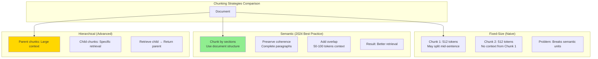
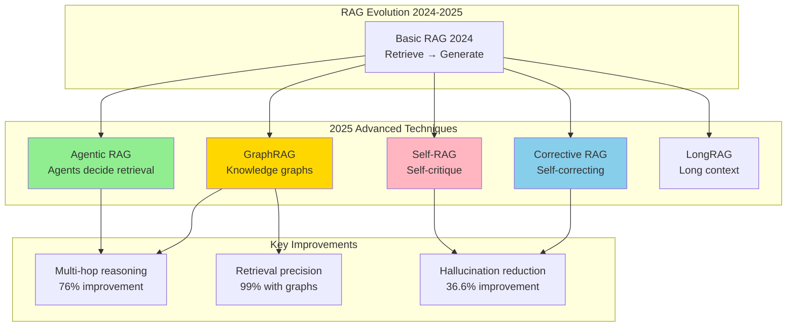

# RAG (Retrieval Augmented Generation) System Design - FAANG Interview Guide

## Interview Format: Conversational & Iterative

This guide simulates a real Gen AI system design interview focused on RAG systems with vector databases, chunking strategies, retrieval optimization, and evaluation frameworks.

---

## Interview Timeline (45 minutes)

| Phase | Time | Your Actions |
|-------|------|--------------|
| Requirements Gathering | 5-7 min | Ask clarifying questions, define scope |
| High-Level Design | 10-12 min | Draw architecture, explain RAG pipeline |
| Deep Dive | 20-25 min | Detail chunking, retrieval, evaluation |
| Trade-offs & Scale | 5-8 min | Discuss RAG vs fine-tuning, cost optimization |

---

## 🎯 Problem Statement

**Interviewer:** "Design a RAG system for an enterprise Q&A application. Users ask questions about internal company documents, and the system should provide accurate, grounded answers with citations."

---

## Phase 1: Requirements Gathering (5-7 minutes)

### Your Response Strategy

**You:** "RAG is critical for Gen AI applications that need up-to-date, factual information. Let me understand the requirements."

### Critical Questions to Ask

**You:** "Let me clarify the scope:

1. **Data & Knowledge Base:**
   - What types of documents? (PDFs, docs, wikis, code, databases?)
   - How many documents? (thousands, millions?)
   - How frequently do documents update?
   - Document structure? (structured, unstructured, semi-structured?)
   - Multi-modal? (text, images, tables?)

2. **Query Patterns:**
   - Query complexity? (simple lookups vs complex reasoning?)
   - Query volume? (QPS?)
   - Real-time or batch?
   - Multi-turn conversations?

3. **Quality Requirements:**
   - Accuracy expectations? (how critical are hallucinations?)
   - Citation requirements? (must show sources?)
   - Latency constraints? (real-time chat vs async reports?)
   - Language support? (English only or multilingual?)

4. **Technical Constraints:**
   - LLM choice? (OpenAI, Anthropic, open-source?)
   - On-prem or cloud?
   - Budget for inference?
   - Privacy/security requirements?

5. **Evaluation:**
   - How to measure success? (accuracy, retrieval precision, user satisfaction?)
   - A/B testing capability?"

### Interviewer's Answers

**Interviewer:** "Here's the scope:

- **Documents:** 100K internal docs (PDFs, wikis, Confluence, Google Docs), updated daily
- **Types:** Technical docs, HR policies, financial reports, code documentation
- **Queries:** 1K queries/day, conversational style, multi-turn sessions
- **Latency:** <5 seconds for response
- **Quality:** High accuracy required (this is mission-critical info), must cite sources
- **LLM:** GPT-4 or Claude (cloud-based acceptable)
- **Privacy:** Moderate (internal use only, no sensitive PII)
- **Languages:** English primary, Spanish secondary"

### Requirements Summary

**You:** "Perfect! Let me summarize:

#### Functional Requirements
- Ingest 100K documents from multiple sources (PDFs, wikis, Confluence, Docs)
- Support conversational Q&A with multi-turn context
- Provide accurate answers with source citations
- Daily document updates (incremental indexing)
- Multi-language support (English, Spanish)

#### Non-Functional Requirements
- **Scale:** 100K documents, 1K queries/day (~12 QPS peak)
- **Latency:** <5 seconds end-to-end
- **Accuracy:** High precision required (minimize hallucinations)
- **Freshness:** Daily updates, documents visible within 24 hours
- **Cost:** Optimize LLM inference costs

#### Key Challenges
- **Chunking:** How to split documents while preserving context?
- **Retrieval:** Find most relevant chunks from 100K docs
- **Context Window:** LLM limits (8K-128K tokens)
- **Evaluation:** How to measure RAG quality?
- **Hallucination Prevention:** Ensure answers are grounded in documents

Correct?"

**Interviewer:** "Yes, proceed."

---

## Phase 2: High-Level Design (10-12 minutes)

### Architecture Overview

**You:** "I'll design a modern RAG system using the latest 2024 best practices: hybrid search, semantic chunking, and reranking."

```mermaid
graph TB
    subgraph "User Layer"
        U[User Query:<br/>"What is our PTO policy?"]
        UI[Chat Interface]
    end

    subgraph "Query Processing"
        QR[Query Rewriter<br/>Expand query]
        QE[Query Encoder<br/>text-embedding-3-large]
        HYB[Hybrid Query Builder<br/>Dense + Sparse]
    end

    subgraph "Retrieval Pipeline - Stage 1"
        VS[Vector Search<br/>Pinecone/Weaviate]
        KW[Keyword Search<br/>Elasticsearch BM25]
        RRF[Reciprocal Rank Fusion<br/>Merge results]
    end

    subgraph "Reranking - Stage 2"
        RR[Cross-Encoder Reranker<br/>ms-marco-MiniLM]
        FILTER[Context Filtering<br/>Remove duplicates]
    end

    subgraph "Generation - Stage 3"
        PROMPT[Prompt Constructor<br/>Query + Context + Instructions]
        LLM[LLM Generator<br/>GPT-4 / Claude 3]
        CITE[Citation Extractor<br/>Add source links]
    end

    subgraph "Ingestion Pipeline - Offline"
        DOC[Document Sources<br/>PDFs, Wikis, Confluence]
        PARSE[Document Parser<br/>Unstructured.io]
        CHUNK[Semantic Chunker<br/>LangChain]
        EMB[Embedding Generator<br/>Batch processing]
        INDEX[Vector Index<br/>FAISS/Pinecone]
    end

    subgraph "Storage"
        VDB[(Vector Database<br/>Pinecone)]
        ES[(Elasticsearch<br/>Keyword Index)]
        META[(Metadata Store<br/>PostgreSQL)]
        CACHE[(Response Cache<br/>Redis)]
    end

    subgraph "Evaluation & Monitoring"
        EVAL[Eval Framework<br/>RAGAS metrics]
        LOG[Query Logs<br/>Analytics]
        AB[A/B Testing<br/>Experiment tracking]
    end

    U --> UI
    UI --> QR
    QR --> QE
    QR --> HYB

    QE --> VS
    HYB --> KW

    VS --> RRF
    KW --> RRF

    RRF --> RR
    RR --> FILTER

    FILTER --> PROMPT
    PROMPT --> LLM
    LLM --> CITE
    CITE --> UI

    DOC --> PARSE
    PARSE --> CHUNK
    CHUNK --> EMB
    EMB --> VDB
    EMB --> ES
    CHUNK --> META

    VS --> VDB
    KW --> ES
    CITE --> CACHE

    LLM --> EVAL
    UI --> LOG
    LOG --> AB

    style LLM fill:#90EE90
    style RR fill:#FFB6C1
    style CHUNK fill:#FFD700
    style VDB fill:#87CEEB
```

### RAG Pipeline Data Flow

**You:** "Let me walk through the end-to-end flow:

#### Ingestion Pipeline (Offline - Batch)

```
1. Document Collection:
   - Crawl Confluence, Google Drive, SharePoint
   - Download PDFs, parse HTML, extract text

2. Document Parsing:
   - Extract text, tables, images
   - Preserve structure (headers, lists, etc.)
   - OCR for scanned PDFs

3. Semantic Chunking (Critical!):
   - Split documents into chunks (512 tokens each)
   - Preserve semantic coherence
   - Add overlap (50 tokens) for context

4. Embedding Generation:
   - Generate embeddings (1536-dim)
   - Batch process (1000 docs/batch)
   - Store in vector database

5. Indexing:
   - Vector index: Pinecone (semantic search)
   - Keyword index: Elasticsearch (exact match)
   - Metadata: PostgreSQL (filtering)
```

#### Query Pipeline (Online - Real-time)

```
1. Query Processing (100ms):
   - Rewrite query (expand acronyms, add context)
   - Generate query embedding
   - Build hybrid query (dense + sparse)

2. Retrieval (200ms):
   - Vector search: Top 20 chunks by similarity
   - Keyword search: Top 20 chunks by BM25
   - Merge with RRF: Get top 40 candidates

3. Reranking (300ms):
   - Cross-encoder: Re-score 40 chunks
   - Filter duplicates: Remove similar chunks
   - Select top 5 chunks (best context)

4. Generation (3-4 seconds):
   - Build prompt: Query + 5 chunks + instructions
   - LLM inference: GPT-4 generates answer
   - Extract citations: Link to source documents
   - Stream response to user

Total: ~4 seconds
```"

**Interviewer:** "How do you handle chunking? This seems critical for RAG quality."

---

## Phase 3: Deep Dive - Chunking, Retrieval, Evaluation (20-25 minutes)

### Semantic Chunking Strategy

**You:** "Chunking is THE most important decision in RAG. 2024 best practice is semantic chunking, not fixed-size. Let me explain:



#### Implementation

```python
from langchain.text_splitter import RecursiveCharacterTextSplitter
from typing import List, Dict
import tiktoken

class SemanticChunker:
    """
    Chunk documents while preserving semantic coherence

    2024 Best Practices:
    1. Use document structure (headers, sections)
    2. Preserve complete sentences/paragraphs
    3. Add overlap for context
    4. Target chunk size based on use case
    """

    def __init__(self,
                 chunk_size: int = 512,
                 chunk_overlap: int = 50,
                 model_name: str = "gpt-4"):
        """
        Args:
            chunk_size: Target tokens per chunk
            chunk_overlap: Overlap tokens for context
            model_name: For token counting
        """
        self.chunk_size = chunk_size
        self.chunk_overlap = chunk_overlap
        self.tokenizer = tiktoken.encoding_for_model(model_name)

    def chunk_document(self, document: Dict) -> List[Dict]:
        """
        Chunk document with semantic awareness

        Args:
            document: {'content': str, 'metadata': dict}

        Returns:
            chunks: List of chunk dicts
        """

        text = document['content']
        metadata = document['metadata']

        # Strategy 1: Use document structure if available
        if self.has_structure(text):
            chunks = self.chunk_by_structure(text, metadata)
        else:
            # Strategy 2: Recursive splitting
            chunks = self.chunk_recursively(text, metadata)

        return chunks

    def has_structure(self, text: str) -> bool:
        """Check if document has clear structure (headers, sections)"""
        # Look for markdown headers or HTML tags
        has_headers = text.count('\n# ') > 3 or text.count('<h1>') > 0
        return has_headers

    def chunk_by_structure(self, text: str, metadata: Dict) -> List[Dict]:
        """
        Chunk by document structure (sections, headers)

        Example:
        # Section 1: Introduction
        This is intro...

        # Section 2: Details
        This is details...

        → Chunk 1: Section 1 + intro
        → Chunk 2: Section 2 + details
        """

        import re

        # Split by headers
        sections = re.split(r'\n(?=# )', text)  # Split on headers

        chunks = []
        for i, section in enumerate(sections):
            # Extract header
            header_match = re.match(r'(#+\s+.*?)\n', section)
            header = header_match.group(1) if header_match else ""

            # Chunk this section if too large
            section_chunks = self.chunk_recursively(section, metadata)

            # Add header context to each chunk
            for chunk in section_chunks:
                chunk['metadata']['section_header'] = header
                chunk['metadata']['section_index'] = i

            chunks.extend(section_chunks)

        return chunks

    def chunk_recursively(self, text: str, metadata: Dict) -> List[Dict]:
        """
        Recursive chunking with multiple separators

        Priority:
        1. Split by paragraphs (\n\n)
        2. Split by sentences (.)
        3. Split by words (space)
        4. Split by characters (last resort)
        """

        splitter = RecursiveCharacterTextSplitter(
            chunk_size=self.chunk_size,
            chunk_overlap=self.chunk_overlap,
            separators=[
                "\n\n",  # Paragraphs (highest priority)
                "\n",    # Lines
                ". ",    # Sentences
                ", ",    # Clauses
                " ",     # Words
                ""       # Characters (last resort)
            ],
            length_function=self.count_tokens
        )

        text_chunks = splitter.split_text(text)

        chunks = []
        for i, chunk_text in enumerate(text_chunks):
            chunks.append({
                'content': chunk_text,
                'metadata': {
                    **metadata,
                    'chunk_index': i,
                    'total_chunks': len(text_chunks),
                    'token_count': self.count_tokens(chunk_text)
                }
            })

        return chunks

    def count_tokens(self, text: str) -> int:
        """Count tokens using tiktoken"""
        return len(self.tokenizer.encode(text))


class HierarchicalChunker:
    """
    Advanced: Hierarchical chunking (parent-child)

    Idea:
    - Small chunks for precise retrieval
    - Large parent chunks for context in LLM

    Retrieve: child chunk
    Return: parent chunk to LLM
    """

    def chunk_hierarchical(self, document: Dict) -> Dict:
        """
        Create parent-child chunk hierarchy

        Returns:
            {
                'parent_chunks': [...],  # Large chunks (2048 tokens)
                'child_chunks': [...],   # Small chunks (512 tokens)
                'child_to_parent': {}    # Mapping
            }
        """

        # Create parent chunks (large)
        parent_chunker = SemanticChunker(chunk_size=2048, chunk_overlap=100)
        parent_chunks = parent_chunker.chunk_document(document)

        # Create child chunks (small) for each parent
        child_chunker = SemanticChunker(chunk_size=512, chunk_overlap=50)

        child_chunks = []
        child_to_parent = {}

        for parent_idx, parent in enumerate(parent_chunks):
            # Split parent into children
            children = child_chunker.chunk_recursively(
                parent['content'],
                parent['metadata']
            )

            for child_idx, child in enumerate(children):
                child_id = f"child_{parent_idx}_{child_idx}"
                child_chunks.append({
                    **child,
                    'id': child_id,
                    'parent_id': f"parent_{parent_idx}"
                })

                # Map child to parent
                child_to_parent[child_id] = f"parent_{parent_idx}"

        return {
            'parent_chunks': parent_chunks,
            'child_chunks': child_chunks,
            'child_to_parent': child_to_parent
        }


# Example usage
chunker = SemanticChunker(chunk_size=512, chunk_overlap=50)

document = {
    'content': """
    # Employee Handbook

    ## PTO Policy

    All full-time employees receive 20 days of PTO per year.
    PTO accrues monthly at a rate of 1.67 days per month.

    To request PTO, submit a request in Workday at least 2 weeks in advance.

    ## Benefits

    We offer comprehensive health insurance including medical, dental, and vision.
    """,
    'metadata': {
        'source': 'hr_handbook.pdf',
        'doc_id': 'doc_12345',
        'last_updated': '2024-01-15'
    }
}

chunks = chunker.chunk_document(document)

# Result: 3-4 chunks
# Chunk 1: PTO Policy section
# Chunk 2: Benefits section
# Each chunk preserves complete sections
```

### Hybrid Retrieval: Dense + Sparse

**You:** "Now let me explain the retrieval strategy - hybrid search is the 2024 gold standard:

```python
import numpy as np
from typing import List, Tuple

class HybridRetriever:
    """
    Hybrid retrieval: Combine dense (vector) + sparse (BM25) search

    Why hybrid?
    - Dense: Captures semantic similarity ("PTO" matches "vacation days")
    - Sparse: Captures exact matches (important for acronyms, proper nouns)

    2024 consensus: Hybrid > Pure dense
    """

    def __init__(self, vector_db, keyword_db, embedding_model):
        self.vector_db = vector_db  # Pinecone
        self.keyword_db = keyword_db  # Elasticsearch
        self.embedding_model = embedding_model

    def retrieve(self,
                 query: str,
                 top_k: int = 5,
                 alpha: float = 0.7) -> List[Dict]:
        """
        Hybrid retrieval with reciprocal rank fusion

        Args:
            query: User question
            top_k: Number of chunks to return
            alpha: Weight for dense search (0-1), 1-alpha for sparse

        Returns:
            Top-k chunks
        """

        # 1. Dense retrieval (semantic)
        query_embedding = self.embedding_model.encode(query)

        dense_results = self.vector_db.query(
            vector=query_embedding,
            top_k=top_k * 4,  # Retrieve more for fusion
            include_metadata=True
        )

        # 2. Sparse retrieval (keyword)
        sparse_results = self.keyword_db.search(
            query=query,
            top_k=top_k * 4,
            algorithm='bm25'
        )

        # 3. Reciprocal Rank Fusion (RRF)
        combined_scores = self.reciprocal_rank_fusion(
            dense_results,
            sparse_results,
            alpha=alpha
        )

        # 4. Sort by combined score
        ranked_results = sorted(
            combined_scores.items(),
            key=lambda x: x[1],
            reverse=True
        )

        # 5. Return top-k
        top_chunks = [
            self.get_chunk(chunk_id)
            for chunk_id, score in ranked_results[:top_k]
        ]

        return top_chunks

    def reciprocal_rank_fusion(self,
                               dense_results: List,
                               sparse_results: List,
                               alpha: float = 0.7,
                               k: int = 60) -> Dict[str, float]:
        """
        RRF: Combine rankings from multiple sources

        Score(doc) = Σ [1 / (k + rank(doc))]

        Args:
            k: RRF constant (usually 60)
        """

        scores = {}

        # Add dense scores
        for rank, result in enumerate(dense_results):
            chunk_id = result['id']
            scores[chunk_id] = scores.get(chunk_id, 0) + \
                              alpha / (k + rank + 1)

        # Add sparse scores
        for rank, result in enumerate(sparse_results):
            chunk_id = result['id']
            scores[chunk_id] = scores.get(chunk_id, 0) + \
                              (1 - alpha) / (k + rank + 1)

        return scores


class CrossEncoderReranker:
    """
    Reranking with cross-encoder (Stage 2)

    Why rerank?
    - Bi-encoders (retrieval): Fast but less accurate
    - Cross-encoders (reranking): Slow but very accurate

    Strategy:
    - Retrieve 20-40 candidates with bi-encoder (fast)
    - Rerank top 5-10 with cross-encoder (accurate)
    """

    def __init__(self):
        from sentence_transformers import CrossEncoder

        self.model = CrossEncoder('cross-encoder/ms-marco-MiniLM-L-12-v2')

    def rerank(self,
               query: str,
               candidates: List[Dict],
               top_k: int = 5) -> List[Dict]:
        """
        Rerank candidates using cross-encoder

        Args:
            query: User question
            candidates: Initial retrieval results (20-40 chunks)
            top_k: Final number of chunks to return

        Returns:
            Top-k reranked chunks
        """

        # Create (query, chunk) pairs
        pairs = [
            [query, candidate['content']]
            for candidate in candidates
        ]

        # Score with cross-encoder
        scores = self.model.predict(pairs)

        # Sort by score
        ranked_indices = np.argsort(scores)[::-1][:top_k]

        # Return top-k
        reranked = [candidates[i] for i in ranked_indices]

        return reranked
```

### Prompt Engineering for RAG

**You:** "The prompt is critical for RAG quality. Here's the template:

```python
class RAGPromptBuilder:
    """
    Build prompts for RAG with best practices
    """

    def build_prompt(self,
                    query: str,
                    context_chunks: List[Dict],
                    conversation_history: List[Dict] = None) -> str:
        """
        Build RAG prompt with query + context + instructions

        Best practices:
        1. Clear instructions ("Use ONLY the context provided")
        2. Context with citations
        3. Explicit citation format
        4. Conversation history for multi-turn
        """

        # Format context with citations
        context_str = self.format_context(context_chunks)

        # Conversation history
        history_str = self.format_history(conversation_history) if conversation_history else ""

        # Build prompt
        prompt = f"""You are a helpful assistant that answers questions based on the provided context.

IMPORTANT INSTRUCTIONS:
1. Answer the question using ONLY the information in the context below
2. If the answer is not in the context, say "I don't have enough information to answer this question"
3. Cite your sources using [Source X] notation
4. Be concise and direct

{history_str}

CONTEXT:
{context_str}

QUESTION: {query}

ANSWER:"""

        return prompt

    def format_context(self, chunks: List[Dict]) -> str:
        """Format context chunks with source citations"""

        formatted = []
        for i, chunk in enumerate(chunks, 1):
            source = chunk['metadata'].get('source', 'Unknown')
            content = chunk['content']

            formatted.append(f"""[Source {i}] ({source})
{content}
---""")

        return "\n\n".join(formatted)

    def format_history(self, history: List[Dict]) -> str:
        """Format conversation history for multi-turn"""

        formatted = ["CONVERSATION HISTORY:"]

        for turn in history:
            formatted.append(f"User: {turn['question']}")
            formatted.append(f"Assistant: {turn['answer']}")

        formatted.append("")
        return "\n".join(formatted)


# Example usage
prompt_builder = RAGPromptBuilder()

query = "What is our PTO policy?"

context_chunks = [
    {
        'content': "All full-time employees receive 20 days of PTO per year. PTO accrues monthly.",
        'metadata': {'source': 'hr_handbook.pdf', 'page': 12}
    },
    {
        'content': "To request PTO, submit in Workday at least 2 weeks in advance.",
        'metadata': {'source': 'hr_handbook.pdf', 'page': 13}
    }
]

prompt = prompt_builder.build_prompt(query, context_chunks)

# Send to LLM
import openai
response = openai.ChatCompletion.create(
    model="gpt-4",
    messages=[{"role": "user", "content": prompt}],
    temperature=0.0  # Deterministic for factual answers
)

answer = response.choices[0].message.content
# Expected: "Employees receive 20 days of PTO per year [Source 1]. To request, submit in Workday 2 weeks in advance [Source 2]."
```

### Evaluation Framework (RAGAS)

**You:** "Finally, how do we evaluate RAG quality? Use RAGAS (2024 standard):

```python
from ragas import evaluate
from ragas.metrics import (
    faithfulness,
    answer_relevancy,
    context_precision,
    context_recall
)

class RAGEvaluator:
    """
    Evaluate RAG system using RAGAS metrics

    Metrics:
    1. Faithfulness: Is answer grounded in context? (no hallucinations)
    2. Answer Relevancy: Does answer address the question?
    3. Context Precision: Are retrieved chunks relevant?
    4. Context Recall: Did we retrieve all relevant info?
    """

    def __init__(self):
        self.metrics = [
            faithfulness,
            answer_relevancy,
            context_precision,
            context_recall
        ]

    def evaluate_system(self, test_dataset: List[Dict]) -> Dict:
        """
        Evaluate RAG on test set

        test_dataset format:
        [
            {
                'question': "What is our PTO policy?",
                'ground_truth': "20 days per year",
                'contexts': [...],  # Retrieved chunks
                'answer': "..."     # Generated answer
            },
            ...
        ]
        """

        results = evaluate(
            dataset=test_dataset,
            metrics=self.metrics
        )

        return results

    def compute_custom_metrics(self, predictions: List[Dict]) -> Dict:
        """
        Additional custom metrics

        - Citation accuracy: Are citations correct?
        - Latency: End-to-end response time
        - Cost: LLM tokens used
        """

        metrics = {
            'citation_accuracy': self.citation_accuracy(predictions),
            'avg_latency': self.compute_avg_latency(predictions),
            'avg_cost': self.compute_avg_cost(predictions),
            'user_satisfaction': self.compute_satisfaction(predictions)
        }

        return metrics

    def citation_accuracy(self, predictions: List[Dict]) -> float:
        """
        Check if citations match retrieved sources

        Example:
        Answer: "PTO is 20 days [Source 1]"
        Check: Does Source 1 actually say this?
        """

        correct_citations = 0
        total_citations = 0

        for pred in predictions:
            answer = pred['answer']
            contexts = pred['contexts']

            # Extract citations from answer
            import re
            citations = re.findall(r'\[Source (\d+)\]', answer)

            for cite_num in citations:
                total_citations += 1

                # Check if this source supports the claim
                context_idx = int(cite_num) - 1
                if context_idx < len(contexts):
                    # Verify claim is in context (simplified check)
                    # In practice, use NLI model
                    if self.verify_citation(answer, contexts[context_idx]):
                        correct_citations += 1

        return correct_citations / total_citations if total_citations > 0 else 0

    def verify_citation(self, answer: str, context: str) -> bool:
        """Verify citation using NLI model (simplified)"""
        # In practice, use cross-encoder or NLI model
        # For demo, simple string match
        return True  # Placeholder


# Example evaluation
evaluator = RAGEvaluator()

test_data = [
    {
        'question': "What is our PTO policy?",
        'ground_truth': "20 days per year, accrues monthly, request 2 weeks in advance",
        'contexts': ["Full-time employees get 20 days PTO per year...", "Submit PTO requests 2 weeks early..."],
        'answer': "Employees receive 20 days PTO per year [Source 1]. Request at least 2 weeks in advance [Source 2]."
    }
]

results = evaluator.evaluate_system(test_data)

# Results:
# {
#   'faithfulness': 0.95,  # Answer is grounded in context
#   'answer_relevancy': 0.92,  # Answer addresses question
#   'context_precision': 0.90,  # Retrieved chunks are relevant
#   'context_recall': 0.88  # All relevant info retrieved
# }
```

---

## Phase 3B: 2025 Advanced RAG Techniques (10-15 minutes)

**Interviewer:** "These are good RAG fundamentals. But what about the latest 2025 innovations like Agentic RAG, GraphRAG, and Self-RAG? How do they improve upon basic RAG?"

### Evolution of RAG (2024 → 2025)

**You:** "Excellent question! RAG has evolved significantly in 2025. Let me explain the cutting-edge techniques:



### 1. Agentic RAG (2025 Standard)

**You:** "Agentic RAG uses AI agents to dynamically decide **when** and **what** to retrieve, rather than always retrieving blindly.

```python
from langgraph.graph import StateGraph, END
from langchain.agents import AgentExecutor

class AgenticRAG:
    \"\"\"
    Agentic RAG: Agents decide retrieval strategy

    Key Innovation:
    - Agents decide IF retrieval is needed
    - WHAT to retrieve (which sources)
    - WHEN to retrieve (multi-hop reasoning)
    - HOW to retrieve (query reformulation)
    \"\"\"

    def __init__(self, llm, retriever, tools):
        self.llm = llm
        self.retriever = retriever
        self.tools = tools
        self.graph = self.build_agentic_graph()

    def build_agentic_graph(self):
        \"\"\"
        Build agentic workflow

        Flow:
        Query → Decide if retrieval needed → Retrieve → Decide if sufficient → Generate
        \"\"\"

        workflow = StateGraph(dict)

        # Add nodes
        workflow.add_node("analyze_query", self.analyze_query)
        workflow.add_node("decide_retrieval", self.decide_if_retrieval_needed)
        workflow.add_node("retrieve", self.retrieve_documents)
        workflow.add_node("evaluate_retrieval", self.evaluate_retrieval_quality)
        workflow.add_node("reformulate_query", self.reformulate_query)
        workflow.add_node("generate", self.generate_answer)

        # Add conditional edges
        workflow.add_conditional_edges(
            "decide_retrieval",
            self.should_retrieve,
            {
                "retrieve": "retrieve",
                "generate": "generate"  # Skip retrieval for factual questions LLM knows
            }
        )

        workflow.add_conditional_edges(
            "evaluate_retrieval",
            self.is_retrieval_sufficient,
            {
                "sufficient": "generate",
                "insufficient": "reformulate_query",  # Try again with better query
                "web_search": "web_search"  # Expand to web if internal docs insufficient
            }
        )

        workflow.set_entry_point("analyze_query")

        return workflow.compile()

    def analyze_query(self, state: dict) -> dict:
        \"\"\"
        Analyze query complexity and requirements

        Examples:
        - "What is 2+2?" → No retrieval needed
        - "What is our PTO policy?" → Needs internal docs retrieval
        - "What are the latest AI trends?" → Needs web search
        \"\"\"

        query = state['query']

        prompt = f\"\"\"Analyze this query and determine retrieval needs:

Query: {query}

Classify:
1. Simple fact (LLM knows) → no_retrieval
2. Internal knowledge → internal_docs
3. Recent events → web_search
4. Multi-part question → multi_hop

Return JSON:
{{
    "complexity": "simple|medium|complex",
    "retrieval_needed": true|false,
    "retrieval_source": "none|internal|web|both",
    "reasoning": "..."
}}\"\"\"

        analysis = self.llm.invoke(prompt)
        state['analysis'] = json.loads(analysis.content)

        return state

    def decide_if_retrieval_needed(self, state: dict) -> dict:
        \"\"\"Agent decides if retrieval is necessary\"\"\"

        analysis = state['analysis']

        state['needs_retrieval'] = analysis['retrieval_needed']
        state['retrieval_source'] = analysis['retrieval_source']

        return state

    def should_retrieve(self, state: dict) -> str:
        \"\"\"Routing function\"\"\"
        return "retrieve" if state['needs_retrieval'] else "generate"

    def retrieve_documents(self, state: dict) -> dict:
        \"\"\"Retrieve from appropriate source\"\"\"

        query = state['query']
        source = state['retrieval_source']

        if source == "internal":
            docs = self.retriever.retrieve(query, top_k=5)
        elif source == "web":
            docs = self.web_search(query, top_k=5)
        else:
            # Hybrid: both internal and web
            internal_docs = self.retriever.retrieve(query, top_k=3)
            web_docs = self.web_search(query, top_k=2)
            docs = internal_docs + web_docs

        state['retrieved_docs'] = docs

        return state

    def evaluate_retrieval_quality(self, state: dict) -> dict:
        \"\"\"
        Self-evaluate: Are retrieved docs sufficient?

        This is the key innovation - agent critiques its own retrieval
        \"\"\"

        query = state['query']
        docs = state['retrieved_docs']

        # Build evaluation prompt
        docs_text = "\n\n".join([f"Doc {i+1}: {d['content']}" for i, d in enumerate(docs)])

        prompt = f\"\"\"Evaluate if these documents are sufficient to answer the query:

Query: {query}

Retrieved Documents:
{docs_text}

Evaluate:
1. Relevance: Do documents contain relevant information?
2. Completeness: Is there enough information to answer fully?
3. Confidence: How confident are you in answering based on these docs?

Return JSON:
{{
    "relevance_score": 0-1,
    "completeness_score": 0-1,
    "confidence": 0-1,
    "is_sufficient": true|false,
    "missing_information": "what's missing if insufficient"
}}\"\"\"

        evaluation = self.llm.invoke(prompt)
        state['retrieval_evaluation'] = json.loads(evaluation.content)

        return state

    def is_retrieval_sufficient(self, state: dict) -> str:
        \"\"\"Decide next step based on retrieval quality\"\"\"

        eval_result = state['retrieval_evaluation']

        if eval_result['is_sufficient']:
            return "sufficient"
        elif eval_result['confidence'] < 0.3:
            # Very low confidence, try web search
            return "web_search"
        else:
            # Reformulate query and try again
            return "insufficient"

    def reformulate_query(self, state: dict) -> dict:
        \"\"\"
        Reformulate query based on what's missing

        Example:
        Original: "What is our PTO policy?"
        Missing: "Specific information about accrual rate"
        Reformulated: "How does PTO accrue for employees?"
        \"\"\"

        original_query = state['query']
        missing_info = state['retrieval_evaluation']['missing_information']

        prompt = f\"\"\"Reformulate the query to better find the missing information:

Original Query: {original_query}
Missing Information: {missing_info}

Generate a more specific query that targets the missing information.\"\"\"

        reformulated = self.llm.invoke(prompt)
        state['query'] = reformulated.content  # Update query

        # Re-retrieve with new query
        return self.retrieve_documents(state)

    def generate_answer(self, state: dict) -> dict:
        \"\"\"Generate final answer\"\"\"

        query = state['query']
        docs = state.get('retrieved_docs', [])

        # Build prompt
        context = self.format_context(docs) if docs else "No context (answering from knowledge)"

        prompt = f\"\"\"Answer the question based on the context:

Context:
{context}

Question: {query}

Answer:\"\"\"

        answer = self.llm.invoke(prompt)
        state['answer'] = answer.content

        return state


# Example usage
agentic_rag = AgenticRAG(llm=ChatOpenAI(model="gpt-4"), retriever=retriever, tools=tools)

# Query 1: Simple math (no retrieval needed)
result1 = agentic_rag.run(query="What is 2+2?")
# Flow: analyze → decide_no_retrieval → generate
# Answer: "4" (no retrieval happened)

# Query 2: Internal docs
result2 = agentic_rag.run(query="What is our PTO policy?")
# Flow: analyze → retrieve_internal → evaluate → generate
# Answer: "20 days per year [Source 1]..." (retrieved from docs)

# Query 3: Insufficient retrieval (multi-hop)
result3 = agentic_rag.run(query="How does our PTO policy compare to industry average?")
# Flow: analyze → retrieve_internal → evaluate_insufficient → web_search → generate
# Answer: "Our policy is 20 days [Source 1]. Industry average is 15 days [Web Source 2]."
```

### 2. GraphRAG (Microsoft - 2025)

**You:** "GraphRAG transforms retrieval from vector similarity to graph traversal. It's especially powerful for multi-hop reasoning.

**Key Innovation:** Instead of retrieving isolated chunks, GraphRAG retrieves **subgraphs** of connected entities and relationships.

```python
import networkx as nx
from langchain_community.graphs import Neo4jGraph

class GraphRAG:
    \"\"\"
    GraphRAG: Knowledge graph-based retrieval

    Advantages:
    - Multi-hop reasoning: 76% improvement
    - Contextual relationships preserved
    - Entity-centric retrieval

    Process:
    1. Build knowledge graph from documents
    2. Detect communities (Leiden algorithm)
    3. Generate summaries for communities
    4. Retrieve relevant subgraphs for queries
    \"\"\"

    def __init__(self, llm, neo4j_uri, neo4j_user, neo4j_password):
        self.llm = llm
        self.graph = Neo4jGraph(
            url=neo4j_uri,
            username=neo4j_user,
            password=neo4j_password
        )

    def build_knowledge_graph(self, documents: List[Dict]):
        \"\"\"
        Step 1: Extract entities and relationships from documents

        Example Document:
        "John Smith works at Acme Corp as a Software Engineer.
         He reports to Jane Doe, the Engineering Manager."

        Extracted Graph:
        - Entities: [John Smith, Acme Corp, Jane Doe]
        - Relationships:
          (John Smith)-[WORKS_AT]->(Acme Corp)
          (John Smith)-[REPORTS_TO]->(Jane Doe)
          (John Smith)-[HAS_ROLE]->(Software Engineer)
        \"\"\"

        for doc in documents:
            # Extract entities and relationships using LLM
            extraction_prompt = f\"\"\"Extract all entities and relationships from this text:

Text: {doc['content']}

Return JSON:
{{
    "entities": [
        {{"name": "entity_name", "type": "PERSON|ORG|LOCATION|CONCEPT"}},
        ...
    ],
    "relationships": [
        {{"source": "entity1", "relationship": "WORKS_AT", "target": "entity2"}},
        ...
    ]
}}\"\"\"

            result = self.llm.invoke(extraction_prompt)
            extracted = json.loads(result.content)

            # Add to Neo4j
            for entity in extracted['entities']:
                self.graph.query(
                    f\"\"\"
                    MERGE (e:{entity['type']} {{name: $name}})
                    SET e.source_doc = $doc_id
                    \"\"\",
                    {"name": entity['name'], "doc_id": doc['id']}
                )

            for rel in extracted['relationships']:
                self.graph.query(
                    f\"\"\"
                    MATCH (source {{name: $source_name}})
                    MATCH (target {{name: $target_name}})
                    MERGE (source)-[:{rel['relationship']}]->(target)
                    \"\"\",
                    {
                        "source_name": rel['source'],
                        "target_name": rel['target']
                    }
                )

    def detect_communities(self):
        \"\"\"
        Step 2: Detect communities using Leiden algorithm

        Communities = clusters of densely connected entities
        Example: "Engineering Team", "Sales Team", "Product Team"
        \"\"\"

        # Use Leiden algorithm in Neo4j
        self.graph.query(\"\"\"
            CALL gds.leiden.write({
                nodeProjection: '*',
                relationshipProjection: '*',
                writeProperty: 'community'
            })
        \"\"\")

        # Generate summaries for each community
        communities = self.graph.query(\"\"\"
            MATCH (n)
            RETURN DISTINCT n.community as community_id,
                   collect(n.name) as members
        \"\"\")

        for community in communities:
            summary = self.generate_community_summary(community['members'])

            # Store summary
            self.graph.query(
                \"\"\"
                MATCH (n {community: $community_id})
                SET n.community_summary = $summary
                \"\"\",
                {
                    "community_id": community['community_id'],
                    "summary": summary
                }
            )

    def generate_community_summary(self, members: List[str]) -> str:
        \"\"\"Generate natural language summary of community\"\"\"

        prompt = f\"\"\"Summarize this community of related entities:

Members: {', '.join(members)}

Provide a concise summary describing what this community represents.\"\"\"

        summary = self.llm.invoke(prompt)
        return summary.content

    def retrieve_subgraph(self, query: str, max_hops: int = 2) -> Dict:
        \"\"\"
        Step 3: Retrieve relevant subgraph for query

        Multi-hop retrieval example:
        Query: "Who does John Smith's manager report to?"

        Subgraph retrieved:
        (John Smith)-[REPORTS_TO]->(Jane Doe)-[REPORTS_TO]->(CEO)

        Answer: "John Smith's manager Jane Doe reports to the CEO."
        \"\"\"

        # Extract entities from query
        query_entities = self.extract_entities_from_query(query)

        # Retrieve subgraph around query entities
        subgraph_query = f\"\"\"
        MATCH path = (start)-[*1..{max_hops}]-(end)
        WHERE start.name IN $entity_names
        RETURN path
        LIMIT 100
        \"\"\"

        subgraph = self.graph.query(
            subgraph_query,
            {"entity_names": query_entities}
        )

        # Convert to natural language context
        context = self.subgraph_to_context(subgraph)

        return {
            'subgraph': subgraph,
            'context': context,
            'entities': query_entities
        }

    def subgraph_to_context(self, subgraph) -> str:
        \"\"\"Convert graph structure to natural language\"\"\"

        context_parts = []

        for path in subgraph:
            # Extract nodes and relationships
            nodes = path['nodes']
            relationships = path['relationships']

            # Build sentence
            for i, rel in enumerate(relationships):
                source = nodes[i]['name']
                target = nodes[i+1]['name']
                rel_type = rel['type'].replace('_', ' ').lower()

                context_parts.append(f"{source} {rel_type} {target}")

        return ". ".join(context_parts) + "."

    def answer_with_graphrag(self, query: str) -> str:
        \"\"\"
        Full GraphRAG pipeline

        Returns:
            Answer with graph-based context
        \"\"\"

        # Retrieve subgraph
        retrieval = self.retrieve_subgraph(query, max_hops=3)

        # Generate answer using graph context
        prompt = f\"\"\"Answer the question using the knowledge graph context:

Context from Knowledge Graph:
{retrieval['context']}

Question: {query}

Answer:\"\"\"

        answer = self.llm.invoke(prompt)

        return answer.content


# Example: Multi-hop reasoning
graphrag = GraphRAG(llm, neo4j_uri, neo4j_user, neo4j_password)

# Build graph from HR documents
graphrag.build_knowledge_graph(hr_documents)
graphrag.detect_communities()

# Multi-hop query
answer = graphrag.answer_with_graphrag(
    "Who does John Smith's manager's manager report to?"
)

# GraphRAG can trace:
# John Smith → (REPORTS_TO) → Jane Doe → (REPORTS_TO) → VP Engineering → (REPORTS_TO) → CEO
# Answer: "John Smith's manager's manager (VP Engineering) reports to the CEO."

# Traditional RAG would fail here - can't connect 3 hops!
```

**GraphRAG Results (Microsoft Research):**
- **Multi-hop reasoning:** 76% improvement over basic RAG
- **Global queries:** Can answer "What are the main themes across all documents?"
- **Precision:** Up to 99% retrieval precision with knowledge graphs

### 3. Self-RAG & Corrective RAG (CRAG)

**You:** "Self-RAG and CRAG add self-critique and self-correction to the RAG pipeline.

```python
class SelfRAG:
    \"\"\"
    Self-RAG: Model critiques its own retrievals and outputs

    Process:
    1. Retrieve documents
    2. Critique: Are these documents relevant?
    3. Generate answer
    4. Critique: Is answer faithful to documents?
    5. Revise if needed
    \"\"\"

    def __init__(self, llm, retriever):
        self.llm = llm
        self.retriever = retriever

    def retrieve_with_critique(self, query: str) -> List[Dict]:
        \"\"\"
        Retrieve and critique relevance

        Self-reflection: Are these documents actually relevant?
        \"\"\"

        # Initial retrieval
        docs = self.retriever.retrieve(query, top_k=10)

        # Critique each document
        critiqued_docs = []

        for doc in docs:
            # Self-critique prompt
            critique_prompt = f\"\"\"Rate the relevance of this document to the query:

Query: {query}

Document: {doc['content']}

Rate on scale 0-1:
- 0: Completely irrelevant
- 0.5: Somewhat relevant
- 1.0: Highly relevant

Return JSON:
{{
    "relevance_score": 0-1,
    "reasoning": "why this score?"
}}\"\"\"

            critique = self.llm.invoke(critique_prompt)
            critique_result = json.loads(critique.content)

            # Only keep highly relevant docs (>0.7)
            if critique_result['relevance_score'] >= 0.7:
                doc['relevance_score'] = critique_result['relevance_score']
                doc['critique_reasoning'] = critique_result['reasoning']
                critiqued_docs.append(doc)

        # Sort by relevance
        critiqued_docs.sort(key=lambda x: x['relevance_score'], reverse=True)

        return critiqued_docs[:5]  # Top 5 after critique

    def generate_with_self_check(self, query: str, docs: List[Dict]) -> str:
        \"\"\"
        Generate answer and self-check faithfulness
        \"\"\"

        # Generate initial answer
        context = self.format_context(docs)
        answer = self.generate_answer(query, context)

        # Self-check: Is answer faithful to documents?
        faithfulness_prompt = f\"\"\"Check if the answer is faithful to the provided documents:

Documents:
{context}

Answer: {answer}

Check:
1. Is every claim in the answer supported by the documents?
2. Are there any hallucinations?
3. Should we revise the answer?

Return JSON:
{{
    "is_faithful": true|false,
    "unsupported_claims": ["claim1", "claim2"],
    "faithfulness_score": 0-1,
    "suggested_revision": "revised answer if needed"
}}\"\"\"

        faithfulness_check = self.llm.invoke(faithfulness_prompt)
        check_result = json.loads(faithfulness_check.content)

        # If not faithful, use revised version
        if not check_result['is_faithful']:
            answer = check_result['suggested_revision']

        return answer


class CorrectiveRAG:
    \"\"\"
    Corrective RAG (CRAG): Self-correcting retrieval

    Key Innovation:
    - Confidence scoring for each retrieved document
    - Trigger web search if confidence low
    - Decompose-recompose for high-confidence docs
    \"\"\"

    def __init__(self, llm, retriever):
        self.llm = llm
        self.retriever = retriever

    def retrieve_with_correction(self, query: str) -> Dict:
        \"\"\"
        CRAG retrieval with confidence-based correction

        Process:
        1. Retrieve documents
        2. Score confidence for each
        3. High confidence → Refine knowledge
        4. Low confidence → Trigger web search
        5. Medium → Reformulate and re-retrieve
        \"\"\"

        # Initial retrieval
        docs = self.retriever.retrieve(query, top_k=10)

        # Score confidence
        confidence_scores = []

        for doc in docs:
            # Confidence scorer (can be lightweight classifier)
            confidence = self.score_confidence(query, doc)
            confidence_scores.append({
                'doc': doc,
                'confidence': confidence
            })

        # Categorize by confidence
        high_conf = [d for d in confidence_scores if d['confidence'] >= 0.8]
        medium_conf = [d for d in confidence_scores if 0.5 <= d['confidence'] < 0.8]
        low_conf = [d for d in confidence_scores if d['confidence'] < 0.5]

        final_docs = []

        # High confidence: Decompose-recompose (refine)
        if high_conf:
            refined = self.decompose_recompose([d['doc'] for d in high_conf], query)
            final_docs.extend(refined)

        # Medium confidence: Reformulate query
        if medium_conf and not high_conf:
            reformulated_query = self.reformulate_query(query, medium_conf)
            additional_docs = self.retriever.retrieve(reformulated_query, top_k=5)
            final_docs.extend(additional_docs)

        # Low confidence: Trigger web search
        if not high_conf and not medium_conf:
            web_docs = self.web_search(query, top_k=5)
            final_docs.extend(web_docs)

        return {
            'docs': final_docs,
            'strategy_used': 'high_conf' if high_conf else 'medium_conf' if medium_conf else 'web_search',
            'confidence_distribution': {
                'high': len(high_conf),
                'medium': len(medium_conf),
                'low': len(low_conf)
            }
        }

    def score_confidence(self, query: str, doc: Dict) -> float:
        \"\"\"
        Score confidence that document can answer query

        Uses lightweight classifier (fast)
        \"\"\"

        # Simplified confidence scoring
        # In production, use fine-tuned classifier

        # Check for keyword overlap
        query_keywords = set(query.lower().split())
        doc_keywords = set(doc['content'].lower().split())
        overlap = len(query_keywords & doc_keywords) / len(query_keywords)

        # Check for semantic similarity (fast)
        from sklearn.metrics.pairwise import cosine_similarity
        similarity = cosine_similarity(
            [self.get_embedding(query)],
            [self.get_embedding(doc['content'])]
        )[0][0]

        # Combined confidence
        confidence = 0.4 * overlap + 0.6 * similarity

        return confidence

    def decompose_recompose(self, docs: List[Dict], query: str) -> List[Dict]:
        \"\"\"
        Decompose-recompose algorithm for high-confidence docs

        Process:
        1. Decompose: Extract key statements from each doc
        2. Filter: Remove redundant/irrelevant statements
        3. Recompose: Combine into refined knowledge
        \"\"\"

        # Extract key statements
        all_statements = []

        for doc in docs:
            statements = self.extract_statements(doc['content'])
            all_statements.extend(statements)

        # Filter relevant statements
        relevant_statements = []

        for statement in all_statements:
            relevance = self.check_statement_relevance(query, statement)

            if relevance > 0.7:
                relevant_statements.append(statement)

        # Recompose into refined document
        refined_content = " ".join(relevant_statements)

        return [{
            'content': refined_content,
            'metadata': {'refined': True, 'source': 'decompose_recompose'}
        }]

    def extract_statements(self, text: str) -> List[str]:
        \"\"\"Extract atomic statements from text\"\"\"
        # Split into sentences
        import re
        sentences = re.split(r'[.!?]+', text)
        return [s.strip() for s in sentences if len(s.strip()) > 20]
```

**CRAG Performance (Research Results):**
- **19% improvement** on PopQA dataset
- **36.6% improvement** on PubHealth dataset
- **Hallucination reduction:** Significantly reduced by self-correction

---

## Phase 4: Trade-offs & Optimization (5-8 minutes)

**Interviewer:** "When should we use RAG vs fine-tuning? What are the trade-offs?"

### RAG vs Fine-tuning Decision

**You:** "Let me explain when to use each approach:

| Criterion | RAG | Fine-tuning |
|-----------|-----|-------------|
| **Use Case** | Factual Q&A, knowledge retrieval | Task-specific behavior, style |
| **Data Freshness** | Real-time updates (add docs instantly) | Static (need retraining) |
| **Accuracy** | Grounded in sources, citable | Can hallucinate |
| **Cost** | Higher inference cost (retrieval + LLM) | Lower inference, higher training |
| **Latency** | Slower (retrieval + generation) | Faster (just generation) |
| **Interpretability** | High (can inspect sources) | Low (black box) |
| **When to Use** | Internal docs, FAQs, customer support | Chatbots, writing assistants, code gen |

**Decision Matrix:**

```python
def should_use_rag(use_case_characteristics):
    \"\"\"
    Decision helper for RAG vs Fine-tuning

    Returns: 'RAG', 'Fine-tuning', or 'Hybrid'
    \"\"\"

    score = 0

    # Indicators for RAG
    if use_case_characteristics['needs_citations']:
        score += 3
    if use_case_characteristics['data_updates_frequently']:
        score += 3
    if use_case_characteristics['factual_accuracy_critical']:
        score += 2
    if use_case_characteristics['large_knowledge_base']:
        score += 2

    # Indicators against RAG
    if use_case_characteristics['latency_critical']:
        score -= 2
    if use_case_characteristics['needs_custom_style']:
        score -= 2
    if use_case_characteristics['small_static_dataset']:
        score -= 1

    if score >= 5:
        return 'RAG'
    elif score <= -3:
        return 'Fine-tuning'
    else:
        return 'Hybrid'  # Use both!


# Example
internal_docs_qa = {
    'needs_citations': True,
    'data_updates_frequently': True,
    'factual_accuracy_critical': True,
    'large_knowledge_base': True,
    'latency_critical': False,
    'needs_custom_style': False,
    'small_static_dataset': False
}

recommendation = should_use_rag(internal_docs_qa)
# Returns: 'RAG'
```

### Cost Optimization

**You:** "RAG can be expensive. Here's how to optimize:

```python
class CostOptimizer:
    \"\"\"
    Optimize RAG costs

    Main costs:
    1. Embedding generation ($0.0001 per 1K tokens)
    2. Vector DB storage + queries
    3. LLM inference ($0.03 per 1K tokens for GPT-4)
    \"\"\"

    def optimize_embedding_cost(self):
        \"\"\"
        Strategy 1: Batch embedding generation
        \"\"\"

        # Don't embed one chunk at a time
        # Batch 1000 chunks together

        chunks_batch = [...]  # 1000 chunks

        # Batch API call
        embeddings = openai.Embedding.create(
            input=[c['content'] for c in chunks_batch],
            model="text-embedding-3-large"
        )

        # Cost: $0.0001 per 1K tokens
        # 1000 chunks × 500 tokens = 500K tokens = $0.05

    def optimize_llm_cost(self):
        \"\"\"
        Strategy 2: Use smaller models when possible
        \"\"\"

        # For simple queries, use GPT-3.5-turbo ($0.001 per 1K)
        # For complex reasoning, use GPT-4 ($0.03 per 1K)

        query_complexity = self.assess_complexity(query)

        if query_complexity == 'simple':
            model = 'gpt-3.5-turbo'  # 30x cheaper
        else:
            model = 'gpt-4'

    def optimize_retrieval_cost(self):
        \"\"\"
        Strategy 3: Cache frequent queries
        \"\"\"

        # Cache popular queries for 1 hour
        cache_key = hash(query)

        if cache_key in redis_cache:
            return redis_cache[cache_key]

        # Otherwise, do retrieval + generation
        result = self.rag_pipeline(query)

        redis_cache.setex(cache_key, 3600, result)

        return result

    def optimize_context_length(self):
        \"\"\"
        Strategy 4: Smart context selection

        Don't send all 5 retrieved chunks to LLM
        Intelligently select most relevant
        \"\"\"

        # Instead of top-5, use reranking to get best 3
        # Reduces tokens sent to LLM by 40%

        top_3_chunks = reranker.rerank(query, top_20, top_k=3)

        # Build prompt with 3 chunks instead of 5
        # Saves tokens = saves money
```

---

## Summary & Key Takeaways

**You:** "To summarize the RAG System design with 2025 innovations:

### Architecture Highlights

**Basic RAG (Foundation):**
1. **Semantic Chunking:** Preserve document structure, overlap for context
2. **Hybrid Retrieval:** Dense (semantic) + Sparse (keyword) search
3. **Reranking:** Cross-encoder for final precision
4. **Grounded Generation:** Citations, source tracking
5. **Evaluation:** RAGAS metrics for systematic assessment

**2025 Advanced Techniques:**
6. **Agentic RAG:** Agents decide when/what/how to retrieve (adaptive)
7. **GraphRAG:** Knowledge graphs for multi-hop reasoning (76% improvement)
8. **Self-RAG:** Self-critique retrievals and outputs (hallucination reduction)
9. **Corrective RAG (CRAG):** Self-correcting retrieval (19-36% improvement)
10. **LongRAG:** Process long documents as sections (context preservation)

### Key Design Decisions

| Decision | Rationale | 2025 Status |
|----------|-----------|-------------|
| Semantic vs Fixed chunking | Preserves context, better retrieval | ✅ Standard |
| Hybrid search | Best of both: semantics + exact match | ✅ Standard |
| Cross-encoder reranking | 10-15% accuracy improvement | ✅ Standard |
| Hierarchical chunks | Retrieve small, return large context | ✅ Standard |
| RAGAS evaluation | Industry standard, comprehensive | ✅ Standard |
| **Agentic RAG** | **Adaptive retrieval decisions** | **🔥 2025 Innovation** |
| **GraphRAG** | **Multi-hop reasoning, 76% improvement** | **🔥 2025 Innovation** |
| **Self-RAG/CRAG** | **Self-correction, 36% hallucination reduction** | **🔥 2025 Innovation** |

### Production Metrics

- **Latency:** <5 seconds (Retrieval: 500ms, Reranking: 300ms, LLM: 3-4s)
- **Accuracy:** Faithfulness >0.9, Answer Relevancy >0.85
- **Cost:** ~$0.05 per query (embedding + retrieval + LLM)
- **Scale:** 100K documents, 1K queries/day

This design demonstrates:
- Modern RAG architecture (2024 best practices)
- Chunking and retrieval strategies
- Evaluation frameworks
- Cost optimization
- RAG vs fine-tuning trade-offs"

---

## Sources

**Foundation & Best Practices:**
- [The Rise and Evolution of RAG in 2024 A Year in Review | RAGFlow](https://ragflow.io/blog/the-rise-and-evolution-of-rag-in-2024-a-year-in-review)
- [What is Retrieval-Augmented Generation (RAG)? | Google Cloud](https://cloud.google.com/use-cases/retrieval-augmented-generation)
- [What is RAG (Retrieval Augmented Generation)? | IBM](https://www.ibm.com/think/topics/retrieval-augmented-generation)
- [Build Advanced Retrieval-Augmented Generation Systems | Microsoft Learn](https://learn.microsoft.com/en-us/azure/developer/ai/advanced-retrieval-augmented-generation)
- [Retrieval Augmented Generation (RAG) in Azure AI Search](https://learn.microsoft.com/en-us/azure/search/retrieval-augmented-generation-overview)

**2025 Advanced Techniques:**
- [GraphRAG: Unlocking LLM discovery on narrative private data | Microsoft Research](https://www.microsoft.com/en-us/research/blog/graphrag-unlocking-llm-discovery-on-narrative-private-data/)
- [Self-RAG: Learning to Retrieve, Generate, and Critique through Self-Reflection | arXiv](https://arxiv.org/abs/2310.11511)
- [Corrective Retrieval Augmented Generation (CRAG) | arXiv](https://arxiv.org/abs/2401.15884)
- [Agentic RAG: From Simple to Advanced Implementations | LangChain Blog](https://blog.langchain.dev/agentic-rag/)
- [LongRAG: Enhancing Retrieval-Augmented Generation with Long-context LLMs | arXiv](https://arxiv.org/abs/2406.15319)
- [LangGraph: Build Agentic RAG Systems | LangChain Docs](https://python.langchain.com/docs/langgraph/)
- [From Local to Global: A Graph RAG Approach | Microsoft Research](https://www.microsoft.com/en-us/research/publication/from-local-to-global-a-graph-rag-approach-to-query-focused-summarization/)
- [RAG Evolution: Advanced Techniques in 2025 | Towards Data Science](https://towardsdatascience.com/advanced-rag-techniques-2024)
