# RAG (Retrieval Augmented Generation) System Design - FAANG Interview Guide

## Interview Format: Conversational & Iterative

This guide simulates a real Gen AI system design interview focused on RAG systems with vector databases, chunking strategies, retrieval optimization, and evaluation frameworks.

---

## Interview Timeline (45 minutes)

| Phase | Time | Your Actions |
|-------|------|--------------|
| Requirements Gathering | 5-7 min | Ask clarifying questions, define scope |
| High-Level Design | 10-12 min | Draw architecture, explain RAG pipeline |
| Deep Dive | 20-25 min | Detail chunking, retrieval, evaluation |
| Trade-offs & Scale | 5-8 min | Discuss RAG vs fine-tuning, cost optimization |

---

## 🎯 Problem Statement

**Interviewer:** "Design a RAG system for an enterprise Q&A application. Users ask questions about internal company documents, and the system should provide accurate, grounded answers with citations."

---

## Phase 1: Requirements Gathering (5-7 minutes)

### Your Response Strategy

**You:** "RAG is critical for Gen AI applications that need up-to-date, factual information. Let me understand the requirements."

### Critical Questions to Ask

**You:** "Let me clarify the scope:

1. **Data & Knowledge Base:**
   - What types of documents? (PDFs, docs, wikis, code, databases?)
   - How many documents? (thousands, millions?)
   - How frequently do documents update?
   - Document structure? (structured, unstructured, semi-structured?)
   - Multi-modal? (text, images, tables?)

2. **Query Patterns:**
   - Query complexity? (simple lookups vs complex reasoning?)
   - Query volume? (QPS?)
   - Real-time or batch?
   - Multi-turn conversations?

3. **Quality Requirements:**
   - Accuracy expectations? (how critical are hallucinations?)
   - Citation requirements? (must show sources?)
   - Latency constraints? (real-time chat vs async reports?)
   - Language support? (English only or multilingual?)

4. **Technical Constraints:**
   - LLM choice? (OpenAI, Anthropic, open-source?)
   - On-prem or cloud?
   - Budget for inference?
   - Privacy/security requirements?

5. **Evaluation:**
   - How to measure success? (accuracy, retrieval precision, user satisfaction?)
   - A/B testing capability?"

### Interviewer's Answers

**Interviewer:** "Here's the scope:

- **Documents:** 100K internal docs (PDFs, wikis, Confluence, Google Docs), updated daily
- **Types:** Technical docs, HR policies, financial reports, code documentation
- **Queries:** 1K queries/day, conversational style, multi-turn sessions
- **Latency:** <5 seconds for response
- **Quality:** High accuracy required (this is mission-critical info), must cite sources
- **LLM:** GPT-4 or Claude (cloud-based acceptable)
- **Privacy:** Moderate (internal use only, no sensitive PII)
- **Languages:** English primary, Spanish secondary"

### Requirements Summary & Calculations

**You:** "Perfect! Let me summarize with cost analysis:

#### Functional Requirements
- Ingest & index 100K documents (PDFs, wikis, Confluence, Google Docs)
- Chunk documents into 500-1000 token segments
- Generate embeddings for all chunks (vector search)
- Hybrid search: BM25 (keyword) + Vector (semantic)
- Re-rank retrieved chunks for relevance
- LLM generation with cited sources
- Support multi-turn conversations (maintain context)
- Daily incremental updates (new/changed documents)

#### Non-Functional Requirements & Calculations

**Scale:**
- 100K documents × 10 pages/doc × 500 tokens/page = **500M tokens total corpus**
- Chunked: 500M tokens / 500 tokens/chunk = **1M chunks**
- Queries: 1K/day = **30K/month**
- Average query: 3 turns = **90K LLM calls/month**

**Storage:**
- Document text: 500M tokens × 4 chars/token × 1 byte = **2GB**
- Embeddings: 1M chunks × 1536 dim × 4 bytes = **6GB** (OpenAI ada-002)
- Vector DB index (HNSW): ~3× embeddings = **18GB**
- Metadata: 1M chunks × 200 bytes = **200MB**
- **Total: ~26GB**

**Compute & Cost (GPT-4 + Claude):**

**Embedding generation (one-time):**
- 1M chunks × $0.13 per 1M tokens (ada-002)
- 1M chunks × 500 tokens = 500M tokens
- Cost: 500 × $0.13 = **$65 one-time**

**LLM inference (monthly at 1K queries/day):**
- Per query: 3K tokens context + 500 tokens output = 3.5K tokens
- GPT-4: $30/1M input + $60/1M output
  - 30K queries × 3K input = 90M input tokens = $2,700
  - 30K queries × 500 output = 15M output tokens = $900
  - **Total GPT-4: $3,600/month**

- Claude 3.5 Sonnet: $3/1M input + $15/1M output
  - 90M input = $270
  - 15M output = $225
  - **Total Claude: $495/month** (7× cheaper!)

**Latency Budget (5 seconds):**
- Query processing: **100ms** (parse, validate)
- Embedding generation: **200ms** (query → vector)
- Vector search: **300ms** (find top-20 chunks from 1M)
- BM25 search: **200ms** (keyword matching)
- Hybrid re-ranking: **300ms** (combine & sort)
- LLM inference: **3-4 seconds** (generate answer)
  - Input processing: 500ms
  - Generation: 2.5-3.5s (streaming)
- **Total: ~5 seconds**

**Quality Metrics:**
- Retrieval precision@5: >80% (top-5 chunks contain answer)
- Answer accuracy: >90% (when relevant context retrieved)
- Hallucination rate: <5% (with proper prompting)
- Citation accuracy: 100% (every claim cited)
- User satisfaction: >4/5 stars

#### Key Challenges
- Provide accurate answers with source citations
- Daily document updates (incremental indexing)
- Multi-language support (English, Spanish)

#### Non-Functional Requirements
- **Scale:** 100K documents, 1K queries/day (~12 QPS peak)
- **Latency:** <5 seconds end-to-end
- **Accuracy:** High precision required (minimize hallucinations)
- **Freshness:** Daily updates, documents visible within 24 hours
- **Cost:** Optimize LLM inference costs

#### Key Challenges
- **Chunking:** How to split documents while preserving context?
- **Retrieval:** Find most relevant chunks from 100K docs
- **Context Window:** LLM limits (8K-128K tokens)
- **Evaluation:** How to measure RAG quality?
- **Hallucination Prevention:** Ensure answers are grounded in documents

Correct?"

**Interviewer:** "Yes, proceed."

---

## Phase 2: High-Level Design (10-12 minutes)

### Architecture Overview

**You:** "I'll design a modern RAG system using the latest 2025 best practices: agentic RAG, hybrid search, semantic chunking, and multi-stage reranking."


### RAG Pipeline Data Flow

**You:** "Let me walk through the end-to-end flow:

#### Ingestion Pipeline (Offline - Batch)

```
1. Document Collection:
   - Crawl Confluence, Google Drive, SharePoint
   - Download PDFs, parse HTML, extract text

2. Document Parsing:
   - Extract text, tables, images
   - Preserve structure (headers, lists, etc.)
   - OCR for scanned PDFs

3. Semantic Chunking (Critical!):
   - Split documents into chunks (512 tokens each)
   - Preserve semantic coherence
   - Add overlap (50 tokens) for context

4. Embedding Generation:
   - Generate embeddings (1536-dim)
   - Batch process (1000 docs/batch)
   - Store in vector database

5. Indexing:
   - Vector index: Pinecone (semantic search)
   - Keyword index: Elasticsearch (exact match)
   - Metadata: PostgreSQL (filtering)
```

#### Query Pipeline (Online - Real-time)

```
1. Query Processing (100ms):
   - Rewrite query (expand acronyms, add context)
   - Generate query embedding
   - Build hybrid query (dense + sparse)

2. Retrieval (200ms):
   - Vector search: Top 20 chunks by similarity
   - Keyword search: Top 20 chunks by BM25
   - Merge with RRF: Get top 40 candidates

3. Reranking (300ms):
   - Cross-encoder: Re-score 40 chunks
   - Filter duplicates: Remove similar chunks
   - Select top 5 chunks (best context)

4. Generation (3-4 seconds):
   - Build prompt: Query + 5 chunks + instructions
   - LLM inference: GPT-4 generates answer
   - Extract citations: Link to source documents
   - Stream response to user

Total: ~4 seconds
```

**Interviewer:** "How do you handle chunking? This seems critical for RAG quality."

---

## Phase 3: Deep Dive - Chunking, Retrieval, Evaluation (20-25 minutes)

### Semantic Chunking Strategy

**You:** "Chunking is THE most important decision in RAG. 2025 best practice is semantic chunking, not fixed-size. Let me explain:


#### Implementation

```python
from langchain.text_splitter import RecursiveCharacterTextSplitter
from typing import List, Dict
import tiktoken

class SemanticChunker:
    """
    Chunk documents while preserving semantic coherence

    2025 Best Practices:
    1. Use document structure (headers, sections)
    2. Preserve complete sentences/paragraphs
    3. Add overlap for context
    4. Target chunk size based on use case
    """

    def __init__(self,
                 chunk_size: int = 512,
                 chunk_overlap: int = 50,
                 model_name: str = "gpt-4"):
        """
        Args:
            chunk_size: Target tokens per chunk
            chunk_overlap: Overlap tokens for context
            model_name: For token counting
        """
        self.chunk_size = chunk_size
        self.chunk_overlap = chunk_overlap
        self.tokenizer = tiktoken.encoding_for_model(model_name)

    def chunk_document(self, document: Dict) -> List[Dict]:
        """
        Chunk document with semantic awareness

        Args:
            document: {'content': str, 'metadata': dict}

        Returns:
            chunks: List of chunk dicts
        """

        text = document['content']
        metadata = document['metadata']

        # Strategy 1: Use document structure if available
        if self.has_structure(text):
            chunks = self.chunk_by_structure(text, metadata)
        else:
            # Strategy 2: Recursive splitting
            chunks = self.chunk_recursively(text, metadata)

        return chunks

    def has_structure(self, text: str) -> bool:
        """Check if document has clear structure (headers, sections)"""
        # Look for markdown headers or HTML tags
        has_headers = text.count('\n# ') > 3 or text.count('<h1>') > 0
        return has_headers

    def chunk_by_structure(self, text: str, metadata: Dict) -> List[Dict]:
        """
        Chunk by document structure (sections, headers)

        Example:
        # Section 1: Introduction
        This is intro...

        # Section 2: Details
        This is details...

        → Chunk 1: Section 1 + intro
        → Chunk 2: Section 2 + details
        """

        import re

        # Split by headers
        sections = re.split(r'\n(?=# )', text)  # Split on headers

        chunks = []
        for i, section in enumerate(sections):
            # Extract header
            header_match = re.match(r'(#+\s+.*?)\n', section)
            header = header_match.group(1) if header_match else ""

            # Chunk this section if too large
            section_chunks = self.chunk_recursively(section, metadata)

            # Add header context to each chunk
            for chunk in section_chunks:
                chunk['metadata']['section_header'] = header
                chunk['metadata']['section_index'] = i

            chunks.extend(section_chunks)

        return chunks

    def chunk_recursively(self, text: str, metadata: Dict) -> List[Dict]:
        """
        Recursive chunking with multiple separators

        Priority:
        1. Split by paragraphs (\n\n)
        2. Split by sentences (.)
        3. Split by words (space)
        4. Split by characters (last resort)
        """

        splitter = RecursiveCharacterTextSplitter(
            chunk_size=self.chunk_size,
            chunk_overlap=self.chunk_overlap,
            separators=[
                "\n\n",  # Paragraphs (highest priority)
                "\n",    # Lines
                ". ",    # Sentences
                ", ",    # Clauses
                " ",     # Words
                ""       # Characters (last resort)
            ],
            length_function=self.count_tokens
        )

        text_chunks = splitter.split_text(text)

        chunks = []
        for i, chunk_text in enumerate(text_chunks):
            chunks.append({
                'content': chunk_text,
                'metadata': {
                    **metadata,
                    'chunk_index': i,
                    'total_chunks': len(text_chunks),
                    'token_count': self.count_tokens(chunk_text)
                }
            })

        return chunks

    def count_tokens(self, text: str) -> int:
        """Count tokens using tiktoken"""
        return len(self.tokenizer.encode(text))


class HierarchicalChunker:
    """
    Advanced: Hierarchical chunking (parent-child)

    Idea:
    - Small chunks for precise retrieval
    - Large parent chunks for context in LLM

    Retrieve: child chunk
    Return: parent chunk to LLM
    """

    def chunk_hierarchical(self, document: Dict) -> Dict:
        """
        Create parent-child chunk hierarchy

        Returns:
            {
                'parent_chunks': [...],  # Large chunks (2048 tokens)
                'child_chunks': [...],   # Small chunks (512 tokens)
                'child_to_parent': {}    # Mapping
            }
        """

        # Create parent chunks (large)
        parent_chunker = SemanticChunker(chunk_size=2048, chunk_overlap=100)
        parent_chunks = parent_chunker.chunk_document(document)

        # Create child chunks (small) for each parent
        child_chunker = SemanticChunker(chunk_size=512, chunk_overlap=50)

        child_chunks = []
        child_to_parent = {}

        for parent_idx, parent in enumerate(parent_chunks):
            # Split parent into children
            children = child_chunker.chunk_recursively(
                parent['content'],
                parent['metadata']
            )

            for child_idx, child in enumerate(children):
                child_id = f"child_{parent_idx}_{child_idx}"
                child_chunks.append({
                    **child,
                    'id': child_id,
                    'parent_id': f"parent_{parent_idx}"
                })

                # Map child to parent
                child_to_parent[child_id] = f"parent_{parent_idx}"

        return {
            'parent_chunks': parent_chunks,
            'child_chunks': child_chunks,
            'child_to_parent': child_to_parent
        }


# Example usage
chunker = SemanticChunker(chunk_size=512, chunk_overlap=50)

document = {
    'content': """
    # Employee Handbook

    ## PTO Policy

    All full-time employees receive 20 days of PTO per year.
    PTO accrues monthly at a rate of 1.67 days per month.

    To request PTO, submit a request in Workday at least 2 weeks in advance.

    ## Benefits

    We offer comprehensive health insurance including medical, dental, and vision.
    """,
    'metadata': {
        'source': 'hr_handbook.pdf',
        'doc_id': 'doc_12345',
        'last_updated': '2024-01-15'
    }
}

chunks = chunker.chunk_document(document)

# Result: 3-4 chunks
# Chunk 1: PTO Policy section
# Chunk 2: Benefits section
# Each chunk preserves complete sections
```

### Hybrid Retrieval: Dense + Sparse

**You:** "Now let me explain the retrieval strategy - hybrid search is the 2025 gold standard:

```python
import numpy as np
from typing import List, Tuple

class HybridRetriever:
    """
    Hybrid retrieval: Combine dense (vector) + sparse (BM25) search

    Why hybrid?
    - Dense: Captures semantic similarity ("PTO" matches "vacation days")
    - Sparse: Captures exact matches (important for acronyms, proper nouns)

    2025 consensus: Hybrid > Pure dense
    """

    def __init__(self, vector_db, keyword_db, embedding_model):
        self.vector_db = vector_db  # Pinecone
        self.keyword_db = keyword_db  # Elasticsearch
        self.embedding_model = embedding_model

    def retrieve(self,
                 query: str,
                 top_k: int = 5,
                 alpha: float = 0.7) -> List[Dict]:
        """
        Hybrid retrieval with reciprocal rank fusion

        Args:
            query: User question
            top_k: Number of chunks to return
            alpha: Weight for dense search (0-1), 1-alpha for sparse

        Returns:
            Top-k chunks
        """

        # 1. Dense retrieval (semantic)
        query_embedding = self.embedding_model.encode(query)

        dense_results = self.vector_db.query(
            vector=query_embedding,
            top_k=top_k * 4,  # Retrieve more for fusion
            include_metadata=True
        )

        # 2. Sparse retrieval (keyword)
        sparse_results = self.keyword_db.search(
            query=query,
            top_k=top_k * 4,
            algorithm='bm25'
        )

        # 3. Reciprocal Rank Fusion (RRF)
        combined_scores = self.reciprocal_rank_fusion(
            dense_results,
            sparse_results,
            alpha=alpha
        )

        # 4. Sort by combined score
        ranked_results = sorted(
            combined_scores.items(),
            key=lambda x: x[1],
            reverse=True
        )

        # 5. Return top-k
        top_chunks = [
            self.get_chunk(chunk_id)
            for chunk_id, score in ranked_results[:top_k]
        ]

        return top_chunks

    def reciprocal_rank_fusion(self,
                               dense_results: List,
                               sparse_results: List,
                               alpha: float = 0.7,
                               k: int = 60) -> Dict[str, float]:
        """
        RRF: Combine rankings from multiple sources

        Score(doc) = Σ [1 / (k + rank(doc))]

        Args:
            k: RRF constant (usually 60)
        """

        scores = {}

        # Add dense scores
        for rank, result in enumerate(dense_results):
            chunk_id = result['id']
            scores[chunk_id] = scores.get(chunk_id, 0) + \
                              alpha / (k + rank + 1)

        # Add sparse scores
        for rank, result in enumerate(sparse_results):
            chunk_id = result['id']
            scores[chunk_id] = scores.get(chunk_id, 0) + \
                              (1 - alpha) / (k + rank + 1)

        return scores


class CrossEncoderReranker:
    """
    Reranking with cross-encoder (Stage 2)

    Why rerank?
    - Bi-encoders (retrieval): Fast but less accurate
    - Cross-encoders (reranking): Slow but very accurate

    Strategy:
    - Retrieve 20-40 candidates with bi-encoder (fast)
    - Rerank top 5-10 with cross-encoder (accurate)
    """

    def __init__(self):
        from sentence_transformers import CrossEncoder

        self.model = CrossEncoder('cross-encoder/ms-marco-MiniLM-L-12-v2')

    def rerank(self,
               query: str,
               candidates: List[Dict],
               top_k: int = 5) -> List[Dict]:
        """
        Rerank candidates using cross-encoder

        Args:
            query: User question
            candidates: Initial retrieval results (20-40 chunks)
            top_k: Final number of chunks to return

        Returns:
            Top-k reranked chunks
        """

        # Create (query, chunk) pairs
        pairs = [
            [query, candidate['content']]
            for candidate in candidates
        ]

        # Score with cross-encoder
        scores = self.model.predict(pairs)

        # Sort by score
        ranked_indices = np.argsort(scores)[::-1][:top_k]

        # Return top-k
        reranked = [candidates[i] for i in ranked_indices]

        return reranked
```

### Prompt Engineering for RAG

**You:** "The prompt is critical for RAG quality. Here's the template:

```python
class RAGPromptBuilder:
    """
    Build prompts for RAG with best practices
    """

    def build_prompt(self,
                    query: str,
                    context_chunks: List[Dict],
                    conversation_history: List[Dict] = None) -> str:
        """
        Build RAG prompt with query + context + instructions

        Best practices:
        1. Clear instructions ("Use ONLY the context provided")
        2. Context with citations
        3. Explicit citation format
        4. Conversation history for multi-turn
        """

        # Format context with citations
        context_str = self.format_context(context_chunks)

        # Conversation history
        history_str = self.format_history(conversation_history) if conversation_history else ""

        # Build prompt
        prompt = f"""You are a helpful assistant that answers questions based on the provided context.

IMPORTANT INSTRUCTIONS:
1. Answer the question using ONLY the information in the context below
2. If the answer is not in the context, say "I don't have enough information to answer this question"
3. Cite your sources using [Source X] notation
4. Be concise and direct

{history_str}

CONTEXT:
{context_str}

QUESTION: {query}

ANSWER:"""

        return prompt

    def format_context(self, chunks: List[Dict]) -> str:
        """Format context chunks with source citations"""

        formatted = []
        for i, chunk in enumerate(chunks, 1):
            source = chunk['metadata'].get('source', 'Unknown')
            content = chunk['content']

            formatted.append(f"""[Source {i}] ({source})
{content}
---""")

        return "\n\n".join(formatted)

    def format_history(self, history: List[Dict]) -> str:
        """Format conversation history for multi-turn"""

        formatted = ["CONVERSATION HISTORY:"]

        for turn in history:
            formatted.append(f"User: {turn['question']}")
            formatted.append(f"Assistant: {turn['answer']}")

        formatted.append("")
        return "\n".join(formatted)


# Example usage
prompt_builder = RAGPromptBuilder()

query = "What is our PTO policy?"

context_chunks = [
    {
        'content': "All full-time employees receive 20 days of PTO per year. PTO accrues monthly.",
        'metadata': {'source': 'hr_handbook.pdf', 'page': 12}
    },
    {
        'content': "To request PTO, submit in Workday at least 2 weeks in advance.",
        'metadata': {'source': 'hr_handbook.pdf', 'page': 13}
    }
]

prompt = prompt_builder.build_prompt(query, context_chunks)

# Send to LLM
import openai
response = openai.ChatCompletion.create(
    model="gpt-4",
    messages=[{"role": "user", "content": prompt}],
    temperature=0.0  # Deterministic for factual answers
)

answer = response.choices[0].message.content
# Expected: "Employees receive 20 days of PTO per year [Source 1]. To request, submit in Workday 2 weeks in advance [Source 2]."
```

### Evaluation Framework (RAGAS)

**You:** "Finally, how do we evaluate RAG quality? Use RAGAS (2025 standard):

```python
from ragas import evaluate
from ragas.metrics import (
    faithfulness,
    answer_relevancy,
    context_precision,
    context_recall
)

class RAGEvaluator:
    """
    Evaluate RAG system using RAGAS metrics

    Metrics:
    1. Faithfulness: Is answer grounded in context? (no hallucinations)
    2. Answer Relevancy: Does answer address the question?
    3. Context Precision: Are retrieved chunks relevant?
    4. Context Recall: Did we retrieve all relevant info?
    """

    def __init__(self):
        self.metrics = [
            faithfulness,
            answer_relevancy,
            context_precision,
            context_recall
        ]

    def evaluate_system(self, test_dataset: List[Dict]) -> Dict:
        """
        Evaluate RAG on test set

        test_dataset format:
        [
            {
                'question': "What is our PTO policy?",
                'ground_truth': "20 days per year",
                'contexts': [...],  # Retrieved chunks
                'answer': "..."     # Generated answer
            },
            ...
        ]
        """

        results = evaluate(
            dataset=test_dataset,
            metrics=self.metrics
        )

        return results

    def compute_custom_metrics(self, predictions: List[Dict]) -> Dict:
        """
        Additional custom metrics

        - Citation accuracy: Are citations correct?
        - Latency: End-to-end response time
        - Cost: LLM tokens used
        """

        metrics = {
            'citation_accuracy': self.citation_accuracy(predictions),
            'avg_latency': self.compute_avg_latency(predictions),
            'avg_cost': self.compute_avg_cost(predictions),
            'user_satisfaction': self.compute_satisfaction(predictions)
        }

        return metrics

    def citation_accuracy(self, predictions: List[Dict]) -> float:
        """
        Check if citations match retrieved sources

        Example:
        Answer: "PTO is 20 days [Source 1]"
        Check: Does Source 1 actually say this?
        """

        correct_citations = 0
        total_citations = 0

        for pred in predictions:
            answer = pred['answer']
            contexts = pred['contexts']

            # Extract citations from answer
            import re
            citations = re.findall(r'\[Source (\d+)\]', answer)

            for cite_num in citations:
                total_citations += 1

                # Check if this source supports the claim
                context_idx = int(cite_num) - 1
                if context_idx < len(contexts):
                    # Verify claim is in context (simplified check)
                    # In practice, use NLI model
                    if self.verify_citation(answer, contexts[context_idx]):
                        correct_citations += 1

        return correct_citations / total_citations if total_citations > 0 else 0

    def verify_citation(self, answer: str, context: str) -> bool:
        """Verify citation using NLI model (simplified)"""
        # In practice, use cross-encoder or NLI model
        # For demo, simple string match
        return True  # Placeholder


# Example evaluation
evaluator = RAGEvaluator()

test_data = [
    {
        'question': "What is our PTO policy?",
        'ground_truth': "20 days per year, accrues monthly, request 2 weeks in advance",
        'contexts': ["Full-time employees get 20 days PTO per year...", "Submit PTO requests 2 weeks early..."],
        'answer': "Employees receive 20 days PTO per year [Source 1]. Request at least 2 weeks in advance [Source 2]."
    }
]

results = evaluator.evaluate_system(test_data)

# Results:
# {
#   'faithfulness': 0.95,  # Answer is grounded in context
#   'answer_relevancy': 0.92,  # Answer addresses question
#   'context_precision': 0.90,  # Retrieved chunks are relevant
#   'context_recall': 0.88  # All relevant info retrieved
# }
```

---

## Phase 3B: 2025 Advanced RAG Techniques (10-15 minutes)

**Interviewer:** "These are good RAG fundamentals. But what about the latest 2025 innovations like Agentic RAG, GraphRAG, and Self-RAG? How do they improve upon basic RAG?"

### Evolution of RAG (2024 → 2025)

**You:** "Excellent question! RAG has evolved significantly in 2025. Let me explain the cutting-edge techniques:

```mermaid
graph TB
    subgraph "RAG Evolution 2024-2025"
        A[Basic RAG 2024<br/>Retrieve → Generate]
    end

    subgraph "2025 Advanced Techniques"
        B1[Agentic RAG<br/>Agents decide retrieval]
        B2[GraphRAG<br/>Knowledge graphs]
        B3[Self-RAG<br/>Self-critique]
        B4[Corrective RAG<br/>Self-correcting]
        B5[LongRAG<br/>Long context]
    end

    subgraph "Key Improvements"
        C1[Multi-hop reasoning<br/>76% improvement]
        C2[Hallucination reduction<br/>36.6% improvement]
        C3[Retrieval precision<br/>99% with graphs]
    end

    A --> B1
    A --> B2
    A --> B3
    A --> B4
    A --> B5

    B1 --> C1
    B2 --> C1
    B2 --> C3
    B3 --> C2
    B4 --> C2

    style B1 fill:#90EE90
    style B2 fill:#FFD700
    style B3 fill:#FFB6C1
    style B4 fill:#87CEEB
```



### 1. Agentic RAG (2025 Standard)

**You:** "Agentic RAG uses AI agents to dynamically decide **when** and **what** to retrieve, rather than always retrieving blindly.

```python
from langgraph.graph import StateGraph, END
from langchain.agents import AgentExecutor

class AgenticRAG:
    \"\"\"
    Agentic RAG: Agents decide retrieval strategy

    Key Innovation:
    - Agents decide IF retrieval is needed
    - WHAT to retrieve (which sources)
    - WHEN to retrieve (multi-hop reasoning)
    - HOW to retrieve (query reformulation)
    \"\"\"

    def __init__(self, llm, retriever, tools):
        self.llm = llm
        self.retriever = retriever
        self.tools = tools
        self.graph = self.build_agentic_graph()

    def build_agentic_graph(self):
        \"\"\"
        Build agentic workflow

        Flow:
        Query → Decide if retrieval needed → Retrieve → Decide if sufficient → Generate
        \"\"\"

        workflow = StateGraph(dict)

        # Add nodes
        workflow.add_node("analyze_query", self.analyze_query)
        workflow.add_node("decide_retrieval", self.decide_if_retrieval_needed)
        workflow.add_node("retrieve", self.retrieve_documents)
        workflow.add_node("evaluate_retrieval", self.evaluate_retrieval_quality)
        workflow.add_node("reformulate_query", self.reformulate_query)
        workflow.add_node("generate", self.generate_answer)

        # Add conditional edges
        workflow.add_conditional_edges(
            "decide_retrieval",
            self.should_retrieve,
            {
                "retrieve": "retrieve",
                "generate": "generate"  # Skip retrieval for factual questions LLM knows
            }
        )

        workflow.add_conditional_edges(
            "evaluate_retrieval",
            self.is_retrieval_sufficient,
            {
                "sufficient": "generate",
                "insufficient": "reformulate_query",  # Try again with better query
                "web_search": "web_search"  # Expand to web if internal docs insufficient
            }
        )

        workflow.set_entry_point("analyze_query")

        return workflow.compile()

    def analyze_query(self, state: dict) -> dict:
        \"\"\"
        Analyze query complexity and requirements

        Examples:
        - "What is 2+2?" → No retrieval needed
        - "What is our PTO policy?" → Needs internal docs retrieval
        - "What are the latest AI trends?" → Needs web search
        \"\"\"

        query = state['query']

        prompt = f\"\"\"Analyze this query and determine retrieval needs:

Query: {query}

Classify:
1. Simple fact (LLM knows) → no_retrieval
2. Internal knowledge → internal_docs
3. Recent events → web_search
4. Multi-part question → multi_hop

Return JSON:
{{
    "complexity": "simple|medium|complex",
    "retrieval_needed": true|false,
    "retrieval_source": "none|internal|web|both",
    "reasoning": "..."
}}\"\"\"

        analysis = self.llm.invoke(prompt)
        state['analysis'] = json.loads(analysis.content)

        return state

    def decide_if_retrieval_needed(self, state: dict) -> dict:
        \"\"\"Agent decides if retrieval is necessary\"\"\"

        analysis = state['analysis']

        state['needs_retrieval'] = analysis['retrieval_needed']
        state['retrieval_source'] = analysis['retrieval_source']

        return state

    def should_retrieve(self, state: dict) -> str:
        \"\"\"Routing function\"\"\"
        return "retrieve" if state['needs_retrieval'] else "generate"

    def retrieve_documents(self, state: dict) -> dict:
        \"\"\"Retrieve from appropriate source\"\"\"

        query = state['query']
        source = state['retrieval_source']

        if source == "internal":
            docs = self.retriever.retrieve(query, top_k=5)
        elif source == "web":
            docs = self.web_search(query, top_k=5)
        else:
            # Hybrid: both internal and web
            internal_docs = self.retriever.retrieve(query, top_k=3)
            web_docs = self.web_search(query, top_k=2)
            docs = internal_docs + web_docs

        state['retrieved_docs'] = docs

        return state

    def evaluate_retrieval_quality(self, state: dict) -> dict:
        \"\"\"
        Self-evaluate: Are retrieved docs sufficient?

        This is the key innovation - agent critiques its own retrieval
        \"\"\"

        query = state['query']
        docs = state['retrieved_docs']

        # Build evaluation prompt
        docs_text = "\n\n".join([f"Doc {i+1}: {d['content']}" for i, d in enumerate(docs)])

        prompt = f\"\"\"Evaluate if these documents are sufficient to answer the query:

Query: {query}

Retrieved Documents:
{docs_text}

Evaluate:
1. Relevance: Do documents contain relevant information?
2. Completeness: Is there enough information to answer fully?
3. Confidence: How confident are you in answering based on these docs?

Return JSON:
{{
    "relevance_score": 0-1,
    "completeness_score": 0-1,
    "confidence": 0-1,
    "is_sufficient": true|false,
    "missing_information": "what's missing if insufficient"
}}\"\"\"

        evaluation = self.llm.invoke(prompt)
        state['retrieval_evaluation'] = json.loads(evaluation.content)

        return state

    def is_retrieval_sufficient(self, state: dict) -> str:
        \"\"\"Decide next step based on retrieval quality\"\"\"

        eval_result = state['retrieval_evaluation']

        if eval_result['is_sufficient']:
            return "sufficient"
        elif eval_result['confidence'] < 0.3:
            # Very low confidence, try web search
            return "web_search"
        else:
            # Reformulate query and try again
            return "insufficient"

    def reformulate_query(self, state: dict) -> dict:
        \"\"\"
        Reformulate query based on what's missing

        Example:
        Original: "What is our PTO policy?"
        Missing: "Specific information about accrual rate"
        Reformulated: "How does PTO accrue for employees?"
        \"\"\"

        original_query = state['query']
        missing_info = state['retrieval_evaluation']['missing_information']

        prompt = f\"\"\"Reformulate the query to better find the missing information:

Original Query: {original_query}
Missing Information: {missing_info}

Generate a more specific query that targets the missing information.\"\"\"

        reformulated = self.llm.invoke(prompt)
        state['query'] = reformulated.content  # Update query

        # Re-retrieve with new query
        return self.retrieve_documents(state)

    def generate_answer(self, state: dict) -> dict:
        \"\"\"Generate final answer\"\"\"

        query = state['query']
        docs = state.get('retrieved_docs', [])

        # Build prompt
        context = self.format_context(docs) if docs else "No context (answering from knowledge)"

        prompt = f\"\"\"Answer the question based on the context:

Context:
{context}

Question: {query}

Answer:\"\"\"

        answer = self.llm.invoke(prompt)
        state['answer'] = answer.content

        return state


# Example usage
agentic_rag = AgenticRAG(llm=ChatOpenAI(model="gpt-4"), retriever=retriever, tools=tools)

# Query 1: Simple math (no retrieval needed)
result1 = agentic_rag.run(query="What is 2+2?")
# Flow: analyze → decide_no_retrieval → generate
# Answer: "4" (no retrieval happened)

# Query 2: Internal docs
result2 = agentic_rag.run(query="What is our PTO policy?")
# Flow: analyze → retrieve_internal → evaluate → generate
# Answer: "20 days per year [Source 1]..." (retrieved from docs)

# Query 3: Insufficient retrieval (multi-hop)
result3 = agentic_rag.run(query="How does our PTO policy compare to industry average?")
# Flow: analyze → retrieve_internal → evaluate_insufficient → web_search → generate
# Answer: "Our policy is 20 days [Source 1]. Industry average is 15 days [Web Source 2]."
```

### 2. GraphRAG (Microsoft - 2025)

**You:** "GraphRAG transforms retrieval from vector similarity to graph traversal. It's especially powerful for multi-hop reasoning.

**Key Innovation:** Instead of retrieving isolated chunks, GraphRAG retrieves **subgraphs** of connected entities and relationships.

```python
import networkx as nx
from langchain_community.graphs import Neo4jGraph

class GraphRAG:
    \"\"\"
    GraphRAG: Knowledge graph-based retrieval

    Advantages:
    - Multi-hop reasoning: 76% improvement
    - Contextual relationships preserved
    - Entity-centric retrieval

    Process:
    1. Build knowledge graph from documents
    2. Detect communities (Leiden algorithm)
    3. Generate summaries for communities
    4. Retrieve relevant subgraphs for queries
    \"\"\"

    def __init__(self, llm, neo4j_uri, neo4j_user, neo4j_password):
        self.llm = llm
        self.graph = Neo4jGraph(
            url=neo4j_uri,
            username=neo4j_user,
            password=neo4j_password
        )

    def build_knowledge_graph(self, documents: List[Dict]):
        \"\"\"
        Step 1: Extract entities and relationships from documents

        Example Document:
        "John Smith works at Acme Corp as a Software Engineer.
         He reports to Jane Doe, the Engineering Manager."

        Extracted Graph:
        - Entities: [John Smith, Acme Corp, Jane Doe]
        - Relationships:
          (John Smith)-[WORKS_AT]->(Acme Corp)
          (John Smith)-[REPORTS_TO]->(Jane Doe)
          (John Smith)-[HAS_ROLE]->(Software Engineer)
        \"\"\"

        for doc in documents:
            # Extract entities and relationships using LLM
            extraction_prompt = f\"\"\"Extract all entities and relationships from this text:

Text: {doc['content']}

Return JSON:
{{
    "entities": [
        {{"name": "entity_name", "type": "PERSON|ORG|LOCATION|CONCEPT"}},
        ...
    ],
    "relationships": [
        {{"source": "entity1", "relationship": "WORKS_AT", "target": "entity2"}},
        ...
    ]
}}\"\"\"

            result = self.llm.invoke(extraction_prompt)
            extracted = json.loads(result.content)

            # Add to Neo4j
            for entity in extracted['entities']:
                self.graph.query(
                    f\"\"\"
                    MERGE (e:{entity['type']} {{name: $name}})
                    SET e.source_doc = $doc_id
                    \"\"\",
                    {"name": entity['name'], "doc_id": doc['id']}
                )

            for rel in extracted['relationships']:
                self.graph.query(
                    f\"\"\"
                    MATCH (source {{name: $source_name}})
                    MATCH (target {{name: $target_name}})
                    MERGE (source)-[:{rel['relationship']}]->(target)
                    \"\"\",
                    {
                        "source_name": rel['source'],
                        "target_name": rel['target']
                    }
                )

    def detect_communities(self):
        \"\"\"
        Step 2: Detect communities using Leiden algorithm

        Communities = clusters of densely connected entities
        Example: "Engineering Team", "Sales Team", "Product Team"
        \"\"\"

        # Use Leiden algorithm in Neo4j
        self.graph.query(\"\"\"
            CALL gds.leiden.write({
                nodeProjection: '*',
                relationshipProjection: '*',
                writeProperty: 'community'
            })
        \"\"\")

        # Generate summaries for each community
        communities = self.graph.query(\"\"\"
            MATCH (n)
            RETURN DISTINCT n.community as community_id,
                   collect(n.name) as members
        \"\"\")

        for community in communities:
            summary = self.generate_community_summary(community['members'])

            # Store summary
            self.graph.query(
                \"\"\"
                MATCH (n {community: $community_id})
                SET n.community_summary = $summary
                \"\"\",
                {
                    "community_id": community['community_id'],
                    "summary": summary
                }
            )

    def generate_community_summary(self, members: List[str]) -> str:
        \"\"\"Generate natural language summary of community\"\"\"

        prompt = f\"\"\"Summarize this community of related entities:

Members: {', '.join(members)}

Provide a concise summary describing what this community represents.\"\"\"

        summary = self.llm.invoke(prompt)
        return summary.content

    def retrieve_subgraph(self, query: str, max_hops: int = 2) -> Dict:
        \"\"\"
        Step 3: Retrieve relevant subgraph for query

        Multi-hop retrieval example:
        Query: "Who does John Smith's manager report to?"

        Subgraph retrieved:
        (John Smith)-[REPORTS_TO]->(Jane Doe)-[REPORTS_TO]->(CEO)

        Answer: "John Smith's manager Jane Doe reports to the CEO."
        \"\"\"

        # Extract entities from query
        query_entities = self.extract_entities_from_query(query)

        # Retrieve subgraph around query entities
        subgraph_query = f\"\"\"
        MATCH path = (start)-[*1..{max_hops}]-(end)
        WHERE start.name IN $entity_names
        RETURN path
        LIMIT 100
        \"\"\"

        subgraph = self.graph.query(
            subgraph_query,
            {"entity_names": query_entities}
        )

        # Convert to natural language context
        context = self.subgraph_to_context(subgraph)

        return {
            'subgraph': subgraph,
            'context': context,
            'entities': query_entities
        }

    def subgraph_to_context(self, subgraph) -> str:
        \"\"\"Convert graph structure to natural language\"\"\"

        context_parts = []

        for path in subgraph:
            # Extract nodes and relationships
            nodes = path['nodes']
            relationships = path['relationships']

            # Build sentence
            for i, rel in enumerate(relationships):
                source = nodes[i]['name']
                target = nodes[i+1]['name']
                rel_type = rel['type'].replace('_', ' ').lower()

                context_parts.append(f"{source} {rel_type} {target}")

        return ". ".join(context_parts) + "."

    def answer_with_graphrag(self, query: str) -> str:
        \"\"\"
        Full GraphRAG pipeline

        Returns:
            Answer with graph-based context
        \"\"\"

        # Retrieve subgraph
        retrieval = self.retrieve_subgraph(query, max_hops=3)

        # Generate answer using graph context
        prompt = f\"\"\"Answer the question using the knowledge graph context:

Context from Knowledge Graph:
{retrieval['context']}

Question: {query}

Answer:\"\"\"

        answer = self.llm.invoke(prompt)

        return answer.content


# Example: Multi-hop reasoning
graphrag = GraphRAG(llm, neo4j_uri, neo4j_user, neo4j_password)

# Build graph from HR documents
graphrag.build_knowledge_graph(hr_documents)
graphrag.detect_communities()

# Multi-hop query
answer = graphrag.answer_with_graphrag(
    "Who does John Smith's manager's manager report to?"
)

# GraphRAG can trace:
# John Smith → (REPORTS_TO) → Jane Doe → (REPORTS_TO) → VP Engineering → (REPORTS_TO) → CEO
# Answer: "John Smith's manager's manager (VP Engineering) reports to the CEO."

# Traditional RAG would fail here - can't connect 3 hops!
```

**GraphRAG Results (Microsoft Research):**
- **Multi-hop reasoning:** 76% improvement over basic RAG
- **Global queries:** Can answer "What are the main themes across all documents?"
- **Precision:** Up to 99% retrieval precision with knowledge graphs

### 3. Self-RAG & Corrective RAG (CRAG)

**You:** "Self-RAG and CRAG add self-critique and self-correction to the RAG pipeline.

```python
class SelfRAG:
    \"\"\"
    Self-RAG: Model critiques its own retrievals and outputs

    Process:
    1. Retrieve documents
    2. Critique: Are these documents relevant?
    3. Generate answer
    4. Critique: Is answer faithful to documents?
    5. Revise if needed
    \"\"\"

    def __init__(self, llm, retriever):
        self.llm = llm
        self.retriever = retriever

    def retrieve_with_critique(self, query: str) -> List[Dict]:
        \"\"\"
        Retrieve and critique relevance

        Self-reflection: Are these documents actually relevant?
        \"\"\"

        # Initial retrieval
        docs = self.retriever.retrieve(query, top_k=10)

        # Critique each document
        critiqued_docs = []

        for doc in docs:
            # Self-critique prompt
            critique_prompt = f\"\"\"Rate the relevance of this document to the query:

Query: {query}

Document: {doc['content']}

Rate on scale 0-1:
- 0: Completely irrelevant
- 0.5: Somewhat relevant
- 1.0: Highly relevant

Return JSON:
{{
    "relevance_score": 0-1,
    "reasoning": "why this score?"
}}\"\"\"

            critique = self.llm.invoke(critique_prompt)
            critique_result = json.loads(critique.content)

            # Only keep highly relevant docs (>0.7)
            if critique_result['relevance_score'] >= 0.7:
                doc['relevance_score'] = critique_result['relevance_score']
                doc['critique_reasoning'] = critique_result['reasoning']
                critiqued_docs.append(doc)

        # Sort by relevance
        critiqued_docs.sort(key=lambda x: x['relevance_score'], reverse=True)

        return critiqued_docs[:5]  # Top 5 after critique

    def generate_with_self_check(self, query: str, docs: List[Dict]) -> str:
        \"\"\"
        Generate answer and self-check faithfulness
        \"\"\"

        # Generate initial answer
        context = self.format_context(docs)
        answer = self.generate_answer(query, context)

        # Self-check: Is answer faithful to documents?
        faithfulness_prompt = f\"\"\"Check if the answer is faithful to the provided documents:

Documents:
{context}

Answer: {answer}

Check:
1. Is every claim in the answer supported by the documents?
2. Are there any hallucinations?
3. Should we revise the answer?

Return JSON:
{{
    "is_faithful": true|false,
    "unsupported_claims": ["claim1", "claim2"],
    "faithfulness_score": 0-1,
    "suggested_revision": "revised answer if needed"
}}\"\"\"

        faithfulness_check = self.llm.invoke(faithfulness_prompt)
        check_result = json.loads(faithfulness_check.content)

        # If not faithful, use revised version
        if not check_result['is_faithful']:
            answer = check_result['suggested_revision']

        return answer


class CorrectiveRAG:
    \"\"\"
    Corrective RAG (CRAG): Self-correcting retrieval

    Key Innovation:
    - Confidence scoring for each retrieved document
    - Trigger web search if confidence low
    - Decompose-recompose for high-confidence docs
    \"\"\"

    def __init__(self, llm, retriever):
        self.llm = llm
        self.retriever = retriever

    def retrieve_with_correction(self, query: str) -> Dict:
        \"\"\"
        CRAG retrieval with confidence-based correction

        Process:
        1. Retrieve documents
        2. Score confidence for each
        3. High confidence → Refine knowledge
        4. Low confidence → Trigger web search
        5. Medium → Reformulate and re-retrieve
        \"\"\"

        # Initial retrieval
        docs = self.retriever.retrieve(query, top_k=10)

        # Score confidence
        confidence_scores = []

        for doc in docs:
            # Confidence scorer (can be lightweight classifier)
            confidence = self.score_confidence(query, doc)
            confidence_scores.append({
                'doc': doc,
                'confidence': confidence
            })

        # Categorize by confidence
        high_conf = [d for d in confidence_scores if d['confidence'] >= 0.8]
        medium_conf = [d for d in confidence_scores if 0.5 <= d['confidence'] < 0.8]
        low_conf = [d for d in confidence_scores if d['confidence'] < 0.5]

        final_docs = []

        # High confidence: Decompose-recompose (refine)
        if high_conf:
            refined = self.decompose_recompose([d['doc'] for d in high_conf], query)
            final_docs.extend(refined)

        # Medium confidence: Reformulate query
        if medium_conf and not high_conf:
            reformulated_query = self.reformulate_query(query, medium_conf)
            additional_docs = self.retriever.retrieve(reformulated_query, top_k=5)
            final_docs.extend(additional_docs)

        # Low confidence: Trigger web search
        if not high_conf and not medium_conf:
            web_docs = self.web_search(query, top_k=5)
            final_docs.extend(web_docs)

        return {
            'docs': final_docs,
            'strategy_used': 'high_conf' if high_conf else 'medium_conf' if medium_conf else 'web_search',
            'confidence_distribution': {
                'high': len(high_conf),
                'medium': len(medium_conf),
                'low': len(low_conf)
            }
        }

    def score_confidence(self, query: str, doc: Dict) -> float:
        \"\"\"
        Score confidence that document can answer query

        Uses lightweight classifier (fast)
        \"\"\"

        # Simplified confidence scoring
        # In production, use fine-tuned classifier

        # Check for keyword overlap
        query_keywords = set(query.lower().split())
        doc_keywords = set(doc['content'].lower().split())
        overlap = len(query_keywords & doc_keywords) / len(query_keywords)

        # Check for semantic similarity (fast)
        from sklearn.metrics.pairwise import cosine_similarity
        similarity = cosine_similarity(
            [self.get_embedding(query)],
            [self.get_embedding(doc['content'])]
        )[0][0]

        # Combined confidence
        confidence = 0.4 * overlap + 0.6 * similarity

        return confidence

    def decompose_recompose(self, docs: List[Dict], query: str) -> List[Dict]:
        \"\"\"
        Decompose-recompose algorithm for high-confidence docs

        Process:
        1. Decompose: Extract key statements from each doc
        2. Filter: Remove redundant/irrelevant statements
        3. Recompose: Combine into refined knowledge
        \"\"\"

        # Extract key statements
        all_statements = []

        for doc in docs:
            statements = self.extract_statements(doc['content'])
            all_statements.extend(statements)

        # Filter relevant statements
        relevant_statements = []

        for statement in all_statements:
            relevance = self.check_statement_relevance(query, statement)

            if relevance > 0.7:
                relevant_statements.append(statement)

        # Recompose into refined document
        refined_content = " ".join(relevant_statements)

        return [{
            'content': refined_content,
            'metadata': {'refined': True, 'source': 'decompose_recompose'}
        }]

    def extract_statements(self, text: str) -> List[str]:
        \"\"\"Extract atomic statements from text\"\"\"
        # Split into sentences
        import re
        sentences = re.split(r'[.!?]+', text)
        return [s.strip() for s in sentences if len(s.strip()) > 20]
```

**CRAG Performance (Research Results):**
- **19% improvement** on PopQA dataset
- **36.6% improvement** on PubHealth dataset
- **Hallucination reduction:** Significantly reduced by self-correction

---

## Phase 4: Trade-offs & Optimization (5-8 minutes)

**Interviewer:** "When should we use RAG vs fine-tuning? What are the trade-offs?"

### RAG vs Fine-tuning Decision

**You:** "Let me explain when to use each approach:

| Criterion | RAG | Fine-tuning |
|-----------|-----|-------------|
| **Use Case** | Factual Q&A, knowledge retrieval | Task-specific behavior, style |
| **Data Freshness** | Real-time updates (add docs instantly) | Static (need retraining) |
| **Accuracy** | Grounded in sources, citable | Can hallucinate |
| **Cost** | Higher inference cost (retrieval + LLM) | Lower inference, higher training |
| **Latency** | Slower (retrieval + generation) | Faster (just generation) |
| **Interpretability** | High (can inspect sources) | Low (black box) |
| **When to Use** | Internal docs, FAQs, customer support | Chatbots, writing assistants, code gen |

**Decision Matrix:**

```python
def should_use_rag(use_case_characteristics):
    \"\"\"
    Decision helper for RAG vs Fine-tuning

    Returns: 'RAG', 'Fine-tuning', or 'Hybrid'
    \"\"\"

    score = 0

    # Indicators for RAG
    if use_case_characteristics['needs_citations']:
        score += 3
    if use_case_characteristics['data_updates_frequently']:
        score += 3
    if use_case_characteristics['factual_accuracy_critical']:
        score += 2
    if use_case_characteristics['large_knowledge_base']:
        score += 2

    # Indicators against RAG
    if use_case_characteristics['latency_critical']:
        score -= 2
    if use_case_characteristics['needs_custom_style']:
        score -= 2
    if use_case_characteristics['small_static_dataset']:
        score -= 1

    if score >= 5:
        return 'RAG'
    elif score <= -3:
        return 'Fine-tuning'
    else:
        return 'Hybrid'  # Use both!


# Example
internal_docs_qa = {
    'needs_citations': True,
    'data_updates_frequently': True,
    'factual_accuracy_critical': True,
    'large_knowledge_base': True,
    'latency_critical': False,
    'needs_custom_style': False,
    'small_static_dataset': False
}

recommendation = should_use_rag(internal_docs_qa)
# Returns: 'RAG'
```

### Cost Optimization

**You:** "RAG can be expensive. Here's how to optimize:

```python
class CostOptimizer:
    \"\"\"
    Optimize RAG costs

    Main costs:
    1. Embedding generation ($0.0001 per 1K tokens)
    2. Vector DB storage + queries
    3. LLM inference ($0.03 per 1K tokens for GPT-4)
    \"\"\"

    def optimize_embedding_cost(self):
        \"\"\"
        Strategy 1: Batch embedding generation
        \"\"\"

        # Don't embed one chunk at a time
        # Batch 1000 chunks together

        chunks_batch = [...]  # 1000 chunks

        # Batch API call
        embeddings = openai.Embedding.create(
            input=[c['content'] for c in chunks_batch],
            model="text-embedding-3-large"
        )

        # Cost: $0.0001 per 1K tokens
        # 1000 chunks × 500 tokens = 500K tokens = $0.05

    def optimize_llm_cost(self):
        \"\"\"
        Strategy 2: Use smaller models when possible
        \"\"\"

        # For simple queries, use GPT-3.5-turbo ($0.001 per 1K)
        # For complex reasoning, use GPT-4 ($0.03 per 1K)

        query_complexity = self.assess_complexity(query)

        if query_complexity == 'simple':
            model = 'gpt-3.5-turbo'  # 30x cheaper
        else:
            model = 'gpt-4'

    def optimize_retrieval_cost(self):
        \"\"\"
        Strategy 3: Cache frequent queries
        \"\"\"

        # Cache popular queries for 1 hour
        cache_key = hash(query)

        if cache_key in redis_cache:
            return redis_cache[cache_key]

        # Otherwise, do retrieval + generation
        result = self.rag_pipeline(query)

        redis_cache.setex(cache_key, 3600, result)

        return result

    def optimize_context_length(self):
        \"\"\"
        Strategy 4: Smart context selection

        Don't send all 5 retrieved chunks to LLM
        Intelligently select most relevant
        \"\"\"

        # Instead of top-5, use reranking to get best 3
        # Reduces tokens sent to LLM by 40%

        top_3_chunks = reranker.rerank(query, top_20, top_k=3)

        # Build prompt with 3 chunks instead of 5
        # Saves tokens = saves money
```

---

## Phase 5: Production Metrics & Best Practices

### Real Production Metrics (RAG Systems 2025)

**Scale (LLM Applications):**
- Queries: 10K-100K/day for enterprise RAG
- Documents indexed: 1M-100M documents
- Latency target: <3 seconds end-to-end (retrieval + LLM)
- Retrieval latency: <200ms for top-k documents

**LLM Costs (2025 pricing):**
- GPT-4: ~$30 per 1M input tokens, ~$60 per 1M output tokens
- Claude 3.5 Sonnet: ~$3 per 1M input tokens, ~$15 per 1M output tokens
- Typical RAG query: 2K input tokens (context) + 500 output tokens
- Cost per query: $0.08-0.10 (GPT-4) vs $0.01-0.02 (Claude)

**At 10K queries/day:**
- GPT-4 cost: ~$25K-30K/month
- Claude cost: ~$3K-6K/month
- Vector DB (Pinecone): ~$2K/month
- Embedding generation: ~$500/month

**Quality Metrics:**
- Retrieval Precision@5: >80% (5 docs contain answer)
- LLM Answer Accuracy: >90% when context is relevant
- Hallucination rate: <5% (with proper prompting + retrieval)

### Cost Optimization Strategies

1. **Hybrid Search:** BM25 (cheap) + Vector (expensive) saves 40%
2. **Prompt Caching:** Cache system prompts (50% token savings)
3. **Smaller Models:** Use Llama 3 8B for simple queries (90% cheaper)
4. **Batch Processing:** Non-urgent queries batched (50% discount)
5. **Compression:** Compress retrieved context (reduce input tokens 30%)

### Common Interview Mistakes

**Mistake:** "We'll embed all documents and use vector search"
**Better:** "I'll use hybrid search: BM25 for exact keyword matches + dense vectors for semantic search. This balances speed and accuracy."

**Mistake:** "Just pass all documents to LLM"
**Better:** "With 100K token context limit and cost per token, I'll:  1) Retrieve top-20 candidates (200ms), 2) Re-rank to top-5 (100ms), 3) Pass only relevant chunks to LLM"

**Q:** "How do you prevent hallucinations?"
**A:** "Multi-layer strategy: 1) Retrieval quality (high precision), 2) Prompt engineering ('Only use provided context'), 3) Citation tracking (LLM must cite source), 4) Confidence scores, 5) Human-in-the-loop for critical answers"

**Q:** "How do you keep documents up-to-date?"
**A:** "Incremental updates: 1) Document change detection (hash comparison), 2) Re-embed only changed documents, 3) Update vector index incrementally, 4) TTL-based cache invalidation for frequently changing docs"

---

## Summary & Key Takeaways

**You:** "To summarize the RAG System design with 2025 innovations:

### Architecture Highlights

**Basic RAG (Foundation):**
1. **Semantic Chunking:** Preserve document structure, overlap for context
2. **Hybrid Retrieval:** Dense (semantic) + Sparse (keyword) search
3. **Reranking:** Cross-encoder for final precision
4. **Grounded Generation:** Citations, source tracking
5. **Evaluation:** RAGAS metrics for systematic assessment

**2025 Advanced Techniques:**
6. **Agentic RAG:** Agents decide when/what/how to retrieve (adaptive)
7. **GraphRAG:** Knowledge graphs for multi-hop reasoning (76% improvement)
8. **Self-RAG:** Self-critique retrievals and outputs (hallucination reduction)
9. **Corrective RAG (CRAG):** Self-correcting retrieval (19-36% improvement)
10. **LongRAG:** Process long documents as sections (context preservation)

### Key Design Decisions

| Decision | Rationale | 2025 Status |
|----------|-----------|-------------|
| Semantic vs Fixed chunking | Preserves context, better retrieval | ✅ Standard |
| Hybrid search | Best of both: semantics + exact match | ✅ Standard |
| Cross-encoder reranking | 10-15% accuracy improvement | ✅ Standard |
| Hierarchical chunks | Retrieve small, return large context | ✅ Standard |
| RAGAS evaluation | Industry standard, comprehensive | ✅ Standard |
| **Agentic RAG** | **Adaptive retrieval decisions** | **🔥 2025 Innovation** |
| **GraphRAG** | **Multi-hop reasoning, 76% improvement** | **🔥 2025 Innovation** |
| **Self-RAG/CRAG** | **Self-correction, 36% hallucination reduction** | **🔥 2025 Innovation** |

### Production Metrics

- **Latency:** <5 seconds (Retrieval: 500ms, Reranking: 300ms, LLM: 3-4s)
- **Accuracy:** Faithfulness >0.9, Answer Relevancy >0.85
- **Cost:** ~$0.05 per query (embedding + retrieval + LLM)
- **Scale:** 100K documents, 1K queries/day

This design demonstrates:
- Modern RAG architecture (2025 best practices)
- Chunking and retrieval strategies
- Evaluation frameworks
- Cost optimization
- RAG vs fine-tuning trade-offs"

---

## Embedding Model Selection

**Interviewer:** "There are dozens of embedding models. How do you choose the right one for your RAG system?"

**You:** "Excellent question! Embedding model choice critically impacts retrieval quality. Let me break down the decision framework:

### Embedding Model Landscape (2025)

| Model | Dimensions | Max Tokens | MTEB Score | Cost | Best For |
|-------|------------|------------|------------|------|----------|
| **OpenAI text-embedding-3-large** | 3072 | 8191 | 64.6 | $0.13/1M tokens | General purpose, high quality |
| **OpenAI text-embedding-3-small** | 1536 | 8191 | 62.3 | $0.02/1M tokens | Cost-sensitive, good quality |
| **Cohere embed-v3** | 1024 | 512 | 64.5 | $0.10/1M tokens | Multilingual (100+ languages) |
| **Voyage-2** | 1024 | 16000 | 65.1 | $0.12/1M tokens | Long documents, high accuracy |
| **BGE-large-en-v1.5** | 1024 | 512 | 63.9 | Free (self-hosted) | Open source, customizable |
| **E5-mistral-7b** | 4096 | 32768 | 66.6 | Free (self-hosted) | SOTA open source, long context |
| **Sentence-T5-XXL** | 768 | 512 | 60.2 | Free (self-hosted) | Lightweight, fast inference |

**MTEB**: Massive Text Embedding Benchmark (higher is better, max ~70)

### Decision Framework

```python
class EmbeddingModelSelector:
    """
    Choose optimal embedding model based on requirements

    Decision factors:
    1. Domain: General vs specialized (legal, medical, code)
    2. Language: English-only vs multilingual
    3. Document length: Short snippets vs long documents
    4. Cost: API vs self-hosted
    5. Latency: Real-time vs batch
    6. Quality: MTEB score requirements
    """

    def select_embedding_model(self, requirements):
        """
        Decision tree for embedding model selection
        """

        # Factor 1: Budget constraints
        if requirements['budget'] == 'minimal':
            if requirements['quality_requirement'] == 'high':
                return {
                    'model': 'E5-mistral-7b',
                    'rationale': 'Best open-source quality (MTEB 66.6)',
                    'deployment': 'Self-hosted on GPU',
                    'cost': '$0.50/hour GPU + infrastructure'
                }
            else:
                return {
                    'model': 'Sentence-T5-XXL',
                    'rationale': 'Fast, lightweight, good enough (MTEB 60.2)',
                    'deployment': 'Self-hosted on CPU',
                    'cost': '$0.10/hour CPU'
                }

        # Factor 2: Multilingual requirements
        if requirements['languages'] > 10:
            return {
                'model': 'Cohere embed-v3',
                'rationale': 'Best multilingual support (100+ languages)',
                'deployment': 'API',
                'cost': '$0.10/1M tokens'
            }

        # Factor 3: Document length
        if requirements['avg_doc_length'] > 5000:
            return {
                'model': 'E5-mistral-7b',
                'rationale': 'Handles 32K tokens, SOTA quality',
                'deployment': 'Self-hosted',
                'cost': 'GPU required'
            }
        elif requirements['avg_doc_length'] > 2000:
            return {
                'model': 'Voyage-2',
                'rationale': 'Handles 16K tokens, excellent quality',
                'deployment': 'API',
                'cost': '$0.12/1M tokens'
            }

        # Factor 4: Cost vs Quality trade-off
        if requirements['query_volume'] > 10_000_000:  # 10M/day
            # High volume: Optimize for cost
            return {
                'model': 'text-embedding-3-small',
                'rationale': 'Good quality (MTEB 62.3), 6.5× cheaper than large',
                'deployment': 'API',
                'cost': '$0.02/1M tokens → $200/day at 10M queries'
            }
        else:
            # Low-medium volume: Optimize for quality
            return {
                'model': 'text-embedding-3-large',
                'rationale': 'Best quality for general use (MTEB 64.6)',
                'deployment': 'API',
                'cost': '$0.13/1M tokens → $130/day at 1M queries'
            }

# Example: E-commerce product search
requirements_ecommerce = {
    'domain': 'e-commerce',
    'languages': 1,  # English only
    'avg_doc_length': 200,  # Product descriptions
    'query_volume': 5_000_000,  # 5M/day
    'budget': 'moderate',
    'quality_requirement': 'high'
}

# Result: text-embedding-3-small ($100/day, good quality)

# Example: Legal document search
requirements_legal = {
    'domain': 'legal',
    'languages': 1,
    'avg_doc_length': 8000,  # Long contracts
    'query_volume': 10_000,  # 10K/day
    'budget': 'high',
    'quality_requirement': 'critical'
}

# Result: E5-mistral-7b (self-hosted, handles long docs, SOTA quality)
```

### Domain-Specific Fine-tuning

```python
class DomainSpecificEmbedding:
    """
    Fine-tune embedding model for specific domain

    Why fine-tune?
    - Generic models: Trained on general web text
    - Domain-specific: Medical terms, legal jargon, code syntax
    - Improvement: 5-15% better retrieval accuracy
    """

    def fine_tune_embedding_model(self, base_model, domain_data):
        """
        Fine-tune embedding model on domain-specific data

        Approaches:
        1. Contrastive learning (positive/negative pairs)
        2. Hard negative mining
        3. In-batch negatives

        Training data needed: 10K-100K query-document pairs
        """

        from sentence_transformers import SentenceTransformer, losses
        from torch.utils.data import DataLoader

        # Load base model
        model = SentenceTransformer(base_model)

        # Prepare training data: (query, positive_doc, negative_doc)
        train_examples = []

        for query, positive, negative in domain_data:
            train_examples.append({
                'query': query,
                'positive': positive,
                'negative': negative
            })

        # Create DataLoader
        train_dataloader = DataLoader(train_examples, batch_size=16)

        # Define loss: Multiple Negatives Ranking Loss
        # Idea: Given (query, positive), treat all other positives in batch as negatives
        train_loss = losses.MultipleNegativesRankingLoss(model)

        # Fine-tune
        model.fit(
            train_objectives=[(train_dataloader, train_loss)],
            epochs=3,
            warmup_steps=100,
            evaluation_steps=500
        )

        return model

# Example: Medical domain
medical_pairs = [
    ("What are symptoms of diabetes?",
     "Common symptoms include increased thirst, frequent urination, fatigue...",
     "Diabetes is managed through diet, exercise, and medication..."),  # negative

    ("How to treat hypertension?",
     "Treatment includes lifestyle changes, medication such as ACE inhibitors...",
     "Hypertension is high blood pressure, affecting 1 in 3 adults...")  # negative
]

# Fine-tune on medical data
fine_tuned_model = fine_tune_embedding_model('BAAI/bge-base-en-v1.5', medical_pairs)

# Improvement: Generic model MTEB 63 → Fine-tuned medical MTEB 70 (domain-specific eval)
```

### Embedding Dimensionality Trade-offs

```python
class EmbeddingDimensionality:
    """
    Higher dimensions ≠ always better

    Trade-offs:
    - 384 dims: Fast, 80% quality, 5× cheaper storage
    - 768 dims: Balanced, 90% quality, standard
    - 1536 dims: High quality, 95% quality, 2× storage cost
    - 3072 dims: SOTA quality, 100% quality baseline, 4× storage cost
    """

    def analyze_dimensionality_tradeoff(self, corpus_size, query_volume):
        """
        Dimensionality vs Cost analysis
        """

        options = [
            {'dims': 384, 'quality': 0.80, 'storage_multiplier': 0.25, 'latency_ms': 10},
            {'dims': 768, 'quality': 0.90, 'storage_multiplier': 0.50, 'latency_ms': 15},
            {'dims': 1536, 'quality': 0.95, 'storage_multiplier': 1.00, 'latency_ms': 25},
            {'dims': 3072, 'quality': 1.00, 'storage_multiplier': 2.00, 'latency_ms': 40}
        ]

        # Calculate costs
        for option in options:
            # Storage cost
            # 1M vectors, 1536 dims, 4 bytes/float = 6GB baseline
            base_storage_gb = corpus_size * 1536 * 4 / (1024**3)
            storage_gb = base_storage_gb * option['storage_multiplier']
            storage_cost_monthly = storage_gb * 0.10  # $0.10/GB/month

            # Compute cost (vector search)
            # Assumes HNSW index, cost scales with dimensionality
            compute_cost_per_query = option['latency_ms'] * 0.0001  # $0.0001/ms
            compute_cost_monthly = compute_cost_per_query * query_volume * 30

            total_cost_monthly = storage_cost_monthly + compute_cost_monthly

            option['storage_cost'] = storage_cost_monthly
            option['compute_cost'] = compute_cost_monthly
            option['total_cost'] = total_cost_monthly

            print(f"Dimensions: {option['dims']}")
            print(f"  Quality: {option['quality']*100:.0f}%")
            print(f"  Storage: ${storage_cost_monthly:.2f}/month ({storage_gb:.1f} GB)")
            print(f"  Compute: ${compute_cost_monthly:.2f}/month")
            print(f"  Total: ${total_cost_monthly:.2f}/month")
            print(f"  Latency: {option['latency_ms']}ms")
            print()

# Example: 10M documents, 1M queries/day
analyze_dimensionality_tradeoff(corpus_size=10_000_000, query_volume=1_000_000)

# Output:
# 384 dims: $150/month, 90% quality, 10ms latency
# 768 dims: $300/month, 95% quality, 15ms latency
# 1536 dims: $600/month, 98% quality, 25ms latency
# 3072 dims: $1200/month, 100% quality, 40ms latency

# Decision: 768 dims for most use cases (best cost/quality balance)
```

---

## Reranker Selection

**Interviewer:** "You mentioned reranking. How do you choose between different reranker models?"

**You:** "Reranking is critical for RAG accuracy! It's the second most important decision after chunking. Let me explain:

### Reranker Landscape (2025)

| Model | Type | Latency | Accuracy | Cost | Best For |
|-------|------|---------|----------|------|----------|
| **Cohere rerank-v3** | API | 50ms | 91.2% MRR | $2/1K requests | Production, high accuracy |
| **Cohere rerank-multilingual** | API | 50ms | 89.5% MRR | $2/1K requests | Multilingual support |
| **Jina reranker-v2** | API | 40ms | 88.7% MRR | $1/1K requests | Cost-effective |
| **cross-encoder/ms-marco-MiniLM** | Self-hosted | 200ms | 85.3% MRR | Free | Small-scale, CPU |
| **cross-encoder/ms-marco-electra** | Self-hosted | 500ms | 89.1% MRR | Free | Batch processing, GPU |
| **BGE-reranker-large** | Self-hosted | 300ms | 88.9% MRR | Free | Open source, good quality |

**MRR**: Mean Reciprocal Rank (higher is better, max 100%)

### Why Reranking Matters

```python
class RerankerImpact:
    """
    Demonstrate impact of reranking on retrieval quality

    Experiment:
    - Baseline: Vector search only (top 5 from top 100)
    - With reranking: Vector search (top 100) → Rerank → top 5

    Results:
    - Baseline MRR@5: 65%
    - With reranking MRR@5: 89% (+24% improvement!)
    - Top-1 accuracy: 45% → 72% (+27% improvement!)
    """

    def compare_with_without_reranking(self, query, documents):
        """
        A/B test: Reranking vs no reranking
        """

        # Approach 1: No reranking (baseline)
        # Just take top 5 from vector search
        vector_scores = self.vector_search(query, documents, top_k=5)
        baseline_top5 = vector_scores[:5]

        # Approach 2: With reranking
        # Get top 100 from vector search, rerank, take top 5
        vector_candidates = self.vector_search(query, documents, top_k=100)
        reranked_scores = self.rerank(query, vector_candidates)
        reranked_top5 = reranked_scores[:5]

        # Evaluate against ground truth
        baseline_mrr = self.compute_mrr(baseline_top5, ground_truth)
        reranked_mrr = self.compute_mrr(reranked_top5, ground_truth)

        print(f"Baseline (no reranking): MRR = {baseline_mrr:.2%}")
        print(f"With reranking: MRR = {reranked_mrr:.2%}")
        print(f"Improvement: +{(reranked_mrr - baseline_mrr):.2%}")

# Real-world example: FAQ retrieval
# Baseline: 65% MRR
# With Cohere rerank-v3: 89% MRR (+24%)
```

### How Rerankers Work Internally

**Interviewer:** "How do rerankers actually work? What makes them better than vector search?"

**You:** "Great question! Let me explain the key difference between embedding models and rerankers:

#### Embedding Models vs Cross-Encoders (Rerankers)

```python
class EmbeddingVsCrossEncoder:
    """
    Fundamental difference between embeddings and rerankers

    Embedding Model (Bi-encoder):
    - Encodes query and document SEPARATELY
    - Query vector: embed(query) → [0.2, 0.5, 0.1, ...]
    - Doc vector: embed(doc) → [0.3, 0.4, 0.2, ...]
    - Similarity: cosine(query_vec, doc_vec)

    Cross-Encoder (Reranker):
    - Encodes query and document TOGETHER
    - Input: [CLS] query [SEP] document [SEP]
    - Output: single relevance score (0-1)
    - Uses attention between query and document tokens

    Why cross-encoders are better:
    - Bi-encoder: No interaction between query and doc
    - Cross-encoder: Full attention, sees both together
    - Result: Much higher accuracy (+15-25%)
    """

    def bi_encoder_scoring(self, query, document):
        """
        Bi-encoder: Encode separately, compute similarity

        Problem: Query "apple pie recipe" and Document "apple iPhone"
        Both have "apple" → High similarity (FALSE POSITIVE!)
        """

        # Encode query
        query_embedding = self.embedding_model.encode(query)
        # → [0.8, 0.1, 0.3, 0.5, ...]  (1536 dims)

        # Encode document
        doc_embedding = self.embedding_model.encode(document)
        # → [0.7, 0.2, 0.4, 0.4, ...]  (1536 dims)

        # Cosine similarity
        similarity = cosine_similarity(query_embedding, doc_embedding)
        # → 0.85 (high, but wrong context!)

        return similarity

    def cross_encoder_scoring(self, query, document):
        """
        Cross-encoder: Encode together, deep interaction

        Advantage: Sees "apple pie" together, "apple iPhone" together
        Can distinguish cooking vs technology context
        """

        # Concatenate query and document
        input_text = f"[CLS] {query} [SEP] {document} [SEP]"

        # Tokenize
        tokens = self.tokenizer(input_text, return_tensors='pt')

        # Forward pass through transformer
        # KEY: Self-attention sees all tokens together!
        outputs = self.cross_encoder_model(**tokens)

        # Classification head: Is document relevant to query?
        logits = outputs.logits
        relevance_score = torch.sigmoid(logits).item()
        # → 0.12 (low, correct! Not about cooking)

        return relevance_score
```

#### Cross-Encoder Architecture Deep Dive

```python
class CrossEncoderArchitecture:
    """
    Cross-encoder internal architecture

    Architecture:
    1. Input: [CLS] query [SEP] document [SEP]
    2. Transformer layers (12-24 layers)
    3. Self-attention: Query tokens attend to doc tokens
    4. [CLS] token representation
    5. Classification head: Relevance score (0-1)

    Example: BERT-based cross-encoder
    """

    def __init__(self):
        from transformers import AutoModelForSequenceClassification

        # Load pre-trained cross-encoder
        self.model = AutoModelForSequenceClassification.from_pretrained(
            'cross-encoder/ms-marco-MiniLM-L-6-v2',
            num_labels=1  # Binary: relevant or not
        )

    def forward_pass_explained(self, query, document):
        """
        Step-by-step forward pass
        """

        # Step 1: Tokenization
        # Input: "What is RAG?" [SEP] "RAG stands for Retrieval Augmented Generation..." [SEP]
        input_text = f"{query} [SEP] {document}"
        tokens = self.tokenizer(
            input_text,
            padding=True,
            truncation=True,
            max_length=512,
            return_tensors='pt'
        )

        # tokens.input_ids shape: [batch_size, seq_len]
        # Example: [101, 2054, 2003, 17957, 1029, 102, 17957, 4107, 2005, ...]
        #          [CLS] What  is   RAG   ?   [SEP] RAG  stands for ...

        # Step 2: Embedding layer
        # Convert token IDs to embeddings
        embeddings = self.model.embeddings(tokens.input_ids)
        # Shape: [batch_size, seq_len, hidden_dim]
        # Example: [1, 128, 384]  (128 tokens, 384 dimensions)

        # Step 3: Transformer layers (self-attention)
        # This is where the magic happens!
        hidden_states = embeddings

        for layer in self.model.encoder.layer:
            # Multi-head self-attention
            # KEY POINT: Query tokens attend to document tokens!
            # Token "RAG" in query can attend to "Retrieval Augmented" in doc
            attention_output = layer.attention(hidden_states)

            # Feed-forward network
            hidden_states = layer.output(attention_output)

        # After all layers, hidden_states shape: [1, 128, 384]

        # Step 4: Extract [CLS] token representation
        # [CLS] token aggregates information from entire sequence
        cls_output = hidden_states[:, 0, :]  # First token
        # Shape: [1, 384]

        # Step 5: Classification head
        # Linear layer: 384 dims → 1 dim (relevance score)
        logits = self.model.classifier(cls_output)
        # Shape: [1, 1]

        # Step 6: Sigmoid activation (convert to probability)
        score = torch.sigmoid(logits).item()
        # Score: 0.0 to 1.0 (0 = not relevant, 1 = highly relevant)

        return score

    def attention_visualization_example(self):
        """
        How attention works in cross-encoder

        Query: "apple pie recipe"
        Document: "To make apple pie, mix flour and butter..."

        Attention matrix shows which query words attend to which doc words:

        Query → Document attention:
        "apple" → ["apple", "pie", "flour"] (high attention to cooking context)
        "pie" → ["pie", "make", "butter"] (baking context)
        "recipe" → ["make", "mix", "recipe"] (instruction context)

        This rich interaction is why cross-encoders are more accurate!
        """
        pass
```

#### Why Cross-Encoders are Slower

```python
class LatencyComparison:
    """
    Bi-encoder vs Cross-encoder latency

    Bi-encoder (Embedding model):
    - Precompute: Encode all documents once → Store vectors
    - Query time: Encode query (10ms) → Vector search (10ms)
    - Total: 20ms

    Cross-encoder (Reranker):
    - Precompute: Nothing (can't precompute pairs!)
    - Query time: Encode query+doc1 (50ms) + query+doc2 (50ms) + ... × 100
    - Total: 50ms × 100 = 5000ms (5 seconds!)

    Solution: Only rerank top candidates
    - Vector search: Get top 100 (20ms)
    - Rerank: Score 100 pairs (50ms × 100 with batching = 500ms)
    - Total: ~500ms (acceptable!)
    """

    def latency_breakdown(self, num_candidates=100):
        """
        Latency analysis for reranking
        """

        # Vector search (bi-encoder)
        vector_search_ms = 20  # Fast, using precomputed vectors

        # Cross-encoder reranking (no batching)
        single_pair_latency_ms = 50
        sequential_reranking_ms = single_pair_latency_ms * num_candidates
        # = 50ms × 100 = 5000ms (way too slow!)

        # Cross-encoder with batching
        batch_size = 32
        num_batches = num_candidates // batch_size
        batch_latency_ms = 80  # Slight overhead for larger batch
        batched_reranking_ms = batch_latency_ms * num_batches
        # = 80ms × 4 = 320ms (much better!)

        print(f"Vector search: {vector_search_ms}ms")
        print(f"Reranking (sequential): {sequential_reranking_ms}ms")
        print(f"Reranking (batched): {batched_reranking_ms}ms")
        print(f"Total latency: {vector_search_ms + batched_reranking_ms}ms")

# Output:
# Vector search: 20ms
# Reranking (sequential): 5000ms
# Reranking (batched): 320ms
# Total latency: 340ms
```

#### Training a Cross-Encoder

```python
class CrossEncoderTraining:
    """
    How cross-encoders are trained

    Training data: (query, document, label)
    - query: "What is machine learning?"
    - document: "Machine learning is a subset of AI..."
    - label: 1 (relevant) or 0 (not relevant)

    Training objective: Binary classification
    - Positive pairs: (query, relevant_doc) → 1
    - Negative pairs: (query, irrelevant_doc) → 0
    """

    def train_cross_encoder(self, training_data):
        """
        Training loop for cross-encoder
        """

        from transformers import AutoModelForSequenceClassification, Trainer
        from torch.utils.data import Dataset

        # Initialize model
        model = AutoModelForSequenceClassification.from_pretrained(
            'microsoft/MiniLM-L12-H384-uncased',
            num_labels=1
        )

        # Prepare dataset
        class RerankerDataset(Dataset):
            def __init__(self, data):
                self.data = data

            def __getitem__(self, idx):
                query = self.data[idx]['query']
                document = self.data[idx]['document']
                label = self.data[idx]['label']  # 0 or 1

                # Concatenate query and document
                text = f"{query} [SEP] {document}"

                return {
                    'text': text,
                    'label': float(label)
                }

        dataset = RerankerDataset(training_data)

        # Training configuration
        from transformers import TrainingArguments

        training_args = TrainingArguments(
            output_dir='./cross-encoder-output',
            num_train_epochs=3,
            per_device_train_batch_size=16,
            learning_rate=2e-5,
            warmup_steps=500,
            evaluation_strategy='steps',
            eval_steps=1000
        )

        # Train
        trainer = Trainer(
            model=model,
            args=training_args,
            train_dataset=dataset
        )

        trainer.train()

        return model

    def hard_negative_mining(self, query, positive_doc, all_documents):
        """
        Advanced training technique: Hard negative mining

        Problem: Random negatives are too easy
        - query: "What is Python?"
        - positive: "Python is a programming language..."
        - random negative: "The capital of France is Paris" (too easy!)

        Solution: Hard negatives (look similar but aren't relevant)
        - hard negative: "Java is a programming language..." (harder!)

        How to find hard negatives:
        - Use bi-encoder to find top 100 similar documents
        - Exclude positive document
        - These are hard negatives (similar but wrong)
        """

        # Step 1: Vector search to find similar documents
        query_embedding = self.bi_encoder.encode(query)
        doc_embeddings = self.bi_encoder.encode(all_documents)

        similarities = cosine_similarity([query_embedding], doc_embeddings)[0]

        # Step 2: Get top 100, exclude positive
        top_100_indices = np.argsort(similarities)[::-1][:100]

        hard_negatives = []
        for idx in top_100_indices:
            if all_documents[idx] != positive_doc:
                hard_negatives.append(all_documents[idx])

        # Step 3: Use hard negatives in training
        # Model learns to distinguish subtle differences
        return hard_negatives[:10]  # Use top 10 hard negatives
```

#### Modern Reranker Architectures (2025)

```python
class ModernRerankerArchitectures:
    """
    Evolution of reranker architectures

    2020: BERT-based cross-encoders
    - ms-marco-MiniLM, ms-marco-BERT
    - Good accuracy, slow (200-500ms)

    2023: Efficient cross-encoders
    - ColBERT (late interaction)
    - Faster (50-100ms), similar accuracy

    2025: LLM-based rerankers
    - Cohere rerank-v3 (proprietary)
    - Uses large language model
    - Best accuracy (91.2% MRR), fast (50ms via API)
    """

    def colbert_reranker(self, query, document):
        """
        ColBERT: Efficient cross-encoder variant

        Key innovation: Late interaction
        - Encode query tokens: [q1_vec, q2_vec, q3_vec, ...]
        - Encode doc tokens: [d1_vec, d2_vec, d3_vec, ...]
        - Compute: MaxSim(q_i, all d_j) for each query token
        - Sum: Score = Σ MaxSim(q_i, D)

        Advantage:
        - Can precompute document token embeddings!
        - Query time: Only encode query + compute MaxSim
        - 5-10× faster than full cross-encoder
        """

        # Encode query tokens (not just a single vector!)
        query_token_embeddings = self.colbert.encode_query(query)
        # Shape: [num_query_tokens, dim]
        # Example: [5, 128] (5 tokens, 128 dims each)

        # Encode document tokens
        doc_token_embeddings = self.colbert.encode_document(document)
        # Shape: [num_doc_tokens, dim]
        # Example: [50, 128] (50 tokens, 128 dims each)

        # Compute late interaction score
        score = 0
        for query_token_emb in query_token_embeddings:
            # For each query token, find max similarity with any doc token
            similarities = cosine_similarity(
                [query_token_emb],
                doc_token_embeddings
            )[0]
            max_sim = similarities.max()
            score += max_sim

        # Normalize by query length
        score = score / len(query_token_embeddings)

        return score

    def llm_reranker(self, query, document):
        """
        LLM-based reranker (Cohere rerank-v3)

        Uses large language model to assess relevance

        Prompt:
        "Given the query and document below, rate the relevance on a scale of 0-1.

        Query: {query}
        Document: {document}

        Relevance score:"

        Advantage:
        - Can reason about relevance
        - Handles complex semantic relationships
        - Best accuracy

        Disadvantage:
        - Expensive (API cost)
        - Requires API call (can't self-host)
        """

        # This is simplified; actual implementation is proprietary
        # But the concept is using an LLM to judge relevance

        prompt = f"""Rate the relevance of this document to the query (0-1):

Query: {query}

Document: {document}

Relevance score (0-1):"""

        response = self.llm.generate(prompt, max_tokens=5)
        score = float(response.strip())

        return score
```

---

### Decision Framework

```python
class RerankerSelector:
    """
    Choose optimal reranker based on requirements
    """

    def select_reranker(self, requirements):
        """
        Decision tree for reranker selection
        """

        # Factor 1: Latency requirements
        if requirements['latency_requirement'] == 'real-time':  # <100ms total
            if requirements['budget'] == 'high':
                return {
                    'model': 'Cohere rerank-v3',
                    'rationale': 'Fastest (50ms) + highest accuracy (91.2% MRR)',
                    'cost': '$2/1K requests',
                    'deployment': 'API'
                }
            else:
                return {
                    'model': 'Jina reranker-v2',
                    'rationale': 'Fast (40ms), good accuracy (88.7%), cheaper',
                    'cost': '$1/1K requests',
                    'deployment': 'API'
                }

        # Factor 2: Batch processing (offline)
        if requirements['processing_mode'] == 'batch':
            return {
                'model': 'cross-encoder/ms-marco-electra',
                'rationale': 'Best self-hosted accuracy (89.1%), latency OK for batch',
                'cost': 'Free (GPU required)',
                'deployment': 'Self-hosted on GPU',
                'latency': '500ms acceptable for batch'
            }

        # Factor 3: Multilingual
        if requirements['languages'] > 1:
            return {
                'model': 'Cohere rerank-multilingual',
                'rationale': 'Only production-grade multilingual reranker',
                'cost': '$2/1K requests',
                'deployment': 'API',
                'languages': '100+ supported'
            }

        # Factor 4: Cost-sensitive
        if requirements['budget'] == 'minimal':
            return {
                'model': 'cross-encoder/ms-marco-MiniLM',
                'rationale': 'Free, CPU-friendly, decent accuracy (85.3%)',
                'cost': 'Free',
                'deployment': 'Self-hosted on CPU',
                'latency': '200ms'
            }

        # Default: Balanced
        return {
            'model': 'Cohere rerank-v3',
            'rationale': 'Best overall: accuracy + latency + reliability',
            'cost': '$2/1K requests',
            'deployment': 'API'
        }

# Example: E-commerce search (real-time)
requirements_ecommerce = {
    'latency_requirement': 'real-time',
    'processing_mode': 'online',
    'languages': 1,
    'query_volume': 1_000_000,  # 1M/day
    'budget': 'moderate'
}

# Result: Jina reranker-v2 ($1K/day, 40ms, 88.7% MRR)

# Example: Document archive (batch indexing)
requirements_archive = {
    'latency_requirement': 'batch',
    'processing_mode': 'batch',
    'languages': 1,
    'query_volume': 10_000,
    'budget': 'minimal'
}

# Result: cross-encoder/ms-marco-electra (free, 500ms OK for batch, 89.1% MRR)
```

### Reranker Architecture Patterns

```python
class RerankerArchitectures:
    """
    Different reranker integration patterns
    """

    def pattern_1_simple_reranking(self, query, top_k=5):
        """
        Pattern 1: Simple reranking

        Flow:
        1. Vector search: top 100 candidates
        2. Rerank: score all 100
        3. Return: top 5

        Pros: Simple, effective
        Cons: Reranks all 100 (may be slow/expensive)
        """

        # Step 1: Vector search
        candidates = self.vector_search(query, top_k=100)

        # Step 2: Rerank all candidates
        reranked = self.reranker.rerank(query, candidates)

        # Step 3: Return top k
        return reranked[:top_k]

    def pattern_2_tiered_reranking(self, query, top_k=5):
        """
        Pattern 2: Tiered reranking

        Flow:
        1. Vector search: top 100 candidates
        2. Fast rerank: top 20 from 100 (cheap model)
        3. Slow rerank: top 5 from 20 (expensive model)

        Pros: Cost-effective (only 20 expensive reranks)
        Cons: More complex
        """

        # Step 1: Vector search
        candidates = self.vector_search(query, top_k=100)

        # Step 2: Fast reranking (cheap model)
        fast_reranked = self.fast_reranker.rerank(query, candidates)
        top_20 = fast_reranked[:20]

        # Step 3: Slow reranking (expensive model)
        slow_reranked = self.slow_reranker.rerank(query, top_20)

        return slow_reranked[:top_k]

    def pattern_3_cached_reranking(self, query, top_k=5):
        """
        Pattern 3: Cached reranking

        Flow:
        1. Check cache: Have we reranked this query before?
        2. If cached: Return cached results
        3. If not: Rerank and cache

        Pros: 70-90% cache hit rate, 10× faster, 10× cheaper
        Cons: Stale results for dynamic content
        """

        # Check cache
        cache_key = f"rerank:{hash(query)}"
        cached_result = self.redis.get(cache_key)

        if cached_result:
            return cached_result  # Cache hit!

        # Cache miss: Do reranking
        candidates = self.vector_search(query, top_k=100)
        reranked = self.reranker.rerank(query, candidates)
        top_results = reranked[:top_k]

        # Cache for 1 hour
        self.redis.setex(cache_key, 3600, top_results)

        return top_results

# Cost comparison (1M queries/day):
# Pattern 1 (simple): $2/1K × 1M = $2000/day
# Pattern 2 (tiered): $1/1K × 1M (fast) + $2/1K × 200K (slow) = $1400/day (30% savings)
# Pattern 3 (cached @ 80% hit rate): $2/1K × 200K = $400/day (80% savings!)
```

### When NOT to Use Reranking

```python
class RerankerWhenToSkip:
    """
    Reranking isn't always necessary

    Skip reranking when:
    1. Vector search already very accurate (>90% MRR)
    2. Latency budget is tiny (<50ms total)
    3. Cost constraints are extreme
    4. Simple keyword matching is sufficient
    """

    def should_use_reranking(self, use_case):
        """
        Decision: To rerank or not to rerank?
        """

        # Scenario 1: Simple FAQ (only 50 FAQs)
        if use_case['corpus_size'] < 100:
            return {
                'use_reranking': False,
                'rationale': 'Corpus too small, vector search sufficient',
                'alternative': 'Just use top-5 from vector search'
            }

        # Scenario 2: Semantic search already excellent
        if use_case['vector_search_mrr'] > 0.92:
            return {
                'use_reranking': False,
                'rationale': 'Vector search already 92% MRR, reranking adds <2%',
                'alternative': 'Invest in better embeddings instead'
            }

        # Scenario 3: Ultra-low latency requirement
        if use_case['latency_budget'] < 50:  # 50ms total
            return {
                'use_reranking': False,
                'rationale': 'No latency budget for reranking (adds 40-200ms)',
                'alternative': 'Use faster vector search with better embeddings'
            }

        # Scenario 4: Keyword-based search is enough
        if use_case['query_type'] == 'exact_match':
            return {
                'use_reranking': False,
                'rationale': 'Exact matching (BM25) already perfect for this use case',
                'alternative': 'Use Elasticsearch/BM25 only'
            }

        # Default: Use reranking
        return {
            'use_reranking': True,
            'rationale': 'Improves MRR by 15-25% on average',
            'recommended_model': 'Cohere rerank-v3'
        }
```

---

## Staff-Level Deep Dives

### RAG vs Long-Context LLMs Trade-off (2025 Critical Decision)

**Interviewer:** "With GPT-4 Turbo supporting 128K tokens and Claude 3.5 supporting 200K tokens, when do we still need RAG?"

**You:** "This is THE critical 2025 question. Let me break down the decision framework:

#### Context Window Evolution

```
2023: GPT-3.5 (4K tokens) → RAG essential
2024: GPT-4 (128K tokens) → RAG still valuable
2025: GPT-4 Turbo (128K), Claude 3.5 (200K), Gemini 1.5 Pro (1M tokens)
     → RAG strategy must evolve
```

#### Decision Matrix: RAG vs Long-Context

```python
class RAGvsLongContextDecision:
    """
    Framework for deciding RAG vs long-context LLM

    2025 Reality: It's not either/or, it's hybrid
    """

    def decide_strategy(self, use_case: dict) -> str:
        """
        Decide optimal strategy based on use case

        Factors:
        1. Corpus size
        2. Query patterns
        3. Latency requirements
        4. Cost constraints
        5. Update frequency
        """

        corpus_size = use_case['corpus_size_tokens']
        update_frequency = use_case['update_frequency']  # daily, hourly, real-time
        query_volume = use_case['queries_per_day']
        latency_requirement = use_case['max_latency_seconds']

        # Decision tree
        if corpus_size < 100_000:  # <100K tokens
            return "LONG_CONTEXT: Fit entire corpus in context window"

        elif corpus_size < 1_000_000 and update_frequency == 'static':
            return "LONG_CONTEXT: Use 1M token models (Gemini 1.5 Pro)"

        elif corpus_size < 10_000_000 and query_volume < 1000:
            return "HYBRID: Long-context for dense corpora + RAG for sparse retrieval"

        elif update_frequency in ['hourly', 'real-time']:
            return "RAG: Can't fit constantly changing corpus in context"

        elif query_volume > 100_000:
            # Cost analysis
            rag_cost = self.estimate_rag_cost(corpus_size, query_volume)
            longcontext_cost = self.estimate_longcontext_cost(corpus_size, query_volume)

            if rag_cost < longcontext_cost * 0.5:
                return f"RAG: 2× cheaper (${rag_cost}/month vs ${longcontext_cost}/month)"
            else:
                return "LONG_CONTEXT: Simpler architecture worth cost"

        else:
            return "RAG: Default for large, dynamic corpora"

    def estimate_rag_cost(self, corpus_tokens: int, queries_per_day: int) -> float:
        """
        Estimate monthly RAG cost

        Components:
        - One-time embedding generation
        - Vector DB storage
        - Retrieval cost (vector search)
        - LLM cost (only top-k chunks, ~3K tokens context)
        """

        # Embedding cost (one-time, amortized over month)
        embedding_cost = (corpus_tokens / 1_000_000) * 0.13 / 30  # ada-002 per day

        # Vector DB cost
        num_chunks = corpus_tokens / 500  # 500 tokens per chunk
        vector_db_cost_monthly = (num_chunks / 1_000_000) * 70  # Pinecone pricing

        # LLM cost (only 3K tokens context per query)
        monthly_queries = queries_per_day * 30
        context_tokens_per_query = 3_000  # Top 5-10 chunks
        output_tokens_per_query = 500

        llm_cost_monthly = (
            (monthly_queries * context_tokens_per_query / 1_000_000) * 3 +  # Claude input
            (monthly_queries * output_tokens_per_query / 1_000_000) * 15     # Claude output
        )

        total = embedding_cost * 30 + vector_db_cost_monthly + llm_cost_monthly

        return total

    def estimate_longcontext_cost(self, corpus_tokens: int, queries_per_day: int) -> float:
        """
        Estimate monthly long-context LLM cost

        Cost: Full corpus in context + output
        """

        monthly_queries = queries_per_day * 30

        # Input: Full corpus EVERY query
        input_tokens = corpus_tokens
        output_tokens = 500

        # Gemini 1.5 Pro pricing (cheapest long-context)
        # Context caching: 50% discount after first call
        # First call: Full price
        # Subsequent calls: 50% discount

        first_call_cost = (
            (input_tokens / 1_000_000) * 1.25 +  # Gemini input $1.25/1M (>128K)
            (output_tokens / 1_000_000) * 5.0    # Gemini output $5/1M
        )

        # Subsequent calls with caching (assume 24-hour cache)
        cached_calls = monthly_queries - (30 * 24)  # One per hour expires
        cached_cost_per_call = (
            (input_tokens / 1_000_000) * 0.625 +  # 50% discount
            (output_tokens / 1_000_000) * 5.0
        )

        total = first_call_cost + (cached_calls * cached_cost_per_call)

        return total


# Example usage
decision_maker = RAGvsLongContextDecision()

# Use case 1: 50K token knowledge base (e.g., company handbook)
use_case_small = {
    'corpus_size_tokens': 50_000,
    'update_frequency': 'monthly',
    'queries_per_day': 1000,
    'max_latency_seconds': 5
}

strategy = decision_maker.decide_strategy(use_case_small)
print(f"Small corpus: {strategy}")
# Output: "LONG_CONTEXT: Fit entire corpus in context window"


# Use case 2: 10M token knowledge base (e.g., documentation site)
use_case_large = {
    'corpus_size_tokens': 10_000_000,
    'update_frequency': 'daily',
    'queries_per_day': 10000,
    'max_latency_seconds': 3
}

strategy = decision_maker.decide_strategy(use_case_large)
print(f"Large corpus: {strategy}")
# Output: "RAG: Can't fit constantly changing corpus in context"


# Cost comparison
rag_cost = decision_maker.estimate_rag_cost(10_000_000, 10000)
long_cost = decision_maker.estimate_longcontext_cost(10_000_000, 10000)

print(f"RAG cost: ${rag_cost:,.2f}/month")
print(f"Long-context cost: ${long_cost:,.2f}/month")
```

#### Real-World Cost Analysis

**Example: 10M token corpus, 10K queries/day**

```
RAG Approach:
- Embedding (one-time): $1,300 (10M tokens × $0.13/1M)
- Vector DB: ~$200/month (20K chunks × $10/1M chunks)
- Retrieval: Negligible (vector search)
- LLM: $1,950/month (300K queries × 3K context × $3/1M + 500 output × $15/1M)
Total: ~$2,150/month

Long-Context Approach:
- First query per hour: $1.25/1M × 10M = $12.50 × 720 queries = $9,000
- Cached queries (24h cache): $0.625/1M × 10M × 299,280 queries = $1,870,500
- Output: $5/1M × 500 × 300K queries = $750
Total: ~$1,879,750/month

Winner: RAG by 874× cheaper!
```

**But when long-context wins:**

```
Small corpus: 50K tokens, 1K queries/day

Long-Context:
- First 24 queries: $1.25/1M × 50K = $0.06
- Cached 29,976 queries: $0.625/1M × 50K × 29,976 = $937
Total: ~$937/month

RAG:
- Embedding: $6.50/month amortized
- Vector DB: $7/month
- LLM: $195/month
Total: ~$209/month

Winner: Long-context simpler (no infrastructure), comparable cost
```

### Prompt Caching Strategies (2025 Game-Changer)

**Interviewer:** "How does prompt caching affect RAG cost optimization?"

**You:** "Prompt caching in 2025 is critical for RAG cost reduction:

#### Anthropic Prompt Caching (Claude 3.5)

```python
class PromptCachingRAG:
    """
    Leverage Claude 3.5 prompt caching for RAG

    Key insight: Cache retrieved context, not query

    Cost savings:
    - Cached input: $0.30/1M (90% cheaper than $3/1M)
    - Works for context reused within 5 minutes
    """

    def __init__(self, client):
        self.client = client  # Anthropic client
        self.cache_stats = {'hits': 0, 'misses': 0}

    def query_with_caching(self, query: str, retrieved_chunks: List[str]):
        """
        Query LLM with cached context

        Strategy:
        1. Mark retrieved chunks as cacheable
        2. Reuse cache if same chunks appear in 5min window
        3. Common for FAQ-style queries
        """

        # Build context from chunks
        context = "\n\n".join([
            f"Document {i+1}:\n{chunk}"
            for i, chunk in enumerate(retrieved_chunks)
        ])

        # Messages with cache control
        messages = [
            {
                "role": "user",
                "content": [
                    {
                        "type": "text",
                        "text": f"Context:\n{context}",
                        "cache_control": {"type": "ephemeral"}  # Cache this!
                    },
                    {
                        "type": "text",
                        "text": f"Query: {query}\nAnswer based only on the context above."
                    }
                ]
            }
        ]

        # Call API
        response = self.client.messages.create(
            model="claude-3-5-sonnet-20241022",
            max_tokens=1000,
            messages=messages
        )

        # Track cache usage
        if response.usage.get('cache_read_input_tokens', 0) > 0:
            self.cache_stats['hits'] += 1
            cache_savings = (
                response.usage['cache_read_input_tokens'] *
                (3.0 - 0.30) / 1_000_000  # $2.70 saved per 1M tokens
            )
            print(f"Cache hit! Saved ${cache_savings:.4f}")
        else:
            self.cache_stats['misses'] += 1

        return response.content[0].text

    def calculate_cache_benefit(self,
                                queries_per_day: int,
                                cache_hit_rate: float,
                                avg_context_tokens: int):
        """
        Estimate cost savings from caching

        Typical cache hit rates:
        - FAQ bot: 60-80% (same questions repeated)
        - General Q&A: 20-40% (some overlap)
        - Unique queries: <10% (rare reuse)
        """

        monthly_queries = queries_per_day * 30

        # Without caching
        cost_no_cache = monthly_queries * (avg_context_tokens / 1_000_000) * 3.0

        # With caching
        cache_hits = monthly_queries * cache_hit_rate
        cache_misses = monthly_queries * (1 - cache_hit_rate)

        cost_with_cache = (
            cache_hits * (avg_context_tokens / 1_000_000) * 0.30 +  # Cached: $0.30/1M
            cache_misses * (avg_context_tokens / 1_000_000) * 3.0   # Not cached: $3/1M
        )

        savings = cost_no_cache - cost_with_cache
        savings_pct = (savings / cost_no_cache) * 100

        return {
            'monthly_cost_no_cache': cost_no_cache,
            'monthly_cost_with_cache': cost_with_cache,
            'monthly_savings': savings,
            'savings_percentage': savings_pct
        }


# Example
caching = PromptCachingRAG(client=None)

# FAQ bot: High cache hit rate
result = caching.calculate_cache_benefit(
    queries_per_day=10000,
    cache_hit_rate=0.70,  # 70% of queries hit cache
    avg_context_tokens=3000
)

print(f"No cache: ${result['monthly_cost_no_cache']:,.2f}/month")
print(f"With cache: ${result['monthly_cost_with_cache']:,.2f}/month")
print(f"Savings: ${result['monthly_savings']:,.2f}/month ({result['savings_percentage']:.1f}%)")

# Output:
# No cache: $2,700/month
# With cache: $819/month
# Savings: $1,881/month (69.7%)
```

### Multi-Modal RAG (2025 Production Reality)

**Interviewer:** "How do you handle documents with images, tables, and charts?"

**You:** "Multi-modal RAG is now production-ready in 2025. Let me explain:

#### Problem: Text-Only RAG Misses Critical Info

```
Traditional RAG (text-only):
- PDF with chart showing Q4 revenue → Extracted as "[CHART]"
- User asks "What was Q4 revenue?" → Can't answer

Multi-Modal RAG (2025):
- PDF with chart → OCR + Vision model → "Q4 revenue: $2.3M (up 15%)"
- User asks "What was Q4 revenue?" → Answers correctly
```

#### Implementation

```python
class MultiModalRAG:
    """
    RAG system that handles text, images, tables, and charts

    2025 tools:
    - GPT-4 Vision for image understanding
    - Claude 3.5 Vision for document analysis
    - Table extraction with Unstructured.io
    - OCR with Tesseract/Azure OCR
    """

    def __init__(self):
        self.text_embedder = OpenAIEmbeddings()
        self.vision_model = VisionModel()
        self.table_extractor = TableExtractor()

    def process_document(self, pdf_path: str):
        """
        Process document with multiple modalities

        Steps:
        1. Extract text
        2. Extract images (charts, diagrams)
        3. Extract tables
        4. Generate descriptions for images
        5. Embed all modalities
        """

        from unstructured.partition.pdf import partition_pdf

        # Extract all elements
        elements = partition_pdf(
            filename=pdf_path,
            strategy="hi_res",  # High-resolution for images
            extract_images_in_pdf=True,
            extract_image_block_to_payload=True
        )

        chunks = []

        for element in elements:
            if element.category == "Text":
                # Regular text chunk
                chunks.append({
                    'type': 'text',
                    'content': element.text,
                    'embedding': self.text_embedder.embed_query(element.text)
                })

            elif element.category == "Image":
                # Generate image description using vision model
                image_description = self.vision_model.describe(element.image)

                chunks.append({
                    'type': 'image',
                    'content': image_description,
                    'image_url': element.image_url,
                    'embedding': self.text_embedder.embed_query(image_description)
                })

            elif element.category == "Table":
                # Extract table as markdown
                table_markdown = self.table_extractor.to_markdown(element)

                # Also generate table summary
                table_summary = self.summarize_table(table_markdown)

                chunks.append({
                    'type': 'table',
                    'content': table_summary,
                    'table_data': table_markdown,
                    'embedding': self.text_embedder.embed_query(table_summary)
                })

        return chunks

    def query_multimodal(self, query: str, top_k: int = 5):
        """
        Query across all modalities

        Returns: Text, images, and tables
        """

        # Embed query
        query_embedding = self.text_embedder.embed_query(query)

        # Search across all chunk types
        results = self.vector_db.similarity_search(
            query_embedding,
            top_k=top_k
        )

        # Separate by type
        text_results = [r for r in results if r['type'] == 'text']
        image_results = [r for r in results if r['type'] == 'image']
        table_results = [r for r in results if r['type'] == 'table']

        # Build multi-modal context
        context = self.build_multimodal_context(
            text_results,
            image_results,
            table_results
        )

        # Generate answer with GPT-4 Vision (can see images)
        answer = self.generate_answer_with_vision(query, context)

        return answer

    def build_multimodal_context(self, text_chunks, image_chunks, table_chunks):
        """
        Combine different modalities into LLM context

        Format for GPT-4 Vision / Claude 3.5:
        [
            {"type": "text", "text": "..."},
            {"type": "image_url", "image_url": "..."},
            {"type": "text", "text": "Table data: ..."}
        ]
        """

        context = []

        # Add text
        for chunk in text_chunks:
            context.append({
                "type": "text",
                "text": chunk['content']
            })

        # Add images with descriptions
        for chunk in image_chunks:
            context.append({
                "type": "text",
                "text": f"[Image description: {chunk['content']}]"
            })
            context.append({
                "type": "image_url",
                "image_url": chunk['image_url']
            })

        # Add tables
        for chunk in table_chunks:
            context.append({
                "type": "text",
                "text": f"[Table: {chunk['table_data']}]"
            })

        return context
```

### Incremental Indexing at Scale

**Interviewer:** "How do you handle daily updates to 100K documents without reindexing everything?"

**You:** "Incremental indexing is production-critical:

```python
class IncrementalRAGIndexer:
    """
    Efficiently update RAG index with new/changed documents

    Strategy:
    1. Track document hashes (detect changes)
    2. Only re-embed changed chunks
    3. Incremental vector DB updates
    4. Background reindexing
    """

    def __init__(self, vector_db, document_store):
        self.vector_db = vector_db
        self.document_store = document_store
        self.doc_hashes = {}  # doc_id → content_hash

    def update_index(self, document_updates: List[dict]):
        """
        Incremental update strategy

        Steps:
        1. Detect which documents changed (hash comparison)
        2. Delete old chunks for changed docs
        3. Re-chunk and embed new versions
        4. Upsert to vector DB
        """

        import hashlib

        changed_docs = []
        new_docs = []

        for doc in document_updates:
            doc_id = doc['id']
            content_hash = hashlib.md5(doc['content'].encode()).hexdigest()

            if doc_id not in self.doc_hashes:
                # New document
                new_docs.append(doc)
                self.doc_hashes[doc_id] = content_hash

            elif self.doc_hashes[doc_id] != content_hash:
                # Document changed
                changed_docs.append(doc)
                self.doc_hashes[doc_id] = content_hash

        print(f"New docs: {len(new_docs)}, Changed docs: {len(changed_docs)}")

        # Process new documents
        for doc in new_docs:
            chunks = self.chunk_document(doc)
            embeddings = self.embed_chunks(chunks)
            self.vector_db.add(chunks, embeddings)

        # Process changed documents
        for doc in changed_docs:
            # Delete old chunks
            self.vector_db.delete(filter={'doc_id': doc['id']})

            # Add new chunks
            chunks = self.chunk_document(doc)
            embeddings = self.embed_chunks(chunks)
            self.vector_db.add(chunks, embeddings)

        return {
            'new_docs': len(new_docs),
            'updated_docs': len(changed_docs),
            'total_processed': len(new_docs) + len(changed_docs)
        }
```

### Failure Modes & SLOs

**You:** "RAG systems have specific failure modes:

#### Common Failures

| Failure | Impact | Mitigation | Recovery |
|---------|--------|------------|----------|
| **Vector DB down** | Can't retrieve | Fallback to BM25 only | <30s |
| **Embedding API timeout** | Can't embed query | Use cached embeddings for common queries | <5s |
| **LLM rate limit** | Can't generate | Queue queries, use cheaper model | <10s |
| **Retrieval returns no results** | Empty context | Expand search, lower similarity threshold | Immediate |
| **All retrieved chunks irrelevant** | Hallucination risk | Return "No information found" instead of hallucinating | Immediate |

#### SLOs

```
Latency SLO:
- P50: <3 seconds
- P95: <5 seconds
- P99: <8 seconds

Availability SLO:
- 99.9% (43 minutes downtime/month)
- Graceful degradation: 99.99% (can serve cached responses)

Quality SLO:
- Retrieval precision@5: >80%
- Answer accuracy: >90%
- Hallucination rate: <5%
- Citation accuracy: 100%
```

### Production Architecture Patterns (2025)

**Interviewer:** "What are the practical trade-offs between different RAG architectures in production?"

**You:** "Let me compare real production architectures we've deployed:

#### Pattern 1: Simple RAG (Startup/MVP)

```python
class SimpleRAG:
    """
    Simple RAG: Vector search + LLM

    Best for:
    - Small teams (2-3 engineers)
    - <1M documents
    - <10K queries/day
    - Quick time-to-market

    Limitations:
    - Lower accuracy (75-80%)
    - No query understanding
    - Single-stage retrieval
    """

    def query(self, question: str):
        # 1. Embed query
        query_vec = self.embedder.embed(question)

        # 2. Vector search
        docs = self.pinecone.query(query_vec, top_k=5)

        # 3. Generate
        answer = self.llm.generate(question, docs)

        return answer

# Production metrics:
# - Latency: 2-3 seconds
# - Cost: $0.03/query
# - Accuracy: 75-80%
# - Infrastructure: Pinecone + OpenAI API
# - Engineering effort: 2 weeks to MVP
```

#### Pattern 2: Hybrid RAG (Mid-Stage Startup)

```python
class HybridRAG:
    """
    Hybrid RAG: BM25 + Vector + Reranking

    Best for:
    - Growing teams (5-8 engineers)
    - 1M-10M documents
    - 10K-100K queries/day
    - Need higher accuracy

    Improvements:
    - Hybrid search: +10% accuracy
    - Reranking: +8% accuracy
    - Total: 85-90% accuracy
    """

    def query(self, question: str):
        # 1. Hybrid retrieval
        query_vec = self.embedder.embed(question)

        # Dense search
        dense_docs = self.pinecone.query(query_vec, top_k=20)

        # Sparse search
        sparse_docs = self.elasticsearch.search(question, top_k=20)

        # Reciprocal Rank Fusion
        candidates = self.rrf_merge(dense_docs, sparse_docs)

        # 2. Rerank
        top_docs = self.reranker.rerank(question, candidates, top_k=5)

        # 3. Generate
        answer = self.llm.generate(question, top_docs)

        return answer

# Production metrics:
# - Latency: 3-4 seconds (reranking adds 500ms)
# - Cost: $0.05/query (reranker adds cost)
# - Accuracy: 85-90%
# - Infrastructure: Pinecone + Elasticsearch + Reranker
# - Engineering effort: 6-8 weeks
```

#### Pattern 3: Agentic RAG (Enterprise)

```python
class AgenticRAG:
    """
    Agentic RAG: Self-correcting, multi-hop, adaptive

    Best for:
    - Large teams (10+ engineers)
    - 10M+ documents
    - 100K+ queries/day
    - Mission-critical accuracy

    Improvements:
    - Adaptive retrieval: +5% accuracy
    - Multi-hop reasoning: +7% accuracy
    - Self-correction: -30% hallucinations
    - Total: 90-95% accuracy
    """

    def query(self, question: str):
        # 1. Analyze query complexity
        analysis = self.query_analyzer.analyze(question)

        # 2. Decide retrieval strategy
        if analysis['needs_multi_hop']:
            return self.multi_hop_retrieval(question)
        elif analysis['needs_web_search']:
            return self.hybrid_internal_web(question)
        else:
            return self.standard_retrieval(question)

    def multi_hop_retrieval(self, question: str):
        # Decompose question
        sub_questions = self.decompose(question)

        # Retrieve for each
        all_context = []
        for sq in sub_questions:
            docs = self.retrieve(sq)
            all_context.extend(docs)

        # Generate with full context
        answer = self.llm.generate(question, all_context)

        # Self-check
        if not self.is_faithful(answer, all_context):
            answer = self.revise(answer, all_context)

        return answer

# Production metrics:
# - Latency: 5-8 seconds (multi-hop slower)
# - Cost: $0.12/query (multiple LLM calls)
# - Accuracy: 90-95%
# - Infrastructure: Complex (agents, orchestration, monitoring)
# - Engineering effort: 4-6 months
```

#### Real-World Trade-off Analysis

| Dimension | Simple RAG | Hybrid RAG | Agentic RAG |
|-----------|------------|------------|-------------|
| **Accuracy** | 75-80% | 85-90% | 90-95% |
| **Latency** | 2-3s | 3-4s | 5-8s |
| **Cost/query** | $0.03 | $0.05 | $0.12 |
| **Engineering effort** | 2 weeks | 6-8 weeks | 4-6 months |
| **Team size needed** | 2-3 | 5-8 | 10+ |
| **Infrastructure cost** | $500/mo | $2K/mo | $10K/mo |
| **When to use** | MVP, <1M docs | Growth, 1M-10M docs | Enterprise, >10M docs |

#### Decision Framework

```python
def choose_rag_architecture(company_stage: str,
                           doc_count: int,
                           query_volume: int,
                           accuracy_requirement: float):
    """
    Practical decision framework

    Based on 5+ years of production RAG systems
    """

    if company_stage == "pre-seed" or doc_count < 100_000:
        return "Simple RAG (get to market fast, iterate)"

    elif doc_count < 1_000_000 and accuracy_requirement < 0.85:
        return "Simple RAG (sufficient for use case)"

    elif doc_count < 10_000_000 and accuracy_requirement < 0.90:
        return "Hybrid RAG (best bang for buck)"

    elif accuracy_requirement >= 0.90 or query_volume > 100_000:
        return "Agentic RAG (invest in complex system)"

    else:
        return "Hybrid RAG (default for most companies)"

# Examples:
choose_rag_architecture("Series A", 500_000, 5_000, 0.80)
# → "Hybrid RAG (best bang for buck)"

choose_rag_architecture("Series C", 50_000_000, 500_000, 0.95)
# → "Agentic RAG (invest in complex system)"
```

### Organizational Context

**You:** "RAG systems require specialized team:

#### Team Structure

```
Core RAG Team (8-10 engineers):
- 3 ML Engineers: Embedding models, retrieval algorithms
- 2 Backend Engineers: Vector DB, caching, APIs
- 2 Data Engineers: Document ingestion, chunking pipelines
- 1 DevOps Engineer: Infrastructure, vector DB scaling
- 1 Staff Engineer: Architecture, evaluation frameworks

Partner Teams:
- Data Science: Evaluation metrics, A/B testing
- Product: User experience, query patterns
- Content: Document quality, metadata
```

#### Cross-Functional Trade-offs

**You:** "Common conflicts:

**Product wants:**
- Instant answers (no latency)
- Solution: Pre-compute answers for common queries

**Engineering concerns:**
- Pre-computation expensive, hard to maintain
- Solution: Smart caching strategy

**Resolution:**
- Identify top 1000 queries (cover 60% of traffic)
- Pre-compute and cache answers
- Real-time RAG for remaining 40%
- Result: P50 latency 500ms (cached) vs 3s (RAG)

---

## Sources

**Foundation & Best Practices:**
- [The Rise and Evolution of RAG in 2024 A Year in Review | RAGFlow](https://ragflow.io/blog/the-rise-and-evolution-of-rag-in-2024-a-year-in-review)
- [What is Retrieval-Augmented Generation (RAG)? | Google Cloud](https://cloud.google.com/use-cases/retrieval-augmented-generation)
- [What is RAG (Retrieval Augmented Generation)? | IBM](https://www.ibm.com/think/topics/retrieval-augmented-generation)
- [Build Advanced Retrieval-Augmented Generation Systems | Microsoft Learn](https://learn.microsoft.com/en-us/azure/developer/ai/advanced-retrieval-augmented-generation)
- [Retrieval Augmented Generation (RAG) in Azure AI Search](https://learn.microsoft.com/en-us/azure/search/retrieval-augmented-generation-overview)

**2025 Advanced Techniques:**
- [GraphRAG: Unlocking LLM discovery on narrative private data | Microsoft Research](https://www.microsoft.com/en-us/research/blog/graphrag-unlocking-llm-discovery-on-narrative-private-data/)
- [Self-RAG: Learning to Retrieve, Generate, and Critique through Self-Reflection | arXiv](https://arxiv.org/abs/2310.11511)
- [Corrective Retrieval Augmented Generation (CRAG) | arXiv](https://arxiv.org/abs/2401.15884)
- [Agentic RAG: From Simple to Advanced Implementations | LangChain Blog](https://blog.langchain.dev/agentic-rag/)
- [LongRAG: Enhancing Retrieval-Augmented Generation with Long-context LLMs | arXiv](https://arxiv.org/abs/2406.15319)
- [LangGraph: Build Agentic RAG Systems | LangChain Docs](https://python.langchain.com/docs/langgraph/)
- [From Local to Global: A Graph RAG Approach | Microsoft Research](https://www.microsoft.com/en-us/research/publication/from-local-to-global-a-graph-rag-approach-to-query-focused-summarization/)
- [RAG Evolution: Advanced Techniques in 2025 | Towards Data Science](https://towardsdatascience.com/advanced-rag-techniques-2024)
