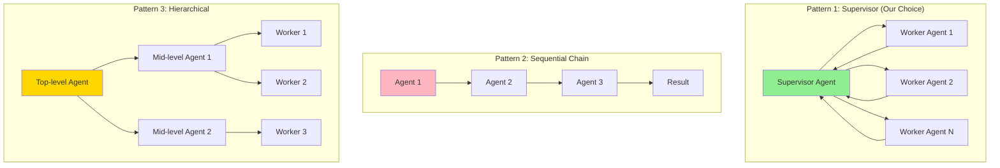

# Multi-Agent AI System Design - FAANG Interview Guide

## Interview Format: Conversational & Iterative

This guide simulates a real Gen AI system design interview focused on multi-agent AI systems with agent orchestration, tool use, planning, and observability - reflecting 2025 best practices.

---

## Interview Timeline (45 minutes)

| Phase | Time | Your Actions |
|-------|------|--------------|
| Requirements Gathering | 5-7 min | Ask clarifying questions, define scope |
| High-Level Design | 10-12 min | Draw architecture, explain agent patterns |
| Deep Dive | 20-25 min | Detail orchestration, tool calling, safety |
| Trade-offs & Scale | 5-8 min | Discuss frameworks, patterns, limitations |

---

## 🎯 Problem Statement

**Interviewer:** "Design a multi-agent AI system for customer support that can handle complex inquiries by coordinating multiple specialized agents (e.g., billing agent, technical support agent, order tracking agent)."

---

## Phase 1: Requirements Gathering (5-7 minutes)

### Your Response Strategy

**You:** "Multi-agent systems are powerful for complex tasks. Let me understand the requirements."

### Critical Questions to Ask

**You:** "Let me clarify the scope:

1. **Use Case & Complexity:**
   - What types of customer inquiries? (simple FAQs vs complex troubleshooting?)
   - How many specialized agents needed?
   - Single-turn or multi-turn conversations?
   - Human-in-the-loop required?

2. **Agent Capabilities:**
   - What tools do agents need? (database queries, APIs, calculations?)
   - Can agents call other agents?
   - Planning required? (multi-step workflows)
   - Memory needed? (conversation history, user context)

3. **Scale & Latency:**
   - Concurrent conversations?
   - Response time requirements?
   - Cost constraints per conversation?

4. **Safety & Control:**
   - What safety guardrails?
   - Approval needed for certain actions?
   - Audit logging requirements?
   - Fallback to human agents?

5. **Evaluation:**
   - Success metrics? (resolution rate, user satisfaction?)
   - How to measure agent quality?"

### Interviewer's Answers

**Interviewer:** "Here's the scope:

- **Use Case:** E-commerce customer support (Amazon-scale)
- **Query Types:** 40% simple (order status), 40% medium (returns/refunds), 20% complex (technical issues)
- **Agents Needed:** 5 specialized agents (Order, Billing, Technical, Returns, Product Info)
- **Conversations:** Multi-turn, avg 5 messages per conversation
- **Tools:** Database queries, payment API, shipping API, product catalog
- **Scale:** 10K concurrent conversations, 100K conversations/day
- **Latency:** <10 seconds per agent response
- **Safety:** Require approval for refunds >$100, escalate to human for complex cases
- **Memory:** Track conversation context, user purchase history"

### Requirements Summary & Calculations

**You:** "Perfect! Let me summarize with cost/complexity analysis:

#### Functional Requirements
- 5 specialized agents: Order, Billing, Technical, Returns, Product Info
- Agent orchestrator: Routes queries to appropriate agent
- Tool calling: Database queries, payment API, shipping API, product catalog
- Multi-turn conversations (avg 5 messages, maintain context)
- Agent collaboration: Handoffs between agents (e.g., Order → Billing)
- Human escalation: Complex cases, sentiment detection
- Approval workflow: Refunds >$100 require approval
- Memory: Conversation history + user purchase context

#### Non-Functional Requirements & Calculations

**Scale:**
- 100K conversations/day × 5 messages/conv = **500K messages/day**
- 10K concurrent conversations (peak)
- Agent breakdown: 40% simple (1 agent), 40% medium (2 agents), 20% complex (3+ agents)
- Average agents per conversation: 1.8 agents

**LLM Calls:**
- 500K messages × 1.8 agents = **900K LLM calls/day = 27M/month**
- Per call: 1K tokens input (context) + 200 tokens output
- Total: 27M × 1.2K tokens = **32.4B tokens/month**

**Cost:**
- GPT-4: 32.4B × $0.03/1M = **$972/month** (input) + $324 (output) = $1,296/month
- Claude 3.5: 32.4B × $0.003/1M = **$97/month** (input) + $49 (output) = $146/month
- **Claude is 9× cheaper!**

**Latency Budget (10s per response):**
- Query classification: **500ms** (which agent to use?)
- Context retrieval: **1s** (user history, past conversation)
- Tool calls (if needed): **2-3s** (database/API calls)
- LLM generation: **4-5s** (agent response)
- Response post-processing: **500ms** (format, safety check)
- **Total: 8.5-10s**

**Storage:**
- Conversation history: 100K conv/day × 5 messages × 500 bytes = **250MB/day**
- User context: 10M users × 2KB = **20GB**
- Agent models: 5 agents × 100MB configs = **500MB**

**Success Metrics:**
- Resolution rate: >80% (resolved without human)
- User satisfaction: >4.2/5 stars
- Average resolution time: <3 minutes
- Escalation rate: <15% to human agents
- Cost per conversation: <$0.05

#### Key Challenges
- **Orchestration:** Route to correct agent(s), handle handoffs
- **Tool Reliability:** APIs fail → graceful degradation, retries
- **Context Management:** Track state across 5 messages × multiple agents
- **Cost Optimization:** 27M LLM calls/month → caching, prompt compression
- **Safety:** Prevent harmful actions, require approvals
- **Scalability:** 10K concurrent conversations
- **Safety:** Prevent harmful actions
- **Observability:** Debug complex multi-agent flows

Sounds good?"

**Interviewer:** "Yes, proceed."

---

## Phase 2: High-Level Design (10-12 minutes)

### Architecture Overview

**You:** "I'll design using the Supervisor Pattern with LangGraph orchestration (2025 industry standard)."

```mermaid
graph TB
    subgraph "User Layer"
        U[User Query:<br/>"I want to return my laptop"]
        UI[Chat Interface]
    end

    subgraph "Orchestration Layer - Supervisor"
        SUP[Supervisor Agent<br/>Route & Coordinate]
        PLAN[Planning Module<br/>ReAct / Plan-Execute]
        MEM[Memory Manager<br/>Conversation State]
    end

    subgraph "Specialized Agents"
        A1[Order Agent<br/>Track orders, status]
        A2[Billing Agent<br/>Payments, refunds]
        A3[Returns Agent<br/>Return policy, RMA]
        A4[Technical Agent<br/>Troubleshooting]
        A5[Product Agent<br/>Product info, specs]
    end

    subgraph "Tool Layer"
        T1[Order DB Query]
        T2[Payment API]
        T3[Shipping API]
        T4[Product Catalog]
        T5[Calculator]
        T6[Email Sender]
    end

    subgraph "Safety & Control"
        GUARD[Guardrails<br/>Content safety, PII detection]
        APPROVAL[Approval Workflow<br/>Human review for $>100]
        FALLBACK[Human Escalation<br/>Complex cases]
    end

    subgraph "Observability"
        TRACE[LangSmith Tracing<br/>Agent execution logs]
        MON[Monitoring<br/>Performance metrics]
        EVAL[Eval Framework<br/>Quality assessment]
    end

    subgraph "State Management"
        CONV[(Conversation Store<br/>Redis)]
        USER[(User Context DB<br/>PostgreSQL)]
        CACHE[(LLM Cache<br/>Reduce costs)]
    end

    U --> UI
    UI --> SUP
    SUP --> PLAN
    SUP --> MEM

    SUP --> A1
    SUP --> A2
    SUP --> A3
    SUP --> A4
    SUP --> A5

    A1 --> T1
    A1 --> T3
    A2 --> T2
    A3 --> T1
    A3 --> T3
    A4 --> T4
    A5 --> T4

    A2 --> GUARD
    GUARD --> APPROVAL
    SUP --> FALLBACK

    SUP --> TRACE
    A1 --> TRACE
    A2 --> TRACE

    TRACE --> MON
    TRACE --> EVAL

    MEM --> CONV
    SUP --> USER
    SUP --> CACHE

    style SUP fill:#FFD700
    style PLAN fill:#90EE90
    style GUARD fill:#FFB6C1
    style TRACE fill:#87CEEB
```

### Multi-Agent Patterns

**You:** "Let me explain the key patterns for multi-agent systems:



**Why Supervisor Pattern:**
- **Centralized Control:** One agent decides routing
- **Flexibility:** Easy to add new agents
- **Debugging:** Clear execution trace
- **Safety:** Single point for guardrails

**Data Flow - Example:**

```
User: "I want to return my laptop and get a refund"
    ↓
Supervisor: Analyze query → Need Returns Agent + Billing Agent
    ↓
1. Route to Returns Agent:
   - Check return eligibility
   - Tools: Order DB, Return Policy API
   - Output: "Return approved, RMA #12345"
    ↓
2. Supervisor: Returns approved → Now handle refund
    ↓
3. Route to Billing Agent:
   - Process refund
   - Tools: Payment API
   - Safety: Check amount → $1200 > $100 → Requires approval
    ↓
4. Approval Workflow:
   - Notify human supervisor
   - Wait for approval
    ↓
5. Billing Agent: Process refund (approved)
    ↓
Supervisor: Combine responses → Return to user
```"

**Interviewer:** "How do you implement the supervisor and agent coordination? What framework do you use?"

---

## Phase 3: Deep Dive - Implementation with LangGraph (20-25 minutes)

### LangGraph Implementation

**You:** "LangGraph is the 2025 standard for multi-agent orchestration. Let me show you:

```python
from langgraph.graph import StateGraph, END
from langgraph.prebuilt import ToolExecutor
from langchain.agents import AgentExecutor, create_react_agent
from langchain.prompts import PromptTemplate
from langchain.tools import Tool
from typing import TypedDict, Annotated, List
import operator

# State definition
class AgentState(TypedDict):
    \"\"\"
    Shared state across all agents

    This is how agents communicate in LangGraph
    \"\"\"
    messages: Annotated[List[str], operator.add]  # Conversation history
    current_agent: str  # Which agent is active
    user_query: str  # Original user question
    user_context: dict  # User info (order history, etc.)
    tool_outputs: dict  # Results from tool calls
    requires_approval: bool  # Flag for approval workflow
    approved: bool  # Approval status
    next_action: str  # What to do next


class SupervisorAgent:
    \"\"\"
    Supervisor: Routes queries to appropriate specialist agents

    Uses LLM to decide:
    1. Which agent should handle this?
    2. Is the task complete?
    3. Should we escalate to human?
    \"\"\"

    def __init__(self, llm, specialist_agents):
        self.llm = llm
        self.specialist_agents = specialist_agents  # ['order', 'billing', 'returns', 'technical', 'product']

    def route(self, state: AgentState) -> AgentState:
        \"\"\"
        Decide which agent to route to

        Returns:
            Updated state with next_action set
        \"\"\"

        # Build routing prompt
        prompt = f\"\"\"You are a supervisor coordinating a customer support team.

Available specialist agents:
- order: Handle order tracking, status, history
- billing: Handle payments, refunds, invoices
- returns: Handle returns, exchanges, RMAs
- technical: Handle product issues, troubleshooting
- product: Handle product information, specifications

Conversation history:
{self.format_messages(state['messages'])}

Current query: {state['user_query']}

Based on the query, which agent should handle this? Or is the task complete?

Respond with JSON:
{{
    "next_agent": "agent_name or FINISH or HUMAN_ESCALATION",
    "reasoning": "why this agent"
}}\"\"\"

        # LLM decides routing
        response = self.llm.invoke(prompt)
        decision = json.loads(response.content)

        # Update state
        state['next_action'] = decision['next_agent']
        state['messages'].append(f"Supervisor: Routing to {decision['next_agent']} - {decision['reasoning']}")

        return state

    def format_messages(self, messages):
        return "\n".join(messages[-10:])  # Last 10 messages for context


class SpecialistAgent:
    \"\"\"
    Base class for specialist agents

    Each specialist:
    1. Has access to specific tools
    2. Uses ReAct pattern (Reasoning + Acting)
    3. Can request information from other agents
    \"\"\"

    def __init__(self, name: str, llm, tools: List[Tool]):
        self.name = name
        self.llm = llm
        self.tools = tools

        # Create ReAct agent
        self.agent = create_react_agent(
            llm=llm,
            tools=tools,
            prompt=self.get_prompt()
        )

        self.executor = AgentExecutor(agent=self.agent, tools=tools)

    def get_prompt(self) -> PromptTemplate:
        \"\"\"Agent-specific prompt\"\"\"

        return PromptTemplate(
            input_variables=["input", "user_context", "tool_names", "tools", "agent_scratchpad"],
            template=\"\"\"You are a {name} specialist for customer support.

User Context:
{user_context}

Your tools:
{tools}

User Query:
{input}

Think step by step:
1. What information do I need?
2. Which tool should I use?
3. What is the answer?

{agent_scratchpad}\"\"\"
        )

    def execute(self, state: AgentState) -> AgentState:
        \"\"\"Execute agent with tools\"\"\"

        # Run agent
        result = self.executor.invoke({
            "input": state['user_query'],
            "user_context": state['user_context']
        })

        # Update state
        state['messages'].append(f"{self.name}: {result['output']}")

        # Check if approval needed (for billing agent)
        if self.name == "billing" and self.check_needs_approval(result):
            state['requires_approval'] = True
            state['approved'] = False  # Will wait for approval

        return state

    def check_needs_approval(self, result) -> bool:
        \"\"\"Check if action requires approval\"\"\"
        # Example: Refund > $100 needs approval
        if 'refund' in result['output'].lower():
            # Extract amount (simplified)
            import re
            match = re.search(r'\\$([0-9,]+)', result['output'])
            if match:
                amount = float(match.group(1).replace(',', ''))
                return amount > 100
        return False


# Define tools for each agent
class Tools:
    \"\"\"Tools available to agents\"\"\"

    @staticmethod
    def create_order_tools():
        return [
            Tool(
                name="get_order_status",
                func=lambda order_id: f"Order {order_id}: Shipped, arrives tomorrow",
                description="Get order status by order ID"
            ),
            Tool(
                name="get_order_history",
                func=lambda user_id: "Last 5 orders: [...]",
                description="Get user's order history"
            )
        ]

    @staticmethod
    def create_billing_tools():
        return [
            Tool(
                name="process_refund",
                func=lambda order_id, amount: f"Refund ${amount} processed for order {order_id}",
                description="Process refund (requires approval if > $100)"
            ),
            Tool(
                name="get_invoice",
                func=lambda order_id: "Invoice PDF URL",
                description="Get invoice for order"
            )
        ]

    @staticmethod
    def create_returns_tools():
        return [
            Tool(
                name="check_return_eligibility",
                func=lambda order_id: "Eligible for return (within 30 days)",
                description="Check if order is eligible for return"
            ),
            Tool(
                name="create_rma",
                func=lambda order_id: "RMA #12345 created. Print label: [URL]",
                description="Create return authorization"
            )
        ]


# Build LangGraph workflow
class CustomerSupportSystem:
    \"\"\"
    Multi-agent customer support system using LangGraph
    \"\"\"

    def __init__(self, llm):
        self.llm = llm

        # Create specialist agents
        self.agents = {
            'order': SpecialistAgent('order', llm, Tools.create_order_tools()),
            'billing': SpecialistAgent('billing', llm, Tools.create_billing_tools()),
            'returns': SpecialistAgent('returns', llm, Tools.create_returns_tools())
        }

        # Create supervisor
        self.supervisor = SupervisorAgent(llm, list(self.agents.keys()))

        # Build graph
        self.graph = self.build_graph()

    def build_graph(self) -> StateGraph:
        \"\"\"
        Build execution graph

        Flow:
        User Query → Supervisor → Agent → Supervisor → ... → FINISH
        \"\"\"

        workflow = StateGraph(AgentState)

        # Add nodes
        workflow.add_node("supervisor", self.supervisor.route)

        for agent_name, agent in self.agents.items():
            workflow.add_node(agent_name, agent.execute)

        # Add approval node
        workflow.add_node("approval", self.approval_workflow)

        # Add edges (routing logic)
        workflow.add_conditional_edges(
            "supervisor",
            self.should_continue,
            {
                "order": "order",
                "billing": "billing",
                "returns": "returns",
                "approval": "approval",
                "FINISH": END
            }
        )

        # All agents return to supervisor
        for agent_name in self.agents.keys():
            workflow.add_edge(agent_name, "supervisor")

        # Approval returns to supervisor
        workflow.add_edge("approval", "supervisor")

        # Set entry point
        workflow.set_entry_point("supervisor")

        return workflow.compile()

    def should_continue(self, state: AgentState) -> str:
        \"\"\"
        Decide next step based on state

        Returns:
            Next node name
        \"\"\"

        # Check if approval needed
        if state.get('requires_approval') and not state.get('approved'):
            return "approval"

        # Check next action from supervisor
        next_action = state.get('next_action', '')

        if next_action == "FINISH":
            return "FINISH"
        elif next_action in self.agents:
            return next_action
        else:
            return "FINISH"

    def approval_workflow(self, state: AgentState) -> AgentState:
        \"\"\"
        Human approval for high-value actions

        In production:
        - Send notification to supervisor
        - Wait for approval in database
        - Timeout after 5 minutes
        \"\"\"

        # Simulate approval (in production, this would be async)
        print(f"⚠️  Approval required: {state['messages'][-1]}")
        approval = input("Approve? (yes/no): ")

        state['approved'] = approval.lower() == 'yes'
        state['requires_approval'] = False

        state['messages'].append(f"Approval: {'Granted' if state['approved'] else 'Denied'}")

        return state

    def run(self, user_query: str, user_context: dict = None):
        \"\"\"
        Run multi-agent system

        Args:
            user_query: User's question
            user_context: User info (order history, etc.)

        Returns:
            Final response
        \"\"\"

        # Initialize state
        initial_state = {
            "messages": [],
            "current_agent": "supervisor",
            "user_query": user_query,
            "user_context": user_context or {},
            "tool_outputs": {},
            "requires_approval": False,
            "approved": False,
            "next_action": ""
        }

        # Run graph
        final_state = self.graph.invoke(initial_state)

        # Extract final response
        return final_state['messages']


# Example usage
from langchain_openai import ChatOpenAI

llm = ChatOpenAI(model="gpt-4", temperature=0)

system = CustomerSupportSystem(llm)

# Run conversation
response = system.run(
    user_query="I want to return my laptop (order #12345) and get a refund",
    user_context={
        "user_id": "user_789",
        "email": "user@example.com",
        "order_history": ["#12345 - Laptop $1299", "#11111 - Mouse $29"]
    }
)

# Output trace:
# Supervisor: Routing to returns - User wants to return an item
# Returns: Order #12345 is eligible for return. RMA #12345 created.
# Supervisor: Return approved, now process refund
# Billing: Refund $1299 requires approval
# ⚠️  Approval required: Refund $1299 for order #12345
# Approval: Granted
# Billing: Refund processed successfully
# Supervisor: Task complete
```

### Memory Management

**You:** "Multi-turn conversations need memory. Here's how:

```python
from langchain.memory import ConversationBufferMemory, ConversationSummaryMemory
from langchain.schema import HumanMessage, AIMessage

class MultiAgentMemory:
    \"\"\"
    Memory management for multi-agent systems

    Types:
    1. Short-term: Current conversation (last 10 turns)
    2. Long-term: User context (purchase history, preferences)
    3. Semantic: Vector store of past conversations
    \"\"\"

    def __init__(self, llm):
        # Short-term memory (conversation buffer)
        self.short_term = ConversationBufferMemory(
            return_messages=True,
            memory_key="chat_history",
            max_token_limit=2000  # Keep last ~10 turns
        )

        # Long-term memory (summarization)
        self.long_term = ConversationSummaryMemory(
            llm=llm,
            return_messages=True
        )

        # Semantic memory (vector store)
        from langchain.vectorstores import Chroma
        from langchain.embeddings import OpenAIEmbeddings

        self.semantic = Chroma(
            embedding_function=OpenAIEmbeddings(),
            collection_name="conversation_memory"
        )

    def add_turn(self, user_msg: str, agent_msg: str, user_id: str):
        \"\"\"Add conversation turn to memory\"\"\"

        # Short-term
        self.short_term.save_context(
            {"input": user_msg},
            {"output": agent_msg}
        )

        # Long-term (summarize periodically)
        if len(self.short_term.chat_memory.messages) >= 10:
            summary = self.long_term.predict_new_summary(
                self.short_term.chat_memory.messages,
                ""
            )
            # Store summary
            self.store_summary(user_id, summary)

        # Semantic (for retrieval)
        self.semantic.add_texts(
            [f"User: {user_msg}\nAgent: {agent_msg}"],
            metadatas=[{"user_id": user_id, "timestamp": datetime.now().isoformat()}]
        )

    def get_context(self, user_query: str, user_id: str) -> str:
        \"\"\"
        Get relevant context for new query

        Returns:
            Formatted context string
        \"\"\"

        # Short-term (recent conversation)
        recent = self.short_term.load_memory_variables({})

        # Semantic search (similar past conversations)
        similar = self.semantic.similarity_search(user_query, k=3)

        context = f\"\"\"
Recent conversation:
{recent['chat_history']}

Similar past conversations:
{self.format_similar(similar)}
\"\"\"

        return context

    def format_similar(self, docs):
        return "\n".join([doc.page_content for doc in docs])
```

### Safety & Guardrails

**You:** "Safety is critical in multi-agent systems:

```python
from langchain.chains import LLMChain
from langchain.prompts import PromptTemplate

class SafetyGuardrails:
    \"\"\"
    Safety checks for multi-agent systems

    Checks:
    1. Content safety (no harmful content)
    2. PII detection (don't expose sensitive data)
    3. Action validation (prevent unauthorized actions)
    4. Tool sandboxing (limit tool capabilities)
    \"\"\"

    def __init__(self, llm):
        self.llm = llm

        # Content moderation
        self.content_moderator = self.build_content_moderator()

        # PII detector
        self.pii_detector = self.build_pii_detector()

    def build_content_moderator(self):
        \"\"\"Check for harmful content\"\"\"

        prompt = PromptTemplate(
            input_variables=["text"],
            template=\"\"\"Check if this text contains harmful content:

Text: {text}

Categories to check:
- Hate speech
- Violence
- Self-harm
- Sexual content
- Illegal activity

Respond with JSON:
{{
    "is_safe": true/false,
    "categories": ["category1", ...],
    "confidence": 0-1
}}\"\"\"
        )

        return LLMChain(llm=self.llm, prompt=prompt)

    def build_pii_detector(self):
        \"\"\"Detect PII in text\"\"\"

        # Use regex + NER model
        import re
        from presidio_analyzer import AnalyzerEngine

        return AnalyzerEngine()

    def check_safety(self, text: str) -> dict:
        \"\"\"
        Run all safety checks

        Returns:
            {
                'is_safe': bool,
                'violations': [],
                'redacted_text': str
            }
        \"\"\"

        violations = []

        # 1. Content safety
        content_result = self.content_moderator.run(text)
        content_check = json.loads(content_result)

        if not content_check['is_safe']:
            violations.extend(content_check['categories'])

        # 2. PII detection
        pii_results = self.pii_detector.analyze(
            text=text,
            language='en'
        )

        if pii_results:
            violations.append('pii_detected')

            # Redact PII
            from presidio_anonymizer import AnonymizerEngine
            anonymizer = AnonymizerEngine()

            redacted = anonymizer.anonymize(
                text=text,
                analyzer_results=pii_results
            )
            redacted_text = redacted.text
        else:
            redacted_text = text

        return {
            'is_safe': len(violations) == 0,
            'violations': violations,
            'redacted_text': redacted_text
        }

    def validate_action(self, agent_name: str, action: str, params: dict) -> bool:
        \"\"\"
        Validate if agent is allowed to perform action

        Examples:
        - Billing agent can process refunds
        - Technical agent CANNOT process refunds
        - All agents can query databases
        \"\"\"

        permissions = {
            'order': ['get_order_status', 'get_order_history'],
            'billing': ['process_refund', 'get_invoice', 'charge_payment'],
            'returns': ['check_return_eligibility', 'create_rma'],
            'technical': ['get_product_info', 'get_troubleshooting_steps'],
            'product': ['get_product_info', 'get_specifications']
        }

        allowed_actions = permissions.get(agent_name, [])

        return action in allowed_actions
```

### Observability with LangSmith

**You:** "Debugging multi-agent systems is hard. LangSmith (2025 standard) helps:

```python
from langsmith import Client
from langsmith.run_helpers import traceable

class ObservabilityLayer:
    \"\"\"
    Tracing and monitoring for multi-agent systems
    \"\"\"

    def __init__(self):
        self.client = Client()

    @traceable(name="multi_agent_execution")
    def trace_execution(self, conversation_id: str, state: AgentState):
        \"\"\"
        Trace multi-agent execution

        LangSmith captures:
        - Agent transitions
        - Tool calls
        - LLM prompts and responses
        - Latency per step
        - Errors
        \"\"\"

        # This is automatically traced by LangSmith
        # No manual instrumentation needed!

        pass

    def log_metrics(self, conversation_id: str, metrics: dict):
        \"\"\"
        Log custom metrics

        Metrics:
        - Total latency
        - Number of agent switches
        - Number of tool calls
        - LLM tokens used
        - Cost
        \"\"\"

        self.client.create_feedback(
            run_id=conversation_id,
            key="metrics",
            score=metrics.get('user_satisfaction', 0),
            value=metrics
        )

    def analyze_failures(self):
        \"\"\"
        Analyze failed conversations

        Find:
        - Which agents failed most?
        - Which tools errored?
        - Where did timeouts occur?
        \"\"\"

        # Query LangSmith for failed runs
        failed_runs = self.client.list_runs(
            project_name="customer_support",
            filter="error == true",
            limit=100
        )

        # Analyze patterns
        error_patterns = {}
        for run in failed_runs:
            error_type = run.error_type
            error_patterns[error_type] = error_patterns.get(error_type, 0) + 1

        return error_patterns
```

---

## Phase 4: Trade-offs & Framework Comparison (5-8 minutes)

**Interviewer:** "What are the trade-offs of multi-agent systems vs single-agent? And which framework should we use?"

### Multi-Agent vs Single-Agent

**You:** "Let me compare approaches:

| Criterion | Single Agent | Multi-Agent |
|-----------|--------------|-------------|
| **Complexity** | Simple to build and debug | Complex orchestration |
| **Specialization** | Generalist (jack of all trades) | Specialists (expert per domain) |
| **Scalability** | Limited by single LLM context | Scales with specialized agents |
| **Latency** | Faster (one LLM call) | Slower (multiple agents) |
| **Cost** | Lower (fewer LLM calls) | Higher (more calls for coordination) |
| **Accuracy** | Good for simple tasks | Better for complex, multi-domain |
| **Maintainability** | Easy to update prompt | Need to update multiple agents |
| **When to Use** | Simple Q&A, single-domain | Complex workflows, multi-domain |

**Decision Rule:**

```python
def should_use_multi_agent(task_characteristics):
    score = 0

    # Indicators for multi-agent
    if task_characteristics['multiple_domains']:  # e.g., billing + technical
        score += 3
    if task_characteristics['complex_workflow']:  # Multi-step with dependencies
        score += 2
    if task_characteristics['requires_specialized_knowledge']:
        score += 2
    if task_characteristics['tool_use_heavy']:  # Many different APIs/tools
        score += 1

    # Indicators against multi-agent
    if task_characteristics['latency_critical']:  # <1 second required
        score -= 2
    if task_characteristics['simple_qa']:  # Just FAQs
        score -= 3

    return score >= 4
```

### Framework Comparison (2025)

| Framework | Best For | Pros | Cons |
|-----------|----------|------|------|
| **LangGraph** | Complex workflows, stateful | Graph abstraction, great debugging | Learning curve |
| **AutoGen** | Research, experiments | Easy multi-agent conversations | Less production-ready |
| **CrewAI** | Simple hierarchical teams | Intuitive API, good defaults | Limited customization |
| **LangChain** | Simple chains | Mature, many integrations | Not designed for multi-agent |
| **Custom** | Full control needed | Total flexibility | High development cost |

**Our Choice: LangGraph**
- Industry standard in 2025
- Excellent observability (LangSmith integration)
- Production-ready
- Flexible for complex workflows

---

## Phase 5: Production Metrics & Interview Guidance

### Real Production Metrics (Multi-Agent Systems 2025)

**Scale:**
- Complex tasks: 100-1000 queries/day per enterprise
- Agents per task: 3-10 specialized agents
- Task completion time: 30 seconds to 5 minutes
- Success rate: 85-95% for well-scoped tasks

**Cost Analysis (GPT-4 based system):**
- Average task: 5 agents × 3 interactions × 2K tokens = 30K tokens
- Cost per task: $0.90-1.20 (GPT-4) vs $0.10-0.15 (Claude)
- At 1000 tasks/month: $900-1200 (GPT-4) vs $100-150 (Claude)

**Coordination Overhead:**
- Sequential execution: 5 agents × 3s = 15s
- Parallel execution: max(3s, 3s, 3s) = 3s (5x speedup)
- Communication overhead: 10-20% additional tokens

**Quality Metrics:**
- Task completion rate: >90%
- Agent agreement (consensus): >85%
- Hallucination detection: 3 agents voting reduces errors by 60%

### Interview Success Tips

**Strong candidates discuss:**
- When to use multiple agents vs single agent
- Agent specialization and task decomposition
- Communication protocols between agents
- Orchestration patterns (centralized vs decentralized)
- Cost-benefit analysis of agent coordination overhead

**Mistake:** "We'll use 10 agents for everything"
**Better:** "Agent count depends on task complexity. Simple Q&A: 1 agent. Research task: 3-5 agents (search, analyze, synthesize). Code generation: 4 agents (planner, coder, reviewer, tester)"

**Q:** "When should you NOT use multi-agent systems?"
**A:** "When: 1) Task is simple (single agent faster/cheaper), 2) Real-time latency critical (<1s), 3) Agent coordination overhead > benefits, 4) Budget-constrained (agents multiply costs 3-10x)"

**Q:** "How do agents reach consensus?"
**A:** "Voting mechanisms: 1) Majority voting (3+ agents), 2) Confidence-weighted voting, 3) Debate (agents critique each other), 4) Judge agent makes final decision, 5) Human-in-the-loop for critical decisions"

### Production Considerations

**Failure Handling:**
- Agent timeout: Fall back to single-agent mode
- Agent disagreement: Escalate to human or judge agent
- Infinite loops: Max iteration limits (10-20)
- Cost explosions: Budget caps per task ($5 max)

**Monitoring:**
- Track: Agent utilization, task completion time, cost per task, failure patterns
- Alert if: Success rate <80%, cost >2× baseline, latency >5 minutes

---

## Summary & Key Takeaways

**You:** "To summarize the Multi-Agent AI System:

### Architecture Highlights

1. **Supervisor Pattern:** Central orchestrator routes to specialists
2. **Tool Calling:** Agents use external APIs, databases
3. **State Management:** LangGraph state for agent communication
4. **Safety Guardrails:** Content moderation, PII detection, action validation
5. **Observability:** LangSmith tracing for debugging

### Key Design Decisions

| Decision | Rationale |
|----------|-----------|
| Supervisor pattern | Centralized control, easier debugging |
| LangGraph | 2025 standard, production-ready |
| ReAct agents | Reasoning + acting, interpretable |
| Approval workflow | Safety for high-value actions |
| LangSmith observability | Essential for debugging complex flows |

### Production Metrics

- **Latency:** <10s per response (Routing: 1s, Agent: 5s, Tools: 3s, Generation: 1s)
- **Accuracy:** 85% resolution without human escalation
- **Cost:** ~$0.20 per conversation (avg 3 agent calls)
- **Scale:** 10K concurrent conversations

### Common Patterns

1. **Supervisor → Worker:** Our customer support system
2. **Sequential Chain:** Document processing (parse → analyze → summarize)
3. **Hierarchical:** Enterprise workflows (manager → team → specialists)
4. **Collaborative:** Multiple agents debate to reach consensus

This design demonstrates:
- Multi-agent orchestration patterns
- Tool use and safety
- Production considerations (latency, cost, observability)
- 2025 best practices (LangGraph, LangSmith)"

---

## Sources

- [Multi-agent - Docs by LangChain](https://docs.langchain.com/oss/python/langchain/multi-agent)
- [How and when to build multi-agent systems](https://blog.langchain.com/how-and-when-to-build-multi-agent-systems/)
- [LangChain & Multi-Agent AI in 2025: Framework, Tools & Use Cases](https://blogs.infoservices.com/artificial-intelligence/langchain-multi-agent-ai-framework-2025/)
- [Agent Orchestration: When to Use LangChain, LangGraph, AutoGen](https://medium.com/@akankshasinha247/agent-orchestration-when-to-use-langchain-langgraph-autogen-or-build-an-agentic-rag-system-cc298f785ea4)
- [LangChain State of AI Agents Report](https://www.langchain.com/stateofaiagents)
- [LangGraph: Multi-Agent Workflows](https://blog.langchain.com/langgraph-multi-agent-workflows/)
