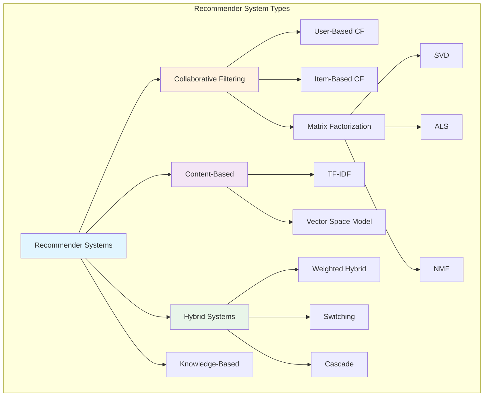
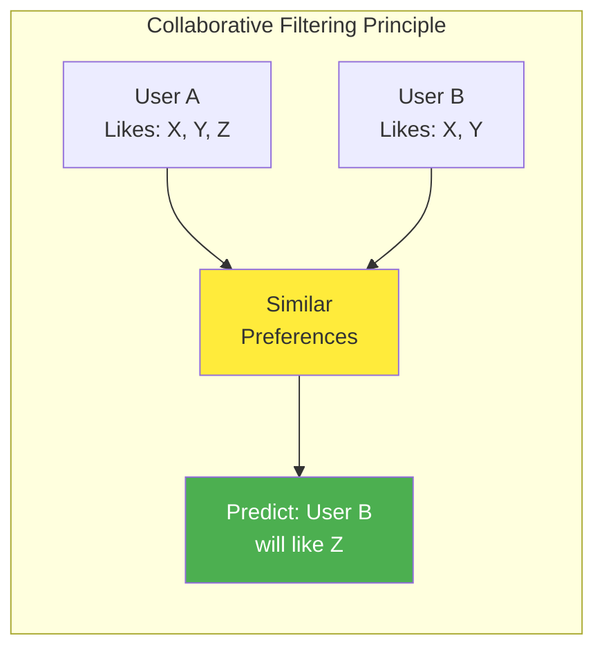
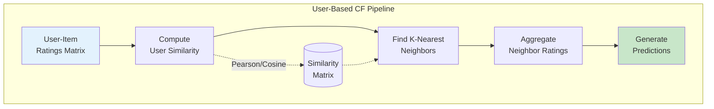
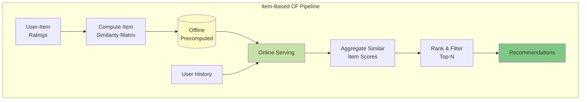
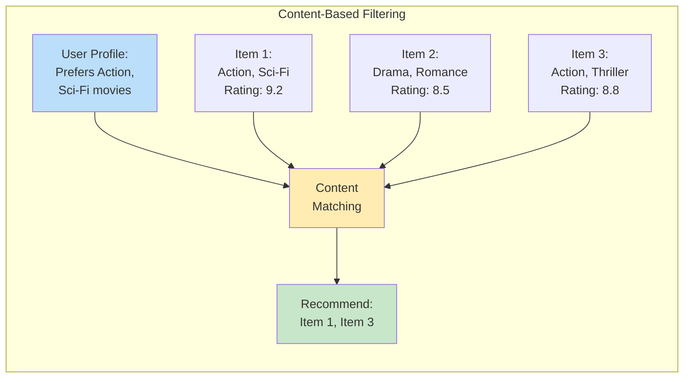
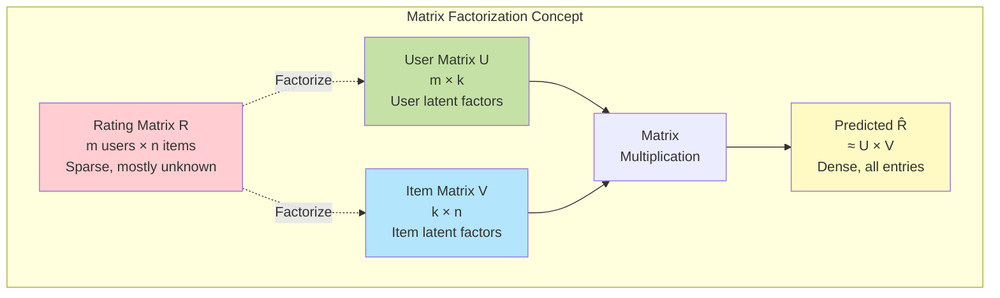
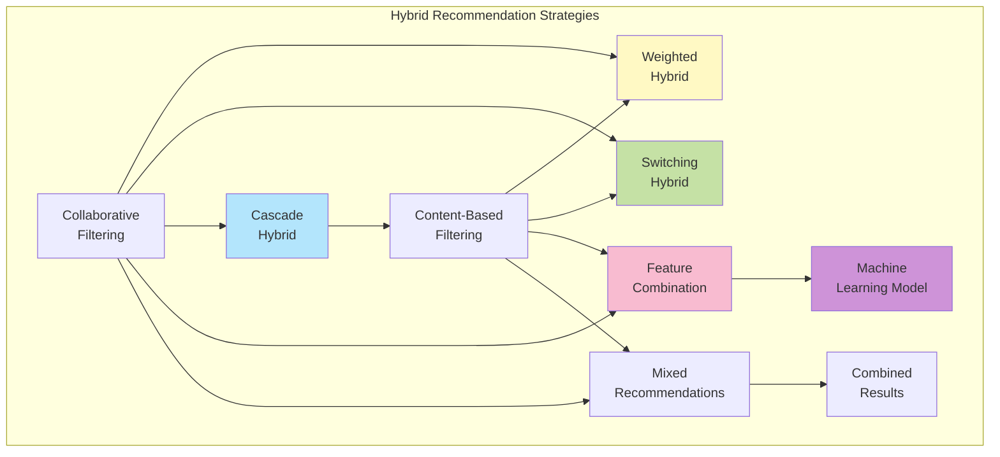
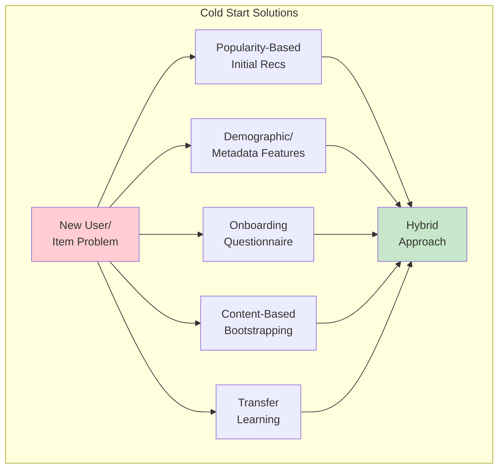

# Recommender Systems: Fundamentals & Classical Approaches

> Comprehensive guide covering classical recommendation algorithms from basic concepts to production-ready implementations.

**Part 1 of 3** | [Deep Learning →](09-recommender-system-deep-learning.md) | [Production →](10-recommender-system-production.md)

## Table of Contents

1. [Introduction](#introduction)
2. [Problem Formulation](#problem-formulation)
3. [Collaborative Filtering](#collaborative-filtering)
4. [Content-Based Filtering](#content-based-filtering)
5. [Matrix Factorization](#matrix-factorization)
6. [Hybrid Approaches](#hybrid-approaches)
7. [Implementation Examples](#implementation-examples)
8. [Challenges & Solutions](#challenges-solutions)

---

## Introduction

### What is a Recommender System?

A **recommender system** predicts user preferences for items (products, movies, music, etc.) by analyzing patterns in user behavior and item characteristics. These systems power personalization at scale across e-commerce, streaming, social media, and content platforms.

### Business Impact

- **Netflix**: Saves $1B+ annually through reduced churn
- **Amazon**: 35% of sales driven by recommendations
- **YouTube**: 70% of watch time from recommendations
- **Spotify**: Drives discovery and engagement

### Types of Recommendation Systems



---

## Problem Formulation

### Notation

| Symbol | Description |
|--------|-------------|
| $U$ | Set of users: $U = \{u_1, u_2, ..., u_m\}$ |
| $I$ | Set of items: $I = \{i_1, i_2, ..., i_n\}$ |
| $R$ | User-item interaction matrix ($m \times n$) |
| $r_{ui}$ | Rating/interaction of user $u$ for item $i$ |
| $\hat{r}_{ui}$ | Predicted rating for user $u$ and item $i$ |
| $N(u)$ | Neighborhood of user $u$ |
| $sim(u, v)$ | Similarity between users $u$ and $v$ |

### Interaction Matrix

The core data structure is the **user-item interaction matrix** $R$:

$$
R = \begin{bmatrix}
r_{11} & r_{12} & \cdots & r_{1n} \\
r_{21} & r_{22} & \cdots & r_{2n} \\
\vdots & \vdots & \ddots & \vdots \\
r_{m1} & r_{m2} & \cdots & r_{mn}
\end{bmatrix}
$$

**Characteristics:**
- **Sparse**: Only 1-5% of entries are typically known
- **Implicit vs Explicit**: Ratings (explicit) vs clicks/views (implicit)
- **Scale**: Millions of users × millions of items

### Objective

**Goal**: Learn a function $f: U \times I \rightarrow \mathbb{R}$ that predicts:

$$
\hat{r}_{ui} = f(u, i | \theta)
$$

Where $\theta$ represents model parameters optimized to minimize prediction error.

---

## Collaborative Filtering

### Overview

**Collaborative Filtering (CF)** makes predictions based on the principle that **users who agreed in the past will agree in the future**.



### User-Based Collaborative Filtering

**Intuition**: Find users similar to the target user and recommend items they liked.

#### Algorithm Steps

1. **Compute User Similarity**
   $$
   sim(u, v) = \frac{\sum_{i \in I_{uv}} (r_{ui} - \bar{r}_u)(r_{vi} - \bar{r}_v)}{\sqrt{\sum_{i \in I_{uv}} (r_{ui} - \bar{r}_u)^2} \sqrt{\sum_{i \in I_{uv}} (r_{vi} - \bar{r}_v)^2}}
   $$

   > [!NOTE]
   > **Deep Dive: Similarity Measures**
   > *   **Cosine Similarity**: Measures the angle between vectors. Good for high-dimensional sparse data but doesn't account for user rating bias (some users rate everything 5 stars).
   > *   **Pearson Correlation**: (Shown above) Centers the data by subtracting the mean. This handles "strict" vs "lenient" raters better than Cosine.
   > *   **Jaccard Similarity**: Used for implicit data (binary likes). Measures intersection over union of liked items.

   Where $I_{uv}$ = items rated by both users $u$ and $v$

2. **Select k-Nearest Neighbors**
   $$
   N(u) = \{v \in U : v \neq u, |N(u)| = k\}
   $$

3. **Predict Rating**
   $$
   \hat{r}_{ui} = \bar{r}_u + \frac{\sum_{v \in N(u)} sim(u, v) \cdot (r_{vi} - \bar{r}_v)}{\sum_{v \in N(u)} |sim(u, v)|}
   $$

#### Architecture



#### Evaluation Strategies

Before implementing, it's crucial to understand how to evaluate. Random splitting (standard in ML) is often **wrong** for recommender systems because it leaks future information.

1.  **Random Split**: Randomly select 20% of ratings for test.
    *   *Flaw*: You might use a rating from 2024 to predict a rating from 2023.
2.  **Time-based Split (Leave-One-Out)**:
    *   Sort user actions by time.
    *   Train on everything up to time $T$.
    *   Test on the *last* interaction (or last $N$ interactions).
    *   *Why*: Simulates the real-world scenario of predicting the *next* action.

#### Implementation

```python
"""User-based collaborative filtering implementation."""

from typing import Dict, List, Tuple, Set
import numpy as np
from scipy.sparse import csr_matrix
from sklearn.metrics.pairwise import cosine_similarity

class UserBasedCF:
    """User-based collaborative filtering recommender.

    Predicts ratings based on similar users' preferences using
    k-nearest neighbors and weighted aggregation.

    Attributes:
        k: Number of nearest neighbors to consider
        min_support: Minimum number of common items for similarity
        similarity_matrix: Cached user similarity scores
    """

    def __init__(self, k: int = 20, min_support: int = 5) -> None:
        """Initialize user-based CF model.

        Args:
            k: Number of nearest neighbors
            min_support: Minimum common items required for similarity
        """
        self.k = k
        self.min_support = min_support
        self.similarity_matrix: np.ndarray = None
        self.user_means: np.ndarray = None
        self.ratings_matrix: csr_matrix = None

    def fit(self, ratings_matrix: np.ndarray) -> 'UserBasedCF':
        """Compute user similarity matrix from ratings.

        Args:
            ratings_matrix: User-item ratings matrix (m x n)
                           where 0 indicates no rating

        Returns:
            Self for method chaining
        """
        # Convert to sparse matrix for efficiency
        self.ratings_matrix = csr_matrix(ratings_matrix)

        # Compute user means (excluding zeros)
        mask = ratings_matrix > 0
        self.user_means = np.divide(
            np.sum(ratings_matrix, axis=1),
            np.sum(mask, axis=1),
            where=np.sum(mask, axis=1) > 0
        )

        # Center ratings (mean-centering)
        centered_ratings = ratings_matrix.copy()
        for i in range(len(centered_ratings)):
            centered_ratings[i, mask[i]] -= self.user_means[i]

        # Compute cosine similarity between users
        self.similarity_matrix = cosine_similarity(
            csr_matrix(centered_ratings),
            dense_output=True
        )

        # Set diagonal to 0 (user shouldn't be similar to themselves)
        np.fill_diagonal(self.similarity_matrix, 0)

        return self

    def predict(self, user_id: int, item_id: int) -> float:
        """Predict rating for user-item pair.

        Args:
            user_id: User index
            item_id: Item index

        Returns:
            Predicted rating score
        """
        # Get users who rated this item
        rated_mask = self.ratings_matrix[:, item_id].toarray().flatten() > 0

        if not np.any(rated_mask):
            return self.user_means[user_id]

        # Get similarity scores for users who rated the item
        similarities = self.similarity_matrix[user_id, rated_mask]

        # Get top-k most similar users
        top_k_indices = np.argsort(similarities)[-self.k:]
        top_k_similarities = similarities[top_k_indices]

        # Get their ratings (centered)
        neighbor_ratings = self.ratings_matrix[rated_mask, item_id].toarray().flatten()[top_k_indices]
        neighbor_means = self.user_means[rated_mask][top_k_indices]
        centered_ratings = neighbor_ratings - neighbor_means

        # Weighted average prediction
        if np.sum(np.abs(top_k_similarities)) == 0:
            return self.user_means[user_id]

        prediction = self.user_means[user_id] + \
                    np.sum(top_k_similarities * centered_ratings) / \
                    np.sum(np.abs(top_k_similarities))

        return prediction

    def recommend(
        self,
        user_id: int,
        n: int = 10,
        exclude_rated: bool = True
    ) -> List[Tuple[int, float]]:
        """Generate top-N recommendations for user.

        Args:
            user_id: User index
            n: Number of recommendations
            exclude_rated: Whether to exclude already-rated items

        Returns:
            List of (item_id, predicted_rating) tuples
        """
        # Get all items
        n_items = self.ratings_matrix.shape[1]

        # Predict ratings for all items
        predictions = []
        for item_id in range(n_items):
            if exclude_rated and self.ratings_matrix[user_id, item_id] > 0:
                continue

            pred_rating = self.predict(user_id, item_id)
            predictions.append((item_id, pred_rating))

        # Sort by predicted rating
        predictions.sort(key=lambda x: x[1], reverse=True)

        return predictions[:n]


def compute_pearson_similarity(
    ratings_matrix: np.ndarray,
    min_support: int = 5
) -> np.ndarray:
    """Compute Pearson correlation between users.

    Args:
        ratings_matrix: User-item ratings matrix
        min_support: Minimum common items required

    Returns:
        User similarity matrix
    """
    n_users = ratings_matrix.shape[0]
    similarity = np.zeros((n_users, n_users))

    for i in range(n_users):
        for j in range(i + 1, n_users):
            # Find common rated items
            mask_i = ratings_matrix[i] > 0
            mask_j = ratings_matrix[j] > 0
            common_mask = mask_i & mask_j

            if np.sum(common_mask) < min_support:
                continue

            # Get common ratings
            ratings_i = ratings_matrix[i, common_mask]
            ratings_j = ratings_matrix[j, common_mask]

            # Compute Pearson correlation
            if np.std(ratings_i) == 0 or np.std(ratings_j) == 0:
                continue

            correlation = np.corrcoef(ratings_i, ratings_j)[0, 1]
            similarity[i, j] = similarity[j, i] = correlation

    return similarity
```

#### Advantages & Limitations

**Advantages:**
- Simple and intuitive
- No domain knowledge required
- Works well with sparse data
- Captures serendipity (diverse recommendations)

**Limitations:**
- Scalability issues (O(m²n) similarity computation)
- Cold start problem for new users
- Sparsity in large datasets
- Popular bias

---

### Item-Based Collaborative Filtering

**Intuition**: Recommend items similar to what the user has liked before.

#### Why Item-Based?

1. **Stability**: Item similarities change less frequently than user similarities
2. **Scalability**: Pre-compute item similarities offline
3. **Explanation**: Easier to explain ("Because you liked X...")

#### Algorithm

**Similarity Computation:**
$$
sim(i, j) = \frac{\sum_{u \in U_{ij}} r_{ui} \cdot r_{uj}}{\sqrt{\sum_{u \in U_{ij}} r_{ui}^2} \sqrt{\sum_{u \in U_{ij}} r_{uj}^2}}
$$

**Prediction:**
$$
\hat{r}_{ui} = \frac{\sum_{j \in N(i)} sim(i, j) \cdot r_{uj}}{\sum_{j \in N(i)} |sim(i, j)|}
$$

#### Architecture



#### Implementation

```python
"""Item-based collaborative filtering implementation."""

from typing import List, Tuple
import numpy as np
from scipy.sparse import csr_matrix
from sklearn.metrics.pairwise import cosine_similarity

class ItemBasedCF:
    """Item-based collaborative filtering recommender.

    Predicts ratings based on similarity between items using
    pre-computed item similarity matrix for efficient serving.

    Attributes:
        k: Number of similar items to consider
        similarity_matrix: Pre-computed item-item similarity
        ratings_matrix: User-item interaction matrix
    """

    def __init__(self, k: int = 20) -> None:
        """Initialize item-based CF model.

        Args:
            k: Number of similar items to consider
        """
        self.k = k
        self.similarity_matrix: np.ndarray = None
        self.ratings_matrix: csr_matrix = None

    def fit(self, ratings_matrix: np.ndarray) -> 'ItemBasedCF':
        """Pre-compute item similarity matrix.

        Args:
            ratings_matrix: User-item ratings matrix (m x n)

        Returns:
            Self for method chaining
        """
        self.ratings_matrix = csr_matrix(ratings_matrix)

        # Compute item-item similarity (items as rows)
        # Transpose to make items as rows
        item_matrix = ratings_matrix.T

        # Compute cosine similarity
        self.similarity_matrix = cosine_similarity(
            csr_matrix(item_matrix),
            dense_output=True
        )

        # Set diagonal to 0
        np.fill_diagonal(self.similarity_matrix, 0)

        return self

    def predict(self, user_id: int, item_id: int) -> float:
        """Predict rating for user-item pair.

        Args:
            user_id: User index
            item_id: Item index

        Returns:
            Predicted rating score
        """
        # Get items rated by this user
        user_ratings = self.ratings_matrix[user_id].toarray().flatten()
        rated_mask = user_ratings > 0

        if not np.any(rated_mask):
            return 0.0

        # Get similarity scores with target item
        similarities = self.similarity_matrix[item_id, rated_mask]

        # Get top-k most similar items
        top_k_indices = np.argsort(similarities)[-self.k:]
        top_k_similarities = similarities[top_k_indices]

        # Get user's ratings for those items
        rated_items = np.where(rated_mask)[0][top_k_indices]
        user_item_ratings = user_ratings[rated_items]

        # Weighted average
        if np.sum(np.abs(top_k_similarities)) == 0:
            return np.mean(user_item_ratings)

        prediction = np.sum(top_k_similarities * user_item_ratings) / \
                    np.sum(np.abs(top_k_similarities))

        return prediction

    def recommend(
        self,
        user_id: int,
        n: int = 10,
        exclude_rated: bool = True
    ) -> List[Tuple[int, float]]:
        """Generate top-N recommendations for user.

        Args:
            user_id: User index
            n: Number of recommendations
            exclude_rated: Whether to exclude already-rated items

        Returns:
            List of (item_id, predicted_rating) tuples
        """
        n_items = self.ratings_matrix.shape[1]

        predictions = []
        for item_id in range(n_items):
            if exclude_rated and self.ratings_matrix[user_id, item_id] > 0:
                continue

            pred_rating = self.predict(user_id, item_id)
            predictions.append((item_id, pred_rating))

        predictions.sort(key=lambda x: x[1], reverse=True)

        return predictions[:n]

    def get_similar_items(
        self,
        item_id: int,
        n: int = 10
    ) -> List[Tuple[int, float]]:
        """Get most similar items to given item.

        Args:
            item_id: Target item index
            n: Number of similar items to return

        Returns:
            List of (item_id, similarity_score) tuples
        """
        similarities = self.similarity_matrix[item_id]
        top_indices = np.argsort(similarities)[-n:][::-1]

        return [(idx, similarities[idx]) for idx in top_indices]
```

**Amazon's Item-to-Item CF** (2003) uses this approach and powers millions of recommendations daily.

---

## Content-Based Filtering

### Overview

**Content-Based Filtering (CBF)** recommends items similar to those a user liked in the past, based on **item features/attributes**.



### TF-IDF for Text Features

**Term Frequency-Inverse Document Frequency** measures word importance:

$$
\text{TF-IDF}(t, d) = \text{TF}(t, d) \times \text{IDF}(t)
$$

Where:
- $\text{TF}(t, d) = \frac{\text{count}(t, d)}{\text{total terms in } d}$
- $\text{IDF}(t) = \log \frac{N}{\text{documents containing } t}$

### User Profile Construction

Build user profile from weighted average of liked items:

$$
\vec{u} = \frac{\sum_{i \in I_u} r_{ui} \cdot \vec{i}}{\sum_{i \in I_u} r_{ui}}
$$

### Similarity Computation

**Cosine Similarity:**
$$
\text{sim}(\vec{u}, \vec{i}) = \frac{\vec{u} \cdot \vec{i}}{||\vec{u}|| \cdot ||\vec{i}||} = \frac{\sum_{k=1}^{d} u_k \cdot i_k}{\sqrt{\sum_{k=1}^{d} u_k^2} \sqrt{\sum_{k=1}^{d} i_k^2}}
$$

### Implementation

```python
"""Content-based filtering implementation."""

from typing import Dict, List, Tuple
import numpy as np
from sklearn.feature_extraction.text import TfidfVectorizer
from sklearn.metrics.pairwise import cosine_similarity

class ContentBasedRecommender:
    """Content-based filtering using TF-IDF and cosine similarity.

    Recommends items based on similarity between item features
    and user preference profile built from interaction history.

    Attributes:
        vectorizer: TF-IDF vectorizer for text features
        item_features: TF-IDF matrix of item features
        user_profiles: Weighted feature vectors for each user
    """

    def __init__(self, max_features: int = 5000) -> None:
        """Initialize content-based recommender.

        Args:
            max_features: Maximum number of TF-IDF features
        """
        self.vectorizer = TfidfVectorizer(
            max_features=max_features,
            stop_words='english',
            ngram_range=(1, 2)
        )
        self.item_features: np.ndarray = None
        self.user_profiles: Dict[int, np.ndarray] = {}
        self.item_texts: List[str] = []

    def fit(
        self,
        item_texts: List[str],
        user_interactions: Dict[int, List[Tuple[int, float]]]
    ) -> 'ContentBasedRecommender':
        """Build item feature matrix and user profiles.

        Args:
            item_texts: List of item descriptions/features
            user_interactions: Dict mapping user_id to list of
                             (item_id, rating) tuples

        Returns:
            Self for method chaining
        """
        self.item_texts = item_texts

        # Build TF-IDF matrix for items
        self.item_features = self.vectorizer.fit_transform(item_texts).toarray()

        # Build user profiles from interaction history
        for user_id, interactions in user_interactions.items():
            self.user_profiles[user_id] = self._build_user_profile(
                interactions
            )

        return self

    def _build_user_profile(
        self,
        interactions: List[Tuple[int, float]]
    ) -> np.ndarray:
        """Build user profile from interaction history.

        Args:
            interactions: List of (item_id, rating) tuples

        Returns:
            Weighted average feature vector
        """
        if not interactions:
            return np.zeros(self.item_features.shape[1])

        # Weighted average of item features
        weighted_features = []
        total_weight = 0

        for item_id, rating in interactions:
            if item_id < len(self.item_features):
                weighted_features.append(self.item_features[item_id] * rating)
                total_weight += rating

        if total_weight == 0:
            return np.zeros(self.item_features.shape[1])

        profile = np.sum(weighted_features, axis=0) / total_weight
        return profile

    def predict(self, user_id: int, item_id: int) -> float:
        """Predict user preference for item.

        Args:
            user_id: User identifier
            item_id: Item identifier

        Returns:
            Similarity score between user profile and item
        """
        if user_id not in self.user_profiles:
            return 0.0

        if item_id >= len(self.item_features):
            return 0.0

        # Cosine similarity between user profile and item
        user_profile = self.user_profiles[user_id].reshape(1, -1)
        item_feature = self.item_features[item_id].reshape(1, -1)

        similarity = cosine_similarity(user_profile, item_feature)[0, 0]

        # Scale to rating range (e.g., 0-5)
        return similarity * 5.0

    def recommend(
        self,
        user_id: int,
        n: int = 10,
        exclude_items: List[int] = None
    ) -> List[Tuple[int, float]]:
        """Generate top-N recommendations for user.

        Args:
            user_id: User identifier
            n: Number of recommendations
            exclude_items: Items to exclude from recommendations

        Returns:
            List of (item_id, score) tuples
        """
        if user_id not in self.user_profiles:
            return []

        exclude_items = set(exclude_items) if exclude_items else set()

        # Compute similarity with all items
        user_profile = self.user_profiles[user_id].reshape(1, -1)
        similarities = cosine_similarity(
            user_profile,
            self.item_features
        )[0]

        # Create recommendations
        recommendations = []
        for item_id, score in enumerate(similarities):
            if item_id not in exclude_items:
                recommendations.append((item_id, score * 5.0))

        # Sort by score
        recommendations.sort(key=lambda x: x[1], reverse=True)

        return recommendations[:n]

    def get_similar_items(
        self,
        item_id: int,
        n: int = 10
    ) -> List[Tuple[int, float]]:
        """Find items similar to given item.

        Args:
            item_id: Target item identifier
            n: Number of similar items

        Returns:
            List of (item_id, similarity_score) tuples
        """
        if item_id >= len(self.item_features):
            return []

        item_feature = self.item_features[item_id].reshape(1, -1)
        similarities = cosine_similarity(
            item_feature,
            self.item_features
        )[0]

        # Get top-n similar items (excluding itself)
        similar_indices = np.argsort(similarities)[-n-1:-1][::-1]

        return [(idx, similarities[idx]) for idx in similar_indices]
```

### Advantages & Limitations

**Advantages:**
- No cold start for items (only need features)
- User independence (no need for other users' data)
- Explainability (based on item features)
- Novelty within user interests

**Limitations:**
- Requires feature engineering
- Limited serendipity (filter bubble)
- New user cold start
- Over-specialization

---

## Matrix Factorization

### Overview

**Matrix Factorization (MF)** decomposes the sparse user-item matrix into low-rank user and item latent factor matrices.

### Intuition: The Geometry of Preferences

Imagine we want to describe a movie without using explicit genres. We might rate it on hidden scales like:
- **Factor 1**: Serious vs. Funny
- **Factor 2**: Character-driven vs. Action-driven
- **Factor 3**: Mass appeal vs. Niche/Arthouse

These are **Latent Factors**. Matrix Factorization automatically discovers these dimensions from the data.

- **User Vector ($\vec{u}$)**: Represents how much a user likes each factor. (e.g., User A loves funny, action-driven blockbusters).
- **Item Vector ($\vec{v}$)**: Represents how much a movie possesses each factor. (e.g., "The Avengers" is funny, action-driven, and has mass appeal).

The dot product $\vec{u} \cdot \vec{v}$ measures the alignment between the user's taste and the movie's characteristics. Geometrically, if the user vector and item vector point in the same direction in this multi-dimensional space, the predicted rating is high.



### Mathematical Formulation

**Factorization:**
$$
R_{m \times n} \approx U_{m \times k} \times V_{k \times n}
$$

**Prediction:**
$$
\hat{r}_{ui} = \vec{u}_u^T \cdot \vec{v}_i = \sum_{f=1}^{k} u_{uf} \cdot v_{fi}
$$

Where:
- $k$ = number of latent factors (typically 20-200)
- $\vec{u}_u$ = user $u$'s latent factor vector
- $\vec{v}_i$ = item $i$'s latent factor vector

### Optimization Objective

**Minimize Squared Error with Regularization:**

$$
\min_{U, V} \sum_{(u,i) \in \mathcal{O}} (r_{ui} - \vec{u}_u^T \cdot \vec{v}_i)^2 + \lambda (||\vec{u}_u||^2 + ||\vec{v}_i||^2)
$$

Where:
- $\mathcal{O}$ = set of observed ratings
- $\lambda$ = regularization parameter (prevents overfitting)

---

### SVD (Singular Value Decomposition)

**Standard SVD:**
$$
R = U \Sigma V^T
$$

Where:
- $U$ = left singular vectors (users)
- $\Sigma$ = diagonal matrix of singular values
- $V^T$ = right singular vectors (items)

**Problem**: Standard SVD requires complete matrix (no missing values)

**Solution**: Iterative optimization on observed entries only

#### Implementation

```python
"""SVD-based matrix factorization using gradient descent."""

from typing import Tuple
import numpy as np

class SVDRecommender:
    """Matrix factorization using SVD with gradient descent.

    Learns latent factor representations for users and items
    by minimizing prediction error on observed ratings.

    Attributes:
        n_factors: Number of latent factors
        learning_rate: Gradient descent step size
        regularization: L2 regularization parameter
        n_epochs: Number of training iterations
        user_factors: User latent factor matrix
        item_factors: Item latent factor matrix
    """

    def __init__(
        self,
        n_factors: int = 50,
        learning_rate: float = 0.005,
        regularization: float = 0.02,
        n_epochs: int = 20
    ) -> None:
        """Initialize SVD recommender.

        Args:
            n_factors: Number of latent dimensions
            learning_rate: Learning rate for SGD
            regularization: L2 regularization strength
            n_epochs: Number of training epochs
        """
        self.n_factors = n_factors
        self.learning_rate = learning_rate
        self.regularization = regularization
        self.n_epochs = n_epochs

        self.user_factors: np.ndarray = None
        self.item_factors: np.ndarray = None
        self.user_bias: np.ndarray = None
        self.item_bias: np.ndarray = None
        self.global_mean: float = 0.0

    def fit(self, ratings_matrix: np.ndarray) -> 'SVDRecommender':
        """Train SVD model on ratings matrix.

        Args:
            ratings_matrix: User-item ratings matrix (m x n)
                           0 indicates missing rating

        Returns:
            Self for method chaining
        """
        n_users, n_items = ratings_matrix.shape

        # Get observed ratings
        mask = ratings_matrix > 0
        observed_ratings = ratings_matrix[mask]
        self.global_mean = np.mean(observed_ratings)

        # Initialize latent factors randomly
        self.user_factors = np.random.normal(
            0, 0.1, (n_users, self.n_factors)
        )
        self.item_factors = np.random.normal(
            0, 0.1, (n_items, self.n_factors)
        )

        # Initialize biases
        self.user_bias = np.zeros(n_users)
        self.item_bias = np.zeros(n_items)

        # Stochastic gradient descent
        for epoch in range(self.n_epochs):
            epoch_loss = 0.0
            n_samples = 0

            # Iterate over all observed ratings
            for u in range(n_users):
                for i in range(n_items):
                    if ratings_matrix[u, i] > 0:
                        # Compute prediction and error
                        pred = self._predict_single(u, i)
                        error = ratings_matrix[u, i] - pred

                        epoch_loss += error ** 2
                        n_samples += 1

                        # Update biases
                        self.user_bias[u] += self.learning_rate * (
                            error - self.regularization * self.user_bias[u]
                        )
                        self.item_bias[i] += self.learning_rate * (
                            error - self.regularization * self.item_bias[i]
                        )

                        # Update latent factors
                        user_factors_old = self.user_factors[u, :].copy()

                        self.user_factors[u, :] += self.learning_rate * (
                            error * self.item_factors[i, :] -
                            self.regularization * self.user_factors[u, :]
                        )

                        self.item_factors[i, :] += self.learning_rate * (
                            error * user_factors_old -
                            self.regularization * self.item_factors[i, :]
                        )

            # Compute RMSE
            rmse = np.sqrt(epoch_loss / n_samples)

            if (epoch + 1) % 5 == 0:
                print(f"Epoch {epoch + 1}/{self.n_epochs}, RMSE: {rmse:.4f}")

        return self

    def _predict_single(self, user_id: int, item_id: int) -> float:
        """Predict single rating without bounds checking.

        Args:
            user_id: User index
            item_id: Item index

        Returns:
            Predicted rating
        """
        prediction = self.global_mean + \
                    self.user_bias[user_id] + \
                    self.item_bias[item_id] + \
                    np.dot(self.user_factors[user_id], self.item_factors[item_id])

        return prediction

    def predict(self, user_id: int, item_id: int) -> float:
        """Predict rating for user-item pair.

        Args:
            user_id: User index
            item_id: Item index

        Returns:
            Predicted rating clipped to valid range
        """
        if user_id >= len(self.user_factors) or item_id >= len(self.item_factors):
            return self.global_mean

        prediction = self._predict_single(user_id, item_id)

        # Clip to rating range [0, 5]
        return np.clip(prediction, 0, 5)

    def recommend(
        self,
        user_id: int,
        n: int = 10,
        exclude_rated: np.ndarray = None
    ) -> list:
        """Generate top-N recommendations.

        Args:
            user_id: User index
            n: Number of recommendations
            exclude_rated: Boolean mask of rated items to exclude

        Returns:
            List of (item_id, predicted_rating) tuples
        """
        if user_id >= len(self.user_factors):
            return []

        # Predict all item ratings
        n_items = len(self.item_factors)
        predictions = []

        for item_id in range(n_items):
            if exclude_rated is not None and exclude_rated[item_id]:
                continue

            pred_rating = self.predict(user_id, item_id)
            predictions.append((item_id, pred_rating))

        # Sort by predicted rating
        predictions.sort(key=lambda x: x[1], reverse=True)

        return predictions[:n]
```

---

### ALS (Alternating Least Squares)

**Key Idea**: Fix one matrix, solve for the other using least squares, then alternate.

**Advantages over SGD:**
- Parallelizable (process users/items independently)
- Works well with implicit feedback
- Faster convergence for large-scale systems

**Algorithm:**

1. Initialize $U$ and $V$ randomly
2. **Repeat** until convergence:
   - Fix $V$, solve for $U$: $u_u = (V^T V + \lambda I)^{-1} V^T r_u$
   - Fix $U$, solve for $V$: $v_i = (U^T U + \lambda I)^{-1} U^T r_i$

#### Implementation for Implicit Feedback

```python
"""ALS for implicit feedback recommendations."""

from typing import Optional
import numpy as np
from scipy.sparse import csr_matrix

class ImplicitALS:
    """ALS matrix factorization for implicit feedback.

    Optimized for binary interactions (clicks, views, purchases)
    rather than explicit ratings. Uses confidence weighting.

    Attributes:
        n_factors: Number of latent factors
        regularization: L2 regularization parameter
        alpha: Confidence scaling parameter
        iterations: Number of ALS iterations
    """

    def __init__(
        self,
        n_factors: int = 50,
        regularization: float = 0.01,
        alpha: float = 40,
        iterations: int = 15
    ) -> None:
        """Initialize implicit ALS.

        Args:
            n_factors: Number of latent dimensions
            regularization: L2 regularization strength
            alpha: Confidence scaling (higher = more weight to positives)
            iterations: Number of alternating iterations
        """
        self.n_factors = n_factors
        self.regularization = regularization
        self.alpha = alpha
        self.iterations = iterations

        self.user_factors: np.ndarray = None
        self.item_factors: np.ndarray = None

    def fit(self, interaction_matrix: np.ndarray) -> 'ImplicitALS':
        """Train ALS model on implicit feedback.

        Args:
            interaction_matrix: Binary user-item interactions (m x n)
                               1 = interaction observed, 0 = no interaction

        Returns:
            Self for method chaining
        """
        # Convert to sparse for efficiency
        interactions = csr_matrix(interaction_matrix)
        n_users, n_items = interactions.shape

        # Initialize factors
        self.user_factors = np.random.normal(
            0, 0.01, (n_users, self.n_factors)
        )
        self.item_factors = np.random.normal(
            0, 0.01, (n_items, self.n_factors)
        )

        # Precompute confidence matrix: C = 1 + alpha * R
        confidence = interactions.copy()
        confidence.data = 1 + self.alpha * confidence.data

        # Alternating least squares
        for iteration in range(self.iterations):
            # Fix items, solve for users
            self._solve_factor(
                interactions.T,
                self.item_factors,
                self.user_factors,
                confidence.T
            )

            # Fix users, solve for items
            self._solve_factor(
                interactions,
                self.user_factors,
                self.item_factors,
                confidence
            )

            if (iteration + 1) % 5 == 0:
                loss = self._compute_loss(interactions, confidence)
                print(f"Iteration {iteration + 1}/{self.iterations}, Loss: {loss:.4f}")

        return self

    def _solve_factor(
        self,
        interactions: csr_matrix,
        fixed_factors: np.ndarray,
        factors_to_solve: np.ndarray,
        confidence: csr_matrix
    ) -> None:
        """Solve one factor matrix with the other fixed.

        Args:
            interactions: Sparse interaction matrix
            fixed_factors: The factor matrix held constant
            factors_to_solve: The factor matrix being updated
            confidence: Confidence weights
        """
        n_solve = factors_to_solve.shape[0]
        YtY = fixed_factors.T.dot(fixed_factors)

        for u in range(n_solve):
            # Get user's interactions and confidence
            start_idx = interactions.indptr[u]
            end_idx = interactions.indptr[u + 1]

            if start_idx == end_idx:
                continue

            item_ids = interactions.indices[start_idx:end_idx]
            confidences = confidence.data[start_idx:end_idx]

            # Y^T Y + Y^T (C - I) Y + λI
            A = YtY + self.regularization * np.eye(self.n_factors)

            # Add (C - I) contribution
            Y_u = fixed_factors[item_ids]
            for idx, c in enumerate(confidences):
                A += (c - 1) * np.outer(Y_u[idx], Y_u[idx])

            # Y^T C p(u)
            b = Y_u.T.dot(confidences)

            # Solve: A x = b
            factors_to_solve[u] = np.linalg.solve(A, b)

    def _compute_loss(
        self,
        interactions: csr_matrix,
        confidence: csr_matrix
    ) -> float:
        """Compute weighted squared loss.

        Args:
            interactions: Sparse interaction matrix
            confidence: Confidence weights

        Returns:
            Total loss value
        """
        predictions = self.user_factors.dot(self.item_factors.T)

        # Loss on observed entries
        diff = interactions.toarray() - predictions
        weighted_diff = np.multiply(diff, confidence.toarray())
        loss = np.sum(np.square(weighted_diff))

        # Add regularization
        loss += self.regularization * (
            np.sum(np.square(self.user_factors)) +
            np.sum(np.square(self.item_factors))
        )

        return loss

    def predict(self, user_id: int, item_id: int) -> float:
        """Predict preference score for user-item pair.

        Args:
            user_id: User index
            item_id: Item index

        Returns:
            Predicted preference score
        """
        if user_id >= len(self.user_factors) or item_id >= len(self.item_factors):
            return 0.0

        score = np.dot(self.user_factors[user_id], self.item_factors[item_id])
        return score

    def recommend(
        self,
        user_id: int,
        n: int = 10,
        exclude_interacted: Optional[np.ndarray] = None
    ) -> list:
        """Generate top-N recommendations for user.

        Args:
            user_id: User index
            n: Number of recommendations
            exclude_interacted: Boolean mask of items to exclude

        Returns:
            List of (item_id, score) tuples
        """
        if user_id >= len(self.user_factors):
            return []

        # Compute scores for all items
        scores = self.item_factors.dot(self.user_factors[user_id])

        # Exclude already interacted items
        if exclude_interacted is not None:
            scores[exclude_interacted] = -np.inf

        # Get top-N
        top_indices = np.argsort(scores)[-n:][::-1]

        return [(idx, scores[idx]) for idx in top_indices]
```

**Use Cases:**
- Implicit feedback (clicks, views, purchases)
- Spotify: Music recommendations
- YouTube: Video recommendations
- E-commerce: Product recommendations

---

## Hybrid Approaches

### Why Hybrid?

Combine strengths of multiple methods:
- CF: Captures user preferences
- CBF: Handles cold start for items
- MF: Scalable and accurate

### Hybrid Strategies



### 1. Weighted Hybrid

**Linear combination of scores:**

$$
\hat{r}_{ui} = \alpha \cdot \text{score}_{\text{CF}}(u, i) + (1 - \alpha) \cdot \text{score}_{\text{CBF}}(u, i)
$$

### 2. Switching Hybrid

**Use CF or CBF based on confidence:**

```python
if confidence_CF(u, i) > threshold:
    return predict_CF(u, i)
else:
    return predict_CBF(u, i)
```

### 3. Cascade Hybrid

**Refine recommendations sequentially:**

```python
candidates = get_CF_recommendations(user, k=100)
final_recs = rerank_with_CBF(candidates, n=10)
```

### Implementation

```python
"""Hybrid recommender combining CF and content-based."""

from typing import List, Tuple, Dict
import numpy as np

class HybridRecommender:
    """Hybrid recommendation system combining CF and CBF.

    Uses weighted combination of collaborative filtering and
    content-based scores with adaptive weighting based on
    data availability.

    Attributes:
        cf_model: Collaborative filtering model
        cbf_model: Content-based filtering model
        alpha: Weight for CF (1-alpha for CBF)
        min_cf_support: Minimum ratings for CF confidence
    """

    def __init__(
        self,
        cf_model,
        cbf_model,
        alpha: float = 0.7,
        min_cf_support: int = 5
    ) -> None:
        """Initialize hybrid recommender.

        Args:
            cf_model: Fitted collaborative filtering model
            cbf_model: Fitted content-based model
            alpha: Weight for collaborative filtering (0-1)
            min_cf_support: Min neighbors for CF confidence
        """
        self.cf_model = cf_model
        self.cbf_model = cbf_model
        self.alpha = alpha
        self.min_cf_support = min_cf_support

    def predict(self, user_id: int, item_id: int) -> float:
        """Predict rating using hybrid approach.

        Args:
            user_id: User identifier
            item_id: Item identifier

        Returns:
            Predicted rating score
        """
        # Get CF prediction
        cf_score = self.cf_model.predict(user_id, item_id)

        # Get CBF prediction
        cbf_score = self.cbf_model.predict(user_id, item_id)

        # Adaptive weighting based on CF support
        cf_confidence = self._get_cf_confidence(user_id)
        effective_alpha = self.alpha * cf_confidence

        # Weighted combination
        hybrid_score = (effective_alpha * cf_score +
                       (1 - effective_alpha) * cbf_score)

        return hybrid_score

    def _get_cf_confidence(self, user_id: int) -> float:
        """Compute confidence in CF prediction.

        Args:
            user_id: User identifier

        Returns:
            Confidence score between 0 and 1
        """
        # Get number of user's ratings
        if hasattr(self.cf_model, 'ratings_matrix'):
            n_ratings = np.sum(
                self.cf_model.ratings_matrix[user_id].toarray() > 0
            )
            return min(1.0, n_ratings / self.min_cf_support)

        return 1.0

    def recommend(
        self,
        user_id: int,
        n: int = 10,
        strategy: str = 'weighted'
    ) -> List[Tuple[int, float]]:
        """Generate top-N recommendations using hybrid approach.

        Args:
            user_id: User identifier
            n: Number of recommendations
            strategy: 'weighted', 'switching', or 'cascade'

        Returns:
            List of (item_id, score) tuples
        """
        if strategy == 'weighted':
            return self._recommend_weighted(user_id, n)
        elif strategy == 'switching':
            return self._recommend_switching(user_id, n)
        elif strategy == 'cascade':
            return self._recommend_cascade(user_id, n)
        else:
            raise ValueError(f"Unknown strategy: {strategy}")

    def _recommend_weighted(
        self,
        user_id: int,
        n: int
    ) -> List[Tuple[int, float]]:
        """Weighted hybrid recommendations.

        Args:
            user_id: User identifier
            n: Number of recommendations

        Returns:
            List of (item_id, score) tuples
        """
        # Get predictions from both models
        cf_recs = dict(self.cf_model.recommend(user_id, n=n*2))
        cbf_recs = dict(self.cbf_model.recommend(user_id, n=n*2))

        # Combine scores
        all_items = set(cf_recs.keys()) | set(cbf_recs.keys())
        hybrid_scores = []

        cf_confidence = self._get_cf_confidence(user_id)
        effective_alpha = self.alpha * cf_confidence

        for item_id in all_items:
            cf_score = cf_recs.get(item_id, 0)
            cbf_score = cbf_recs.get(item_id, 0)

            hybrid_score = (effective_alpha * cf_score +
                           (1 - effective_alpha) * cbf_score)

            hybrid_scores.append((item_id, hybrid_score))

        # Sort and return top-N
        hybrid_scores.sort(key=lambda x: x[1], reverse=True)
        return hybrid_scores[:n]

    def _recommend_switching(
        self,
        user_id: int,
        n: int
    ) -> List[Tuple[int, float]]:
        """Switching hybrid: Choose CF or CBF based on confidence.

        Args:
            user_id: User identifier
            n: Number of recommendations

        Returns:
            List of (item_id, score) tuples
        """
        cf_confidence = self._get_cf_confidence(user_id)

        # Use CF if confident, otherwise CBF
        if cf_confidence > 0.5:
            return self.cf_model.recommend(user_id, n=n)
        else:
            return self.cbf_model.recommend(user_id, n=n)

    def _recommend_cascade(
        self,
        user_id: int,
        n: int
    ) -> List[Tuple[int, float]]:
        """Cascade hybrid: Filter CF results with CBF.

        Args:
            user_id: User identifier
            n: Number of recommendations

        Returns:
            List of (item_id, score) tuples
        """
        # Get broad set from CF
        cf_candidates = self.cf_model.recommend(user_id, n=n*3)

        # Re-score with CBF
        refined = []
        for item_id, cf_score in cf_candidates:
            cbf_score = self.cbf_model.predict(user_id, item_id)
            # Weighted combination for final score
            final_score = 0.7 * cf_score + 0.3 * cbf_score
            refined.append((item_id, final_score))

        # Sort and return top-N
        refined.sort(key=lambda x: x[1], reverse=True)
        return refined[:n]
```

---

## Challenges & Solutions

### 1. Cold Start Problem



**Solutions:**
1. **Popularity-based**: Recommend trending items
2. **Content-based**: Use item features
3. **Demographic**: Use user demographics
4. **Onboarding**: Ask users for preferences
5. **Transfer learning**: Leverage cross-domain data

### 2. Data Sparsity

**Problem**: Most users rate <1% of items

**Solutions:**
- Matrix factorization with regularization
- Dimensionality reduction
- Side information (features, metadata)
- Implicit feedback (clicks, views)

### 3. Scalability

**Challenges:**
- Millions of users × millions of items
- Real-time serving requirements
- Frequent model updates

**Solutions:**

```python
"""Approximate nearest neighbors for scalable search."""

from typing import List, Tuple
import numpy as np
from annoy import AnnoyIndex

class ScalableItemKNN:
    """Scalable k-NN using approximate nearest neighbors.

    Uses Annoy library for efficient similarity search
    on large-scale item vectors.

    Attributes:
        n_dimensions: Item vector dimensionality
        n_trees: Number of random projection trees
        index: Annoy index structure
    """

    def __init__(self, n_dimensions: int, n_trees: int = 10) -> None:
        """Initialize scalable k-NN index.

        Args:
            n_dimensions: Dimensionality of item vectors
            n_trees: More trees = higher precision, slower build
        """
        self.n_dimensions = n_dimensions
        self.n_trees = n_trees
        self.index = AnnoyIndex(n_dimensions, 'angular')

    def build(self, item_vectors: np.ndarray) -> None:
        """Build approximate nearest neighbor index.

        Args:
            item_vectors: Item embedding matrix (n_items x n_dimensions)
        """
        for i, vector in enumerate(item_vectors):
            self.index.add_item(i, vector)

        # Build index
        self.index.build(self.n_trees)

    def get_similar_items(
        self,
        item_id: int,
        n: int = 10
    ) -> List[Tuple[int, float]]:
        """Find approximate nearest neighbors.

        Args:
            item_id: Query item identifier
            n: Number of similar items to return

        Returns:
            List of (item_id, distance) tuples
        """
        similar_ids, distances = self.index.get_nns_by_item(
            item_id,
            n + 1,  # +1 to exclude item itself
            include_distances=True
        )

        # Exclude the item itself
        return list(zip(similar_ids[1:], distances[1:]))

    def save(self, filepath: str) -> None:
        """Save index to disk.

        Args:
            filepath: Path to save index
        """
        self.index.save(filepath)

    def load(self, filepath: str) -> None:
        """Load index from disk.

        Args:
            filepath: Path to load index from
        """
        self.index.load(filepath)
```

### 4. Evaluation Metrics

**Offline Metrics:**
- **RMSE**: $\sqrt{\frac{1}{|\mathcal{T}|} \sum_{(u,i) \in \mathcal{T}} (\hat{r}_{ui} - r_{ui})^2}$
- **MAE**: $\frac{1}{|\mathcal{T}|} \sum_{(u,i) \in \mathcal{T}} |\hat{r}_{ui} - r_{ui}|$
- **Precision@K**: $\frac{|\text{relevant} \cap \text{recommended}_K|}{K}$
- **Recall@K**: $\frac{|\text{relevant} \cap \text{recommended}_K|}{|\text{relevant}|}$

**Online Metrics:**
- Click-through rate (CTR)
- Conversion rate
- Time on page
- Revenue per user

---

## Summary

### Classical Approaches Comparison

| Approach | Strengths | Weaknesses | Best For |
|----------|-----------|------------|----------|
| **User-Based CF** | Simple, serendipity | Scalability, sparsity | Small datasets |
| **Item-Based CF** | Scalable, stable | Cold start for items | E-commerce |
| **Content-Based** | No cold start (items), explainable | Filter bubble, feature engineering | News, articles |
| **Matrix Factorization** | Scalable, accurate | Cold start, interpretability | Large-scale systems |
| **Hybrid** | Best of both worlds | Complexity | Production systems |

### Key Takeaways

1. **Start Simple**: Begin with item-based CF or popularity
2. **Add Complexity**: Move to matrix factorization
3. **Go Hybrid**: Combine multiple approaches
4. **Optimize Online**: A/B test and iterate

### Next Steps

Continue to:
- **[Part 2: Deep Learning Approaches →](09-recommender-system-deep-learning.md)**
- **[Part 3: Production Systems →](10-recommender-system-production.md)**

---

## References

1. Koren, Y., Bell, R., & Volinsky, C. (2009). Matrix factorization techniques for recommender systems. *Computer*, 42(8), 30-37.
2. Linden, G., Smith, B., & York, J. (2003). Amazon.com recommendations: Item-to-item collaborative filtering. *IEEE Internet Computing*, 7(1), 76-80.
3. Ricci, F., Rokach, L., & Shapira, B. (2015). *Recommender systems handbook*. Springer.
4. Hu, Y., Koren, Y., & Volinsky, C. (2008). Collaborative filtering for implicit feedback datasets. *ICDM*, 263-272.

---

**Document Version**: 1.0
**Last Updated**: November 2025
**Next**: [Deep Learning Approaches](09-recommender-system-deep-learning.md)
