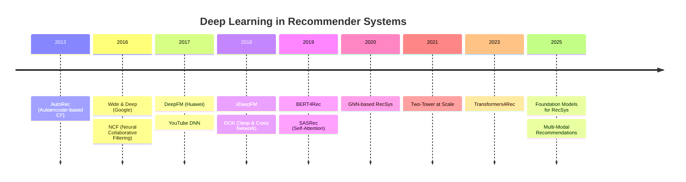
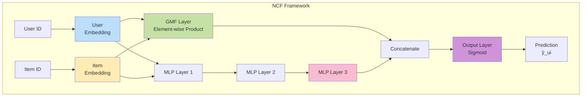
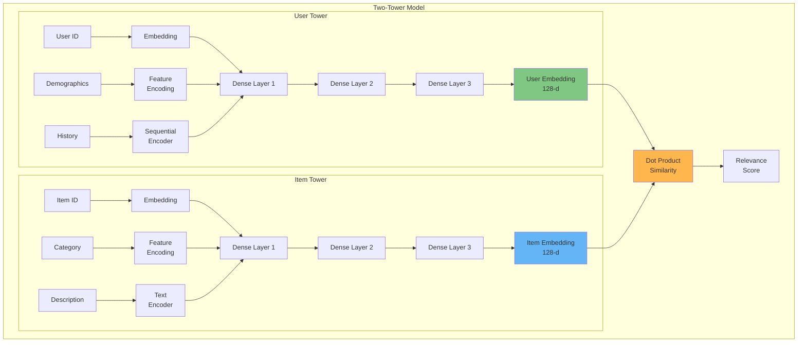
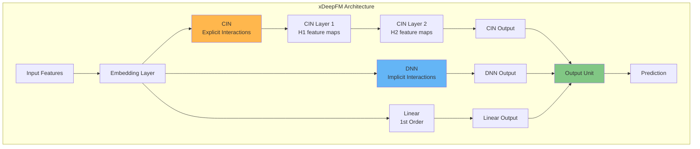
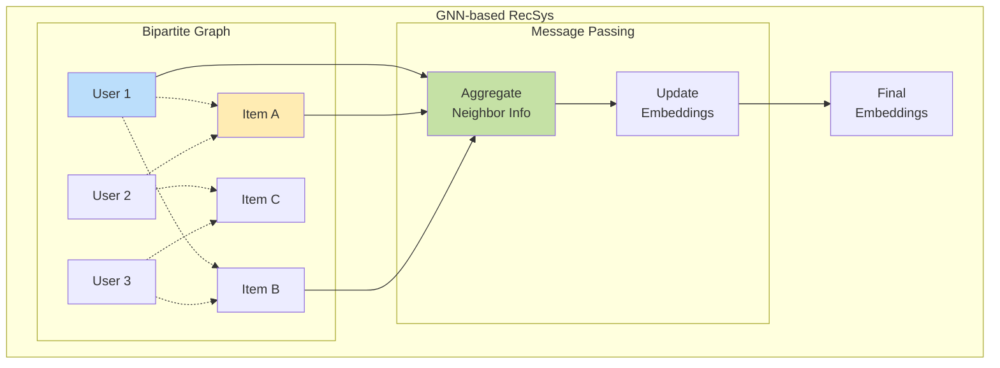

# Recommender Systems: Deep Learning & SOTA Approaches

> Advanced neural architectures for modern recommendation systems, from NCF to transformers.

[← Fundamentals](08-recommender-system-fundamentals.md) | **Part 2 of 3** | [Production →](10-recommender-system-production.md)

## Table of Contents

1. [Introduction](#introduction)
2. [Neural Collaborative Filtering](#neural-collaborative-filtering)
3. [Two-Tower Architecture](#two-tower-architecture)
4. [Wide & Deep Learning](#wide-deep-learning)
5. [DeepFM](#deepfm)
6. [Advanced Feature Interactions](#advanced-feature-interactions)
7. [Sequential Recommendations](#sequential-recommendations)
8. [Graph Neural Networks](#graph-neural-networks)
9. [Implementation Examples](#implementation-examples)

---

## Introduction

### Concept: What are Embeddings?

Before diving into deep learning, it's essential to understand **Embeddings**. In a recommender system, users and items are initially just IDs (e.g., User #42, Item #99). These are "sparse" and don't carry meaning.

An **Embedding** is a translation of these IDs into dense vectors of numbers (e.g., `[0.1, -0.5, 0.8]`) where **similar items are close together** in space.
*   **Analogy**: Think of it like a map. "King" - "Man" + "Woman" $\approx$ "Queen".
*   **Goal**: We want our model to *learn* these vectors so that if User A likes Item X, their vectors point in the same direction.

### Why Deep Learning for RecSys?

**Traditional Limitations (Matrix Factorization):**
- **Linearity**: MF assumes interactions are a simple dot product (linear combination). It cannot capture complex, non-linear relationships (e.g., "User likes Action movies ONLY if they are short").
- **Manual feature engineering required**: You have to hand-craft features.
- **Limited capacity**: Hard to combine diverse data types (images + text + ID).

**Deep Learning Advantages:**
- **Non-linear modeling**: MLP layers (with ReLU) can approximate *any* function, capturing complex "AND/OR/XOR" logic between features.
- **Automatic feature learning**: End-to-end learning from raw data.
- **Multi-modal fusion**: Combine text (BERT), images (CNN), and IDs seamlessly.
- **Sequential patterns**: RNNs/Transformers model the *order* of actions (A then B then C).

### Evolution Timeline



---

## Neural Collaborative Filtering

### Overview

**Neural Collaborative Filtering (NCF)** replaces the inner product in matrix factorization with a neural architecture capable of learning arbitrary functions from data.

### Architecture



### Mathematical Formulation

**Generalized Matrix Factorization (GMF):**
$$
\phi^{GMF}(u, i) = \vec{p}_u \odot \vec{q}_i
$$

**Multi-Layer Perceptron (MLP):**
$$
\begin{align*}
z_1 &= \phi_1([\vec{p}_u, \vec{q}_i]) = a_1(W_1^T [\vec{p}_u, \vec{q}_i] + b_1) \\
z_2 &= \phi_2(z_1) = a_2(W_2^T z_1 + b_2) \\
&\vdots \\
z_L &= \phi_L(z_{L-1}) = a_L(W_L^T z_{L-1} + b_L)
\end{align*}
$$

**NeuMF (Combined):**
$$
\hat{y}_{ui} = \sigma(h^T[\phi^{GMF}(u,i), \phi^{MLP}(u,i)])
$$

Where $\sigma$ is the sigmoid function and $h$ is the output layer weights.

### Implementation

```python
"""Neural Collaborative Filtering (NCF) implementation."""

from typing import Tuple
import torch
import torch.nn as nn
import torch.nn.functional as F

class NCF(nn.Module):
    """Neural Collaborative Filtering model.

    Combines Generalized Matrix Factorization (GMF) and Multi-Layer
    Perceptron (MLP) for learning user-item interactions.

    Attributes:
        n_users: Number of unique users
        n_items: Number of unique items
        embedding_dim: Dimensionality of embeddings
        hidden_layers: List of hidden layer sizes for MLP
    """

    def __init__(
        self,
        n_users: int,
        n_items: int,
        embedding_dim: int = 64,
        hidden_layers: Tuple[int, ...] = (128, 64, 32)
    ) -> None:
        """Initialize NCF model.

        Args:
            n_users: Total number of users
            n_items: Total number of items
            embedding_dim: Size of embedding vectors
            hidden_layers: MLP hidden layer dimensions
        """
        super().__init__()

        self.n_users = n_users
        self.n_items = n_items
        self.embedding_dim = embedding_dim

        # GMF embeddings
        self.user_embedding_gmf = nn.Embedding(n_users, embedding_dim)
        self.item_embedding_gmf = nn.Embedding(n_items, embedding_dim)

        # MLP embeddings
        self.user_embedding_mlp = nn.Embedding(n_users, embedding_dim)
        self.item_embedding_mlp = nn.Embedding(n_items, embedding_dim)

        # MLP layers
        mlp_input_dim = embedding_dim * 2
        self.mlp_layers = nn.ModuleList()

        for hidden_size in hidden_layers:
            self.mlp_layers.append(nn.Linear(mlp_input_dim, hidden_size))
            self.mlp_layers.append(nn.ReLU())
            self.mlp_layers.append(nn.BatchNorm1d(hidden_size))
            self.mlp_layers.append(nn.Dropout(0.2))
            mlp_input_dim = hidden_size

        # Output layer
        output_dim = embedding_dim + hidden_layers[-1]
        self.output_layer = nn.Linear(output_dim, 1)

        # Initialize weights
        self._init_weights()

    def _init_weights(self) -> None:
        """Initialize model weights using Xavier initialization."""
        nn.init.normal_(self.user_embedding_gmf.weight, std=0.01)
        nn.init.normal_(self.item_embedding_gmf.weight, std=0.01)
        nn.init.normal_(self.user_embedding_mlp.weight, std=0.01)
        nn.init.normal_(self.item_embedding_mlp.weight, std=0.01)

        for layer in self.mlp_layers:
            if isinstance(layer, nn.Linear):
                nn.init.xavier_uniform_(layer.weight)
                nn.init.zeros_(layer.bias)

    def forward(
        self,
        user_ids: torch.Tensor,
        item_ids: torch.Tensor
    ) -> torch.Tensor:
        """Forward pass through NCF model.

        Args:
            user_ids: Tensor of user indices [batch_size]
            item_ids: Tensor of item indices [batch_size]

        Returns:
            Predicted interaction scores [batch_size, 1]
        """
        # GMF path
        user_embed_gmf = self.user_embedding_gmf(user_ids)
        item_embed_gmf = self.item_embedding_gmf(item_ids)
        gmf_output = user_embed_gmf * item_embed_gmf  # Element-wise product

        # MLP path
        user_embed_mlp = self.user_embedding_mlp(user_ids)
        item_embed_mlp = self.item_embedding_mlp(item_ids)
        mlp_input = torch.cat([user_embed_mlp, item_embed_mlp], dim=-1)

        mlp_output = mlp_input
        for layer in self.mlp_layers:
            mlp_output = layer(mlp_output)

        # Concatenate GMF and MLP outputs
        concat_output = torch.cat([gmf_output, mlp_output], dim=-1)

        # Final prediction
        prediction = self.output_layer(concat_output)

        return prediction.squeeze(-1)


class NCFTrainer:
    """Trainer for NCF model with binary cross-entropy loss.

    Handles training loop, validation, and prediction for NCF model
    with implicit feedback (binary labels).

    Attributes:
        model: NCF model instance
        optimizer: Optimizer for training
        device: Device for computation (cuda/cpu)
    """

    def __init__(
        self,
        model: NCF,
        learning_rate: float = 0.001,
        weight_decay: float = 1e-5,
        device: str = 'cuda' if torch.cuda.is_available() else 'cpu'
    ) -> None:
        """Initialize NCF trainer.

        Args:
            model: NCF model to train
            learning_rate: Learning rate for optimizer
            weight_decay: L2 regularization strength
            device: Device for computation
        """
        self.model = model.to(device)
        self.device = device
        self.optimizer = torch.optim.Adam(
            model.parameters(),
            lr=learning_rate,
            weight_decay=weight_decay
        )
        self.criterion = nn.BCEWithLogitsLoss()

    def train_epoch(
        self,
        train_loader: torch.utils.data.DataLoader
    ) -> float:
        """Train for one epoch.

        Args:
            train_loader: DataLoader with (user_id, item_id, label) batches

        Returns:
            Average loss for the epoch
        """
        self.model.train()
        total_loss = 0.0
        n_batches = 0

        for user_ids, item_ids, labels in train_loader:
            user_ids = user_ids.to(self.device)
            item_ids = item_ids.to(self.device)
            labels = labels.float().to(self.device)

            # Forward pass
            predictions = self.model(user_ids, item_ids)

            # Compute loss
            loss = self.criterion(predictions, labels)

            # Backward pass
            self.optimizer.zero_grad()
            loss.backward()
            self.optimizer.step()

            total_loss += loss.item()
            n_batches += 1

        return total_loss / n_batches

    def evaluate(
        self,
        val_loader: torch.utils.data.DataLoader
    ) -> Tuple[float, float]:
        """Evaluate model on validation set.

        Args:
            val_loader: Validation data loader

        Returns:
            Tuple of (loss, accuracy)
        """
        self.model.eval()
        total_loss = 0.0
        correct = 0
        total = 0

        with torch.no_grad():
            for user_ids, item_ids, labels in val_loader:
                user_ids = user_ids.to(self.device)
                item_ids = item_ids.to(self.device)
                labels = labels.float().to(self.device)

                predictions = self.model(user_ids, item_ids)
                loss = self.criterion(predictions, labels)

                total_loss += loss.item()

                # Compute accuracy
                predicted_labels = (torch.sigmoid(predictions) > 0.5).float()
                correct += (predicted_labels == labels).sum().item()
                total += labels.size(0)

        avg_loss = total_loss / len(val_loader)
        accuracy = correct / total

        return avg_loss, accuracy

    def recommend(
        self,
        user_id: int,
        candidate_items: torch.Tensor,
        top_k: int = 10
    ) -> torch.Tensor:
        """Generate top-K recommendations for user.

        Args:
            user_id: User identifier
            candidate_items: Tensor of candidate item IDs
            top_k: Number of recommendations

        Returns:
            Tensor of top-K item IDs
        """
        self.model.eval()

        with torch.no_grad():
            user_ids = torch.full(
                (len(candidate_items),),
                user_id,
                dtype=torch.long,
                device=self.device
            )
            item_ids = candidate_items.to(self.device)

            scores = torch.sigmoid(self.model(user_ids, item_ids))
            top_k_indices = torch.topk(scores, top_k).indices

        return candidate_items[top_k_indices.cpu()]
```

### Training Tips

**1. Negative Sampling:**
```python
def sample_negatives(
    positive_interactions: dict,
    n_items: int,
    n_negatives: int = 4
) -> list:
    """Sample negative items for each positive interaction.

    Args:
        positive_interactions: Dict of user -> set of positive items
        n_items: Total number of items
        n_negatives: Number of negatives per positive

    Returns:
        List of (user, item, label) tuples
    """
    import random

    samples = []

    for user, pos_items in positive_interactions.items():
        # Add positive samples
        for item in pos_items:
            samples.append((user, item, 1))

        # Sample negatives
        all_items = set(range(n_items))
        neg_candidates = list(all_items - pos_items)

        for item in pos_items:
            neg_items = random.sample(neg_candidates, n_negatives)
            for neg_item in neg_items:
                samples.append((user, neg_item, 0))

    return samples
```

**2. Hyperparameter Guidelines:**
- Embedding dimension: 64-128 for most datasets
- MLP layers: [128, 64, 32] or [256, 128, 64]
- Batch size: 256-1024
- Learning rate: 0.001-0.01 with decay
- Negative sampling ratio: 4:1 to 10:1

---

## Two-Tower Architecture

### Overview

**Two-Tower models** separate user and item encoding into independent neural networks, enabling efficient large-scale retrieval through pre-computed item embeddings.

### Architecture



### Key Advantages

1. **Scalability**: Pre-compute and cache item embeddings
2. **Real-time serving**: Only compute user embedding at query time
3. **Efficient retrieval**: Use ANN (Approximate Nearest Neighbors) for item search
4. **Independent training**: Update towers separately

### Implementation

```python
"""Two-Tower model for large-scale recommendations."""

from typing import Dict, List, Optional
import torch
import torch.nn as nn

class TwoTowerModel(nn.Module):
    """Two-Tower architecture for scalable recommendations.

    Encodes users and items into a shared embedding space where
    similarity is computed via dot product. Designed for efficient
    serving with pre-computed item embeddings.

    Attributes:
        user_tower: Neural network for user encoding
        item_tower: Neural network for item encoding
        embedding_dim: Dimensionality of output embeddings
    """

    def __init__(
        self,
        n_users: int,
        n_items: int,
        user_features_dim: int,
        item_features_dim: int,
        embedding_dim: int = 128,
        hidden_dims: List[int] = [256, 128]
    ) -> None:
        """Initialize Two-Tower model.

        Args:
            n_users: Number of unique users
            n_items: Number of unique items
            user_features_dim: Dimension of user features
            item_features_dim: Dimension of item features
            embedding_dim: Final embedding dimension
            hidden_dims: Hidden layer sizes for towers
        """
        super().__init__()

        self.embedding_dim = embedding_dim

        # User embeddings
        self.user_id_embedding = nn.Embedding(n_users, 64)

        # Item embeddings
        self.item_id_embedding = nn.Embedding(n_items, 64)

        # User tower
        user_input_dim = 64 + user_features_dim
        self.user_tower = self._build_tower(
            user_input_dim,
            hidden_dims,
            embedding_dim,
            name="user"
        )

        # Item tower
        item_input_dim = 64 + item_features_dim
        self.item_tower = self._build_tower(
            item_input_dim,
            hidden_dims,
            embedding_dim,
            name="item"
        )

        # Temperature parameter for softmax
        self.temperature = nn.Parameter(torch.ones(1) * 0.07)

    def _build_tower(
        self,
        input_dim: int,
        hidden_dims: List[int],
        output_dim: int,
        name: str
    ) -> nn.Sequential:
        """Build a tower (MLP) network.

        Args:
            input_dim: Input feature dimension
            hidden_dims: List of hidden layer sizes
            output_dim: Output embedding dimension
            name: Tower name for logging

        Returns:
            Sequential model representing the tower
        """
        layers = []
        prev_dim = input_dim

        for hidden_dim in hidden_dims:
            layers.extend([
                nn.Linear(prev_dim, hidden_dim),
                nn.ReLU(),
                nn.BatchNorm1d(hidden_dim),
                nn.Dropout(0.2)
            ])
            prev_dim = hidden_dim

        # Final projection to embedding space
        layers.append(nn.Linear(prev_dim, output_dim))

        return nn.Sequential(*layers)

    def encode_user(
        self,
        user_ids: torch.Tensor,
        user_features: torch.Tensor
    ) -> torch.Tensor:
        """Encode user to embedding space.

        Args:
            user_ids: User ID tensor [batch_size]
            user_features: User feature tensor [batch_size, feature_dim]

        Returns:
            L2-normalized user embeddings [batch_size, embedding_dim]
        """
        user_embed = self.user_id_embedding(user_ids)
        user_input = torch.cat([user_embed, user_features], dim=-1)
        user_encoding = self.user_tower(user_input)

        # L2 normalization
        user_encoding = F.normalize(user_encoding, p=2, dim=-1)

        return user_encoding

    def encode_item(
        self,
        item_ids: torch.Tensor,
        item_features: torch.Tensor
    ) -> torch.Tensor:
        """Encode item to embedding space.

        Args:
            item_ids: Item ID tensor [batch_size]
            item_features: Item feature tensor [batch_size, feature_dim]

        Returns:
            L2-normalized item embeddings [batch_size, embedding_dim]
        """
        item_embed = self.item_id_embedding(item_ids)
        item_input = torch.cat([item_embed, item_features], dim=-1)
        item_encoding = self.item_tower(item_input)

        # L2 normalization
        item_encoding = F.normalize(item_encoding, p=2, dim=-1)

        return item_encoding

    def forward(
        self,
        user_ids: torch.Tensor,
        item_ids: torch.Tensor,
        user_features: torch.Tensor,
        item_features: torch.Tensor
    ) -> torch.Tensor:
        """Forward pass computing similarity scores.

        Args:
            user_ids: User IDs [batch_size]
            item_ids: Item IDs [batch_size]
            user_features: User features [batch_size, user_feat_dim]
            item_features: Item features [batch_size, item_feat_dim]

        Returns:
            Similarity scores [batch_size]
        """
        user_embeddings = self.encode_user(user_ids, user_features)
        item_embeddings = self.encode_item(item_ids, item_features)

        # Dot product similarity
        scores = torch.sum(user_embeddings * item_embeddings, dim=-1)

        # Scale by temperature
        scores = scores / self.temperature

        return scores

    def compute_batch_scores(
        self,
        user_embedding: torch.Tensor,
        item_embeddings: torch.Tensor
    ) -> torch.Tensor:
        """Compute scores for a user against multiple items.

        Args:
            user_embedding: Single user embedding [embedding_dim]
            item_embeddings: Multiple item embeddings [n_items, embedding_dim]

        Returns:
            Similarity scores [n_items]
        """
        scores = torch.matmul(
            item_embeddings,
            user_embedding.unsqueeze(-1)
        ).squeeze(-1)

        return scores / self.temperature


class TwoTowerTrainer:
    """Trainer for Two-Tower model with contrastive learning.

    Uses in-batch negatives for efficient contrastive learning,
    treating other items in the batch as negative examples.

    Attributes:
        model: TwoTowerModel instance
        optimizer: Optimizer for training
        device: Computation device
    """

    def __init__(
        self,
        model: TwoTowerModel,
        learning_rate: float = 0.001,
        device: str = 'cuda' if torch.cuda.is_available() else 'cpu'
    ) -> None:
        """Initialize trainer.

        Args:
            model: TwoTowerModel to train
            learning_rate: Learning rate
            device: Device for computation
        """
        self.model = model.to(device)
        self.device = device
        self.optimizer = torch.optim.Adam(
            model.parameters(),
            lr=learning_rate
        )

    def contrastive_loss(
        self,
        user_embeddings: torch.Tensor,
        item_embeddings: torch.Tensor
    ) -> torch.Tensor:
        """Compute contrastive loss with in-batch negatives.

        Args:
            user_embeddings: User embeddings [batch_size, dim]
            item_embeddings: Item embeddings [batch_size, dim]

        Returns:
            Contrastive loss value
        """
        # Compute all pairwise similarities
        # [batch_size, batch_size]
        logits = torch.matmul(
            user_embeddings,
            item_embeddings.transpose(0, 1)
        ) / self.model.temperature

        # Labels: diagonal elements are positives
        labels = torch.arange(
            logits.size(0),
            device=self.device
        )

        # Cross-entropy loss
        loss = F.cross_entropy(logits, labels)

        return loss

    def train_epoch(
        self,
        train_loader: torch.utils.data.DataLoader
    ) -> float:
        """Train for one epoch.

        Args:
            train_loader: DataLoader with user-item pairs

        Returns:
            Average loss for epoch
        """
        self.model.train()
        total_loss = 0.0

        for batch in train_loader:
            user_ids = batch['user_id'].to(self.device)
            item_ids = batch['item_id'].to(self.device)
            user_features = batch['user_features'].to(self.device)
            item_features = batch['item_features'].to(self.device)

            # Encode users and items
            user_embeddings = self.model.encode_user(
                user_ids,
                user_features
            )
            item_embeddings = self.model.encode_item(
                item_ids,
                item_features
            )

            # Compute contrastive loss
            loss = self.contrastive_loss(
                user_embeddings,
                item_embeddings
            )

            # Backward pass
            self.optimizer.zero_grad()
            loss.backward()
            self.optimizer.step()

            total_loss += loss.item()

        return total_loss / len(train_loader)
```

### Serving Strategy

```python
"""Efficient serving with pre-computed embeddings."""

import numpy as np
import faiss

class TwoTowerServing:
    """Efficient serving for Two-Tower recommendations.

    Pre-computes and indexes item embeddings for fast retrieval
    using FAISS approximate nearest neighbor search.

    Attributes:
        model: Trained TwoTowerModel
        index: FAISS index for item embeddings
        item_ids: Mapping from index to item ID
    """

    def __init__(
        self,
        model: TwoTowerModel,
        device: str = 'cpu'
    ) -> None:
        """Initialize serving system.

        Args:
            model: Trained TwoTowerModel
            device: Device for computation
        """
        self.model = model.to(device)
        self.model.eval()
        self.device = device
        self.index: Optional[faiss.Index] = None
        self.item_ids: Optional[np.ndarray] = None

    def build_item_index(
        self,
        item_ids: np.ndarray,
        item_features: torch.Tensor,
        use_gpu: bool = False
    ) -> None:
        """Pre-compute and index all item embeddings.

        Args:
            item_ids: Array of item IDs
            item_features: Item features tensor
            use_gpu: Whether to use GPU for FAISS
        """
        self.item_ids = item_ids

        # Compute item embeddings
        with torch.no_grad():
            item_ids_tensor = torch.tensor(item_ids).to(self.device)
            item_embeddings = self.model.encode_item(
                item_ids_tensor,
                item_features.to(self.device)
            )
            item_embeddings = item_embeddings.cpu().numpy()

        # Build FAISS index
        dimension = item_embeddings.shape[1]

        if use_gpu and faiss.get_num_gpus() > 0:
            # GPU index
            res = faiss.StandardGpuResources()
            index = faiss.GpuIndexFlatIP(res, dimension)
        else:
            # CPU index with inner product similarity
            index = faiss.IndexFlatIP(dimension)

        # Add embeddings to index
        index.add(item_embeddings.astype('float32'))
        self.index = index

    def recommend(
        self,
        user_id: int,
        user_features: torch.Tensor,
        top_k: int = 10
    ) -> List[int]:
        """Generate top-K recommendations for user.

        Args:
            user_id: User identifier
            user_features: User feature tensor
            top_k: Number of recommendations

        Returns:
            List of recommended item IDs
        """
        # Compute user embedding
        with torch.no_grad():
            user_id_tensor = torch.tensor([user_id]).to(self.device)
            user_embedding = self.model.encode_user(
                user_id_tensor,
                user_features.unsqueeze(0).to(self.device)
            )
            user_embedding = user_embedding.cpu().numpy().astype('float32')

        # Search nearest items
        scores, indices = self.index.search(user_embedding, top_k)

        # Map indices to item IDs
        recommended_items = self.item_ids[indices[0]].tolist()

        return recommended_items
```

---

## Wide & Deep Learning

### Overview

**Wide & Deep Learning** (Google, 2016) combines memorization (wide component) with generalization (deep component) for click-through rate prediction.

### Architecture

```mermaid
graph TB
    subgraph "Wide & Deep Architecture"
        subgraph "Wide Component"
            CF[Cross-Product<br/>Features] --> WL[Linear Model<br/>Memorization]
        end

        subgraph "Deep Component"
            CE[Categorical<br/>Embeddings] --> D1[Dense Layer 1<br/>1024 units]
            D1 --> D2[Dense Layer 2<br/>512 units]
            D2 --> D3[Dense Layer 3<br/>256 units]
            D3 --> DEEP[Deep Output<br/>Generalization]
        end

        WL --> COMB[Combined<br/>Output]
        DEEP --> COMB

        COMB --> PRED[Prediction<br/>σ(w_wide + w_deep)]
    end

    style WL fill:#ffeb3b
    style DEEP fill:#64b5f6
    style COMB fill:#81c784
```

### Mathematical Formulation

**Wide Component (Linear Model):**
$$
y_{\text{wide}} = w^T x + b
$$

**Deep Component (DNN):**
$$
a^{(l+1)} = f(W^{(l)} a^{(l)} + b^{(l)})
$$

**Combined Prediction:**
$$
P(Y=1|x) = \sigma(w_{\text{wide}}^T [x, \phi(x)] + w_{\text{deep}}^T a^{(\text{final})} + b)
$$

### Implementation

```python
"""Wide & Deep Learning implementation."""

import torch
import torch.nn as nn

class WideAndDeep(nn.Module):
    """Wide & Deep model for CTR prediction.

    Combines linear model (memorization) with deep neural network
    (generalization) for improved recommendation performance.

    Attributes:
        wide: Linear model for cross-product features
        deep: Deep neural network for learned features
        output_layer: Combined output layer
    """

    def __init__(
        self,
        wide_dim: int,
        deep_dim: int,
        embedding_dims: Dict[str, int],
        hidden_dims: List[int] = [1024, 512, 256]
    ) -> None:
        """Initialize Wide & Deep model.

        Args:
            wide_dim: Dimension of wide features
            deep_dim: Dimension of deep continuous features
            embedding_dims: Dict of categorical feature -> embedding size
            hidden_dims: Hidden layer sizes for deep component
        """
        super().__init__()

        # Wide component
        self.wide = nn.Linear(wide_dim, 1)

        # Embeddings for categorical features
        self.embeddings = nn.ModuleDict({
            name: nn.Embedding(num_embeddings, embedding_dim)
            for name, (num_embeddings, embedding_dim) in embedding_dims.items()
        })

        # Deep component
        total_embedding_dim = sum(
            embedding_dim for _, embedding_dim in embedding_dims.values()
        )
        deep_input_dim = deep_dim + total_embedding_dim

        deep_layers = []
        prev_dim = deep_input_dim

        for hidden_dim in hidden_dims:
            deep_layers.extend([
                nn.Linear(prev_dim, hidden_dim),
                nn.ReLU(),
                nn.BatchNorm1d(hidden_dim),
                nn.Dropout(0.2)
            ])
            prev_dim = hidden_dim

        self.deep = nn.Sequential(*deep_layers)

        # Output layer combining wide and deep
        self.output = nn.Linear(prev_dim + 1, 1)

    def forward(
        self,
        wide_features: torch.Tensor,
        deep_features: torch.Tensor,
        categorical_features: Dict[str, torch.Tensor]
    ) -> torch.Tensor:
        """Forward pass through Wide & Deep model.

        Args:
            wide_features: Wide component features [batch, wide_dim]
            deep_features: Deep continuous features [batch, deep_dim]
            categorical_features: Dict of feature name -> indices

        Returns:
            Prediction scores [batch, 1]
        """
        # Wide component
        wide_output = self.wide(wide_features)

        # Get embeddings for categorical features
        embedded_features = []
        for name, indices in categorical_features.items():
            embedded = self.embeddings[name](indices)
            embedded_features.append(embedded)

        # Concatenate all deep inputs
        deep_input = torch.cat(
            [deep_features] + embedded_features,
            dim=-1
        )

        # Deep component
        deep_output = self.deep(deep_input)

        # Combine wide and deep
        combined = torch.cat([wide_output, deep_output], dim=-1)
        output = self.output(combined)

        return output.squeeze(-1)
```

### Use Cases

- **Google Play**: App recommendations
- **E-commerce**: Product recommendations with rich features
- **Advertisement**: CTR prediction with user-item cross-features

---

## DeepFM

### Overview

**DeepFM** (Huawei, 2017) combines Factorization Machines (FM) and deep learning without manual feature engineering.

### Architecture

```mermaid
graph TB
    subgraph "DeepFM Architecture"
        INPUT[Sparse Input<br/>Features]

        INPUT --> EMB[Shared<br/>Embeddings]

        EMB --> FM[FM Component<br/>2nd Order Interactions]
        EMB --> DNN[DNN Component<br/>High-Order Interactions]

        FM --> FMOUT[FM Output<br/>Linear + Quadratic]
        DNN --> D1[Dense 1024]
        D1 --> D2[Dense 512]
        D2 --> D3[Dense 256]
        D3 --> DNNOUT[DNN Output]

        FMOUT --> SIG[Sigmoid<br/>σ(y_FM + y_DNN)]
        DNNOUT --> SIG

        SIG --> PRED[CTR Prediction]
    end

    style EMB fill:#fff9c4
    style FM fill:#b3e5fc
    style DNN fill:#f8bbd0
    style SIG fill:#c5e1a5
```

### Mathematical Formulation

**FM Component:**
$$
y_{FM} = w_0 + \sum_{i=1}^{n} w_i x_i + \sum_{i=1}^{n} \sum_{j=i+1}^{n} \langle v_i, v_j \rangle x_i x_j
$$

**Deep Component:**
$$
y_{DNN} = W^{(L)} \cdot a^{(L)} + b^{(L)}
$$

**Combined Output:**
$$
\hat{y} = \sigma(y_{FM} + y_{DNN})
$$

### Implementation

```python
"""DeepFM implementation for CTR prediction."""

import torch
import torch.nn as nn

class DeepFM(nn.Module):
    """DeepFM model combining FM and deep learning.

    Shares embeddings between FM and deep components for efficient
    learning of both low-order and high-order feature interactions.

    Attributes:
        feature_embeddings: Shared embeddings for sparse features
        fm_first_order: Linear weights for first-order interactions
        dnn: Deep neural network for high-order interactions
    """

    def __init__(
        self,
        field_dims: List[int],
        embedding_dim: int = 10,
        hidden_dims: List[int] = [1024, 512, 256]
    ) -> None:
        """Initialize DeepFM model.

        Args:
            field_dims: List of feature field dimensions
            embedding_dim: Embedding dimension for each field
            hidden_dims: Hidden layer sizes for DNN
        """
        super().__init__()

        self.embedding_dim = embedding_dim
        self.num_fields = len(field_dims)

        # Shared embeddings
        self.feature_embeddings = nn.ModuleList([
            nn.Embedding(field_dim, embedding_dim)
            for field_dim in field_dims
        ])

        # FM first-order (linear) component
        self.fm_first_order = nn.ModuleList([
            nn.Embedding(field_dim, 1)
            for field_dim in field_dims
        ])

        self.fm_bias = nn.Parameter(torch.zeros(1))

        # DNN component
        dnn_input_dim = self.num_fields * embedding_dim
        dnn_layers = []
        prev_dim = dnn_input_dim

        for hidden_dim in hidden_dims:
            dnn_layers.extend([
                nn.Linear(prev_dim, hidden_dim),
                nn.ReLU(),
                nn.BatchNorm1d(hidden_dim),
                nn.Dropout(0.2)
            ])
            prev_dim = hidden_dim

        dnn_layers.append(nn.Linear(prev_dim, 1))
        self.dnn = nn.Sequential(*dnn_layers)

    def forward(self, x: torch.Tensor) -> torch.Tensor:
        """Forward pass through DeepFM.

        Args:
            x: Feature indices [batch_size, num_fields]

        Returns:
            CTR predictions [batch_size]
        """
        batch_size = x.size(0)

        # FM First Order (Linear)
        fm_first_order_output = self.fm_bias
        for i, emb in enumerate(self.fm_first_order):
            fm_first_order_output += emb(x[:, i]).sum(dim=-1)

        # Get embeddings for all fields
        embeddings = []
        for i, emb in enumerate(self.feature_embeddings):
            embeddings.append(emb(x[:, i]))

        embeddings = torch.stack(embeddings, dim=1)  # [batch, fields, emb_dim]

        # FM Second Order (Pairwise Interactions)
        # Sum of squares - square of sum trick
        sum_of_square = torch.sum(embeddings ** 2, dim=1)
        square_of_sum = torch.sum(embeddings, dim=1) ** 2
        fm_second_order_output = 0.5 * torch.sum(
            square_of_sum - sum_of_square,
            dim=-1
        )

        # DNN Component
        dnn_input = embeddings.view(batch_size, -1)
        dnn_output = self.dnn(dnn_input).squeeze(-1)

        # Combine FM and DNN
        output = fm_first_order_output + fm_second_order_output + dnn_output

        return torch.sigmoid(output)
```

### Key Advantages

1. **No manual feature engineering**: Learns feature interactions automatically
2. **Shared embeddings**: Efficient parameter sharing
3. **Low and high-order**: Captures both types of interactions
4. **End-to-end training**: Single optimization objective

---

## Advanced Feature Interactions

### xDeepFM

**eXtreme Deep Factorization Machine** introduces Compressed Interaction Network (CIN) for explicit high-order interactions.



**CIN Layer Computation:**
$$
X^{k+1}_h = \sum_{i=1}^{H_{k-1}} \sum_{j=1}^{m} W^{k,h}_{i,j} (X^k_i \circ X^0_j)
$$

Where $\circ$ denotes outer product.

### DCN (Deep & Cross Network)

**Deep & Cross Network** explicitly applies feature crossing at each layer.

**Cross Layer:**
$$
x_{l+1} = x_0 x_l^T w_l + b_l + x_l
$$

Where $x_0$ is the input and $x_l$ is the output of layer $l$.

---

## Sequential Recommendations

### BERT4Rec

**BERT for Sequential Recommendation** applies bidirectional self-attention to model user behavior sequences.

#### Intuition: Attention Mechanism

Why are Transformers better than RNNs? **Attention**.
Instead of processing a sequence step-by-step (forgetting the past), Attention allows the model to "look at" the entire history at once and decide what's important.

*   **Weighted Relevance**: It assigns a "weight" to every past item.
*   **Spotlight Analogy**: When predicting the next movie, the model shines a bright spotlight on "The Avengers" (watched yesterday) and a dim light on "Frozen" (watched 2 years ago), regardless of how far back they are.
*   **Query-Key-Value**:
    *   **Query**: "What am I looking for?" (Current context)
    *   **Key**: "What describes this item?" (Past item features)
    *   **Value**: "What is the content?" (Item embedding)

```mermaid
graph TB
    subgraph "BERT4Rec Architecture"
        SEQ[Item Sequence<br/>[i1, i2, i3, [MASK], i5]]

        SEQ --> POS[+ Position<br/>Embeddings]
        POS --> EMBED[Item + Position<br/>Embeddings]

        EMBED --> TRM1[Transformer<br/>Block 1]
        TRM1 --> TRM2[Transformer<br/>Block 2]
        TRM2 --> TRM3[Transformer<br/>Block L]

        TRM3 --> OUT[Output<br/>Embeddings]

        OUT --> PRED[Predict<br/>Masked Item]
    end

    style EMBED fill:#fff9c4
    style TRM2 fill:#b3e5fc
    style PRED fill:#81c784
```

**Self-Attention:**
$$
\text{Attention}(Q, K, V) = \text{softmax}\left(\frac{QK^T}{\sqrt{d_k}}\right)V
$$

### Implementation

```python
"""BERT4Rec implementation for sequential recommendations."""

import torch
import torch.nn as nn
import math

class BERT4Rec(nn.Module):
    """BERT for sequential recommendation.

    Uses bidirectional transformers to model user behavior sequences
    and predict next items through masked language modeling.

    Attributes:
        item_embeddings: Item embedding layer
        position_embeddings: Positional encoding
        transformer_blocks: Stack of transformer layers
        output_layer: Prediction head
    """

    def __init__(
        self,
        n_items: int,
        max_seq_length: int,
        hidden_size: int = 256,
        n_layers: int = 2,
        n_heads: int = 4,
        dropout: float = 0.1
    ) -> None:
        """Initialize BERT4Rec model.

        Args:
            n_items: Total number of items
            max_seq_length: Maximum sequence length
            hidden_size: Hidden dimension size
            n_layers: Number of transformer blocks
            n_heads: Number of attention heads
            dropout: Dropout probability
        """
        super().__init__()

        self.n_items = n_items
        self.hidden_size = hidden_size

        # Embeddings
        self.item_embeddings = nn.Embedding(
            n_items + 2,  # +2 for padding and mask tokens
            hidden_size,
            padding_idx=0
        )
        self.position_embeddings = nn.Embedding(
            max_seq_length,
            hidden_size
        )

        # Transformer blocks
        self.transformer_blocks = nn.ModuleList([
            TransformerBlock(hidden_size, n_heads, dropout)
            for _ in range(n_layers)
        ])

        # Output layer
        self.output_layer = nn.Linear(hidden_size, n_items)

        self._init_weights()

    def _init_weights(self) -> None:
        """Initialize model weights."""
        nn.init.normal_(self.item_embeddings.weight, std=0.02)
        nn.init.normal_(self.position_embeddings.weight, std=0.02)

    def forward(
        self,
        item_seq: torch.Tensor,
        mask: Optional[torch.Tensor] = None
    ) -> torch.Tensor:
        """Forward pass through BERT4Rec.

        Args:
            item_seq: Item sequence [batch_size, seq_length]
            mask: Attention mask [batch_size, seq_length]

        Returns:
            Item logits [batch_size, seq_length, n_items]
        """
        batch_size, seq_length = item_seq.size()

        # Get embeddings
        item_emb = self.item_embeddings(item_seq)

        # Add positional embeddings
        position_ids = torch.arange(
            seq_length,
            dtype=torch.long,
            device=item_seq.device
        )
        position_ids = position_ids.unsqueeze(0).expand_as(item_seq)
        position_emb = self.position_embeddings(position_ids)

        hidden = item_emb + position_emb

        # Apply transformer blocks
        for transformer in self.transformer_blocks:
            hidden = transformer(hidden, mask)

        # Project to item space
        logits = self.output_layer(hidden)

        return logits


class TransformerBlock(nn.Module):
    """Transformer block with multi-head self-attention.

    Attributes:
        attention: Multi-head self-attention layer
        feed_forward: Position-wise feed-forward network
        layer_norm1: Layer normalization after attention
        layer_norm2: Layer normalization after feed-forward
    """

    def __init__(
        self,
        hidden_size: int,
        n_heads: int,
        dropout: float
    ) -> None:
        """Initialize transformer block.

        Args:
            hidden_size: Hidden dimension
            n_heads: Number of attention heads
            dropout: Dropout probability
        """
        super().__init__()

        self.attention = nn.MultiheadAttention(
            hidden_size,
            n_heads,
            dropout=dropout,
            batch_first=True
        )

        self.feed_forward = nn.Sequential(
            nn.Linear(hidden_size, hidden_size * 4),
            nn.GELU(),
            nn.Dropout(dropout),
            nn.Linear(hidden_size * 4, hidden_size),
            nn.Dropout(dropout)
        )

        self.layer_norm1 = nn.LayerNorm(hidden_size)
        self.layer_norm2 = nn.LayerNorm(hidden_size)

    def forward(
        self,
        x: torch.Tensor,
        mask: Optional[torch.Tensor] = None
    ) -> torch.Tensor:
        """Forward pass through transformer block.

        Args:
            x: Input tensor [batch, seq_len, hidden]
            mask: Attention mask

        Returns:
            Output tensor [batch, seq_len, hidden]
        """
        # Self-attention with residual connection
        attn_output, _ = self.attention(x, x, x, key_padding_mask=mask)
        x = self.layer_norm1(x + attn_output)

        # Feed-forward with residual connection
        ff_output = self.feed_forward(x)
        x = self.layer_norm2(x + ff_output)

        return x
```

---

## Graph Neural Networks

### Overview

**Graph Neural Networks (GNNs)** model user-item interactions as a bipartite graph and learn embeddings through message passing.



### LightGCN

**LightGCN** simplifies Graph Convolutional Networks for recommendations by removing feature transformation and nonlinear activation.

**Layer-wise Propagation:**
$$
e_u^{(k+1)} = \sum_{i \in \mathcal{N}_u} \frac{1}{\sqrt{|\mathcal{N}_u| |\mathcal{N}_i|}} e_i^{(k)}
$$

$$
e_i^{(k+1)} = \sum_{u \in \mathcal{N}_i} \frac{1}{\sqrt{|\mathcal{N}_u| |\mathcal{N}_i|}} e_u^{(k)}
$$

**Final Embedding:**
$$
e_u = \sum_{k=0}^{K} \alpha_k e_u^{(k)}
$$

---

## Summary

### Model Comparison

| Model | Strengths | Use Cases | Complexity |
|-------|-----------|-----------|------------|
| **NCF** | Non-linear interactions | General recommendations | Medium |
| **Two-Tower** | Scalable serving | Large-scale retrieval | Low |
| **Wide & Deep** | Memorization + generalization | CTR prediction | Medium |
| **DeepFM** | Automatic feature interactions | CTR with sparse features | Medium |
| **xDeepFM** | Explicit + implicit interactions | Complex feature patterns | High |
| **BERT4Rec** | Sequential modeling | Session-based RecSys | High |
| **LightGCN** | Graph structure | Social recommendations | Medium |

### Key Takeaways

1. **Start with simpler models** (NCF, Two-Tower)
2. **Add complexity** based on data characteristics
3. **Consider serving requirements** (latency, scale)
4. **Leverage pre-training** (BERT, GNNs)
5. **A/B test** all changes

### Next Steps

Continue to:
- **[Part 3: Production Systems →](10-recommender-system-production.md)**
  - Netflix & YouTube architectures
  - Evaluation metrics
  - A/B testing strategies
  - Real-time serving

---

**Document Version**: 1.0
**Last Updated**: November 2025
**Next**: [Production Architecture](10-recommender-system-production.md)
