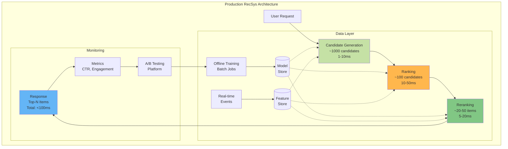
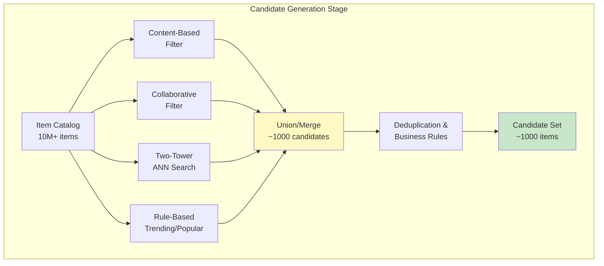
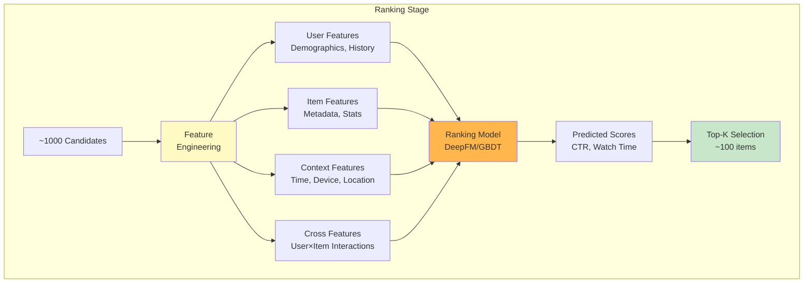
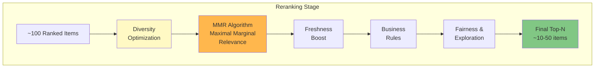
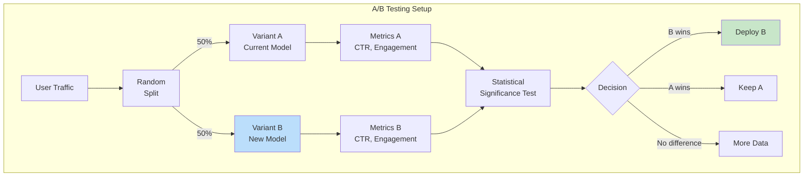
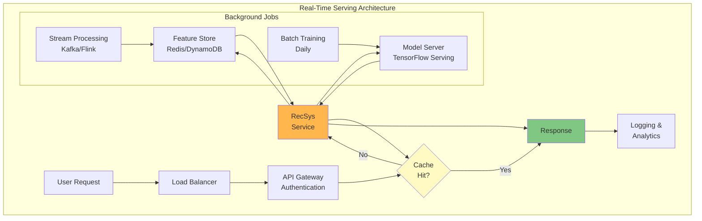

# Recommender Systems: Production Architecture & Best Practices

> Building, deploying, and scaling recommender systems at Netflix, YouTube, and Amazon scale.

[← Fundamentals](08-recommender-system-fundamentals.md) | [← Deep Learning](09-recommender-system-deep-learning.md) | **Part 3 of 3**

## Table of Contents

1. [Production Architecture Overview](#production-architecture-overview)
2. [Multi-Stage Ranking Pipeline](#multi-stage-ranking-pipeline)
3. [Evaluation Metrics](#evaluation-metrics)
4. [Online Experimentation](#online-experimentation)
5. [Real-Time Serving](#real-time-serving)
6. [Case Studies](#case-studies)
7. [Implementation Guide](#implementation-guide)

---

## Production Architecture Overview

### System Design Philosophy

**Key Principles:**
1. **Separation of Concerns**: Retrieval, ranking, reranking
2. **Scalability**: Handle millions of users and items
3. **Latency**: Sub-100ms response times
4. **Freshness**: Real-time model updates
5. **Reliability**: 99.99% uptime

### High-Level Architecture



### Components Breakdown

| Component | Purpose | Latency | Complexity |
|-----------|---------|---------|------------|
| **Candidate Generation** | Fast retrieval from millions | 1-10ms | Low |
| **Ranking** | Precise scoring of candidates | 10-50ms | Medium |
| **Reranking** | Business logic, diversity | 5-20ms | Medium |
| **Feature Store** | Real-time feature serving | <5ms | High |
| **Model Serving** | Inference at scale | Varies | High |

---

## Multi-Stage Ranking Pipeline

### Stage 1: Candidate Generation

**Goal**: Quickly narrow millions of items to ~1000 candidates

**Methods:**
1. **Content-based filtering** - Similar to user's history
2. **Collaborative filtering** - User/item similarity
3. **Two-tower retrieval** - ANN search in embedding space
4. **Rule-based** - Trending, popular, new releases



#### Implementation

```python
"""Candidate generation with multiple retrieval strategies."""

from typing import List, Set, Dict, Tuple
import numpy as np
import faiss
from dataclasses import dataclass

@dataclass
class Candidate:
    """Candidate item with metadata.

    Attributes:
        item_id: Unique item identifier
        score: Retrieval score
        source: Generation method (cf, cb, ann, trending)
    """
    item_id: int
    score: float
    source: str


class CandidateGenerator:
    """Multi-strategy candidate generation for recommendations.

    Combines multiple retrieval methods to generate diverse candidate
    sets for downstream ranking. Implements fusion strategies to balance
    different signals.

    Attributes:
        content_index: FAISS index for content-based retrieval
        cf_model: Collaborative filtering model
        two_tower_model: Two-tower retrieval model
        trending_items: Cache of trending items
    """

    def __init__(
        self,
        content_index: faiss.Index,
        cf_model,
        two_tower_model,
        embedding_dim: int = 128
    ) -> None:
        """Initialize candidate generator.

        Args:
            content_index: FAISS index for content similarity
            cf_model: Collaborative filtering model
            two_tower_model: Two-tower model for embedding retrieval
            embedding_dim: Dimension of embeddings
        """
        self.content_index = content_index
        self.cf_model = cf_model
        self.two_tower_model = two_tower_model
        self.embedding_dim = embedding_dim

        # Cache for frequently accessed data
        self.trending_items: List[int] = []
        self.popularity_scores: Dict[int, float] = {}

    def generate(
        self,
        user_id: int,
        user_features: np.ndarray,
        user_history: List[int],
        n_candidates: int = 1000,
        strategy_weights: Dict[str, float] = None
    ) -> List[Candidate]:
        """Generate candidate items from multiple sources.

        Args:
            user_id: User identifier
            user_features: User feature vector
            user_history: List of user's interacted items
            n_candidates: Target number of candidates
            strategy_weights: Weights for each retrieval strategy

        Returns:
            List of candidate items with scores
        """
        if strategy_weights is None:
            strategy_weights = {
                'collaborative': 0.4,
                'content': 0.3,
                'two_tower': 0.2,
                'trending': 0.1
            }

        # Calculate candidates per strategy
        n_per_strategy = {
            source: int(n_candidates * weight)
            for source, weight in strategy_weights.items()
        }

        candidates = []

        # 1. Collaborative filtering
        cf_candidates = self._get_cf_candidates(
            user_id,
            n_per_strategy['collaborative']
        )
        candidates.extend(cf_candidates)

        # 2. Content-based (from user history)
        cb_candidates = self._get_content_candidates(
            user_history,
            n_per_strategy['content']
        )
        candidates.extend(cb_candidates)

        # 3. Two-tower ANN search
        tt_candidates = self._get_two_tower_candidates(
            user_id,
            user_features,
            n_per_strategy['two_tower']
        )
        candidates.extend(tt_candidates)

        # 4. Trending items
        trending_candidates = self._get_trending_candidates(
            n_per_strategy['trending']
        )
        candidates.extend(trending_candidates)

        # Deduplicate and merge
        candidates = self._deduplicate_and_merge(candidates)

        # Apply business rules
        candidates = self._apply_business_rules(
            candidates,
            user_history
        )

        return candidates[:n_candidates]

    def _get_cf_candidates(
        self,
        user_id: int,
        n: int
    ) -> List[Candidate]:
        """Get candidates from collaborative filtering.

        Args:
            user_id: User identifier
            n: Number of candidates

        Returns:
            List of candidates from CF
        """
        cf_recs = self.cf_model.recommend(user_id, n=n)

        return [
            Candidate(item_id=item_id, score=score, source='collaborative')
            for item_id, score in cf_recs
        ]

    def _get_content_candidates(
        self,
        user_history: List[int],
        n: int
    ) -> List[Candidate]:
        """Get candidates based on content similarity.

        Args:
            user_history: User's interaction history
            n: Number of candidates

        Returns:
            List of content-similar candidates
        """
        if not user_history:
            return []

        # Sample recent items from history
        recent_items = user_history[-5:]
        candidates = []

        # Find similar items for each history item
        n_per_item = max(1, n // len(recent_items))

        for item_id in recent_items:
            # Query FAISS index
            distances, indices = self.content_index.search(
                np.array([[item_id]]),
                n_per_item + 1  # +1 to exclude item itself
            )

            for idx, dist in zip(indices[0], distances[0]):
                if idx != item_id:  # Exclude the query item
                    candidates.append(
                        Candidate(
                            item_id=int(idx),
                            score=1.0 / (1.0 + dist),  # Convert distance to score
                            source='content'
                        )
                    )

        return candidates[:n]

    def _get_two_tower_candidates(
        self,
        user_id: int,
        user_features: np.ndarray,
        n: int
    ) -> List[Candidate]:
        """Get candidates from two-tower model ANN search.

        Args:
            user_id: User identifier
            user_features: User feature vector
            n: Number of candidates

        Returns:
            List of candidates from two-tower retrieval
        """
        # Get user embedding
        user_embedding = self.two_tower_model.encode_user(
            user_id,
            user_features
        )

        # Search in pre-indexed item embeddings
        scores, item_ids = self.two_tower_model.search(
            user_embedding,
            k=n
        )

        return [
            Candidate(item_id=item_id, score=score, source='two_tower')
            for item_id, score in zip(item_ids, scores)
        ]

    def _get_trending_candidates(self, n: int) -> List[Candidate]:
        """Get trending items.

        Args:
            n: Number of trending items

        Returns:
            List of trending candidates
        """
        trending_items = self.trending_items[:n]

        return [
            Candidate(
                item_id=item_id,
                score=self.popularity_scores.get(item_id, 0.5),
                source='trending'
            )
            for item_id in trending_items
        ]

    def _deduplicate_and_merge(
        self,
        candidates: List[Candidate]
    ) -> List[Candidate]:
        """Remove duplicates and merge scores.

        Args:
            candidates: List of candidates from all sources

        Returns:
            Deduplicated and merged candidates
        """
        # Group by item_id
        item_scores: Dict[int, List[Tuple[float, str]]] = {}

        for candidate in candidates:
            if candidate.item_id not in item_scores:
                item_scores[candidate.item_id] = []
            item_scores[candidate.item_id].append(
                (candidate.score, candidate.source)
            )

        # Merge scores (weighted average)
        merged_candidates = []
        for item_id, scores_sources in item_scores.items():
            # Take max score across sources
            max_score = max(score for score, _ in scores_sources)
            # Combine source names
            sources = ','.join(set(source for _, source in scores_sources))

            merged_candidates.append(
                Candidate(
                    item_id=item_id,
                    score=max_score,
                    source=sources
                )
            )

        # Sort by score
        merged_candidates.sort(key=lambda x: x.score, reverse=True)

        return merged_candidates

    def _apply_business_rules(
        self,
        candidates: List[Candidate],
        user_history: List[int]
    ) -> List[Candidate]:
        """Apply business rules to filter candidates.

        Args:
            candidates: List of candidates
            user_history: User's interaction history

        Returns:
            Filtered candidates
        """
        # Remove items user has already interacted with
        history_set = set(user_history)

        filtered = [
            c for c in candidates
            if c.item_id not in history_set
        ]

        return filtered
```

---

### Stage 2: Ranking

**Goal**: Precisely score ~1000 candidates to ~100 items

**Models:**
- Deep neural networks (NCF, Wide & Deep, DeepFM)
- Gradient boosted trees (XGBoost, LightGBM)
- Ensembles

**Features:**
- User features (demographics, history, context)
- Item features (metadata, popularity, freshness)
- Cross features (user-item interactions)
- Real-time features (time, location, device)



#### Implementation

```python
"""Ranking stage with feature engineering and model serving."""

from typing import Dict, List, Tuple
import numpy as np
import torch

class RankingStage:
    """Precise ranking of candidate items.

    Uses deep learning model to score candidates based on rich
    feature sets including user, item, context, and cross features.

    Attributes:
        model: Trained ranking model (DeepFM, Wide&Deep, etc.)
        feature_store: Real-time feature serving
        device: Computation device
    """

    def __init__(
        self,
        model: torch.nn.Module,
        feature_store,
        device: str = 'cuda' if torch.cuda.is_available() else 'cpu'
    ) -> None:
        """Initialize ranking stage.

        Args:
            model: Trained ranking model
            feature_store: Feature store for real-time features
            device: Device for inference
        """
        self.model = model.to(device)
        self.model.eval()
        self.feature_store = feature_store
        self.device = device

    def rank(
        self,
        user_id: int,
        candidates: List[Candidate],
        context: Dict,
        top_k: int = 100
    ) -> List[Tuple[int, float]]:
        """Rank candidates using deep learning model.

        Args:
            user_id: User identifier
            candidates: List of candidate items
            context: Context features (time, device, location)
            top_k: Number of top items to return

        Returns:
            List of (item_id, score) tuples
        """
        # Extract features
        features = self._extract_features(
            user_id,
            candidates,
            context
        )

        # Batch inference
        with torch.no_grad():
            scores = self._batch_predict(features)

        # Sort by score and return top-k
        ranked = sorted(
            zip([c.item_id for c in candidates], scores),
            key=lambda x: x[1],
            reverse=True
        )

        return ranked[:top_k]

    def _extract_features(
        self,
        user_id: int,
        candidates: List[Candidate],
        context: Dict
    ) -> Dict[str, torch.Tensor]:
        """Extract features for ranking.

        Args:
            user_id: User identifier
            candidates: Candidate items
            context: Context dictionary

        Returns:
            Dictionary of feature tensors
        """
        batch_size = len(candidates)

        # Get user features from feature store
        user_features = self.feature_store.get_user_features(user_id)

        # Get item features for all candidates
        item_ids = [c.item_id for c in candidates]
        item_features = self.feature_store.get_item_features(item_ids)

        # Context features (replicated for batch)
        time_features = np.array([context.get('hour', 0)] * batch_size)
        device_features = np.array([
            self._encode_device(context.get('device', 'mobile'))
        ] * batch_size)

        # Cross features (user-item interactions)
        cross_features = self._compute_cross_features(
            user_features,
            item_features
        )

        # Convert to tensors
        features = {
            'user_id': torch.tensor([user_id] * batch_size).to(self.device),
            'item_ids': torch.tensor(item_ids).to(self.device),
            'user_features': torch.tensor(
                np.tile(user_features, (batch_size, 1))
            ).float().to(self.device),
            'item_features': torch.tensor(item_features).float().to(self.device),
            'time_features': torch.tensor(time_features).float().to(self.device),
            'device_features': torch.tensor(device_features).float().to(self.device),
            'cross_features': torch.tensor(cross_features).float().to(self.device)
        }

        return features

    def _batch_predict(
        self,
        features: Dict[str, torch.Tensor]
    ) -> np.ndarray:
        """Run batch inference.

        Args:
            features: Dictionary of feature tensors

        Returns:
            Numpy array of prediction scores
        """
        # Forward pass through model
        logits = self.model(**features)

        # Apply sigmoid for probability
        scores = torch.sigmoid(logits)

        return scores.cpu().numpy()

    def _encode_device(self, device: str) -> int:
        """Encode device type to integer.

        Args:
            device: Device string (mobile, desktop, tablet)

        Returns:
            Encoded device ID
        """
        device_map = {'mobile': 0, 'desktop': 1, 'tablet': 2}
        return device_map.get(device.lower(), 0)

    def _compute_cross_features(
        self,
        user_features: np.ndarray,
        item_features: np.ndarray
    ) -> np.ndarray:
        """Compute cross features between user and items.

        Args:
            user_features: User feature vector
            item_features: Item feature matrix [n_items, feat_dim]

        Returns:
            Cross feature matrix
        """
        # Element-wise product (Hadamard product)
        cross = user_features * item_features

        # Could add more sophisticated cross features:
        # - Dot product
        # - Cosine similarity
        # - Feature combinations

        return cross
```

---

### Stage 3: Reranking

**Goal**: Final optimization for diversity, freshness, business objectives

**Objectives:**
1. **Diversity**: Avoid similar items in top-N
2. **Freshness**: Promote recent content
3. **Business rules**: Contract obligations, promotions
4. **Fairness**: Avoid filter bubbles
5. **Exploration**: Add some randomness



#### Implementation

```python
"""Reranking stage with diversity and business logic."""

from typing import List, Tuple, Set
import numpy as np

class RerankingStage:
    """Final reranking with diversity and business objectives.

    Applies MMR (Maximal Marginal Relevance) for diversity,
    boosts fresh content, and enforces business rules.

    Attributes:
        diversity_lambda: Trade-off between relevance and diversity
        freshness_decay: Decay rate for freshness boost
        exploration_rate: Probability of adding exploratory items
    """

    def __init__(
        self,
        diversity_lambda: float = 0.3,
        freshness_decay: float = 0.1,
        exploration_rate: float = 0.1
    ) -> None:
        """Initialize reranking stage.

        Args:
            diversity_lambda: Weight for diversity (0=pure relevance, 1=pure diversity)
            freshness_decay: Exponential decay for item age
            exploration_rate: Fraction of results for exploration
        """
        self.diversity_lambda = diversity_lambda
        self.freshness_decay = freshness_decay
        self.exploration_rate = exploration_rate

    def rerank(
        self,
        ranked_items: List[Tuple[int, float]],
        item_metadata: Dict[int, Dict],
        user_history: List[int],
        top_n: int = 20
    ) -> List[int]:
        """Rerank items with diversity and business logic.

        Args:
            ranked_items: List of (item_id, score) from ranking stage
            item_metadata: Metadata for each item (category, age, etc.)
            user_history: User's interaction history
            top_n: Number of final recommendations

        Returns:
            List of reranked item IDs
        """
        # Apply MMR for diversity
        diverse_items = self._apply_mmr(
            ranked_items,
            item_metadata,
            top_n=int(top_n * 1.5)  # Get more for further filtering
        )

        # Boost fresh content
        fresh_items = self._apply_freshness_boost(
            diverse_items,
            item_metadata
        )

        # Apply business rules
        filtered_items = self._apply_business_rules(
            fresh_items,
            item_metadata,
            user_history
        )

        # Add exploration
        final_items = self._add_exploration(
            filtered_items,
            ranked_items,
            top_n
        )

        return final_items[:top_n]

    def _apply_mmr(
        self,
        items: List[Tuple[int, float]],
        item_metadata: Dict[int, Dict],
        top_n: int
    ) -> List[Tuple[int, float]]:
        """Apply Maximal Marginal Relevance for diversity.

        MMR Formula:
        MMR = λ × Relevance - (1-λ) × max(Similarity to selected items)

        Args:
            items: List of (item_id, score) tuples
            item_metadata: Item metadata including embeddings
            top_n: Number of items to select

        Returns:
            Diversified list of (item_id, score) tuples
        """
        selected = []
        remaining = items.copy()

        while len(selected) < top_n and remaining:
            mmr_scores = []

            for item_id, relevance in remaining:
                # Relevance component
                rel_score = relevance

                # Diversity component (max similarity to selected items)
                if selected:
                    similarities = [
                        self._compute_similarity(
                            item_metadata[item_id],
                            item_metadata[sel_id]
                        )
                        for sel_id, _ in selected
                    ]
                    max_sim = max(similarities)
                else:
                    max_sim = 0.0

                # MMR score
                mmr_score = (
                    self.diversity_lambda * rel_score -
                    (1 - self.diversity_lambda) * max_sim
                )

                mmr_scores.append((item_id, mmr_score))

            # Select item with highest MMR score
            best_item = max(mmr_scores, key=lambda x: x[1])
            selected.append(best_item)

            # Remove from remaining
            remaining = [
                item for item in remaining
                if item[0] != best_item[0]
            ]

        return selected

    def _compute_similarity(
        self,
        item1_meta: Dict,
        item2_meta: Dict
    ) -> float:
        """Compute similarity between two items.

        Args:
            item1_meta: Metadata for item 1
            item2_meta: Metadata for item 2

        Returns:
            Similarity score [0, 1]
        """
        # Category similarity
        category_sim = 1.0 if (
            item1_meta.get('category') == item2_meta.get('category')
        ) else 0.0

        # Embedding similarity (if available)
        if 'embedding' in item1_meta and 'embedding' in item2_meta:
            emb1 = np.array(item1_meta['embedding'])
            emb2 = np.array(item2_meta['embedding'])
            embedding_sim = np.dot(emb1, emb2) / (
                np.linalg.norm(emb1) * np.linalg.norm(emb2)
            )
        else:
            embedding_sim = 0.0

        # Weighted combination
        similarity = 0.3 * category_sim + 0.7 * embedding_sim

        return similarity

    def _apply_freshness_boost(
        self,
        items: List[Tuple[int, float]],
        item_metadata: Dict[int, Dict]
    ) -> List[Tuple[int, float]]:
        """Boost scores for fresh content.

        Args:
            items: List of (item_id, score) tuples
            item_metadata: Item metadata including age

        Returns:
            Items with freshness-adjusted scores
        """
        boosted_items = []

        for item_id, score in items:
            age_days = item_metadata[item_id].get('age_days', 365)

            # Exponential decay: boost = e^(-decay * age)
            freshness_boost = np.exp(-self.freshness_decay * age_days / 30)

            # Adjust score
            boosted_score = score * (1 + 0.2 * freshness_boost)

            boosted_items.append((item_id, boosted_score))

        # Re-sort by boosted scores
        boosted_items.sort(key=lambda x: x[1], reverse=True)

        return boosted_items

    def _apply_business_rules(
        self,
        items: List[Tuple[int, float]],
        item_metadata: Dict[int, Dict],
        user_history: List[int]
    ) -> List[int]:
        """Apply business rules to filter items.

        Args:
            items: List of (item_id, score) tuples
            item_metadata: Item metadata
            user_history: User interaction history

        Returns:
            Filtered list of item IDs
        """
        filtered = []
        history_set = set(user_history)

        for item_id, score in items:
            meta = item_metadata[item_id]

            # Rule 1: No duplicates from history
            if item_id in history_set:
                continue

            # Rule 2: Check availability
            if not meta.get('is_available', True):
                continue

            # Rule 3: Check geographic restrictions
            # (implement based on user location)

            # Rule 4: Promotional items (boost priority)
            if meta.get('is_promoted', False):
                # Move to front
                filtered.insert(0, item_id)
            else:
                filtered.append(item_id)

        return filtered

    def _add_exploration(
        self,
        items: List[int],
        all_ranked: List[Tuple[int, float]],
        top_n: int
    ) -> List[int]:
        """Add exploratory items for discovery.

        Args:
            items: Current reranked items
            all_ranked: All ranked items from previous stage
            top_n: Target number of items

        Returns:
            Items with exploration added
        """
        n_explore = int(top_n * self.exploration_rate)

        if n_explore == 0:
            return items

        # Get items not in current selection
        current_set = set(items)
        candidates = [
            item_id for item_id, _ in all_ranked
            if item_id not in current_set
        ]

        # Sample random items for exploration
        if len(candidates) >= n_explore:
            explore_items = np.random.choice(
                candidates,
                size=n_explore,
                replace=False
            ).tolist()
        else:
            explore_items = candidates

        # Interleave exploration items
        final = items[:]
        for i, explore_item in enumerate(explore_items):
            # Insert at regular intervals
            insert_pos = min(
                (i + 1) * (len(final) // (n_explore + 1)),
                len(final)
            )
            final.insert(insert_pos, explore_item)

        return final
```

---

## Evaluation Metrics

### Offline Metrics

#### 1. Ranking Metrics

**Precision@K:**
$$
\text{Precision}@K = \frac{|\text{relevant} \cap \text{recommended}_K|}{K}
$$

**Recall@K:**
$$
\text{Recall}@K = \frac{|\text{relevant} \cap \text{recommended}_K|}{|\text{relevant}|}
$$

**Mean Average Precision (MAP):**
$$
\text{MAP} = \frac{1}{|U|} \sum_{u=1}^{|U|} \frac{1}{m_u} \sum_{k=1}^{K} \text{Precision}@k \times \text{rel}(k)
$$

Where $m_u$ is number of relevant items for user $u$, and $\text{rel}(k) = 1$ if item at rank $k$ is relevant.

**Normalized Discounted Cumulative Gain (NDCG):**
$$
\text{DCG}@K = \sum_{i=1}^{K} \frac{2^{\text{rel}_i} - 1}{\log_2(i + 1)}
$$

$$
\text{NDCG}@K = \frac{\text{DCG}@K}{\text{IDCG}@K}
$$

Where $\text{IDCG}$ is the ideal DCG (items sorted by relevance).

**Mean Reciprocal Rank (MRR):**
$$
\text{MRR} = \frac{1}{|U|} \sum_{u=1}^{|U|} \frac{1}{\text{rank}_u}
$$

Where $\text{rank}_u$ is the rank of the first relevant item.

#### Metric Walkthrough: A Concrete Example

Let's make this concrete.
*   **User U** likes items: $\{A, B, C\}$ (Ground Truth)
*   **System** recommends: $[D, A, E, B, F]$ (Top-5)

**1. Precision@3**:
*   Top-3 items: $[D, A, E]$
*   Relevant in Top-3: $\{A\}$ (1 item)
*   Precision = $1/3 = 0.33$

**2. Recall@5**:
*   Top-5 items: $[D, A, E, B, F]$
*   Relevant in Top-5: $\{A, B\}$ (2 items)
*   Total Relevant: $\{A, B, C\}$ (3 items)
*   Recall = $2/3 = 0.66$

**3. NDCG@3**:
*   Relevance scores (binary): $D=0, A=1, E=0$ -> $[0, 1, 0]$
*   **DCG**: $\frac{2^0-1}{\log_2(2)} + \frac{2^1-1}{\log_2(3)} + \frac{2^0-1}{\log_2(4)} = 0 + 0.63 + 0 = 0.63$
*   **Ideal DCG (IDCG)**: Perfect order would be $[A, B, C]$ -> $[1, 1, 1]$
    *   $IDCG = \frac{1}{\log_2(2)} + \frac{1}{\log_2(3)} + \frac{1}{\log_2(4)} = 1 + 0.63 + 0.5 = 2.13$
*   **NDCG** = $0.63 / 2.13 = 0.29$

#### Implementation

```python
"""Evaluation metrics for recommender systems."""

from typing import List, Set
import numpy as np

class RecommenderMetrics:
    """Comprehensive evaluation metrics for recommender systems.

    Implements standard ranking metrics including Precision@K, Recall@K,
    MAP, NDCG, MRR, and Hit Rate.
    """

    @staticmethod
    def precision_at_k(
        recommended: List[int],
        relevant: Set[int],
        k: int
    ) -> float:
        """Compute Precision@K.

        Args:
            recommended: List of recommended item IDs
            relevant: Set of relevant item IDs
            k: Cut-off rank

        Returns:
            Precision@K score
        """
        recommended_k = recommended[:k]
        relevant_k = set(recommended_k) & relevant

        return len(relevant_k) / k if k > 0 else 0.0

    @staticmethod
    def recall_at_k(
        recommended: List[int],
        relevant: Set[int],
        k: int
    ) -> float:
        """Compute Recall@K.

        Args:
            recommended: List of recommended item IDs
            relevant: Set of relevant item IDs
            k: Cut-off rank

        Returns:
            Recall@K score
        """
        if not relevant:
            return 0.0

        recommended_k = recommended[:k]
        relevant_k = set(recommended_k) & relevant

        return len(relevant_k) / len(relevant)

    @staticmethod
    def average_precision(
        recommended: List[int],
        relevant: Set[int]
    ) -> float:
        """Compute Average Precision.

        Args:
            recommended: List of recommended item IDs
            relevant: Set of relevant item IDs

        Returns:
            Average precision score
        """
        if not relevant:
            return 0.0

        precision_sum = 0.0
        num_relevant = 0

        for k in range(1, len(recommended) + 1):
            if recommended[k-1] in relevant:
                num_relevant += 1
                precision_sum += num_relevant / k

        return precision_sum / len(relevant)

    @staticmethod
    def mean_average_precision(
        all_recommended: List[List[int]],
        all_relevant: List[Set[int]]
    ) -> float:
        """Compute Mean Average Precision.

        Args:
            all_recommended: List of recommendation lists per user
            all_relevant: List of relevant item sets per user

        Returns:
            MAP score
        """
        ap_scores = [
            RecommenderMetrics.average_precision(rec, rel)
            for rec, rel in zip(all_recommended, all_relevant)
        ]

        return np.mean(ap_scores)

    @staticmethod
    def dcg_at_k(
        recommended: List[int],
        relevance_scores: dict,
        k: int
    ) -> float:
        """Compute Discounted Cumulative Gain at K.

        Args:
            recommended: List of recommended item IDs
            relevance_scores: Dict mapping item_id -> relevance score
            k: Cut-off rank

        Returns:
            DCG@K score
        """
        dcg = 0.0

        for i, item_id in enumerate(recommended[:k]):
            rel = relevance_scores.get(item_id, 0)
            # DCG formula: (2^rel - 1) / log2(i + 2)
            dcg += (2 ** rel - 1) / np.log2(i + 2)

        return dcg

    @staticmethod
    def ndcg_at_k(
        recommended: List[int],
        relevance_scores: dict,
        k: int
    ) -> float:
        """Compute Normalized Discounted Cumulative Gain at K.

        Args:
            recommended: List of recommended item IDs
            relevance_scores: Dict mapping item_id -> relevance score
            k: Cut-off rank

        Returns:
            NDCG@K score
        """
        # Compute DCG
        dcg = RecommenderMetrics.dcg_at_k(
            recommended,
            relevance_scores,
            k
        )

        # Compute IDCG (ideal DCG)
        # Sort items by relevance score
        ideal_order = sorted(
            relevance_scores.keys(),
            key=lambda x: relevance_scores[x],
            reverse=True
        )

        idcg = RecommenderMetrics.dcg_at_k(
            ideal_order,
            relevance_scores,
            k
        )

        return dcg / idcg if idcg > 0 else 0.0

    @staticmethod
    def mrr(
        all_recommended: List[List[int]],
        all_relevant: List[Set[int]]
    ) -> float:
        """Compute Mean Reciprocal Rank.

        Args:
            all_recommended: List of recommendation lists per user
            all_relevant: List of relevant item sets per user

        Returns:
            MRR score
        """
        reciprocal_ranks = []

        for recommended, relevant in zip(all_recommended, all_relevant):
            # Find rank of first relevant item
            for rank, item_id in enumerate(recommended, start=1):
                if item_id in relevant:
                    reciprocal_ranks.append(1.0 / rank)
                    break
            else:
                reciprocal_ranks.append(0.0)

        return np.mean(reciprocal_ranks)

    @staticmethod
    def hit_rate_at_k(
        all_recommended: List[List[int]],
        all_relevant: List[Set[int]],
        k: int
    ) -> float:
        """Compute Hit Rate@K.

        Hit rate measures fraction of users who had at least
        one relevant item in top-K recommendations.

        Args:
            all_recommended: List of recommendation lists per user
            all_relevant: List of relevant item sets per user
            k: Cut-off rank

        Returns:
            Hit Rate@K score
        """
        hits = 0

        for recommended, relevant in zip(all_recommended, all_relevant):
            recommended_k = set(recommended[:k])
            if recommended_k & relevant:  # Intersection not empty
                hits += 1

        return hits / len(all_recommended) if all_recommended else 0.0


# Example usage
def evaluate_recommender(
    recommendations: List[List[int]],
    ground_truth: List[Set[int]],
    relevance_scores: List[dict]
) -> dict:
    """Comprehensive evaluation of recommender system.

    Args:
        recommendations: List of recommendation lists per user
        ground_truth: List of relevant item sets per user
        relevance_scores: List of relevance score dicts per user

    Returns:
        Dictionary of metric scores
    """
    metrics = {}

    # Precision, Recall, Hit Rate at different K values
    for k in [5, 10, 20]:
        precisions = [
            RecommenderMetrics.precision_at_k(rec, gt, k)
            for rec, gt in zip(recommendations, ground_truth)
        ]
        recalls = [
            RecommenderMetrics.recall_at_k(rec, gt, k)
            for rec, gt in zip(recommendations, ground_truth)
        ]

        metrics[f'precision@{k}'] = np.mean(precisions)
        metrics[f'recall@{k}'] = np.mean(recalls)
        metrics[f'hit_rate@{k}'] = RecommenderMetrics.hit_rate_at_k(
            recommendations,
            ground_truth,
            k
        )

    # MAP
    metrics['map'] = RecommenderMetrics.mean_average_precision(
        recommendations,
        ground_truth
    )

    # MRR
    metrics['mrr'] = RecommenderMetrics.mrr(
        recommendations,
        ground_truth
    )

    # NDCG
    for k in [5, 10, 20]:
        ndcgs = [
            RecommenderMetrics.ndcg_at_k(rec, rel_scores, k)
            for rec, rel_scores in zip(recommendations, relevance_scores)
        ]
        metrics[f'ndcg@{k}'] = np.mean(ndcgs)

    return metrics
```

### Online Metrics

**Business Metrics:**
- Click-Through Rate (CTR)
- Conversion Rate
- Watch Time / Session Duration
- Revenue Per User (RPU)
- User Retention

**Engagement Metrics:**
- Likes, shares, comments
- Add to watchlist
- Complete rate (videos, articles)
- Return rate

---

## Online Experimentation

### A/B Testing

> [!WARNING]
> **The Offline-Online Gap**
> A model with better offline metrics (NDCG/AUC) does **not** always lead to better online business metrics (Revenue/Retention).
>
> **Why?**
> 1.  **Feedback Loops**: Offline data is biased by the *previous* model's recommendations. The new model might find good items that were never shown before (and thus have no data).
> 2.  **Objective Mismatch**: You optimize for "Clicks" (offline), but the business cares about "Retention". Clickbait increases clicks but hurts retention.
> 3.  **Latency**: A complex model might be 1% more accurate but 100ms slower, causing users to bounce.
>
> **Solution**: Always validate offline wins with an online A/B test.

**Standard A/B Test:**



#### Implementation

```python
"""A/B testing framework for recommender systems."""

from typing import Dict, List, Tuple
from dataclasses import dataclass
from scipy import stats
import numpy as np

@dataclass
class ExperimentMetrics:
    """Metrics for A/B test variant.

    Attributes:
        ctr: Click-through rate
        conversion_rate: Conversion rate
        avg_session_time: Average session duration
        n_samples: Number of observations
    """
    ctr: float
    conversion_rate: float
    avg_session_time: float
    n_samples: int


class ABTestFramework:
    """A/B testing framework with statistical significance testing.

    Implements proper randomization, metric tracking, and significance
    testing for online experiments.

    Attributes:
        variants: Dictionary of variant names to models
        traffic_split: Dictionary of variant -> traffic percentage
        metrics_store: Storage for experiment metrics
    """

    def __init__(
        self,
        variants: Dict[str, any],
        traffic_split: Dict[str, float] = None
    ) -> None:
        """Initialize A/B testing framework.

        Args:
            variants: Dictionary mapping variant name -> model
            traffic_split: Traffic allocation per variant (must sum to 1.0)
        """
        self.variants = variants

        if traffic_split is None:
            # Equal split
            n_variants = len(variants)
            traffic_split = {
                name: 1.0 / n_variants
                for name in variants.keys()
            }

        self.traffic_split = traffic_split
        self.metrics_store: Dict[str, List] = {
            name: [] for name in variants.keys()
        }

    def assign_variant(self, user_id: int) -> str:
        """Assign user to experiment variant.

        Uses consistent hashing for stable assignment.

        Args:
            user_id: User identifier

        Returns:
            Variant name
        """
        # Consistent hashing for stable assignment
        hash_value = hash(str(user_id)) % 100 / 100.0

        cumulative = 0.0
        for variant, split in self.traffic_split.items():
            cumulative += split
            if hash_value < cumulative:
                return variant

        # Fallback (shouldn't happen)
        return list(self.variants.keys())[0]

    def log_interaction(
        self,
        variant: str,
        clicked: bool,
        converted: bool,
        session_time: float
    ) -> None:
        """Log user interaction for metrics.

        Args:
            variant: Variant name
            clicked: Whether user clicked
            converted: Whether user converted
            session_time: Session duration in seconds
        """
        self.metrics_store[variant].append({
            'clicked': clicked,
            'converted': converted,
            'session_time': session_time
        })

    def compute_metrics(self, variant: str) -> ExperimentMetrics:
        """Compute metrics for variant.

        Args:
            variant: Variant name

        Returns:
            Computed metrics
        """
        interactions = self.metrics_store[variant]

        if not interactions:
            return ExperimentMetrics(0.0, 0.0, 0.0, 0)

        n = len(interactions)
        clicks = sum(1 for i in interactions if i['clicked'])
        conversions = sum(1 for i in interactions if i['converted'])
        total_time = sum(i['session_time'] for i in interactions)

        return ExperimentMetrics(
            ctr=clicks / n,
            conversion_rate=conversions / n,
            avg_session_time=total_time / n,
            n_samples=n
        )

    def run_significance_test(
        self,
        variant_a: str,
        variant_b: str,
        metric: str = 'ctr',
        alpha: float = 0.05
    ) -> Tuple[float, bool]:
        """Test statistical significance between variants.

        Uses two-proportion z-test for CTR/conversion,
        t-test for continuous metrics.

        Args:
            variant_a: Name of variant A
            variant_b: Name of variant B
            metric: Metric to test ('ctr', 'conversion_rate', 'avg_session_time')
            alpha: Significance level

        Returns:
            Tuple of (p_value, is_significant)
        """
        metrics_a = self.compute_metrics(variant_a)
        metrics_b = self.compute_metrics(variant_b)

        if metric in ['ctr', 'conversion_rate']:
            # Two-proportion z-test
            p_value = self._two_proportion_ztest(
                metrics_a,
                metrics_b,
                metric
            )
        else:
            # Two-sample t-test
            data_a = [
                i['session_time']
                for i in self.metrics_store[variant_a]
            ]
            data_b = [
                i['session_time']
                for i in self.metrics_store[variant_b]
            ]

            _, p_value = stats.ttest_ind(data_a, data_b)

        is_significant = p_value < alpha

        return p_value, is_significant

    def _two_proportion_ztest(
        self,
        metrics_a: ExperimentMetrics,
        metrics_b: ExperimentMetrics,
        metric: str
    ) -> float:
        """Two-proportion z-test for binary metrics.

        Args:
            metrics_a: Metrics for variant A
            metrics_b: Metrics for variant B
            metric: Metric name

        Returns:
            P-value
        """
        if metric == 'ctr':
            p_a, n_a = metrics_a.ctr, metrics_a.n_samples
            p_b, n_b = metrics_b.ctr, metrics_b.n_samples
        else:  # conversion_rate
            p_a, n_a = metrics_a.conversion_rate, metrics_a.n_samples
            p_b, n_b = metrics_b.conversion_rate, metrics_b.n_samples

        # Pooled proportion
        p_pool = (p_a * n_a + p_b * n_b) / (n_a + n_b)

        # Standard error
        se = np.sqrt(p_pool * (1 - p_pool) * (1/n_a + 1/n_b))

        # Z-statistic
        z = (p_a - p_b) / se if se > 0 else 0

        # Two-tailed p-value
        p_value = 2 * (1 - stats.norm.cdf(abs(z)))

        return p_value

    def generate_report(self) -> str:
        """Generate experiment report.

        Returns:
            Formatted report string
        """
        report = "A/B Test Report\n"
        report += "=" * 50 + "\n\n"

        for variant in self.variants.keys():
            metrics = self.compute_metrics(variant)

            report += f"Variant: {variant}\n"
            report += f"  Samples: {metrics.n_samples}\n"
            report += f"  CTR: {metrics.ctr:.2%}\n"
            report += f"  Conversion Rate: {metrics.conversion_rate:.2%}\n"
            report += f"  Avg Session Time: {metrics.avg_session_time:.1f}s\n\n"

        # Run significance tests
        variants = list(self.variants.keys())
        if len(variants) == 2:
            for metric in ['ctr', 'conversion_rate']:
                p_value, is_sig = self.run_significance_test(
                    variants[0],
                    variants[1],
                    metric
                )

                report += f"{metric.upper()} Significance Test:\n"
                report += f"  p-value: {p_value:.4f}\n"
                report += f"  Significant: {is_sig}\n\n"

        return report
```

### Interleaving

**Netflix's Approach**: More sensitive than A/B testing, requires smaller sample sizes.

```python
"""Interleaving for faster online evaluation."""

from typing import List, Tuple
import numpy as np

class TeamDraftInterleaving:
    """Team Draft Interleaving for comparing ranking algorithms.

    More sensitive than A/B testing, interleaves results from two
    ranking algorithms and measures user preferences.

    Used by Netflix for fast algorithm evaluation.
    """

    def __init__(self) -> None:
        """Initialize interleaving evaluator."""
        self.results = {'A': 0, 'B': 0, 'tie': 0}

    def interleave(
        self,
        ranking_a: List[int],
        ranking_b: List[int],
        k: int = 10
    ) -> Tuple[List[int], List[str]]:
        """Interleave two rankings using team draft.

        Args:
            ranking_a: Ranking from algorithm A
            ranking_b: Ranking from algorithm B
            k: Number of items to show

        Returns:
            Tuple of (interleaved_list, source_labels)
        """
        interleaved = []
        sources = []

        idx_a, idx_b = 0, 0
        team = 'A'  # Start with A

        while len(interleaved) < k:
            if team == 'A':
                # Pick from A
                while idx_a < len(ranking_a):
                    item = ranking_a[idx_a]
                    idx_a += 1
                    if item not in interleaved:
                        interleaved.append(item)
                        sources.append('A')
                        break
                team = 'B'
            else:
                # Pick from B
                while idx_b < len(ranking_b):
                    item = ranking_b[idx_b]
                    idx_b += 1
                    if item not in interleaved:
                        interleaved.append(item)
                        sources.append('B')
                        break
                team = 'A'

            # Safety check
            if idx_a >= len(ranking_a) and idx_b >= len(ranking_b):
                break

        return interleaved, sources

    def evaluate_click(
        self,
        clicked_items: List[int],
        interleaved_list: List[int],
        sources: List[str]
    ) -> None:
        """Evaluate user clicks and attribute credit.

        Args:
            clicked_items: Items user clicked
            interleaved_list: The interleaved ranking shown
            sources: Source algorithm for each position
        """
        # Count clicks per algorithm
        clicks_a = 0
        clicks_b = 0

        for clicked in clicked_items:
            if clicked in interleaved_list:
                idx = interleaved_list.index(clicked)
                if sources[idx] == 'A':
                    clicks_a += 1
                else:
                    clicks_b += 1

        # Update results
        if clicks_a > clicks_b:
            self.results['A'] += 1
        elif clicks_b > clicks_a:
            self.results['B'] += 1
        else:
            self.results['tie'] += 1

    def get_winner(self) -> Tuple[str, float]:
        """Get winning algorithm.

        Returns:
            Tuple of (winner, confidence)
        """
        total = sum(self.results.values())

        if total == 0:
            return 'none', 0.0

        a_wins = self.results['A']
        b_wins = self.results['B']

        if a_wins > b_wins:
            winner = 'A'
            confidence = a_wins / total
        elif b_wins > a_wins:
            winner = 'B'
            confidence = b_wins / total
        else:
            winner = 'tie'
            confidence = 0.5

        return winner, confidence
```

---

## Real-Time Serving

### Architecture



### Latency Budget

| Component | Target Latency | P99 Latency |
|-----------|----------------|-------------|
| Load Balancer | 1ms | 5ms |
| Cache Lookup | 1ms | 3ms |
| Feature Fetch | 5ms | 15ms |
| Model Inference | 20ms | 50ms |
| Reranking | 10ms | 25ms |
| **Total** | **<50ms** | **<100ms** |

---

## Case Studies

### Netflix

**Architecture:**
- **Candidate Generation**: Content-based + CF + Trending
- **Ranking**: Ensemble of models (XGBoost + Deep Learning)
- **Reranking**: Diversity, freshness, business rules
- **Personalization**: Per-row, per-title personalization

**Key Innovations:**
1. **Interleaving**: Fast online evaluation
2. **Multi-task learning**: Single model for multiple objectives
3. **Contextual bandits**: Exploration-exploitation balance

**Business Impact:**
- Saves $1B+ annually through retention
- 80% of content watched is from recommendations

### YouTube

**Architecture:**
- **Candidate Generation**: Two-tower model with billions of videos
- **Ranking**: Deep neural network with rich features
- **Reranking**: Watch time optimization

**Key Features:**
1. **Negative sampling**: For implicit feedback
2. **Age feature**: Freshness matters
3. **Multi-modal**: Video, audio, text features

**Scale:**
- 500+ hours uploaded per minute
- 70% watch time from recommendations

### Amazon

**Architecture:**
- **Item-to-item CF**: "Customers who bought X also bought Y"
- **Personalized rankings**: User-specific ordering
- **Session-based**: Real-time context

**Key Strategies:**
1. **Multiple recommendation types**: Also bought, viewed, similar items
2. **Cross-selling**: Bundle recommendations
3. **Email recommendations**: Personalized marketing

**Business Impact:**
- 35% of sales from recommendations
- Higher average order value

---

## Summary

### Key Takeaways

1. **Multi-stage pipeline**: Retrieval → Ranking → Reranking
2. **Metrics matter**: Offline (NDCG, MAP) + Online (CTR, engagement)
3. **A/B test everything**: Statistical rigor required
4. **Latency is critical**: Sub-100ms end-to-end
5. **Monitoring**: Real-time dashboards, alerts
6. **Iterate fast**: Interleaving, quick experiments

### Production Checklist

- [ ] Multi-stage ranking pipeline
- [ ] Feature store (Redis, DynamoDB)
- [ ] Model serving infrastructure (TF Serving, TorchServe)
- [ ] Caching layer (CDN, Redis)
- [ ] A/B testing framework
- [ ] Metrics dashboards (Grafana, Datadog)
- [ ] Logging and monitoring
- [ ] Incident response plan
- [ ] Scalability testing
- [ ] Disaster recovery

### Next Steps

1. **Start simple**: Item-based CF → Two-tower
2. **Add complexity**: Deep learning models
3. **Optimize serving**: Caching, batching
4. **A/B test**: Online evaluation
5. **Scale horizontally**: Distributed serving
6. **Monitor continuously**: SLAs, error rates

---

## References

1. Gomez-Uribe, C. A., & Hunt, N. (2015). The Netflix recommender system: Algorithms, business value, and innovation. *ACM Transactions on Management Information Systems*, 6(4), 1-19.
2. Covington, P., Adams, J., & Sargin, E. (2016). Deep neural networks for YouTube recommendations. *RecSys*, 191-198.
3. Linden, G., Smith, B., & York, J. (2003). Amazon.com recommendations: Item-to-item collaborative filtering. *IEEE Internet Computing*, 7(1), 76-80.
4. Chapelle, O., et al. (2012). Large-scale evaluation of interleaving. *Netflix TechBlog*.

---

**Document Version**: 1.0
**Last Updated**: November 2025
**Series**: [Fundamentals](08-recommender-system-fundamentals.md) | [Deep Learning](09-recommender-system-deep-learning.md) | **Production**
