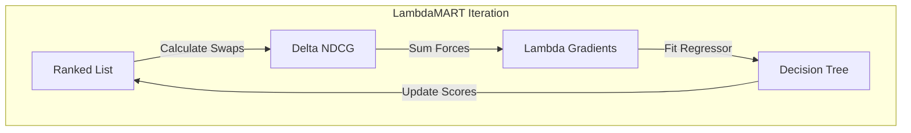
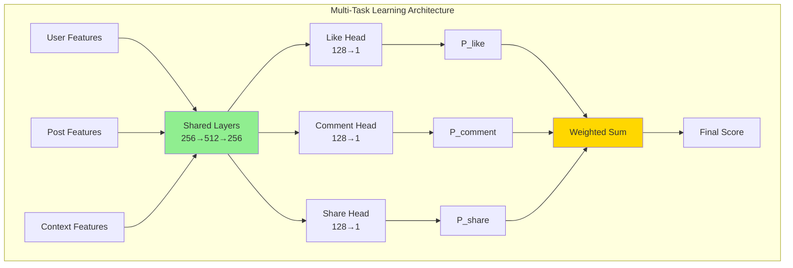
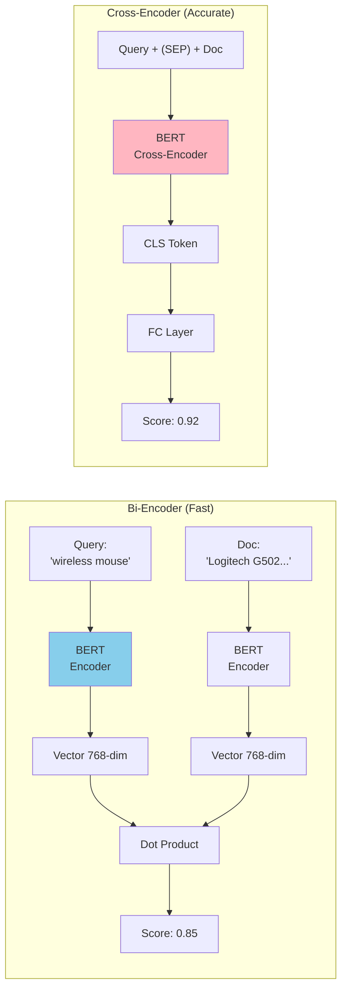

# Ranking Models: Learn to Rank (LTR) & Neural Ranking

> Deep dive into the algorithms that sort the world's information, from Gradient Boosted Trees to Transformers.

[← Production](10-recommender-system-production.md) | **Part 3 of 3** | [System Design Examples →](system-design-examples.md)

## Table of Contents

1.  [Introduction](#introduction)
2.  [The Evolution of LTR](#the-evolution-of-ltr)
3.  [Deep Dive: LambdaMART](#deep-dive-lambdamart)
4.  [Deep Dive: Neural Ranking](#deep-dive-neural-ranking)
5.  [Implementation Examples](#implementation-examples)
6.  [Production Considerations](#production-considerations)

---

## Introduction

### Ranking vs. Retrieval (Recall)

In system design interviews (like [News Feed](01-news-feed-ranking.md) or [Search](03-search-ranking.md)), we often split the problem into two stages:
1.  **Retrieval (Candidate Generation)**: Fast selection of ~1,000 relevant items from millions. (Optimized for **Recall**).
2.  **Ranking**: Precise sorting of those 1,000 items to show the top 10. (Optimized for **Precision** and **NDCG**).

This document focuses on **Stage 2: Ranking**. The goal is to learn a function $f(x)$ that assigns a score to each item such that the final list order maximizes user utility.

---

## The Evolution of LTR

Learning to Rank (LTR) algorithms are categorized by their **Loss Function**: how they calculate error during training.

### 1. Pointwise Approach
*   **Question**: "Is this specific item good?"
*   **Method**: Treat ranking as a standard **Regression** (predict score 0-5) or **Classification** (predict click/no-click) problem.
*   **Loss**: Mean Squared Error (MSE) or Log Loss.
*   **Intuition**: Grading exams. You grade each student's paper independently against an answer key.
*   **Flaw**: It ignores position. Predicting a 4.9 instead of 5.0 for the top result is much worse than predicting 2.9 instead of 3.0 for the 100th result, but MSE treats them equally.

### 2. Pairwise Approach
*   **Question**: "Is Item A better than Item B?"
*   **Method**: Classify pairs of items. $f(A) > f(B)$.
*   **Loss**: Pairwise Ranking Loss (e.g., RankNet).
*   **Intuition**: A tennis tournament. You don't need to know the exact skill level of a player, only who wins in a match.
*   **Flaw**: Optimizing for the bottom of the list is wasteful. Getting the order of rank #900 vs #901 correct contributes to the loss but adds zero value to the user.

### 3. Listwise Approach
*   **Question**: "Is this entire list ordered perfectly?"
*   **Method**: Optimize the ranking metric (NDCG, MAP) directly.
*   **Loss**: Listwise Loss (e.g., LambdaRank, SoftRank).
*   **Intuition**: Curating a playlist. The "vibe" and flow of the whole list matter. You care most about the top songs.
*   **Advantage**: Directly optimizes what we care about (NDCG).

### Comparison Summary

| Aspect | Pointwise | Pairwise | Listwise |
|--------|-----------|----------|----------|
| **Granularity** | Single item | Item pairs | Entire list |
| **Loss Function** | MSE / Log Loss | Pairwise Ranking Loss | NDCG / MAP Loss |
| **Training Complexity** | $O(N)$ | $O(N^2)$ | $O(N \log N)$ |
| **Pros** | Simple, fast | Better than pointwise | Directly optimizes metric |
| **Cons** | Ignores position | Wasteful for low ranks | Computationally intensive |
| **Examples** | Linear Regression | RankNet, LambdaRank | LambdaMART, ListNet |
| **Use Case** | Quick baseline | Medium-scale ranking | Production search engines |


## Deep Dive: LambdaMART

**LambdaMART** is the industry standard for search ranking (used by Bing, Yandex, and historically Google). It combines **Gradient Boosting Trees (MART)** with **Lambda Gradients**.

### Intuition: The Physics of Ranking

Directly optimizing NDCG is impossible because it's non-differentiable (sorting is a discrete operation). LambdaRank solves this with a physics analogy.

Imagine items in a list are physical objects.
*   **Lambda ($\lambda$)**: A "force" or vector attached to each item.
*   **Direction**: Pushes relevant items UP and irrelevant items DOWN.
*   **Magnitude**: Proportional to the **gain in NDCG** if we swap this item with another.

If swapping Item A (Rank 5) and Item B (Rank 3) would give a huge boost to NDCG, the $\lambda$ force pushing A up and B down will be very strong.

### Algorithm Steps
1.  **Calculate Lambdas**: For every pair of items, calculate the $\Delta NDCG$ if swapped. Sum these forces to get a single $\lambda$ gradient for each item.
2.  **Train Tree**: Train a Gradient Boosted Tree to predict these $\lambda$ values (not the relevance score itself!).
3.  **Update**: The tree learns which features (e.g., "Title Match") predict a strong upward force.

### Mathematical Formulation

For a query with documents ranked by current model scores $s_1, s_2, ..., s_N$:

**Lambda Gradient for document $i$:**
$$
\lambda_i = \sum_{j} \lambda_{ij}
$$

where $\lambda_{ij}$ (the pairwise lambda) is:
$$
\lambda_{ij} = \frac{\partial C}{\partial s_i} \cdot |\Delta NDCG_{ij}|
$$

*   $\frac{\partial C}{\partial s_i}$: Standard pairwise gradient (from cross-entropy loss)
*   $|\Delta NDCG_{ij}|$: Magnitude of NDCG change if we swap $i$ and $j$

**Worked Example:**
Query: "wireless mouse"
Ranked List (by current model):
1.  Doc A (Relevance: 2) - *should be lower*
2.  Doc B (Relevance: 4) - *perfect position*
3.  Doc C (Relevance: 3) - *should be higher*

If we swap A and C:
*   Current NDCG@3: 0.75
*   New NDCG@3: 0.85
*   $\Delta NDCG = 0.10$ (large!)

Therefore:
*   $\lambda_A$ gets a **strong downward force** (negative)
*   $\lambda_C$ gets a **strong upward force** (positive)




## Deep Dive: Neural Ranking

While LambdaMART rules tabular data (Search), **Neural Networks** dominate when we have rich unstructured data (News Feed images, text).

### 1. Multi-Task Learning (MTL)
Used in **News Feed Ranking**. Instead of predicting a single "relevance" score, we predict multiple user behaviors simultaneously.

*   **Why?** A "Like" is different from a "Share".
*   **Architecture**: Shared bottom layers (learning common features) + Task-specific towers.
*   **Loss**: Weighted sum of Log Loss for each task.
    *   $L_{total} = w_1 L_{like} + w_2 L_{comment} + w_3 L_{share}$



### 2. Cross-Encoders (BERT)
Used in **Search Re-ranking**.
*   **Bi-Encoder (Fast)**: Vector(Query) $\cdot$ Vector(Doc). Fast but loses nuance.
*   **Cross-Encoder (Slow but Accurate)**: Feed `[CLS] Query [SEP] Doc` into BERT. The self-attention mechanism allows every query word to interact with every document word.
*   **Trade-off**: Too slow for 1000 items. Used only for the top 50 re-ranking.




## Feature Engineering for Ranking

**The 80/20 Rule**: In LTR, feature engineering accounts for 80% of model performance. Let's build a comprehensive feature extractor.

### Feature Categories

#### 1. Query Features
*   **query_length**: Number of terms
*   **query_idf**: Average IDF (Inverse Document Frequency) of terms
*   **has_brand**: Boolean (contains brand name?)
*   **has_numbers**: Boolean (e.g., "iphone 15")

#### 2. Document Features
*   **doc_pagerank**: Authority score
*   **doc_freshness**: `1 / (days_since_published + 1)`
*   **doc_length**: Number of words
*   **avg_rating**: User rating (1-5)
*   **num_reviews**: `log(1 + review_count)`

#### 3. Query-Document Match Features
*   **bm25_title**: BM25 score on title
*   **bm25_body**: BM25 score on body  
*   **exact_match**: Query appears verbatim?
*   **term_coverage**: % of query terms in doc
*   **cosine_similarity**: Vector(Query) · Vector(Doc)

#### 4. User Features (Personalization)
*   **user_click_history**: Has user clicked this category before?
*   **avg_dwell_time**: Average time user spends on similar docs
*   **user_location_match**: Doc location matches user location?

### Implementation

```python
import numpy as np
from sklearn.feature_extraction.text import TfidfVectorizer

class RankingFeatureExtractor:
    """Extract 50+ features for LTR"""
    
    def __init__(self):
        self.vectorizer = TfidfVectorizer()
        
    def extract(self, query, document, user=None):
        """Extract all features for a query-document pair"""
        features = {}
        
        # 1. Query Features
        features.update(self._query_features(query))
        
        # 2. Document Features  
        features.update(self._document_features(document))
        
        # 3. Query-Document Features
        features.update(self._query_doc_features(query, document))
        
        # 4. User Features (if available)
        if user:
            features.update(self._user_features(user, document))
            
        return np.array(list(features.values()))
    
    def _query_features(self, query):
        return {
            'query_length': len(query.split()),
            'query_avg_word_length': np.mean([len(w) for w in query.split()]),
            'has_numbers': int(any(c.isdigit() for c in query))
        }
    
    def _document_features(self, doc):
        return {
            'doc_length': len(doc.text.split()),
            'doc_freshness': 1.0 / (doc.days_old + 1),
            'doc_pagerank': doc.pagerank,
            'num_reviews_log': np.log1p(doc.num_reviews)
        }
    
    def _query_doc_features(self, query, doc):
        # BM25 (simplified)
        bm25_score = self._compute_bm25(query, doc.title)
        
        # Exact match
        exact_match = int(query.lower() in doc.title.lower())
        
        # Term coverage
        query_terms = set(query.lower().split())
        doc_terms = set(doc.title.lower().split())
        coverage = len(query_terms & doc_terms) / len(query_terms) if query_terms else 0
        
        return {
            'bm25_title': bm25_score,
            'exact_match': exact_match,
            'term_coverage': coverage
        }
    
    def _user_features(self, user, doc):
        return {
            'user_category_affinity': user.get_category_affinity(doc.category),
            'location_match': int(user.location == doc.location)
        }
    
    def _compute_bm25(self, query, text, k1=1.5, b=0.75):
        """Simplified BM25 calculation"""
        # In production, use a proper BM25 library
        terms = query.lower().split()
        score = 0
        for term in terms:
            tf = text.lower().count(term)
            score += tf / (tf + k1)
        return score
```

---

## Implementation Examples

### 1. LambdaMART with LightGBM (Production-Ready)

```python
import lightgbm as lgb
import numpy as np
import pandas as pd
from sklearn.model_selection import GroupKFold

class LambdaMARTRanker:
    """
    Production-ready LambdaMART implementation for learning-to-rank
    """
    
    def __init__(self, n_estimators=100, learning_rate=0.1, max_depth=6):
        self.params = {
            'objective': 'lambdarank',
            'metric': 'ndcg',
            'ndcg_eval_at': [1, 3, 5, 10],
            'n_estimators': n_estimators,
            'learning_rate': learning_rate,
            'max_depth': max_depth,
            'num_leaves': 2 ** max_depth - 1,
            'min_child_samples': 20,
            'random_state': 42
        }
        self.model = None
        
    def prepare_data(self, df, feature_cols, label_col='relevance', query_col='query_id'):
        """
        Prepare data for LambdaMART
        
        Args:
            df: DataFrame with columns [query_id, doc_id, relevance, feature1, feature2, ...]
            feature_cols: List of feature column names
            label_col: Relevance label column (0-4 scale)
            query_col: Query grouping column
            
        Returns:
            X, y, groups
        """
        # Sort by query_id (CRITICAL for grouping!)
        df = df.sort_values(query_col)
        
        X = df[feature_cols].values
        y = df[label_col].values
        
        # Calculate group sizes (number of docs per query)
        groups = df.groupby(query_col).size().values
        
        return X, y, groups
    
    def train(self, X_train, y_train, groups_train, 
              X_val=None, y_val=None, groups_val=None):
        """Train with validation set"""
        
        train_data = lgb.Dataset(X_train, label=y_train, group=groups_train)
        
        valid_sets = [train_data]
        valid_names = ['train']
        
        if X_val is not None:
            val_data = lgb.Dataset(X_val, label=y_val, group=groups_val, reference=train_data)
            valid_sets.append(val_data)
            valid_names.append('valid')
        
        # Train
        self.model = lgb.train(
            self.params,
            train_data,
            num_boost_round=self.params['n_estimators'],
            valid_sets=valid_sets,
            valid_names=valid_names,
            callbacks=[
                lgb.early_stopping(stopping_rounds=50),
                lgb.log_evaluation(period=10)
            ]
        )
        
        return self
    
    def predict(self, X):
        """Predict ranking scores"""
        return self.model.predict(X)
    
    def rank(self, X):
        """Get ranked indices (highest score first)"""
        scores = self.predict(X)
        return np.argsort(scores)[::-1]
    
    def save(self, path):
        """Save model to disk"""
        self.model.save_model(path)
    
    @classmethod
    def load(cls, path):
        """Load model from disk"""
        ranker = cls()
        ranker.model = lgb.Booster(model_file=path)
        return ranker


# Example Usage
if __name__ == "__main__":
    # Sample data: 2 queries, 4 docs total
    data = {
        'query_id': [1, 1, 2, 2],
        'doc_id': [101, 102, 201, 202],
        'relevance': [3, 0, 4, 1],  # 0-4 scale
        'bm25': [0.8, 0.1, 0.9, 0.2],
        'pagerank': [0.5, 0.3, 0.7, 0.1],
        'freshness': [0.9, 0.2, 0.8, 0.5]
    }
    df = pd.DataFrame(data)
    
    feature_cols = ['bm25', 'pagerank', 'freshness']
    
    # Prepare
    ranker = LambdaMARTRanker(n_estimators=100, learning_rate=0.1)
    X, y, groups = ranker.prepare_data(df, feature_cols)
    
    # Train
    ranker.train(X, y, groups)
    
    # Predict
    test_X = np.array([[0.7, 0.4, 0.8], [0.3, 0.2, 0.1]])
    scores = ranker.predict(test_X)
    print(f"Scores: {scores}")  # Higher = more relevant
    
    # Feature importance
    print(f"Feature importance: {ranker.model.feature_importance()}")
```

### 2. Pairwise RankNet with PyTorch

```python
import torch
import torch.nn as nn

class RankNet(nn.Module):
    def __init__(self, input_dim):
        super().__init__()
        self.model = nn.Sequential(
            nn.Linear(input_dim, 64),
            nn.ReLU(),
            nn.Linear(64, 1)  # Output scalar score
        )

    def forward(self, x_i, x_j):
        # Predict scores for both items
        s_i = self.model(x_i)
        s_j = self.model(x_j)
        return s_i, s_j

# Loss Function
def pairwise_loss(s_i, s_j, target_diff):
    # target_diff = 1 if i > j, 0 if j > i
    # Sigmoid to get probability P(i > j)
    P_ij = torch.sigmoid(s_i - s_j)
    return nn.BCELoss()(P_ij, target_diff)
```

---

## Evaluation Metrics

### NDCG@K (Normalized Discounted Cumulative Gain)

The gold standard metric for ranking. It measures both **relevance** and **position**.

**Formula:**
$$
NDCG@K = \frac{DCG@K}{IDCG@K}
$$

where:
$$
DCG@K = \sum_{i=1}^{K} \frac{2^{rel_i} - 1}{\log_2(i + 1)}
$$

*   $rel_i$: Relevance of item at position $i$ (typically 0-4)
*   $IDCG@K$: **Ideal** DCG (if items were perfectly sorted)

### Worked Example: NDCG@5

**Query**: "wireless mouse"  
**Ground Truth Relevance**: [2, 4, 0, 3, 1]  
**Ranked List** (by model): [Doc B, Doc D, Doc A, Doc E, Doc C]  
**Relevances**: [4, 3, 2, 1, 0]

**Step 1: Calculate DCG@5**
$$
\begin{align*}
DCG@5 &= \frac{2^4 - 1}{\log_2(2)} + \frac{2^3 - 1}{\log_2(3)} + \frac{2^2 - 1}{\log_2(4)} + \frac{2^1 - 1}{\log_2(5)} + \frac{2^0 - 1}{\log_2(6)} \\
&= \frac{15}{1} + \frac{7}{1.585} + \frac{3}{2} + \frac{1}{2.322} + \frac{0}{2.585} \\
&= 15 + 4.42 + 1.5 + 0.43 + 0 \\
&= 21.35
\end{align*}
$$

**Step 2: Calculate IDCG@5** (Perfect ranking: [4, 3, 2, 1, 0])
$$
\begin{align*}
IDCG@5 &= \frac{15}{1} + \frac{7}{1.585} + \frac{3}{2} + \frac{1}{2.322} + \frac{0}{2.585} \\
&= 21.35 \quad \text{(same! Our model is perfect)}
\end{align*}
$$

**Step 3: NDCG@5**
$$
NDCG@5 = \frac{21.35}{21.35} = 1.0
$$

### Other Metrics

**MAP (Mean Average Precision)**
$$
MAP@K = \frac{1}{|Q|} \sum_{q=1}^{|Q|} \frac{1}{m_q} \sum_{k=1}^{K} P(k) \cdot rel(k)
$$

**MRR (Mean Reciprocal Rank)**
$$
MRR = \frac{1}{|Q|} \sum_{q=1}^{|Q|} \frac{1}{rank_q}
$$
where $rank_q$ is the position of the **first** relevant item.

### Implementation

```python
import numpy as np

def dcg_at_k(relevances, k):
    """Discounted Cumulative Gain"""
    relevances = np.asarray(relevances)[:k]
    if relevances.size == 0:
        return 0.0
    
    # Formula: sum((2^rel - 1) / log2(i + 2))
    discounts = np.log2(np.arange(2, relevances.size + 2))
    return np.sum((2**relevances - 1) / discounts)

def ndcg_at_k(relevances, k):
    """Normalized DCG"""
    dcg_max = dcg_at_k(sorted(relevances, reverse=True), k)
    if dcg_max == 0:
        return 0.0
    return dcg_at_k(relevances, k) / dcg_max

# Example
ranked_relevances = [4, 3, 2, 1, 0]
print(f"NDCG@5: {ndcg_at_k(ranked_relevances, 5):.3f}")  # 1.0 (perfect)

# Worse ranking
worse_relevances = [0, 1, 2, 3, 4]
print(f"NDCG@5: {ndcg_at_k(worse_relevances, 5):.3f}")  # 0.497 (bad!)
```

---

## Production Considerations

### 1. The Cascade Architecture
You cannot run a heavy LambdaMART or BERT model on 10 million items.
*   **L1 Retrieval**: 10M $\to$ 10K (Inverted Index / ANN)
*   **L2 Light Ranker**: 10K $\to$ 500 (Pointwise XGBoost / Vector Dot Product)
*   **L3 Heavy Ranker**: 500 $\to$ 10 (LambdaMART / Cross-Encoder)

### 2. Position Bias
**Problem**: Users click the top result simply because it's at the top (Trust Bias).
**Fix**:
*   **Training**: Add "Position" as a feature during training.
*   **Inference**: Set "Position" to a fixed value (e.g., 0) during prediction. This teaches the model to predict relevance *as if* the item were at the top.

### 3. Online Learning
Offline metrics (NDCG) don't always match Online metrics (Revenue).
*   **Bandits**: Use Multi-Armed Bandits (Thompson Sampling) to explore new items that the offline model is unsure about.
