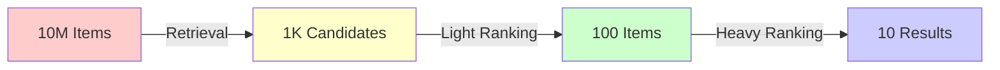
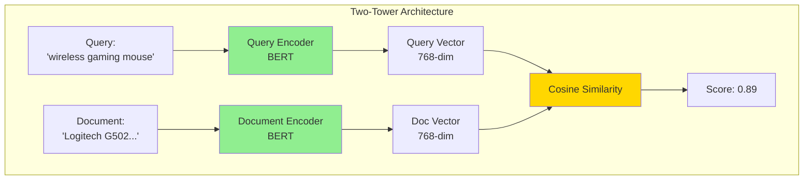
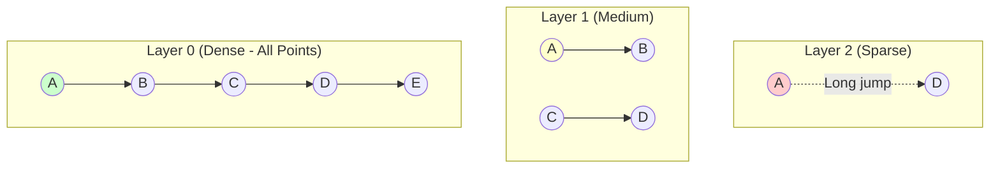

# Retrieval & Candidate Generation: From Millions to Thousands

> The first stage of the ranking pipeline: Fast, scalable search from 10M+ items down to 1K candidates.

[← Ranking](11-ranking-models-ltr.md) | **Retrieval (Stage 1)** | [News Feed →](01-news-feed-ranking.md)

## Table of Contents

1.  [Introduction](#introduction)
2.  [Sparse Retrieval (Keyword-Based)](#sparse-retrieval-keyword-based)
3.  [Dense Retrieval (Vector Search)](#dense-retrieval-vector-search)
4.  [ANN Algorithms](#ann-algorithms)
5.  [Hybrid Retrieval](#hybrid-retrieval)
6.  [Evaluation Metrics](#evaluation-metrics)
7.  [Production Considerations](#production-considerations)

---

## Introduction

### The Retrieval-Ranking Funnel

In large-scale search and recommendation systems, we cannot afford to score all 10 million items. Instead, we use a **multi-stage funnel**:



*   **Retrieval (This Doc)**: Optimize for **Recall**. Fast, approximate. Goal: Don't miss relevant items.
*   **Ranking (Doc 11)**: Optimize for **Precision**. Slow, accurate. Goal: Perfect ordering of top results.

### Retrieval vs. Ranking Trade-offs

| Aspect | Retrieval | Ranking |
|--------|-----------|---------|
| **Goal** | High Recall | High Precision |
| **Latency** | <50ms | <200ms |
| **Candidates** | 10M → 1K | 1K → 10 |
| **Model** | Simple (BM25, Dot Product) | Complex (LambdaMART, BERT) |
| **False Negatives** | Catastrophic | Acceptable |
| **False Positives** | Acceptable | Problematic |

---

## Sparse Retrieval (Keyword-Based)

Sparse retrieval represents documents as **high-dimensional sparse vectors** where each dimension corresponds to a word in the vocabulary.

### BM25 (Best Matching 25)

The industry standard for keyword search. Used by Elasticsearch, Solr, and Lucene.

**Formula:**
$$
BM25(q, d) = \sum_{t \in q} IDF(t) \cdot \frac{TF(t, d) \cdot (k_1 + 1)}{TF(t, d) + k_1 \cdot (1 - b + b \cdot \frac{|d|}{avgdl})}
$$

where:
*   $TF(t, d)$: Term frequency (how many times term $t$ appears in document $d$)
*   $IDF(t) = \log \frac{N - DF(t) + 0.5}{DF(t) + 0.5}$: Inverse document frequency
*   $|d|$: Document length
*   $avgdl$: Average document length in corpus
*   $k_1 = 1.5$, $b = 0.75$: Tuning parameters

**Intuition:**
*   **TF**: "If a term appears many times, it's probably important"
*   **IDF**: "But common words like 'the' shouldn't count much"
*   **Length normalization**: "Don't favor long docs just for having more words"

### Implementation

```python
import math
from collections import Counter

class BM25:
    def __init__(self, corpus, k1=1.5, b=0.75):
        self.k1 = k1
        self.b = b
        self.corpus = corpus
        self.N = len(corpus)
        self.avgdl = sum(len(doc) for doc in corpus) / self.N
        
        # Pre-compute IDF for all terms
        df = Counter()
        for doc in corpus:
            for term in set(doc):
                df[term] += 1
        
        self.idf = {}
        for term, doc_freq in df.items():
            self.idf[term] = math.log((self.N - doc_freq + 0.5) / (doc_freq + 0.5))
    
    def score(self, query, document):
        score = 0.0
        doc_len = len(document)
        
        for term in query:
            if term not in document:
                continue
            
            tf = document.count(term)
            idf = self.idf.get(term, 0)
            
            numerator = tf * (self.k1 + 1)
            denominator = tf + self.k1 * (1 - self.b + self.b * (doc_len / self.avgdl))
            
            score += idf * (numerator / denominator)
        
        return score

# Example
corpus = [
    ["wireless", "mouse", "gaming"],
    ["wireless", "keyboard"],
    ["gaming", "laptop", "mouse"]
]
query = ["wireless", "gaming", "mouse"]

ranker = BM25(corpus)
scores = [ranker.score(query, doc) for doc in corpus]
print(f"Scores: {scores}")  # [high, medium, medium]
```

### Elasticsearch Integration

```python
from elasticsearch import Elasticsearch

es = Elasticsearch(["http://localhost:9200"])

# Index documents
es.indices.create(index="products", ignore=400)
es.index(index="products", id=1, body={
    "title": "Wireless Gaming Mouse",
    "description": "High-performance mouse for gamers"
})

# Search with BM25
query = {
    "query": {
        "multi_match": {
            "query": "wireless mouse",
            "fields": ["title^2", "description"],  # title 2x more important
            "type": "best_fields"
        }
    }
}

results = es.search(index="products", body=query)
```

---

## Dense Retrieval (Vector Search)

Dense retrieval encodes queries and documents as **low-dimensional dense vectors** (embeddings) and measures similarity in vector space.

### Two-Tower Model (Dual Encoder)

The standard architecture for dense retrieval.



**Key Advantage**: Documents can be encoded **offline**. At query time, only encode the query and search pre-computed vectors with ANN.

### Implementation

```python
import torch
import torch.nn as nn
from transformers import BertModel, BertTokenizer

class TwoTowerModel(nn.Module):
    def __init__(self, embedding_dim=128):
        super().__init__()
        
        # Shared or separate BERT encoders
        self.query_encoder = BertModel.from_pretrained('bert-base-uncased')
        self.doc_encoder = BertModel.from_pretrained('bert-base-uncased')
        
        # Project to smaller embedding space
        self.query_proj = nn.Linear(768, embedding_dim)
        self.doc_proj = nn.Linear(768, embedding_dim)
        
    def encode_query(self, query_ids, query_mask):
        # BERT encoding
        outputs = self.query_encoder(query_ids, attention_mask=query_mask)
        cls_embedding = outputs.last_hidden_state[:, 0, :]  # [CLS] token
        
        # Project
        query_vec = self.query_proj(cls_embedding)
        
        # L2 normalize for cosine similarity
        return torch.nn.functional.normalize(query_vec, p=2, dim=1)
    
    def encode_doc(self, doc_ids, doc_mask):
        outputs = self.doc_encoder(doc_ids, attention_mask=doc_mask)
        cls_embedding = outputs.last_hidden_state[:, 0, :]
        doc_vec = self.doc_proj(cls_embedding)
        return torch.nn.functional.normalize(doc_vec, p=2, dim=1)
    
    def forward(self, query_ids, query_mask, doc_ids, doc_mask):
        query_vec = self.encode_query(query_ids, query_mask)
        doc_vec = self.encode_doc(doc_ids, doc_mask)
        
        # Cosine similarity (normalized dot product)
        similarity = torch.sum(query_vec * doc_vec, dim=1)
        return similarity

# Training with contrastive loss
def contrastive_loss(pos_scores, neg_scores, temperature=0.1):
    """InfoNCE loss for training Two-Tower"""
    # pos_scores: [batch_size] - scores for positive pairs
    # neg_scores: [batch_size, num_negatives] - scores for negative pairs
    
    pos_exp = torch.exp(pos_scores / temperature)
    neg_exp = torch.sum(torch.exp(neg_scores / temperature), dim=1)
    
    loss = -torch.log(pos_exp / (pos_exp + neg_exp))
    return loss.mean()
```

---

## ANN Algorithms

Exact nearest neighbor search requires comparing the query to **all** documents (O(N)). For N=100M, this is too slow. **Approximate Nearest Neighbor (ANN)** algorithms trade slight accuracy for massive speedups.

### FAISS (Facebook AI Similarity Search)

Industry-standard library for billion-scale vector search.

```python
import faiss
import numpy as np

# 1. Build Index
dim = 128  # Vector dimension
num_vectors = 1_000_000

# Generate random vectors (in production, use your Two-Tower model)
vectors = np.random.random((num_vectors, dim)).astype('float32')

# Choose index type
index = faiss.IndexFlatL2(dim)  # Exact search (baseline)
# index = faiss.IndexIVFFlat(quantizer, dim, 100)  # IVF (faster)
# index = faiss.IndexHNSWFlat(dim, 32)  # HNSW (best quality/speed)

# Add vectors
index.add(vectors)

# 2. Search
query = np.random.random((1, dim)).astype('float32')
k = 10  # Return top-10

distances, indices = index.search(query, k)
print(f"Top-10 indices: {indices[0]}")
print(f"Distances: {distances[0]}")
```

### HNSW (Hierarchical Navigable Small Worlds)

**Intuition**: A multi-layer graph where top layers have long-range "highway" connections and bottom layers have local connections.



**Search Process:**
1.  Start at entry point in top layer
2.  Greedily move to closest neighbor
3.  When stuck, drop to next layer
4.  Repeat until reaching layer 0

**Complexity**: O(log N) vs O(N) for brute force

### Comparison Table

| Algorithm | Build Time | Search Speed | Recall@10 | Memory | Use Case |
|-----------|------------|--------------|-----------|--------|----------|
| **Flat** | O(N) | O(N) | 100% | High | Baseline, <1M docs |
| **IVF** | O(N log K) | O(√N) | 95% | Medium | 1M-10M docs |
| **HNSW** | O(N log N) | O(log N) | 98% | High | 10M-1B docs, quality critical |
| **PQ** | O(N) | O(N/8) | 90% | Low | Billion-scale, memory-constrained |

---

## Hybrid Retrieval

Combining sparse (BM25) and dense (vector) retrieval leverages **keyword precision** and **semantic recall**.

### Reciprocal Rank Fusion (RRF)

```python
def reciprocal_rank_fusion(sparse_results, dense_results, k=60):
    """
    Combine rankings from sparse and dense retrieval
    
    Args:
        sparse_results: [(doc_id, bm25_score), ...]
        dense_results: [(doc_id, cosine_score), ...]
        k: RRF constant (default: 60)
    
    Returns:
        List of (doc_id, rrf_score) sorted by score
    """
    scores = {}
    
    # Sparse rankings
    for rank, (doc_id, _) in enumerate(sparse_results, start=1):
        scores[doc_id] = scores.get(doc_id, 0) + 1 / (k + rank)
    
    # Dense rankings
    for rank, (doc_id, _) in enumerate(dense_results, start=1):
        scores[doc_id] = scores.get(doc_id, 0) + 1 / (k + rank)
    
    # Sort by combined score
    return sorted(scores.items(), key=lambda x: x[1], reverse=True)

# Example
sparse = [(101, 8.5), (102, 7.2), (103, 6.1)]
dense = [(102, 0.95), (105, 0.89), (101, 0.82)]

combined = reciprocal_rank_fusion(sparse, dense)
print(combined)  # Doc 102 and 101 rank high in both
```

---

## Evaluation Metrics

### Recall@K

**Definition**: % of relevant items found in top-K results.

$$
Recall@K = \frac{|\{relevant\} \cap \{retrieved\_top\_K\}|}{|\{relevant\}|}
$$

**Example:**
*   Ground truth relevant: {A, B, C, D, E} (5 items)
*   Retrieved top-10: [A, X, B, Y, Z, W, C, Q, P, R]
*   Relevant in top-10: {A, B, C} (3 items)
*   **Recall@10** = 3/5 = 0.6

```python
def recall_at_k(relevant_ids, retrieved_ids, k):
    retrieved_k = set(retrieved_ids[:k])
    relevant_set = set(relevant_ids)
    return len(retrieved_k & relevant_set) / len(relevant_set)

# Example
relevant = [1, 3, 5, 7, 9]
retrieved = [1, 2, 3, 4, 6, 7, 8, 10]

print(f"Recall@5: {recall_at_k(relevant, retrieved, 5):.2f}")  # 0.40
print(f"Recall@8: {recall_at_k(relevant, retrieved, 8):.2f}")  # 0.60
```

---

## Production Considerations

### 1. Index Refresh Strategy

**Challenge**: New documents must be searchable quickly.

**Strategies:**
*   **Full Rebuild**: Nightly (for static corpora)
*   **Incremental Update**: Real-time (Elasticsearch `_update`)
*   **Dual Index**: Write to Index A, read from Index B, swap when ready

### 2. Latency Budgets

Typical targets for 10M document corpus:
*   **BM25 (Elasticsearch)**: p95 <30ms
*   **FAISS (HNSW)**: p95 <5ms
*   **Two-Tower encode**: p95 <20ms (BERT on GPU)

**Optimization:**
*   **Batch queries**: Process 64 queries at once
*   **GPU inference**: 10× faster than CPU for BERT
*   **Quantization**: INT8 reduces size and increases speed

### 3. Sharding for Billion-Scale

For N > 100M documents:
*   **Partition by category**: "Electronics", "Books", etc.
*   **Hash-based sharding**: `doc_id % 10` across 10 machines
*   **Query routing**: Send query to all shards, merge results (Map-Reduce)
