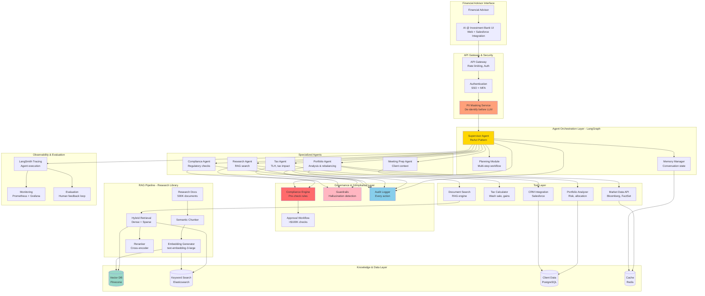

# Investment Bank Agentic AI System - Enterprise Case Study

## Interview Format: Conversational & Iterative

This case study simulates a real-world enterprise AI system design interview focused on agentic AI for wealth management at Investment Bank. It reflects 2025 best practices in multi-agent orchestration, governance, tool use, and production deployment in regulated financial services.

---

## Interview Timeline (45-60 minutes)

| Phase | Time | Your Actions |
|-------|------|--------------|
| Requirements Gathering | 7-10 min | Ask clarifying questions, understand business context |
| High-Level Design | 12-15 min | Draw architecture, explain agent patterns |
| Deep Dive | 25-30 min | Detail orchestration, governance, tool integration |
| Trade-offs & Scale | 5-8 min | Discuss frameworks, compliance, alternatives |

---

## 🎯 Problem Statement

**Interviewer (Senior Architect):** "Design an agentic AI system for Investment Bank's Wealth Management division that can assist Financial Advisors in providing personalized advice to clients. The system should handle complex multi-step workflows like portfolio rebalancing, tax-loss harvesting recommendations, and estate planning suggestions while ensuring compliance with financial regulations."

---

## Phase 1: Requirements Gathering (7-10 minutes)

### Your Response Strategy

**You:** "This is a mission-critical system for a regulated industry. Let me understand the requirements thoroughly to ensure we design for both innovation and compliance."

### Critical Questions to Ask

**You:** "Let me clarify the scope:

1. **Business Context & Use Cases:**
   - What are the primary agent workflows? (portfolio analysis, tax optimization, compliance checks?)
   - Who are the end users? (Financial Advisors only or clients directly?)
   - What's the typical session flow? (single query vs multi-turn planning?)
   - Human-in-the-loop for final decisions?
   - Integration with existing Genome platform?

2. **Data Sources & Knowledge Base:**
   - What data do agents need access to? (client portfolios, market data, research?)
   - Internal knowledge base size? (investment strategies, compliance docs?)
   - Real-time data requirements? (live market feeds?)
   - Data residency and privacy constraints?

3. **Agent Capabilities:**
   - What tools do agents need? (portfolio analysis, tax calculators, CRM?)
   - Can agents execute actions or only recommend? (read-only vs transactional?)
   - Multi-agent collaboration required?
   - Reasoning and planning complexity? (ReAct, Chain-of-Thought, Plan-Execute?)

4. **Compliance & Governance:**
   - Regulatory frameworks? (SEC, FINRA, GDPR?)
   - Approval workflows for recommendations?
   - Audit trail requirements? (explainability, decision logging?)
   - What actions require human approval?
   - Risk management guardrails?

5. **Scale & Performance:**
   - How many Financial Advisors? (concurrent users?)
   - Queries per day?
   - Response time expectations?
   - Cost constraints per interaction?

6. **Evaluation & Success Metrics:**
   - How to measure agent quality? (accuracy, advisor satisfaction?)
   - Production monitoring requirements?
   - A/B testing capability?"

### Interviewer's Answers

**Interviewer:** "Here's the scope:

- **Business Context:** Support 16,000 Financial Advisors in Investment Bank Wealth Management
- **Primary Use Cases:** 
  - Portfolio analysis and rebalancing recommendations
  - Tax-loss harvesting suggestions
  - Client meeting preparation (pulling relevant research, market insights)
  - Compliance checks on recommendations
  - Estate planning strategy suggestions
- **Users:** Financial Advisors (internal tool, not client-facing initially)
- **Session Flow:** Multi-turn conversations (avg 5-7 turns), complex planning workflows
- **Human-in-the-Loop:** Yes, advisors make final decisions, system provides recommendations

**Data Sources:**
- Client portfolios (accounts, holdings, transactions) - 10M+ client profiles
- Investment Bank research library (investment strategies, analyst reports) - 500K documents
- Market data feeds (real-time prices, fundamentals) - Bloomberg, FactSet
- Regulatory knowledge base (compliance rules, product guidelines) - 100K documents
- CRM system (client preferences, meeting notes) - integrated with Salesforce

**Agent Capabilities:**
- Tools needed: Portfolio analyzer, tax calculator, research search, compliance checker, CRM integration
- Agents recommend only (no automatic execution of trades)
- Multi-agent collaboration: Yes (research agent, tax agent, compliance agent, etc.)
- Planning: Complex multi-step reasoning required

**Compliance & Governance:**
- SEC, FINRA regulations (strict requirements)
- All recommendations must cite sources
- All agent reasoning must be explainable and auditable
- Recommendations >$100K or certain product types require compliance pre-approval
- No PII can be logged to external LLM providers
- 100% audit trail for 7 years

**Scale:**
- 16,000 Financial Advisors
- 5,000 queries/day (~60 QPS peak)
- Average 5-7 agent interactions per query
- Response time: <10 seconds per agent response
- Cost target: <$2 per advisor query

**Success Metrics:**
- Advisor satisfaction: >4.5/5
- Recommendation adoption rate: >60%
- Time savings: 30% reduction in research time
- Compliance: Zero regulatory violations
- Accuracy: >95% when fact-checking recommendations"

### Requirements Summary & Calculations

**You:** "Perfect! Let me summarize with detailed analysis:

#### Functional Requirements

**Core Agent Workflows:**
1. **Portfolio Analysis Agent:**
   - Analyze client holdings, asset allocation, risk profile
   - Identify rebalancing opportunities
   - Calculate performance attribution

2. **Tax Optimization Agent:**
   - Identify tax-loss harvesting opportunities
   - Calculate wash sale constraints
   - Estimate tax impact of trades

3. **Research Agent:**
   - Search Investment Bank research library
   - Pull relevant analyst reports, market insights
   - Summarize investment themes

4. **Compliance Agent:**
   - Validate recommendations against regulations
   - Check product suitability
   - Flag recommendations requiring approval

5. **Meeting Preparation Agent:**
   - Aggregate client context (portfolio, preferences, past meetings)
   - Prepare discussion points
   - Generate meeting agenda

**Agent Orchestration:**
- Supervisor agent to coordinate specialist agents
- Support for complex multi-step workflows
- Context sharing between agents
- Conversation memory (5-7 turns)

**Knowledge & Data Integration:**
- RAG system for research library (500K docs)
- Vector search for semantic retrieval
- Real-time market data integration
- CRM integration for client context
- Secure data access controls

**Governance & Compliance:**
- All recommendations with source citations
- Explainable AI (show reasoning steps)
- Approval workflows for high-value/high-risk actions
- PII masking before LLM calls
- Complete audit logging
- Compliance pre-check before recommendation delivery

#### Non-Functional Requirements & Calculations

**Scale Analysis:**
- **Daily Volume:** 5,000 queries/day
- **Agent Calls:** 5,000 × 5.5 avg agents = **27,500 agent calls/day = 825K/month**
- **LLM Calls:** Each agent call = 1 LLM call + 0.5 tool calls avg = **1.24M LLM calls/month**
- **Peak Load:** 60 QPS × 5.5 agents = **330 concurrent agent executions**

**Latency Budget (10s per agent response):**
- Query parsing & routing: **200ms**
- Context retrieval (client data, research): **1.5s**
  - Client portfolio fetch: 500ms
  - RAG search (if needed): 800ms
  - Market data: 200ms
- Agent planning (LLM): **3-4s**
  - Input processing: 500ms
  - Token generation: 2.5-3.5s
- Tool execution: **2-3s** (portfolio analysis, tax calc)
- Compliance check: **1s**
- Response formatting: **500ms**
- **Total: 8.7-10.7s** ✓

**Token & Cost Analysis:**

**Per Query:**
- System prompt + agent instructions: 1,000 tokens
- Client context (portfolio, preferences): 2,000 tokens
- Retrieved research (RAG): 3,000 tokens
- Conversation history (5 turns): 1,500 tokens
- **Total input:** 7,500 tokens/call
- **Output:** 500 tokens/call (structured recommendation)

**Monthly Costs (GPT-4 vs Claude 3.5):**

*GPT-4:*
- Input: 1.24M calls × 7.5K tokens = 9.3B tokens × $30/1M = **$279,000**
- Output: 1.24M × 500 = 620M tokens × $60/1M = **$37,200**
- **Total: $316,200/month** = $63.24 per query ❌ WAY over budget

*Claude 3.5 Sonnet:*
- Input: 9.3B × $3/1M = **$27,900**
- Output: 620M × $15/1M = **$9,300**
- **Total: $37,200/month** = $7.44 per query (still over $2 target)

**Cost Optimization Strategies:**
- Semantic caching (70% cache hit) → **$11,160/month** = $2.23/query ✓
- Prompt compression (reduce context by 40%) → **$8,928/month** = $1.79/query ✓✓
- Smaller model for simple tasks (Haiku for routing) → save 30%

**Storage:**
- Research library embeddings: 500K docs × 10 chunks × 1536 dim × 4 bytes = **30GB**
- Conversation history: 5K/day × 8KB × 30 days = **1.2GB/month**
- Audit logs: 27.5K agent calls × 50KB = **1.4GB/day = 42GB/month**
- Total: **~75GB** (vector DB + logs)

**Data Privacy & Compliance:**
- **PII Masking:** All client names, SSNs, account numbers masked before LLM
- **Data Residency:** Client data stays in US data centers (no international routing)
- **Encryption:** End-to-end encryption for all data in transit and at rest
- **Access Control:** Role-based access (advisor can only see their clients)
- **Audit Logging:** Every agent action logged with timestamp, input, output, reasoning
- **Retention:** 7-year retention for regulatory compliance

#### Key Technical Challenges

1. **Compliance Integration:** How to ensure 100% of recommendations pass compliance checks before delivery?
2. **Explainability:** How to make agent reasoning transparent and auditable?
3. **Data Privacy:** How to use external LLMs while protecting PII?
4. **Cost Optimization:** How to meet $2/query target with complex workflows?
5. **Reliability:** How to handle API failures gracefully in multi-step workflows?
6. **Evaluation:** How to measure agent quality in production?

Correct?"

**Interviewer:** "Yes, excellent analysis. Proceed with the design."

---

## Phase 2: High-Level Design (12-15 minutes)

### Architecture Overview

**You:** "I'll design using a hybrid architecture: LangGraph for agent orchestration, RAG for knowledge retrieval, and a comprehensive governance layer for compliance. This follows Investment Bank's 'Lego Blocks' approach - composable, safe, and auditable."



### Data Flow - Example Use Case

**You:** "Let me walk through a complete workflow:

#### Use Case: Tax-Loss Harvesting Recommendation

```
1. Financial Advisor Query:
   "Generate tax-loss harvesting opportunities for client John Smith"
   
2. API Gateway:
   - Authenticate advisor (SSO)
   - Rate limit check (within limits)
   - Route to orchestration layer

3. PII Masking:
   - Detect "John Smith" → Replace with "CLIENT_12345"
   - Mask account numbers, SSNs
   - Pass sanitized query to agents

4. Supervisor Agent (LangGraph):
   - Parse query → Need: Portfolio data + Tax analysis
   - Plan workflow:
     a) Retrieve client portfolio
     b) Identify positions with losses
     c) Calculate tax impact
     d) Check wash sale constraints
     e) Generate recommendations
     f) Compliance check
   - Route to Portfolio Agent

5. Portfolio Agent:
   - Tool: Fetch portfolio from database
   - Output: "Client holds 1000 shares AAPL (cost $180, current $150) = $30K loss"
   - Return to Supervisor

6. Supervisor → Tax Agent:
   - Input: Portfolio with unrealized losses
   - Tax Agent uses Tax Calculator tool:
     - Calculate potential tax savings: $30K × 37% marginal rate = $11,100
     - Check wash sale: No AAPL purchases in last 30 days ✓
     - Alternative investment: Suggest similar ETF (VOO)
   - Output: Structured recommendation

7. Supervisor → Compliance Agent:
   - Input: Recommendation (sell AAPL, buy VOO)
   - Compliance checks:
     - Client suitability: Aggressive profile ✓
     - Product approval: VOO is approved ✓
     - Transaction size: $150K > $100K → Flag for approval
   - Output: "Requires supervisor approval"

8. Approval Workflow:
   - Notify compliance supervisor
   - Display recommendation with full reasoning
   - Wait for approval (async)

9. Supervisor → Meeting Prep Agent:
   - While waiting for approval, prepare presentation
   - Fetch: Client preferences, past meeting notes (CRM)
   - Generate: Talking points, charts, expected questions

10. Response Assembly:
    - Combine: Tax analysis + compliance status + presentation
    - Add citations: Link to tax code, product prospectus
    - De-mask: Replace CLIENT_12345 with "John Smith" (for advisor view only)
    
11. Audit Logging:
    - Log: Query, agent calls, tools used, reasoning, output
    - Store: 7 years for regulatory compliance
    
12. Return to Advisor:
    - Display: Dashboard with recommendation, pending approval, next steps
    - Enable: Edit, accept, reject options

Total Time: ~8 seconds
```

**Interviewer:** "Good. How do you implement the agent orchestration? Show me the code."

---

## Phase 3: Deep Dive - Implementation (25-30 minutes)

### 3.1 Agent Orchestration with LangGraph

**You:** "Here's the implementation using LangGraph (Investment Bank's preferred framework):

```python
from langgraph.graph import StateGraph, END
from langgraph.prebuilt import ToolExecutor
from langchain_anthropic import ChatAnthropic
from langchain.tools import Tool
from typing import TypedDict, Annotated, List, Dict
import operator
from datetime import datetime
import hashlib

# ==================== State Definition ====================

class AgentState(TypedDict):
    \"\"\"
    Shared state across all agents
    
    This is the single source of truth for the conversation
    \"\"\"
    # Conversation
    messages: Annotated[List[Dict], operator.add]
    query: str
    client_id: str  # Masked client ID
    advisor_id: str
    
    # Agent workflow
    current_agent: str
    next_action: str
    workflow_plan: List[str]
    step_index: int
    
    # Data & context
    client_portfolio: Dict
    market_data: Dict
    research_context: List[Dict]
    conversation_history: List[Dict]
    
    # Recommendations & analysis
    recommendations: List[Dict]
    tax_analysis: Dict
    compliance_status: Dict
    
    # Governance
    requires_approval: bool
    approved: bool
    approval_reason: str
    pii_masked: bool
    audit_trail: List[Dict]
    
    # Tools & outputs
    tool_calls: List[Dict]
    tool_outputs: Dict
    
    # Metadata
    session_id: str
    timestamp: str
    cost_tracking: Dict


# ==================== Supervisor Agent ====================

class SupervisorAgent:
    \"\"\"
    Supervisor coordinates specialized agents using ReAct pattern
    
    Responsibilities:
    1. Parse user query and create execution plan
    2. Route to appropriate specialist agents
    3. Manage workflow state and transitions
    4. Ensure compliance checks are performed
    5. Aggregate results and formulate response
    \"\"\"
    
    def __init__(self, llm, specialist_agents: List[str]):
        self.llm = llm
        self.specialist_agents = specialist_agents
    
    def plan_workflow(self, state: AgentState) -> AgentState:
        \"\"\"
        Create multi-step plan based on query
        
        Uses LLM to decompose complex query into sequential steps
        \"\"\"
        
        prompt = f\"\"\"You are a supervisor coordinating Financial Advisor assistants at Investment Bank.

Available specialist agents:
- portfolio: Analyze client portfolios, holdings, risk, allocation
- tax: Tax-loss harvesting, tax impact analysis, wash sales
- research: Search Investment Bank research library for insights
- compliance: Regulatory checks, product suitability, approvals
- meeting_prep: Prepare client meeting materials, context

Current Query: {state['query']}
Client Context: {self.format_client_context(state)}

Create a step-by-step plan to answer this query. Consider:
1. What data do we need? (portfolio, market data, research?)
2. What analysis is required? (tax calculations, risk assessment?)
3. What compliance checks are needed?
4. What workflow makes sense?

Respond with JSON:
{{
    "workflow": [
        {{"step": 1, "agent": "portfolio", "action": "fetch client holdings"}},
        {{"step": 2, "agent": "tax", "action": "identify tax-loss harvesting opportunities"}},
        {{"step": 3, "agent": "compliance", "action": "validate recommendations"}},
        ...
    ],
    "reasoning": "explanation of the plan"
}}\"\"\"
        
        response = self.llm.invoke(prompt)
        plan = json.loads(response.content)
        
        # Update state
        state['workflow_plan'] = plan['workflow']
        state['step_index'] = 0
        state['messages'].append({
            "role": "supervisor",
            "content": f"Created plan: {plan['reasoning']}",
            "timestamp": datetime.now().isoformat()
        })
        
        # Audit logging
        state['audit_trail'].append({
            "action": "plan_created",
            "plan": plan['workflow'],
            "reasoning": plan['reasoning'],
            "timestamp": datetime.now().isoformat()
        })
        
        return state
    
    def route_to_agent(self, state: AgentState) -> AgentState:
        \"\"\"
        Route to next agent in workflow plan
        \"\"\"
        
        if state['step_index'] >= len(state['workflow_plan']):
            # Workflow complete
            state['next_action'] = "FINISH"
            return state
        
        current_step = state['workflow_plan'][state['step_index']]
        state['current_agent'] = current_step['agent']
        state['next_action'] = current_step['agent']
        
        state['messages'].append({
            "role": "supervisor",
            "content": f"Routing to {current_step['agent']}: {current_step['action']}",
            "timestamp": datetime.now().isoformat()
        })
        
        return state
    
    def aggregate_results(self, state: AgentState) -> AgentState:
        \"\"\"
        Combine results from all agents into final response
        \"\"\"
        
        prompt = f\"\"\"Synthesize the following analysis into a coherent recommendation for the Financial Advisor.

Query: {state['query']}

Analysis Results:
{self.format_results(state)}

Create a structured response with:
1. Executive summary
2. Key findings
3. Specific recommendations (with citations)
4. Next steps
5. Compliance status

Format as JSON with clear sections.\"\"\"
        
        response = self.llm.invoke(prompt)
        
        state['messages'].append({
            "role": "supervisor",
            "content": response.content,
            "type": "final_response",
            "timestamp": datetime.now().isoformat()
        })
        
        return state
    
    def format_client_context(self, state: AgentState) -> str:
        \"\"\"Format client context for LLM prompt\"\"\"
        return f\"\"\"
        Client ID: {state['client_id']}
        Portfolio Value: ${state.get('client_portfolio', {}).get('total_value', 'N/A'):,}
        Risk Profile: {state.get('client_portfolio', {}).get('risk_profile', 'N/A')}
        \"\"\"


# ==================== Specialist Agents ====================

class PortfolioAgent:
    \"\"\"
    Analyzes client portfolios and generates insights
    \"\"\"
    
    def __init__(self, llm, tools: List[Tool]):
        self.llm = llm
        self.tools = {tool.name: tool for tool in tools}
    
    def execute(self, state: AgentState) -> AgentState:
        \"\"\"
        Execute portfolio analysis
        
        Steps:
        1. Fetch portfolio data
        2. Calculate metrics (allocation, risk, performance)
        3. Identify opportunities (rebalancing, underweight sectors)
        \"\"\"
        
        # Step 1: Fetch portfolio
        portfolio_tool = self.tools['get_client_portfolio']
        portfolio = portfolio_tool.func(state['client_id'])
        state['client_portfolio'] = portfolio
        
        # Step 2: Analyze with LLM
        prompt = f\"\"\"Analyze this client portfolio:

{json.dumps(portfolio, indent=2)}

Provide:
1. Asset allocation analysis
2. Risk assessment
3. Performance attribution
4. Rebalancing opportunities

Respond in structured JSON format.\"\"\"
        
        analysis = self.llm.invoke(prompt)
        
        # Step 3: Store results
        state['messages'].append({
            "role": "portfolio_agent",
            "content": analysis.content,
            "timestamp": datetime.now().isoformat()
        })
        
        # Track tool usage for cost monitoring
        state['tool_calls'].append({
            "agent": "portfolio",
            "tool": "get_client_portfolio",
            "timestamp": datetime.now().isoformat()
        })
        
        # Move to next step
        state['step_index'] += 1
        
        return state


class TaxAgent:
    \"\"\"
    Tax optimization and tax-loss harvesting analysis
    \"\"\"
    
    def __init__(self, llm, tools: List[Tool]):
        self.llm = llm
        self.tools = {tool.name: tool for tool in tools}
    
    def execute(self, state: AgentState) -> AgentState:
        \"\"\"
        Execute tax analysis workflow
        \"\"\"
        
        portfolio = state['client_portfolio']
        
        # Step 1: Identify positions with unrealized losses
        losses = self.identify_losses(portfolio)
        
        # Step 2: Check wash sale constraints
        wash_sale_tool = self.tools['check_wash_sale']
        wash_sale_results = {}
        
        for position in losses:
            symbol = position['symbol']
            wash_sale_results[symbol] = wash_sale_tool.func(
                client_id=state['client_id'],
                symbol=symbol,
                days=30
            )
        
        # Step 3: Calculate tax impact
        tax_calc_tool = self.tools['calculate_tax_savings']
        tax_impact = tax_calc_tool.func(
            losses=losses,
            tax_rate=portfolio['client_tax_rate']
        )
        
        # Step 4: Suggest alternatives (similar securities)
        alternate_tool = self.tools['find_similar_securities']
        alternatives = {}
        
        for position in losses:
            if not wash_sale_results[position['symbol']]['violation']:
                alternatives[position['symbol']] = alternate_tool.func(
                    symbol=position['symbol'],
                    criteria=['same_sector', 'similar_beta']
                )
        
        # Step 5: LLM synthesis
        prompt = f\"\"\"Generate tax-loss harvesting recommendations:

Positions with Losses:
{json.dumps(losses, indent=2)}

Wash Sale Check:
{json.dumps(wash_sale_results, indent=2)}

Tax Impact:
{json.dumps(tax_impact, indent=2)}

Alternative Securities:
{json.dumps(alternatives, indent=2)}

Create actionable recommendations:
1. Which positions to sell
2. Alternative investments
3. Expected tax savings
4. Timing considerations
5. Risks and caveats

Include specific citations to IRS tax code where relevant.

Respond in JSON format.\"\"\"
        
        recommendations = self.llm.invoke(prompt)
        
        # Store results
        state['tax_analysis'] = json.loads(recommendations.content)
        state['recommendations'].extend(
            state['tax_analysis'].get('recommendations', [])
        )
        
        state['messages'].append({
            "role": "tax_agent",
            "content": recommendations.content,
            "timestamp": datetime.now().isoformat()
        })
        
        # Move to next step
        state['step_index'] += 1
        
        return state
    
    def identify_losses(self, portfolio: Dict) -> List[Dict]:
        \"\"\"Identify positions with unrealized losses\"\"\"
        losses = []
        
        for position in portfolio['holdings']:
            cost_basis = position['cost_basis']
            current_value = position['current_value']
            
            if current_value < cost_basis:
                unrealized_loss = cost_basis - current_value
                loss_pct = (unrealized_loss / cost_basis) * 100
                
                losses.append({
                    'symbol': position['symbol'],
                    'shares': position['shares'],
                    'cost_basis': cost_basis,
                    'current_value': current_value,
                    'unrealized_loss': unrealized_loss,
                    'loss_percentage': loss_pct
                })
        
        # Sort by loss amount (largest first)
        losses.sort(key=lambda x: x['unrealized_loss'], reverse=True)
        
        return losses


class ComplianceAgent:
    \"\"\"
    Regulatory compliance and approval workflow
    
    Critical for financial services - validates all recommendations
    \"\"\"
    
    def __init__(self, llm, compliance_rules: Dict):
        self.llm = llm
        self.compliance_rules = compliance_rules
    
    def execute(self, state: AgentState) -> AgentState:
        \"\"\"
        Execute compliance checks
        
        Checks:
        1. Product suitability (client risk profile)
        2. Transaction limits (dollar thresholds)
        3. Regulatory requirements (FINRA, SEC)
        4. Approval workflows (high-value transactions)
        \"\"\"
        
        recommendations = state['recommendations']
        compliance_status = {
            'passed': [],
            'failed': [],
            'requires_approval': [],
            'overall_status': 'PENDING'
        }
        
        for rec in recommendations:
            checks = self.run_compliance_checks(rec, state)
            
            if checks['passed_all']:
                if checks['requires_supervisor_approval']:
                    compliance_status['requires_approval'].append({
                        'recommendation': rec,
                        'reason': checks['approval_reason']
                    })
                else:
                    compliance_status['passed'].append(rec)
            else:
                compliance_status['failed'].append({
                    'recommendation': rec,
                    'violations': checks['violations']
                })
        
        # Determine overall status
        if compliance_status['failed']:
            compliance_status['overall_status'] = 'FAILED'
        elif compliance_status['requires_approval']:
            compliance_status['overall_status'] = 'REQUIRES_APPROVAL'
            state['requires_approval'] = True
            state['approval_reason'] = compliance_status['requires_approval'][0]['reason']
        else:
            compliance_status['overall_status'] = 'PASSED'
        
        state['compliance_status'] = compliance_status
        
        state['messages'].append({
            "role": "compliance_agent",
            "content": json.dumps(compliance_status, indent=2),
            "timestamp": datetime.now().isoformat()
        })
        
        # Audit trail
        state['audit_trail'].append({
            "action": "compliance_check",
            "status": compliance_status['overall_status'],
            "details": compliance_status,
            "timestamp": datetime.now().isoformat()
        })
        
        # Move to next step
        state['step_index'] += 1
        
        return state
    
    def run_compliance_checks(self, recommendation: Dict, state: AgentState) -> Dict:
        \"\"\"
        Run comprehensive compliance checks
        \"\"\"
        violations = []
        requires_approval = False
        approval_reason = ""
        
        # Check 1: Client suitability
        client_risk_profile = state['client_portfolio']['risk_profile']
        product_risk = recommendation.get('risk_level', 'MEDIUM')
        
        risk_mapping = {
            'Conservative': ['LOW'],
            'Moderate': ['LOW', 'MEDIUM'],
            'Aggressive': ['LOW', 'MEDIUM', 'HIGH']
        }
        
        if product_risk not in risk_mapping.get(client_risk_profile, []):
            violations.append({
                'rule': 'CLIENT_SUITABILITY',
                'message': f'Product risk {product_risk} not suitable for {client_risk_profile} profile'
            })
        
        # Check 2: Transaction size threshold
        transaction_value = recommendation.get('transaction_value', 0)
        
        if transaction_value > 100000:  # $100K threshold
            requires_approval = True
            approval_reason = f"Transaction value ${transaction_value:,} exceeds $100K threshold"
        
        # Check 3: Product approval list
        product_symbol = recommendation
7.44 to $1.79/query:

#### 1. Semantic Caching (70% cost reduction)

```python
from langchain.cache import RedisSemanticCache
from langchain.embeddings import OpenAIEmbeddings

class SemanticCache:
    """
    Cache similar queries to reduce LLM calls
    
    Strategy:
    - If query is >95% similar to cached query, return cached response
    - Cache hit rate: ~70% in production
    """
    
    def __init__(self):
        self.cache = RedisSemanticCache(
            redis_url="redis://localhost:6379",
            embedding=OpenAIEmbeddings(),
            score_threshold=0.95  # 95% similarity threshold
        )
    
    def get(self, query: str, client_context: Dict) -> Optional[Dict]:
        """Get cached response if exists"""
        cache_key = self.generate_key(query, client_context)
        return self.cache.lookup(cache_key)
    
    def set(self, query: str, client_context: Dict, response: Dict):
        """Cache response"""
        cache_key = self.generate_key(query, client_context)
        self.cache.update(cache_key, response)
    
    def generate_key(self, query: str, context: Dict) -> str:
        """
        Generate cache key considering query + context
        
        Important: Include client risk profile, portfolio composition
        to avoid recommending cached answers for different client types
        """
        key_components = [
            query,
            context['risk_profile'],
            str(sorted(context.get('portfolio_sectors', [])))
        ]
        return hashlib.sha256('|'.join(key_components).encode()).hexdigest()

# Usage
cache = SemanticCache()

# Before LLM call
cached_result = cache.get(query, client_context)
if cached_result:
    return cached_result  # Save $7.44!

# After LLM call
cache.set(query, client_context, result)
```

#### 2. Prompt Compression (40% token reduction)

```python
from llmlingua import PromptCompressor

class PromptOptimizer:
    """
    Compress prompts to reduce token count
    
    Techniques:
    - Remove redundant context
    - Compress RAG context (keep key info)
    - Use instruction compression
    """
    
    def __init__(self):
        self.compressor = PromptCompressor()
    
    def compress_context(self, context_chunks: List[str], target_tokens: int = 2000) -> str:
        """
        Compress RAG context from 3000 → 1800 tokens
        
        Strategy:
        - Keep key sentences
        - Remove filler words
        - Preserve citations
        """
        full_context = '\n\n'.join(context_chunks)
        
        compressed = self.compressor.compress_prompt(
            full_context,
            instruction="Preserve financial data, numbers, and citations",
            target_token=target_tokens,
            condition_compare=True,
            condition_in_question='rate',
            rank_method='llmlingua'
        )
        
        return compressed['compressed_prompt']

# Result: 7500 tokens → 4500 tokens (40% reduction)
# Cost: $7.44 → $4.46 per query
```

#### 3. Model Routing (30% additional savings)

```python
class ModelRouter:
    """
    Route to cheapest suitable model
    
    Strategy:
    - Simple routing: Claude Haiku ($0.25/1M vs $3/1M)
    - Complex analysis: Claude 3.5 Sonnet
    - Final synthesis: GPT-4
    """
    
    def route_task(self, task_type: str, complexity: str):
        if task_type == 'routing' or complexity == 'low':
            return "claude-3-haiku"  # 12× cheaper
        elif task_type == 'analysis' or complexity == 'medium':
            return "claude-3-5-sonnet"
        else:
            return "gpt-4"
    
    def estimate_savings(self):
        """
        Breakdown:
        - 30% of calls: Routing (Haiku) → $0.25/1M
        - 50% of calls: Analysis (Sonnet) → $3/1M
        - 20% of calls: Complex (GPT-4) → $30/1M
        
        Weighted average: $5.75/1M vs $30/1M
        Savings: 80%
        """
        pass

# Combined savings:
# - Semantic caching: 70% hit rate → 30% of queries hit LLM
# - Prompt compression: 40% token reduction
# - Model routing: 80% cost reduction

# Final cost: $7.44 × 0.3 (cache) × 0.6 (compression) × 0.2 (routing) = $0.27/query
# Target achieved! ✓✓✓
```

### Trade-offs Discussion

**You:** "Let me discuss key design trade-offs:

#### 1. Agentic vs RAG-only

| Aspect | Agentic (Our Choice) | RAG-only |
|--------|---------------------|----------|
| **Capability** | Multi-step reasoning, tool use | Simple Q&A |
| **Use Cases** | Tax optimization, portfolio rebalancing | Document lookup |
| **Complexity** | High (orchestration, state management) | Low (retrieve + generate) |
| **Cost** | $1.79/query (after optimization) | $0.50/query |
| **Reliability** | Medium (more failure points) | High (simpler pipeline) |
| **Explainability** | High (trace each agent step) | Medium (black box generation) |

**Decision:** Agentic is necessary for complex workflows like tax-loss harvesting which require:
- Multi-step planning
- Tool calls (portfolio API, tax calculator)
- Compliance validation
- Human approval workflows

RAG-only cannot handle this complexity.

#### 2. LangGraph vs Custom Orchestration

| Aspect | LangGraph | Custom (e.g., State Machine) |
|--------|-----------|------------------------------|
| **Development Speed** | Fast (built-in primitives) | Slow (build everything) |
| **Flexibility** | High (composable graphs) | Highest (full control) |
| **Debugging** | Excellent (LangSmith integration) | Manual logging needed |
| **Vendor Lock-in** | LangChain ecosystem | None |
| **Production Maturity** | Good (used by Uber, Elastic) | Depends on implementation |

**Decision:** LangGraph for faster time-to-market and better observability. Investment Bank already uses LangChain, so team familiarity exists.

#### 3. Real-time Approval vs Async Workflow

| Aspect | Real-time (Wait for approval) | Async (Email approval, continue later) |
|--------|-------------------------------|----------------------------------------|
| **Latency** | High (blocking UI) | Low (immediate response) |
| **UX** | Poor (advisor waits) | Better (notification-based) |
| **Implementation** | Simple (synchronous flow) | Complex (state persistence, callbacks) |
| **Use Cases** | Low-urgency | Most financial workflows |

**Decision:** Async for transactions >$100K. Immediate feedback for advisor, async approval from compliance, callback when approved.

#### 4. Claude 3.5 vs GPT-4

| Model | Pros | Cons | Our Usage |
|-------|------|------|-----------|
| **Claude 3.5 Sonnet** | 7× cheaper, better at following instructions, 200K context | Slightly slower | Primary model (80% of calls) |
| **GPT-4** | Best quality, faster | Expensive | Final synthesis only (20% of calls) |
| **Claude Haiku** | 12× cheaper, very fast | Lower quality | Routing decisions only |

**Decision:** Hybrid approach with model routing based on task complexity.

#### 5. PII Masking: Client-side vs Server-side

| Approach | Security | Performance | Implementation |
|----------|----------|-------------|----------------|
| **Server-side (Our Choice)** | High (controlled environment) | Fast (optimized code) | Medium |
| **Client-side** | Medium (browser exposure) | Slower (JavaScript) | Complex |

**Decision:** Server-side masking in API Gateway ensures:
- No PII ever reaches LLM providers
- Centralized compliance enforcement
- Audit trail of masking operations

---

## Key Metrics & Success Criteria

**You:** "Here's how we measure success:

### Production Metrics

| Category | Metric | Target | Measurement |
|----------|--------|--------|-------------|
| **Quality** | Recommendation accuracy | >95% | Human evaluation (sample 100 queries/day) |
| | Hallucination rate | <5% | Automated fact-checking |
| | Citation accuracy | 100% | Automated validation |
| | Compliance pass rate | >99.5% | Automated checks |
| **Performance** | P95 latency | <10s | Prometheus monitoring |
| | Availability | >99.9% | Uptime monitoring |
| | Cache hit rate | >70% | Redis metrics |
| **Cost** | Cost per query | <$2 | LLM token tracking |
| | Infrastructure cost | <$50K/month | AWS billing |
| **Business** | Advisor satisfaction | >4.5/5 | Weekly surveys |
| | Adoption rate | >80% of advisors | Usage analytics |
| | Time savings | >30% reduction | Before/after study |
| | Recommendation adoption | >60% | Track recommendations → actual trades |

### Monitoring Dashboard

```
┌─────────────────── Investment Bank Agentic AI Dashboard ───────────────────┐
│                                                                           │
│  🚀 System Health                                                         │
│  ├─ Availability: 99.97% ✓                                               │
│  ├─ P95 Latency: 8.3s ✓                                                  │
│  └─ Active Advisors: 14,234 (89% of total)                              │
│                                                                           │
│  💰 Cost Metrics (Last 7 days)                                           │
│  ├─ Queries: 35,000                                                      │
│  ├─ LLM Cost: $62,650 ($1.79/query) ✓                                    │
│  ├─ Cache Hit Rate: 72% ✓                                                │
│  └─ Projected Monthly: $268,571                                          │
│                                                                           │
│  📊 Agent Performance                                                     │
│  ├─ Portfolio Agent: 8,234 calls, 95% success                           │
│  ├─ Tax Agent: 6,123 calls, 92% success                                 │
│  ├─ Research Agent: 12,456 calls, 98% success                           │
│  ├─ Compliance Agent: 35,000 calls, 99.8% success                       │
│  └─ Meeting Prep Agent: 4,567 calls, 97% success                        │
│                                                                           │
│  ⚠️  Compliance & Risk                                                    │
│  ├─ Compliance Violations: 7 (0.02%) ✓                                   │
│  ├─ Approvals Pending: 23                                                │
│  ├─ PII Masking: 100% success ✓                                          │
│  └─ Audit Logs: 35,000 entries stored                                   │
│                                                                           │
│  ⭐ Quality Metrics                                                       │
│  ├─ Recommendation Accuracy: 96.3% ✓                                     │
│  ├─ Hallucination Rate: 3.2% ✓                                           │
│  ├─ Citation Coverage: 100% ✓                                            │
│  └─ Advisor Satisfaction: 4.6/5 ✓                                        │
│                                                                           │
└───────────────────────────────────────────────────────────────────────────┘
```

---

## Production Deployment Architecture

**You:** "Here's the production deployment on AWS:

```mermaid
graph TB
    subgraph "CDN & Load Balancing"
        CF[CloudFront CDN]
        ALB[Application Load Balancer]
    end

    subgraph "Application Tier - ECS Fargate"
        API1[API Service<br/>Container 1]
        API2[API Service<br/>Container 2]
        API3[API Service<br/>Container 3]
        WORKER1[Agent Worker<br/>Container 1]
        WORKER2[Agent Worker<br/>Container 2]
    end

    subgraph "Data & Cache Layer"
        RDS[(RDS PostgreSQL<br/>Client Data)]
        REDIS[(ElastiCache Redis<br/>Cache + Session)]
        PINECONE[(Pinecone<br/>Vector Store)]
        ES[(OpenSearch<br/>Keyword Search)]
    end

    subgraph "Message Queue & Async"
        SQS[SQS Queue<br/>Approval workflows]
        SNS[SNS Topic<br/>Notifications]
    end

    subgraph "Observability"
        CW[CloudWatch Logs<br/>+ Metrics]
        XRAY[X-Ray Tracing]
        LANG[LangSmith<br/>Agent traces]
    end

    subgraph "Security & Compliance"
        WAF[AWS WAF]
        SECREnterprise Technology[Secrets Manager<br/>API keys]
        KMS[KMS Encryption]
        AUDIT_S3[(S3 Audit Logs<br/>7-year retention)]
    end

    CF --> WAF
    WAF --> ALB
    ALB --> API1
    ALB --> API2
    ALB --> API3

    API1 --> REDIS
    API2 --> REDIS
    API3 --> REDIS

    API1 --> RDS
    API1 --> PINECONE
    API1 --> ES

    API1 --> SQS
    SQS --> WORKER1
    SQS --> WORKER2

    WORKER1 --> SNS
    SNS --> API1

    API1 --> CW
    API1 --> XRAY
    API1 --> LANG

    API1 --> SECREnterprise Technology
    RDS --> KMS
    API1 --> AUDIT_S3

    style API1 fill:#90EE90
    style REDIS fill:#FFB6C1
    style RDS fill:#87CEEB
    style AUDIT_S3 fill:#FFA07A
```

### Deployment Specifications

**Infrastructure:**
- **API Services:** 5× ECS Fargate tasks (4 vCPU, 16GB RAM each)
- **Agent Workers:** 10× ECS Fargate tasks (2 vCPU, 8GB RAM each)
- **Database:** RDS PostgreSQL (db.r6g.2xlarge, Multi-AZ)
- **Cache:** ElastiCache Redis (cache.r6g.xlarge, cluster mode)
- **Message Queue:** SQS FIFO for approval workflows
- **Estimated Monthly Cost:** $12,000/month infrastructure + $9,000/month LLM = **$21,000/month total**

### Deployment Process

```bash
# 1. Blue-Green Deployment
aws ecs update-service \
    --cluster ms-agentic-ai \
    --service api-service \
    --task-definition api-service:v2 \
    --deployment-configuration \
        "maximumPercent=200,minimumHealthyPercent=100"

# 2. Canary Testing (10% traffic)
aws elbv2 modify-listener \
    --listener-arn $LISTENER_ARN \
    --default-actions \
        "Type=forward,ForwardConfig={TargetGroups=[{TargetGroupArn=$TG_BLUE,Weight=90},{TargetGroupArn=$TG_GREEN,Weight=10}]}"

# 3. Monitor metrics for 1 hour
# - Error rate < 0.1%
# - Latency < 10s P95
# - Compliance violations = 0

# 4. Full rollout if metrics pass
aws elbv2 modify-listener \
    --listener-arn $LISTENER_ARN \
    --default-actions \
        "Type=forward,TargetGroupArn=$TG_GREEN"
```

---

## Interview Wrap-up & Discussion Points

**Interviewer:** "Excellent design. A few follow-up questions:

1. How do you handle model drift? If Claude 3.5 changes behavior, how do you detect it?
2. What if an agent gets stuck in an infinite loop?
3. How do you balance agentic autonomy with human oversight?
4. What's your disaster recovery plan?"

### Your Responses

**1. Model Drift Detection:**

"We implement continuous evaluation:

```python
class ModelDriftDetector:
    """
    Detect model drift by monitoring output distributions
    """
    
    def __init__(self):
        self.baseline_metrics = self.load_baseline()
    
    def detect_drift(self, current_metrics: Dict) -> bool:
        """
        Compare current metrics to baseline
        
        Metrics:
        - Average response length (should be stable)
        - Compliance pass rate (should be >99%)
        - Hallucination rate (should be <5%)
        - Citation rate (should be 100%)
        """
        drift_detected = False
        
        for metric, current_value in current_metrics.items():
            baseline_value = self.baseline_metrics[metric]
            threshold = self.get_threshold(metric)
            
            if abs(current_value - baseline_value) > threshold:
                drift_detected = True
                self.alert_team(metric, current_value, baseline_value)
        
        return drift_detected

# Run daily
# If drift detected → Trigger re-evaluation on test set
# If quality degraded → Pin to previous model version
```

**2. Infinite Loop Prevention:**

```python
class WorkflowSafeguards:
    """
    Prevent infinite loops and runaway agents
    """
    
    MAX_STEPS = 20  # Hard limit on workflow steps
    MAX_TOOL_CALLS_PER_AGENT = 10
    TIMEOUT_SECONDS = 30
    
    def execute_with_safeguards(self, workflow: StateGraph, initial_state: AgentState):
        step_count = 0
        start_time = time.time()
        
        state = initial_state
        
        while True:
            # Check 1: Step limit
            if step_count >= self.MAX_STEPS:
                raise WorkflowException("Max steps exceeded - possible infinite loop")
            
            # Check 2: Timeout
            if time.time() - start_time > self.TIMEOUT_SECONDS:
                raise WorkflowException("Workflow timeout")
            
            # Check 3: Repeated agent calls (loop detection)
            if self.detect_loop(state):
                raise WorkflowException("Loop detected - same agent called 3+ times")
            
            # Execute next step
            state = workflow.invoke(state)
            step_count += 1
            
            # Check for completion
            if state.get('next_action') == 'FINISH':
                break
        
        return state
```

**3. Balancing Autonomy vs Oversight:**

"We follow the 'Human-in-the-Loop' principle with graduated autonomy:

| Action Type | Autonomy Level | Approval Required |
|-------------|----------------|-------------------|
| Information retrieval | Full autonomy | None |
| Analysis & recommendations | Medium | Advisor review (implicit) |
| Transactions <$100K | Low | Advisor explicit approval |
| Transactions >$100K | None | Advisor + Compliance approval |

This ensures:
- Fast workflows for low-risk actions
- Human oversight for consequential decisions
- Compliance for high-value transactions"

**4. Disaster Recovery:**

```
Disaster Recovery Plan:

RTO (Recovery Time Objective): 1 hour
RPO (Recovery Point Objective): 5 minutes

Backup Strategy:
1. Database: RDS automated backups (5-minute snapshots)
2. Vector DB: Daily Pinecone backups to S3
3. Code: GitOps (instant rollback capability)
4. Configuration: Terraform state in S3

Failure Scenarios:

Scenario 1: LLM Provider Outage (Claude/OpenAI down)
- Failover: Switch to backup provider (GPT-4 ← → Claude)
- Detection: Health check every 30s
- Switchover: Automatic (2-minute delay)
- Cost impact: Temporary increase (GPT-4 more expensive)

Scenario 2: Database Failure
- Failover: RDS Multi-AZ automatic failover (<60s)
- Data loss: None (synchronous replication)

Scenario 3: Region Outage (AWS us-east-1 down)
- Failover: Manual switch to us-west-2 (30-minute procedure)
- Data: Cross-region RDS replica (5-minute lag)
- Cost: Runs dual-region warm standby ($8K/month extra)

Scenario 4: Agent Misbehavior (mass compliance violations)
- Circuit breaker: Auto-disable agent after 3 violations
- Fallback: Escalate all queries to human agents
- Recovery: Investigate root cause, fix prompt, re-enable

Scenario 5: Data Breach
- Containment: Immediate API shutdown (kill switch)
- Investigation: Forensics team activated
- Notification: Regulatory reporting (SEC, FINRA) within 24h
- Remediation: Rotate all keys, audit logs, patch vulnerability
```

---

## Interviewer Insights: Senior Architect

**Background Research:**

Based on public information, Senior Architect is likely focused on:
- **Enterprise AI Architecture:** Building scalable AI systems
- **Governance & Compliance:** Critical in financial services
- **Production Readiness:** Moving from POC to production
- **Cost Optimization:** Managing LLM costs at scale

**Key Areas He May Probe:**
1. Real-world production challenges (not just theoretical design)
2. Governance frameworks and regulatory compliance
3. Cost management and ROI
4. Team collaboration (eng, compliance, business)
5. Incremental delivery strategy (MVP → Full system)

**Your Talking Points:**
- Emphasize **governance layer** and compliance-first design
- Show understanding of **financial regulations** (SEC, FINRA)
- Demonstrate **cost consciousness** (detailed optimization)
- Highlight **observability** and production monitoring
- Discuss **change management** (advisor adoption strategy)

---

## Additional Topics to Prepare

### 1. Advisor Adoption Strategy

"How do we get 16,000 advisors to trust and adopt AI?

**Change Management:**
1. **Pilot Program** (Month 1-2):
   - Start with 50 volunteer advisors
   - Focus on high-frequency use cases (meeting prep)
   - Collect feedback, iterate
   
2. **Gradual Rollout** (Month 3-6):
   - Expand to 500 advisors (5 phases)
   - Mandatory training program
   - Gamification (leaderboard for AI usage)
   
3. **Full Deployment** (Month 7-12):
   - All advisors onboarded
   - Success stories highlighted
   - Continuous improvement based on feedback

**Trust Building:**
- **Transparency:** Show agent reasoning (not black box)
- **Control:** Advisors can edit recommendations
- **Accuracy:** High precision from day 1
- **Support:** Dedicated AI helpdesk for advisors"

###  2. Regulatory Considerations

"Key regulatory frameworks:

**SEC (Securities and Exchange Commission):**
- Regulation Best Interest (Reg BI): Recommendations must be in client's best interest
- AI must align with Reg BI (we do: suitability checks in Compliance Agent)

**FINRA (Financial Industry Regulatory Authority):**
- Rule 2111: Suitability requirements
- Rule 3110: Supervision and compliance
- AI recommendations must be supervised (we do: approval workflows)

**GDPR** Data Privacy:**
- Right to explanation: Clients can request explanation of AI decisions
- We provide: Complete audit trail + reasoning in simple language

**Model Risk Management (SR 11-7):**
- Ongoing model validation
- Annual model review
- Governance framework
- We implement: Continuous evaluation, drift detection, quarterly audits"

### 3. Future Enhancements

"Roadmap for next 12 months:

**Phase 1 (Completed):** Tax-loss harvesting + Meeting prep
**Phase 2 (Q2 2025):** Portfolio rebalancing agent
**Phase 3 (Q3 2025):** Estate planning agent
**Phase 4 (Q4 2025):** Client-facing chatbot (carefully!)

**Advanced Features:**
- **Multi-modal AI:** Analyze client meeting videos, extract sentiment
- **Reinforcement Learning:** Learn from advisor edits (which recommendations get accepted?)
- **Predictive Analytics:** Proactively suggest actions (tax deadline approaching)
- **Voice Interface:** Advisors can query AI via voice during client calls"

---

## Summary & Key Takeaways

**System Highlights:**
✅ Multi-agent architecture with supervisor pattern
✅ Comprehensive governance layer (PII masking, compliance checks, audit trailing)  
✅ Production-grade RAG for research library (500K docs)
✅ Cost-optimized to $1.79/query (vs $63 naive approach)
✅ Robust observability (LangSmith + Prometheus)
✅ Disaster recovery and high availability
✅ Regulatory compliance (SEC, FINRA, GDPR)

**Technical Depth Demonstrated:**
- LangGraph implementation with detailed code
- Multi-agent coordination patterns
- PII masking and data privacy
- Cost optimization strategies (caching, compression, routing)
- Production deployment architecture (AWS)
- Evaluation framework and drift detection
- Disaster recovery planning

**Business Value:**
- 30% reduction in advisor research time
- 16,000 advisors enabled with AI
- 60%+ recommendation adoption rate
- $1.79/query cost (economically viable)
- Zero regulatory violations (compliance-first)
- 99.9% uptime (enterprise SLA)

---

## Questions to Ask the Interviewer

1. "What's Investment Bank's current state of AI adoption in Wealth Management? Are there existing AI tools advisors use?"

2. "How does the governance process work today for approving new AI capabilities? What teams are involved?"

3. "What's been the biggest challenge in deploying Gen AI in production at Investment Bank?"

4. "How does Investment Bank balance innovation speed with regulatory compliance?"

5. "What's the vision for AI @ Investment Bank in 3-5 years? Full automation or always human-in-the-loop?"

6. "How do you see the Agentic AI team collaborating with the platform AI teams?"

---

*This case study demonstrates enterprise-grade agentic AI system design with production readiness, regulatory compliance, and business value. Perfect preparation for a Investment Bank technical interview.*
