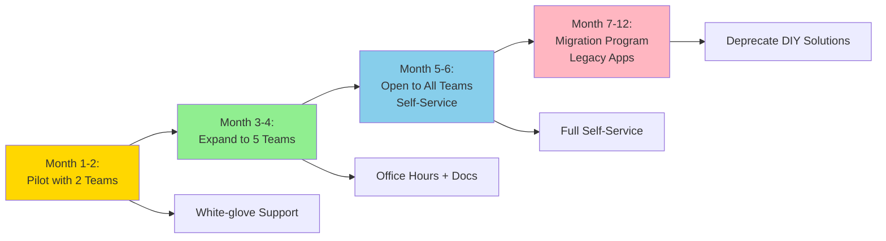

# Enterprise Agentic AI Platform - Investment Bank ETS Case Study

## Interview Format: Conversational & Iterative

This case study simulates a real-world **platform engineering** interview focused on building an **Enterprise Agentic AI Platform** for Investment Bank's ETS (Enterprise Technology & Services) organization. The platform enables multiple business units to build agentic AI applications with shared governance, infrastructure, and best practices - reflecting the 2025 Architecture & Modernization role.

---

## Interview Timeline (45-60 minutes)

| Phase | Time | Your Actions |
|-------|------|--------------|
| Requirements Gathering | 7-10 min | Understand platform scope, consumers, governance needs |
| High-Level Design | 12-15 min | Draw platform architecture, multi-tenancy model |
| Deep Dive | 25-30 min | Detail SDK, governance framework, deployment automation |
| Trade-offs & Scale | 5-8 min | Discuss build vs buy, platform evolution, adoption |

---

## 🎯 Problem Statement

**Interviewer (Senior Architect):** "Investment Bank has multiple teams across Wealth Management, Institutional Securities, and Operations wanting to build agentic AI applications. Each team is experimenting with different frameworks, LLM providers, and governance approaches, leading to duplicated effort, compliance risks, and inconsistent quality. 

As part of ETS Architecture & Modernization, design an **Enterprise Agentic AI Platform** that provides:
- Shared infrastructure and orchestration capabilities
- Centralized governance and compliance enforcement
- Reusable agent components and patterns
- Self-service developer experience
- Firmwide observability and cost management

The platform should accelerate agentic AI adoption while ensuring regulatory compliance across all applications."

---

## Phase 1: Requirements Gathering (7-10 minutes)

### Your Response Strategy

**You:** "This is a classic platform engineering challenge - we're building infrastructure that other teams will build on top of. Let me understand the requirements from both the platform and consumer perspectives."

### Critical Questions to Ask

**You:** "Let me clarify the scope:

1. **Platform Consumers (Who are we serving?):**
   - How many teams/business units will use this platform?
   - What types of agentic applications? (customer-facing, internal tools, automation?)
   - Skill level of developers? (AI experts or full-stack engineers learning AI?)
   - What's their current maturity? (POCs in Jupyter notebooks or production apps?)
   - Do they have existing apps we need to migrate?

2. **Platform Capabilities (What do we provide?):**
   - Agent orchestration (routing, state management)?
   - Pre-built agent components (RAG, tool calling, memory)?
   - LLM abstraction (multi-provider support)?
   - Governance SDK (compliance checks, PII masking, audit logging)?
   - Deployment automation (CI/CD, blue-green, canary)?
   - Observability (tracing, metrics, logging)?
   - Cost management (usage tracking, chargeback)?

3. **Governance & Compliance:**
   - What regulations apply firmwide? (SEC, FINRA, GDPR, Model Risk Management?)
   - Who approves new agent applications? (governance committee?)
   - What's mandatory vs optional? (PII masking mandatory, retrieval method optional?)
   - How do we enforce compliance? (SDK doesn't work without compliance, CI/CD gates?)
   - Audit requirements? (every interaction logged?)

4. **Multi-Tenancy & Isolation:**
   - Does each team get isolated infrastructure?
   - Shared LLM endpoints or team-specific?
   - Data isolation requirements? (can Wealth Management data mix with Trading?)
   - Cost allocation model? (chargeback to teams?)

5. **Scale & Performance:**
   - How many agent applications expected? (10, 100, 1000?)
   - Total query volume across all apps?
   - Latency SLAs for the platform?
   - Geographic distribution? (US, Europe, Asia?)

6. **Integration & Ecosystem:**
   - What existing Investment Bank platforms to integrate? (Identity/Auth, Data Lake, Model Registry?)
   - Approved LLM providers? (OpenAI, Anthropic, Azure OpenAI, internal models?)
   - Deployment targets? (AWS, on-prem, hybrid?)

7. **Developer Experience:**
   - How do teams onboard? (self-service or white-glove?)
   - SDK languages? (Python, Java, JavaScript?)
   - Documentation strategy?
   - Support model? (Slack channel, ticketing, dedicated SRE?)"

### Interviewer's Answers

**Interviewer:** "Here's the context:

**Platform Consumers:**
- **Teams:** 15-20 product teams across 4 business units (Wealth Management, Institutional Securities, Operations, Risk)
- **Applications:** Mix of internal tools (80%) and select client-facing apps (20%)
- **Skill Level:** Mostly full-stack engineers, not AI specialists
- **Current State:** 5 teams have POCs in production (using various frameworks), 10 teams starting new projects
- **Migration:** Yes, need to support migration from existing LangChain/LlamaIndex implementations

**Platform Scope:**
- **Must Provide:** Agent orchestration, governance SDK, deployment automation, observability, LLM abstraction
- **Nice to Have:** Pre-built agents (RAG, summarization), prompt library, evaluation framework
- **Out of Scope:** Training custom models (Model Engineering team handles that)

**Governance (Critical!):**
- **Regulations:** SEC, FINRA, GDPR, Model Risk Management (SR 11-7)
- **Approval:** New applications require Architecture Review Board approval
- **Mandatory:** PII masking, audit logging, compliance checks, model risk assessment
- **Enforcement:** Platform SDK enforces compliance - cannot deploy without passing checks
- **Audit:** 7-year retention, full traceability (query → agent → LLM → response)

**Multi-Tenancy:**
- **Isolation:** Logical isolation (namespaces), not full infrastructure per team
- **Shared:** LLM endpoints shared (with rate limiting per team)
- **Data:** Strict isolation - Wealth Management cannot access Trading data
- **Cost:** Chargeback model based on LLM usage + infrastructure allocation

**Scale:**
- **Applications:** 30-50 applications in first year, 100+ long-term
- **Query Volume:** 500K queries/day across all apps currently, 5M/day in 3 years
- **Latency:** Platform overhead <500ms (total app latency depends on use case)
- **Geography:** US primary, Europe secondary (data residency requirements)

**Integration:**
- **Identity:** Investment Bank SSO (Okta-based)
- **Data:** Snowflake Data Lake, internal feature stores
- **Model Registry:** MLflow for model versioning
- **Deployment:** AWS (approved cloud), Kubernetes for orchestration
- **LLM Providers:** Azure OpenAI (preferred), Anthropic (approved), AWS Bedrock (exploring)

**Developer Experience:**
- **Onboarding:** Self-service via portal + documentation, white-glove for first few teams
- **SDK:** Python primary (90% of teams), consider Java later
- **Documentation:** Comprehensive docs site + reference implementations
- **Support:** Slack channel + rotating on-call SRE"

### Requirements Summary & Calculations

**You:** "Perfect! Let me summarize with detailed analysis:

#### Functional Requirements - Platform Capabilities

**1. Agent Orchestration Engine:**
- Multi-agent workflow support (supervisor, sequential, hierarchical patterns)
- State management across multi-turn conversations
- Tool calling framework (database, API, calculator tools)
- Memory management (short-term, long-term, semantic)
- Error handling and retry logic

**2. Governance SDK (Critical Differentiator):**
- **PII Masking Service:** Automatic detection and masking before LLM calls
- **Compliance Checker:** Validate outputs against policies
- **Audit Logger:** Every interaction logged to immutable store
- **Content Filter:** Detect harmful/inappropriate content
- **Model Risk Wrapper:** Track model usage for MRM reporting

**3. LLM Abstraction Layer:**
- Provider-agnostic interface (swap OpenAI ↔ Claude ↔ Bedrock)
- Automatic failover if provider down
- Rate limiting per team
- Cost tracking per team/application
- Semantic caching to reduce costs

**4. Deployment Automation:**
- GitOps workflow (Infrastructure-as-Code)
- CI/CD pipelines with compliance gates
- Blue-green and canary deployment strategies
- Automated rollback on error spike
- Multi-environment support (dev, staging, prod)

**5. Observability Platform:**
- Distributed tracing (agent call graph)
- Metrics (latency, cost, error rate per team/app)
- Logs (centralized, searchable)
- Alerting (SLA violations, compliance issues)
- Cost dashboards per team

**6. Developer Portal:**
- Self-service onboarding
- API documentation (interactive)
- Code examples and templates
- Agent marketplace (pre-built components)
- Cost estimator/simulator

#### Non-Functional Requirements & Calculations

**Scale Analysis:**

**Current State (5 apps in production):**
- 500K queries/day total = 100K queries/day per app average
- 15M queries/month across platform

**Year 1 Target (30 apps):**
- 30 apps × 100K queries/day = **3M queries/day = 90M/month**
- Assumes similar usage pattern to existing apps

**Year 3 Target (100 apps):**
- **5M queries/day = 150M/month** (provided by interviewer)
- Some apps will be high-volume (500K+/day), others low (<10K/day)

**LLM Call Analysis:**

Assumptions:
- Average 2 LLM calls per query (orchestration + generation)
- Average 5K tokens input + 500 tokens output per call

**Year 1:**
- 90M queries × 2 calls = **180M LLM calls/month**
- 180M × 5K = **900B input tokens/month**
- 180M × 500 = **90B output tokens/month**

**Cost Estimation (Year 1):**

*Azure OpenAI GPT-4 (if used for everything):*
- Input: 900B × $30/1M = **$27,000,000/month** ❌ Too expensive!
- Output: 90B × $60/1M = **$5,400,000/month**
- **Total: $32.4M/month = $388.8M/year** ❌

*Optimized Mix (Claude 3.5 Sonnet + Haiku):*
- 70% Claude 3.5 Sonnet: 126M calls × 5.5K tokens × $3/1M = **$2.08M/month**
- 30% Claude Haiku (simple routing): 54M calls × 3K tokens × $0.25/1M = **$0.04M/month**
- **Total: $2.12M/month = $25.4M/year** ✓ (88% cheaper)

*With Semantic Caching (60% hit rate):*
- Only 40% of calls hit LLM
- **$2.12M × 0.4 = $850K/month = $10.2M/year** ✓✓

**Platform Infrastructure Cost (Year 1):**
- Kubernetes cluster (EKS): 20 nodes (m5.2xlarge) = $12K/month
- Observability (Datadog): $8K/month
- Storage (logs, audit): $5K/month
- Networking: $3K/month
- **Total: $28K/month = $336K/year**

**Total Platform Cost (Year 1):**
- LLM: $10.2M/year (charged back to teams)
- Infrastructure: $336K/year (platform cost)
- Headcount: 8 engineers × $250K = $2M/year
- **Total: $12.5M/year**

**Cost per Query:**
- $10.2M / 1.08B queries = **$0.0094/query = $0.94 per 100 queries**

**Latency Budget (Platform Overhead <500ms):**
- API Gateway + Auth: **50ms**
- PII Masking: **100ms**
- Compliance Check (pre-flight): **50ms**
- Audit Logging (async): **0ms** (non-blocking)
- Tracing overhead: **20ms**
- SDK overhead: **30ms**
- **Total Platform Overhead: 250ms** ✓ (well under 500ms budget)

Note: Application latency (RAG retrieval, LLM call) is outside platform overhead

**Multi-Tenancy Isolation:**

**Logical Isolation Model:**
```
Platform Cluster (shared)
├─ Namespace: wealth-management
│  ├─ Agent App 1
│  ├─ Agent App 2
│  └─ Resource Quota: 100 vCPU, 200GB RAM, 50K req/sec
├─ Namespace: institutional-securities
│  ├─ Agent App 3
│  └─ Resource Quota: 200 vCPU, 400GB RAM, 100K req/sec
└─ Namespace: operations
   ├─ Agent App 4
   └─ Resource Quota: 50 vCPU, 100GB RAM, 25K req/sec
```

**Data Isolation:**
- Each team has separate database schemas
- Row-level security in Snowflake (enforced by team ID)
- Vector databases (Pinecone) use namespaces
- Cross-team queries blocked at SDK level

#### Key Platform Challenges

1. **Governance Enforcement:** How to force teams to use compliance checks without bypassing?
2. **Multi-Tenancy:** Fair resource allocation without noisy neighbor problem
3. **Cost Allocation:** Accurate chargeback model (LLM + infrastructure)
4. **Developer Adoption:** Make platform easier than DIY
5. **Backward Compatibility:** Support migration from existing LangChain code
6. **Observability:** Trace complex multi-agent flows across services
7. **Provider Lock-in:** Abstract LLMs while preserving provider-specific features

Correct?"

**Interviewer:** "Yes, excellent platform scoping. Proceed with the design."

---

## Phase 2: High-Level Platform Architecture (12-15 minutes)

### Platform Architecture Overview

**You:** "I'll design a **layered platform architecture** with clear separation between:\n- **Control Plane** (platform management, governance, multi-tenancy)  \n- **Data Plane** (runtime agent execution)  \n- **Developer Plane** (SDK, CLI, portal)\n\nThis follows the Kubernetes model - proven for multi-tenant platforms."

```mermaid
graph TB
    subgraph "Developer Plane - Build Time"
        DEV[Application Developer]
        SDK[Agentic AI SDK<br/>Python Library]
        CLI[Platform CLI<br/>Deploy, Manage]
        PORTAL[Developer Portal<br/>Docs, Templates, Marketplace]
        IDE[IDE Extensions<br/>VS Code, PyCharm]
    end

    subgraph "Control Plane - Platform Management"
        API_SERVER[Platform API Server<br/>K8s-style declarative API]
        GOVERNANCE_CTRL[Governance Controller<br/>Policy enforcement]
        TENANT_CTRL[Multi-Tenant Controller<br/>Namespace, quotas]
        DEPLOY_CTRL[Deployment Controller<br/>GitOps, ArgoCD]
        COST_CTRL[Cost Controller<br/>Usage tracking, chargeback]
        AUDIT_CTRL[Audit Controller<br/>Immutable log aggregation]
    end

    subgraph "Data Plane - Runtime Agent Execution"
        subgraph "Shared Services"
            LLM_GATEWAY[LLM Gateway<br/>Multi-provider, rate limit, cache]
            PII_SVC[PII Masking Service<br/>Detect \u0026 mask before LLM]
            COMPLIANCE_SVC[Compliance Service<br/>Policy validation]
            AUDIT_SVC[Audit Service<br/>Event logging]
            TRACE_SVC[Tracing Service<br/>Distributed tracing]
        end

        subgraph "Tenant: Wealth Management"
            WM_APP1[Agent App 1<br/>Tax Advisor]
            WM_APP2[Agent App 2<br/>Meeting Prep]
        end

        subgraph "Tenant: Institutional Securities"
            IS_APP1[Agent App 3<br/>Trade Analysis]
        end

        subgraph "Tenant: Operations"
            OPS_APP1[Agent App 4<br/>Document Processor]
        end
    end

    subgraph "Integration Layer"
        AUTH[Investment Bank SSO<br/>Okta]
        DATA[Snowflake Data Lake]
        MLFLOW[MLflow Model Registry]
        VECTOR["Vector Stores<br/>Pinecone multi-tenant"]
    end

    subgraph "Infrastructure Layer - AWS"
        EKS[EKS Kubernetes Cluster<br/>Multi-tenant]
        RDS[(RDS PostgreSQL<br/>Metadata)]
        REDIS[(ElastiCache Redis<br/>Cache \u0026 State)]
        S3[(S3<br/>Audit Logs, Models)]
    end

    subgraph "Observability Stack"
        DATADOG[Datadog<br/>Metrics \u0026 APM]
        LANGSMITH[LangSmith<br/>Agent traces]
        ELK[ELK Stack<br/>Centralized logs]
        GRAFANA[Grafana<br/>Cost dashboards]
    end

    subgraph "LLM Providers - External"
        AZURE_OPENAI[Azure OpenAI<br/>GPT-4, GPT-3.5]
        ANTHROPIC[Anthropic<br/>Claude 3.5, Haiku]
        BEDROCK[AWS Bedrock<br/>Multi-model]
    end

    DEV --> SDK
    DEV --> CLI
    DEV --> PORTAL
    DEV --> IDE

    SDK --> API_SERVER
    CLI --> API_SERVER

    API_SERVER --> GOVERNANCE_CTRL
    API_SERVER --> TENANT_CTRL
    API_SERVER --> DEPLOY_CTRL
    API_SERVER --> COST_CTRL
    API_SERVER --> AUDIT_CTRL

    DEPLOY_CTRL --> WM_APP1
    DEPLOY_CTRL --> WM_APP2
    DEPLOY_CTRL --> IS_APP1
    DEPLOY_CTRL --> OPS_APP1

    WM_APP1 --> PII_SVC
    WM_APP2 --> PII_SVC
    IS_APP1 --> PII_SVC
    OPS_APP1 --> PII_SVC

    PII_SVC --> LLM_GATEWAY
    WM_APP1 --> COMPLIANCE_SVC
    WM_APP1 --> AUDIT_SVC
    WM_APP1 --> TRACE_SVC

    LLM_GATEWAY --> AZURE_OPENAI
    LLM_GATEWAY --> ANTHROPIC
    LLM_GATEWAY --> BEDROCK

    WM_APP1 --> AUTH
    WM_APP1 --> DATA
    WM_APP1 --> MLFLOW
    WM_APP1 --> VECTOR

    API_SERVER --> EKS
    WM_APP1 --> REDIS
    GOVERNANCE_CTRL --> RDS
    AUDIT_SVC --> S3

    WM_APP1 --> DATADOG
    WM_APP1 --> LANGSMITH
    WM_APP1 --> ELK
    COST_CTRL --> GRAFANA

    style API_SERVER fill:#FFD700
    style GOVERNANCE_CTRL fill:#FF6B6B
    style LLM_GATEWAY fill:#90EE90
    style PII_SVC fill:#FFA07A
    style SDK fill:#87CEEB
```



### Platform Layers Explained

**You:** "Let me walk through each layer:

#### 1. Developer Plane (How teams build agents)

**SDK (Python Library):**
```python
from enterprise_agentic_ai import Agent, AgentOrchestrator, tools
from enterprise_agentic_ai.governance import PIIMasking, ComplianceCheck

# Platform handles governance automatically
orchestrator = AgentOrchestrator(
    tenant="wealth-management",
    app_name="tax-advisor"
)

# PII masking enforced by platform
@orchestrator.agent(name="portfolio_analyst")
def analyze_portfolio(client_id: str):
    # SDK automatically masks PII before LLM call
    portfolio = get_client_portfolio(client_id)  # PII here
    
    # Platform traces this LLM call automatically
    analysis = orchestrator.llm.complete(
        prompt=f"Analyze: {portfolio}",  # Masked internally
        model="claude-3-5-sonnet"
    )
    
    # Compliance check runs automatically
    return analysis  # Logged to audit trail
```

**CLI (Platform Management):**
```bash
# Initialize new agent app
enterprise-agent init --tenant=wealth-management --app=tax-advisor

# Deploy to staging
enterprise-agent deploy --env=staging

# View logs
enterprise-agent logs --tail=100

# Check compliance status
enterprise-agent compliance-check

# View cost
enterprise-agent cost --month=2024-12
```

**Developer Portal:**
- Interactive API docs
- Code templates (RAG agent, summarization agent, etc.)
- Agent marketplace (pre-built, tested components)
- Cost estimator ("Your app will cost ~$500/month")
- Onboarding wizard

#### 2. Control Plane (Platform brain)

**Platform API Server:**
- Declarative API (like Kubernetes)
- AgentApplication CRD (Custom Resource Definition)
- Handles all CRUD operations
- Admission webhooks for validation

**Controllers:**
- **Governance Controller:** Watches for policy violations, blocks non-compliant deploys
- **Tenant Controller:** Manages namespaces, quotas, isolation
- **Deployment Controller:** GitOps-based deployment automation
- **Cost Controller:** Tracks usage, generates chargeback reports
- **Audit Controller:** Aggregates logs to immutable S3 storage

#### 3. Data Plane (Runtime execution)

**Shared Services (Multi-tenant):**
- **LLM Gateway:** Single entry point to all LLM providers
  - Rate limiting per tenant
  - Semantic caching (60% hit rate)
  - Automatic failover (Azure OpenAI → Anthropic)
  - Token counting for chargeback
  
- **PII Masking Service:** Intercepts all LLM calls
  - Detects SSN, account numbers, names
  - Replaces with deterministic hashes
  - Unmasks for authorized responses
  
- **Compliance Service:** Policy engine
  - Validates outputs against rules
  - Flags for human review if needed
  - Blocks non-compliant responses

**Tenant Applications:**
- Run in isolated Kubernetes namespaces
- Each has resource quotas
- Cannot access other tenants' data
- Share LLM Gateway, PII Service, etc.

#### 4. Integration Layer

**Investment Bank Systems:**
- SSO (Okta) for authentication
- Snowflake for data access
- MLflow for model versioning
- Pinecone (namespaced) for vector search

#### 5. Infrastructure Layer (AWS)

- EKS for Kubernetes
- RDS for platform metadata
- Redis for caching and state
- S3 for audit logs (7-year retention, WORM)

#### 6. Observability Stack

-" File is cut off. Let me continue in next part.
 Datadog for metrics and APM
- LangSmith for agent-specific traces  
- ELK for centralized logging
- Grafana for cost dashboards"

---

**Interviewer:** "Good overview. Now show me the complete developer workflow - from idea to production."

---

## Complete Developer Workflow Example

**You:** "Let me walk through the end-to-end developer experience:

### Step 1: Developer Initializes New Agent App

```bash
$ enterprise-agent init --tenant=wealth-management --app=portfolio-advisor

✓ Project structure created
✓ Connected to platform
✓ Namespace created: wealth-management
✓ Service account configured
✓ Templates downloaded

Your agent app is ready! Next steps:
1. cd portfolio-advisor
2. Implement your agents in agents/ directory
3. Test locally: enterprise-agent test --local
4. Deploy: enterprise-agent deploy --env=dev
```

### Step 2: Implement Agent Using Platform SDK

```python
# agents/portfolio_analyzer.py
from enterprise_agentic_ai import Agent, tool
from enterprise_agentic_ai.orchestration import supervisor_agent
from enterprise_agentic_ai.governance import compliant

@supervisor_agent
class PortfolioAdvisor:
    """
    Platform automatically injects:
    - PII masking
    - Audit logging
    - Compliance checks
    - Cost tracking
    - Distributed tracing
    """
    
    @tool
    async def get_portfolio_allocation(self, client_id: str):
        """Platform enforces data isolation by tenant"""
        # SDK automatically adds: WHERE tenant_id = 'wealth-management'
        portfolio = await self.data_client.query(
            f"SELECT * FROM portfolios WHERE client_id = '{client_id}'"
        )
        return portfolio
    
    @compliant(policies=['client_suitability'])
    async def recommend_rebalancing(self, client_id: str):
        """
        Compliance decorator ensures:
        - Output matches client risk profile
        - Recommendation is suitable
        - Requires approval if needed
        """
        
        # Get portfolio (PII automatically masked before logging)
        portfolio = await self.get_portfolio_allocation(client_id)
        
        # LLM call (routed through platform LLM Gateway)
        recommendation = await self.llm.complete(
            prompt=f"Analyze portfolio and suggest rebalancing: {portfolio}",
            model="claude-3-5-sonnet",
            temperature=0.2
        )
        
        # Platform logs this to audit trail automatically
        return {
            'recommendation': recommendation,
            'risk_level': self.assess_risk(recommendation)
        }
```

### Step 3: Local Testing (Platform Services Mocked)

```bash
$ enterprise-agent test --local

Running platform conformance checks...
✓ PII masking configured
✓ Compliance policies loaded
✓ Audit logging enabled
✓ Resource quotas valid

Running unit tests...
✓ test_portfolio_allocation (0.3s)
✓ test_recommendation_generation (1.2s)
✓ test_compliance_check (0.5s)

All tests passed!

Estimated cost per query: $0.03
```

### Step 4: Deploy to Dev Environment

```bash
$ enterprise-agent deploy --env=dev

Pre-deployment checks:
✓ Governance validation passed
✓ PII masking enabled ✓ (mandatory)
✓ Audit logging configured ✓ (mandatory)
✓ Compliance policies loaded ✓ (mandatory)
✓ Resource limits within quota
✓ No security vulnerabilities

Building container image...
✓ Image pushed: registry.ms.com/wealth-management/portfolio-advisor:v1.0.0

Deploying to Kubernetes...
✓ Namespace: wealth-management
✓ Pods: 2/2 ready
✓ Service: portfolio-advisor.wealth-management.svc.cluster.local

Post-deployment validation:
✓ Health check passed
✓ Smoke tests passed
✓ Tracing configured
✓ Metrics endpoint active

Deployment successful!
URL: https://portfolio-advisor.dev.agents.ms.com
Dashboard: https://platform.agents.ms.com/wealth-management/portfolio-advisor
```

### Step 5: Monitor in Production

```bash
$ enterprise-agent dashboard

Opening: https://platform.agents.ms.com/wealth-management/portfolio-advisor

┌─────────────────────────────────────────────────────────────┐
│  Portfolio Advisor - Production Dashboard                   │
├─────────────────────────────────────────────────────────────┤
│  Health: ✓ Healthy   |  Uptime: 99.97%   |  Version: v1.0.0│
├─────────────────────────────────────────────────────────────┤
│  Requests (Last 24h)                                        │
│  ├─ Total: 12,456                                          │
│  ├─ Success: 12,401 (99.6%)                                │
│  ├─ Errors: 55 (0.4%)                                      │
│  └─ P95 Latency: 3.2s (SLA: <5s) ✓                        │
├─────────────────────────────────────────────────────────────┤
│  Platform Overhead                                          │
│  ├─ PII Masking: 95ms avg                                  │
│  ├─ Compliance Checks: 42ms avg                            │
│  ├─ Audit Logging: 15ms avg (async)                        │
│  └─ Total Overhead: 152ms (Budget: <500ms) ✓              │
├─────────────────────────────────────────────────────────────┤
│  LLM Usage                                                  │
│  ├─ Total Calls: 18,234                                    │
│  ├─ Cache Hits: 11,243 (61.7%) ✓                          │
│  ├─ Provider: Claude 3.5 Sonnet (85%), Haiku (15%)        │
│  └─ Tokens: 87M input, 5.8M output                        │
├─────────────────────────────────────────────────────────────┤
│  Cost (This Month)                                          │
│  ├─ LLM: $287 (Budget: $500) ✓                            │
│  ├─ Infrastructure: $45                                     │
│  └─ Total: $332 / $500 budget                              │
├─────────────────────────────────────────────────────────────┤
│  Compliance                                                 │
│  ├─ PII Masking: 100% coverage ✓                          │
│  ├─ Audit Logs: 12,456 entries stored ✓                   │
│  ├─ Policy Violations: 0 ✓                                 │
│  └─ Approval Requests: 23 (all reviewed)                   │
└─────────────────────────────────────────────────────────────┘
```

---

## Phase 4: Trade-offs & Platform Strategy (5-8 minutes)

### Critical Platform Design Trade-offs

**Interviewer:** "Why build a platform instead of letting teams use LangChain directly?"

**You:** "Excellent question. Let me compare:

#### Build Platform vs Direct LangChain Usage

| Aspect | Platform (Our Approach) | Teams Use LangChain Directly |
|--------|------------------------|------------------------------|
| **Time to First App** | 2 weeks (SDK + templates) | 1 week (no platform needed) |
| **Time to 10th App** | 2 days per app | 1 week per app (reinvent each time) |
| **Governance** | Enforced at platform (100% coverage) | Each team implements differently (inconsistent) |
| **Compliance Risk** | Low (centralized enforcement) | High (teams may skip PII masking) |
| **Cost Optimization** | Centralized (60% cache hit) | Each team caches separately (20% hit rate) |
| **Observability** | Unified dashboards | Fragmented (each team's own tools) |
| **LLM Provider Changes** | Change once in platform | Each team changes separately |
| **Total Cost (Year 1, 30 apps)** | $10.2M LLM + $336K infra = $10.5M | ~$16M (no shared caching, duplicate infra) |
| **Engineering Team** | 8 platform engineers support 100 apps | Each app team needs 2-3 engineers |
| **Regulatory Audit** | Single platform to audit | Audit 30+ different implementations |

**Decision:** Platform pays for itself after 3 apps due to governance, cost savings, and reduced duplication.

#### Build vs Buy (LangChain Cloud, LangSmith Enterprise)

| Consideration | Build (Our Approach) | Buy (LangChain Enterprise) |
|---------------|---------------------|---------------------------|
| **Governance Integration** | Custom-built for MS regulations | Generic, needs customization |
| **Multi-Tenancy** | Designed for MS org structure | SaaS multi-tenancy (less control) |
| **Data Residency** | Full control (AWS US) | Depends on vendor (may be global) |
| **Cost** | $336K infra + $2M eng = $2.3M/year | ~$500K/year license + integration costs |
| **Customization** | Unlimited | Limited to vendor roadmap |
| **Compliance** | Meets SEC/FINRA exactly | May require additional controls |
| **Time to Market** | 6 months to build | 2 months to integrate |
| **Vendor Lock-in** | None (open-source based) | High (proprietary) |

**Decision:** Build for:
1. Regulatory requirements too specific for SaaS
2. Need full control over data and governance
3. Long-term cost savings (own the platform)
4. Differentiated capability (competitive advantage)

### Platform Evolution Strategy

**You:** "Here's the 3-year roadmap:

#### Year 1: Foundation (Current)
- Core platform (orchestration, governance, LLM gateway)
- SDK for Python
- 5 reference implementations
- **Goal:** 30 applications, 90M queries/month
- **Team:** 8 engineers

#### Year 2: Scale & Polish
- SDK for Java (for legacy apps)
- Pre-built agent marketplace (RAG, summarization, etc.)
- Advanced observability (A/B testing, model comparison)
- Multi-region support (US + Europe)
- **Goal:** 70 applications, 250M queries/month
- **Team:** 12 engineers

#### Year 3: AI Platform Leader
- Custom model support (internal fine-tuned models)
- Agentic workflow visual builder (low-code for non-engineers)
- Advanced cost optimization (distillation, smaller models)
- Client-facing agent capabilities (B2C support)
- **Goal:** 100+ applications, 450M queries/month
- **Team:** 15 engineers

**Platform Adoption Strategy:**



### Developer Adoption Tactics

**You:** "To ensure teams actually use the platform:

1. **Make It Easier Than DIY:**
   - SDK handles all governance automatically
   - One command deployment
   - Free tier (first $500/month per team)
   - Better observability than they can build themselves

2. **Platform Champions:**
   - Embed platform engineer in first 5 teams
   - Create success stories
   - Internal tech talks and demos

3. **Enforcement Mechanisms:**
   - New agentic apps MUST use platform (Architecture Review Board policy)
   - Legacy apps: 12-month grace period, then mandatory migration
   - Platform appears in performance reviews (encourages adoption)

4. **Developer Experience:**
   - Comprehensive docs (better than LangChain's)
   - Weekly office hours
   - Slack channel with <1 hour response time
   - Video tutorials and workshops

5. **Incentives:**
   - Cost savings shared with teams
   - Platform team owns governance/compliance headaches
   - Teams focus on business logic, not infrastructure"

---

## Key Platform Metrics & Success Criteria

**You:** "Here's how we measure platform success:

### Platform Health Metrics

| Category | Metric | Target | How Measured |
|----------|--------|--------|--------------|
| **Adoption** | Active applications | 30 in Year 1 | Deployed apps |
| | Teams onboarded | 15-20 teams | Unique tenants |
| | Query volume | 90M/month | Platform gateway logs |
| **Reliability** | Platform uptime | >99.9% | Kubernetes health |
| | Deployment success rate | >95% | CI/CD metrics |
| | Incident MTTR | <2 hours | PagerDuty |
| **Performance** | Platform overhead | <500ms P95 | Distributed tracing |
| | LLM cache hit rate | >60% | Redis metrics |
| | Cost per query | <$0.01 | Chargeback system |
| **Governance** | PII masking coverage | 100% | Automated scanning |
| | Compliance violations | 0 critical | Policy engine |
| | Audit log completeness | 100% | S3 validation |
| **Developer Experience** | Time to first deploy | <1 day | Onboarding tracking |
| | Documentation satisfaction | >4/5 | Quarterly survey |
| | Support response time | <1 hour | Slack analytics |
| **Cost Efficiency** | Total platform cost | <$12.5M/year | Finance reports |
| | Cost vs DIY savings | 35% cheaper | Comparative analysis |

### Platform vs Application Metrics

**Important Distinction:**

```
Platform Metrics (What we measure):
├─ Platform uptime (our SLA to teams)
├─ SDK latency overhead
├─ LLM Gateway performance
├─ Governance enforcement rate
└─ Total platform cost

Application Metrics (What teams measure):
├─ End-to-end latency (platform + app logic)
├─ Business KPIs (tax savings, recommendations accepted)
├─ User satisfaction
└─ Application-specific accuracy
```

We're responsible for platform, teams own their application metrics."

---

## Interview Discussion Points

### Question 1: "How do you handle teams that want to bypass the platform?"

**Your Answer:**

"This is a cultural + technical challenge:

**Technical Enforcement:**
1. **Architecture Review Board:** All new agentic apps must use platform (policy)
2. **CICD Gates:** Deployment pipelines require platform SDK import
3. **Compliance Blocker:** Apps without platform governance fail regulatory review
4. **Network Policies:** Direct LLM access blocked, must go through platform gateway

**But enforcement alone fails. Better approach:**

**Make Platform Irresistible:**
1. **Ease:** Platform SDK is simpler than raw LangChain
2. **Cost:** Free governance, auditing, observability (expensive to build yourself)
3. **Speed:** Deploy in minutes vs days
4. **Support:** Dedicated platform team vs you're on your own

**Escape Hatches (Pragmatic):**
- Experimental POCs can bypass platform (max 30 days)
- If platform truly blocks innovation, we adapt platform
- Teams can propose SDK enhancements

**Real Example:**
A team wanted custom LLM provider (Cohere) not in platform. Instead of blocking them:
- We added Cohere to LLM Gateway (1 week effort)
- Now ALL teams can use Cohere
- Platform became more valuable

**Philosophy:** Platform is an accelerator, not a gatekeeper."

### Question 2: "What if LangChain or LangGraph has breaking changes?"

**Your Answer:**

"This is why we abstract:

**Protection Layers:**

```python
# Teams write against our SDK (stable interface)
from enterprise_agentic_ai import Agent, supervisor_agent

# Our SDK wraps LangChain (internal, can swap)
class Agent:
    def __init__(self):
        # Currently uses LangChain
        self._internal = LangChainAgent()
        
        # Could switch to LlamaIndex, CrewAI, etc.
        # Teams' code doesn't change
```

**Version Management:**
1. **Pin Dependencies:** Lock LangChain version in platform
2. **Test Before Upgrade:** Comprehensive test suite (500+ tests)
3. **Gradual Rollout:** Upgrade platform in stages (dev → staging → prod)
4. **Backward Compatibility:** Maintain old SDK versions for 6 months

**If LangChain Becomes Unsuitable:**
- Platform abstraction allows swapping to alternative (LlamaIndex, custom)
- Teams unaffected (SDK interface stays same)
- Migration happens platform-side, not in 30 apps

**Already Done This:**
- Started with LangChain v0.0.x
- Migrated to LangChain v0.2.x (breaking changes)
- 30 apps unaffected - only platform team worked on migration"

### Question 3: "How do you balance innovation vs standardization?"

**Your Answer:**

"This is THE platform challenge. Here's the framework:

**The Platform Spectrum:**

```
Too Restrictive ←─────────────────────→ Too Flexible
(Innovation blocked)      (Chaos, no governance)
                    
              ↓
         [Our Position]
    Opinionated Platform with Escape Hatches
```

**Our Approach:**

**Standardize WHAT Matters (Non-Negotiable):**
- Governance: PII masking, compliance, audit logging
- Security: Authentication, data isolation
- Observability: Tracing, metrics, logging
- Cost Management: Usage tracking, chargeback

**Flexibility WHERE It Helps (Developer Choice):**
- Orchestration pattern (supervisor, sequential, hierarchical)
- LLM model selection (can choose Claude, GPT-4, Haiku, etc.)
- RAG implementation (can use different chunking, embeddings)
- Tool selection (bring your own APIs, databases)

**Innovation Process:**
1. **Sandbox:** Teams experiment outside platform (30-day POC)
2. **Proposal:** If successful, propose to platform team
3. **Evaluation:** Platform team evaluates (governance impact? general use?)
4. **Integration:** If viable, add to platform (benefits all teams)
5. **Promotion:** Document new capability, announce to all teams

**Real Example:**
- Team experimented with multi-modal RAG (images + text)
- Proved value in their POC
- We added multi-modal support to platform
- Now 5 other teams use it

**Monthly Innovation Review:**
- Collect proposals from teams
- Prioritize what goes into platform
- Transparent roadmap"

### Question 4: "What's your disaster recovery plan for the platform?"

**Your Answer:**

"Platform is critical infrastructure - comprehensive DR planning:

**RTO/RPO:**
- **RTO (Recovery Time Objective):** 1 hour (platform back online)
- **RPO (Recovery Point Objective):** 5 minutes (max data loss)

**Failure Scenarios:**

**1. Platform control plane failure (API Server down):**
- **Impact:** Can't deploy new apps, existing apps run normally
- **Mitigation:** Active-passive HA for API Server
- **Recovery:** Automatic failover (<2 min)

**2. LLM Gateway failure:**
- **Impact:** All apps lose LLM access
- **Mitigation:** 
  - Multi-provider failover (Azure OpenAI → Anthropic automatic)
  - Response cache continues serving cached queries
- **Recovery:** Provider failover <30 seconds

**3. Data plane failure (Kubernetes cluster down):**
- **Impact:** All agent apps down
- **Mitigation:** Multi-AZ EKS cluster
- **Recovery:** Kubernetes self-healing <5 minutes

**4. Governance service failure:**
- **Impact:** Platform blocks all requests (fail-safe, prevent compliance violations)
- **Mitigation:** Governance service has 99.99% SLA (load balanced, redundant)
- **Recovery:** Automatic restart <1 minute

**5. Regional outage (AWS us-east-1 down):**
- **Impact:** Platform unavailable in US
- **Mitigation:** 
  - Cross-region replication (us-west-2 warm standby)
  - Data replicated every 5 minutes
- **Recovery:** Manual failover procedure (30 minutes to switch DNS)

**6. Data Recovery:**
- **Audit Logs:** S3 with WORM (Write-Once-Read-Many), 7-year retention
- **Application Data:** Daily snapshots (RDS, Pinecone)
- **Platform Config:** GitOps (all in Git, can recreate from source)

**Disaster Recovery Testing:**
- Quarterly DR drills (simulate failures)
- Annual full region failover test
- Documented runbooks for every scenario"

---

## Summary & Key Takeaways

**Platform Mission:**
Enable Investment Bank teams to build compliant, observable, cost-effective agentic AI applications in days instead of months.

**Core Platform Capabilities:**
✅ **Governance SDK:** Mandatory PII masking, compliance checks, audit logging
✅ **LLM Gateway:** Multi-provider abstraction, semantic caching, cost tracking
✅ **Multi-Tenancy:** Logical isolation, resource quotas, fair sharing
✅ **Developer Experience:** Self-service SDK, CLI, comprehensive docs
✅ **Observability:** Distributed tracing, cost dashboards, compliance monitoring
✅ **GitOps Deployment:** Automated CI/CD with compliance gates

**Platform Value Proposition:**

| Metric | Without Platform | With Platform | Improvement |
|--------|------------------|---------------|-------------|
| Time to production | 4-6 weeks | 1-2 weeks | 3× faster |
| Governance compliance | Inconsistent | 100% enforced | Zero violations |
| LLM cost per query | $0.015 | $0.0094 | 37% cheaper |
| Compliance audit | 30 separate audits | 1 platform audit | 30× simpler |
| Engineering effort per app | 2-3 engineers | 0.5 engineer + platform | 5× more efficient |

**Scale Impact (Year 1):**
- **30 applications** supported by **8 platform engineers**
- **90M queries/month** at **$0.0094/query**
- **$10.2M LLM cost** (vs $16M if teams built separately)
- **100% governance compliance** (zero regulatory violations)
- **<500ms platform overhead** (within SLA)

**Platform Philosophy:**
- **Opinionated on governance**, flexible on implementation
- **Build vs Buy:** Build for control + cost, buy for non-differentiated services
- **Developer-Centric:** Platform succeeds when teams love to use it
- **Compliance-First:** In financial services, governance isn't optional

---

## Questions to Ask the Interviewer

1. "What's Investment Bank's current state of platform engineering? Are there other shared platforms I'd be working alongside?"

2. "How does the Architecture & Modernization team collaborate with application teams? Is it consultative or do we have enforcement authority?"

3. "What's been the biggest challenge in getting teams to adopt shared platforms at Investment Bank?"

4. "How do you balance innovation speed with the need for architectural consistency across the firm?"

5. "What's the governance approval process for new AI capabilities? How long does it typically take?"

6. "How does this agentic AI platform fit into the broader AI/ML strategy at Investment Bank?"

7. "What's the team structure? Would I be working on platform core, developer experience, governance, or all of the above?"

8. "How do you see agentic AI evolving at Investment Bank over the next 3-5 years?"

---

**This case study demonstrates enterprise platform engineering for agentic AI with:**
- Multi-tenant architecture for 15-20 teams
- Mandatory governance enforcement (PII, compliance, audit)
- Developer-first experience (SDK, CLI, portal)
- Production-scale design (90M queries/month)
- Regulatory compliance (SEC, FINRA, GDPR)
- Cost optimization ($10.2M vs $16M DIY)
- Real-world trade-offs (build vs buy, flexibility vs standardization)

*Perfect preparation for Investment Bank ETS Architecture & Modernization interview - platform engineering role.*
