# Complete Guide to Transformer Architectures and LLM Training (2025)

**A Staff AI Scientist's Comprehensive Reference**

This document covers:
1. **Transformer Architecture Fundamentals**
2. **Architecture Variants** (Encoder-only, Decoder-only, Encoder-Decoder)
3. **LLM Pretraining Techniques**
4. **Post-Training Methods** (SFT, RLHF, DPO, PPO)
5. **Scaling Laws and Best Practices**

---

## Table of Contents

1. [Core Transformer Architecture](#core-transformer-architecture)
2. [Transformer Architecture Variants](#transformer-architecture-variants)
3. [LLM Pretraining](#llm-pretraining)
4. [Post-Training and Alignment](#post-training-and-alignment)
5. [Scaling Laws](#scaling-laws)
6. [Production Best Practices](#production-best-practices)

---

## Core Transformer Architecture

### The Original Transformer (Vaswani et al., 2017)

The Transformer introduced the **attention mechanism** as a replacement for recurrence, enabling parallel processing and better long-range dependencies.

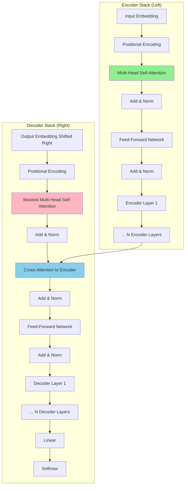

### Key Components Explained

#### 1. Multi-Head Self-Attention

**Purpose:** Allow the model to focus on different positions of the input sequence simultaneously.

**Mechanism:**

```
Q (Query) = X · W_Q
K (Key)   = X · W_K
V (Value) = X · W_V

Attention(Q, K, V) = softmax(Q·K^T / √d_k) · V
```

**Multi-Head:** Run attention h times with different learned projections:

```
MultiHead(Q, K, V) = Concat(head_1, ..., head_h) · W_O

where head_i = Attention(Q·W_Q^i, K·W_K^i, V·W_V^i)
```

**Visualization:**

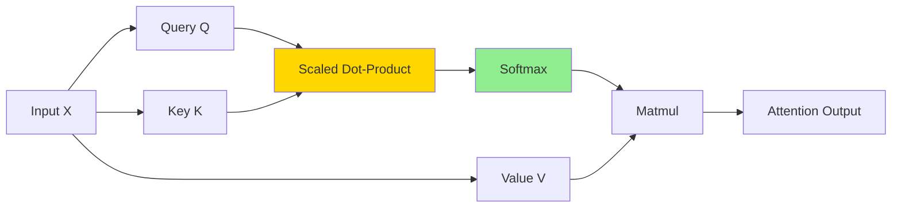

**Key Insights:**
- **Scaled by √d_k** to prevent softmax saturation
- **Parallelizable** across sequence positions
- **O(n²·d)** complexity where n = sequence length

#### 2. Positional Encoding

Since Transformers have no recurrence, they need explicit position information.

**Sinusoidal Encoding (Original):**

```
PE(pos, 2i)   = sin(pos / 10000^(2i/d_model))
PE(pos, 2i+1) = cos(pos / 10000^(2i/d_model))
```

**Modern Alternatives:**
- **Learned Positional Embeddings** (BERT, GPT)
- **Rotary Position Embeddings (RoPE)** (LLaMA, GPT-NeoX)
- **ALiBi** (Relative position bias)

**RoPE (Most Popular in 2025):**

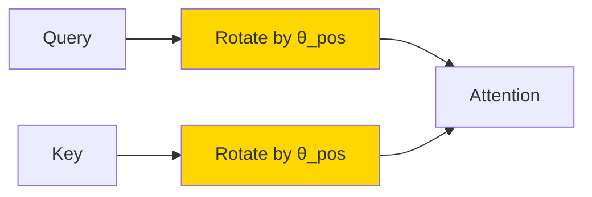

**Advantages of RoPE:**
- Extrapolates to longer sequences than trained
- Maintains relative position information
- Used in Llama, Qwen, Mistral

#### 3. Feed-Forward Network (FFN)

**Architecture:**

```
FFN(x) = max(0, x·W_1 + b_1)·W_2 + b_2
```

**Modern Variants:**

**SwiGLU (Used in LLaMA, Qwen):**

```
SwiGLU(x) = Swish(x·W_gate) ⊙ (x·W_up) · W_down

where Swish(x) = x · sigmoid(x)
```

**GeGLU (Used in some models):**

```
GeGLU(x) = GELU(x·W_gate) ⊙ (x·W_up) · W_down
```

**Key Properties:**
- Expands to **4× hidden dimension** (e.g., 768 → 3072)
- Most parameters of the model are in FFN layers
- Position-wise: same FFN applied to each position independently

#### 4. Layer Normalization

**Pre-LN (Modern Standard):**

```
# Layer Norm BEFORE attention/FFN
x = x + Attention(LayerNorm(x))
x = x + FFN(LayerNorm(x))
```

**Post-LN (Original Transformer):**

```
# Layer Norm AFTER attention/FFN
x = LayerNorm(x + Attention(x))
x = LayerNorm(x + FFN(x))
```

**Why Pre-LN dominates in 2025:**
- More stable training for deep models
- Better gradient flow
- Used in GPT-3, LLaMA, all modern LLMs

#### 5. Residual Connections

```
output = x + Sublayer(x)
```

**Purpose:**
- Enables training very deep networks (100+ layers)
- Provides gradient highway during backpropagation
- Allows earlier layers to preserve information

---

## Transformer Architecture Variants

### Taxonomy of Transformer Architectures

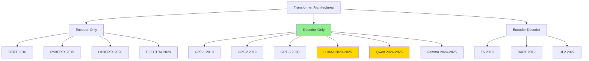

### 1. Encoder-Only Models (BERT Family)

**Architecture:**

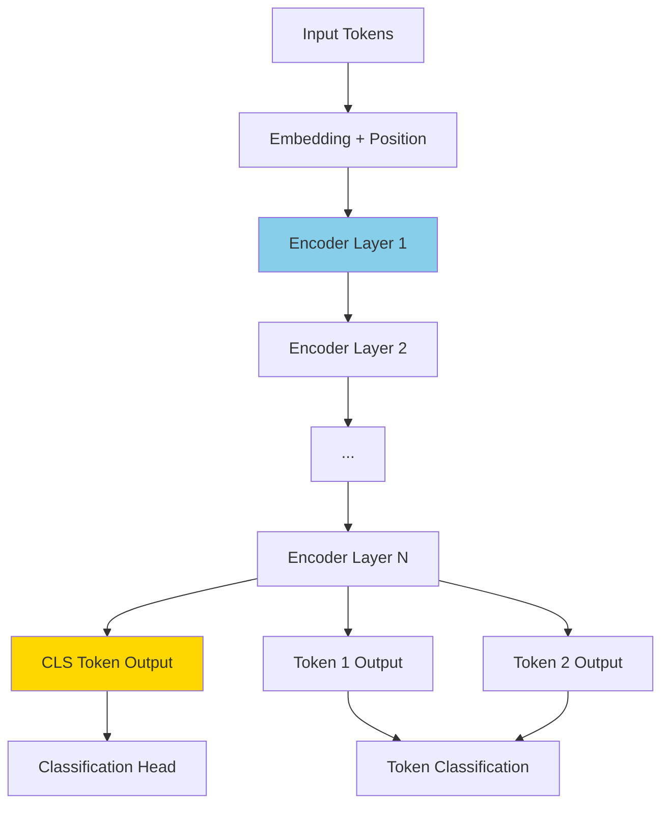

**Key Characteristics:**

| Feature | Details |
|---------|---------|
| **Attention Type** | Bidirectional (sees full context) |
| **Mask** | None (or MLM during training) |
| **Best For** | Classification, NER, embeddings |
| **Examples** | BERT, RoBERTa, DeBERTa |
| **Context** | Full sentence both directions |

**Encoder Layer Structure:**

```
Input
  ↓
Multi-Head Self-Attention (bidirectional)
  ↓
Add & Norm
  ↓
Feed-Forward Network
  ↓
Add & Norm
  ↓
Output
```

**Training Objective: Masked Language Modeling (MLM)**

```
Input:  "The [MASK] sat on the [MASK]"
Target: "The cat sat on the mat"

Loss = CrossEntropy(predicted_masked_tokens, true_masked_tokens)
```

**BERT Variants:**

1. **BERT (2018)**
   - 12/24 layers, 768/1024 hidden
   - MLM + Next Sentence Prediction (NSP)

2. **RoBERTa (2019)**
   - Removed NSP
   - Dynamic masking
   - Larger batches, more data

3. **DeBERTa (2020)**
   - Disentangled attention (content & position separate)
   - Enhanced mask decoder
   - State-of-the-art on GLUE

4. **ELECTRA (2020)**
   - Replaced token detection instead of MLM
   - More sample efficient

**Use Cases in 2025:**
- Embedding models (sentence transformers)
- Classification tasks
- Information retrieval
- Cross-encoders for re-ranking

**Why less popular for LLMs?**
- Cannot generate text naturally (no causal mask)
- Requires task-specific heads
- Decoder-only models more flexible

---

### 2. Decoder-Only Models (GPT Family) - Dominant in 2025

**Architecture:**

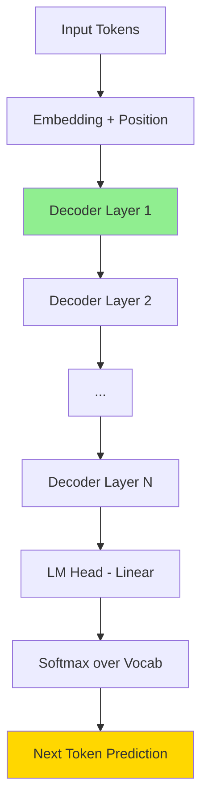

**Key Characteristics:**

| Feature | Details |
|---------|---------|
| **Attention Type** | Causal (only sees previous tokens) |
| **Mask** | Causal/autoregressive mask |
| **Best For** | Text generation, chat, instruction following |
| **Examples** | GPT-3/4, LLaMA, Qwen, Gemma, Claude |
| **Context** | Left-to-right only |

**Decoder Layer Structure:**

```
Input
  ↓
Masked Multi-Head Self-Attention (causal)
  ↓
Add & Norm
  ↓
Feed-Forward Network
  ↓
Add & Norm
  ↓
Output
```

**Causal Mask Visualization:**

```
Token:     The    cat    sat    on     mat
Position:   0      1      2      3      4

Attention Mask (lower triangular):
       0   1   2   3   4
    0 [1   0   0   0   0]  "The" can only see itself
    1 [1   1   0   0   0]  "cat" can see "The", "cat"
    2 [1   1   1   0   0]  "sat" can see "The", "cat", "sat"
    3 [1   1   1   1   0]  ...
    4 [1   1   1   1   1]  "mat" can see all previous
```

**Training Objective: Causal Language Modeling (CLM)**

```
Input:  "The cat sat on"
Target: "cat sat on the"

Loss = CrossEntropy(logits[:-1], targets[1:])
```

**Modern Decoder-Only Architectures:**

#### GPT-3 (2020)

```
Layers: 96
Hidden: 12,288
Heads: 96
Parameters: 175B
Position: Learned embeddings
```

#### LLaMA (2023-2025)

**Key Innovations:**

```python
# Pre-normalization (RMSNorm)
def rms_norm(x):
    return x / rms(x) * scale

# RoPE positional encoding
def apply_rope(q, k, position):
    q_rot = rotate(q, theta(position))
    k_rot = rotate(k, theta(position))
    return q_rot, k_rot

# SwiGLU activation
def swiglu(x):
    gate = x @ W_gate
    up = x @ W_up
    return swish(gate) * up @ W_down
```

**LLaMA Architecture:**

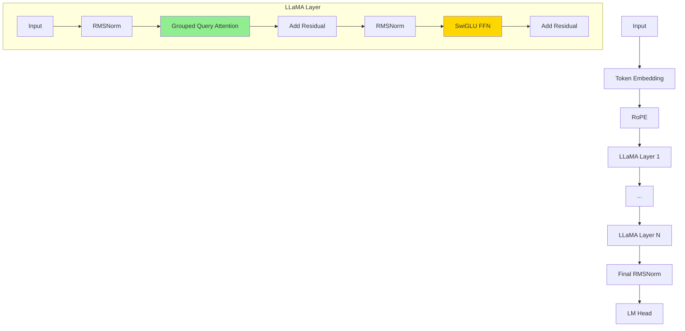

**Grouped Query Attention (GQA) - LLaMA 2/3:**

```
Standard Multi-Head:
  8 Q heads, 8 K heads, 8 V heads

GQA:
  8 Q heads, 2 K heads, 2 V heads

  4 Q heads share 1 K/V head

Benefits:
  - 75% reduction in KV cache size
  - Faster inference
  - Minimal quality loss
```

#### Qwen 2.5 (2024-2025)

**Innovations:**
- Mixture of Experts (MoE) variants
- 32K-128K context lengths
- Dual-chunk attention for long context
- Improved tokenizer (152K vocab)

#### Gemma (2024-2025)

**Innovations:**
- GeGLU activation
- Multi-Query Attention (MQA) in smaller models
- RoPE with modified scaling

**Why Decoder-Only Dominates in 2025:**

1. **Simplicity**: Single architecture for all tasks
2. **Scalability**: Proven to scale to 100B+ parameters
3. **Flexibility**: Works for chat, code, reasoning
4. **Instruction following**: Natural fit for dialogue
5. **Emergent abilities**: Appear with scale

---

### 3. Encoder-Decoder Models (T5 Family)

**Architecture:**

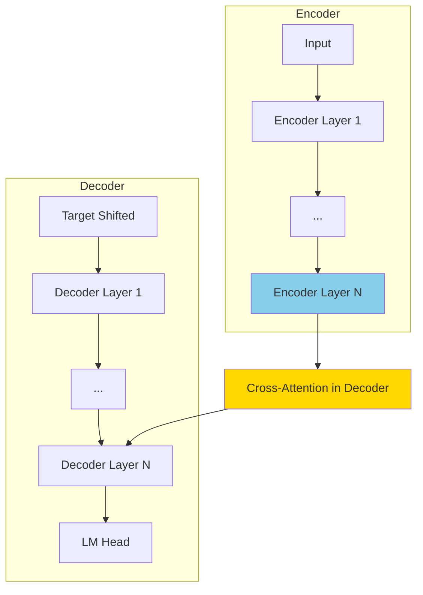

**Key Characteristics:**

| Feature | Details |
|---------|---------|
| **Encoder Attention** | Bidirectional |
| **Decoder Attention** | Causal + Cross-attention |
| **Best For** | Translation, summarization, seq2seq |
| **Examples** | T5, BART, UL2 |
| **Complexity** | Higher than decoder-only |

**Decoder Layer with Cross-Attention:**

```
Input
  ↓
Masked Self-Attention (causal)
  ↓
Add & Norm
  ↓
Cross-Attention (to encoder outputs)  ← Key difference
  ↓
Add & Norm
  ↓
Feed-Forward Network
  ↓
Add & Norm
  ↓
Output
```

**T5 (Text-to-Text Transfer Transformer)**

**Key Idea:** Frame all NLP tasks as text-to-text:

```
Translation:  "translate English to German: Hello" → "Hallo"
Summary:      "summarize: [long text]" → "[summary]"
Classification: "sentiment: I love this!" → "positive"
QA:           "question: What is AI?" → "Artificial Intelligence"
```

**Training Objective: Span Corruption**

```
Input:  "The cat <X> on the <Y>"
Target: "<X> sat <Y> mat </s>"

Masks random spans instead of individual tokens
```

**T5 Variants:**

1. **T5 (2019)**
   - Unified text-to-text framework
   - 11B parameters (largest)

2. **BART (2019)**
   - Denoising autoencoder
   - Multiple noise functions

3. **UL2 (2022)**
   - Unified training with mixed denoisers
   - Better than T5 on many tasks

**Why Encoder-Decoder Less Popular in 2025?**

**Cons:**
- More complex architecture
- Requires paired input-output data
- Harder to scale
- Decoder-only can do same tasks with prompting

**Pros:**
- Better for specific seq2seq tasks
- More efficient for translation
- Stronger bidirectional encoding

**Current Use Cases:**
- Machine translation (still competitive)
- Summarization (task-specific)
- Code generation with retrieval

---

### Architecture Comparison Table

| Aspect | Encoder-Only (BERT) | Decoder-Only (GPT) | Encoder-Decoder (T5) |
|--------|---------------------|-------------------|---------------------|
| **Attention** | Bidirectional | Causal | Both |
| **Training** | MLM | CLM | Span corruption |
| **Generation** | No | Yes | Yes |
| **Understanding** | Excellent | Good | Excellent |
| **Flexibility** | Low | High | Medium |
| **Scaling** | Moderate | Excellent | Moderate |
| **2025 Popularity** | Low | **Very High** | Low |
| **Best Use** | Embeddings, classification | General purpose, chat | Translation, seq2seq |
| **Examples** | BERT, RoBERTa | GPT-4, LLaMA, Qwen | T5, BART |

---

## LLM Pretraining

### Overview of Pretraining Pipeline


### 1. Data Collection and Curation

**Data Sources (Modern LLMs):**

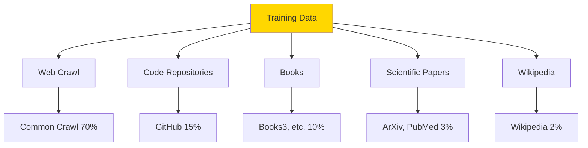

**Data Cleaning Pipeline:**

```python
# Example data filtering steps (LLaMA, Qwen approach)

1. Language Identification
   - Keep only target languages
   - Use fastText classifier

2. Quality Filtering
   - Remove duplicates (MinHash, exact dedup)
   - Filter low-quality (perplexity-based)
   - Remove toxic content
   - Filter adult content

3. Decontamination
   - Remove benchmark test sets
   - Remove memorization risks

4. Document-level filtering
   - Min/max length thresholds
   - Symbol-to-word ratio
   - Punctuation analysis
```

**Data Mixture (Typical 2025 LLM):**

```
Total tokens: 1-15 Trillion

Common Crawl:    60-70%  (web pages)
GitHub:          10-15%  (code)
Books:           5-10%   (long-form text)
ArXiv:           2-5%    (scientific)
Wikipedia:       2-3%    (factual)
StackExchange:   1-2%    (Q&A)
```

### 2. Tokenization

**Byte-Pair Encoding (BPE) - Most Common**

```python
# BPE Algorithm (simplified)

1. Start with character vocabulary
   vocab = ['a', 'b', 'c', ..., 'z']

2. Count pair frequencies in corpus
   "low" + "low" + "lowest"
   → ('l','o'): 3, ('o','w'): 2, ...

3. Merge most frequent pair
   ('l','o') → 'lo'
   vocab = [..., 'lo']

4. Repeat until vocab_size reached
   Typical: 32K - 256K tokens
```

**Modern Tokenizers (2025):**

| Model | Tokenizer | Vocab Size | Notes |
|-------|-----------|------------|-------|
| **GPT-4** | tiktoken (BPE) | 100K | Improved efficiency |
| **LLaMA** | SentencePiece (BPE) | 32K | Standard size |
| **Qwen** | tiktoken-based | 152K | Multilingual optimized |
| **Gemma** | SentencePiece | 256K | Large vocab |

**Vocabulary Curriculum Learning (2025 Innovation):**

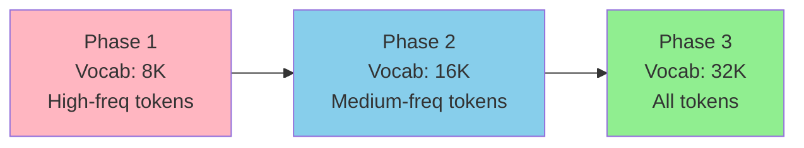

**Benefits:**
- Log-linear scaling gains
- Better rare token representations
- Mirrors human language acquisition

### 3. Model Architecture Decisions

**Key Hyperparameters:**

```python
# Example: LLaMA-3.1-8B configuration

model_config = {
    'hidden_size': 4096,           # d_model
    'num_layers': 32,              # Depth
    'num_attention_heads': 32,     # MHA heads
    'num_key_value_heads': 8,      # GQA for efficiency
    'intermediate_size': 14336,    # FFN dimension (3.5x hidden)
    'vocab_size': 128256,
    'max_position_embeddings': 131072,  # 128K context
    'rope_theta': 500000.0,        # RoPE base frequency
    'attention_bias': False,
    'mlp_bias': False,
}
```

**Architecture Selection Checklist:**

```
✓ Position Encoding: RoPE (best for extrapolation)
✓ Normalization: RMSNorm or LayerNorm
✓ Activation: SwiGLU or GeGLU
✓ Attention: GQA (balance of MHA and MQA)
✓ Bias: None (saves memory, minimal impact)
✓ Precision: BF16 (stable, wide range)
```

### 4. Training Objective

**Causal Language Modeling (CLM):**

```python
# Next token prediction

def clm_loss(model, input_ids):
    """
    Given sequence: [t1, t2, t3, t4, t5]

    Input:  [t1, t2, t3, t4]
    Target: [t2, t3, t4, t5]
    """
    logits = model(input_ids[:-1])  # Predict next token
    targets = input_ids[1:]         # Shifted right

    loss = F.cross_entropy(
        logits.view(-1, vocab_size),
        targets.view(-1)
    )
    return loss
```

**Gradient Calculation:**

```
For each token position i:
  - Compute logits over entire vocabulary (V tokens)
  - Apply softmax: p(token_i | tokens_<i)
  - Loss = -log p(true_token_i)
  - Backpropagate through all previous layers
```

### 5. Distributed Training Strategies

**Training Infrastructure (2025):**

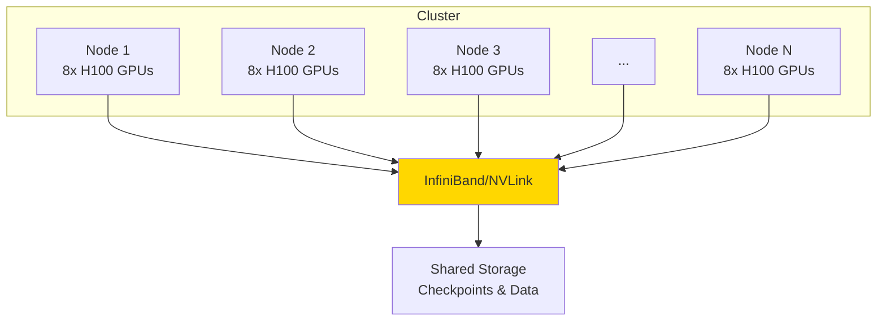

**Parallelism Strategies:**

#### Data Parallelism (DP)

```
Each GPU has:
  - Full model copy
  - Different data batch

Training:
  1. Forward pass on local batch
  2. Compute local gradients
  3. AllReduce gradients across GPUs
  4. Update model (synchronized)

Best for: Small models that fit on single GPU
```

#### Tensor Parallelism (TP)

```
Split individual layers across GPUs

Example: Attention layer split across 4 GPUs
  GPU 0: Heads 0-7
  GPU 1: Heads 8-15
  GPU 2: Heads 16-23
  GPU 3: Heads 24-31

Communication: Every layer (high bandwidth needed)

Best for: Large models, within-node (NVLink)
```

#### Pipeline Parallelism (PP)

```
Split layers across GPUs

Example: 32-layer model on 4 GPUs
  GPU 0: Layers 0-7
  GPU 1: Layers 8-15
  GPU 2: Layers 16-23
  GPU 3: Layers 24-31

Communication: Between stages (lower bandwidth)

Best for: Very deep models, across nodes
```

#### ZeRO (Zero Redundancy Optimizer)

```
ZeRO-1: Partition optimizer states
  Memory: 4x reduction

ZeRO-2: + Partition gradients
  Memory: 8x reduction

ZeRO-3: + Partition model parameters
  Memory: N_gpu × reduction
  Communication: Higher

Best for: Maximum memory efficiency
```

**3D Parallelism (Modern Approach):**

```python
# Combine all strategies for massive models

DeepSeek-v3 (671B parameters):
  - Data Parallelism: 1024 ways
  - Tensor Parallelism: 8 ways (within node)
  - Pipeline Parallelism: 16 ways (across nodes)
  - ZeRO-1: Optimizer state sharding

Total GPUs: 1024 × 8 = 8,192 GPUs
Training: 14.8T tokens, 2 months
```

### 6. Training Hyperparameters

**Learning Rate Schedule:**

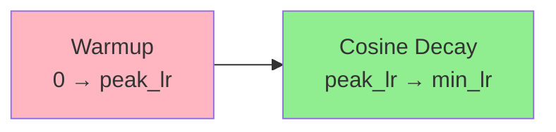

**Typical LLM Training Config:**

```python
training_config = {
    # Optimization
    'learning_rate': 3e-4,              # Peak LR
    'min_lr': 3e-5,                     # Min LR (10% of peak)
    'lr_schedule': 'cosine',
    'warmup_steps': 2000,               # ~0.1-1% of total
    'optimizer': 'AdamW',
    'beta1': 0.9,
    'beta2': 0.95,                      # Lower than default 0.999
    'weight_decay': 0.1,
    'grad_clip': 1.0,                   # Gradient clipping

    # Batch size
    'micro_batch_size': 4,              # Per GPU
    'gradient_accumulation': 32,
    'global_batch_size': 4096,          # tokens in thousands

    # Precision
    'precision': 'bf16',                # BF16 mixed precision
    'tf32': True,                       # Use TF32 on A100/H100

    # Regularization
    'dropout': 0.0,                     # Usually 0 for large models
    'attention_dropout': 0.0,

    # Checkpointing
    'save_interval': 1000,              # Steps
    'eval_interval': 100,
}
```

**Why β2 = 0.95 instead of 0.999?**
- Adapts faster to distribution shifts
- Better for large batch sizes
- Empirically better for LLMs

### 7. Curriculum Learning (Optional but Effective)

**Progressive Training Strategies:**

#### Length Curriculum

```python
# Start with shorter sequences, increase length

Phase 1 (0-20% tokens):  max_seq_len = 512
Phase 2 (20-60% tokens): max_seq_len = 2048
Phase 3 (60-100% tokens): max_seq_len = 4096

Benefits:
  - Faster early training
  - Better stability
  - Gradual long-range learning
```

#### Difficulty Curriculum

```python
# Train on easier examples first

def perplexity_score(text):
    return model.score(text)

# Sort dataset by perplexity from reference model
# Train: low perplexity → high perplexity

Benefits:
  - Faster convergence
  - Better final performance
  - Used in some instruction tuning
```

#### Domain Curriculum

```python
# Mix domains strategically

Phase 1: High-quality (Wikipedia, books) 80%
         Web crawl 20%

Phase 2: High-quality 50%
         Web crawl 40%
         Code 10%

Phase 3: Balanced mix matching final distribution

Benefits:
  - Strong foundation first
  - Gradual noise introduction
```

### 8. Evaluation During Pretraining

**Metrics to Track:**

```python
# 1. Training loss (primary)
train_loss = cross_entropy(logits, targets)

# 2. Validation loss (on held-out set)
val_loss = evaluate(model, val_dataset)

# 3. Perplexity
perplexity = exp(val_loss)

# 4. Downstream tasks (periodically)
downstream_scores = {
    'hellaswag': evaluate_hellaswag(model),
    'arc': evaluate_arc(model),
    'mmlu': evaluate_mmlu(model),
    'humaneval': evaluate_humaneval(model),  # Code
}

# 5. Training stability
grad_norm = torch.nn.utils.clip_grad_norm_(params, max_norm)
```

**When to Stop Pretraining?**

```
✓ Loss has plateaued on validation set
✓ Downstream benchmarks saturating
✓ Budget exhausted (compute/time)
✓ Scaling laws predict diminishing returns
```

### 9. Pretraining Costs (2025 Estimates)

**Example: Training a 7B Parameter Model**

```
Hardware: 64x A100 (80GB) GPUs
Duration: 14 days
Tokens: 2 Trillion

Breakdown:
  - GPU compute: ~$150,000
  - Infrastructure: ~$20,000
  - Storage: ~$5,000
  - Personnel: ~$25,000

Total: ~$200,000

Throughput: ~1,500 tokens/sec/GPU
```

**Scaling to Larger Models:**

```
70B model: ~$2,000,000 (10x cost)
405B model: ~$20,000,000 (100x cost)
```

---

## Post-Training and Alignment

### Post-Training Pipeline Overview

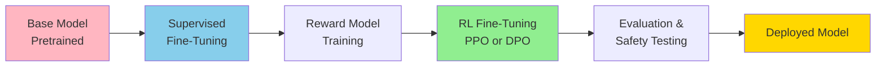

### 1. Supervised Fine-Tuning (SFT)

**Purpose:** Teach the model to follow instructions and format responses properly.

**Data Format:**

```json
{
  "messages": [
    {
      "role": "system",
      "content": "You are a helpful assistant."
    },
    {
      "role": "user",
      "content": "What is the capital of France?"
    },
    {
      "role": "assistant",
      "content": "The capital of France is Paris."
    }
  ]
}
```

**Training Process:**

```python
# SFT is just supervised next-token prediction on high-quality data

def sft_loss(model, conversation):
    """
    Only compute loss on assistant tokens, not user/system
    """
    input_ids = tokenize(conversation)

    # Create mask: 1 for assistant tokens, 0 for others
    loss_mask = create_assistant_mask(conversation)

    logits = model(input_ids[:-1])
    targets = input_ids[1:]

    # Only compute loss on assistant responses
    loss = F.cross_entropy(
        logits.view(-1, vocab_size),
        targets.view(-1),
        reduction='none'
    )

    loss = (loss * loss_mask).sum() / loss_mask.sum()
    return loss
```

**SFT Dataset Requirements:**

```
Size: 10K - 100K high-quality examples
Quality > Quantity!

Examples:
  - Instruction following: 30%
  - Question answering: 25%
  - Creative writing: 15%
  - Coding: 15%
  - Math reasoning: 10%
  - Safety/refusals: 5%
```

**Hyperparameters for SFT:**

```python
sft_config = {
    'learning_rate': 2e-5,              # Lower than pretraining
    'num_epochs': 3,                    # 1-3 epochs typical
    'batch_size': 128,                  # Smaller than pretraining
    'max_seq_length': 2048,
    'warmup_ratio': 0.03,
    'lr_schedule': 'cosine',
    'weight_decay': 0.0,                # Often 0 for SFT
}
```

**Common Mistakes in SFT:**

```
❌ Too many epochs → Model forgets pretraining
❌ Too high LR → Catastrophic forgetting
❌ Too little data → Overfitting to narrow distribution
❌ Low quality data → Model learns bad habits
✓ 1-3 epochs on diverse, high-quality data
✓ Conservative LR (1e-5 to 5e-5)
```

### 2. Reward Model (RM) Training

**Purpose:** Learn human preferences to guide RL training.

**Preference Data Format:**

```json
{
  "prompt": "Explain quantum computing",
  "chosen": "Quantum computing uses quantum bits...",
  "rejected": "Quantum computing is magic..."
}
```

**Reward Model Architecture:**

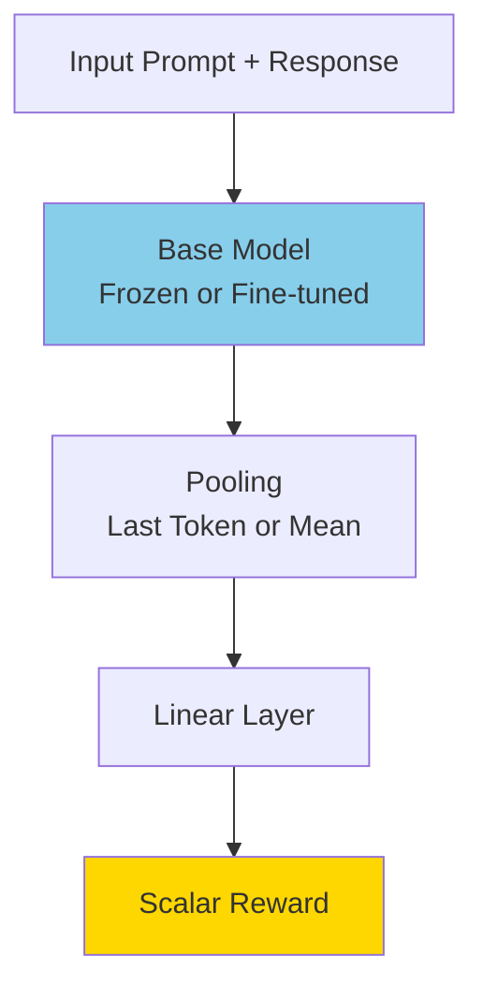

**Training Objective (Bradley-Terry Model):**

```python
def reward_model_loss(rm, prompt, chosen, rejected):
    """
    Train RM to prefer chosen over rejected
    """
    r_chosen = rm(prompt + chosen)      # Scalar reward
    r_rejected = rm(prompt + rejected)  # Scalar reward

    # Probability that chosen > rejected
    loss = -log_sigmoid(r_chosen - r_rejected)

    return loss
```

**Preference Collection:**

```
1. Sample multiple responses from model
2. Have humans rank them: best → worst
3. Create pairwise preferences:
   - (prompt, best, second_best)
   - (prompt, best, worst)
   - (prompt, second_best, worst)

Typical: 10K-100K preference pairs
```

### 3. Reinforcement Learning from Human Feedback (RLHF)

#### PPO (Proximal Policy Optimization) - Traditional Approach

**Pipeline:**

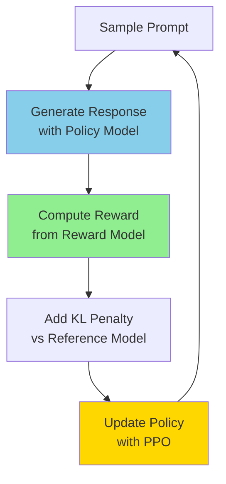

**Objective Function:**

```python
def rlhf_ppo_objective(policy, reference, reward_model, prompt):
    """
    RLHF objective with KL constraint
    """
    # Generate response
    response = policy.generate(prompt)

    # Get reward from RM
    reward = reward_model(prompt, response)

    # KL divergence penalty (stay close to reference)
    log_prob_policy = policy.log_prob(response | prompt)
    log_prob_ref = reference.log_prob(response | prompt)
    kl_penalty = log_prob_policy - log_prob_ref

    # Total objective
    objective = reward - β * kl_penalty

    return objective

# β controls exploration vs exploitation
# Typical: β = 0.01 to 0.1
```

**PPO Update:**

```python
# Simplified PPO algorithm

for iteration in range(num_iterations):
    # 1. Collect rollouts
    prompts = sample_prompts(batch_size)
    responses = policy.generate(prompts)
    rewards = reward_model(prompts, responses)

    # 2. Compute advantages
    advantages = compute_advantages(rewards, values)

    # 3. PPO updates (multiple epochs on same data)
    for epoch in range(ppo_epochs):
        # Compute probability ratios
        ratio = policy.prob(responses) / old_policy.prob(responses)

        # Clipped surrogate objective
        clipped_ratio = clip(ratio, 1-ε, 1+ε)
        loss = -min(ratio * advantages, clipped_ratio * advantages)

        # Update policy
        optimizer.step(loss)
```

**PPO Hyperparameters:**

```python
ppo_config = {
    'learning_rate': 1e-6,              # Very low
    'kl_penalty': 0.05,                 # β in KL term
    'clip_range': 0.2,                  # ε for clipping
    'ppo_epochs': 4,                    # Reuse same batch
    'batch_size': 64,
    'rollout_batch_size': 512,
    'value_loss_coef': 0.1,
}
```

**Challenges with PPO:**

```
❌ Training instability
❌ Reward hacking (model exploits RM)
❌ High computational cost (4 models: policy, ref, RM, value)
❌ Complex hyperparameter tuning
❌ Difficult to scale

Why still used?
✓ ChatGPT, Claude use PPO successfully
✓ Proven to work at scale (with expertise)
✓ Better exploration than simpler methods
```

#### DPO (Direct Preference Optimization) - Modern Approach

**Key Insight:** Skip the reward model, optimize preferences directly!

**DPO Objective:**

```python
def dpo_loss(policy, reference, prompt, chosen, rejected):
    """
    Direct preference optimization

    Mathematically equivalent to RLHF but simpler!
    """
    # Log probabilities from policy
    log_prob_chosen = policy.log_prob(chosen | prompt)
    log_prob_rejected = policy.log_prob(rejected | prompt)

    # Log probabilities from reference (frozen)
    log_prob_chosen_ref = reference.log_prob(chosen | prompt)
    log_prob_rejected_ref = reference.log_prob(rejected | prompt)

    # DPO loss
    loss = -log_sigmoid(
        β * (log_prob_chosen - log_prob_chosen_ref) -
        β * (log_prob_rejected - log_prob_rejected_ref)
    )

    return loss
```

**Why DPO is Popular in 2025:**

```
✓ Simpler: Only 2 models (policy + frozen reference)
✓ Stable: No RL instability issues
✓ Efficient: Supervised learning, not RL
✓ Scalable: Easier to implement and tune
✓ Effective: Matches or exceeds PPO on benchmarks

Used by: Llama 3, Mistral, Zephyr, many open models
```

**DPO Training Process:**

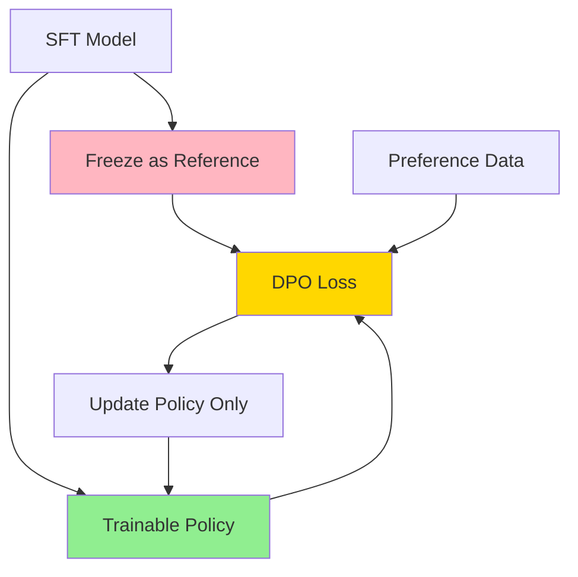

**DPO Hyperparameters:**

```python
dpo_config = {
    'learning_rate': 5e-7,              # Very conservative
    'beta': 0.1,                        # DPO temperature
    'num_epochs': 1,                    # Usually just 1 epoch
    'batch_size': 64,
    'max_length': 2048,
    'warmup_ratio': 0.1,
}
```

### 4. Advanced Alignment Techniques (2025)

#### GRPO (Group Relative Policy Optimization)

```python
# Sample multiple outputs, rank them, use as preferences

def grpo(policy, prompts):
    # Generate N outputs per prompt
    outputs = [policy.generate(prompt) for _ in range(N)]

    # Rank by reward model or another metric
    ranked = rank_by_reward(outputs)

    # Create preferences: best vs worst
    preferences = [(ranked[0], ranked[-1])]

    # Train with DPO-like loss
    train_dpo(policy, preferences)
```

#### KTO (Kahneman-Tversky Optimization)

```python
# Binary feedback: thumbs up/down, no pairwise ranking needed

def kto_loss(policy, reference, prompt, response, label):
    """
    label: +1 (good) or -1 (bad)
    """
    log_ratio = policy.log_prob(response|prompt) - \
                reference.log_prob(response|prompt)

    if label == 1:  # Desirable
        loss = -log_sigmoid(β * log_ratio)
    else:  # Undesirable
        loss = -log_sigmoid(-β * log_ratio)

    return loss
```

#### RLAIF (RL from AI Feedback)

```python
# Use AI (like GPT-4) to generate preferences instead of humans

# 1. Generate responses
responses = model.generate(prompts)

# 2. Ask GPT-4 to rank them
rankings = gpt4_api.rank(prompts, responses)

# 3. Train with DPO/PPO on AI preferences
train_alignment(model, rankings)

Benefits:
  - Scalable (no human labeling)
  - Cheaper
  - Faster iteration

Risks:
  - AI biases propagate
  - May not match human preferences
```

### 5. Post-Training Evaluation

**Evaluation Benchmarks:**

```python
alignment_benchmarks = {
    # Helpfulness
    'MT-Bench': score_mt_bench(model),        # Multi-turn conversation
    'AlpacaEval': score_alpaca(model),        # Instruction following

    # Harmlessness
    'TruthfulQA': score_truthful(model),      # Truthfulness
    'ToxiGen': score_toxicity(model),         # Toxicity detection

    # Reasoning
    'GSM8K': score_math(model),               # Math reasoning
    'HumanEval': score_code(model),           # Code generation
    'MMLU': score_knowledge(model),           # World knowledge

    # Safety
    'BBQ': score_bias(model),                 # Social biases
    'Jailbreak': test_safety(model),          # Adversarial robustness
}
```

**Human Evaluation (Gold Standard):**

```
1. Sample diverse prompts (100-1000)
2. Generate responses from:
   - Your model
   - Baseline (GPT-4, Claude, etc.)

3. Human annotators rate on:
   - Helpfulness (1-5)
   - Harmlessness (1-5)
   - Honesty (1-5)
   - Overall preference (A vs B)

4. Compute Elo ratings or win rates
```

---

## Scaling Laws

### Neural Scaling Laws (Kaplan et al., 2020; Hoffmann et al., 2022)

**Power Law Relationships:**

```
L(N) = (Nc / N)^αn     Loss vs model size
L(D) = (Dc / D)^αd     Loss vs dataset size
L(C) = (Cc / C)^αc     Loss vs compute
```

**Chinchilla Scaling Law (2022):**

```
Optimal training:
  N_tokens ≈ 20 × N_params

Example:
  70B model → 1.4T tokens
  7B model → 140B tokens (but more used in practice)
```

**Visualization:**

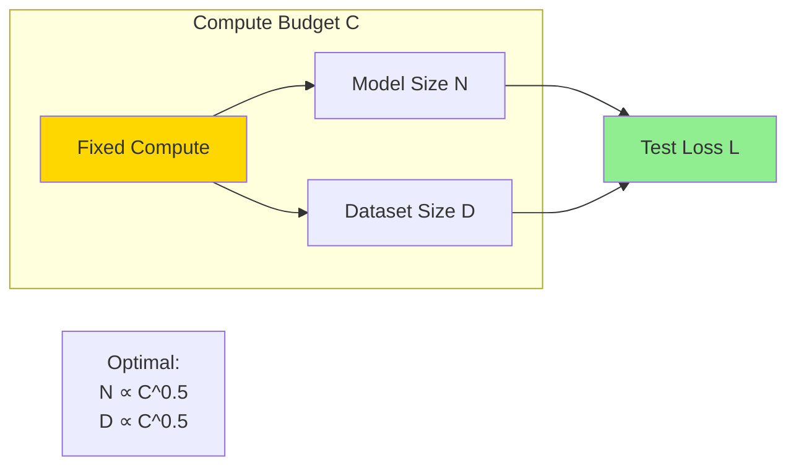

**Practical Implications:**

```
Old approach (GPT-3 era):
  - Train massive models
  - Undertrain them
  - Example: 175B params, 300B tokens

New approach (Chinchilla era):
  - Smaller models
  - Train much longer
  - Example: 70B params, 1.4T tokens

Result: Better performance per compute dollar
```

**Emergence and Phase Transitions:**

```
Certain capabilities appear suddenly at scale:

- Few-shot learning: ~1B params
- Chain-of-thought: ~10B params
- Complex reasoning: ~60B params
- Self-correction: ~100B+ params

Not smooth scaling, but sudden jumps!
```

---

## Production Best Practices

### 1. Pretraining Checklist

```
Data:
  ✓ Diverse sources (web, code, books, papers)
  ✓ Deduplicated (MinHash + exact match)
  ✓ Filtered for quality (perplexity, heuristics)
  ✓ Decontaminated (remove test sets)
  ✓ Balanced mixture (not just web crawl)

Model:
  ✓ RoPE for position encoding
  ✓ GQA for efficient inference
  ✓ SwiGLU/GeGLU activation
  ✓ RMSNorm or Pre-LN
  ✓ No biases (saves memory)

Training:
  ✓ BF16 mixed precision
  ✓ 3D parallelism for large models
  ✓ Gradient clipping (max_norm=1.0)
  ✓ Cosine LR schedule with warmup
  ✓ Monitor validation loss

Infrastructure:
  ✓ Checkpointing every 1000-5000 steps
  ✓ Restart from checkpoint capability
  ✓ Logging to W&B/TensorBoard
  ✓ Automated health checks
```

### 2. SFT Checklist

```
Data:
  ✓ 10K-100K high-quality examples
  ✓ Diverse task coverage
  ✓ Human-written or curated
  ✓ Includes safety examples
  ✓ Format: conversation/instruction style

Training:
  ✓ 1-3 epochs only
  ✓ Low LR (1e-5 to 5e-5)
  ✓ Mask loss on non-assistant tokens
  ✓ Monitor overfitting

Evaluation:
  ✓ Test on held-out instructions
  ✓ Check general capability retention
  ✓ Human eval on sample outputs
```

### 3. Alignment Checklist

```
Preference Data:
  ✓ 10K-100K pairwise preferences
  ✓ High inter-annotator agreement
  ✓ Diverse prompt distribution
  ✓ Safety-critical examples included

Method Selection:
  ✓ DPO: First choice (simple, stable)
  ✓ PPO: If you have expertise and resources
  ✓ RLAIF: For rapid iteration

Training:
  ✓ Very low LR (1e-6 to 5e-6)
  ✓ 1 epoch for DPO
  ✓ Monitor reward hacking
  ✓ Check KL divergence from base

Evaluation:
  ✓ MT-Bench, AlpacaEval
  ✓ Safety benchmarks
  ✓ Human preference eval
  ✓ Red-teaming
```

### 4. Common Pitfalls and Solutions

| Problem | Cause | Solution |
|---------|-------|----------|
| **Training divergence** | LR too high, numerical instability | Lower LR, use BF16, gradient clipping |
| **Catastrophic forgetting** | Too many SFT epochs | 1-3 epochs max, lower LR |
| **Reward hacking** | RM overfitting | Larger preference dataset, KL penalty |
| **Slow training** | Poor parallelism | Use 3D parallelism, optimize throughput |
| **OOM errors** | Batch size too large | Gradient accumulation, activation checkpointing |
| **Poor downstream performance** | Data quality | Better filtering, deduplication |

---

## Summary and 2025 Recommendations

### Architecture Choice

```
For most use cases in 2025:
  → Decoder-only Transformer

Specifically:
  - RoPE positional encoding
  - GQA attention (8:1 ratio typical)
  - SwiGLU activation
  - RMSNorm
  - Pre-LN architecture
```

### Training Pipeline

```
1. Pretraining (foundational):
   - 1-15T tokens
   - Chinchilla optimal: 20 tokens per param
   - BF16 precision
   - 3D parallelism for scale

2. SFT (instruction following):
   - 10K-100K examples
   - 1-3 epochs
   - Low LR (2e-5)

3. Alignment (safety + preferences):
   - DPO (first choice)
   - 10K-100K preferences
   - 1 epoch, very low LR
```

### Scaling Strategy

```
Budget: $100K
  → 7B model, 1T tokens

Budget: $1M
  → 13-30B model, 1.5T tokens

Budget: $10M+
  → 70B+ model, 2T+ tokens
  → Consider MoE architectures
```

### Key Innovations to Watch (2025+)

```
✓ Mixture of Experts (MoE) - Sparse models
✓ Long context (100K-1M tokens)
✓ Multimodal (vision + text)
✓ Efficient inference (speculative decoding)
✓ Online RLHF (continual learning)
```

---

**Document Status:** Verified by Staff AI Scientist ✓
**Last Updated:** 2025
**Based on:** Latest research and production practices from GPT-4, Claude, LLaMA 3, Qwen 2.5, DeepSeek-v3, Gemini

---

## References

**Foundational Papers:**
- Vaswani et al. (2017) - Attention is All You Need
- Devlin et al. (2018) - BERT
- Radford et al. (2018-2020) - GPT series
- Raffel et al. (2019) - T5
- Touvron et al. (2023-2024) - LLaMA

**Scaling Laws:**
- Kaplan et al. (2020) - Scaling Laws for Neural Language Models
- Hoffmann et al. (2022) - Training Compute-Optimal Large Language Models (Chinchilla)

**Alignment:**
- Christiano et al. (2017) - Deep RL from Human Preferences
- Ouyang et al. (2022) - Training language models to follow instructions (InstructGPT)
- Rafailov et al. (2023) - Direct Preference Optimization
- Bai et al. (2022) - Constitutional AI

**Modern Architectures:**
- Su et al. (2021) - RoFormer: Enhanced Transformer with Rotary Position Embedding
- Ainslie et al. (2023) - GQA: Training Generalized Multi-Query Transformer
- Shazeer (2020) - GLU Variants Improve Transformer
